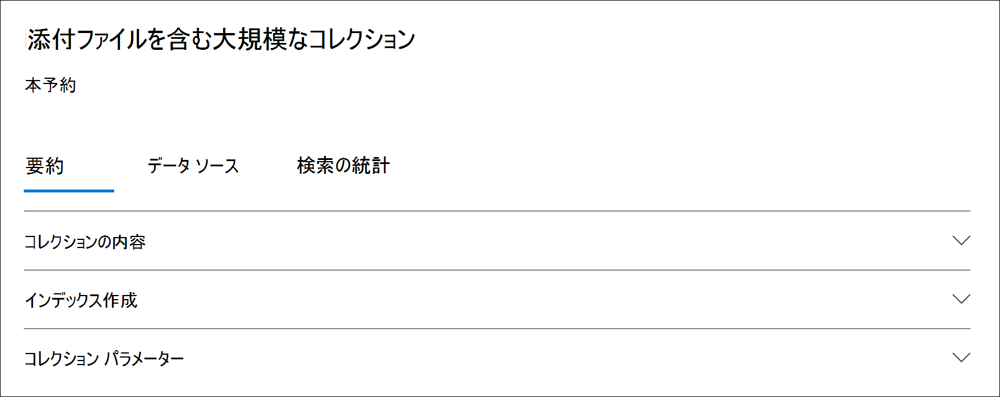

# コレクションの統計とレポート (Advanced eDiscovery

下書きコレクションを作成した後は、検索基準に一致したアイテムが最も多く含まれるコンテンツの場所や、検索クエリによって返されるアイテムの数など、取得したアイテムに関する統計情報を表示できます。 結果のサブセットをプレビューできます。

さらに調べるドキュメントのセットを特定した場合は、検索結果をレビュー セットに追加して収集および処理できます。

## 下書きコレクションの統計とレポート

このセクションでは、下書きコレクションで使用できる統計情報について説明します。 これらの統計情報は、 **下書き** コレクションのフライアウト ページの [検索統計] タブで使用できます。

### コレクションの見積もり

このセクションでは、コレクションによって返される推定アイテムの概要をグラフィカルに表示します。 これは、コレクションの検索条件に一致するアイテムの数を示します。 この情報は、コレクションによって返されるアイテムの推定数に関するアイデアを提供します。

- **場所別の推定アイテム**: コレクションによって返される推定アイテムの総数。 メールボックスとサイト内にあるアイテムの特定の数も表示されます。

- **ヒットの推定場所**: コレクションによって返されるアイテムを含むコンテンツの場所の総数。 メールボックスとサイトの場所の特定の数も表示されます。

- **場所別のデータ ボリューム (MB 単位)**: コレクションによって返される推定アイテムの合計サイズ。 メールボックス アイテムとサイト アイテムの特定のサイズも表示されます。

### 条件レポート

このセクションでは、コレクション検索クエリに関する統計情報と、検索クエリの異なる部分に一致した推定アイテムの数を表示します。 これらの統計を使用して、検索クエリの各コンポーネントに一致するアイテムの数を分析できます。 これにより、コレクションの検索条件を絞り込み、必要に応じてコレクションの範囲を絞り込むのに役立ちます。

- **場所の** 種類: クエリ統計が適用されるコンテンツの場所の種類。 この値は **Exchange** メールボックスの場所を示し、**値はサイト** SharePointを示します。

- **パーツ**: 統計が適用される検索クエリの部分。 **Primary は** 、検索クエリ全体を示します。 **キーワード** は、行内の統計情報が特定のキーワードに対する値を示します。 コレクション内の検索クエリにキーワード リストを使用する場合、クエリの各コンポーネントの統計情報が次の表に含まれます。

- **Condition**: 対応する行に表示される統計情報を返した下書きコレクションに対して実行された検索クエリの実際のコンポーネント (キーワードまたは条件)。

- **ヒットのある場所**: [条件] 列にリストされているプライマリ クエリまたはキーワード クエリに一致するアイテムを含むコンテンツの場所 ([場所の種類] 列で指定) の **数**。

- **アイテム**: [条件] 列に一覧表示されているクエリに一致するアイテムの数 (指定したコンテンツの場所 **から** )。 前に説明したように、検索中のキーワードの複数のインスタンスがアイテムに含まれている場合、この列には 1 回だけカウントされます。

- **サイズ (MB)**: [条件] 列の検索クエリに一致する (指定したコンテンツの場所で) 見つかったすべてのアイテムの **合計サイズ。**

### トップの場所

このセクションでは、コレクションによって返されるアイテムが最も多い特定のコンテンツの場所に関する統計情報を表示します。

- 場所名 (メールボックスの電子メール アドレスとサイトの URL) の名前。

- 場所の種類 (メールボックスまたはサイト)。

- コレクションによって返されるコンテンツの場所のアイテムの推定数。

- 各コンテンツの場所の推定アイテムの合計サイズ。

## コミットされたコレクションの統計情報とレポート

このセクションでは、コレクションをレビュー セットにコミットした後に使用できる統計情報について説明します。これには、レビュー セットに追加された実際のアイテム数も含まれます。 これらの統計情報 (読み込みセット情報に加えて) は、ケースに追加されたコンテンツに関する履歴情報を提供します。

コレクションをレビュー セットにコミットすると、コミットされた接続のフライアウト ページに次のタブが表示されます。 これらの各タブには、コレクションに関するさまざまな種類の情報が含まれています。

### コレクションの内容

[概要] タブ **のこの** セクションには、コレクション内のデータ ソースから収集され、レビュー セットに追加されたアイテムに関する統計などの情報が含まれています。

- **抽出されたアイテムの合計**。 レビュー セットに追加されたアイテムの総数。 この番号は、レビュー セットに追加された親アイテムと子アイテムの合計を示します。

  > [!TIP]
  > 親項目または子項目バーの上にカーソルを合わせると、親アイテムまたは子アイテムの総数が表示されます。

- **親アイテム**。 レビュー セットに追加されたアイテムを収集するために使用されたコレクションによって返されるアイテムの数。 この数値は、[コレクション パラメーター] セクションに表示されるアイテムの推定数に対応します (および、同 **じ数** です)。 レビュー セットに追加されたアイテムの収集に使用された親アイテムの数。
 
   親アイテムには、複数の子アイテムが含まれている場合があります。 たとえば、添付ファイルが含まれている場合、またはクラウド添付ファイルがある場合、電子メール メッセージは親アイテムです。 この場合、添付ファイルまたはクラウド添付ファイルのターゲット ファイルは子アイテムと見なされます。 コレクションをコミットすると、親アイテムと対応する子アイテム (添付ファイルやクラウド添付ファイルなど) が、個々のアイテムまたはファイルとしてレビュー セットに追加されます。

- **子アイテム**。 レビュー セットに追加された子アイテムの数。 ファイル添付ファイルとクラウド添付ファイルである子アイテムだけが、個々のファイルとしてレビュー セットに追加されます。 メールの署名や画像などの他の種類の子アイテムは、親アイテムから抽出され、光学式文字認識 (OCR) によって処理され、子アイテムから任意のテキストを抽出します。 次に、これらの種類の子アイテムから抽出されたテキストが親アイテムに追加され、レビュー セットで表示できます。 子アイテムを別のファイルとしてレビュー セットに追加しない場合、Advanced eDiscovery は、レビュー セット内の重要ではない可能性のあるアイテムの数を制限することで、レビュー プロセスを合理化するのに役立ちます。

- **一意のアイテム**。 レビュー セットに追加された一意のアイテムの数。 一意のアイテムは、レビュー セットに固有です。 最初のコレクションが新しいレビュー セットに追加された場合は、以前のアイテムがレビュー セットに含めていないので、すべてのアイテムが一意です。

- **識別された重複するアイテム**。 同じアイテムが既にレビュー セットに存在するために、レビュー セットに追加されなかったコレクションのアイテムの数。 重複アイテムに関する統計情報は、下書きコレクションの推定アイテム数とレビュー セットに追加された実際のアイテム数の違いを説明するのに役立ちます。

### インデックス作成

コミット **されたレビュー セット** の [ **概要** ] タブの [インデックス] セクションには、レビュー セットに追加されたアイテムに関するインデックス情報が含まれています。

**新しいインデックス付きアイテム**。 レビュー セットに追加される前に新しくインデックスが作成されたアイテムの数。 新しくインデックス付けされたアイテムの例は、親アイテムから抽出され、レビュー セットに追加される前にインデックス付けされた子アイテムです。 また、ケースの [データ ソース] タブにリストされている保管データ ソースと保管されていないコンテンツの場所に含まなかったアイテムは、レビューに追加される前にインデックスが作成されます。 たとえば、新しくインデックスが作成されたアイテムには、追加の場所から収集されたアイテムが含まれます。

**インデックス付きアイテムを更新しました**。 インデックスが正常に作成され、レビュー セットに追加された部分的にインデックスが作成されたアイテムの数。 この統計は、コレクションがレビュー セットにコミットされた際に正常にインデックスが作成された、保管および保管されていないコンテンツの場所の部分的にインデックス付けされたアイテムを示します。

**インデックス作成エラー**。 レビュー セットに追加する前にインデックスを作成できなかった部分的にインデックス付けされたアイテムの数。 これらのアイテムには、エラー修復が必要な場合があります。

### コレクション パラメーター

このセクションには、レビュー セットに追加されたアイテムの収集に使用されたコレクション情報が表示されます。 このタブには、[検索統計] タブの情報に似た **情報が表示** されます。このセクションでは、コレクションで使用される検索クエリ、検索されたコンテンツの場所、および推定コレクションの結果を簡単に示します。 前に説明したように、このセクションの推定アイテム数は、[コレクションの内容] セクションに表示される親アイテムの数 **と等し** くなります。

### [検索統計] タブ

[検索の統計情報] **タブに** 表示される統計情報は、下書きコレクションが前回実行された統計と同じです。 これには、コレクションの見積もり、条件レポート、上位の場所が含まれます。 この情報は、履歴参照のために下書きコレクションから保持され、レビュー セットにコミットされた実際のコレクションと比較できます。

## 下書きコレクションの見積もりと実際のコミット済みコレクションの違い

下書きコレクションを実行すると、コレクションの条件を満たすアイテム数 (および合計サイズ) の見積もりが 、[検索統計] タブの [概要] タブと [コレクションの見積もり] セクション **に表示** されます。下書きコレクションをレビュー セットにコミットした後、レビュー セットに追加された実際のアイテム数 (および合計サイズ) は、多くの場合、見積もりとは異なります。 ほとんどの場合、下書きコレクションから推定されたアイテムよりも多くのアイテムがレビュー セットに追加されます。 次の一覧では、これらの違いの最も一般的な理由と、それらを識別するためのヒントについて説明します。

- **子アイテム**。 親アイテムから抽出され、個々のファイルとして追加される子アイテム (ファイルの添付ファイルやクラウド添付ファイルなど)。 子アイテムの数は、レビュー セットに実際に追加されるアイテムの数を増やします。 一般に、コミットされたコレクションの [概要] タブの [コレクションの内容] セクションで識別される親アイテムの数は、下書きコレクションの推定アイテム数と等しい必要があります。

- **重複するアイテム**。 前のコレクションのレビュー セットに既に追加されている下書きコレクションのアイテムは追加されません。 前に説明したように、コレクション内の重複するアイテムの数は、[概要]  タブの [コレクションの内容] セクション **に表示** されます。

- **コレクション構成オプション**。 下書きコレクションをレビュー セットにコミットする場合は、会話スレッド、クラウド添付ファイル、およびドキュメントバージョンを含めるオプションが必要です。 レビュー セットに追加されるこれらのアイテムは、下書きコレクションの見積もりには含まれません。 これらは、コレクションをコミットするときにのみ識別され、収集されます。 これらのオプションを選択すると、ほとんどの場合、レビュー セットに追加されるアイテムの数が増える可能性があります。 

    たとえば、複数のバージョンの SharePoint ドキュメントは、下書きコレクションの見積もりには含まれません。 ただし、下書きコレクションをコミットするときにすべてのドキュメント バージョンを含めるオプションを選択すると、レビュー セットに追加されたアイテムの実際の数 (および合計サイズ) が増加します。

    これらのオプションの詳細については、「下書き [コレクションをレビュー セットにコミットする」を参照してください](commit-draft-collection.md#commit-a-draft-collection-to-a-review-set-in-advanced-ediscovery)。 

下書きコレクションの推定結果が実際のコミット結果と異なる場合がある他の理由を次に示します。

- **下書きコレクションの結果を推定する方法**。 下書きコレクションによって返される検索結果の推定値は、コレクションクエリ条件を満たすアイテムの推定値 (実際の数ではなく) です。 電子メール アイテムの見積もりをコンパイルするには、検索条件を満たすメッセージの一覧が Exchange データベースから要求されます。 ただし、コレクションをレビュー セットにコミットすると、コレクションは再実行され、実際のメッセージは Exchange データベースから取得されます。 したがって、推定アイテム数と実際のアイテム数がどのように決定されるのかによって、違いが生じ得る可能性があります。

- **下書きコレクションを見積もり、コミットする時間の間に発生する変更**。 下書きコレクションをレビュー セットにコミットすると、検索条件を満たす検索インデックス内の最新のアイテムを収集するために、検索が再実行されます。 下書きコレクションが最後に実行された時刻から下書きコレクションがレビュー セットにコミットされる時間の間に、検索条件を満たす追加のアイテムが作成、送信、または削除された可能性があります。 また、下書きコレクションの結果が推定されたときに検索インデックスに含められたアイテムは、コレクションをコミットする前にデータ ソースから削除されたため、存在しなくなった可能性もあります。 この問題を軽減する 1 つの方法は、コレクションの日付範囲を指定する方法です。 もう 1 つの方法は、コンテンツの場所を保留にし、アイテムを保持し、削除できない方法です。

- **インデックスが作成されていないアイテム**。 下書きコレクションにすべての Exchange メールボックスまたはすべての SharePoint サイトの検索が含まれている場合、コレクションの条件に一致するアイテムを含むコンテンツの場所からインデックスが作成されていないアイテムだけがレビュー セットに追加されます。 つまり、メールボックスまたはサイトに結果が見つからない場合、そのメールボックスまたはサイト内のインデックスのないアイテムはレビュー セットに追加されません。 ただし、すべてのコンテンツの場所からインデックスが作成されていないアイテム (コレクション クエリに一致するアイテムが含まれていないアイテムも含む) は、推定コレクション結果に含まれます。

    または、下書きコレクションに特定のコンテンツの場所 (つまり、下書きコレクション ウィザードの [追加の場所] ページで指定した特定のメールボックスまたはサイト) が含まれている場合は、検索で指定されたコンテンツの場所からインデックスのないアイテム (コレクション条件によって除外されない) がエクスポートされます。 この場合、インデックスが作成されていないアイテムの推定数と、レビュー セットに追加されるインデックスのないアイテムの数は同じになる必要があります。
