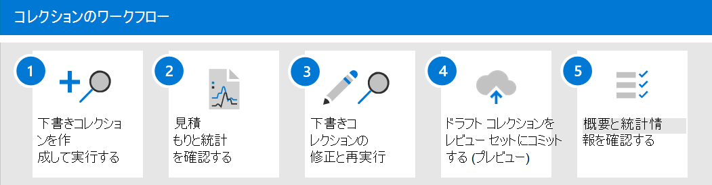

# 電子情報開示のコレクションについて学習する (プレミアム)

[!include[Purview banner](../includes/purview-rebrand-banner.md)]

組織は、調査や潜在的な訴訟に関連する可能性のあるコミュニケーションやコンテンツの収集に直面すると、最良の状況で大きな課題に直面します。 現在の現代の職場では、コンテンツの量、多様性、速度によってイノベーションとリモートワークが可能になり、同時に電子情報開示調査用のコレクションを管理するための要件とプロセスも拡張されています。

コレクション ワークフローは、ネイティブの場所とソースからコンテンツを抽出することに関する技術的な大きな課題です。 また、一般的な訴訟や調査のシナリオに対する評価と戦略の重要なポイントでもあります。 組織が調査の評価を開始すると、最初に質問される質問は誰が関与したかということです。 関係者を特定した後、これらのカストディアンは、関連するコンテンツを保持するためにすぐに保留にすることができます。 次の質問は、何が行われたかです。 調査に関するこの 2 番目の基本的な質問に答えるには、マネージャーがデータに目を向ける必要があります。 何が起こったのかについて最も関連性の高いコンテンツを迅速に評価するために、マネージャーは質問のターゲットを絞り込み始め、コレクションの結果が広すぎずに包括的であることを確認します。

電子情報開示 (プレミアム) のコレクションを使用すると、電子情報開示マネージャーは、電子メール、ドキュメント、Teamsの反応、およびMicrosoft 365内のその他のコンテンツの検索を迅速に範囲指定できます。 コレクションは、ケースに関連する可能性のあるコンテンツの見積もりをマネージャーに提供します。 これにより、マネージャーは、ケースに関連するコンテンツのサイズと範囲について、情報に基づいた迅速な意思決定を行うことができます。 電子情報開示マネージャーは、管理データ ソース (メールボックスやSharePoint サイトなど) を検索するコレクションを作成し、特定の検索条件 (キーワードや日付範囲など) を使用してコレクションの範囲をすばやく定義できます。

コレクションが定義されると、電子情報開示マネージャーはコレクションを下書きとして保存し、データ 量の見積もり、結果を含むコンテンツの場所、検索クエリ条件のヒット数など、見積もりを取得できます。 これらの分析情報は、電子情報開示ワークフローのレビューステージと分析ステージに進む前に、コレクションを変更してコレクションの範囲を絞り込むか拡張する必要があるかどうかを通知するのに役立ちます。

マネージャーがコレクションのスコープと、応答性が高い可能性のあるコンテンツの推定量に満足している場合、マネージャーはコンテンツをレビュー セットに追加または *コミット* できます。 コレクションをレビュー セットにコミットする場合、そのマネージャーには、チャット会話、クラウド添付ファイル、ドキュメント バージョンを含めるオプションもあります。 コレクション内のコンテンツは、レビュー セットへのインジェスト中に別のレベルの処理も実行されます。 コレクションは最終的なコレクションの概要で更新されます。 コンテンツがレビュー セットに追加されると、電子情報開示マネージャーはコンテンツのクエリ、グループ化、絞り込みを続行して、最小化とレビューに役立ちます。 さらに、コレクションは、レビュー セットにコミットされたコンテンツに関する情報と統計情報で更新されます。 これにより、コレクション内のコンテンツに関する履歴参照が提供されます。

電子情報開示 (プレミアム) のコレクションのリリースにより、[**検索**] タブは、Microsoft Purview コンプライアンス ポータルの電子情報開示 (プレミアム) ケースの **コレクション** に名前が変更されました。 コレクションのスコープとサイズを定義する手順は、検索と同じプロセスに従って場所と条件を定義します。 下書きとして保存し、プレビューの見積もりを取得すると、完全な検索とコレクションをレビュー セットにコミットする前に、コレクションの対象範囲を迅速に検証できます。 これにより、ジョブ管理が向上し、検索および収集プロセス中にコンテンツを最小限に抑え始める目的のイテレーションが可能になります。

## コレクションワークフロー

電子情報開示 (プレミアム) のコレクションの使用を開始するには、プロセスの各ステップの基本的なワークフローと説明を次に示します。

1. **下書きコレクションを作成して実行** します。 最初の手順では、下書きコレクションを作成し、検索する保管データ ソースと非保管データ ソースを定義します。 ケースに追加されていない他のデータ ソースを検索することもできます。 データ ソースを追加した後、ケースに関連するコンテンツをデータ ソースで検索するように検索クエリを構成します。 キーワード、プロパティ、条件を使用して、ケースに最も関連する可能性が高いコンテンツを返す検索クエリを作成できます。 詳細については、「 [下書きコレクションを作成する](create-draft-collection.md)」を参照してください。

2. **見積もりと統計を確認します**。 下書きコレクションを作成して実行した後、次の手順ではコレクションの統計情報を表示して、関連するコンテンツが見つかり、ヒット数が最も多いコンテンツの場所を確認します。 また、検索結果のサンプルをプレビューして、コンテンツが調査の範囲内にあるかどうかを判断するのに役立ちます。 詳細については、「 [下書きコレクションの統計とレポート」を](collection-statistics-reports.md#statistics-and-reports-for-draft-collections)参照してください。

3. **下書きコレクションを修正して再実行します**。 コレクションによって返される見積もりと統計に基づいて、検索されるデータ ソースと検索クエリを変更してコレクションを展開または絞り込むことで、下書きコレクションを編集できます。 コレクションにケースに最も関連するコンテンツが確実に含まれていると確信できるまで、下書きコレクションを更新して再実行できます。

4. **下書きコレクションをレビュー セットにコミットします**。 コレクションがケースに関連する型コンテンツを返す場合は、コレクションをレビュー セットにコミットできます。 コレクションをコミットするときに、会話スレッド、クラウド添付ファイル、およびドキュメント バージョンをレビュー セットに追加するオプションがあります。そのすべてがケースに関連している可能性があります。

   コレクションをコミットすると、メール署名や画像などの子アイテムが親アイテム (電子メール メッセージ、チャット メッセージ、ドキュメントなど) から抽出され、光学式文字認識 (OCR) によって処理されて子アイテムからテキストが抽出されます。 その後、子アイテムから抽出されたテキストが親アイテムに追加され、レビュー セットで表示できるようになります。 子アイテムを別のファイルとしてレビュー セットに追加しないことで、電子情報開示 (プレミアム) は、レビュー セットに追加される可能性のある重要でないアイテムの数を制限するのに役立ちます。 子項目の処理方法の詳細については、「 [コレクションの統計情報とレポート](collection-statistics-reports.md#collection-contents)」を参照してください。

   詳細については、「 [レビュー セットに下書きコレクションをコミットする」を](commit-draft-collection.md)参照してください。

5. **コレクションの概要と統計情報を確認します**。 コレクションをレビュー セットにコミットすると、コレクションに関する情報 (抽出されたアイテムに関する統計情報、ディープ インデックス作成、コレクションに使用される検索クエリ、アイテムの収集元のコンテンツの場所など) が保持されます。 また、コミットされたコレクションを編集または再実行することはできません。 コピーまたは削除できるのは、コピーまたは削除のみです。 コレクションを保持すると、レビュー セットに追加された収集されたアイテムの履歴レコードが提供されます。 詳細については、「 [コミットされたコレクションの統計とレポート」を](collection-statistics-reports.md#statistics-and-reports-for-committed-collections)参照してください。
