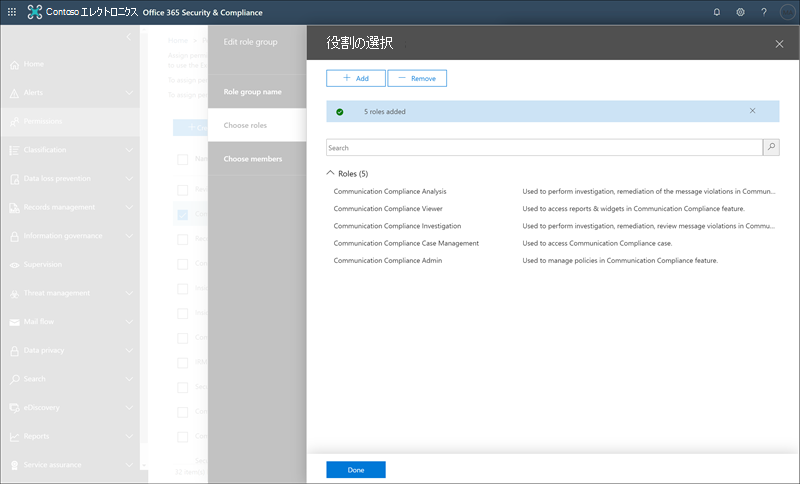

# ケーススタディ-Contoso 社は、Microsoft Teams、Exchange、Yammer の通信に対して、不快な言語ポリシーを迅速に構成します。Case study - Contoso quickly configures an offensive language policy for Microsoft Teams, Exchange, and Yammer communications

Microsoft 365 の通信コンプライアンスは、組織内の不適切なメッセージに対する修復措置を検出、取得、および解決するのに役立つため、コミュニケーションリスクを最小限に抑えることができます。Communication compliance in Microsoft 365 helps minimize communication risks by helping you detect, capture, and take remediation actions for inappropriate messages in your organization. 定義済みおよびカスタムのポリシーを使用すると、ポリシーの一致に関する内部通信と外部通信をスキャンして、指定したレビュー担当者がそれらを調査できるようにすることができます。Pre-defined and custom policies allow you to scan internal and external communications for policy matches so they can be examined by designated reviewers. レビューアーは、スキャンされた電子メール、Microsoft Teams、Yammer、または組織内のサードパーティの通信を調査し、適切な修復処置を行って、組織のメッセージ標準に準拠していることを確認できます。Reviewers can investigate scanned email, Microsoft Teams, Yammer, or third-party communications in your organization and take appropriate remediation actions to make sure they're compliant with your organization's message standards.

Contoso Corporation は、不快感を与える言葉を監視するポリシーをすばやく構成する必要がある架空の組織です。The Contoso Corporation is a fictional organization that needs to quickly configure a policy to monitor for offensive language. 従業員は主に、メール、Microsoft Teams、Yammer のサポートに Microsoft 365 を使用していましたが、workplace 嫌がらせに関して会社のポリシーを適用するための新しい要件があります。They have been using Microsoft 365 primarily for email, Microsoft Teams, and Yammer support for their employees but have new requirements to enforce company policy around workplace harassment. Contoso 社の IT 管理者およびコンプライアンスの専門家は、Microsoft 365 の使用に関する基本事項について基本的な理解を深めており、コミュニケーションのコンプライアンスをすばやく始める方法についてのエンドツーエンドのガイダンスを求めています。Contoso IT administrators and compliance specialists have a basic understanding of the fundamentals of working with Microsoft 365 and are looking for end-to-end guidance for how to quickly get started with communication compliance.

このケーススタディでは、有害な言語の通信を監視するための通信コンプライアンスポリシーをすばやく構成するための基本事項について説明します。This case study will cover the basics for quickly configuring a communication compliance policy to monitor communications for offensive language. このガイダンスには次のものが含まれます。This guidance includes:

- 手順 1-通信のコンプライアンスを計画するStep 1 - Planning for communication compliance
- 手順 2-Microsoft 365 での通信コンプライアンスへのアクセスStep 2 - Accessing communication compliance in Microsoft 365
- 手順 3-前提条件を構成し、通信コンプライアンスポリシーを作成するStep 3 - Configuring prerequisites and creating a communication compliance policy
- ステップ 4-通知の調査と修復Step 4 - Investigation and remediation of alerts

## 手順 1-通信のコンプライアンスを計画するStep 1 - Planning for communication compliance

Contoso 社の IT 管理者およびコンプライアンスの専門家は、Microsoft 365 のコンプライアンスソリューションに関するオンラインウェビナーに参加しており、コミュニケーションコンプライアンスポリシーが、workplace 嫌がらせを削減するために更新された企業ポリシー要件を満たすのを支援することを決定しました。Contoso IT administrators and compliance specialists attended online webinars about compliance solutions in Microsoft 365 and decided that communication compliance policies will help them meet the updated corporate policy requirements for reducing workplace harassment. 共同作業では、Microsoft Teams で送信されるチャット、Yammer のプライベートメッセージ、コミュニティの会話、Exchange Online で送信された電子メールメッセージなどを監視するための、通信コンプライアンスポリシーを作成し、有効にするための計画が策定されました。Working together, they've developed a plan to create and enable a communication compliance policy that will monitor for offensive language for chats sent in Microsoft Teams, private messages and community conversations in Yammer, and in email messages sent in Exchange Online. プランには、次の内容が含まれます。Their plan includes identifying:

- 通信コンプライアンス機能にアクセスする必要がある IT 管理者。The IT administrators that need access to communication compliance features.
- コミュニケーションポリシーを作成および管理する必要があるコンプライアンススペシャリスト。The compliance specialists that need to create and manage communication policies.
- コミュニケーションのコンプライアンス警告を調査および修復する必要がある、他の部門 (人事、法律など) のコンプライアンススペシャリストおよびその他の仕事仲間。The compliance specialists and other colleague in other departments (Human Resources, Legal, etc.) that need to investigate and remediate communication compliance alerts.
- 通信コンプライアンス不快な言語ポリシーの範囲内となるユーザー。The users that will be in-scope for the communication compliance offensive language policy.

### ライセンスLicensing

最初の手順は、Contoso 社の Microsoft 365 ライセンスに、コミュニケーションコンプライアンスソリューションのサポートが含まれていることを確認することです。The first step is to confirm that Contoso's Microsoft 365 licensing includes support for the communication compliance solution. 通信コンプライアンスにアクセスして使用するために、Contoso 社の IT 管理者は Contoso に次のいずれかの情報が含まれていることを確認する必要があります。To access and use communication compliance, Contoso IT administrators need to verify that Contoso has one of the following:

- Microsoft 365 E5 サブスクリプション (有料または試用版)Microsoft 365 E5 subscription (paid or trial version)
- Microsoft 365 E3 サブスクリプション + Microsoft 365 E5 コンプライアンスアドオンMicrosoft 365 E3 subscription + the Microsoft 365 E5 Compliance add-on
- Microsoft 365 E3 サブスクリプション + Microsoft 365 E5 Insider リスク管理アドオンMicrosoft 365 E3 subscription + the Microsoft 365 E5 Insider Risk Management add-on
- Microsoft 365 A5 サブスクリプション (有料または試用版)Microsoft 365 A5 subscription (paid or trial version)
- Microsoft 365 A3 サブスクリプション + Microsoft 365 A5 コンプライアンスアドオンMicrosoft 365 A3 subscription + the Microsoft 365 A5 Compliance add-on
- Microsoft 365 A3 サブスクリプション + Microsoft 365 A5 Insider リスク管理アドオンMicrosoft 365 A3 subscription + the Microsoft 365 A5 Insider Risk Management add-on
- Microsoft 365 G5 サブスクリプション (有料または試用版)Microsoft 365 G5 subscription (paid or trial version)
- Microsoft 365 G5 サブスクリプション + Microsoft 365 G5 コンプライアンスアドオンMicrosoft 365 G5 subscription + the Microsoft 365 G5 Compliance add-on
- Microsoft 365 G5 サブスクリプション + Microsoft 365 G5 Insider リスク管理アドオンMicrosoft 365 G5 subscription + the Microsoft 365 G5 Insider Risk Management add-on
- Office 365 Enterprise E5 サブスクリプション (有料または試用版)Office 365 Enterprise E5 subscription (paid or trial version)
- Office 365 Enterprise E3 サブスクリプション + Office 365 Advanced コンプライアンスアドオン (新しいサブスクリプションでは使用できなくなりました)。メモを参照してください。Office 365 Enterprise E3 subscription + the Office 365 Advanced Compliance add-on (no longer available for new subscriptions, see note)

また、通信コンプライアンスポリシーに含まれているユーザーに上記のいずれかのライセンスを割り当てる必要があることも確認する必要があります。They must also confirm that users included in communication compliance policies must be assigned one of the licenses above.

>[!IMPORTANT]
>Office 365 Advanced コンプライアンスは、スタンドアロンサブスクリプションとして販売されなくなりました。Office 365 Advanced Compliance is no longer sold as a standalone subscription. 現在のサブスクリプションの有効期限が切れた場合、お客様は上記のサブスクリプションのいずれかに移行する必要があります。これには、同じまたは追加のコンプライアンス機能が含まれます。When current subscriptions expire, customers should transition to one of the subscriptions above, which contain the same or additional compliance features.

Contoso 社の IT 管理者は、次の手順を実行して Contoso のライセンスサポートを確認します。Contoso IT administrators take the following steps to verify the licensing support for Contoso:

1. IT 管理者は、 **microsoft 365 管理センター** [https://admin.microsoft.com)にサインインして](https://admin.microsoft.com)、 **microsoft 365 管理センター** > **請求** > **ライセンス**に移動します。IT administrators sign in to the **Microsoft 365 admin center** [(https://admin.microsoft.com)](https://admin.microsoft.com) and navigate to **Microsoft 365 admin center** > **Billing** > **Licenses**.

2. ここでは、通信コンプライアンスのサポートを含む[ライセンスオプション](https://docs.microsoft.com/microsoft-365/compliance/communication-compliance-configure?view=o365-worldwide#before-you-begin)の1つを持っていることを確認します。Here they confirm that they have one of the [license options](https://docs.microsoft.com/microsoft-365/compliance/communication-compliance-configure?view=o365-worldwide#before-you-begin) that includes support for communication compliance.

### 通信コンプライアンスのアクセス許可Permissions for communication compliance

既定では、全体管理者は通信コンプライアンス機能にアクセスできません。By default, Global Administrators do not have access to communication compliance features. Contoso IT 管理者とコンプライアンス担当者がコミュニケーションコンプライアンスにアクセスできるように、[アクセス許可を構成する必要があり](https://docs.microsoft.com/microsoft-365/compliance/communication-compliance-configure?view=o365-worldwide#step-1-required-enable-permissions-for-communication-compliance)ます。[Permissions must be configured](https://docs.microsoft.com/microsoft-365/compliance/communication-compliance-configure?view=o365-worldwide#step-1-required-enable-permissions-for-communication-compliance) so that Contoso IT administrators and compliance specialists have access to communication compliance.

1. Contoso IT 管理者は、 **Office 365 セキュリティとコンプライアンスセンター**のアクセス許可ページにサインインします[(https://protection.office.com/permissions) ](https://protection.office.com/permissions)グローバル管理者アカウントの資格情報を使用して、Microsoft 365 の役割を表示および管理するためのリンクを選択します)。Contoso IT administrators sign into the **Office 365 Security and Compliance center** permissions page [(https://protection.office.com/permissions)](https://protection.office.com/permissions) using credentials for a global administrator account and select the link to view and manage roles in Microsoft 365.
2. [**作成**] を選択すると、新しい役割グループに [*通信コンプライアンス*] のフレンドリ名が与えられ、[**次へ**] を選択します。After selecting **Create**, they give the new role group a friendly name of "*Communication compliance*" and select **Next**.
3. [**役割の選択**] を選択し、[**追加**] を選択します。They select **Choose roles** and then select **Add**. 必要な役割を追加するには、*監督レビュー管理者*、*ケース管理*、*コンプライアンス管理者*、*およびレビュー*のチェックボックスをオンにし、[**追加**]、[**完了]、** [**次へ**] の順に選択します。They add the required roles by selecting the checkbox for *Supervisory Review Administrator*, *Case Management*, *Compliance Administrator*, and *Review*, then they select **Add**, **Done,** and **Next**.

4. 次に、IT 管理者は [**メンバーの選択**] を選択し、[**追加**] を選択します。Next, the IT administrators select **Choose members** then select **Add**. ポリシーを作成するすべてのユーザーとグループのチェックボックスをオンにして、ポリシーの一致でメッセージを管理します。The select the checkbox for all the users and groups that they want to create policies and manage messages with policy matches. 最初の計画で特定された人事および法務部門に IT 管理者、コンプライアンスの専門家、その他の仕事仲間を追加し、[**追加**]、[**完了**]、[**次へ**] を選択します。They add the IT administrators, compliance specialists, and other colleagues in Human Resources and Legal departments that they identified in the initial planning, then select **Add**, **Done**, and **Next**.
5. アクセス許可を確定するには、IT 管理者が [**役割グループの作成**] を選択して終了します。To finalize the permissions, the IT administrators select **Create role group** to finish. Contoso 社の Microsoft 365 サービスでは、役割が有効になるまでに約30分かかります。It will take about 30 minutes for the roles to be effective in Contoso's Microsoft 365 service.

## 手順 2-Microsoft 365 での通信コンプライアンスへのアクセスStep 2 - Accessing communication compliance in Microsoft 365

通信コンプライアンスのアクセス許可を構成した後、新しい役割グループで定義されている Contoso IT 管理者とコンプライアンススペシャリストは、Microsoft 365 の通信コンプライアンスソリューションにアクセスできます。After configuring the permissions for communication compliance, Contoso IT administrators and compliance specialists defined in the new role group can access the communication compliance solution in Microsoft 365. Contoso 社の IT 管理者およびコンプライアンスの専門家は、コミュニケーションへのコンプライアンスにアクセスし、新しいポリシーの作成を開始するためのいくつかの方法を備えています。Contoso IT administrators and compliance specialists have several ways to access communication compliance and get started creating a new policy:

- コミュニケーションコンプライアンスソリューションから直接開始するStarting directly from the communication compliance solution
- Microsoft 365 コンプライアンスセンターからの開始Starting from the Microsoft 365 compliance center
- Microsoft 365 ソリューションカタログからの開始Starting from the Microsoft 365 solution catalog
- Microsoft 365 管理センターから開始するStarting from the Microsoft 365 admin center

### コミュニケーションコンプライアンスソリューションから直接開始するStarting directly from the communication compliance solution

ソリューションにアクセスする最も簡単な方法は、**コミュニケーションコンプライアンス**(<https://compliance.microsoft.com/supervisoryreview>) ソリューションに直接サインインすることです。The quickest way to access the solution is to sign in directly to the **Communication compliance** (<https://compliance.microsoft.com/supervisoryreview>) solution. このリンクを使用すると、Contoso IT 管理者とコンプライアンスの専門家は、通知の状態をすばやく確認し、定義済みのテンプレートから新しいポリシーを作成できる、コミュニケーションコンプライアンスの概要ダッシュボードに送られます。Using this link, Contoso IT administrators and compliance specialists will be directed to the communication compliance Overview dashboard where you can quickly review the status of alerts and create new policies from the pre-defined templates.

### Microsoft 365 コンプライアンスセンターからの開始Starting from the Microsoft 365 compliance center

Contoso IT 管理者とコンプライアンス担当者がコミュニケーションコンプライアンスソリューションにアクセスするもう1つの簡単な方法は、 **Microsoft 365 コンプライアンスセンター** [(https://compliance.microsoft.com)](https://compliance.microsoft.com)) に直接サインインすることです。Another easy way for Contoso IT administrators and compliance specialists to access the communication compliance solution is to sign in directly to the **Microsoft 365 compliance center** [(https://compliance.microsoft.com)](https://compliance.microsoft.com). サインインした後、ユーザーは、すべてのコンプライアンスソリューションを表示するために [**すべて表示**] を選択するだけで、開始する**通信コンプライアンス**ソリューションを選択するだけで済みます。After signing in, users simply need to select the **Show all** control to display all the compliance solutions and then select the **Communication compliance** solution to get started.

### Microsoft 365 ソリューションカタログからの開始Starting from the Microsoft 365 solution catalog

Contoso 社の IT 管理者およびコンプライアンス担当者は、Microsoft 365 ソリューションカタログを選択して、コミュニケーションコンプライアンスソリューションにアクセスすることもできます。Contoso IT administrators and compliance specialists could also choose to access the communication compliance solution by selecting the Microsoft 365 solution catalog. **Microsoft 365 コンプライアンスセンター**で、左側のナビゲーションの [**ソリューション**の**カタログ**] セクションを選択すると、すべての microsoft 365 コンプライアンスソリューションを一覧表示したソリューションカタログを開くことができます。By selecting **Catalog** in **Solutions** section of the left navigation while in the **Microsoft 365 compliance center**, they can open the solution catalog listing all Microsoft 365 compliance solutions. 「 **Insider リスク管理**」セクションまでスクロールすると、Contoso IT 管理者は通信のコンプライアンスを選択して開始することができます。Scrolling down to the **Insider risk management** section, Contoso IT administrators can select Communication compliance to get started. Contoso 社の IT 管理者は、[ナビゲーションに表示] コントロールを使用して、コミュニケーションコンプライアンスソリューションを左側のナビゲーションウィンドウにピン留めし、今後のサインイン時にすばやくアクセスできるようにすることも決定します。Contoso IT administrators also decide to use the Show in navigation control to pin the communication compliance solution to the left-navigation pane for quicker access when they sign in going forward.

### Microsoft 365 管理センターから開始するStarting from the Microsoft 365 admin center

Microsoft 365 管理センターから開始して通信コンプライアンスにアクセスするには、Contoso IT 管理者とコンプライアンス担当者が microsoft 365[管理https://admin.microsoft.com)センターに](https://admin.microsoft.com)サインインし、 **microsoft 365 管理センター** > **コンプライアンス**に移動します。To access communication compliance when starting from the Microsoft 365 admin center, Contoso IT administrators and compliance specialists sign in to the Microsoft 365 admin center [(https://admin.microsoft.com)](https://admin.microsoft.com) and navigate to **Microsoft 365 admin center** > **Compliance**.

これにより、 **Office 365 セキュリティ/コンプライアンスセンター**が開き、ページ上部のバナーで提供される**Microsoft 365 コンプライアンスセンター**へのリンクを選択する必要があります。This opens the **Office 365 Security and Compliance center**, and they must select the link to the **Microsoft 365 compliance center** provided in the banner at the top of the page.

**Microsoft 365 コンプライアンスセンター**では、Contoso IT 管理者は [**すべて表示**] を選択して、コンプライアンスソリューションの完全な一覧を表示します。Once in the **Microsoft 365 compliance center**, Contoso IT administrators select **Show all** to display the full list of compliance solutions.

[**すべて表示**] を選択すると、Contoso IT 管理者はコミュニケーションコンプライアンスソリューションにアクセスできるようになります。After selecting **Show all**, the Contoso IT administrators can access the communication compliance solution.

## 手順 3-前提条件を構成し、通信コンプライアンスポリシーを作成するStep 3 - Configuring prerequisites and creating a communication compliance policy

通信コンプライアンスポリシーの使用を開始するには、攻撃的な言葉を監視するように新しいポリシーを設定する前に Contoso IT 管理者が構成する必要があるいくつかの前提条件があります。To get started with a communication compliance policy, there are several prerequisites that Contoso IT administrators need to configure before setting up the new policy to monitor for offensive language. これらの前提条件が満たされたら、Contoso IT 管理者とコンプライアンス担当者が新しいポリシーを構成し、コンプライアンススペシャリストが調査を開始し、生成されたすべての警告を修復することができます。After these prerequisites have been completed, Contoso IT administrators and compliance specialists can configure the new policy and compliance specialists can start investigation and remediating any generated alerts.

### Microsoft 365 で監査を有効にするEnabling auditing in Microsoft 365

通信のコンプライアンスでは、監査ログを使用して通知を表示し、レビュー担当者が行った修復アクションを追跡する必要があります。Communication compliance requires audit logs to show alerts and track remediation actions taken by reviewers. 監査ログは、定義された組織のポリシーに関連付けられているすべてのアクティビティの要約です。または、通信コンプライアンスポリシーに変更がある場合はいつでも、その概要です。The audit logs are a summary of all activities associated with a defined organizational policy or anytime there is a change to a communication compliance policy.

Contoso 社の IT 管理者は、監査を有効[にするため](https://docs.microsoft.com/microsoft-365/compliance/turn-audit-log-search-on-or-off)の手順を確認して完了します。Contoso IT administrators review and complete the [step-by-step instructions](https://docs.microsoft.com/microsoft-365/compliance/turn-audit-log-search-on-or-off) to turn on auditing. 監査を有効にすると、監査ログが準備されていて、準備が完了してから数時間で検索を実行できることを示すメッセージが表示されます。After they turn on auditing, a message is displayed that says the audit log is being prepared and that they can run a search in a couple of hours after the preparation is complete. Contoso 社の IT 管理者は、このアクションを1回だけ実行する必要があります。The Contoso IT administrators only have to do this action once.

### ネイティブモードで Yammer テナントを構成するConfiguring Yammer tenant for Native Mode

通信のコンプライアンスを行うには、組織の Yammer テナントがネイティブモードになっていることが必要です。これは、プライベートメッセージやパブリックコミュニティの会話で不快な言葉を監視するためです。Communication compliance requires that the Yammer tenant for an organization is in Native Mode to monitor for offensive language in private messages and public community conversations.

Contoso 社の IT 管理者は、 [microsoft 365 トピックの Yammer ネイティブモードの概要](https://docs.microsoft.com/yammer/configure-your-yammer-network/overview-native-mode)にある情報を確認し、「 [Microsoft 365 のネイティブモードの Yammer ネットワークを構成](https://docs.microsoft.com/yammer/configure-your-yammer-network/native-mode)する」の手順に従って移行ツールを実行することを確認してください。Contoso IT administrators make sure they review the information in the [Overview of Yammer Native Mode in Microsoft 365 topic](https://docs.microsoft.com/yammer/configure-your-yammer-network/overview-native-mode) and follow the steps for running the migration tool in the [Configure your Yammer network for Native Mode for Microsoft 365](https://docs.microsoft.com/yammer/configure-your-yammer-network/native-mode) topic.

### スコープ内ユーザーのグループの設定Setting up a group for in-scope users

Contoso 社のコンプライアンス担当者が、不快な言葉を監視するコミュニケーションポリシーに従業員を追加することを希望しています。Contoso compliance specialists want to add all employee to the communication policy that will monitor for offensive language. 各従業員のユーザーアカウントをポリシーに個別に追加することを決定することもできますが、これはより簡単になり、このポリシーのユーザーに対して**すべての従業員**配布グループを使用するための時間が大幅に節約されることが決定されました。They could decide to add each employee user account to the policy separately, but they've decided it is much easier and saves a lot of time to use an **All Employees** distribution group for the users for this policy.

Contoso 社の従業員全員を含む新しいグループを作成する必要があるので、次の手順を実行します。They need to create a new group to include all Contoso employees, so they take the following steps:

1. Contoso it 管理者は、 **microsoft 365 管理センター** [https://admin.microsoft.com)にサインインして](https://admin.microsoft.com)、 **microsoft 365 管理センター** > **グループ** > **グループ**に移動します。Contoso IT administrators IT sign in to the **Microsoft 365 admin center** [(https://admin.microsoft.com)](https://admin.microsoft.com) and navigate to **Microsoft 365 admin center** > **Groups** > **Groups**.
2. [**グループの追加**] を選択し、ウィザードを完了して、新しい*Microsoft 365 グループ*または*配布グループ*を作成します。They select **Add a group** and complete the wizard to create a new *Microsoft 365 group* or *Distribution group*.

3. 新しいグループを作成した後、すべての Contoso ユーザーを新しいグループに追加する必要があります。After the new group is created, they need to add all Contoso users to the new group. **Exchange 管理センター** [https://outlook.office365.com/ecp) ](https://outlook.office365.com/ecp)を開き、 **exchange 管理センター** > の [**受信者** > **グループ**] に移動します。They open the **Exchange admin center** [(https://outlook.office365.com/ecp)](https://outlook.office365.com/ecp) and navigate to **Exchange admin center** > **recipients** > **groups**. Contoso IT 管理者は、メンバーシップ領域および作成した新しい*すべての従業員*グループを選択し、[**編集**] コントロールを選択して、すべての contoso 従業員をウィザードの新しいグループに追加します。The Contoso IT administrators select the Membership area and the new *All Employees* group they created and select the **Edit** control to add all Contoso employees to the new group in the wizard.

### 不快な言葉を監視するポリシーを作成するCreating the policy to monitor for offensive language

すべての前提条件が満たされたら、Contoso の IT 管理者とコンプライアンスの専門家が、不快な言葉を監視するための通信コンプライアンスポリシーを構成する準備ができました。With all the prerequisites completed, the IT administrators and the compliance specialists for Contoso are ready to configure the communication compliance policy to monitor for offensive language. 新しい不快な言語のポリシーテンプレートを使用すると、このポリシーの構成は簡単で短時間になります。Using the new offensive language policy template, configuring this policy is simple and quick.

1. Contoso IT 管理者およびコンプライアンスの専門家は、 **Microsoft 365 コンプライアンスセンター**にサインインし、左側のナビゲーションウィンドウから [**通信コンプライアンス**] を選択します。The Contoso IT administrators and compliance specialists sign into the **Microsoft 365 compliance center** and select **Communication compliance** from the left navigation pane. この操作により、コミュニケーションコンプライアンスポリシーテンプレートのクイックリンクがある**概要**ダッシュボードが開きます。This action opens the **Overview** dashboard that has quick links for communication compliance policy templates. [テンプレートの**開始**] を選択して、**不快感を得る言語テンプレートのモニター**を選択します。They choose the **Monitor for offensive language** template by selecting **Get started** for the template.

2. ポリシーテンプレートウィザードでは、Contoso IT 管理者とコンプライアンスの専門家が連携して、**ポリシー名**、**監督対象のユーザーまたはグループ**、および**レビュー担当者**という3つの必須フィールドを完了します。On the policy template wizard, the Contoso IT administrators and compliance specialists work together to complete the three required fields: **Policy name**, **Users or groups to supervise**, and **Reviewers**.
3. ポリシーウィザードによって既にポリシーの名前が提案されているため、IT 管理者およびコンプライアンスの専門家は、提案された名前を保持し、残りのフィールドに焦点を当てることに決定します。Since the policy wizard has already suggested a name for the policy, the IT administrators and compliance specialists decide to keep the suggested name and focus on the remaining fields. **ユーザーまたはグループ**の [監督] フィールドに [ *All employees* ] グループを選択し、[**レビュー担当者**] フィールドのポリシー通知を調査および修復する必要があるコンプライアンススペシャリストを選択します。They select the *All employees* group for the **Users or groups to supervise** field and select the compliance specialists that should investigate and remediate policy alerts for the **Reviewers** field. ポリシーを構成して通知情報の収集を開始するための最後の手順として、[**ポリシーの作成**] を選択します。The last step to configure the policy and start gathering alert information is to select **Create policy**.

## 手順 4: 通知を調べて修復するStep 4 – Investigate and remediate alerts

これで、不快感を与える言語を監視するための通信コンプライアンスポリシーが構成されました。次の手順では、Contoso コンプライアンスの専門家がポリシーによって生成された警告を調査して修復します。Now that the communication compliance policy to monitor for offensive language is configured, the next step for the Contoso compliance specialists will be to investigate and remediate any alerts generated by the policy. ポリシーがすべての通信ソースチャネル内の通信を完全に処理し、通知が**通知ダッシュボード**に表示されるまでに最大24時間かかります。It will take up to 24 hours for the policy to fully process communications in all the communication source channels and for alerts to show up in the **Alert dashboard**.

通知が生成された後、Contoso 社のコンプライアンス担当者は[ワークフローの指示](https://docs.microsoft.com/microsoft-365/compliance/communication-compliance-investigate-remediate)に従って、不快な言葉の問題を調査および修復します。After alerts are generated, Contoso compliance specialists will follow the [workflow instructions](https://docs.microsoft.com/microsoft-365/compliance/communication-compliance-investigate-remediate) to investigate and remediate offensive language issues.