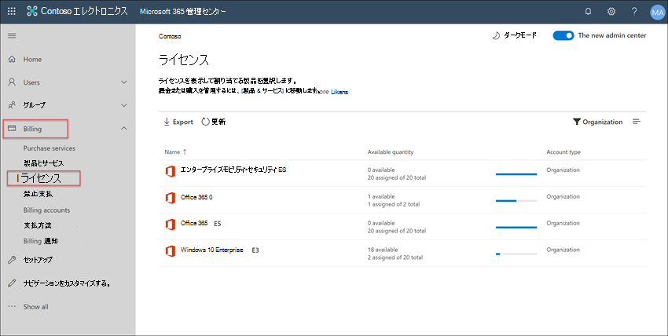
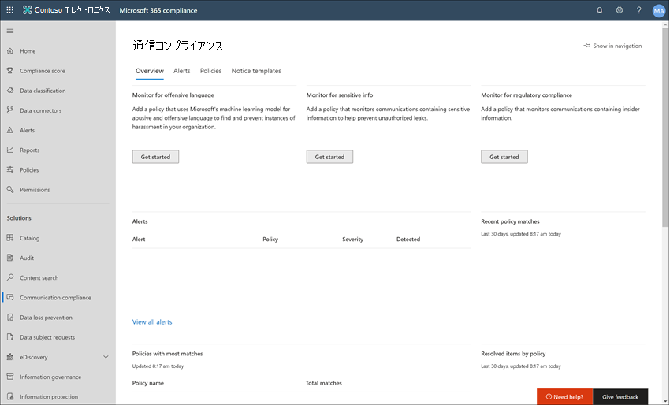
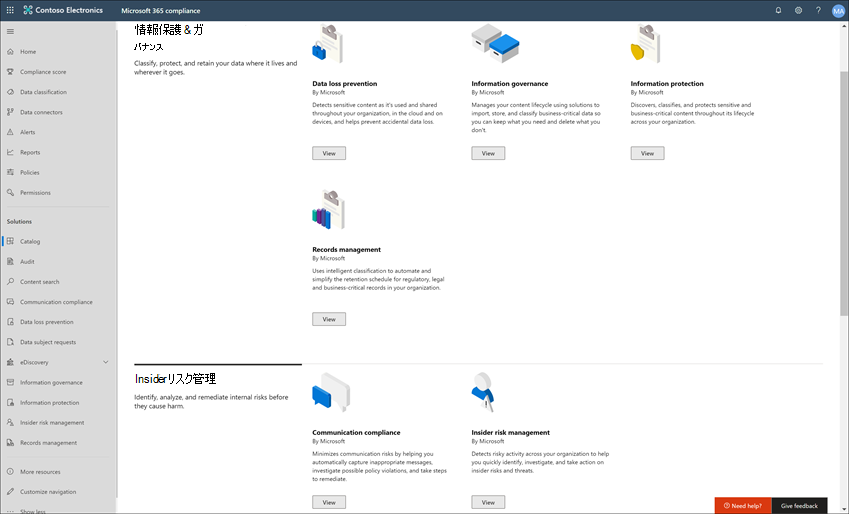
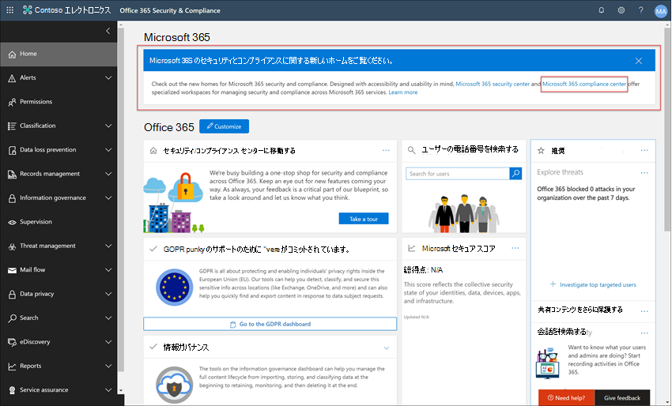
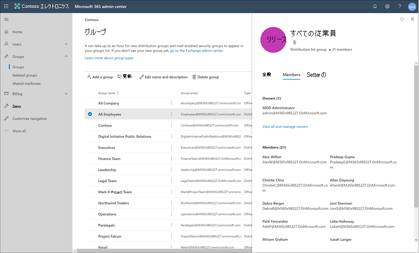
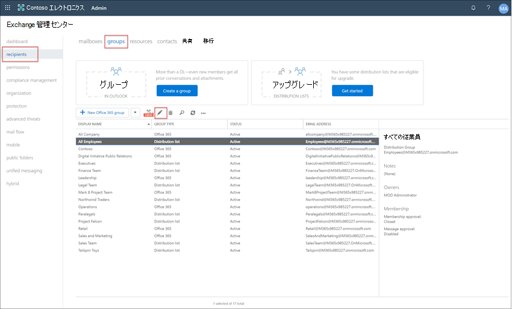
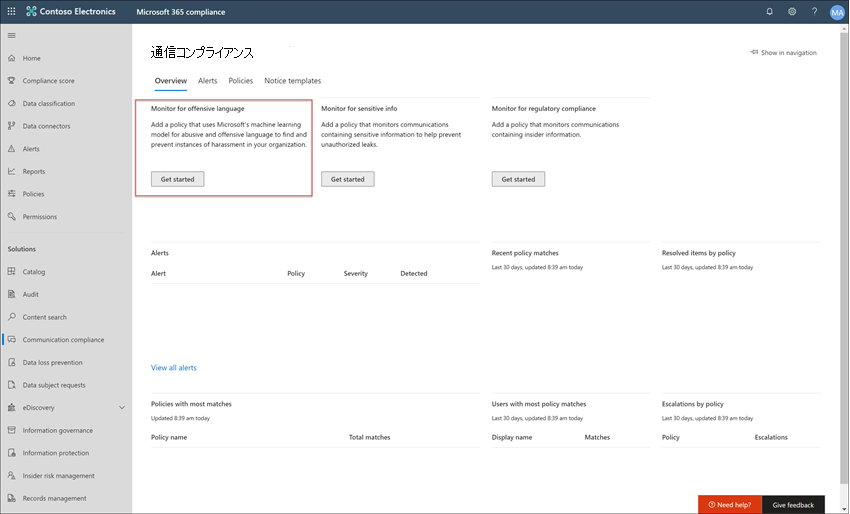
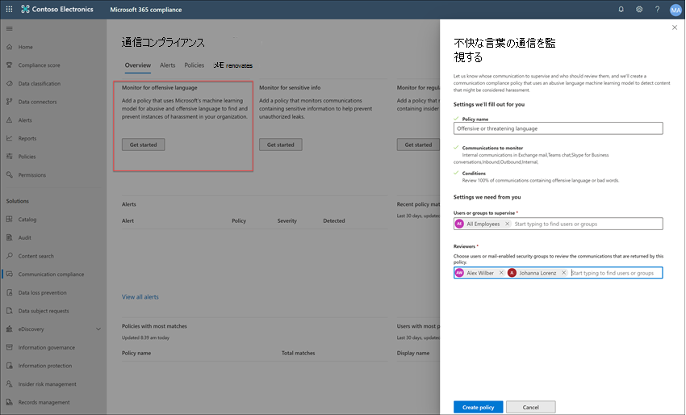

# ケース スタディ - Contoso は、コミュニケーションの管理、管理、およびMicrosoft Teams、Exchangeに不適切Yammer構成します。

組織内の不適切なMicrosoft 365メッセージを検出、キャプチャ、および操作することで、コミュニケーション リスクを最小限に抑えるのに役立ちます。 不適切なコンテンツには、冒とく、脅迫、嫌がらせ、不適切な画像が含まれる場合があります。 事前に定義されたカスタムポリシーを使用すると、指定されたレビュー担当者が調査できるように、ポリシーの一致の確認のために内部および外部の通信をスキャンできます。 レビュー担当者は、組織内のスキャンされた電子メール、Microsoft Teams、Yammer、またはサードパーティの通信を調査し、組織のメッセージ標準に準拠しているか確認するために適切な修復アクションを実行できます。

Contoso Corporation は、不適切なコンテンツを監視するポリシーをすばやく構成する必要がある架空の組織です。 ユーザーは電子メール、Microsoft 365、Yammer Microsoft Teamsサポートを主に使用していますが、職場での嫌がらせに関する会社のポリシーを適用する新しい要件があります。 Contoso IT 管理者とコンプライアンス スペシャリストは、Microsoft 365 を操作する基本知識を持ち、コミュニケーション コンプライアンスを迅速に開始する方法に関するエンドツーエンドのガイダンスを探しています。

このケース スタディでは、不適切なコンテンツの通信を監視する通信コンプライアンス ポリシーをすばやく構成するための基本について説明します。 このガイダンスは次のとおりです。

- 手順 1 : 通信コンプライアンスの計画
- 手順 2 : Microsoft 365 での通信コンプライアンスへのアクセス
- 手順 3 : 前提条件の構成および通信コンプライアンスポリシーの作成
- 手順 4 : 警告の調査および修復

## 手順 1: 通信コンプライアンスの計画

Contoso IT 管理者とコンプライアンス スペシャリストは、Microsoft 365 のコンプライアンス ソリューションに関するオンライン ウェビナーに参加し、コミュニケーション コンプライアンス ポリシーが職場のハラスメントを削減するための更新された企業ポリシー要件を満たすのに役立つと決定しました。 共に、Microsoft Teams で送信されたチャット、Yammer でのプライベート メッセージとコミュニティの会話、および Exchange Online で送信される電子メール メッセージに対して不適切なコンテンツを監視する通信コンプライアンス ポリシーを作成して有効にする計画を策定しました。 計画には次のものが含まれます:

- 通信コンプライアンス機能へのアクセスが必要な IT 管理者。
- 通信ポリシーを作成および管理する必要があるコンプライアンス スペシャリスト。
- コミュニケーション コンプライアンスアラートの調査と修復が必要な他の部署 (人事、法務など) のコンプライアンススペシャリストや他の同僚。
- 通信コンプライアンスの不適切なコンテンツ ポリシーのスコープ内になるユーザー。

### ライセンス

最初の手順は、Contoso のライセンスにMicrosoft 365コンプライアンス ソリューションのサポートが含まれるか確認します。 通信コンプライアンスにアクセスして使用するには、Contoso の IT 管理者が Contoso に次のいずれかを持っている必要があります。

- Microsoft 365 E5 サブスクリプション (有料または試用版)
- Microsoft 365 E5 コンプライアンス アドオンが含まれている Microsoft 365 E3 サブスクリプション。
- Microsoft 365 E5 インサイダー リスク管理アドオンが含まれている Microsoft 365 E3 サブスクリプション。
- Microsoft 365 A5 サブスクリプション (有料または試用版)
- Microsoft 365 A5 コンプライアンス アドオンが含まれている Microsoft 365 A3 サブスクリプション。
- Microsoft 365 A5 インサイダー リスク管理アドオンが含まれている Microsoft 365 A3 サブスクリプション。
- Microsoft 365 G5 サブスクリプション (有料または試用版)
- Microsoft 365 G5 コンプライアンス アドオンが含まれている Microsoft 365 G5 サブスクリプション。
- Microsoft 365 G5 インサイダー リスク管理アドオンが含まれている Microsoft 365 G5 サブスクリプション。
- Office 365 Enterprise E5 サブスクリプション (有料または試用版)
- Office 365 Advanced Compliance アドオンが含まれている Office 365 Enterprise E3 サブスクリプション (新しいサブスクリプションでは利用できなくなりました。注を参照してください)

また、通信コンプライアンス ポリシーに含まれるユーザーに上記のいずれかのライセンスが割り当てられている必要があります。

> [!IMPORTANT]
> Office 365 Advanced Compliance はスタンドアロン サブスクリプションとして販売されなくなりました。 現在のサブスクリプションの有効期限が切れると、お客様は、同じまたは追加のコンプライアンス機能を含む上記のいずれかのサブスクリプションに移行する必要があります。

Contoso IT 管理者は、Contoso のライセンス サポートを確認するために次の手順を実行します。

1. IT 管理者は、アカウントにサインイン <https://admin.microsoft.com> Microsoft 365 管理センター、[課金ライセンス] Microsoft 365 管理センター >  >  <a href="https://go.microsoft.com/fwlink/p/?linkid=842264" target="_blank">**に移動します**</a>。

2. ここでは、通信コンプライアンスのサポートを含むライセンス オプションの 1 つが使用されているのを確認します。

### 通信コンプライアンスのアクセス許可

コミュニケーション コンプライアンス機能を管理するためのアクセス許可を構成するために 5 つのロール グループが使用されます。 通信コンプライアンス **を** Microsoft 365 コンプライアンス センター のメニュー オプションとして使用し、これらの構成手順を続行するには、Contoso 管理者に通信コンプライアンス管理者の役割 *が割り当* てられます。

Contoso 社は、コミュニケーション *コンプライアンス役割グループ* を使用して、すべてのコミュニケーション コンプライアンス管理者、アナリスト、調査者、閲覧者をグループに割り当てる決定を行います。 これにより、Contoso 社はコンプライアンス管理要件に合わせて迅速かつ最適な作業を開始できます。

|**役割**|**ロール権限**|
|:-----|:-----|
| **コミュニケーション コンプライアンス** | このロール グループを使用して、1 つのグループ内の組織のコミュニケーション コンプライアンスを管理します。 指定された管理者、アナリスト、調査担当者、閲覧者のすべてのユーザー アカウントを追加することで、コミュニケーション コンプライアンスのアクセス許可を 1 つのグループに構成できます。 このロール グループには、すべてのコミュニケーション コンプライアンスのアクセス許可ロールが含まれます。 これは、コミュニケーション コンプライアンスをすばやく開始する最も簡単な方法であり、個別のユーザー グループに対して個別の権限を定義する必要がない組織に適しています。 |
| **コミュニケーション コンプライアンス管理者** | このロール グループを使用して、最初にコミュニケーション コンプラいアナスを構成し、後でコミュニケーション コンプライアンス管理者を定義されたグループに分離します。 このロール グループに割り当てられたユーザーは、コミュニケーション コンプライアンス ポリシー、グローバル設定、およびロール グループの割り当てを作成、読み取り、更新、および削除できます。 このロール グループに割り当てられたユーザーは、メッセージ アラートを表示できません。 |
| **コミュニケーション コンプライアンス アナリスト** | このグループを使用して、コミュニケーション コンプライアンス アナリストとして機能するユーザーにアクセス許可を割り当てます。 このロール グループに割り当てられたユーザーは、レビュー担当者として割り当てられているポリシーの表示、メッセージ メタデータ (メッセージ コンテンツではない) の表示、追加のレビュー担当者へのエスカレーション、またはユーザーへの通知の送信を行うことができます。 アナリストは保留中のアラートを解決できません。 |
| **コミュニケーション コンプライアンス調査担当者** | このグループを使用して、コミュニケーション コンプライアンス調査担当者として機能するユーザーにアクセス許可を割り当てます。 このロール グループに割り当てられているユーザーは、メッセージのメタデータとコンテンツの表示、追加のレビュー担当者へのエスカレーション、Advanced eDiscovery ケースへのエスカレーション、ユーザーへの通知の送信、アラートの解決を行うことができます。 |
| **コミュニケーション コンプライアンス閲覧者** | このグループを使用して、コミュニケーション レポートを管理するユーザーにアクセス許可を割り当てます。 このロール グループに割り当てられたユーザーは、コミュニケーション コンプライアンス ホーム ページのすべてのレポート ウィジェットにアクセスでき、すべてのコミュニケーション コンプライアンス レポートを表示できます。 |

1. Contoso IT 管理者は、グローバル管理者アカウント[の](https://compliance.microsoft.com/permissions)資格情報を使用して Microsoft 365 コンプライアンス センター アクセス許可ページにサインインし、管理者アカウントの役割を表示および管理するためのリンクをMicrosoft 365。
2. [アクセス許可Microsoft 365 コンプライアンス センターアクセス許可] に移動し、アクセス許可の役割を表示および管理するリンクをOffice 365。
3. 管理者が [通信コンプライアンス] 役割 *グループを* 選択し、[役割グループの編集 **] を選択します**。
4. 管理者は、左側の **ナビゲーション ウィンドウから [メンバー** の選択] を選択し、[編集] を **選択します**。
5. [追加] **を選択** し、通信コンプライアンスの管理、調査、およびアラートの確認を行うすべての Contoso ユーザーのチェック ボックスをオンにします。
6. 管理者は [追加] を **選択し**、[完了] を **選択します**。
7. [保存] **を選択** して、Contoso ユーザーを役割グループに追加します。 [閉じる **] を選択** して手順を完了します。

## 手順 2: ネットワーク内の通信コンプライアンスにMicrosoft 365

通信コンプライアンスのアクセス許可を構成した後、通信コンプライアンス役割グループに割り当てられた Contoso IT 管理者とコンプライアンス スペシャリストは、Microsoft 365 の通信コンプライアンス ソリューションにアクセスできます。 Contoso IT 管理者とコンプライアンス スペシャリストは、通信コンプライアンスにアクセスし、新しいポリシーの作成を開始するためのいくつかの方法があります。

- コミュニケーション コンプライアンス ソリューションから直接開始する
- 最初のMicrosoft 365 コンプライアンス センター
- ソリューション カタログMicrosoft 365開始
- 最初のMicrosoft 365 管理センター

### コミュニケーション コンプライアンス ソリューションから直接開始する

ソリューションにアクセスする最も簡単な方法は、コミュニケーション コンプライアンス ( ) ソリューションに **直接** <https://compliance.microsoft.com/supervisoryreview> サインインする方法です。 このリンクを使用すると、Contoso IT 管理者とコンプライアンス スペシャリストがコミュニケーション コンプライアンスの概要ダッシュボードに移動し、アラートの状態をすばやく確認し、定義済みのテンプレートから新しいポリシーを作成できます。

### 最初のMicrosoft 365 コンプライアンス センター

Contoso IT 管理者とコンプライアンス スペシャリストが通信コンプライアンス ソリューションにアクセスするためのもう 1 つの簡単な方法は、管理者に直接サインイン[Microsoft 365 コンプライアンス センター。](https://compliance.microsoft.com) サインイン後にすべてのコンプライアンス ソリューションを表示し、開始するには、**すべてを表示** を選択して、**通信コンプライアンス** ソリューションを選択すれば開始します。

### ソリューション カタログMicrosoft 365開始

Contoso の IT 管理者とコンプライアンス スペシャリストは、ソリューション カタログを選択して、通信コンプライアンス ソリューションMicrosoft 365選択できます。 左側のナビゲーション **の [****ソリューション]** セクションで [カタログ] を選択すると、Microsoft 365 コンプライアンス センターコンプライアンス ソリューションのすべての一覧が表示Microsoft 365開きます。 [Insider リスク管理] セクション **までスクロール** ダウンすると、Contoso IT 管理者は [通信コンプライアンス] を選択して開始できます。 Contoso IT 管理者は、ナビゲーションコントロールで [表示] を使用して、通信コンプライアンス ソリューションを左側のナビゲーション ウィンドウにピン留めして、今後サインインするときにすばやくアクセスできます。

### 最初のMicrosoft 365 管理センター

Microsoft 365 管理センター から開始するときに通信コンプライアンスにアクセスするには、Contoso IT 管理者とコンプライアンス スペシャリストが Microsoft 365 管理センター にサインインします[( https://admin.microsoft.com) ](https://admin.microsoft.com)および[Microsoft 365 コンプライアンス センター 

このアクションでは、Office 365 **セキュリティ** とコンプライアンス センターが開き、ページの上部にあるバナーにMicrosoft 365 コンプライアンス センターリンクを選択する必要があります。

Contoso IT **管理者は**、Microsoft 365 コンプライアンス センターソリューションの完全な一覧を表示するには、[すべて表示] を選択します。

[すべて表示 **] を選択** すると、Contoso IT 管理者は通信コンプライアンス ソリューションにアクセスできます。

## 手順 3: 前提条件の構成と通信コンプライアンス ポリシーの作成

通信コンプライアンス ポリシーを開始するには、Contoso IT 管理者が不適切なコンテンツを監視するための新しいポリシーを設定する前に構成する必要があるいくつかの前提条件があります。 これらの前提条件の完了後、Contoso IT 管理者およびコンプライアンス スペシャリストが新しいポリシーを構成し、コンプライアンス スペシャリストは調査を開始して、生成された警告を修復することができます。

### ユーザーの監査を有効Microsoft 365

通信コンプライアンスには、警告を表示し、レビュー担当者が行った修復処置を追跡するための監査ログが必要です。 監査ログは、定義済みの組織ポリシーに関連付けられているすべてのアクティビティの概要です。また、通信コンプライアンスポリシーに変更があった場合はいつでもその概要を示します。

Contoso IT 管理者は、[詳しい手順](turn-audit-log-search-on-or-off.md) を確認して完了し、監査を有効にします。 監査を有効にすると、監査ログの準備中で、準備が完了してから数時間で検索を実行できるというメッセージが表示されます。 Contoso IT 管理者は、この操作を1回だけ行う必要があります。

### ネイティブ モードYammerテナントの構成

通信コンプライアンスでは、組織Yammerテナントがネイティブ モードでプライベート メッセージやパブリック コミュニティの会話で不適切なコンテンツを監視する必要があります。

Contoso IT 管理者は[、「Microsoft 365](/yammer/configure-your-yammer-network/overview-native-mode)の Yammer ネイティブ モードの概要」の記事の情報を確認し、「Microsoft 365 のネイティブ モード用[に Yammer](/yammer/configure-your-yammer-network/native-mode)ネットワークを構成する」の「移行ツールを実行する」の手順に従います。

### 範囲内のユーザーグループの設定

Contoso コンプライアンス スペシャリストは、不適切なコンテンツを監視する通信ポリシーにすべてのユーザーを追加します。 各ユーザー アカウントをポリシーに個別に追加することもできますが、このポリシーのユーザーに対してすべてのユーザー配布グループを使用する方がはるかに簡単で、時間を節約できると判断しました。

すべての Contoso ユーザーを含める新しいグループを作成する必要があります。そのため、次の手順を実行します。

1. Contoso IT 管理者は、IT 管理者が管理者にサインインMicrosoft 365 管理センター [グループグループに移動 https://admin.microsoft.com) Microsoft 365 管理センター >](https://admin.microsoft.com)  >  <a href="https://go.microsoft.com/fwlink/p/?linkid=2052855" target="_blank">**移動します**</a>。
2. [グループの **追加] を選択** し、ウィザードを完了して新しいグループまたは配布 *Microsoft 365を**作成します*。

    

3. 新しいグループの作成後、Contoso ユーザー全員を新しいグループに追加する必要があります。 管理者センターを開 **Exchange** [ https://outlook.office365.com/ecp) (](https://outlook.office365.com/ecp)および管理センター **の受信者グループExchange**  >  **に**  >  <a href="https://go.microsoft.com/fwlink/?linkid=2183233" target="_blank">**移動します**</a>。 Contoso IT 管理者は、[メンバーシップ] 領域と、作成した新しい [すべての従業員] グループを選択し、[編集] コントロールを選択して、ウィザードの新しいグループにすべての Contoso ユーザーを追加します。

    

### 不適切なコンテンツを監視するポリシーの作成

すべての前提条件が完了すると、IT 管理者と Contoso のコンプライアンス スペシャリストは、不適切なコンテンツを監視するために通信コンプライアンス ポリシーを構成する準備が整いました。 新しい不適切なコンテンツ ポリシー テンプレートを使用して、このポリシーの構成は簡単かつ迅速です。

1. Contoso IT 管理者およびコンプライアンス スペシャリストが **Microsoft 365 コンプライアンスセンター** にサインインし、左側のナビゲーション ウィンドウから **通信コンプライアンス** を選択します。 この操作により、通信コンプライアンス ポリシー テンプレートのクイック リンクを含む **概要** ダッシュボードが開きます。 [不適切なコンテンツ **テンプレートの監視] を選択するには** 、テンプレートの [開始する **]** を選択します。

    

2. ポリシー テンプレート ウィザードでは、Contoso IT 管理者およびコンプライアンス スペシャリストが協働して、 **ポリシー名**、**ユーザーまたは監督対象のグループ** および **レビュー担当者** の3つの必要なフィールドを完了します。
3. ポリシーウィザードには、既にポリシーの名前が提案されているので、IT 管理者およびコンプライアンス スペシャリストが、提案された名前を保持し、残りのフィールドにフォーカスします。 [監視する *ユーザー* またはグループ]フィールドの [すべてのユーザー] グループを選択し、[レビュー担当者] フィールドのポリシー通知を調査して修復するコンプライアンス スペシャリスト **を選択** します。 ポリシーを構成し、アラート情報の収集を開始する最後の手順は、[ポリシーの作成] **を選択します**。

    

## 手順 4 : 警告の調査および修復

不適切なコンテンツを監視する通信コンプライアンス ポリシーが構成されたので、Contoso コンプライアンス スペシャリストの次の手順は、ポリシーによって生成されたアラートを調査して修復します。 ポリシーによって、すべての通信ソース チャネルの通信を完全に処理し、警告が **通知ダッシュボード** に表示されるようになるには、最大で24時間かかります。

アラートが生成されると、Contoso コンプライアンススペシャリストはワークフローの指示に従って不適切なコンテンツの問題を調査し、修復します。