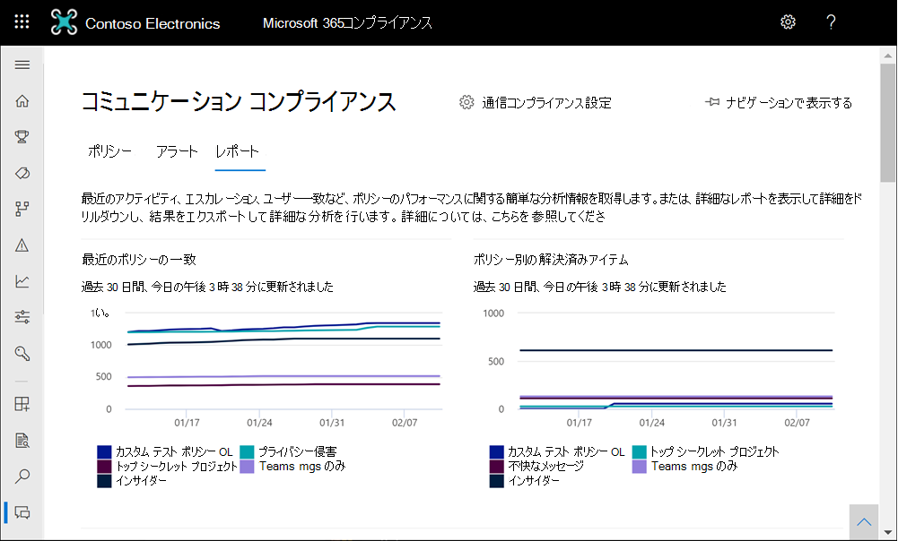

# <a name="communication-compliance-feature-reference"></a>通信コンプライアンス機能リファレンス

## <a name="policies"></a>ポリシー

> [!IMPORTANT]
> PowerShell を使用したコミュニケーション コンプライアンス ポリシーの作成や管理はサポートされていません。 これらのポリシーを作成して管理するには、[Microsoft 365 コミュニケーション コンプライアンス ソリューション](https://compliance.microsoft.com/supervisoryreview)のポリシー管理コントロールを使用する必要があります。

Microsoft 365 の組織のコミュニケーション コンプライアンス ポリシーは、Microsoft 365 コンプライアンス センターで作成します。 通信コンプライアンス ポリシーは、組織内で確認対象となる通信とユーザーを定義し、通信が満たす必要があるカスタム条件を定義し、レビューを実行するユーザーを指定します。 [通信コンプライアンス管理者 *] 役割* が割り当てられているユーザーはポリシーを設定できます。また、この役割が割り当てられているユーザーは、Microsoft 365 コンプライアンス センター の [通信コンプライアンス] ページとグローバル設定にアクセスできます。 必要に応じて、ポリシーへの変更履歴を .csv (コンマ区切り値) ファイルにエクスポートできます。これには、レビュー保留中の通知、エスカレートされたアイテム、解決済みアイテムの状態も含まれます。 ポリシーの名前を変更できなくなった場合は削除できます。

## <a name="policy-templates"></a>ポリシー テンプレート

ポリシー テンプレートは事前に定義されたポリシー設定で、一般的なコンプライアンス シナリオに対応するポリシーをすばやく作成できます。 これらの各テンプレートには条件と範囲の違いがあります。すべてのテンプレートは同じ種類のスキャン信号を使用します。 次のポリシー テンプレートから選択できます。

|**領域**|**ポリシー テンプレート**|**詳細**|
|:-----|:-----|:-----|
| **不快な言葉と嫌がらせ対策** | 不快な言語の通信を監視する | - 場所: Exchange Online、Microsoft Teams、Yammer、Skype for Business <br> - 方向: 受信、送信、内部 <br> - レビューの割合: 100% <br> - 条件: 不快な言語分類子 |
| **機密情報** | 機密情報の通信を監視する | - 場所: Exchange Online、Microsoft Teams、Yammer、Skype for Business <br> - 方向: 受信、送信、内部 <br> - レビューの割合: 10% <br> - 条件: 機密情報、アウトオブボックス コンテンツ パターン、および種類、ユーザー辞書オプション、1 MB を超える添付ファイル |
| **規制コンプライアンス** | 金融規制コンプライアンスに関連する情報の通信を監視する | - 場所: Exchange Online、Microsoft Teams、Yammer、Skype for Business <br> - 方向: 受信、送信 <br> - レビューの割合: 10% <br> - 条件: ユーザー辞書オプション、1 MB を超える添付ファイル |
| **利益相反** | 2 つのグループまたは 2 人のユーザー間の通信を監視して、利益相反を回避する | - 場所: Exchange Online、Microsoft Teams、Yammer、Skype for Business <br> - 方向: 内部 <br> - レビューの割合: 100% <br> - 条件: なし |

通信は、ポリシーが作成された時刻から 24 時間ごとにスキャンされます。 たとえば、攻撃的な言語ポリシーを 11:00 AM に作成すると、ポリシーは毎日午前 11 時に 24 時間ごとに通信コンプライアンス信号を収集します。 ポリシーを編集しても、今回は変更されません。 ポリシーの最後のスキャン日時を表示するには、[ポリシー] ページの[最後のポリシー スキャン] 列に **移動** します。 新しいポリシーを作成した後、最初のポリシー スキャンの日時を表示するには、最大 24 時間かかる場合があります。 前回のスキャンの日時は、ローカル システムのタイム ゾーンに変換されます。

## <a name="pause-a-policy-preview"></a>ポリシーを一時停止する (プレビュー)

通信コンプライアンス ポリシーを作成した後、必要に応じてポリシーが一時的に一時停止される場合があります。 ポリシーの一時停止は、ポリシーの一致をテストまたはトラブルシューティングしたり、ポリシーの条件を最適化したりするために使用できます。 このような状況でポリシーを削除する代わりに、ポリシーを一時停止すると、継続的な調査とレビューのために既存のポリシー通知とメッセージも保持されます。 ポリシーを一時停止すると、ポリシーが一時停止された時間に対して、ポリシーで定義されているすべてのユーザー メッセージ条件に対するインスペクションとアラートの生成が防止されます。 ポリシーを一時停止または再起動するには、ユーザーがコミュニケーション コンプライアンス管理者役割グループの *メンバーである* 必要があります。

ポリシーを一時停止するには、[ポリシー]ページに移動し、ポリシーを選択し、[アクション] ツールバーから [ポリシーの一時停止] を選択します。 [ポリシー **の一時停止]** ウィンドウで、[一時停止] を選択してポリシーを一 **時停止します。** 場合によっては、ポリシーの一時停止に最大 24 時間かかる場合があります。 ポリシーが一時停止されると、ポリシーに一致するメッセージに対するアラートは作成されません。 ただし、ポリシーを一時停止する前に作成されたアラートに関連付けられたメッセージは、調査、確認、修復のために引き続き使用できます。

一時停止したポリシーのポリシーの状態は、次の複数の状態を示している場合があります。

- **Active**: ポリシーがアクティブです
- **一時停止**: ポリシーが完全に一時停止されています。
- **一時停止**: ポリシーは一時停止中です。
- **再開:** 再開中のポリシー。
- **再使用時のエラー**: ポリシーの再使用時にエラーが発生しました。 エラー スタック トレースの場合は、[ポリシー] ページの *[* 状態] 列の [状態] の状態の [エラー] の上にマウスポインターを置きます。
- **一時停止中のエラー**: ポリシーを一時停止するときにエラーが発生しました。 エラー スタック トレースの場合は、[ポリシー] ページの *[* 状態] 列の [一時停止中のエラー] 状態の上にマウスポインターを置きます。

ポリシーを再開するには、[ポリシー]ページに移動し、ポリシーを選択し、[操作] ツールバーから [ポリシー **の再開]** を選択します。 [再開ポリシー **] ウィンドウで**、[再開] を選択してポリシーを **再開します。** 場合によっては、ポリシーの再開に最大 24 時間かかる場合があります。 ポリシーが再開されると、ポリシーに一致するメッセージに対するアラートが作成され、調査、確認、修復に使用できます。

## <a name="copy-a-policy-preview"></a>ポリシーのコピー (プレビュー)

既存の通信コンプライアンス ポリシーを持つ組織では、既存のポリシーから新しいポリシーを作成するシナリオが役立つ場合があります。 ポリシーをコピーすると、スコープ内のすべてのユーザー、割り当てられたすべてのレビュー担当者、すべてのポリシー条件を含む、既存のポリシーの正確な重複が作成されます。 シナリオによっては、次のものが含まれる場合があります。

- **ポリシーストレージの制限に達** しました: アクティブな通信コンプライアンス ポリシーには、メッセージストレージの制限があります。 ポリシーの記憶域の制限に達すると、ポリシーは自動的に非アクティブ化されます。 非アクティブ化されたポリシーの対象となる不適切なメッセージを引き続き検出、キャプチャ、および処理する必要がある組織は、同じ構成で新しいポリシーをすばやく作成できます。
- **ユーザーのグループごとに不適切** なメッセージを検出して確認する : 組織によっては、同じ構成で複数のポリシーを作成する場合がありますが、ポリシーごとにスコープ内のユーザーとレビュー担当者が異なっている場合があります。
- **変更が少ない** 同様のポリシー: 複雑な構成または条件を持つポリシーの場合、同様のポリシーから新しいポリシーを作成する時間が節約される場合があります。

ポリシーをコピーするには、ユーザーがコミュニケーション コンプライアンスまたはコミュニケーションコンプライアンス管理者の役割グループ *のメンバーである* 必要があります。 既存のポリシーから新しいポリシーを作成した後、新しいポリシー構成に一致するメッセージを表示するには、最大で 24 時間かかる場合があります。

ポリシーをコピーして新しいポリシーを作成するには、次の手順を実行します。

1. コピーするポリシーを選択します。
2. コマンド **バーの [ポリシー コマンド** バーのコピー  ] ボタンを選択するか、ポリシーのアクション メニューから [ポリシーのコピー] を選択します。
3. [ポリシーの **コピー]** ウィンドウで、[ポリシー名] フィールドでポリシーの既定の名前を受け入れるか、ポリシーの名前を変更できます。 新しいポリシーのポリシー名は、既存のアクティブまたは非アクティブなポリシーと同じにすることはできません。 必要に応 **じて [説明** ] フィールドに入力します。
4. ポリシーをさらにカスタマイズする必要がない場合は、[ポリシーのコピー] を選択 **して** プロセスを完了します。 新しいポリシーの構成を更新する必要がある場合は、[ポリシーのカスタマイズ] **を選択します**。 これにより、新しいポリシーの更新とカスタマイズに役立つポリシー ウィザードが開始されます。

## <a name="storage-limit-notification-preview"></a>Storage制限通知 (プレビュー)

各通信コンプライアンス ポリシーのストレージ制限サイズは 100 GB または 100 万メッセージで、どちらが最初に到達するかです。 ポリシーがこれらの制限に近づくと、通知メールは、通信コンプライアンスまたはコミュニケーション コンプライアンス管理者の役割グループに割り当てられたユーザー *に自動的に* 送信されます。 通知メッセージは、記憶域のサイズまたはメッセージ数が制限の 80、90、および 95% に達すると送信されます。 ポリシーの制限に達すると、ポリシーは自動的に非アクティブ化され、ポリシーはアラートのメッセージの処理を停止します。

>[!IMPORTANT]
>ストレージとメッセージの制限に達するためにポリシーが非アクティブ化されている場合は、非アクティブ化されたポリシーを管理する方法を必ず評価してください。 ポリシーを削除すると、すべてのメッセージ、関連付けられた添付ファイル、およびメッセージ通知が完全に削除されます。 将来使用するためにこれらのアイテムを維持する必要がある場合は、非アクティブ化されたポリシーを削除しない。

ストレージとメッセージの制限に近づくポリシーを管理するには、ポリシーのコピーを作成してカバレッジの継続性を維持するか、または現在のポリシーストレージ サイズとメッセージ数を最小限に抑えるために次のアクションを実行してください。

- ポリシーに割り当てられているユーザーの数を減らすことを検討してください。 ポリシーからユーザーを削除したり、ユーザーのグループごとに異なるポリシーを作成したりすると、ポリシーのサイズと総メッセージの増加を遅くすることができます。
- ポリシーで誤検知の警告が過剰に発生した場合は、そのポリシーを確認します。 一般的な誤検知アラートを無視するには、ポリシー条件に例外や変更を追加することを検討してください。
- ポリシーがストレージまたはメッセージの制限に達し、非アクティブ化されている場合は、ポリシーのコピーを作成して、同じ条件とユーザーに対して引き続き検出してアクションを実行します。

## <a name="permissions"></a>アクセス許可

> [!IMPORTANT]
> 既定では、グローバル管理者にはコミュニケーション コンプライアンス機能へアクセス権はありません。 この手順で割り当てられたロールは、コミュニケーション コンプライアンス機能にアクセスする前に必要です。

コミュニケーション コンプライアンス機能を管理するためのアクセス許可を構成するために 5 つのロール グループが使用されます。 **コミュニケーション コンプライアンス** を Microsoft 365 コンプライアンス センターのメニュー オプションとして使用できるようにし、これらの構成手順を続行するには、*コミュニケーション コンプライアンス* または *コミュニケーション コンプライアンス管理者* のロール グループを割り当てられる必要があります。 初期構成後にコミュニケーション コンプライアンス機能にアクセスして管理するには、ユーザーが少なくとも 1 つのコミュニケーション コンプライアンス ロール グループのメンバーである必要があります。

コミュニケーション ポリシーとアラートの管理方法に応じて、ユーザーを特定のロール グループに割り当てる必要があります。 さまざまなコンプライアンス責任を持つユーザーを特定の役割グループに割り当て、通信コンプライアンス機能の異なる領域を管理できます。 または、指定された管理者、アナリスト、調査担当者、および閲覧者のすべてのユーザー アカウントを、*コミュニケーション コンプライアンス* ロール グループに割り当ててもよいでしょう。 コンプライアンス管理の要件に最適な 1 つのロール グループまたは複数のロール グループを使用します。

コミュニケーション コンプライアンスを構成するときに、次のロール グループ オプションから選択します：

|**役割グループ**|**役割グループのアクセス許可**|
|:-----|:-----|
| **コミュニケーション コンプライアンス** | このロール グループを使用して、1 つのグループ内の組織のコミュニケーション コンプライアンスを管理します。 指定された管理者、アナリスト、調査担当者、閲覧者のすべてのユーザー アカウントを追加することで、コミュニケーション コンプライアンスのアクセス許可を 1 つのグループに構成できます。 このロール グループには、すべてのコミュニケーション コンプライアンスのアクセス許可ロールが含まれます。 これは、コミュニケーション コンプライアンスをすばやく開始する最も簡単な方法であり、個別のユーザー グループに対して個別の権限を定義する必要がない組織に適しています。 |
| **コミュニケーション コンプライアンス管理者** | このロール グループを使用して、最初にコミュニケーション コンプラいアナスを構成し、後でコミュニケーション コンプライアンス管理者を定義されたグループに分離します。 このロール グループに割り当てられたユーザーは、コミュニケーション コンプライアンス ポリシー、グローバル設定、およびロール グループの割り当てを作成、読み取り、更新、および削除できます。 このロール グループに割り当てられたユーザーは、メッセージ アラートを表示できません。 |
| **コミュニケーション コンプライアンス アナリスト** | このグループを使用して、コミュニケーション コンプライアンス アナリストとして機能するユーザーにアクセス許可を割り当てます。 この役割グループに割り当てられたユーザーは、レビュー担当者として割り当てられているポリシーを表示したり、メッセージ メタデータ (メッセージ コンテンツではない) を表示したり、他のレビュー担当者にエスカレートしたり、ユーザーに通知を送信したりできます。 アナリストは保留中のアラートを解決できません。 |
| **コミュニケーション コンプライアンス調査担当者** | このグループを使用して、コミュニケーション コンプライアンス調査担当者として機能するユーザーにアクセス許可を割り当てます。 この役割グループに割り当てられたユーザーは、メッセージメタデータとコンテンツを表示し、他のレビュー担当者にエスカレートし、Advanced eDiscovery ケースにエスカレートし、ユーザーに通知を送信し、アラートを解決できます。 |
| **コミュニケーション コンプライアンス閲覧者** | このグループを使用して、コミュニケーション レポートを管理するユーザーにアクセス許可を割り当てます。 このロール グループに割り当てられたユーザーは、コミュニケーション コンプライアンス ホーム ページのすべてのレポート ウィジェットにアクセスでき、すべてのコミュニケーション コンプライアンス レポートを表示できます。 |

### <a name="for-organizations-using-the-original-permissions-and-role-groups"></a>元のアクセス許可と役割グループを使用している組織の場合

新しい役割グループ構造は、通信コンプライアンスの初期役割グループ構造に置き換わる。 通信コンプライアンスを既に使用している組織の場合は、監視サーバーで通信コンプライアンスを開始するには、監督レビュー管理者の役割を割り当てる必要Microsoft 365 コンプライアンス センター。 さらに、ポリシーの一致を使用してメッセージを調査および修復するには、監督レビュー管理者、ケース管理、コンプライアンス管理者、およびレビュー の役割を持つレビュー担当者用の新しい役割グループを作成する必要があります。 基本的に、すべての管理者とレビュー担当者は 1 つの役割グループに含め、すべてのユーザーが同じアクセス許可と管理権限を持っています。 通信コンプライアンスに関する最新の更新プログラムを使用して、以前の役割グループ構造から新しい役割グループ構造への移行を計画する必要があります。 以前の役割グループ構造のサポートは段階的に行います。

移行計画を支援するために、次の例を検討してください。 現在、組織には、IT 管理者、トリアージ、レビュー担当者の 3 種類のユーザーがいます。 これらの 3 種類のユーザーは、前の役割グループ構造に含まれます。これらはすべて、次の役割が割り当てられた単一の役割グループのメンバーです。

- 監督レビュー管理者
- ケース管理
- コンプライアンス管理者
- レビュー

新しい役割グループ構造のこれらのユーザーの役割を更新し、ユーザーのアクセス許可と管理権限を分離するには、3 つの新しいグループと、関連付けられた新しい役割グループの割り当てを検討できます。

- **IT 管理者**: 新しいコミュニケーション コンプライアンス管理者 *役割グループに割り* 当てられます。
- **トリアージ**: コミュニケーション コンプライアンス アナリスト *の役割グループに* 割り当てられます。
- **レビュー担当者**: 新しいコミュニケーション コンプライアンス調査員 *役割グループに割り* 当てられます。

## <a name="supervised-users"></a>監督対象ユーザー

コミュニケーション コンプライアンス ポリシーの使用を開始する前に、通信のレビューの対象ユーザーを決定する必要があります。 このポリシーでは、監督対象となるユーザーまたはユーザーのグループを指定するために、ユーザーのメール アドレスが使用されます。 これらのグループの例としては、Microsoft 365、Exchangeベースの配布リスト、Yammer、チャネルMicrosoft Teamsがあります。 特定の除外グループまたはグループのリストを使用して、特定のユーザーまたはグループを監視から除外することもできます。 通信コンプライアンス ポリシーでサポートされるグループの種類の詳細については、「通信コンプライアンスの概要 [」を参照してください](communication-compliance-configure.md#step-3-optional-set-up-groups-for-communication-compliance)。

> [!IMPORTANT]
> 通信コンプライアンス ポリシーの対象となるユーザーは、Microsoft 365 E5 Compliance ライセンス、Office 365 Enterprise E3 ライセンス、Advanced Compliance アドオン、または Office 365 Enterprise E5 サブスクリプションに含まれている必要があります。 既存の E5 プランをお持ちEnterprise通信コンプライアンスを試す場合は、E5 の試用版に[サインアップOffice 365 Enterpriseできます](https://go.microsoft.com/fwlink/p/?LinkID=698279)。

## <a name="reviewers"></a>レビュー担当者

通信コンプライアンス ポリシーを作成する場合は、監視対象ユーザーのメッセージを確認するユーザーを決定する必要があります。 このポリシーでは、監督対象の通信のレビューを行うユーザーまたはユーザーのグループを指定するために、ユーザーのメール アドレスが使用されます。 すべてのレビュー担当者は、ユーザーにホストされているメールボックスをExchange Online、通信コンプライアンス分析または通信コンプライアンス調査の役割に割り当 *てる必要* があります。 レビュー担当者 (アナリストまたは調査担当者) には、コミュニケーション コンプライアンス ケース管理の役割も割り当 *てられている* 必要があります。 レビュー担当者は、ポリシーに追加されると、ポリシーへの割り当てを通知し、レビュー プロセスに関する情報へのリンクを提供するメール メッセージを自動的に受信します。

## <a name="groups-for-supervised-users-and-reviewers"></a>監視対象ユーザーとレビュー担当者のグループ

セットアップを簡略化するには、コミュニケーションを確認する必要があるユーザー用のグループと、それらの通信を確認するユーザーのグループを作成します。 グループを使用している場合は、複数必要になる場合があります。 たとえば、2 つの異なるグループ間の通信を監視する場合や、監督対象ではないグループを指定する場合などです。

ポリシーで配布グループを割り当てると、ポリシーは配布グループ内の各ユーザーからのすべてのメールを監視します。 ポリシー内の Microsoft 365グループを割り当てると、ポリシーは、各グループ メンバーが受信した個々の電子メールではなく、そのグループに送信されたすべての電子メールを監視します。

グループと配布リストを通信コンプライアンス ポリシーに追加すると、ポリシーがサポートするグループと配布リストの最大数も、ポリシーに追加される条件の数によって異なります。 各ポリシーは、ポリシーに存在する追加の条件の数に応じて、約 20 のグループまたは配布リストをサポートする必要があります。

## <a name="supported-communication-types"></a>サポートされている通信の種類

通信コンプライアンス ポリシーを使用すると、グループとして、またはスタンドアロン ソースとして、次の 1 つ以上の通信プラットフォームでメッセージをスキャンできます。 これらのプラットフォーム全体でキャプチャされた通信は、ユーザーが組織を離れ、メールボックスが削除された場合でも、既定ではポリシーごとに 7 年間保持されます。

- **Microsoft Teams**: パブリック チャネルとプライベート チャネルの両方でチャットMicrosoft Teams、個々のチャットをスキャンできます。 Microsoft Teams カバレッジが選択された通信コンプライアンス ポリシーにユーザーが割り当てられている場合、ユーザーのチャット通信は、ユーザーがメンバーであるすべての Microsoft Teams で自動的に監視されます。 Microsoft Teamsは、定義済みのポリシー テンプレートに自動的に含まれており、カスタム ポリシー テンプレートで既定で選択されます。 Teamsコンプライアンス ポリシーの条件に一致するチャットの処理には、最大 48 時間かかる場合があります。

    プライベート チャットとプライベート チャネルの場合、通信コンプライアンス ポリシーはモダンな添付ファイルのスキャンをサポートします。 最新の添付ファイルは、OneDrive[またはSharePoint](/onedrive/plan-onedrive-enterprise#modern-attachments)[に含](/sharepoint/dev/solution-guidance/modern-experience-customizations)まれるサイトからソースTeamsです。 これらの添付ファイルからテキストが自動的に抽出され、自動処理が行われます。また、アクティブな通信コンプライアンス ポリシー条件や分類子との一致が考えらされます。 モダン添付ファイルの検出と処理に必要な追加の構成はありません。 テキストは、ポリシー条件に一致する添付ファイルにのみ抽出されます。 ポリシーが一致するメッセージの添付ファイルについては、添付ファイルにポリシーの一致がある場合でも、テキストは抽出されません。

    最新の添付ファイルのスキャンは、次の種類のファイルでサポートされています。

    - Microsoft Word (.docx)
    - Microsoft Excel (.xlsx)
    - Microsoft PowerPoint (.pptx)
    - テキスト (.txt)
    - Portable Document Format (.pdf)

    モダン添付ファイルの抽出されたテキストは、ポリシーの保留中の通知ダッシュボードに関連付けられたメッセージに含まれます。 添付ファイルの抽出されたテキストの名前は、添付ファイル名 (および形式の拡張子) と拡張子.txtされます。 たとえば、ContosoBusinessPlan.docxという名前の添付ファイルの抽出されたテキストは、ContosoBusinessPlan.docx.txtの保留中の通知ダッシュボードに表示されます。 

    抽出された添付ファイル テキストを選択して、[ソース]ビュー 、[プレーン テキスト] ビュー、または [注釈] ビューで詳細 *を表示* します。 確認後、コマンド バー コントロールを使用して添付ファイルテキストを解決または処理できます。 また、コミュニケーション コンプライアンス レビュー プロセスの外部でレビュー用の添付ファイルをダウンロードすることもできます。

    次のグループ管理構成を使用して、個々のユーザー チャットとチャネル通信を監視Teams。

    - **チャットTeamsの場合:** 個々のユーザーを割り当てるか、[配布グループを通信](https://support.office.com/article/Distribution-groups-E8BA58A8-FAB2-4AAF-8AA1-2A304052D2DE)コンプライアンス ポリシーに割り当てる。 この設定は、ユーザーとチャットの関係が 1 対 1 または 1 対多の場合に使用できます。
    - **チャネルTeamsの場合:** 特定のMicrosoft TeamsをMicrosoft 365するすべてのチャネルまたはグループを通信コンプライアンス ポリシーに割り当てる。 同じユーザーを別の Microsoft Teams チャネルまたは Microsoft 365 グループに追加する場合は、これらの新しいチャネルとグループを必ずコミュニケーション コンプライアンス ポリシーに追加するようにします。 チャネルのメンバーがポリシー内の監視対象ユーザーであり、受信方向がポリシーで構成されている場合、チャネル内で送信されるメッセージはすべて、(明示的に監督されていないチャネル内のユーザーの場合でも) 確認および潜在的なポリシー一致の対象となります。 たとえば、ユーザー A はチャネルの所有者またはメンバーです。 ユーザー B とユーザー C は、同じチャネルのメンバーであり、ユーザー A のみを監督する不快な言語ポリシーと一致する言語を使用します。ユーザー B とユーザー C は、攻撃的な言語ポリシーで直接監督されていない場合でも、チャネル内の会話に対してポリシー一致を作成します。 Teams A を含むチャネルの外部にあるユーザー B とユーザー C の間の会話は、ユーザー A を含む不快な言語ポリシーの対象とならなくなっています。チャネルの他のメンバーが明示的に監督されている場合にチャネル メンバーを監督から除外するには、該当する通信コンプライアンス ポリシーの [受信通信方向] 設定をオフにします。
    - **ハイブリッドTeams** チャット通信の場合: 通信コンプライアンスは、Exchange オンプレミス展開の組織または Microsoft Teams を有効にした外部メール プロバイダーのユーザーのチャット メッセージを監視できます。 監視するには、オンプレミスまたは外部メールボックスを持つユーザーの配布グループを作成する必要があります。 通信コンプライアンス ポリシーを作成する場合は、ポリシー ウィザードでこの配布グループを [監視対象ユーザーとグループ] **の選択** として割り当てる必要があります。 クラウドベースのストレージを有効にするための要件と制限事項、およびオンプレミス ユーザーに対する Teams のサポートの詳細については、「[オンプレミス ユーザーの Teams チャット データを検索する](search-cloud-based-mailboxes-for-on-premises-users.md)」を参照してください。

- **Exchange :** Exchange Online または Microsoft 365 サブスクリプションの一部としてOffice 365ホストされているメールボックスは、すべてメッセージ スキャンの対象となります。 Exchangeポリシーの条件に一致する電子メール メッセージと添付ファイルの処理には、最大で 24 時間かかる場合があります。 コミュニケーション コンプライアンスでサポートされる添付ファイルの種類は、[Exchangeメール フロー ルールのコンテンツ検査でサポートされているファイルの種類](/exchange/security-and-compliance/mail-flow-rules/inspect-message-attachments#supported-file-types-for-mail-flow-rule-content-inspection)と同じです。

- **Yammer**: プライベート メッセージとパブリック会話、および関連付けられた添付ファイルを、Yammerできます。 Yammer を定義されたチャネルとして含む通信コンプライアンス ポリシーにユーザーを追加すると、ユーザーがメンバーであるすべての Yammer コミュニティ間の通信がスキャン プロセスに含まれます。 Yammerコンプライアンス ポリシーの条件に一致するチャットと添付ファイルの処理には、最大で 24 時間かかる場合があります。 Yammerおよび添付[ファイルを監視](/yammer/configure-your-yammer-network/overview-native-mode)するには、通信コンプライアンス ポリシーのネイティブ モードYammer必要があります。 ネイティブ モードでは、すべての Yammer ユーザーが Azure Active Directory (AAD)、すべてのグループが Office 365 グループであり、すべてのファイルが SharePoint Online に保存されます。

- **Skype for Business Online**: Skype for Business Online のチャット コミュニケーションと関連する添付ファイルは監視可能です。 コミュニケーション コンプライアンス ポリシーの条件に一致する Skype for Business Online チャットの処理には、最大 24 時間かかる場合があります。 監視されたチャットの会話は、オンラインで保存された以前の会話[Skype for Businessされます](https://support.office.com/article/Find-a-previous-Skype-for-Business-conversation-18892eba-5f18-4281-8c87-fd48bd72e6a2)。  次のグループ管理構成を使用して、オンラインでのユーザー チャット通信Skype for Businessします。

    - **オンライン チャットSkype for Business:** 個々のユーザーを割り当てるか、または配布グループを通信コンプライアンス [ポリシーに](https://support.office.com/article/Distribution-groups-E8BA58A8-FAB2-4AAF-8AA1-2A304052D2DE)割り当てる。 この設定は、ユーザーとチャットの関係が 1 対 1 または 1 対多の場合に使用できます。

- **サード パーティの** ソース : インスタント ブルームバーグ、Slack、Zoom、SMS など、サード パーティのソースから、Microsoft 365 組織内のメールボックス [](archive-slack-data.md)にインポート [](archive-zoommeetings-data.md)されたデータの通信をスキャンできます。 [](archive-instant-bloomberg-data.md) 通信コンプライアンスでサポートされるコネクタの完全な一覧については、「サードパーティのデータをアーカイブ [する」を参照してください](archiving-third-party-data.md)。

    通信コンプライアンス ポリシーにコネクタを割り当てる前に、Microsoft 365組織のサード パーティ製コネクタを構成する必要があります。 通信 **コンプライアンス ポリシー ウィザードの [** サード パーティのソース] セクションには、現在構成されているサード パーティ コネクタだけが表示されます。

## <a name="policy-settings"></a>ポリシー設定

### <a name="users"></a>ユーザー

[すべてのユーザー] を選択 **するか** 、通信コンプライアンス ポリシーで特定のユーザーを定義することができます。 [**すべてのユーザー**] を選択すると、すべてのユーザーと、いずれかのユーザーがメンバーとして含まれているすべてのグループにポリシーが適用されます。 特定のユーザーを定義すると、定義されたユーザーと、定義されたユーザーがメンバーとして含まれているすべてのグループにポリシーが適用されます。

### <a name="direction"></a>方向

既定では **、Direction is condition が** 表示され、削除できません。 ポリシーの通信方向の設定は、個別または一緒に選択されます。

- **受信:** ポリシー内の他の監視対象ユーザーを含む、外部および内部の送信者から監視対象ユーザーに送信される通信を検出します。
- **送信:** ポリシー内の他の監視対象ユーザーを含む、監視対象ユーザーから外部および内部受信者に送信される通信を検出します。
- **内部**: ポリシー内の **監視対象** ユーザーまたはグループ間の通信を検出します。

### <a name="sensitive-information-types"></a>機密情報の種類

通信コンプライアンス ポリシーの一部として機密情報の種類を含むオプションがあります。 機密情報の種類は、事前に定義されたデータ型またはカスタム データ型のいずれかであり、クレジット カード番号、銀行口座番号、パスポート番号などの識別と保護に役立ちます。 「データ損失[](dlp-learn-about-dlp.md)防止について学ぶ」の一環として、機密情報の構成では、パターン、文字近接度、信頼度、カスタム データ型を使用して、機密性の高いコンテンツを識別してフラグを設定できます。 既定の機密情報の種類は次のとおりです。

- 財務的
- 医療と健康
- プライバシー
- カスタム情報の種類

機密情報の詳細と既定の種類に含まれるパターンの詳細については、「機密情報の種類エンティティ定義」 [を参照してください](sensitive-information-type-entity-definitions.md)。

### <a name="custom-keyword-dictionaries"></a>ユーザー設定のキーワード 辞書

組織や業界固有のキーワードを簡単に管理するために、カスタム キーワード 辞書 (または辞書) を構成します。 キーワード ディクショナリは、辞書で最大 100 KB の用語 (圧縮後) をサポートし、任意の言語をサポートします。 圧縮後のテナント制限も 100 KB です。 必要に応じて、複数のカスタム キーワード ディクショナリを 1 つのポリシーに適用するか、ポリシーごとに 1 つのキーワード ディクショナリを使用できます。 これらの辞書は通信コンプライアンス ポリシーで割り当て、ファイル (.csv リストや .txt リストなど) から、またはコンプライアンス センターでインポートできるリストからソースとして使用 [できます](create-a-keyword-dictionary.md)。 組織とポリシーに固有の用語や言語をサポートする必要がある場合は、ユーザー辞書を使用します。

### <a name="classifiers"></a>分類子

組み込みのトレーニング可能なグローバル分類子は、さまざまな種類のコンプライアンスの問題について、組織内のすべての通信チャネルで送信または受信したメッセージをスキャンします。 分類子は、人工知能とキーワードの組み合わせを使用して、ハラスメント対策ポリシーに違反する可能性のある言葉を識別します。 組み込みの分類子は現在、いくつかの言語でメッセージ キーワードの識別をサポートしています。

- 簡体字中国語
- 英語
- フランス語
- ドイツ語
- イタリア語
- 日本語
- ポルトガル語
- スペイン語

通信コンプライアンス組み込みのトレーニング可能なグローバル分類子は、次の種類の言語とコンテンツの用語、画像、センチメントの通信をスキャンします。

- **アダルト 画像**: 性的に明示的な性質を持つ画像をスキャンします。
- **判別 (プレビュー)**: 明示的な判別言語をスキャンし、他のコミュニティと比較すると、アフリカ系アメリカ人/黒人コミュニティに対する差別的な言語に特に敏感です。
- **Gory 画像**: 暴力とゴアを表す画像をスキャンします。
- **冒とく**: ほとんどの人を困らせる不適切な表現をスキャンします。
- **人種差別的な** 画像 : 性的に示唆的ですが、アダルトと見なされる画像よりも明示的なコンテンツが少ない画像をスキャンします。
- **対象となる嫌** がらせ : 人種、色、宗教、国籍に関するユーザーを対象とした攻撃行為をスキャンします。
- **脅威**: 人や財産に暴力や身体的危害を加える脅威をスキャンします。

アダルト *、Racy、Gory* イメージ分類子は、.jpeg、.png、.gif、および.bmp形式でファイルをスキャンします。  イメージ ファイルのサイズは 4 メガバイト (MB) 未満である必要があります。画像のサイズは 50x50 ピクセルを超え、評価の対象となるイメージには 50 キロバイト (KB) を超える必要があります。 画像の識別は、電子メール メッセージExchange OnlineチャネルとチャットMicrosoft Teamsサポートされています。

組み込みのトレーニング可能な分類子とグローバル分類子は、これらの領域全体で用語や画像の完全なリストを提供しない。 さらに、言語と文化の標準は絶えず変化し、これらの現実に照らして、Microsoft は独自の裁量で分類子を更新する権利を有します。 分類子は、組織がこれらの領域を監視する場合に役立ちますが、分類子は、そのような言語や画像を監視または対処する組織の唯一の手段を提供することを目的としていない。 Microsoft ではなく、組織は、これらの分野の言語と画像の監視、スキャン、ブロックに関連するすべての決定に対して引き続き責任を負います。これには、地域のプライバシーや他の適用される法律の遵守が含まれています。 Microsoft では、展開と使用の前に法律顧問とのコンサルティングを推奨しています。

> [!NOTE]
> 分類子を使用するポリシーは、単語数が 6 以上のメッセージを検査および評価します。 6 単語未満のメッセージは、分類子を使用するポリシーでは評価されません。 不適切なコンテンツを含む短いメッセージを特定して処理するには、この種類のコンテンツの通信コンプライアンス ポリシー監視にカスタム キーワード 辞書を含めてお勧めします。

トレーニング可能な分類子の詳細については、「Microsoft 365分類子の概要」[を参照してください](classifier-get-started-with.md)。

### <a name="optical-character-recognition-ocr"></a>光学式文字認識（OCR）

組み込みまたはカスタムの通信コンプライアンス ポリシーを構成して、組織内で不適切な可能性がある画像から印刷または手書きのテキストをスキャンして識別します。 統合 [された Azure Cognitive Services](/azure/cognitive-services/computer-vision/overview-ocr) と画像内のテキストを識別するための光学スキャン サポートは、アナリストや調査担当者が、主にテキスト以外の通信で不適切な行為が見逃される可能性があるインスタンスを検出して処理するのに役立ちます。

テンプレート、カスタム ポリシー、または既存のポリシーを更新する新しいポリシーで光学式文字認識 (OCR) を有効にして、埋め込みイメージと添付ファイルの処理のサポートを拡張できます。 ポリシー テンプレートから作成されたポリシーで有効にすると、電子メールおよびチャット メッセージに埋め込まれた画像または添付された画像Microsoft Teamsサポートされます。 ドキュメント ファイルに埋め込まれた画像の場合、OCR スキャンはサポートされていません。 カスタム ポリシーの場合、OCR スキャンの選択を有効にするには、ポリシーでキーワード、組み込みの分類子、または機密情報の種類に関連付けられた 1 つ以上の条件付き設定を構成する必要があります。

次の画像形式の 50 KB から 4 MB の画像がスキャンされ、処理されます。

- .jpg/.jpeg (共同写真専門家グループ)
- .png (ポータブル ネットワーク グラフィックス)
- .bmp (ビットマップ)
- .tiff (タグ イメージ ファイル形式)
- .pdf (ポータブル ドキュメント形式)

> [!NOTE]
> 現在、埋め込みおよび添付.pdfのスキャンと抽出は、電子メール メッセージでのみサポートされています。

OCR が有効になっているポリシーの保留中のアラートを確認すると、ポリシー条件と一致した画像が、関連付けられたアラートの子アイテムとして表示されます。 元の画像を表示して、識別されたテキストを元のメッセージとコンテキストで評価できます。 検出された画像がアラートで使用可能になるには、最大 48 時間かかる場合があります。

### <a name="conditional-settings"></a>条件付き設定
<a name="ConditionalSettings"> </a>

ポリシーに対して選択した条件は、組織内の電子メールとサードパーティの両方のソースからの通信 (インスタント ブルームバーグなど) に適用されます。

次の表では、各条件の詳細について説明します。

|**Condition**|**この条件の使い方**|
|:-----|:-----|
| **コンテンツは、これらの分類子に一致します** | 分類子がメッセージに含まれるか除外されている場合は、ポリシーに適用します。 一部の分類子はテナントで事前に定義され、カスタム分類子は、この条件で使用できる前に個別に構成する必要があります。 ポリシーで条件として定義できる分類子は 1 つのみです。 分類子の構成の詳細については、「トレーニング可能な分類子 (プレビュー) について [」を参照してください](classifier-learn-about.md)。 |
| **コンテンツには、これらの機密情報の種類が含まれる** | 機密情報の種類がメッセージに含まれるか除外されている場合は、ポリシーに適用します。 一部の分類子はテナントで事前に定義され、カスタム分類子は個別に構成するか、条件割り当てプロセスの一部として構成できます。 選択した各機密情報の種類は個別に適用され、メッセージに適用するポリシーに適用する必要がある機密情報の種類は 1 つのみです。 カスタムの機密情報の種類の詳細については、「 [機密情報の種類について」を参照してください](sensitive-information-type-learn-about.md)。 |
| **これらのドメインからメッセージを受信する**  <br><br> **これらのドメインからメッセージが受信されない** | 受信メッセージに特定のドメインまたは電子メール アドレスを含める、または除外するポリシーを適用します。 各ドメインまたは電子メール アドレスを入力し、複数のドメインまたは電子メール アドレスをコンマで区切ります。 入力された各ドメインまたは電子メール アドレスは個別に適用され、メッセージに適用するポリシーに適用する必要があるドメインまたは電子メール アドレスは 1 つのみです。 <br><br> 特定のドメインからすべての電子メールをスキャンするが、レビュー (ニュースレター、アナウンスなど) を必要としないメッセージを除外する場合は、電子メール アドレスを除外するこれらのドメイン条件 ("newsletter@contoso.com" など) からメッセージが受信されない状態を構成する必要があります。 |
| **これらのドメインにメッセージが送信される**  <br><br> **これらのドメインにメッセージが送信されない** | 送信されたメッセージに特定のドメインまたは電子メール アドレスを含める、または除外するポリシーを適用します。 各ドメインまたは電子メール アドレスを入力し、複数のドメインまたは電子メール アドレスをコンマで区切ります。 各ドメインまたは電子メール アドレスは個別に適用され、メッセージに適用するポリシーに適用する必要があるドメインまたは電子メール アドレスは 1 つのみです。 <br><br> 特定のドメインに送信されたメールをスキャンするが、確認が必要ない送信メッセージを除外する場合は、次の 2 つの条件を構成する必要があります。 <br> - **ドメイン ("contoso.com")** を定義するこれらのドメイン条件にメッセージが送信されます。 <br> - **電子メール アドレス ("subscriptions@contoso.com")** を除外するこれらのドメイン条件にメッセージが subscriptions@contoso.com されません。 |
| **メッセージは、これらのラベルで分類されます**  <br><br> **メッセージは、これらのラベルで分類されません** | 特定の保持ラベルがメッセージに含まれるか除外されている場合にポリシーを適用する。 保持ラベルは個別に構成する必要があります。構成済みのラベルは、この条件の一部として選択されます。 選択した各ラベルは個別に適用されます (メッセージに適用するポリシーには、これらのラベルの 1 つのみを適用する必要があります)。 アイテム保持ポリシーに関する詳細情報は、「[アイテム保持ポリシーおよび保持ラベルの詳細](retention.md)」をご覧ください。|
| **メッセージには、これらの単語が含まれている**  <br><br> **メッセージには、これらの単語のいずれも含め** | 特定の単語または語句がメッセージに含まれるか除外されている場合にポリシーを適用するには、コンマで区切って各単語を入力します。 2 単語以上の語句の場合は、語句の周囲に二重引用符を使用します。 入力した単語または語句は個別に適用されます (メッセージに適用するポリシーには 1 つの単語のみを適用する必要があります)。 単語または語句の入力の詳細については、次のセクション「電子メールまたは添付ファイルに単語と語句を一致 [する」を参照してください](communication-compliance-feature-reference.md#Matchwords)。|
| **添付ファイルには、これらの単語が含まれている**  <br><br> **添付ファイルには、これらの単語のいずれも含め** | 特定の単語や語句がメッセージ添付ファイル (Word 文書など) に含まれるか除外されている場合にポリシーを適用するには、コンマで区切って各単語を入力します。 2 単語以上の語句の場合は、語句の周囲に二重引用符を使用します。 入力した単語または語句は個別に適用されます (添付ファイルに適用するポリシーには 1 つの単語のみを適用する必要があります)。 単語または語句の入力の詳細については、次のセクション「電子メールまたは添付ファイルに単語と語句を一致 [する」を参照してください](communication-compliance-feature-reference.md#Matchwords)。|
| **添付ファイルは、これらのファイルの種類の 1 つ**  <br><br> **添付ファイルは、これらのファイルの種類のいずれも指定できません。** | 特定の種類の添付ファイルを含む、または除外する通信を監督するには、ファイル拡張子 (.exe や .pdf) を入力します。 複数のファイル拡張子を含めるか除外する場合は、これらを別々の行に入力します。 適用するポリシーに一致する添付ファイルの拡張子は 1 つのみです。|
| **メッセージ サイズが基準より大きい**  <br><br> **メッセージ のサイズが大きくな** | 特定のサイズに基づいてメッセージを確認するには、次の条件を使用して、メッセージが確認対象になる前にできる最大サイズまたは最小サイズを指定します。 たとえば、メッセージ サイズが \> **1.0 MB** を超える場合、1.01 MB 以上のすべてのメッセージが確認対象になります。 この条件では、バイト、キロバイト、メガバイト、またはギガバイトを選択できます。|
| **添付ファイルが大きい**  <br><br> **添付ファイルが大きくな** | 添付ファイルのサイズに基づいてメッセージを確認するには、メッセージとその添付ファイルが確認対象になる前に、添付ファイルの最大サイズまたは最小サイズを指定します。 たとえば、[添付ファイル]が 2.0 MB を超える場合、添付ファイル \> **が 2.01 MB** 以上のすべてのメッセージが確認対象になります。 この条件では、バイト、キロバイト、メガバイト、またはギガバイトを選択できます。|

#### <a name="matching-words-and-phrases-to-emails-or-attachments"></a>単語や語句と電子メールまたは添付ファイルの照合
<a name="Matchwords"> </a>

コンマで入力して区切る各単語は個別に適用されます (メールまたは添付ファイルに適用するポリシー条件には、1 つの単語のみを適用する必要があります)。 たとえば、条件を使用します **。Message** には、"banker"、"confidential"、"insider trading" というキーワードがコンマ (銀行家、機密情報、"インサイダー取引") で区切られた、これらの単語が含まれるものとします。 ポリシーは、"banker"、"confidential"、または "insider trading" という語句を含むすべてのメッセージに適用されます。 このポリシー条件を適用するには、これらの単語または語句の 1 つのみを実行する必要があります。 メッセージまたは添付ファイル内の単語は、入力した単語と完全に一致している必要があります。

> [!IMPORTANT]
>
> ユーザー辞書ファイルをインポートする場合、各単語または語句はキャリッジ リターンと個別の行で区切る必要があります。 例:
>
> *banker* <br>
> *confidential* <br>
> *インサイダー取引*

メール メッセージと添付ファイルの両方を同じキーワードでスキャンするには[](create-test-tune-dlp-policy.md)、メッセージでスキャンする用語[](create-a-keyword-dictionary.md)のカスタム キーワード 辞書を使用してデータ損失防止ポリシーを作成します。 このポリシー構成は、電子メール メッセージまたは電子メール添付ファイルに表示される **定義済みのキーワード** を識別します。 標準の条件付きポリシー設定 (*メッセージ* にはこれらの単語が含まれていますが、添付ファイルにはこれらの単語が含 *まれています)* を使用して、メッセージ内および添付ファイル内の用語を識別するには、メッセージと添付ファイルの両方に用語が存在する必要があります。

#### <a name="enter-multiple-conditions"></a>複数の条件を入力する

複数の条件を入力すると、Microsoft 365条件を一緒に使用して、通信コンプライアンス ポリシーを通信アイテムに適用する場合を決定します。 複数の条件を設定する場合、例外を入力しない限り、ポリシーを適用するには、すべての条件を満たしている必要があります。 たとえば、メッセージに "trade" という単語が含まれている場合に適用されるポリシーが必要で、2 MB を超える場合です。 ただし、メッセージに "Contoso financial によって承認済み" という単語も含まれている場合、ポリシーは適用されません。 この例では、次の 3 つの条件を定義します。

- **メッセージには、キーワード "trade"** を使用して、これらの単語が含まれる
- **メッセージ サイズが 2** MB より大きい
- **メッセージには、キーワード "Contoso** 財務チームによって承認済み" というキーワードが含まれる単語は含されません。

### <a name="review-percentage"></a>レビューの割合

確認するコンテンツの量を減らす場合は、通信コンプライアンス ポリシーによって管理されるすべての通信の割合を指定できます。 選択されているポリシー条件に一致するコンテンツの全体から、コンテンツがリアルタイムで無作為にサンプリングされます。 レビュー担当者にすべてのアイテムをレビューさせる場合は、通信コンプライアンス ポリシーを **100%** に設定することができます。

## <a name="privacy"></a>プライバシー

ポリシーが一致するユーザーのプライバシーを保護することが重要であり、通信コンプライアンスアラートのデータ調査と分析レビューの客観性を促進するのに役立ちます。 この設定は、通信コンプライアンス ソリューションが表示されたユーザー名にのみ適用されます。 他のコンプライアンス ソリューションや管理センターでの名前の表示方法には影響を与えかねない。

通信コンプライアンスの一致を持つユーザーの場合は、[通信コンプライアンス設定] で次のいずれかの **設定を選択できます**。

- **匿名化されたバージョン** のユーザー名を表示する : ユーザー名は匿名化され、 *コミュニケーション* コンプライアンス アナリストの役割グループのユーザーがポリシー通知に関連付けられているユーザーを確認できません。 コミュニケーション コンプライアンス担当者 *役割グループのユーザー* には、匿名化されたバージョンではなく、常にユーザー名が表示されます。 たとえば、ユーザー 'Grace Taylor' は、コミュニケーション コンプライアンス エクスペリエンスのすべての分野で「AnonIS8-988」などのランダム化された仮名で表示されます。 この設定を選択すると、現在と過去のポリシー照合のあるすべてのユーザーが匿名化され、すべてのポリシーに適用されます。 このオプションが選択されている場合、通信コンプライアンスアラートの詳細に含まれるユーザー プロファイル情報は使用できません。 ただし、既存のポリシーに新しいユーザーを追加する場合、または新しいポリシーにユーザーを割り当てるときに、ユーザー名が表示されます。 この設定をオフにした場合、現在または過去のポリシーが一致しているすべてのユーザーに対してユーザー名が表示されます。
- **匿名化されたバージョンの** ユーザー名を表示しない : 通信コンプライアンス通知に対して、現在および過去のすべてのポリシー一致に対してユーザー名が表示されます。 ユーザー プロファイル情報 (名前、タイトル、エイリアス、組織または部署) が、すべての通信コンプライアンス通知に対して表示されます。

## <a name="notice-templates"></a>通知テンプレート

問題解決プロセスの一環として、ポリシーの一致に関する通知メールをユーザーに送信する場合は、通知テンプレートを作成できます。 通知は、修復に関する特定のアラートを生成したポリシー一致に関連付けられたユーザーの電子メール アドレスにのみ送信できます。 修復ワークフローの一部としてポリシー違反に適用する通知テンプレートを選択する場合は、テンプレートで定義されているフィールド値を受け入れるか、必要に応じてフィールドを上書きすることもできます。

通知テンプレートは、通信コンプライアンス設定領域で次のメッセージ フィールドを定義できるカスタム **メール テンプレート** です。

|**Field**|**必須**| **詳細** |
|:-----|:-----|:-----|
|**テンプレート名** | はい | 修復中に通知ワークフローで選択する通知テンプレートの表示名は、テキスト文字をサポートします。 |
| **[送信者のアドレス]** | はい | サブスクリプションの Active Directory から選択された、ポリシーの一致を持つユーザーにメッセージを送信する 1 つ以上のユーザーまたはグループのアドレス。 |
| **CC アドレスと BCC アドレス** | いいえ | サブスクリプションの Active Directory から選択したポリシー一致の通知を受け取るオプションのユーザーまたはグループ。 |
| **Subject** | はい | メッセージの件名に表示される情報は、テキスト文字をサポートします。 |
| **メッセージ本文** | はい | メッセージ本文に表示される情報は、テキスト値または HTML 値をサポートします。 |

### <a name="html-for-notices"></a>通知の HTML

通知用の単純なテキスト ベースの電子メール メッセージ以上のメッセージを作成する場合は、通知テンプレートのメッセージ本文フィールドに HTML を使用して、より詳細なメッセージを作成できます。 次の例では、基本的な HTML ベースの電子メール通知テンプレートのメッセージ本文形式を示します。

```HTML
<!DOCTYPE html>
<html>
    <body>
        <h2>Action Required: Contoso Employee Code of Conduct Policy Training</h2>
        <p>A recent message you've sent has generated a policy alert for the Contoso Employee <a href='https://www.contoso.com'>Code of Conduct Policy</a>.</p>
        <p>You are required to attend the Contoso Employee Code of Conduct <a href='https://www.contoso.com'>training</a> within the next 14 days. Please contact <a href='mailto:hr@contoso.com'>Human Resources</a> with any questions about this training request.</p>
        <p>Thank you,</p>
        <p><em>Human Resources</em></p>
    </body>
</html>
```

> [!NOTE]
> 通信コンプライアンス通知テンプレートでの HTML href 属性の実装では、現在、URL 参照の二重引用符ではなく単一引用符のみをサポートしています。

## <a name="filters"></a>フィルター

通信コンプライアンス フィルターを使用すると、アラート メッセージをフィルター処理して並べ替え、調査と修復のアクションを迅速に行うことができます。 フィルターは、各ポリシーの **[保留中]** タブと **[解決済み]** タブで使用できます。 フィルターまたはフィルター セットを保存したフィルター クエリとして保存するには、1 つ以上の値をフィルター選択として構成する必要があります。 次の表に、フィルターの詳細の概要を示します。

|**Filter**|**詳細**|
|:-----|:-----|
| **日付** | 組織内のユーザーがメッセージを送信または受信した日付。 1 日のフィルター処理を行う場合は、結果が必要な日から始まり、次の日に終了する日付範囲を選択します。 たとえば、2020 年 9 月 20 日の結果をフィルター処理する場合は、9/20/20-9/21/2020 のフィルター日付範囲を選択します。|
| **ファイル クラス** | メッセージの種類 (メッセージまたは添付ファイル) に基 *づくメッセージの**クラス*。 |
| **添付ファイルを持つ** | メッセージ内の添付ファイルの存在。 |
| **アイテム クラス** | メッセージの種類、電子メール、Microsoft チーム チャット、ブルームバーグなどに基づくメッセージのソース。一般的なアイテムの種類とメッセージ クラスの詳細については、「アイテムの種類と [メッセージ クラス」を参照してください](/office/vba/outlook/concepts/forms/item-types-and-message-classes)。 |
| **受信者ドメイン** | メッセージが送信されたドメイン。 通常、このドメインは既定Microsoft 365サブスクリプション ドメインです。 |
| **[受信者]** | メッセージが送信されたユーザー。 |
| **Sender** | メッセージを送信したユーザー。 |
| **送信元ドメイン** | メッセージを送信したドメイン。 |
| **サイズ** | メッセージのサイズ (KB 単位)。 |
| **件名/タイトル** | メッセージの件名またはチャットのタイトル。 |
| **Tags** | メッセージに割り当てられたタグ ( *質問* 可能、 *準拠*、 *または非準拠*) です。 |
| **Language** | メッセージ内のテキストの検出された言語。 メッセージは、大部分のメッセージ テキストの言語に従って分類されます。 たとえば、ドイツ語とイタリア語の両方のテキストを含むが、大部分のテキストがドイツ語であるメッセージの場合、メッセージはドイツ語 (DE) に分類されます。 サポートされている言語は、中国語 (簡体字 - ZH)、英語 (EN)、フランス語 (FR)、ドイツ語 (DE)、イタリア語 (IT)、日本語 (JP)、ポルトガル語 (PT)、スペイン語 (ES) です。 たとえば、ドイツ語とイタリア語に分類されたメッセージをフィルター処理するには、[言語フィルター] 検索ボックスに「DE、IT」(2 桁の言語コード) と入力します。 メッセージの検出された言語分類を表示するには、メッセージを選択し、[メッセージの詳細の表示] を選択し、[EmailDetectedLanguage] フィールドまでスクロールします。 |
| **エスカレート** | メッセージエスカレーション アクションの一部として含まれるユーザーのユーザー名。 |
| **分類子** | メッセージに適用される組み込み分類子とカスタム 分類子の名前。 一部の例には *、攻撃的な言語*、 *標的型嫌* がらせ、 *冒とく*、 *脅威* などです。

## <a name="alert-policies"></a>ポリシーを通知する

ポリシーを構成すると、対応するアラート ポリシーが自動的に作成され、ポリシーで定義されている条件に一致するメッセージに対してアラートが生成されます。 ポリシーの作成が開始された後、アクティビティ インジケーターからアラートを受信するには、最大で 24 時間かかる場合があります。 既定では、すべてのポリシーがアラート トリガーに一致すると、関連付けられたアラート ポリシーに重大度レベルのメディアが割り当てられます。 関連付けられたアラート ポリシーで集約トリガーのしきい値レベルが満たされると、通信コンプライアンス ポリシーに対してアラートが生成されます。

通信コンプライアンス ポリシーでは、既定で次のアラート ポリシー値が構成されます。

|**アラート ポリシー トリガー**|**既定値**|
|:-----|:-----|
| 集約 | 単純な集約 |
| しきい値 | 最小: 3 つのアクティビティ <br> 最大: 2,147,483,647 アクティビティ |
| Window | 最小: 60 分 <br> 最大: 10,000 分 |

> [!NOTE]
> アクティビティのアラート ポリシーしきい値トリガー設定は、通信コンプライアンス ポリシーの最小値 3 以上をサポートします。

アクティビティ数、アクティビティの期間、およびアラート ポリシーの特定のユーザーのトリガーの既定の設定は、Microsoft 365 コンプライアンス センター の [アラートポリシー] ページで変更できます。

### <a name="change-the-severity-level-for-an-alert-policy"></a>アラート ポリシーの重大度レベルを変更する

特定の通信コンプライアンス ポリシーのアラート ポリシーに割り当てられている重大度レベルを変更する場合は、次の手順を実行します。

1. 組織の[Microsoft 365 コンプライアンス センター](https://compliance.microsoft.com)アカウントの資格情報を使用してサインインMicrosoft 365します。

2. [ポリシー] Microsoft 365 コンプライアンス センターに **移動します**。

3. **[Office 365] ページで**[通知] を **選択** し、[アラート ポリシー **] ページを開** きます。

4. 更新する通信コンプライアンス ポリシーのチェック ボックスをオンにし、[ポリシーの編集] **を選択します**。

5. [説明 **] タブ** で、[重大度] ドロップダウン **を選択** してポリシーアラート レベルを構成します。

6. [ **保存] を** 選択して、新しい重大度レベルをポリシーに適用します。

7. [閉 **じる] を** 選択して、アラート ポリシーの詳細ページを終了します。

## <a name="power-automate-flows"></a>Power Automateフロー

[Microsoft Power Automate](/power-automate/getting-started)は、アプリケーションとサービス全体でアクションを自動化するワークフロー サービスです。 テンプレートからのフローを使用するか、手動で作成することで、これらのアプリケーションとサービスに関連付けられた一般的なタスクを自動化できます。 通信コンプライアンスのPower Automateを有効にした場合、アラートとユーザーの重要なタスクを自動化できます。 ユーザーが通信コンプライアンスPower Automate他のアプリケーションを持っている場合に、管理者に通知するアプリケーション フローを構成できます。

通信コンプライアンスをMicrosoft 365サブスクリプションをお持ちのお客様は、推奨される既定の通信コンプライアンス Power Automateテンプレートを使用するために追加のライセンスをPower Automateしません。 既定のテンプレートは、組織をサポートし、主要な通信コンプライアンス シナリオをカバーするためにカスタマイズできます。 これらのテンプレートでプレミアム Power Automate 機能を使用する場合、Microsoft 365 コンプライアンス コネクタを使用してカスタム テンプレートを作成するか、Microsoft 365 の他のコンプライアンス領域に Power Automate テンプレートを使用する場合は、追加の Power Automate ライセンスが必要な場合があります。

> [!IMPORTANT]
> フローのテスト時に追加のライセンス検証を求めるPower Automateされますか? 組織で、このプレビュー機能のサービス更新プログラムをまだ受け取っていない可能性があります。 更新プログラムが展開され、通信コンプライアンスを含む Microsoft 365 サブスクリプションを持つすべての組織で、推奨される Power Automate テンプレートから 2020 年 10 月 30 日までに作成されたフローのライセンス サポートが必要です。


通信コンプライアンスPower Automateプロセスの自動化をサポートするために、次のテンプレートが顧客に提供されます。

- **ユーザーが通信コンプライアンスアラートを受け** 取った場合にマネージャーに通知する: 一部の組織では、ユーザーが通信コンプライアンスアラートを受け取った場合に、直ちに管理通知を受け取る必要がある場合があります。 このフローを構成して選択すると、ケース ユーザーのマネージャーに、すべてのアラートに関する次の情報を含む電子メール メッセージが送信されます。
  - アラートに適用されるポリシー
  - アラートの日付/時刻
  - アラートの重大度レベル

### <a name="create-a-power-automate-flow"></a>カスタム フロー Power Automateする

推奨される既定のPower Automateフローを作成するには、アラートで直接作業 **する** 際に、自動化コントロールの [Power Automate フローの管理] オプションを使用します。 [管理] Power Automate **を** 使用して Power Automateを作成するには、少なくとも 1 つの通信コンプライアンス役割グループのメンバーである必要があります。

次の手順を実行して、既定のテンプレートPower Automateフローを作成します。

1. [ポリシー] Microsoft 365 コンプライアンス センター [**通信** コンプライアンス ポリシー] に移動し、確認する通知を含む  >  ポリシーを選択します。
2. ポリシーから [保留中] タブ **を選択** し、保留中のアラートを選択します。
3. [警告 **Power Automate]** メニューから [削除] を選択します。
4. [ページの **Power Automate** ページで、ページの [通信コンプライアンス テンプレート] セクションから **既定のテンプレート** を選択します。
5. フローには、フローに必要な埋め込み接続が一覧表示され、接続状態が使用可能な場合に表示されます。 必要に応じて、使用可能として表示されない接続を更新します。 **[続行]** を選択します。
6. 既定では、推奨されるフローは、推奨される通信コンプライアンスと、フローに割り当てられたタスクを完了するために必要Microsoft 365サービス データ フィールドを使用して事前に構成されています。 必要に応じて、[詳細オプションの表示] コントロールを使用してフロー コンポーネントをカスタマイズし、フロー コンポーネントで使用可能なプロパティを構成します。
7. 必要に応じて、[新しい手順] ボタンを選択して、フローに追加の **手順を追加** します。 ほとんどの場合、推奨される既定のテンプレートに対してこの変更は必要ない必要があります。
8. [**下書きの保存**] を選択して、後でさらに構成するためにフローを保存するか、[保存] を選択してフローの構成を完了します。
9. [**閉じる]** を選択して、Power Automateページに戻ります。 新しいテンプレートは 、[マイ フロー] タブにフローとして表示され、通信コンプライアンスアラートを操作するときにフローを作成したユーザーの Power Automate コントロールから自動的に使用できます。

### <a name="share-a-power-automate-flow"></a>データ フロー Power Automateする

既定では、Power Automateによって作成されたフローは、そのユーザーだけが使用できます。 他の通信コンプライアンス ユーザーがフローにアクセスして使用するには、フロー作成者がフローを共有する必要があります。 フローを共有するには、アラートで直接 **Power Automateコントロールを** 使用します。

フローを共有Power Automate、少なくとも 1 つの通信コンプライアンス役割グループのメンバーである必要があります。
次の手順を実行して、フローを共有Power Automateします。

1. [ポリシー] Microsoft 365 コンプライアンス センター [**通信** コンプライアンス ポリシー] に移動し、確認する通知を含む  >  ポリシーを選択します。
2. ポリシーから [保留中] タブ **を選択** し、保留中のアラートを選択します。
3. [警告 **Power Automate]** メニューから [削除] を選択します。
4. [フローの **Power Automate] ページで**、[マイ フロー] タブまたは [チーム **フロー** **] タブを選択** します。
5. 共有するフローを選択し、[フロー オプション] メニュー **から** [共有] を選択します。
6. フロー共有ページで、フローの所有者として追加するユーザーまたはグループの名前を入力します。
7. [接続の **使用]** ダイアログで **、[OK]** を選択して、追加されたユーザーまたはグループがフローにフル アクセスできると確認します。

### <a name="edit-a-power-automate-flow"></a>ユーザー フロー Power Automate編集する

フローを編集する必要がある場合は、アラートで直接Power Automate **コントロールを** 使用します。 データ フローをPower Automateするには、少なくとも 1 つの通信コンプライアンス役割グループのメンバーである必要があります。

次の手順を実行して、フローを編集Power Automateします。

1. [ポリシー] Microsoft 365 コンプライアンス センター [**通信** コンプライアンス ポリシー] に移動し、確認する通知を含む  >  ポリシーを選択します。
2. ポリシーから [保留中] タブ **を選択** し、保留中のアラートを選択します。
3. [警告 **Power Automate]** メニューから [削除] を選択します。
4. [フローの **Power Automate] ページで**、編集するフローを選択します。 フローコントロール **メニューから** [編集] を選択します。
5. フロー コンポーネント **の設定を** 変更設定省略記号を選択するか、または省略記号 Delete を選択してフロー  >    >  コンポーネントを削除します。
6. [保存 **] を** 選択し、[ **閉じる** ] を選択して、フローの編集を完了します。

### <a name="delete-a-power-automate-flow"></a>フローの削除Power Automateする

フローを削除する必要がある場合は、アラートで直接Power Automate **コントロールを** 使用します。 データ フローをPower Automateするには、少なくとも 1 つの通信コンプライアンス役割グループのメンバーである必要があります。

次の手順を実行して、フローを削除Power Automateします。

1. [ポリシー] Microsoft 365 コンプライアンス センター [**通信** コンプライアンス ポリシー] に移動し、確認する通知を含む  >  ポリシーを選択します。
2. ポリシーから [保留中] タブ **を選択** し、保留中のアラートを選択します。
3. [警告 **Power Automate]** メニューから [削除] を選択します。
4. [フローの **Power Automate] ページで**、削除するフローを選択します。 フロー制御 **メニューから** [削除] を選択します。
5. 削除確認ダイアログで、[削除] **を選択** してフローを削除するか、[ **キャンセル** ] を選択して削除アクションを終了します。

## <a name="reports"></a>レポート

新しい **レポート ダッシュボード** は、すべての通信コンプライアンス レポートを表示する中心的な場所です。 レポート ウィジェットは、通信コンプライアンス活動の状態を全体的に評価するために最も一般的に必要な分析情報のクイック ビューを提供します。 レポート ウィジェットに含まれる情報はエクスポートできません。 詳細なレポートは、特定の通信コンプライアンス領域に関連する詳細な情報を提供し、レビュー中に情報をフィルター処理、グループ化、並べ替え、およびエクスポートする機能を提供します。 

日付範囲フィルターの場合、イベントの日付と時刻は協定世界時 (UTC) に一覧表示されます。 レポートのメッセージをフィルター処理する場合、要求するユーザーのローカル日付/時刻は、ユーザーのローカル日付/時刻から UTC への変換に基づいて結果を決定します。 たとえば、米国太平洋夏時間 (PDT) のユーザーが 2021 年 8 月 30 日から 2021 年 8 月 31 日の 00:00 にレポートをフィルター処理した場合、レポートには 8/30/2021 07:00 UTC から 8/31/2021 07:00 UTC のメッセージが含まれます。 同じユーザーが 00:00 のフィルター処理時に米国東部夏時間 (EDT) に含まれる場合、レポートには 2021 年 8 月 30 日 04:00 UTC から 8/31/2021 04:00 UTC へのメッセージが含まれます。



レポート **ダッシュボードには、** 次のレポート ウィジェットと詳細なレポート リンクが含まれています。

- **最近のポリシー一致** ウィジェット: アクティブ なポリシーによる一致回数を時間の間に表示します。
- **ポリシー ウィジェット別の解決済み** アイテム: ポリシーによって解決されたポリシー一致アラートの時間の数を表示します。
- **ほとんどのポリシー一致ウィジェットを持** つユーザー: 特定の期間のユーザー (または匿名化されたユーザー名) とポリシーの一致数を表示します。
- **最も一致する** ウィジェットを持つポリシー: ポリシーと、特定の期間の一致の数が表示され、一致のランクが最も高いから最も低い順にランク付けされます。
- **ポリシー ウィジェットごとのエスカレーション** : 特定の時間のポリシーごとのエスカレーション数を表示します。
- **ポリシーの設定と状態** の詳細レポート: ポリシーの構成と設定、およびメッセージに関する各ポリシー (一致とアクション) の一般的な状態について詳しく説明します。 ポリシー情報と、ポリシーがユーザーとグループ、場所、レビュー率、レビュー担当者、状態、ポリシーが最後に変更された日時に関連付けられる方法が含まれます。 [エクスポート *] オプション* を使用して、レポート.csv含むファイルを作成します。
- **ポリシーの詳細レポートごとのアイテム** とアクション: ポリシーごとに一致するアイテムと修復アクションを確認およびエクスポートします。 ポリシー情報とポリシーの関連付け方法が含まれます。

    - 一致するアイテム
    - エスカレートされたアイテム
    - 解決済みアイテム
    - 準拠としてタグ付け
    - 非準拠としてタグ付け
    - 疑いがあるとしてタグ付け
    - レビュー保留中のアイテム
    - ユーザーに通知
    - 作成されたケース

    [エクスポート *] オプション* を使用して、レポート.csv含むファイルを作成します。
- **場所ごとのアイテムとアクションの** 詳細レポート: 一致するアイテムと修復アクションを場所ごとに確認およびエクスポートMicrosoft 365します。 ワークロード プラットフォームの関連付け方法に関する情報が含まれます。

    - 一致するアイテム
    - エスカレートされたアイテム
    - 解決済みアイテム
    - 準拠としてタグ付け
    - 非準拠としてタグ付け
    - 疑いがあるとしてタグ付け
    - レビュー保留中のアイテム
    - ユーザーに通知
    - 作成されたケース

    [エクスポート *] オプション* を使用して、レポート.csv含むファイルを作成します。
- **ユーザー詳細レポート別** のアクティビティ: ユーザーごとの一致するアイテムと修復アクションを確認およびエクスポートします。 ユーザーの関連付け方法に関する情報が含まれます。

    - 一致するアイテム
    - エスカレートされたアイテム
    - 解決済みアイテム
    - 準拠としてタグ付け
    - 非準拠としてタグ付け
    - 疑いがあるとしてタグ付け
    - レビュー保留中のアイテム
    - ユーザーに通知
    - 作成されたケース

    [エクスポート *] オプション* を使用して、レポート.csv含むファイルを作成します。

- **場所ごとの機密情報** の種類詳細レポート (プレビュー): 通信コンプライアンス ポリシーで機密情報の種類と関連するソースの検出に関する情報を確認およびエクスポートします。 組織で構成されているソース内の機密情報の種類インスタンスの全体的な合計と特定の内訳が含まれます。 例は次のとおりです。

    - **電子** メール : 電子メール メッセージで検出Exchange機密情報の種類。
    - **Teams**: チャネルとチャット メッセージで検出Microsoft Teams機密情報の種類。
    - **Skype for Business**: ビジネス通信用にSkype機密情報の種類。
    - **Yammer**: 受信トレイ、投稿、Yammer返信で検出された機密情報の種類。
    - **サード パーティのソース**: 組織内で構成されているサード パーティ 製コネクタに関連付けられたアクティビティで検出された機密情報の種類。 レポート内の特定の機密情報の種類に関するサード パーティソースの内訳を表示するには、[サード パーティのソース] 列の機密情報の種類の値の上にマウスポインターを移動します。
    - **その他**: 内部システム処理に使用される機密情報の種類。 レポートのこのソースを選択または選択解除すると、値には影響を与えかねない。

    [エクスポート *] オプション* を使用して、レポート.csv含むファイルを作成します。 各サード パーティソースの値は、ファイル内の個別の列.csvされます。

## <a name="audit"></a>監査

場合によっては、ユーザーアクティビティとコミュニケーションの監督を証明するために、規制またはコンプライアンス監査人に情報を提供する必要があります。 この情報は、定義済みの組織ポリシーに関連付けられているすべてのアクティビティの概要、または通信コンプライアンス ポリシーが変更された場合にいつでも使用できます。 通信コンプライアンス ポリシーには、内部または外部の監査に対する完全な準備を行う組み込みの監査証跡があります。 作成、編集、および削除の各アクションの詳細な監査履歴は、監督手順の証明を提供するために、通信ポリシーによってキャプチャされます。

> [!IMPORTANT]
> 通信コンプライアンス イベントが記録される前に、組織で監査を有効にする必要があります。 監査を有効にするには、「監査ログ [を有効にする」を参照してください](communication-compliance-configure.md#step-2-required-enable-the-audit-log)。 アクティビティが Microsoft 365 監査ログにキャプチャされたイベントをトリガーする場合、これらのイベントを通信コンプライアンス ポリシーで表示するには、最大で 48 時間かかる場合があります。

通信コンプライアンス ポリシー更新アクティビティを表示するには、任意の **ポリシーのメイン** ページで [ポリシー更新プログラムのエクスポート] コントロールを選択します。 更新アクティビティをエクスポートするには、 *グローバル管理者* または *通信コンプライアンス管理者* の役割を割り当てる必要があります。 このアクションは、次の情報を含む.csv形式で監査ファイルを生成します。

|**Field**|**詳細**|
|:-----|:-----|
| **CreationDate** | ポリシーで更新アクティビティが実行された日付。 |
| **UserIds** | ポリシーで更新アクティビティを実行したユーザー。 |
| **Operations** | ポリシーに対して実行される更新操作。 |
| **AuditData** | このフィールドは、すべてのポリシー更新アクティビティの主要なデータ ソースです。 すべての更新アクティビティは、コンマ区切り記号で記録および区切られます。 |

ポリシーの通信コンプライアンス レビュー アクティビティを表示するには、特定のポリシーの [概要] ページの [レビュー アクティビティの **エクスポート]** コントロールを選択します。 レビュー アクティビティをエクスポートするには、 *グローバル管理者* または *コミュニケーション コンプライアンス管理者* の役割を割り当てる必要があります。 このアクションは、次の情報を含む.csv形式で監査ファイルを生成します。

|**Field**|**詳細**|
|:-----|:-----|
| **CreationDate** | ポリシーでレビュー アクティビティが実行された日付。 |
| **UserIds** | ポリシーでレビュー アクティビティを実行したユーザー。 |
| **Operations** | ポリシーに対して実行されるレビュー操作。 |
| **AuditData** | このフィールドは、すべてのポリシー レビュー アクティビティの主要なデータ ソースです。 すべてのレビュー アクティビティは、コンマ区切り記号で記録および区切られます。 |

統合監査ログまたは [Search-UnifiedAuditLog](/powershell/module/exchange/search-unifiedauditlog) PowerShell コマンドレットで監査アクティビティを表示することもできます。 監査ログ保持ポリシーの詳細については、「監査ログ保持ポリシーの管理 [」を参照してください](audit-log-retention-policies.md)。

たとえば、次の例では、すべての監督レビュー アクティビティ (ポリシーとルール) のアクティビティを返します。

```PowerShell
Search-UnifiedAuditLog -StartDate $startDate -EndDate $endDate -RecordType AeD -Operations SupervisoryReviewTag
```

次の使用例は、通信コンプライアンス ポリシーの更新アクティビティを返します。

```PowerShell
Search-UnifiedAuditLog -StartDate $startDate -EndDate $endDate -RecordType Discovery -Operations SupervisionPolicyCreated,SupervisionPolicyUpdated,SupervisionPolicyDeleted
```

次の使用例は、現在の通信コンプライアンス ポリシーに一致するアクティビティを返します。

```PowerShell
Search-UnifiedAuditLog -StartDate $startDate -EndDate $endDate -Operations SupervisionRuleMatch
```

通信コンプライアンス ポリシーの一致は、各ポリシーの監督メールボックスに格納されます。 場合によっては、監視メールボックスのサイズを確認して、現在の 100 GB のストレージ サイズまたは 100 万のメッセージ制限に近づいていなかっている必要がある場合があります。 メールボックスの制限に達した場合、ポリシーの一致はキャプチャされません。同じアクティビティの一致を引き続きキャプチャするには、新しいポリシー (同じ設定) を作成する必要があります。

ポリシーの監督メールボックスのサイズを確認するには、次の手順を実行します。

1. 最新の認証Connect PowerShell V2 モジュールの[Connect-ExchangeOn Exchange Online line](/powershell/module/exchange/connect-exchangeonline)コマンドレットを使用して、Exchange Online PowerShell に接続します。
2. PowerShell で次のコマンドを実行します。

    ```PowerShell
    ForEach ($p in Get-SupervisoryReviewPolicyV2 | Sort-Object Name)
    {
       "<Name of your communication compliance policy>: " + $p.Name
       Get-MailboxStatistics $p.ReviewMailbox | ft ItemCount,TotalItemSize
    }
    ```

## <a name="transitioning-from-supervision-in-office-365"></a>[監視] からの移行 (Office 365

Office 365で監督ポリシーを使用している組織は、Microsoft 365 で通信コンプライアンス ポリシーへの移行を直ちに計画し、次の重要な点を理解する必要があります。

- 監視ソリューションは、Office 365の通信コンプライアンス ソリューションに完全に置き換Microsoft 365。 新しい調査と修復の改善を使用するには、既存の監督ポリシーと同じ設定を持つ通信コンプライアンスで新しいポリシーを作成することをお勧めします。
- ポリシーの一致に対して監督Office 365保存されたメッセージは、メッセージ内の通信コンプライアンスに移動または共有Microsoft 365。
- 移行プロセス中に両方のソリューションが並べて使用されている組織では、各ソリューションで使用されるポリシーに固有のポリシー名が必要です。 移行期間中は、グループとカスタム キーワード辞書をソリューション間で共有することができます。

詳細については、「Office 365ロードマップ」をMicrosoft 365[してください](https://www.microsoft.com/microsoft-365/roadmap)。

## <a name="ready-to-get-started"></a>始める準備はいいですか。

組織の通信コンプライアンスを構成するには、「Microsoft 365組織の通信コンプライアンスの構成[」をMicrosoft 365してください](communication-compliance-configure.md)。
