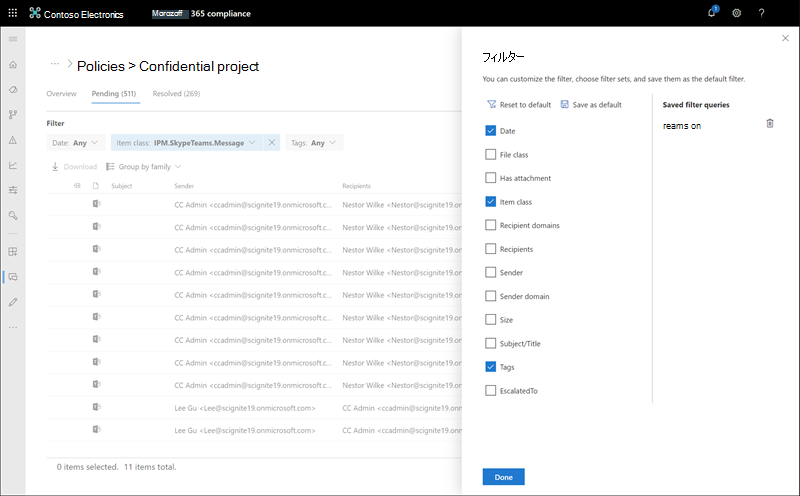
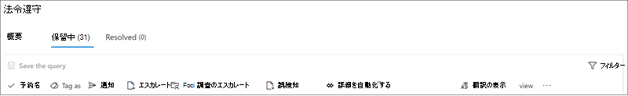
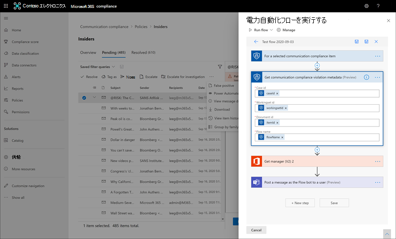

# <a name="investigate-and-remediate-communication-compliance-alerts"></a>通信コンプライアンスのアラートを調査して修復する

[!include[Purview banner](../includes/purview-rebrand-banner.md)]

通信コンプライアンス ポリシーを構成すると、ポリシー条件に一致するメッセージの問題に関するアラートが Microsoft Purview コンプライアンス ポータルで受信されます。 アラートの問題を調査して修復するには、ここのワークフローの手順に従います。

## <a name="investigate-alerts"></a>アラートを調査する

ポリシーによって検出された問題を調査する最初の手順は、Microsoft Purview コンプライアンス ポータルで通信コンプライアンス アラートを確認することです。 通信コンプライアンス ソリューション領域には、アラートグループを表示する方法に応じて、アラートをすばやく調査するのに役立つ領域がいくつかあります。

- **コミュニケーション コンプライアンス ポリシー ページ**: Microsoft 365組織内の管理者アカウントの資格情報を使用して [Microsoft Purview コンプライアンス ポータル](https://compliance.microsoft.com)にサインインする場合は、[**通信コンプライアンス**] を選択して[通信コンプライアンス **ポリシー**] ページを表示します。 このページには、Microsoft 365組織用に構成された通信コンプライアンス ポリシーと、推奨されるポリシー テンプレートへのリンクが表示されます。 一覧に表示される各ポリシーには、確認が必要なアラートの数、エスカレーションされたアイテムと解決されたアイテムの数、ポリシーの状態、および最後のポリシー スキャンの日時が含まれます。 ポリシーのどれかを選択すると、ポリシーに一致しているすべての保留中警告が表示されます。特定の通知を選択して、ポリシーの詳細ページを開き、修復アクションを開始します。
- **アラート**: **[Communication** **complianceAlerts** > ] に移動して、ポリシー一致によってグループ化された過去 30 日間のアラートを表示します。 このビューでは、重要度順に並べ替えられているほとんどの通知を生成している通信コンプライアンスポリシーをすばやく確認できます。 修復アクションを開始するには、アラートに関連付けられているポリシーを選択して、[ **ポリシーの詳細** ] ページを起動します。 **[ポリシーの詳細**] ページでは、[**概要**] ページでアクティビティの概要を確認したり、[**保留中]** ページでアラート メッセージを確認して操作したり、[**解決済** み] ページで閉じたアラートの履歴を確認したりできます。
- **レポート**: **[Communication** **complianceReports**]  >  に移動して、通信コンプライアンス レポート ウィジェットを表示します。 各ウィジェットには、ポリシーの一致と修復アクションに関する詳細な分析情報へのアクセスなど、コミュニケーション コンプライアンス アクティビティと状態の概要が表示されます。

### <a name="using-filters"></a>フィルターの使用

次に、メッセージを並べ替えて、簡単に通知を調べられるようにしてください。 ポリシーの **詳細** ページでは、通信コンプライアンスは、ポリシー一致を使用してメッセージをすばやく調査して確認するのに役立つ、複数のメッセージ フィールドに対する複数レベルのフィルター処理をサポートします。 フィルター処理は、構成された各ポリシーの保留中アイテムと解決済みアイテムに利用できます。 ポリシーのフィルタークエリの構成や、特定のポリシーで使用するカスタムフィルタークエリおよびカスタムフィルタークエリの構成または保存も可能です。 フィルター用のフィールドを構成すると、特定のフィルター値に対して構成可能な警告メッセージキューの上部に、フィルターフィールドが表示されます。

日付フィルターの場合、イベントの日付と時刻は協定世界時 (UTC) に一覧表示されます。 ビューのメッセージをフィルター処理する場合、要求するユーザーのローカル日付/時刻は、ユーザーのローカル日付/時刻から UTC への変換に基づいて結果を決定します。 たとえば、米国太平洋夏時間 (PDT) のユーザーが 2021 年 8 月 30 日から 2021 年 8 月 31 日の 00:00 にレポートをフィルター処理した場合、レポートには 8/30/2021 07:00 UTC から 8/31/2021 07:00 UTC のメッセージが含まれます。 00:00 にフィルター処理するときに同じユーザーが米国東部夏時間 (EDT) にいた場合、レポートには 8/30/2021 04:00 UTC から 8/31/2021 04:00 UTC のメッセージが含まれます。

#### <a name="filter-details"></a>フィルターの詳細

通信コンプライアンス フィルターを使用すると、アラート メッセージをフィルター処理および並べ替えて、より迅速な調査と修復アクションを行うことができます。 フィルター処理は、各ポリシーの **[保留中]** タブと **[解決済み** ] タブで使用できます。 フィルターまたはフィルター セットを保存済みのフィルター クエリとして保存するには、1 つ以上の値をフィルター選択として構成する必要があります。

次の表に、フィルターの詳細の概要を示します。

|**Filter**|**詳細**|
|:-----|:-----|
| **Date** | 組織内のユーザーがメッセージを送受信した日付。 1 日のフィルター処理を行うには、結果の対象となる日から始まり、翌日で終わる日付範囲を選択します。 たとえば、2020 年 9 月 20 日の結果をフィルター処理する場合は、2020 年 9 月 20 日から 2020 年 9 月 21 日までのフィルター日付範囲を選択します。|
| **ファイル クラス** | メッセージの種類 (メッセージまたは *添付ファイル*) に基づく *メッセージ* のクラス。 |
| **添付ファイルがある** | メッセージ内の添付ファイルの存在。 |
| **アイテム クラス** | メッセージの種類、電子メール、Microsoft チーム チャット、Bloomberg などに基づくメッセージのソース。一般的なアイテムの種類とメッセージ クラスの詳細については、「 [アイテムの種類とメッセージ クラス」を](/office/vba/outlook/concepts/forms/item-types-and-message-classes)参照してください。 |
| **受信者ドメイン** | メッセージが送信されたドメイン。 通常、このドメインは既定でMicrosoft 365サブスクリプション ドメインです。 |
| **[受信者]** | メッセージが送信されたユーザー。 |
| **Sender** | メッセージを送信したユーザー。 |
| **送信元ドメイン** | メッセージを送信したドメイン。 |
| **サイズ** | メッセージのサイズ (KB 単位)。 |
| **件名/タイトル** | メッセージの件名またはチャットのタイトル。 |
| **Tags** | メッセージに割り当てられたタグ ( *質問可能*、 *準拠*、 *または非準拠*)。 |
| **Language** | メッセージ内のテキストの検出された言語。 メッセージは、メッセージ テキストの大部分の言語に従って分類されます。 たとえば、ドイツ語とイタリア語の両方のテキストを含むが、テキストの大部分がドイツ語のメッセージの場合、メッセージはドイツ語 (DE) として分類されます。 サポートされている言語は、中国語 (簡体字 - ZH)、英語 (EN)、フランス語 (FR)、ドイツ語 (DE)、イタリア語 (IT)、日本語 (JP)、ポルトガル語 (PT)、スペイン語 (ES) です。 たとえば、ドイツ語とイタリア語として分類されたメッセージをフィルター処理するには、言語フィルター検索ボックスに「DE,IT」(2 桁の言語コード) を入力します。 メッセージの検出された言語分類を表示するには、メッセージを選択し、[メッセージの詳細の表示] を選択して、[EmailDetectedLanguage] フィールドまでスクロールします。 |
| **エスカレート対象** | メッセージ エスカレーション アクションの一部として含まれるユーザーのユーザー名。 |
| **クラシファイア** | メッセージに適用される組み込み分類子とカスタム分類子の名前。 例としては、 *対象となる嫌がらせ*、 *不適切な表現*、 *脅威* などがあります。

#### <a name="to-configure-a-filter"></a>フィルターを構成するには

1. Microsoft 365組織内の管理者アカウントの資格情報を使用して[、Microsoft Purview コンプライアンス ポータル](https://compliance.microsoft.com)にサインインします。

2. Microsoft Purview コンプライアンス ポータルで、 **コミュニケーション コンプライアンス** に移動します。

3. [ **ポリシー** ] タブを選択し、調査するポリシーを選択し、ダブルクリックして **[ポリシー** ] ページを開きます。

4. **[ポリシー**] ページで、[**保留中]** タブまたは [**解決済み**] タブを選択して、フィルター処理の項目を表示します。

5. **[フィルター**] コントロールを選択して、[フィルターの詳細 **]** ページを開きます。

6. これらのアラートのフィルターを有効にするには、1 つまたは複数のチェック ボックスをオンにします。 *日付*、*送信者*、*件名/タイトル*、*分類子*、*言語* など、さまざまなフィルターから選択できます。

7. 選択したフィルターを既定のフィルターとして保存する場合は、[ **既定として保存]** を選択します。 このフィルターを保存されたフィルターとして使用する場合は、[完了] を選択 **します**。

8. 選択したフィルターをフィルター クエリとして保存する場合は、少なくとも 1 つのフィルター値を構成した後、クエリ コントロールを **保存** を選択します。 フィルター クエリの名前を入力し、[ **保存]** を選択します。 このフィルターは、このポリシーでのみ使用でき、[フィルター **の詳細]** ページの [**保存済みフィルター クエリ**] セクションに一覧表示されます。

    

### <a name="using-near-and-exact-duplicate-analysis"></a>準重複分析と完全重複分析の使用

通信コンプライアンスポリシーでは、追加の構成手順を使用せずに、メッセージを自動的にスキャンし、準重複または完全重複にグループ化します。 このビューを使用すると、類似するメッセージを 1 つずつ、またはグループとしてすばやく操作できるため、校閲者のメッセージ調査の負担を軽減できます。 重複が検出されると、修復アクション ツールバーに **準重複** および/または **完全重複** コントロールが表示されます。  このビューは、ほぼ正確な重複が見つからない場合は使用できません。

#### <a name="to-remediate-duplicates"></a>重複を修復するには

1. Microsoft 365組織内の管理者アカウントの資格情報を使用して[、Microsoft Purview コンプライアンス ポータル](https://compliance.microsoft.com)にサインインします。

2. Microsoft Purview コンプライアンス ポータルで、 **コミュニケーション コンプライアンス** に移動します。

3. [ **ポリシー** ] タブを選択し、調査するポリシーを選択し、ダブルクリックして **[ポリシー** ] ページを開きます。

4. [ **ポリシー** ] ページで、[ **保留中]** タブまたは [ **解決済み** ] タブを選択して、重複するメッセージを表示します。

5. **[重複の近く]** コントロールまたは [**完全重複]** コントロールを選択して、重複の詳細ページを開きます。

6. これらのメッセージの修復アクション コントロールに対して 1 つ以上のメッセージを選択します。

7. [ **解決**]、[ **通知]**、[ **エスカレート]**、または **[ダウンロード** ] を選択して、選択した重複するメッセージに既定のフィルターとしてアクションを適用します。

8. メッセージに対する修復アクションが完了したら、[ **閉じる** ] を選択します。

    

## <a name="remediate-alerts"></a>アラートを修復する

警告または構成したフィルター処理を開始する場所に関係なく、次の手順では、通知の修復を実行します。 **ポリシー** またはアラート ページで、次のワークフローを使用して **アラート** の修復を開始します。

### <a name="step-1-examine-the-message-basics"></a>手順 1: メッセージの基本を確認する

 メッセージを直ちに修復できることは、ソースまたは件名から明らかである場合があります。 メッセージが誤ってポリシーに誤って一致している可能性があり、誤って分類されるように解決する必要があります。 誤分類されたコンテンツを Microsoft と共有し、アラートを直ちに解決し、保留中のアラート キューから削除するには、誤分類されたコントロール **としてレポート** を選択します。 ソースまたは送信者の情報から、このような状況でのメッセージのルーティング方法や処理方法が既にわかる場合があります。 **タグ** を使用するか **エスカレート** コントロールの使用を検討して、該当するメッセージにタグを割り当てか、指定した校閲者にメッセージを送信します。



### <a name="step-2-examine-the-message-details"></a>手順 2: メッセージの詳細を調べる

メッセージの基本を確認したら、メッセージを開いて詳細を調べ、さらなる修復アクションを決定します。 メッセージを選択して、完全なメッセージヘッダーと本文情報を表示します。 適切なアクション のコースを決定するために、いくつかの異なるオプションとビューを使用できます。

- **添付ファイル**: このオプションを使用すると、ポリシー条件に一致する最新の添付ファイルを調べることができます。 最新の添付ファイルコンテンツはテキストとして抽出され、ポリシーの保留中のアラート ダッシュボードで表示できます。 詳細については、 [コミュニケーション コンプライアンス機能のリファレンスを参照してください](/microsoft-365/compliance/communication-compliance-channels)。
- **ソース**: このビューは、ほとんどの Web ベースのメッセージング プラットフォームでよく見られる標準のメッセージ ビューです。 ヘッダー情報は通常のスタイルで書式設定され、メッセージ本文は埋め込みグラフィック ファイルとワード ラップ テキストをサポートします。 ポリシーに対して [光学式文字認識 (OCR)](communication-compliance-policies.md#optical-character-recognition-ocr) が有効になっている場合、ポリシー条件付きと一致する印刷テキストまたは手書きテキストを含む画像は、このビューで関連付けられたメッセージの子項目として表示されます。
- **プレーンテキスト**: テキスト ビューには、メッセージの行番号付きテキストのみのビューが表示され、関連する通信コンプライアンス ポリシーで一致する機密情報の種類の用語またはキーワードのメッセージと添付ファイルにキーワードの強調表示が含まれます。 キーワードの強調表示は、対象領域の長いメッセージと添付ファイルをすばやくスキャンするのに役立ちます。 場合によっては、強調表示されたテキストが、ポリシー条件に一致するメッセージの添付ファイルにのみ含まれる場合があります。 キーワードの強調表示は、ポリシーに割り当てられた組み込みの分類子によって識別される用語ではサポートされていません。 埋め込みファイルは表示されず、このビューに番号を付けた行番号は、複数の校閲者間で関連する詳細を参照するのに役立ちます。
- **会話 (プレビュー)**: Microsoft Teams チャット メッセージで使用できます。このビューには、会話コンテキストでレビュー担当者がアクティビティを表示するのに役立つ、アラート メッセージの前後に最大 5 つのメッセージが表示されます。 このコンテキストは、校閲者がメッセージを迅速に評価し、より多くの情報に基づいたメッセージ解決の決定を行うのに役立ちます。 Teamsで利用可能なすべてのインライン 画像、絵文字、ステッカーなど、会話に対するリアルタイムのメッセージの追加が表示されます。 メッセージへの画像またはテキスト ファイルの添付ファイルは表示されません。 通知は、編集されたメッセージまたは会話ウィンドウから削除されたメッセージに対して自動的に表示されます。 メッセージが解決されると、関連付けられている会話型メッセージは解決されたメッセージと共に保持されません。 メッセージ交換メッセージは、アラート メッセージが識別されてから最大 60 日間使用できます。
- **ユーザー履歴**: ユーザー履歴ビューには、メッセージを送信するユーザーへの通信コンプライアンスポリシーにより生成された他のすべての警告が表示されます。
- **パターン検出通知**: 時間の経過と共に多くの嫌がらせやイジメ行為が発生し、ユーザーが同じ動作のインスタンスを繰り返し発生させる必要があります。 *パターンが検出された* 通知がアラートの詳細に表示され、アラートに注意が向けられます。 パターンの検出はポリシーごとに行われ、送信者によって少なくとも 2 つのメッセージが同じ受信者に送信された過去 30 日間の動作が評価されます。 調査担当者と校閲者は、この通知を使用して、アラートを適切に評価するために繰り返し動作を特定できます。
- **翻訳**: このビューは、レビュー担当者ごとにMicrosoft 365 サブスクリプションの表示言語設定で構成 *された言語* にアラート メッセージ テキストを自動的に変換します。 *翻訳* ビューは、多言語ユーザーを持つ組織の調査サポートを広げるのに役立ち、コミュニケーション コンプライアンスレビュープロセスの外部で追加の翻訳サービスを必要とせずに済みます。 Microsoft 翻訳サービスを使用すると、必要に応じて *翻訳* ビューのオンとオフを切り替え、さまざまな言語をサポートできます。 サポートされている言語の完全な一覧については、「[Microsoft 翻訳ツール言語](https://www.microsoft.com/translator/business/languages/)」を参照してください。 *翻訳ツール言語一覧* に一覧表示されている言語は、*翻訳* ビューでサポートされています。

### <a name="step-3-decide-on-a-remediation-action"></a>手順 3: 修復アクションを決定する

アラートのメッセージの詳細を確認したので、いくつかの修復アクションを選択できます。

- **解決**: **解決** コントロールを選択すると、保留中の **アラート** キューからメッセージがすぐに削除され、メッセージに対してそれ以上のアクションを実行することはできません。 **[解決]** を選択すると、追加の分類なしでアラートが本質的に閉じられました。 解決されたすべてのメッセージが [ **解決** 済み] タブに表示されます。
- **誤分類としてレポート** する: メッセージレビューワークフロー中の任意の時点で、常に誤分類としてメッセージを解決できます。 誤分類は、アラートが動作不能であるか、アラートプロセスとトレーニング可能な分類子によってアラートが正しく生成されなかったことを示します。 アイテムを誤分類として解決すると、メッセージ の内容、添付ファイル、メッセージの件名 (メタデータを含む) が Microsoft に送信され、トレーニング可能な分類子の改善に役立ちます。 Microsoft に送信されるデータには、組織内のユーザーを識別または識別するために使用される可能性のある情報は含まれません。 メッセージに対してそれ以上のアクションを実行できず、誤って分類されたすべてのメッセージが **[解決済み** ] タブに表示されます。
- **Power Automate (プレビュー)**: Power Automate フローを使用して、アラート メッセージのプロセス タスクを自動化します。 既定では、通信コンプライアンスには、 *ユーザーがメッセージ アラートを持つユーザー* の通知プロセスを自動化するために校閲者が使用できる通信コンプライアンス アラート フロー テンプレートがある場合に、通知マネージャーが含まれます。 通信コンプライアンスにおけるPower Automate フローの作成と管理の詳細については、この記事の **「手順 5: フローのPower Automateを検討する**」セクションを参照してください。
- **タグ付け**: メッセージを *準拠*、 *非準拠*、または組織のポリシーと標準に関連する *疑問* としてタグ付けします。 タグとタグ付けコメントを追加すると、エスカレーションや他の内部レビュー プロセスの一部として、ポリシー アラートをマイクロフィルター処理するのに役立ちます。 タグ付けが完了したら、メッセージを解決して保留中のレビュー キューから移動することもできます。
- **通知**: **通知** コントロールを使用して、カスタム通知テンプレートをアラートに割り当て、警告通知をユーザーに送信できます。 **[通信コンプライアンス設定**] 領域で構成されている適切な通知テンプレートを選択し、[**送信**] を選択して、メッセージを送信したユーザーにリマインダーを電子メールで送信し、問題を解決します。
- **エスカレーション**: **エスカレート** コントロールを使用して、組織内の他のユーザーがメッセージを確認する必要があるかどうかを選択できます。 コミュニケーション コンプライアンス ポリシーで構成されたレビュー担当者の一覧から、メッセージ アラートの追加レビューを要求する電子メール通知を送信します。 指定されたレビュー担当者は、電子メール通知のリンクを使用して、確認のためにエスカレーションされたアイテムに直接アクセスできます。
- **調査のためにエスカレート** する: **調査コントロールにエスカレーション** を使用すると、1 つまたは複数のメッセージに対して新しい [電子情報開示 (プレミアム) ケース](overview-ediscovery-20.md)を作成できます。 新しいケースの名前とメモを入力すると、ポリシーに一致するメッセージを送信したユーザーがケースカストディアンとして自動的に割り当てられます。 ケースを管理するための追加のアクセス許可は必要ありません。 ケースを作成しても、メッセージの新しいタグは解決または作成されません。 修復プロセス中に電子情報開示 (プレミアム) ケースを作成するときに、合計 100 件のメッセージを選択できます。 通信コンプライアンスによって監視されるすべての通信チャネル内のメッセージがサポートされます。 たとえば、ユーザーの新しい電子情報開示 (プレミアム) ケースを開くときに、50 件のMicrosoft Teams チャット、25 件のExchange Onlineメール メッセージ、および 25 件のYammer メッセージを選択できます。
- **Teamsでメッセージを削除** する: Teams コントロール **の [メッセージの削除]** コントロールを使用すると、Microsoft Teams チャネルと 1:1 およびグループ チャットからのアラートで識別された不適切なメッセージやコンテンツをブロックできます。 削除されたメッセージとコンテンツは、ブロックされていることを説明するポリシー ヒントと、ビューからの削除に適用されるポリシーに置き換えられます。 受信者には、該当するポリシーとレビュー プロセスの詳細を確認するためのポリシー ヒントのリンクが提供されます。 送信者は、ブロックされたメッセージとコンテンツのポリシー ヒントを受け取りますが、ブロックされたメッセージとコンテンツの詳細を確認して、削除に関するコンテキストを確認できます。

    

### <a name="step-4-determine-if-message-details-should-be-archived-outside-of-communication-compliance"></a>手順 4: メッセージの詳細を通信コンプライアンスの外部にアーカイブする必要があるかどうかを判断する

別のストレージ ソリューションでメッセージをアーカイブする必要がある場合は、メッセージの詳細をエクスポートまたはダウンロードできます。 **ダウンロード** コントロールを選択すると、自動的に選択したメッセージを Microsoft 365 の外部のストレージに保存できる ZIP ファイルに追加します。

### <a name="step-5-consider-power-automate-flows"></a>手順 5: フロー Power Automate検討する

[Microsoft Power Automate](/power-automate/getting-started)は、アプリケーションとサービス間のアクションを自動化するワークフロー サービスです。 テンプレートからのフローを使用するか、手動で作成することで、これらのアプリケーションとサービスに関連付けられている一般的なタスクを自動化できます。 通信コンプライアンスのためにPower Automate フローを有効にすると、アラートとユーザーの重要なタスクを自動化できます。 Power Automate フローを構成して、ユーザーが通信コンプライアンス アラートやその他のアプリケーションを持っているときにマネージャーに通知できます。

通信コンプライアンスを含むMicrosoft 365 サブスクリプションをお持ちのお客様は、推奨される既定の通信コンプライアンス Power Automate テンプレートを使用するために追加のPower Automate ライセンスは必要ありません。 既定のテンプレートは、組織をサポートし、コア通信コンプライアンス シナリオをカバーするようにカスタマイズできます。 これらのテンプレートで Premium Power Automate機能を使用する場合、Microsoft Purview コネクタを使用してカスタム テンプレートを作成する場合、または Microsoft Purview の他のコンプライアンス領域でPower Automate テンプレートを使用する場合は、追加のPower Automate ライセンスが必要になる場合があります。

> [!IMPORTANT]
> Power Automate フローをテストするときに、追加のライセンス検証のプロンプトを受け取っていますか? 組織では、このプレビュー機能のサービス更新プログラムをまだ受け取っていない可能性があります。 更新プログラムが展開され、通信コンプライアンスを含むMicrosoft 365 サブスクリプションを持つすべての組織は、2020 年 10 月 30 日までに推奨されるPower Automate テンプレートから作成されたフローのライセンス サポートを受ける必要があります。



通信コンプライアンス アラートのプロセス自動化をサポートするために、次のPower Automate テンプレートが顧客に提供されます。

- **ユーザーが通信コンプライアンス アラートを受け取ったときにマネージャーに通知** する: 一部の組織では、ユーザーが通信コンプライアンス アラートを受け取ったときに、すぐに管理通知を受け取る必要がある場合があります。 このフローを構成して選択すると、ケース ユーザーのマネージャーに、すべてのアラートに関する次の情報が記載された電子メール メッセージが送信されます。
  - アラートに適用されるポリシー
  - アラートの日付/時刻
  - アラートの重大度レベル

#### <a name="create-a-power-automate-flow"></a>Power Automate フローを作成する

推奨される既定のテンプレートからPower Automate フローを作成するには、アラートで直接作業するときに **、[Automate**] コントロールの **[Power Automate フローの管理**] オプションを使用します。 Power Automate フローの管理を使用して **Power Automate フロー** を作成するには、少なくとも 1 つの通信コンプライアンス ロール グループのメンバーである必要があります。

既定のテンプレートからPower Automate フローを作成するには、次の手順を実行します。

1. [Microsoft Purview コンプライアンス ポータル](https://compliance.microsoft.com)で、**Communication** **compliancePolicies** >  に移動し、確認するアラートを含むポリシーを選択します。
2. ポリシーから [ **保留中]** タブを選択し、保留中のアラートを選択します。
3. アラート アクション メニューから **Power Automate** を選択します。
4. **[Power Automate**] ページで、ページの [**コミュニケーション コンプライアンス テンプレート**] セクションから既定のテンプレートを選択します。
5. フローには、フローに必要な埋め込み接続が一覧表示され、接続の状態が使用可能な場合に表示されます。 必要に応じて、表示されない接続を更新します。 **[続行]** を選択します。
6. 既定では、推奨されるフローは、推奨される通信コンプライアンスと、フローの割り当てられたタスクを完了するために必要なサービス データ フィールドMicrosoft 365事前に構成されています。 必要に応じて、[ **詳細オプションの表示** ] コントロールを使用してフロー コンポーネントをカスタマイズし、フロー コンポーネントで使用可能なプロパティを構成します。
7. 必要に応じて、[新しいステップ] ボタンを選択して、フローに追加 **の手順** を追加します。 ほとんどの場合、推奨される既定のテンプレートでは、この変更は必要ありません。
8. [ **下書きを保存] を** 選択して後で詳細な構成のためにフローを保存するか、[ **保存]** を選択してフローの構成を完了します。
9. **[閉じる**] を選択して、Power Automate フロー ページに戻ります。 新しいテンプレートは、[**マイ フロー**] タブにフローとして一覧表示され、通信コンプライアンス アラートを操作するときにフローを作成したユーザーのPower Automate コントロールから自動的に使用できます。

#### <a name="share-a-power-automate-flow"></a>Power Automate フローを共有する

既定では、ユーザーによって作成されたPower Automate フローは、そのユーザーのみが使用できます。 他の通信コンプライアンス ユーザーがフローにアクセスして使用するには、フロー作成者がフローを共有する必要があります。 フローを共有するには、アラートで直接作業するときに **、Power Automate** コントロールを使用します。

Power Automate フローを共有するには、少なくとも 1 つの通信コンプライアンス ロール グループのメンバーである必要があります。
Power Automate フローを共有するには、次の手順を実行します。

1. [Microsoft Purview コンプライアンス ポータル](https://compliance.microsoft.com)で、**Communication** **compliancePolicies** >  に移動し、確認するアラートを含むポリシーを選択します。
2. ポリシーから [ **保留中]** タブを選択し、保留中のアラートを選択します。
3. アラート アクション メニューから **Power Automate** を選択します。
4. **[Power Automate フロー**] ページで、[**マイ フロー**] タブまたは [**チーム フロー**] タブを選択します。
5. 共有するフローを選択し、フロー オプション メニューから **[共有** ] を選択します。
6. フロー共有ページで、フローの所有者として追加するユーザーまたはグループの名前を入力します。
7. [ **接続の使用** ] ダイアログで **、[OK] を** 選択して、追加されたユーザーまたはグループがフローに完全にアクセスすることを確認します。

#### <a name="edit-a-power-automate-flow"></a>Power Automate フローを編集する

フローを編集する必要がある場合は、アラートで直接作業するときに **Power Automate** コントロールを使用します。 Power Automate フローを編集するには、少なくとも 1 つの通信コンプライアンス ロール グループのメンバーである必要があります。

Power Automate フローを編集するには、次の手順を実行します。

1. [Microsoft Purview コンプライアンス ポータル](https://compliance.microsoft.com)で、**Communication** **compliancePolicies** >  に移動し、確認するアラートを含むポリシーを選択します。
2. ポリシーから [ **保留中]** タブを選択し、保留中のアラートを選択します。
3. アラート アクション メニューから **Power Automate** を選択します。
4. **[Power Automate フロー**] ページで、編集するフローを選択します。 フロー制御メニューから **[編集] を** 選択します。
5. **省略記号** > **設定** を選択してフロー コンポーネントの設定を変更するか、**省略記号****SDelete** >  を選択してフロー コンポーネントを削除します。
6. **[保存] を** 選択し、[**閉じる**] を選択してフローの編集を完了します。

#### <a name="delete-a-power-automate-flow"></a>Power Automate フローを削除する

フローを削除する必要がある場合は、アラートで直接作業するときに **Power Automate** コントロールを使用します。 Power Automate フローを削除するには、少なくとも 1 つの通信コンプライアンス ロール グループのメンバーである必要があります。

Power Automate フローを削除するには、次の手順を実行します。

1. [Microsoft Purview コンプライアンス ポータル](https://compliance.microsoft.com)で、**Communication** **compliancePolicies** >  に移動し、確認するアラートを含むポリシーを選択します。
2. ポリシーから [ **保留中]** タブを選択し、保留中のアラートを選択します。
3. アラート アクション メニューから **Power Automate** を選択します。
4. **[Power Automate フロー**] ページで、削除するフローを選択します。 フロー制御メニューから **[削除]** を選択します。
5. 削除の確認ダイアログで、[ **削除** ] を選択してフローを削除するか、[ **キャンセル]** を選択して削除操作を終了します。

### <a name="step-6-consider-creating-notice-templates"></a>手順 6: 通知テンプレートの作成を検討する

問題の解決プロセスの一環として、ポリシー一致の電子メール リマインダー通知をユーザーに送信する場合は、通知テンプレートを作成できます。 通知は、修復のための特定のアラートを生成したポリシー一致に関連付けられているユーザーの電子メール アドレスにのみ送信できます。 修復ワークフローの一環としてポリシー違反に適用する通知テンプレートを選択する場合は、テンプレートで定義されているフィールド値を受け入れるか、必要に応じてフィールドを上書きするかを選択できます。

通知テンプレートは、 **通信コンプライアンス設定** 領域で次のメッセージ フィールドを定義できるカスタム電子メール テンプレートです。

|**Field**|**必須**| **詳細** |
|:-----|:-----|:-----|
|**テンプレート名** | はい | 修復中に通知ワークフローで選択する通知テンプレートのフレンドリ名は、テキスト文字をサポートします。 |
| **[送信者のアドレス]** | はい | サブスクリプションの Active Directory から選択された、ポリシー一致を持つユーザーにメッセージを送信する 1 人以上のユーザーまたはグループのアドレス。 |
| **CC アドレスと BCC アドレス** | いいえ | サブスクリプションの Active Directory から選択された、ポリシー一致の通知を受け取るオプションのユーザーまたはグループ。 |
| **Subject** | はい | メッセージの件名行に表示される情報は、テキスト文字をサポートします。 |
| **メッセージ本文** | はい | メッセージ本文に表示される情報は、テキストまたは HTML 値をサポートします。 |

### <a name="html-for-notices"></a>通知用の HTML

通知用の単純なテキストベースの電子メール メッセージを作成する場合は、通知テンプレートのメッセージ本文フィールドで HTML を使用して、より詳細なメッセージを作成できます。 次の例では、基本的な HTML ベースの電子メール通知テンプレートのメッセージ本文の形式を示します。

```HTML
<!DOCTYPE html>
<html>
    <body>
        <h2>Action Required: Contoso Employee Code of Conduct Policy Training</h2>
        <p>A recent message you've sent has generated a policy alert for the Contoso Employee <a href='https://www.contoso.com'>Code of Conduct Policy</a>.</p>
        <p>You are required to attend the Contoso Employee Code of Conduct <a href='https://www.contoso.com'>training</a> within the next 14 days. Please contact <a href='mailto:hr@contoso.com'>Human Resources</a> with any questions about this training request.</p>
        <p>Thank you,</p>
        <p><em>Human Resources</em></p>
    </body>
</html>
```

> [!NOTE]
> 現在、通信コンプライアンス通知テンプレートの HTML href 属性の実装では、URL 参照の二重引用符ではなく単一引用符のみがサポートされています。

## <a name="unresolve-messages-preview"></a>メッセージの未解決 (プレビュー)

メッセージが解決されると、[ **保留中]** タブ ビューから削除され、[ **解決** 済み] タブ ビューに表示されます。 *[解決済* み] ビューのメッセージでは、調査と修復のアクションを使用できません。 ただし、誤って解決されたメッセージや、最初の解決後にさらに調査する必要があるメッセージに対して追加のアクションを実行する必要がある場合があります。 解決されていないコマンド機能を使用すると、 *解決済み* ビューから *保留中* のビューに 1 つ以上のメッセージを移動できます。

メッセージの解決を解除するには、次の手順を実行します。

1. Microsoft 365組織の *Communication Compliance Analyst または Communication Compliance* *Investigator* ロール グループに割り当てられたユーザーの資格情報を使用して [、Microsoft Purview コンプライアンス ポータル](https://compliance.microsoft.com)にサインインします。
2. Microsoft Purview コンプライアンス ポータルで、 **コミュニケーション コンプライアンス** に移動します。
3. [ **ポリシー** ] タブを選択し、解決されたアラート メッセージを含むポリシーを選択し、ダブルクリックして **[ポリシー** ] ページを開きます。
4. [ **ポリシー** ] ページで、[ **解決済み** ] タブを選択します。
5. [ **解決済み** ] タブで、 *保留中* に戻す 1 つ以上のメッセージを選択します。
6. コマンド バーで、[ **未解決**] を選択します。
7. [ **未解決] アイテム** ウィンドウで、未解決アクションに適用できるコメントを追加し、[ **保存]** を選択してアイテムを *[保留中]* に戻します。
8. [ **保留中]** タブを選択して、選択した項目が表示されていることを確認します。
