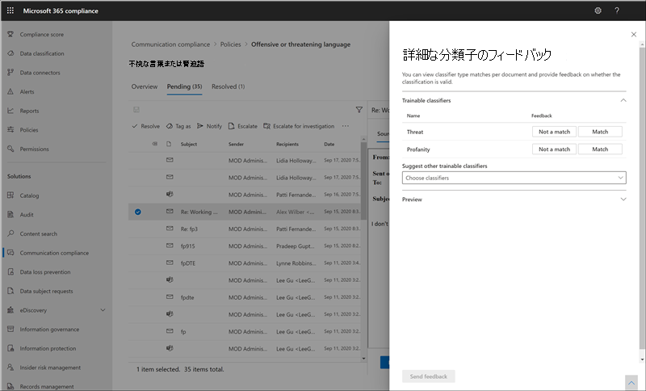

# 通信コンプライアンスのアラートを調査して修復するInvestigate and remediate communication compliance alerts

通信コンプライアンス ポリシーを構成した後、Microsoft 365 コンプライアンス センターでポリシーの条件に一致するメッセージの問題に関するアラートの受信を開始します。After you've configured your communication compliance policies, you'll start to receive alerts in the Microsoft 365 compliance center for message issues that match your policy conditions. ここに示すワークフローの指示に従って、アラートの問題を調査して修復します。Follow the workflow instructions here to investigate and remediate alert issues.

## アラートを調査するInvestigate alerts

ポリシーによって検出された問題を調査する最初の手順は、Microsoft 365 コンプライアンス センターで通信コンプライアンスの警告を確認する手順です。The first step to investigate issues detected by your policies is to review communication compliance alerts in the Microsoft 365 compliance center. 通信コンプライアンス ソリューション領域には、アラートのグループ化の表示方法に応じて、アラートをすばやく調査するのに役立ついくつかの領域があります。There are several areas in the communication compliance solution area to help you to quickly investigate alerts, depending on how you prefer to view alert grouping:

- **通信コンプライアンス ポリシー ページ**: Microsoft 365 組織の管理者アカウントの資格情報を使用してサインインする場合は、[通信コンプライアンス] を選択して通信コンプライアンス ポリシー ページを [https://compliance.microsoft.com](https://compliance.microsoft.com) **表示** します。 **Communication compliance policy page**: When you sign in to [https://compliance.microsoft.com](https://compliance.microsoft.com) using credentials for an admin account in your Microsoft 365 organization, select **Communication compliance** to display the communication compliance **Policy** page. このページには、Microsoft 365 組織用に構成された通信コンプライアンス ポリシーと、推奨されるポリシー テンプレートへのリンクが表示されます。This page displays communication compliance policies configured for your Microsoft 365 organization and links to recommended policy templates. 一覧表示される各ポリシーには、レビューが必要なアラートの数、エスカレートおよび解決されたアイテムの数、ポリシーの状態、最後のポリシー スキャンの日時が含まれます。Each policy listed includes the count of alerts that need review, the number of escalated and resolved items, status of the policy, and the date and time of the last policy scan. ポリシーのどれかを選択すると、ポリシーに一致しているすべての保留中警告が表示されます。特定の通知を選択して、ポリシーの詳細ページを開き、修復アクションを開始します。Selecting a policy displays all the pending alerts for matches to the policy, select a specific alert to launch the policy details page and to start remediation actions.
- **アラート**: 通信コンプライアンス **のアラートに** 移動し、ポリシーの一致別にグループ化された過去 30 日間のアラート  >  を表示します。**Alerts**: Navigate to **Communication compliance** > **Alerts** to display the last 30 days of alerts grouped by policy matches. このビューでは、重要度順に並べ替えられているほとんどの通知を生成している通信コンプライアンスポリシーをすばやく確認できます。This view allows you to quickly see which communication compliance policies are generating the most alerts ordered by severity. 修復アクションを開始するには、アラートに関連付けられているポリシーを選択して、[ポリシーの詳細] **ページを起動** します。To start remediation actions, select the policy associated with the alert to launch the **Policy details** page. [ポリシーの詳細] ページでは、[概要] ページでアクティビティの概要を確認したり、[**保留中**] ページでアラート メッセージを確認して処理したり、解決済みページで閉じたアラートの履歴を確認できます。From the **Policy details** page, you can review a summary of the activities on the **Overview** page, review and act on alert messages on the **Pending** page, or review the history of closed alerts on the **Resolved** page.
- **レポート**: 通信コンプライアンス **レポートに**  >  **移動して、通信** コンプライアンス レポートウィジェットを表示します。**Reports**: Navigate to **Communication compliance** > **Reports** to display communication compliance report widgets. 各ウィジェットは、ポリシーの一致や修復アクションに関するより深い洞察へのアクセスを含む、通信コンプライアンスのアクティビティと状態の概要を提供します。Each widget provides an overview of communication compliance activities and statuses, including access to deeper insights about policy matches and remediation actions.

### フィルターの使用Using filters

次に、メッセージを並べ替えて、簡単に通知を調べられるようにしてください。The next step is to sort the messages so that it's easier for you to investigate alerts. [ポリシー **の詳細]** ページでは、通信コンプライアンスは複数のメッセージ フィールドに対する複数レベルのフィルター処理をサポートし、ポリシーの一致を含むメッセージをすばやく調査および確認するのに役立ちます。From the **Policy details** page, communication compliance supports multi-level filtering for several message fields to help you quickly investigate and review messages with policy matches. フィルター処理は、構成された各ポリシーの保留中アイテムと解決済みアイテムに利用できます。Filtering is available for pending and resolved items for each configured policy. ポリシーのフィルタークエリの構成や、特定のポリシーで使用するカスタムフィルタークエリおよびカスタムフィルタークエリの構成または保存も可能です。You can configure filter queries for a policy or configure and save custom and default filter queries for use in each specific policy. フィルター用のフィールドを構成すると、特定のフィルター値に対して構成可能な警告メッセージキューの上部に、フィルターフィールドが表示されます。After configuring fields for a filter, you'll see the filter fields displayed on the top of the alert message queue that you can configure for specific filter values.

フィルターとフィールドの詳細の完全な一覧については、機能のリファレンス記事の [「](communication-compliance-feature-reference.md#filters) フィルター」を参照してください。For a complete list of filters and field details, see [Filters](communication-compliance-feature-reference.md#filters) in the feature reference article.

#### フィルターを構成するにはTo configure a filter

1. Microsoft [https://compliance.microsoft.com](https://compliance.microsoft.com) 365 組織の管理者アカウントの資格情報を使用してサインインします。Sign into [https://compliance.microsoft.com](https://compliance.microsoft.com) using credentials for an admin account in your Microsoft 365 organization.

2. Microsoft 365 コンプライアンス センターで、通信コンプライアンスに **移動します**。In the Microsoft 365 compliance center, go to **Communication compliance**.

3. [ポリシー **] タブを** 選択し、調査用のポリシーを選択し、ダブルクリックして [ポリシー] ページ **を開** きます。Select the **Policies** tab and then select a policy for investigation, double-click to open the **Policy** page.

4. [ポリシー **] ページ** で、[保留中] タブまたは **[** 解決済み] タブを選択して、フィルター処理用のアイテムを表示します。On the **Policy** page, select either the **Pending** or **Resolved** tab to display the items for filtering.

5. [フィルター] **コントロールを** 選択して、[フィルター] **詳細ページ** を開きます。Select the **Filters** control to open the **Filters** details page.

6. これらのアラートのフィルターを有効にするには、1 つ以上のチェック ボックスをオンにします。Select one or more checkboxes to enable filters for these alerts. 日付、送信者、件名 */* タイトル、分類子など、さまざまなフィルター *から* 選択できます。You can choose from numerous filters, including *Date*, *Sender*, *Subject/Title*, *Classifiers*, and more.

7. 選択したフィルターを既定のフィルターとして保存する場合は、[既定で保存] **を選択します**。If you'd like to save the filter selected as the default filter, select **Save as default**. 保存されたフィルターとしてこのフィルターを使用する場合は、[完了] を選択 **します**。If you want to use this filter as a saved filter, select **Done**.

8. 選択したフィルターをフィルター クエリとして保存する場合は、フィルター値を少なくとも 1 つ構成した後、[クエリ コントロールを保存する] を選択します。If you'd like to save the selected filters as a filter query, select **Save the query** control after you've configured at least one filter value. フィルター クエリの名前を入力し、[保存] を選択 **します**。Enter a name for the filter query and select **Save**. このフィルターは、このポリシーでのみ使用できます。[フィルターの詳細]ページの [保存済みフィルター クエリ]**セクションに** 一覧表示されます。This filter is available to use for only this policy and is listed in the **Saved filter queries** section of the **Filters** details page.

    

### 準重複分析と完全重複分析の使用Using near and exact duplicate analysis

通信コンプライアンスポリシーでは、追加の構成手順を使用せずに、メッセージを自動的にスキャンし、準重複または完全重複にグループ化します。Communication compliance policies automatically scan and pre-group near and exact message duplicates without any additional configuration steps. このビューを使用すると、類似したメッセージに対して 1 対 1 またはグループとして迅速に対応し、レビュー担当者のメッセージ調査の負担を軽減できます。This view allows you to quickly act on similar messages one-by-one or as a group, reducing the message investigation burden for reviewers. 重複が検出されると、修復アクション ツールバーに **準重複** および/または **完全重複** コントロールが表示されます。 As duplicates are detected, the **Near Duplicates** and/or the **Exact Duplicates** controls are displayed in the remediation action toolbar. このビューは、近い重複または正確な重複が見つからない場合は使用できません。This view isn't available if near or exact duplicates aren't found.

#### 重複を修復するにはTo remediate duplicates

1. Microsoft [https://compliance.microsoft.com](https://compliance.microsoft.com) 365 組織の管理者アカウントの資格情報を使用してサインインします。Sign into [https://compliance.microsoft.com](https://compliance.microsoft.com) using credentials for an admin account in your Microsoft 365 organization.

2. Microsoft 365 コンプライアンス センターで、通信コンプライアンスに **移動します**。In the Microsoft 365 compliance center, go to **Communication compliance**.

3. [ポリシー **] タブを** 選択し、調査用のポリシーを選択し、ダブルクリックして [ポリシー] ページ **を開** きます。Select the **Policies** tab and then select a policy for investigation, double-click to open the **Policy** page.

4. [ポリシー **] ページで**、[保留中] タブまたは **[** 解決済み] タブを選択して、重複するメッセージを表示します。On the **Policy** page, select either the **Pending** or **Resolved** tab to display duplicate messages.

5. [近 **重複] コントロールまたは [** 完全に重複] コントロール **を** 選択して、複製の詳細ページを開きます。Select the **Near Duplicates** or **Exact Duplicates** controls to open the duplicates details page.

6. これらのメッセージの修復アクション コントロールに 1 つ以上のメッセージを選択します。Select one or more messages to remediation action controls for these messages.

7. [**解決]、[\*\*\*\*通知]、[\*\*\*\*エスカレート**]、または [**ダウンロード**] を選択して、選択した重複メッセージにアクションを既定のフィルターとして適用します。Select **Resolve**, **Notify**, **Escalate**, or **Download** to apply the action to the selected duplicate messages as the default filter.

8. メッセージ **の修復アクション** を完了した後、[閉じる] を選択します。Select **Close** after completing the remediation actions on the messages.

    

## アラートを修復するRemediate alerts

警告または構成したフィルター処理を開始する場所に関係なく、次の手順では、通知の修復を実行します。No matter where you start to review alerts or the filtering you configure, the next step is to take action to remediate the alert. [ポリシー] または [アラート] ページで次のワークフローを使用して、アラート **の** 修復 **を開始** します。Start your alert remediation using the following workflow on the **Policy** or **Alerts** pages.

### 手順 1: メッセージの基本を確認するStep 1: Examine the message basics

 場合によっては、メッセージを直ちに修復できるのがソースまたは件名から明らかです。Sometimes it's obvious from the source or subject that a message can be immediately remediated. メッセージが偽陽性または誤ってポリシーと一致し、誤検知として解決される可能性があります。It may be that the message is spurious or incorrectly matched to a policy and it should be resolved as a false positive. **誤検知** コントロールを選択して、直ちに通知を解決して保留中通知キューから通知を削除します。Select the **False Positive** control to immediately resolve the alert and remove from the pending alert queue. ソースまたは送信者の情報から、このような状況でのメッセージのルーティング方法や処理方法が既にわかる場合があります。From the source or sender information, you may already know how the message should be routed or handled in these circumstances. **タグ** を使用するか **エスカレート** コントロールの使用を検討して、該当するメッセージにタグを割り当てか、指定した校閲者にメッセージを送信します。Consider using the **Tag as** or **Escalate** controls to assign a tag to applicable messages or to send messages to a designated reviewer.

### 手順 2: メッセージの詳細を確認するStep 2: Examine the message details

メッセージの基本を確認した後、メッセージを開いて詳細を調べ、さらに修復アクションを決定します。After reviewing the message basics, it's time to open a message to examine the details and to determine further remediation actions. メッセージを選択して、完全なメッセージヘッダーと本文情報を表示します。Select a message to view the complete message header and body information. 正しい修正対策を決定するのに役立つさまざまなビューが利用できます。Several different views are available to help you decide the proper course of action:

- **ソースビュー**: このビューは、ウェブベースのメッセージングプラットフォームのほとんどで一般的に見られる標準的なメッセージビューです。**Source view**: This view is the standard message view commonly seen in most web-based messaging platforms. ヘッダー情報は通常のスタイルで書式設定され、メッセージ本文は、mbedded グラフィック ファイルと単語でラップされたテキストをサポートします。The header information is formatted in the normal style and the message body supports imbedded graphic files and word-wrapped text.
- **テキスト ビュー**: テキスト ビューには、メッセージの行番号付きテキスト専用ビューが表示され、関連付けられた通信コンプライアンス ポリシーで一致する用語のメッセージと添付ファイルにキーワードの強調表示が含まれます。**Text view**: Text view displays a line-numbered text-only view of the message and includes keyword highlighting in messages and attachments for terms matched in the associated communication compliance policy. キーワードの強調表示は、長いメッセージや添付ファイルをスキャンして関心のある領域をすばやく検索するのに役立ちます。Keyword highlighting can help you quickly scan long messages and attachments for the area of interest. 場合によっては、強調表示されたテキストは、ポリシー条件に一致するメッセージの添付ファイルにのみ含まれます。In some cases, highlighted text may be only in attachments for messages matching policy conditions. 埋め込みファイルは表示されません。このビューの行番号は、複数のレビュー担当者間で関連する詳細を参照する場合に役立ちます。Embedded files aren't displayed and the line numbering this view is helpful for referencing pertinent details among multiple reviewers.
- **ビューに注釈を付ける**: このビューでは、メッセージのビューに保存されているメッセージに、レビュー担当者が直接注釈を追加することができます。**Annotate view**: This view allows reviewers to add annotations directly on the message that are saved to the view of the message.
- **ユーザー履歴**: ユーザー履歴ビューには、メッセージを送信するユーザーへの通信コンプライアンスポリシーにより生成された他のすべての警告が表示されます。**User history**: User history view displays all other alerts generated by any communication compliance policy for the user sending the message.
- **メッセージ詳細ビュー**: メッセージメタデータと構成情報の詳細ビュー。**Message detail view**: Advanced view of message metadata and configuration information.
- **パターン検出通知**: 時間の流中にアクションを動かし、悪意を持ち、ユーザーが同じ動作のインスタンスを何度も発生します。**Pattern detected notification**: Many harassing and bullying actions over time and involve reoccurring instances of the same behavior by a user. 検出 *されたパターン通知* はアラートの詳細に表示され、警告に注目します。The *Pattern detected* notification is displayed in the alert details and raises attention to the alert. パターンの検出はポリシーごとに行い、送信者が少なくとも 2 つのメッセージを同じ受信者に送信した場合の過去 30 日間の動作を評価します。Detection of patterns is on a per-policy basis and evaluates behavior over the last 30 days when at least two messages are sent to the same recipient by a sender. 調査担当者とレビュー担当者は、この通知を使用して繰り返し動作を識別し、必要に応じてアラートを評価できます。Investigators and reviewers can use this notification to identify repeated behavior to evaluate the alert as appropriate.
- **翻訳ビューの** 表示 : このビューは、通知メッセージテキストを、各レビューアーの Microsoft 365 サブスクリプションの表示言語設定で構成されている言語に自動的に変換します。**Show Translate view**: This view automatically converts alert message text to the language configured in the *Displayed language* setting in the Microsoft 365 subscription for each reviewer. 翻訳ビューは、多言語ユーザーを持つ組織の調査サポートを拡大するのに役立ち、コミュニケーション コンプライアンス レビュー プロセスの外部で追加の翻訳サービスを必要とします。The Translate view helps broaden investigative support for organizations with multilingual users and eliminates the need for additional translation services outside of the communication compliance review process. Microsoft 翻訳サービスを使用すると、翻訳ビューを必要に応じてオンまたはオフにし、さまざまな言語をサポートできます。Using Microsoft Translate services, the Translate view can be turned on and off as needed and supports a wide range of languages. サポートされている言語の完全な一覧については [、「Microsoft Translator Languages」を参照してください](https://www.microsoft.com/translator/business/languages/)。For a complete list of supported languages, see [Microsoft Translator Languages](https://www.microsoft.com/translator/business/languages/). 翻訳者の言語の一覧に表示 *される言語* は、翻訳ビューでサポートされています。Languages listed in the *Translator Language List* are supported in the Translate view.

    

### 手順 3: 修復アクションを決定するStep 3: Decide on a remediation action

アラートのメッセージの詳細を確認したので、いくつかの修復アクションを選択できます。Now that you've reviewed the details of the message for the alert, you can choose several remediation actions:

- **解決**: [解決] コントロール **を選択すると**、保留中の通知キューからすぐにメッセージが削除され、メッセージに対してそれ以上の処理は実行されません。**Resolve**: Selecting the **Resolve** control immediately removes the message from the **Pending alerts** queue and no further action can be taken on the message. [解決] **を** 選択すると、基本的に、追加の分類なしでアラートを閉じ、それ以上の操作のために再度開く操作を行う必要があります。By selecting **Resolve**, you've essentially closed the alert without further classification and it can't be reopened for further actions. 解決済みメッセージはすべて [解決済み] タブ **に表示** されます。All resolved messages are displayed in the **Resolved** tab.
- **誤検知**: メッセージ レビュー ワークフローの任意の時点で、いつでもメッセージを誤検知として解決できます。**False Positive**: You can always resolve a message as a false positive at any point during the message review workflow. 誤検知は、アラートが操作不可だったか、通知プロセスによって誤って生成されたアラートを示します。False positive signifies that the alert was non-actionable or that the alert was incorrectly generated by the alerting process. メッセージを再度開け、すべての誤検知メッセージが [解決済み] タブ **に表示** されます。The message cannot be reopened and all false positive messages are displayed in the **Resolved** tab.
- **Power Automate (プレビュー)**: Power Automate フローを使用して、アラート メッセージのプロセス タスクを自動化します。**Power Automate (preview)**: Use a Power Automate flow to automate process tasks for an alert message. 既定では、通信コンプライアンスには、レビュー担当者がメッセージ通知を使用するユーザーの通知プロセスを自動化するために使用できる通信コンプライアンスアラート フロー テンプレートがユーザーにある場合に、通知マネージャーが含まれます。By default, communication compliance includes the *Notify manager when a user has a communication compliance alert* flow template that reviewers can use to automate the notification process for users with message alerts. 通信コンプライアンスでの Power Automate フローの作成と管理の詳細については、通信コンプライアンス機能のリファレンス [記事を参照](communication-compliance-feature-reference.md#power-automate-flows) してください。For more information about creating and managing Power Automate flows in communication compliance, see the [Communication compliance feature reference](communication-compliance-feature-reference.md#power-automate-flows) article.
- **タグ:** メッセージに準拠しているタグ、非準拠、または組織のポリシーと標準に関連する問題としてタグ付けします。 **Tag as**: Tag the message as *compliant*, *non-compliant*, or as *questionable* as it relates to the policies and standards for your organization. タグとタグ付けコメントを追加すると、エスカレーションや他の内部レビュー プロセスの一部としてポリシーアラートをマイクロフィルター処理できます。Adding tags and tagging comments helps you micro-filter policy alerts for escalations or as part of other internal review processes. タグ付けが完了したら、メッセージを解決して保留中のレビュー キューからメッセージを移動する方法も選択できます。After tagging is complete, you can also choose to resolve the message to move it out of the pending review queue.
- **通知**: 通知コントロールを使用 **して** 、通知にカスタム通知テンプレートを割り当て、警告通知をユーザーに送信できます。**Notify**: You can use the **Notify** control to assign a custom notice template to the alert and to send a warning notice to the user. 通信コンプライアンス設定領域で構成されている適切な通知テンプレートを選択し、メッセージを送信したユーザーに通知を電子メールで送信するを選択して、問題を解決します。Choose the appropriate notice template configured in the **Communication compliance settings** area and select **Send** to email a reminder to the user that sent the message and to resolve the issue.
- **エスカ** レート : **エスカレート** コントロールを使用すると、組織内の他のユーザーがメッセージを確認する必要があるユーザーを選択できます。**Escalate**: Using the **Escalate** control, you can choose who else in your organization should review the message. 通信コンプライアンス ポリシーで構成されているレビュー担当者の一覧から選択し、メッセージアラートの追加レビューを要求する電子メール通知を送信します。Choose from a list of reviewers configured in the communication compliance policy to send an email notification requesting additional review of the message alert. 指定されたレビュー担当者は、電子メール通知のリンクを使用して、確認のためにエスカレーションされたアイテムに直接アクセスできます。The selected reviewer can use a link in the email notification to go directly to items escalated to them for review.
- **調査のためのエスカ** レート : **エス** カレートを使用して調査制御を行い、1 つ以上のメッセージに対して新しい [Advanced eDiscovery](overview-ediscovery-20.md) ケースを作成できます。**Escalate for investigation**: Using the **Escalate for investigation** control, you can create a new [Advanced eDiscovery case](overview-ediscovery-20.md) for single or multiple messages. 新しいケースの名前とメモを指定し、ポリシーに一致するメッセージを送信したユーザーは、ケース保管担当者として自動的に割り当てられます。You'll provide a name and notes for the new case, and user who sent the message matching the policy is automatically assigned as the case custodian. ケースを管理するために追加のアクセス許可は必要ない。You don't need any additional permissions to manage the case. ケースを作成しても、メッセージの新しいタグが解決または作成されません。Creating a case does not resolve or create a new tag for the message. 修復プロセス中に Advanced eDiscovery ケースを作成するときに、合計 100 件のメッセージを選択できます。You can select a total of 100 messages when creating an Advanced eDiscovery case during the remediation process. 通信コンプライアンスによって監視される、すべての通信チャネル内のメッセージがサポートされます。Messages in all communication channels monitored by communication compliance are supported. たとえば、ユーザーの新しい Advanced eDiscovery ケースを開く際に、50 の Microsoft Teams チャット、25 の Exchange Online 電子メール メッセージ、および 25 Yammer メッセージを選択できます。For example, you could select 50 Microsoft Teams chats, 25 Exchange Online email messages, and 25 Yammer messages when you open a new Advanced eDiscovery case for a user.
- **分類の向上 (プレビュー)**: 分類子の種類の一致から作成されたアラートには、組織の誤検知を最小限に抑えるためのフィードバックが必要な場合があります。**Improve classification (preview)**: Alerts created from classifier type matches may need feedback to help minimize false positives in your organization. 通信コンプライアンス **の分類** が有効な場合に関するフィードバックを提供したり、この種類の一致に対応する他のトレーニング可能な分類子を提案したりするには、分類の改善コントロールを使用します。Use the **Improve classification** control to provide feedback on if the communication compliance classification is valid or to suggest other trainable classifiers for this type of match. 分類子が一致または一致しないか、または他のトレーニング可能な分類子が将来この種類のアラート アクティビティに関連付ける必要があることを確認できます。You can confirm that the classifiers are either a *Match* or *Not a match*, or suggest other trainable classifiers to associate with this type of alert activity in the future.

    1. 通知リストからメッセージを選択します。Select a message from the alert list.
    2. 省略記号を選択し、[分類の改善 **] を選択します**。Choose the ellipsis and select **Improve classification**.
    3. [ **詳細分類子のフィードバック] ウィンドウ** で、アイテムが正の場合は [一致] を選択 **します**。In the **Detailed classifier feedback** pane, if the item is a true positive, choose **Match**.  誤検知としてアイテムが誤ってカテゴリに含まれている場合は、[一致しない **] を選択します**。If the item was incorrectly included in the category as a false positive, choose **Not a match**.
    4. アイテムに適した別の分類子がある場合は、[他のトレーニング可能な分類子を提案する] の一覧 **から** 選択します。If there is another classifier that would be more appropriate for the item, choose it from the **Suggest other trainable classifiers** list. このフィードバックにより、他の分類子がアイテムを評価します。This feedback triggers the other classifier to evaluate the item.

    > [!TIP]
    > すべての項目を選択し、コマンド バーで [詳細なフィードバックの提供] を選択すると、複数の項目に対するフィードバックを同時に提供できます。You can provide feedback on multiple items simultaneously by choosing them all and then choosing **Provide detailed feedback** in the command bar.

    5. [**フィードバックの送信**] を選択して、マッチと非マッチの分類の評価を送信し、他のトレーニング可能な分類子を提案します。Choose **Send feedback** to send your evaluation of the **Match** and **Not a match** classifications and suggest other trainable classifiers. 分類子にフィードバックのインスタンスを 30 回提供すると、自動的に再トレーニングが行われます。When you've provided 30 instances of feedback to a classifier, it automatically retrains. 再トレーニングの完了には 1 ~ 4 時間かかる場合があります。Retraining may take 1-4 hours to complete. 分類子は、1 日に 2 回のみ再トレーニングできます。Classifiers can only be retrained twice per day.

    > [!IMPORTANT]
    > この情報は、テナント内の分類子に移動します **が、Microsoft に戻るのではありません**。This information goes to the classifier in your tenant, **it does not go back to Microsoft**.

    通信コンプライアンスの分類子の再トレーニングの詳細については、通信コンプライアンスの記事で分類子を再トレーニングする [方法に関する記事を参照](classifier-how-to-retrain-comms-compliance.md) してください。To learn more about retraining classifier for communication compliance, see the [How to retrain a classifier in communications compliance](classifier-how-to-retrain-comms-compliance.md) article.

    

- **Teams** でメッセージを削除する : **Teams** コントロールの [メッセージの削除] を使用すると、Microsoft Teams チャネルおよび 1 対 1 およびグループ チャットからのアラートで識別された不適切なメッセージとコンテンツをブロックできます。**Remove message in Teams**: Using the **Remove message in Teams** control, you can block inappropriate messages and content identified in alerts from Microsoft Teams channels and 1:1 and group chats. 削除されたメッセージとコンテンツは、ブロックされ、ビューからの削除に適用されるポリシーを説明するポリシー ヒントに置き換わります。Removed messages and content are replaced with a policy tip that explains that it is blocked and the policy that applies to its removal from view. 受信者には、該当するポリシーとレビュー プロセスの詳細を確認するリンクがポリシー ヒントに表示されます。Recipients are provided a link in the policy tip to learn more about the applicable policy and the review process. 送信者は、ブロックされたメッセージとコンテンツのポリシー ヒントを受信しますが、削除に関するコンテキストについて、ブロックされたメッセージとコンテンツの詳細を確認できます。The sender receives a policy tip for the blocked message and content but can review the details of the blocked message and content for context regarding the removal.

    

### 手順 4: 通信コンプライアンスの外部でメッセージの詳細をアーカイブする必要かどうかを決定するStep 4: Determine if message details should be archived outside of communication compliance

別のストレージ ソリューションでメッセージをアーカイブする必要がある場合は、メッセージの詳細をエクスポートまたはダウンロードできます。Message details can be exported or downloaded if you need to archive the messages in a separate storage solution. **ダウンロード** コントロールを選択すると、自動的に選択したメッセージを Microsoft 365 の外部のストレージに保存できる ZIP ファイルに追加します。Selecting the **Download** control automatically adds selected messages to a .ZIP file that can be saved to storage outside of Microsoft 365.
