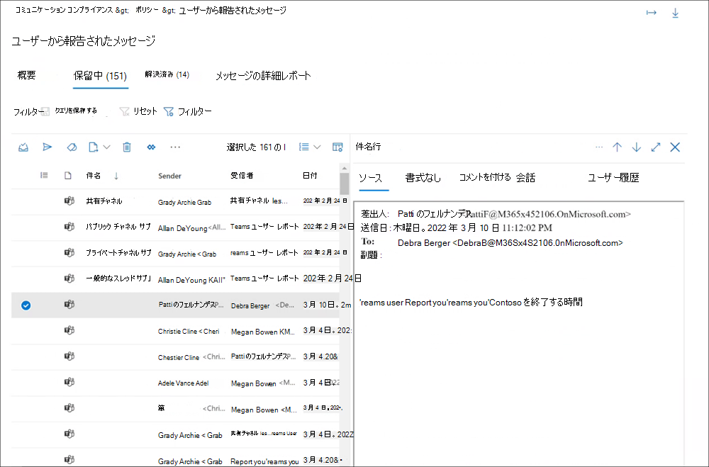

# コミュニケーション コンプライアンス ポリシー

[!include[Purview banner](../includes/purview-rebrand-banner.md)]

## ポリシー

> [!IMPORTANT]
> PowerShell を使用してコミュニケーション コンプライアンス ポリシーを作成し、管理することはできません。 これらのポリシーを作成および管理するには、 [通信コンプライアンス ソリューション](https://compliance.microsoft.com/supervisoryreview)でポリシー管理コントロールを使用する必要があります。

Microsoft Purview コンプライアンス ポータルで、Microsoft 365 組織の通信コンプライアンス ポリシーを作成します。 コミュニケーション コンプライアンス ポリシーは、組織内でレビューする対象となる通信とユーザーを定義し、通信が満たす必要があるカスタム条件を定義し、レビューを行うユーザーを指定します。 *コミュニケーション コンプライアンス管理者* ロールを割り当てられたユーザーはポリシーを設定でき、このロールが割り当てられているすべてのユーザーは、Microsoft Purview コンプライアンス ポータルの **[通信コンプライアンス**] ページとグローバル設定にアクセスできます。 必要に応じて、ポリシーへの変更履歴を.csv (コンマ区切り値) ファイルにエクスポートできます。これには、アラートの保留中のレビュー、エスカレーションされたアイテム、解決済みアイテムの状態も含まれます。 ポリシーの名前を変更できず、不要になったときに削除できます。

## ポリシー テンプレート

ポリシー テンプレートは、一般的なコンプライアンス シナリオに対処するためのポリシーをすばやく作成するために使用できる定義済みのポリシー設定です。 これらの各テンプレートには条件とスコープに違いがあり、すべてのテンプレートで同じ種類のスキャン信号が使用されます。 次のポリシー テンプレートから選択できます。

|**領域**|**ポリシー テンプレート**|**詳細**|
|:-----|:-----|:-----|
| **不適切なテキスト** | 不適切なテキストを検出する | - 場所: Exchange Online、Microsoft Teams、Yammer、Skype for Business   - 方向: 受信、送信、内部   - レビューの割合: 100%   - 条件: 脅威、差別、および対象の嫌がらせ分類子 |
| **不適切な画像** | 不適切な画像を検出する | - 場所: Exchange Online、Microsoft Teams、Yammer、Skype for Business   - 方向: 受信、送信、内部   - レビューの割合: 100%   - 条件: 成人および Racy 画像分類子 |
| **機密情報** | 機密情報を監視する | - 場所: Exchange Online、Microsoft Teams、Yammer、Skype for Business   - 方向: 受信、送信、内部   - レビューの割合: 10%   - 条件: 機密情報、既定のコンテンツ パターン、および種類、ユーザー辞書オプション、1 MB を超える添付ファイル |
| **規制コンプライアンス** | 規制コンプライアンスを監視する | - 場所: Exchange Online、Microsoft Teams、Yammer、Skype for Business   - 方向: 受信、送信   - レビューの割合: 10%   - 条件: ユーザー辞書オプション、1 MB を超える添付ファイル |
| **コンフリクトオブインタレスト** | 競合を監視する | - 場所: Exchange Online、Microsoft Teams、Yammer、Skype for Business   - 方向: 内部   - レビューの割合: 100%   - 条件: なし |

通信は、ポリシーが作成された時刻から 24 時間ごとにスキャンされます。 たとえば、午前 11 時に不適切なコンテンツ ポリシーを作成した場合、ポリシーは毎日午前 11 時 00 分に 24 時間ごとに通信コンプライアンス信号を収集します。 ポリシーを編集しても、今回は変更されません。 ポリシーの最後のスキャン日時を表示するには、[ポリシー **] ページの** *[最後のポリシー スキャン*] 列に移動します。 新しいポリシーを作成した後、最初のポリシー スキャンの日時を表示するのに最大で 24 時間かかる場合があります。 最後のスキャンの日時は、ローカル システムのタイム ゾーンに変換されます。

## ポリシーを一時停止する (プレビュー)

通信コンプライアンス ポリシーを作成すると、必要に応じてポリシーが一時的に一時停止することがあります。 ポリシーの一時停止は、ポリシー一致のテストやトラブルシューティング、またはポリシー条件の最適化に使用できます。 このような状況でポリシーを削除する代わりに、ポリシーを一時停止すると、継続的な調査とレビューのために既存のポリシー アラートとメッセージも保持されます。 ポリシーを一時停止すると、ポリシーが一時停止された時点でポリシーに定義されているすべてのユーザー メッセージ条件の検査とアラートの生成が防止されます。 ポリシーを一時停止または再起動するには、ユーザーが *Communication Compliance Admin* ロール グループのメンバーである必要があります。

ポリシーを一時停止するには、[ポリシー] ページに移動し、 **ポリシー** を選択し、アクション ツール バーで **[ポリシーの一時停止** ] を選択します。 [ **ポリシーの一時停止** ] ウィンドウで、[一時停止] を選択してポリシーを **一** 時停止することを確認します。 ポリシーが一時停止されるまでに最大で 24 時間かかる場合があります。 ポリシーが一時停止されると、ポリシーに一致するメッセージのアラートは作成されません。 ただし、ポリシーを一時停止する前に作成されたアラートに関連付けられたメッセージは、調査、確認、修復に使用できます。

一時停止中のポリシーのポリシーの状態は、いくつかの状態を示している場合があります。

- **アクティブ**: ポリシーがアクティブです
- **一時停止**: ポリシーは完全に一時停止されています。
- **一時停止**: ポリシーは一時停止中です。
- **再開**: 再開中のポリシー。
- **再開中のエラー**: ポリシーを再開するときにエラーが発生しました。 エラー スタック トレースの場合は、[ポリシー] ページの [状態] 列 *の [再開* 中のエラー] 状態にマウス ポインターを合わせます。
- **一時停止中のエラー: ポリシーの一時停止** 中にエラーが発生しました。 エラー スタック トレースの場合は、[ポリシー] ページの [状態] 列の [状態を *一時停止中のエラー* ] にマウス ポインターを合わせます。

ポリシーを再開するには、ポリシー ページに移動し、 **ポリシー** を選択し、アクション ツール バーから **[ポリシーの再開** ] を選択します。 [ **ポリシーの再開** ] ウィンドウで、[再開 **] を選択** してポリシーを再開することを確認します。 場合によっては、ポリシーが再開されるまでに最大で 24 時間かかる場合があります。 ポリシーが再開されると、ポリシーに一致するメッセージのアラートが作成され、調査、確認、修復に使用できるようになります。

## ポリシーをコピーする (プレビュー)

既存の通信コンプライアンス ポリシーを持つ組織では、既存のポリシーから新しいポリシーを作成するシナリオが役に立つ場合があります。 ポリシーをコピーすると、スコープ内のすべてのユーザー、すべての割り当てられたレビュー担当者、すべてのポリシー条件など、既存のポリシーの正確な重複が作成されます。 シナリオの中には、次のものが含まれる場合があります。

- **ポリシー ストレージの制限に達しました**。アクティブな通信コンプライアンス ポリシーには、メッセージ ストレージの制限があります。 ポリシーのストレージ制限に達すると、ポリシーは自動的に非アクティブ化されます。 非アクティブ化されたポリシーの対象となる不適切なメッセージを引き続き検出、キャプチャ、および操作する必要がある組織は、同じ構成で新しいポリシーをすばやく作成できます。
- **ユーザーのグループごとに不適切なメッセージを検出して確認** する: 組織によっては、同じ構成で複数のポリシーを作成することを好む場合がありますが、ポリシーごとに異なるスコープ内ユーザーと異なるレビュー担当者が含まれる場合があります。
- **小さな変更を伴う同様のポリシー**: 複雑な構成または条件を持つポリシーの場合、同様のポリシーから新しいポリシーを作成する時間を節約できます。

ポリシーをコピーするには、ユーザーが *コミュニケーション コンプライアンスまたはコミュニケーション コンプライアンス**管理者* ロール グループのメンバーである必要があります。 既存のポリシーから新しいポリシーを作成した後、新しいポリシー構成に一致するメッセージを表示するのに最大で 24 時間かかる場合があります。

ポリシーをコピーして新しいポリシーを作成するには、次の手順を実行します。

1. コピーするポリシーを選択します。
2. コマンド バーの [ **ポリシーのコピー** ] コマンド バー ボタンを選択するか、ポリシーのアクション メニューから **[ポリシーのコピー** ] を選択します。
3. [ **ポリシーのコピー** ] ウィンドウで、[ポリシー名] フィールドでポリシーの既定の **名前** を受け入れるか、ポリシーの名前を変更できます。 新しいポリシーのポリシー名は、既存のアクティブまたは非アクティブ化されたポリシーと同じにすることはできません。 必要に応じて、[ **説明** ] フィールドに入力します。
4. ポリシーをさらにカスタマイズする必要がない場合は、[ **ポリシーのコピー** ] を選択してプロセスを完了します。 新しいポリシーの構成を更新する必要がある場合は、[ **ポリシーのカスタマイズ**] を選択します。 これにより、新しいポリシーの更新とカスタマイズに役立つポリシー ウィザードが開始されます。

## ユーザーが報告したメッセージ ポリシー

>[!NOTE]
>ユーザーから報告されたメッセージは、2022 年 5 月から[、通信コンプライアンス](/microsoft-365/compliance/communication-compliance-configure#subscriptions-and-licensing)とMicrosoft Teamsのライセンスを付与された組織で利用できるようになります。 この機能は、2022 年 8 月 31 日までにライセンスを受けたすべての組織で使用できる必要があります。

組織内の不適切なメッセージを検出して修復するための階層化された防御の一環として、コミュニケーション コンプライアンス ポリシーをMicrosoft Teamsのユーザーから報告されたメッセージで補完できます。 この機能により、組織内のユーザーは、不適切なメッセージ (言語の嫌がらせや脅し、成人向けコンテンツの共有、機密情報や機密情報の共有など) を自己報告し、安全でコンプライアンスに準拠した作業環境の促進に役立ちます。

[Teams管理センター](/microsoftteams/manage-teams-in-modern-portal)で既定で有効になっている場合、Teams メッセージの *[懸念事項の報告*] オプションを使用すると、組織内のユーザーは、ポリシーのコミュニケーション コンプライアンス レビュー担当者による不適切なメッセージのレビューを送信できます。 これらのメッセージは、Teams チャネル、グループ、プライベート チャットでのメッセージの報告をサポートする既定のシステム ポリシーでサポートされています。

ユーザーがレビューのためにTeamsチャット メッセージを送信すると、メッセージはユーザーが報告したメッセージ ポリシーにコピーされます。 報告されたメッセージは、最初はすべてのチャット メンバーに表示されたままであり、チャット メンバーまたは送信者に対して、チャネル、プライベート、またはグループ チャットでメッセージが報告されたことを通知することはありません。 ユーザーは同じメッセージを複数回報告できず、メッセージはポリシーレビュープロセス中にチャット セッションに含まれるすべてのユーザーに表示されたままになります。 

校閲プロセス中に、コミュニケーション コンプライアンス レビュー担当者は、Teams チャットからメッセージを削除するなど、メッセージに対するすべての標準的な[修復アクション](/microsoft-365/compliance/communication-compliance-investigate-remediate#step-3-decide-on-a-remediation-action)を実行できます。 メッセージの修復方法に応じて、メッセージの送信者と受信者は、レビュー後にTeamsチャットで異なる[通知メッセージ](/microsoftteams/communication-compliance#act-on-inappropriate-messages-in-microsoft-teams)を表示します。

Teams チャットからのユーザー報告メッセージは、ユーザーから報告されたメッセージ ポリシーによって処理される唯一のメッセージであり、ポリシーの割り当てられたレビュー担当者のみが変更できます。 その他のすべてのポリシー プロパティは編集できません。 ポリシーが作成されると、ポリシーに割り当てられる最初のレビュー担当者は、(少なくとも 1 人のユーザーが設定されている場合は) *Communication Compliance Admins* ロール グループのすべてのメンバー、または組織の *グローバル管理者* ロール グループのすべてのメンバーになります。 ポリシー作成者は、 *Communication Compliance Admins* ロール グループからランダムに選択されたユーザー (少なくとも 1 人のユーザーが設定されている場合) または組織の *グローバル管理者* ロール グループからランダムに選択されたユーザーです。  

管理者は、組織に適したカスタム レビュー担当者をこのポリシーに直ちに割り当てる必要があります。 これには、コンプライアンス責任者、リスク責任者、人事部門のメンバーなどのレビュー担当者が含まれる場合があります。 ユーザーから報告されたメッセージとして送信されたチャット メッセージのレビュー担当者をカスタマイズするには、次の手順を実行します。

1. Microsoft 365組織内の管理者アカウントの資格情報を使用して[、Microsoft Purview コンプライアンス ポータル](https://compliance.microsoft.com/)にサインインします。
2. コンプライアンス ポータルで、 **コミュニケーション コンプライアンス** に移動します。
3. [ **ポリシー** ] タブ *で、[ユーザーから報告されたメッセージ* ] ポリシーを選択し、[ **編集]** を選択します。
4. [ **ユーザーから報告されたメッセージの監視** ] ウィンドウで、ポリシーの校閲者を割り当てます。 校閲者は、Exchange Onlineでホストされているメールボックスを持っている必要があります。 レビュー担当者は、ポリシーに追加されると、ポリシーへの割り当てを通知し、レビュー プロセスに関する情報へのリンクを提供するメール メッセージを自動的に受信します。
5. **[保存]** を選択します。

[*懸念事項の報告]* オプションは既定で有効になっており、[Teams管理センター](/microsoftteams/manage-teams-in-modern-portal)のTeamsメッセージング ポリシーを使用して制御できます。 カスタム ポリシーを作成して割り当てる場合を除き、組織内のユーザーは自動的にグローバル ポリシーを取得します。 グローバル ポリシーの設定を編集するか、1 つ以上のカスタム ポリシーを作成して割り当てて、[ *懸念事項の報告* ] オプションをオンまたはオフにします。 詳細については、「[Teamsでのメッセージング ポリシーの管理](/microsoftteams/messaging-policies-in-teams)」を参照してください。  

>[!IMPORTANT]
>PowerShell を使用して、Teams管理センターで **エンド ユーザー レポート オプションを** オンまたはオフにする場合は、[Microsoft Teamsコマンドレット モジュール バージョン 4.2.0](/MicrosoftTeams/teams-powershell-release-notes) 以降を使用する必要があります。

## Storage制限通知 (プレビュー)

各通信コンプライアンス ポリシーには、ストレージの制限サイズが 100 GB または 100 万メッセージのいずれか 1 つ先に達します。 ポリシーがこれらの制限に近づくと、通知メールは *、通信コンプライアンスまたはコミュニケーション コンプライアンス* 管理者ロール グループに割り当てられたユーザーに自動的 *に* 送信されます。 通知メッセージは、ストレージ サイズまたはメッセージ数が制限の 80、90、および 95% に達したときに送信されます。 ポリシーの制限に達すると、ポリシーは自動的に非アクティブ化され、ポリシーはアラートのメッセージの処理を停止します。

>[!IMPORTANT]
>ストレージとメッセージの制限に達したためにポリシーが非アクティブ化された場合は、非アクティブ化されたポリシーを管理する方法を必ず評価してください。 ポリシーを削除すると、すべてのメッセージ、関連付けられた添付ファイル、およびメッセージ アラートが完全に削除されます。 今後使用するためにこれらの項目を維持する必要がある場合は、非アクティブ化されたポリシーを削除しないでください。

ストレージとメッセージの制限に近づくポリシーを管理するには、ポリシーのコピーを作成してカバレッジ継続性を維持するか、次のアクションを実行して、現在のポリシー のストレージ サイズとメッセージ数を最小限に抑えるようにすることを検討してください。

- ポリシーに割り当てられているユーザーの数を減らすことを検討してください。 ポリシーからユーザーを削除するか、ユーザーのグループごとに異なるポリシーを作成すると、ポリシー サイズとメッセージの合計の増加が遅くなる可能性があります。
- ポリシーで過剰な誤検知アラートを調べます。 一般的な誤検知アラートを無視するには、ポリシー条件に例外または変更を追加することを検討してください。
- ポリシーがストレージまたはメッセージの制限に達し、非アクティブ化されている場合は、ポリシーのコピーを作成して、引き続き同じ条件とユーザーの検出とアクションを実行します。

## ポリシー設定

### ユーザー

**[すべてのユーザー**] を選択するか、通信コンプライアンス ポリシーで特定のユーザーを定義するかを選択できます。 [**すべてのユーザー**] を選択すると、すべてのユーザーと、いずれかのユーザーがメンバーとして含まれているすべてのグループにポリシーが適用されます。 特定のユーザーを定義すると、定義されたユーザーと、定義されたユーザーがメンバーとして含まれているすべてのグループにポリシーが適用されます。

### 方向

既定では、[ **方向] 条件が** 表示され、削除できません。 ポリシー内の通信方向の設定は、個別に、または一緒に選択されます。

- **受信**: ポリシー内の他の監視対象ユーザー **を** 含め、外部および内部の送信者から監視対象ユーザーに送信された通信を検出します。
- **送信**: ポリシー内の他の監視対象ユーザーを含め、監視対象のユーザー **から** 外部および内部の受信者に送信された通信を検出します。
- **内部**: ポリシー内の監視対象ユーザーまたはグループ **間** の通信を検出します。

### 機密情報の種類

通信コンプライアンス ポリシーの一部として機密情報の種類を含めるオプションがあります。 機密情報の種類は、クレジット カード番号、銀行口座番号、パスポート番号などを識別して保護するのに役立つ定義済みデータ型またはカスタム データ型です。 [Microsoft Purview データ損失防止に関する学習](dlp-learn-about-dlp.md)の一環として、機密情報の構成では、パターン、文字の近接性、信頼レベル、さらにはカスタム データ型を使用して、機密性の高いコンテンツを識別してフラグを設定できます。 既定の機密情報の種類は次のとおりです。

- 財務的
- 医療と健康
- プライバシー
- カスタム情報の種類

> [!IMPORTANT]
> SIT には、最大一意のインスタンス数パラメーターを定義する 2 つの異なる方法があります。 詳細については、「[SIT のインスタンス数のサポート値](create-a-custom-sensitive-information-type.md#instance-count-supported-values-for-sit)」を参照してください。

機密情報の詳細と既定の型に含まれるパターンの詳細については、「 [機密情報の種類のエンティティ定義](sensitive-information-type-entity-definitions.md)」を参照してください。

### カスタム キーワード ディクショナリ

組織や業界に固有のキーワードを簡単に管理できるように、カスタム キーワード ディクショナリ (または辞書) を構成します。 キーワード ディクショナリは、辞書で最大 100 KB の用語 (圧縮後) をサポートし、任意の言語をサポートします。 テナントの制限は、圧縮後も 100 KB です。 必要に応じて、1 つのポリシーに複数のカスタム キーワード ディクショナリを適用するか、ポリシーごとに 1 つのキーワード ディクショナリを持つことができます。 これらのディクショナリは、通信コンプライアンス ポリシーに割り当てられ、ファイル (.csvや.txtリストなど) から、または [コンプライアンス センターでインポート](create-a-keyword-dictionary.md)できるリストから取得できます。 組織とポリシーに固有の用語または言語をサポートする必要がある場合は、カスタム 辞書を使用します。

### クラシファイア

組み込みのトレーニング可能な分類子とグローバル分類子は、組織内のすべての通信チャネルで送受信されたメッセージをスキャンして、さまざまな種類のコンプライアンスの問題を検出します。 分類子は、人工知能とキーワードの組み合わせを使用して、ハラスメント対策ポリシーに違反する可能性のある言葉を識別します。 組み込みの分類子は、現在、複数の言語でメッセージ キーワードの識別をサポートしています。

- 簡体字中国語
- 英語
- フランス語
- ドイツ語
- イタリア語
- 日本語
- ポルトガル語
- スペイン語

コミュニケーション コンプライアンスの組み込みのトレーニング可能な分類子とグローバル分類子は、次の種類の言語とコンテンツについて、用語、画像、センチメントの通信をスキャンします。

- **成人向け画像**: 本質的に性的に明示的な画像をスキャンします。
- **差別**: 明示的な差別言語をスキャンし、他のコミュニティと比較して、アフリカ系アメリカ人/ブラックコミュニティに対する差別的言語に特に影響を受けます。
- **Gory 画像**: 暴力と痛みのある画像をスキャンします。
- **不適切な表現**: ほとんどの人を困惑させる不適切な表現をスキャンします。
- **わいせつな画像**: 本質的に性的に暗示的な画像をスキャンしますが、成人と見なされる画像よりも明示的なコンテンツが少ない画像をスキャンします。
- **対象となる嫌がらせ**: 人種、色、宗教、国籍に関する人々を対象とした攻撃的な行為をスキャンします。
- **脅威**: 人や財産に対する暴力や身体的危害を加える脅威をスキャンします。

*Adult*、*Racy*、*および Gory* の画像分類子は、.jpeg、.png、.gif、および.bmp形式のファイルをスキャンします。 イメージ ファイルのサイズは 4 メガバイト (MB) 未満でなければならず、画像のサイズは 50 x 50 ピクセルより大きく、評価の対象となる画像の場合は 50 KB (KB) を超える必要があります。 画像識別は、Exchange Online電子メール メッセージとMicrosoft Teamsチャネルとチャットでサポートされています。

組み込みのトレーニング可能なグローバル分類子では、これらの領域全体の用語または画像の完全な一覧は提供されません。 さらに、言語と文化の標準は絶えず変化し、これらの現実に照らして、Microsoft はその裁量で分類子を更新する権利を留保します。 分類子は組織がこれらの領域を監視するのに役立つ場合がありますが、分類子は、そのような言語や画像を監視または対処する組織の唯一の手段を提供することを意図していません。 Microsoft ではなく組織は、地域のプライバシーやその他の適用法の遵守を含め、これらの分野における言語や画像の監視、スキャン、ブロックに関連するすべての決定について責任を負います。 Microsoft では、展開と使用の前に法律相談者に相談することをお勧めします。

> [!NOTE]
> 分類子を使用するポリシーでは、単語数が 6 以上のメッセージを検査および評価します。 6 単語未満のメッセージは、分類子を使用してポリシーで評価されません。 不適切なコンテンツを含む短いメッセージを特定してアクションを実行するには、この種類のコンテンツの通信コンプライアンス ポリシー監視にカスタム キーワード ディクショナリを含めることをお勧めします。

トレーニング可能な分類子の詳細については、「 [トレーニング可能な分類子の概要](classifier-get-started-with.md)」を参照してください。

### 光学式文字認識（OCR）

組織内で不適切な可能性がある画像から印刷されたテキストや手書きのテキストをスキャンして識別するように、組み込みまたはカスタムの通信コンプライアンス ポリシーを構成します。 画像内のテキスト [を識別するための Azure Cognitive Services と光学スキャンの統合サポート](/azure/cognitive-services/computer-vision/overview-ocr) は、アナリストや調査者が、主にテキスト以外のコミュニケーションで不適切な行為が見逃される可能性があるインスタンスを検出し、行動するのに役立ちます。

テンプレート、カスタム ポリシーからの新しいポリシーで光学式文字認識 (OCR) を有効にするか、既存のポリシーを更新して、埋め込みイメージと添付ファイルの処理のサポートを拡張できます。 ポリシー テンプレートから作成されたポリシーで有効にすると、電子メールおよびMicrosoft Teamsチャット メッセージ内の埋め込み画像または添付画像に対して自動スキャンがサポートされます。 ドキュメント ファイルに埋め込まれた画像の場合、OCR スキャンはサポートされていません。 カスタム ポリシーの場合、OCR スキャンの選択を有効にするために、キーワード、組み込みの分類子、または機密情報の種類に関連付けられた 1 つ以上の条件付き設定をポリシーで構成する必要があります。

次の画像形式の 50 KB から 4 MB のイメージがスキャンされ、処理されます。

- .jpg/.jpeg (共同写真エキスパート グループ)
- .png (ポータブル ネットワーク グラフィックス)
- .bmp (ビットマップ)
- .tiff (タグ イメージ ファイル形式)
- .pdf (ポータブル ドキュメント形式)

> [!NOTE]
> 埋め込みイメージと添付.pdfイメージのスキャンと抽出は、現在、電子メール メッセージでのみサポートされています。

OCR が有効になっているポリシーの保留中のアラートを確認すると、ポリシー条件が特定され、一致した画像が、関連付けられたアラートの子アイテムとして表示されます。 元の画像を表示して、元のメッセージとコンテキストで識別されたテキストを評価できます。 検出された画像がアラートで利用できるようになるまでに最大で 48 時間かかる場合があります。

### 条件付き設定

ポリシーに対して選択した条件は、組織内の電子メールとサード パーティの両方のソースからの通信に適用されます (Instant Bloomberg など)。

次の表では、各条件の詳細について説明します。

|**Condition**|**この条件を使用する方法**|
|:-----|:-----|
| **コンテンツは、これらの分類子のいずれかと一致します** | 分類子がメッセージに含まれるか除外されている場合は、ポリシーに適用します。 一部の分類子はテナントで事前に定義されており、カスタム分類子は、この条件で使用できる前に個別に構成する必要があります。 ポリシーで条件として定義できる分類子は 1 つだけです。 分類子の構成の詳細については、「 [トレーニング可能な分類子 (プレビュー)の詳細](classifier-learn-about.md)」を参照してください。 |
| **コンテンツには、これらの機密情報の種類のいずれかが含まれています** | 機密情報の種類がメッセージに含まれるか除外されている場合は、ポリシーに適用します。 一部の分類子はテナントで事前に定義されており、カスタム分類子は個別に構成することも、条件の割り当てプロセスの一部として構成することもできます。 選択した各機密情報の種類は個別に適用され、メッセージに適用するポリシーには、これらの機密情報の種類の 1 つだけを適用する必要があります。 カスタムの機密情報の種類の詳細については、「 [機密情報の種類の詳細](sensitive-information-type-learn-about.md)」を参照してください。 |
| **メッセージは、これらのドメインのいずれかから受信されます**     **これらのドメインからメッセージが受信されない** | 受信したメッセージに特定のドメインまたは電子メール アドレスを含めるか除外するポリシーを適用します。 各ドメインまたは電子メール アドレスを入力し、複数のドメインまたは電子メール アドレスをコンマで区切ります。 入力された各ドメインまたは電子メール アドレスは個別に適用され、メッセージに適用するポリシーには 1 つのドメインまたは電子メール アドレスのみを適用する必要があります。    特定のドメインからのすべての電子メールをスキャンするが、レビューを必要としないメッセージ (ニュースレター、お知らせなど) を除外する場合は、電子メール アドレスを除外する **これらのドメイン条件からメッセージを受信しないように** 構成する必要があります (例:"newsletter@contoso.com")。 |
| **メッセージは、これらのドメインのいずれかに送信されます**     **これらのドメインにメッセージが送信されない** | 送信されたメッセージに特定のドメインを含める、または除外するポリシーを適用します。 各ドメインを入力し、複数のドメインをコンマで区切ります。 各ドメインは個別に適用され、メッセージに適用するポリシーには 1 つのドメインのみを適用する必要があります。    2 つの特定のドメインに送信されたすべてのメールを除外する場合は、2 つのドメイン (例: 'contoso.com,wingtiptoys.com') を使用 **して、これらのドメイン条件のいずれにもメッセージが送信されないように** 構成します。 |
| **メッセージは、これらのラベルのいずれかで分類されます**     **メッセージは、これらのラベルのいずれとも分類されません** | 特定のアイテム保持ラベルがメッセージに含まれるか除外されている場合にポリシーを適用する。 保持ラベルは個別に構成する必要があり、この条件の一部として構成されたラベルが選択されます。 選択した各ラベルは個別に適用されます (メッセージに適用するポリシーには、これらのラベルの 1 つだけを適用する必要があります)。 アイテム保持ポリシーに関する詳細情報は、「[アイテム保持ポリシーおよび保持ラベルの詳細](retention.md)」をご覧ください。|
| **メッセージには、次のいずれかの単語が含まれています**     **メッセージには、これらの単語が含まれていない** | メッセージに特定の単語または語句が含まれているか除外されている場合にポリシーを適用するには、各単語をコンマで区切って入力します。 2 単語以上の語句の場合は、語句の周囲に引用符を使用します。 入力した各単語または語句は個別に適用されます (メッセージに適用するポリシーには 1 つの単語のみを適用する必要があります)。 単語または語句の入力の詳細については、次のセクション「 [単語と語句をメールまたは添付ファイルに一致させる](communication-compliance-policies.md#Matchwords)」を参照してください。|
| **添付ファイルには、次のいずれかの単語が含まれています**     **添付ファイルには、これらの単語が含まれていない** | メッセージ添付ファイル (Word 文書など) に特定の単語または語句が含まれるか除外されている場合にポリシーを適用するには、各単語をコンマで区切って入力します。 2 単語以上の語句の場合は、語句の周囲に引用符を使用します。 入力した各単語または語句は個別に適用されます (添付ファイルに適用するポリシーには 1 つの単語のみを適用する必要があります)。 単語または語句の入力の詳細については、次のセクション「 [単語と語句をメールまたは添付ファイルに一致させる](communication-compliance-policies.md#Matchwords)」を参照してください。|
| **添付ファイルは、次のいずれかの種類のファイルです。**     **添付ファイルは、これらのファイルの種類のいずれもありません** | 特定の種類の添付ファイルを含む、または除外する通信を監視するには、ファイル拡張子 (.exeや.pdfなど) を入力します。 複数のファイル拡張子を含めるか除外する場合は、コンマで区切ってファイルの種類を入力 *します (例:.exe、.pdf、.zip*)。 ポリシーを適用するには、添付ファイル拡張機能を 1 つだけ一致させる必要があります。|
| **メッセージ サイズが基準より大きい**     **メッセージ サイズが次の値を超えない** | 特定のサイズに基づいてメッセージを確認するには、次の条件を使用して、メッセージがレビューの対象になる前にできる最大サイズまたは最小サイズを指定します。 たとえば、**メッセージ サイズが** **1.0 MB** より\>大きいと指定した場合、1.01 MB 以上のすべてのメッセージは確認の対象となります。 この条件では、バイト、キロバイト、メガバイト、またはギガバイトを選択できます。|
| **添付ファイルがサイズより大きい**     **添付ファイルのサイズが次の値より大きくはありません** | 添付ファイルのサイズに基づいてメッセージを確認するには、メッセージとその添付ファイルがレビューの対象になる前に添付ファイルにできる最大サイズまたは最小サイズを指定します。 たとえば、**添付ファイルが** **2.0 MB** より\>大きいと指定した場合、添付ファイルが 2.01 MB 以上のすべてのメッセージは確認の対象となります。 この条件では、バイト、キロバイト、メガバイト、またはギガバイトを選択できます。|

#### メールや添付ファイルに単語や語句を一致させる

コンマで区切って入力した各単語は個別に適用されます (電子メールまたは添付ファイルに適用するポリシー条件には、1 つの単語のみを適用する必要があります)。 たとえば、条件を使用してみましょう。 **メッセージには、キーワード** "banker"、"confidential"、"insider trading" をコンマで区切ったキーワード (銀行、機密、インサイダー取引) が含まれています。 このポリシーは、"banker"、"confidential"、または "insider trading" という語句を含むメッセージに適用されます。 このポリシー条件を適用するには、これらの単語または語句の 1 つだけを使用する必要があります。 メッセージまたは添付ファイル内の単語は、入力した単語と完全に一致している必要があります。

> [!IMPORTANT]
>
> ユーザー辞書ファイルをインポートする場合は、各単語または語句をキャリッジ リターンと個別の行で区切る必要があります。 次に、例を示します。
>
> *銀行*  
> *機密*  
> *インサイダー取引*

同じキーワードのメール メッセージと添付ファイルの両方をスキャンするには、メッセージでスキャンする用語の [カスタム キーワード ディクショナリ](create-a-keyword-dictionary.md) を作成します。 このポリシー構成は、電子メール メッセージ **または** 電子メール添付ファイルに表示される定義済みのキーワードを識別します。 標準の条件付きポリシー設定 (*メッセージにはこれらの単語のいずれかが含まれ* 、 *添付ファイルにはこれらの単語のいずれかが含まれています*) を使用してメッセージ内の用語を識別し、添付ファイルでは、メッセージと添付ファイルの **両方** に用語が存在する必要があります。

#### 複数の条件を入力する

複数の条件を入力した場合、Microsoft 365はすべての条件を一緒に使用して、通信コンプライアンス ポリシーを通信項目に適用するタイミングを決定します。 複数の条件を設定する場合は、例外を入力しない限り、ポリシーを適用するためにすべての条件を満たす必要があります。 たとえば、メッセージに "trade" という単語が含まれており、2 MB を超える場合に適用されるポリシーが必要です。 ただし、メッセージに "Contoso 財務によって承認された" という単語も含まれている場合は、ポリシーを適用しないでください。 この例では、3 つの条件を次のように定義します。

- メッセージには、キーワード "trade" を含 **むこれらの単語のいずれかが含まれています**。
- **メッセージ サイズが 2 MB より大きい**
- メッセージには、"Contoso 財務チームによって承認された" というキーワードを含 **む、これらの単語は含まれていない**

### パーセンテージを確認する

確認するコンテンツの量を減らす場合は、通信コンプライアンス ポリシーによって管理されるすべての通信の割合を指定できます。 選択されているポリシー条件に一致するコンテンツの全体から、コンテンツがリアルタイムで無作為にサンプリングされます。 レビュー担当者にすべてのアイテムをレビューさせる場合は、通信コンプライアンス ポリシーを **100%** に設定することができます。

## ポリシーを通知する

ポリシーを構成すると、対応するアラート ポリシーが自動的に作成され、ポリシーで定義されている条件に一致するメッセージに対してアラートが生成されます。 ポリシーを作成してアクティビティ インジケーターからアラートを受け取り始めてから最大で 24 時間かかる場合があります。 既定では、アラート トリガーと一致するすべてのポリシーには、関連付けられたアラート ポリシーに重大度レベルの中が割り当てられます。 アラートは、関連付けられたアラート ポリシーで集計トリガーのしきい値レベルが満たされると、通信コンプライアンス ポリシーに対して生成されます。 ポリシーの条件に一致する個々のメッセージの数に関係なく、アラートに対して 1 回の電子メール通知が 24 時間に 1 回送信されます。 たとえば、Contoso は不適切なコンテンツ ポリシーを有効にしており、1 月 1 日には 6 つのアラートを生成したポリシー一致が 100 件ありました。 6 つのアラートに対する 1 つの電子メール通知は、1 月 1 日の終わりに送信されます。

通信コンプライアンス ポリシーの場合、既定では次のアラート ポリシー値が構成されます。

|**アラート ポリシー トリガー**|**既定値**|
|:-----|:-----|
| 集計 | 単純な集計 |
| しきい値 | 既定値: 4 つのアクティビティ   最小: 3 つのアクティビティ   最大: 2,147,483,647 アクティビティ |
| Window | 既定値: 60 分   最小: 60 分   最大: 10,000 分 |

> [!NOTE]
> アクティビティのアラート ポリシーのしきい値トリガー設定では、通信コンプライアンス ポリシーの最小値 3 以上がサポートされます。

Microsoft Purview コンプライアンス ポータルの [ **アラート ポリシー** ] ページで、アクティビティの数、アクティビティの期間、およびアラート ポリシー内の特定のユーザーに対するトリガーの既定の設定を変更できます。

### アラート ポリシーの重大度レベルを変更する

特定の通信コンプライアンス ポリシーのアラート ポリシーに割り当てられている重大度レベルを変更する場合は、次の手順を実行します。

1. Microsoft 365組織内の管理者アカウントの資格情報を使用して[、Microsoft Purview コンプライアンス ポータル](https://compliance.microsoft.com)にサインインします。

2. Microsoft Purview コンプライアンス ポータルで、ポリシーに移動 **します**。

3. [**ポリシー****] ページでOffice 365アラート** を選択して、[**アラート ポリシー] ページを** 開きます。

4. 更新する通信コンプライアンス ポリシーのチェック ボックスをオンにし、[ポリシーの **編集]** を選択します。

5. [ **説明** ] タブで、[ **重大度** ] ドロップダウンを選択して、ポリシー アラート レベルを構成します。

6. [ **保存] を** 選択して、新しい重大度レベルをポリシーに適用します。

7. **[閉じる**] を選択して、アラート ポリシーの詳細ページを終了します。
