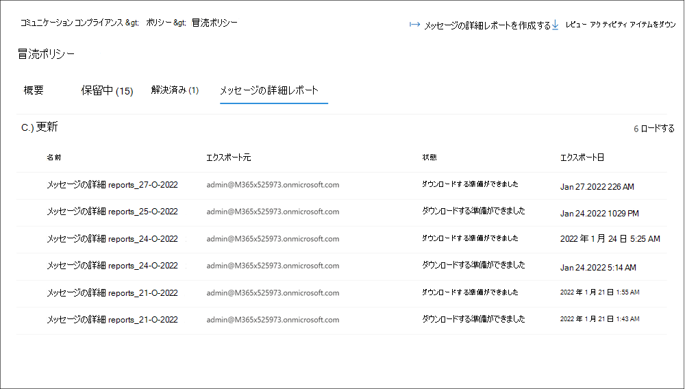

# <a name="use-communication-compliance-reports-and-audits"></a>コミュニケーション コンプライアンス レポートと監査を使用する

## <a name="reports"></a>レポート

新しい **レポート** ダッシュボードは、すべての通信コンプライアンス レポートを表示するための中央の場所です。 レポート ウィジェットは、コミュニケーション コンプライアンス アクティビティの状態の全体的な評価に最も一般的に必要な分析情報のクイック ビューを提供します。 レポート ウィジェットに含まれる情報はエクスポートできません。 詳細なレポートは、特定の通信コンプライアンス領域に関連する詳細な情報を提供し、レビュー中に情報をフィルター処理、グループ化、並べ替え、エクスポートする機能を提供します。 

日付範囲フィルターの場合、イベントの日付と時刻は協定世界時 (UTC) に一覧表示されます。 レポートのメッセージをフィルター処理する場合、要求するユーザーのローカル日付/時刻は、ユーザーのローカル日付/時刻から UTC への変換に基づいて結果を決定します。 たとえば、米国太平洋夏時間 (PDT) のユーザーが 2021 年 8 月 30 日から 2021 年 8 月 31 日の 00:00 にレポートをフィルター処理した場合、レポートには 8/30/2021 07:00 UTC から 8/31/2021 07:00 UTC のメッセージが含まれます。 00:00 にフィルター処理するときに同じユーザーが米国東部夏時間 (EDT) にいた場合、レポートには 8/30/2021 04:00 UTC から 8/31/2021 04:00 UTC のメッセージが含まれます。


**レポート ダッシュボード** には、次のレポート ウィジェットと詳細なレポート リンクが含まれています。

### <a name="report-widgets"></a>レポート ウィジェット

- **最近のポリシーの一致**: アクティブなポリシーによる一致の数を時間の経過と共に表示します。
- **ポリシーによって解決されたアイテム: ポリシー** によって時間の経過と共に解決されたポリシー一致アラートの数を表示します。
- **ポリシーに最も一致するユーザー**: 特定の期間のユーザー (または匿名化されたユーザー名) とポリシー一致の数を表示します。
- **一致が最も多いポリシー**: 特定の期間のポリシーと一致数を表示し、一致する場合は最上位から最低にランク付けされます。
- **ポリシーごとのエスカレーション**: 特定の時間に対するポリシーごとのエスカレーションの数を表示します。

### <a name="detailed-reports"></a>詳細レポート

*エクスポート* オプションを使用して、詳細なレポートのレポートの詳細を含む.csv ファイルを作成します。 [レポート *のエクスポート]* オプションでは、最大 3 MB のファイル サイズのダウンロードがサポートされます。

- **ポリシーの設定と状態**: ポリシーの構成と設定、およびメッセージの各ポリシー (一致とアクション) の一般的な状態について詳しく説明します。 ポリシー情報と、ポリシーがユーザーとグループ、場所、レビューの割合、校閲者、状態、ポリシーが最後に変更された日時に関連付けられる方法が含まれます。 *[エクスポート*] オプションを使用して、レポートの詳細を含む.csv ファイルを作成します。
- **ポリシーごとのアイテムとアクション: ポリシーごとに** 一致するアイテムと修復アクションを確認およびエクスポートします。 ポリシー情報とポリシーの関連付け方法が含まれます。

    - 一致するアイテム
    - エスカレートされたアイテム
    - 解決済みアイテム
    - 準拠としてタグ付け済み
    - 非準拠としてタグ付けされている
    - 疑問としてタグ付け
    - レビュー中のアイテム
    - 通知されたユーザー
    - 作成されたケース

- **場所ごとのアイテムとアクション**: Microsoft 365 の場所ごとに、一致するアイテムと修復アクションを確認してエクスポートします。 ワークロード プラットフォームの関連付け方法に関する情報が含まれています。

    - 一致するアイテム
    - エスカレートされたアイテム
    - 解決済みアイテム
    - 準拠としてタグ付け済み
    - 非準拠としてタグ付けされている
    - 疑問としてタグ付け
    - レビュー中のアイテム
    - 通知されたユーザー
    - 作成されたケース

- **ユーザー別のアクティビティ: ユーザー** ごとに一致するアイテムと修復アクションを確認およびエクスポートします。 ユーザーの関連付け方法に関する情報が含まれています。

    - 一致するアイテム
    - エスカレートされたアイテム
    - 解決済みアイテム
    - 準拠としてタグ付け済み
    - 非準拠としてタグ付けされている
    - 疑問としてタグ付け
    - レビュー中のアイテム
    - 通知されたユーザー
    - 作成されたケース

- **場所ごとの機密情報の種類** (プレビュー): 通信コンプライアンス ポリシーの機密情報の種類と関連するソースの検出に関する情報を確認してエクスポートします。 組織で構成されているソース内の機密情報の種類のインスタンスの全体的な合計と具体的な内訳が含まれます。 各サード パーティのソースの値は、.csv ファイル内の個別の列に表示されます。 例:

    - **電子メール**: Exchange 電子メール メッセージで検出された機密情報の種類。
    - **Teams**: Microsoft Teams チャネルとチャット メッセージで検出された機密情報の種類。
    - **Yammer: Yammer** の受信トレイ、投稿、チャット、返信で検出された機密情報の種類。
    - **サード パーティのソース**: 組織で構成されたサード パーティ製コネクタに関連付けられているアクティビティについて検出された機密情報の種類。 レポート内の特定の機密情報の種類に対するサード パーティのソースの内訳を表示するには、[サード パーティのソース] 列の機密情報の種類の値にマウス ポインターを合わせます。
    - **その他**: 内部システム処理に使用される機密情報の種類。 レポートのこのソースを選択または選択解除しても、値には影響しません。

### <a name="message-details-report"></a>メッセージの詳細レポート

カスタム レポートを作成し、[ポリシー] タブの特定のポリシーに含まれるメッセージの詳細 **を** 確認します。これらのレポートは、メッセージのオールアップ レビューや、カスタマイズ可能な期間のメッセージの状態に関するレポート スナップショットの作成に使用できます。 レポートを作成した後、[ **メッセージの詳細** レポート] タブで詳細レポートを.csv ファイルとして表示およびダウンロードできます。



新しいメッセージの詳細レポートを作成するには、次の手順を実行します。

1. *Communication Compliance Investigators* ロール グループのメンバーであるアカウントを使用して、Microsoft Purview コンプライアンス ポータルにサインインします。
2. [ **ポリシー** ] タブに移動し、ポリシーを選択して、[ **メッセージの詳細レポートの作成**] を選択します。
3. [ **メッセージの詳細レポートの作成** ] ウィンドウで、[レポート名] フィールドにレポートの **名前** を入力します。
4. [ **日付範囲の選択]** で、レポートの *開始日* と *終了日* を選択します。
5. **[作成]** を選択します。
6. レポート作成の確認が表示されます。

レポート内のアイテムの数によっては、レポートをダウンロードする準備が整うまでに数分から数時間かかることがあります。 [メッセージの詳細レポート] タブで進行状況を確認できます。レポートの状態が *[進行中]* または *[ダウンロードの準備完了]* です。 最大 15 個の個別のレポートを同時に処理できます。 レポートをダウンロードするには、[ *ダウンロードの準備完了]* 状態でレポートを選択し、[ **レポートのダウンロード**] を選択します。

> [!NOTE]
> 選択した期間にレポートにメッセージの結果が返されない場合、選択した期間のメッセージは存在しません。 レポートは空白になります。

メッセージの詳細レポートには、ポリシー内のメッセージ アイテムごとに次の情報が含まれています。

- **一致 ID**: ポリシー内のメッセージの一意の ID。
- **送信者**: メッセージの送信者。
- **受信者**: メッセージに含まれる受信者。
- **送信日**: メッセージが送信された日付。
- **一致日**: メッセージがポリシー条件に一致した日付。
- **件名**: メッセージの件名。
- **添付ファイルを含む**: メッセージの添付ファイルの状態。 値は [はい] または [いいえ] です。
- **ポリシー名**: メッセージに関連付けられているポリシーの名前。 この値は、レポート内のすべてのメッセージで同じになります。
- **アイテムの状態**: ポリシー内のメッセージ アイテムの状態。 値は保留中または解決済みです。
- **タグ**: メッセージに割り当てられたタグ。 値は疑問、準拠、または非準拠です。
- **キーワード一致**: メッセージのキーワード一致。
- **レビュー担当者**: メッセージに割り当てられたレビュー担当者。
- **保留中 (日)** : メッセージが保留中の状態になった日数。 解決されたメッセージの場合、値は 0 です。
- **解決済みのコメント: 解決** 時に入力されたメッセージのコメント。
- **解決された日付**: メッセージが解決された日付と時刻。
- **最終更新日者**: 最後のアップデーターのユーザー名。
- **最終更新日時**: メッセージが最後に更新された日時。
- **コメントの履歴: コメント** の作成者やコメントの日付/時刻など、メッセージ アラートのすべてのコメントの一覧。

## <a name="audit"></a>監査

場合によっては、ユーザーアクティビティと通信の監督を証明するために、規制監査人またはコンプライアンス監査人に情報を提供する必要があります。 この情報は、定義された組織のポリシーに関連付けられているすべてのアクティビティの概要、または通信コンプライアンス ポリシーが変更された場合の任意の時間の概要である場合があります。 コミュニケーション コンプライアンス ポリシーには、内部監査または外部監査に完全に対応するための監査証跡が組み込まれています。 作成、編集、削除のすべてのアクションの詳細な監査履歴は、監視手順の証明を提供するために、通信ポリシーによってキャプチャされます。

> [!IMPORTANT]
> 通信コンプライアンス イベントが記録される前に、組織の監査を有効にする必要があります。 監査を有効にするには、「 [監査ログを有効にする」を](communication-compliance-configure.md#step-2-required-enable-the-audit-log)参照してください。 アクティビティが Microsoft 365 監査ログにキャプチャされたイベントをトリガーする場合、これらのイベントが通信コンプライアンス ポリシーで表示されるまでに最大で 48 時間かかる場合があります。

通信コンプライアンス ポリシーの更新アクティビティを表示するには、任意のポリシーのメイン ページで **[ポリシー更新プログラムのエクスポート** ] コントロールを選択します。 更新アクティビティをエクスポートするには、*グローバル 管理* または *コミュニケーション コンプライアンス 管理* ロールが割り当てられている必要があります。 このアクションは、次の情報を含む.csv形式の監査ファイルを生成します。

|**Field**|**詳細**|
|:-----|:-----|
| **CreationDate** | ポリシーで更新アクティビティが実行された日付。 |
| **UserIds** | ポリシーで更新アクティビティを実行したユーザー。 |
| **操作** | ポリシーに対して実行される更新操作。 |
| **AuditData** | このフィールドは、すべてのポリシー更新アクティビティのメイン データ ソースです。 すべての更新アクティビティは記録され、コンマ区切り記号で区切られます。 |

ポリシーの通信コンプライアンス レビュー アクティビティを表示するには、特定のポリシーの **[概要**] ページで [**レビュー アクティビティのエクスポート**] コントロールを選択します。 レビュー アクティビティをエクスポートするには、*グローバル 管理* または *コミュニケーション コンプライアンス 管理* ロールが割り当てられている必要があります。 このアクションは、次の情報を含む.csv形式の監査ファイルを生成します。

|**Field**|**詳細**|
|:-----|:-----|
| **CreationDate** | ポリシーでレビュー アクティビティが実行された日付。 |
| **UserIds** | ポリシーでレビュー アクティビティを実行したユーザー。 |
| **操作** | ポリシーに対して実行されたレビュー操作。 |
| **AuditData** | このフィールドは、すべてのポリシー レビュー アクティビティのメイン データ ソースです。 すべてのレビュー アクティビティは記録され、コンマ区切り記号で区切られます。 |

また、統合監査ログまたは [Search-UnifiedAuditLog](/powershell/module/exchange/search-unifiedauditlog) PowerShell コマンドレットを使用して監査アクティビティを表示することもできます。 監査ログ保持ポリシーの詳細については、「 [監査ログ保持](audit-log-retention-policies.md)ポリシーの管理」を参照してください。

たとえば、次の例では、すべての監督レビュー アクティビティ (ポリシーとルール) のアクティビティを返します。

```PowerShell
Search-UnifiedAuditLog -StartDate $startDate -EndDate $endDate -RecordType AeD -Operations SupervisoryReviewTag
```

次の使用例は、通信コンプライアンス ポリシーの更新アクティビティを返します。

```PowerShell
Search-UnifiedAuditLog -StartDate $startDate -EndDate $endDate -RecordType Discovery -Operations SupervisionPolicyCreated,SupervisionPolicyUpdated,SupervisionPolicyDeleted
```

次の使用例は、現在の通信コンプライアンス ポリシーに一致するアクティビティを返します。

```PowerShell
Search-UnifiedAuditLog -StartDate $startDate -EndDate $endDate -Operations SupervisionRuleMatch
```

通信コンプライアンス ポリシーの一致は、ポリシーごとに監視メールボックスに格納されます。 場合によっては、ポリシーの監視メールボックスのサイズを確認して、現在の 100 GB のストレージ サイズまたは 100 万のメッセージ制限に近づいていることを確認する必要があります。 メールボックスの制限に達した場合、ポリシーの一致はキャプチャされず、同じアクティビティの一致をキャプチャし続けるために新しいポリシー (同じ設定) を作成する必要があります。

ポリシーの監視メールボックスのサイズを確認するには、次の手順を実行します。

1. Exchange Online PowerShell V2 モジュールの [Connect-ExchangeOnline](/powershell/module/exchange/connect-exchangeonline) コマンドレットを使用して、先進認証を使用して powerShell Exchange Onlineに接続します。
2. PowerShell で次のコマンドを実行します。

    ```PowerShell
    ForEach ($p in Get-SupervisoryReviewPolicyV2 | Sort-Object Name)
    {
       "<Name of your communication compliance policy>: " + $p.Name
       Get-MailboxStatistics $p.ReviewMailbox | ft ItemCount,TotalItemSize
    }
    ```
