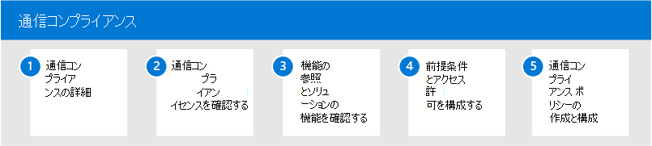

# Microsoft 365 での通信コンプライアンス

機密情報を保護し、職場のハラスメント インシデントを検出して行動することが、内部のポリシーと標準の遵守の重要な部分です。 通信コンプライアンスはMicrosoft 365、電子メールや通信の修復アクションを迅速に検出、キャプチャ、実行することで、これらのリスクを最小限Microsoft Teamsします。 これには、組織の内部および外部で機密情報を共有する不適切な情報、脅威、ハラスメントやコミュニケーションを含む不適切なコミュニケーションが含まれます。

## ユーザーの通信コンプライアンスを構成Microsoft 365

組織の通信コンプライアンスを構成するには、次の手順を使用します。

1. コミュニケーション コンプライアンス[の詳細については](communication-compliance.md)、Microsoft 365
2. 通信コンプライアンス [を計画し](communication-compliance-plan.md) 、 [ライセンスを確認する](communication-compliance-configure.md#subscriptions-and-licensing)
3. 前提条件 [とアクセス](communication-compliance-configure.md#step-2-required-enable-the-audit-log) 許可 [を構成する](communication-compliance-configure.md#step-1-required-enable-permissions-for-communication-compliance)
4. 通信コンプライアンス ポリシー [の作成と構成](communication-compliance-configure.md#step-5-required-create-a-communication-compliance-policy)

## 通信コンプライアンスの詳細

- [アラートの調査と修復](communication-compliance-investigate-remediate.md)
- [ケース スタディ - Contoso は、コミュニケーションの管理、管理、およびMicrosoft Teams、Exchangeに不適切Yammer構成します。](communication-compliance-case-study.md)