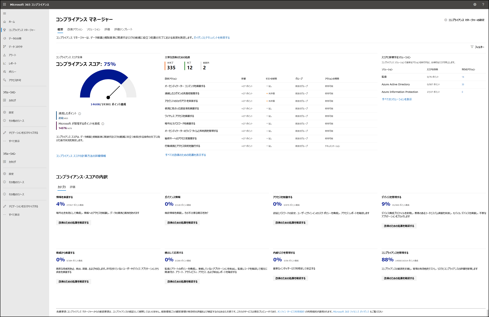

# Microsoft コンプライアンス マネージャー

**この記事では、次の情報を参照してください。** コンプライアンス マネージャーとは何か、コンプライアンスの簡素化とリスクの軽減に役立つ方法、および重要なコンポーネントについて説明します。

## コンプライアンス マネージャーとは?

[Microsoft コンプライアンス マネージャー](https://compliance.microsoft.com/compliancemanager) は [、Microsoft 365](microsoft-365-compliance-center.md) コンプライアンス センターの機能であり、組織のコンプライアンス要件を簡単で便利に管理するのに役立ちます。 コンプライアンス マネージャーは、データ保護リスクのインベントリの取得から、制御の実装の複雑さの管理、規制と認定の最新の状態を確保すること、監査人への報告まで、コンプライアンスの取り組み全体を通じてお手伝いします。

コンプライアンス マネージャーが組織がコンプライアンスを管理する方法を簡略化する方法については、以下のビデオをご覧ください。
 
 
>[!VIDEO https://www.microsoft.com/videoplayer/embed/RE4FGYZ]

コンプライアンス マネージャーは、次の機能を提供することで、コンプライアンスの簡素化とリスクの軽減に役立ちます。

- 一般的な業界および地域の標準および規制に対する事前構築された評価、または独自のコンプライアンスニーズを満たすカスタム評価 (利用可能な評価は、ライセンス契約によって異なる。 [詳細については、「詳細」を参照してください](/office365/servicedescriptions/microsoft-365-service-descriptions/microsoft-365-tenantlevel-services-licensing-guidance/microsoft-365-security-compliance-licensing-guidance))。

- 1 つのツールを使用してリスク評価を効率的に完了するのに役立つワークフロー機能。

- 組織に最も関連性の高い標準と規制を遵守するための推奨される改善措置に関する詳細なステップ バイ ステップ ガイダンス。 Microsoft によって管理されるアクションについては、実装の詳細と監査結果が表示されます。

- 改善アクションの進捗を測定することで、コンプライアンスの姿勢を理解するのに役立つリスクベースのコンプライアンス スコア。

コンプライアンス マネージャー ダッシュボードには、現在のコンプライアンス スコアが表示され、注意が必要な情報が表示され、重要な改善アクションが示されます。 コンプライアンス マネージャー ダッシュボードの外観の例を次に示します。

## コンプライアンス スコアについて

コンプライアンス マネージャーは、規制、標準、またはポリシーに準拠するために実行される改善アクションを完了するためのポイントを与え、それらのポイントを全体的なコンプライアンス スコアに結合します。 各アクションは、関連する潜在的なリスクに応じてスコアに異なる影響を与えます。 コンプライアンス スコアは、コンプライアンスの全体的な姿勢を向上させるために、どのアクションに重点を置くのかの優先順位を付けるのに役立ちます。

コンプライアンス マネージャーは、Microsoft 365 データ保護ベースラインに基づいて、初期スコアを提供します。 このベースラインは、データ保護と一般的なデータ ガバナンスに関する主要な規制と基準を含む一連のコントロールです。

##### 詳細情報

[コンプライアンス スコアの計算方法を理解します](compliance-score-calculation.md)。

[改善アクションを操作する方法について学習します](compliance-manager-improvement-actions.md)。

## 重要な要素: コントロール、評価、テンプレート、改善アクション

コンプライアンス マネージャーは、コンプライアンス アクティビティの管理に役立つ複数のデータ要素を使用します。 コンプライアンス マネージャーを使用してコンプライアンス アクティビティを割り当て、テストし、監視する場合は、コントロール、評価、テンプレート、および改善アクションという重要な要素について基本的な理解を深めるのに役立ちます。

### コントロール

コントロールは、規制、標準、またはポリシーの要件のことです。 コントロールは、システム構成、組織のプロセス、および規制、標準、ポリシーの特定の要件への準拠に関する責任者を評価し、管理する方法を定義します。

コンプライアンス マネージャーは、次の種類のコントロールを追跡します。

1. **Microsoft マネージ コントロール**: Microsoft クラウド サービスのコントロール(Microsoft が実装を担当する)
2. **コントロール**: 顧客管理コントロールと呼ばれる場合があります。これらは組織によって実装および管理されるコントロールです。
3. **共有コントロール**: これらは、組織と Microsoft の両方が実装の責任を共有するコントロールです。

##### 詳細情報

[コントロールの進行状況を監視します](compliance-manager-assessments.md#monitor-assessment-progress-and-controls)。

[コンプライアンス マネージャーがコントロールを継続的に評価する方法について学習します](compliance-score-calculation.md#how-compliance-manager-continuously-assesses-controls)。

### 評価

評価とは、特定の規制、標準、またはポリシーからのコントロールのグループ化です。 評価は、標準、規則、または法律の要件を満たすのに役立つ評価内で処置を完了します。 たとえば、その中のすべてのアクションを完了すると、MICROSOFT 365 の設定を ISO 27001 の要件に合ったものにするのに役立つという評価を受ける場合があります。

評価には、次のいくつかのコンポーネントがあります。

- **範囲内のサービス**: 評価に適用される Microsoft サービスの特定のセット
- **Microsoft マネージ コントロール**: Microsoft クラウド サービスのコントロール。Microsoft がユーザーに代わって実装する
- **コントロール**: 顧客管理コントロールと呼ばれる場合があります。これらは組織によって実装および管理されるコントロールです。
- **共有コントロール**: これらは、組織と Microsoft の両方が実装の責任を共有するコントロールです。
- **評価スコア**: 組織と Microsoft が管理する評価内のアクションから、可能な合計ポイントを達成するための進捗状況を示します。

評価を作成する場合は、それらをグループに割り当てる必要があります。 組織にとって最も論理的な方法でグループを構成できます。 たとえば、監査年、地域、ソリューション、組織内のチーム、その他の方法で評価をグループ化できます。 グループを作成したら、コンプライアンス マネージャー [ダッシュボード](compliance-manager-setup.md#filtering-your-dashboard-view) をフィルター処理して、1 つ以上のグループでスコアを表示できます。

##### 詳細情報

[コンプライアンス マネージャーで評価を構築および管理します](compliance-manager-assessments.md)。

### テンプレート

コンプライアンス マネージャーには、評価をすばやく作成するためのテンプレートが提供されています。 これらのテンプレートを変更して、ニーズに合った評価を作成できます。 独自のコントロールとアクションを使用してテンプレートを作成することで、カスタム評価を作成することもできます。 たとえば、テンプレートが内部のビジネス プロセスコントロール、または 325 以上の事前に構築された評価テンプレートの 1 つでカバーされていない地域のデータ保護標準をカバーする場合があります。

##### 詳細情報

[コンプライアンス マネージャーによって提供される評価テンプレートの一覧を表示します](compliance-manager-templates-list.md)。

[評価用のテンプレートを作成および変更するための詳細な手順を取得します](compliance-manager-templates.md)。

### 改善のための処置

改善アクションは、コンプライアンス活動を一元化するのに役立ちます。 各改善アクションは、データ保護の規制と標準に合わせて役立つ推奨ガイダンスを提供します。 改善のための処置は、実装やテスト作業を行う組織内のユーザーに割り当てることができます。 また、改善のための処置の中にドキュメント、メモ、記録状態の更新を保存することができます。

##### 詳細情報

[コンプライアンス ワークフローを管理するには、改善アクションを使用します](compliance-manager-improvement-actions.md)。

[アクションがコンプライアンス スコアに与える影響について学習します](compliance-score-calculation.md#action-types-and-points)。

## サポートされている言語

コンプライアンス マネージャーは、次の言語で使用できます。

- 英語
- Bahasa インドネシア語
- バハサ マレー語
- 簡体字中国語
- 繁体字中国語
- チェコ語
- デンマーク語
- オランダ語
- フィンランド語
- フランス語
- ドイツ語
- ヘブライ語
- ハンガリー語
- イタリア語
- 日本語
- 韓国語
- ノルウェー語
- ポーランド語
- ポルトガル語 (ブラジル)
- ロシア語
- スペイン語
- スウェーデン語
- タイ語
- トルコ語

## 次の手順: セットアップとカスタマイズ

「コンプライアンス マネージャーの使用を開始する」で、サインイン、アクセス許可と役割の割り当て、設定の構成、ダッシュボード ビューのカスタマイズを行う [方法について学習します](compliance-manager-setup.md)。

次に、コンプライアンス マネージャーのカスタマイズを開始し、評価を設定することで、組織にとって最も重要な業界標準に [準拠できます](compliance-manager-assessments.md)。

データ プライバシー規制の遵守を支援するために、コンプライアンス マネージャーの使用を含め、Microsoft 365 全体で機能を計画および実装するためのエンド Microsoft 365 プロセスをガイドするワークフローを設計しました。 詳細については、「[Microsoft 365を使用したデータプライバシー規制の情報保護の展開 (aka.ms/m365dataprivacy)](../solutions/information-protection-deploy.md)」を参照してください。 
