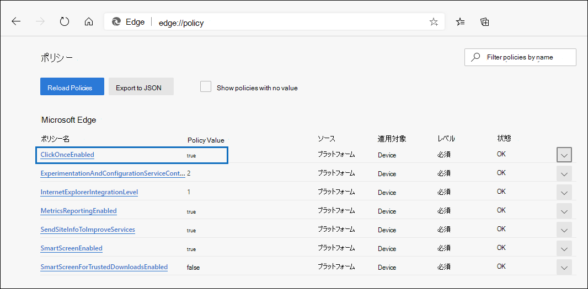

# [電子情報開示のエクスポート ツール] を使用Microsoft Edge

最新バージョンのバージョンに対する最近の変更の結果Microsoft Edge、ClickOnceサポートは既定で有効になっていません。 引き続き電子情報開示エクスポート ツールを使用してコンテンツ検索または電子情報開示検索結果をダウンロードするには[、Microsoft Internet Explorer](https://support.microsoft.com/help/17621/internet-explorer-downloads)を使用するか、最新バージョンの Microsoft Edge で ClickOnce サポートを有効にする必要があります。

## [ClickOnceでサポートを有効Microsoft Edge

1. [Microsoft Edge] に移動し、[edge://flags/#edge-click-once]**に移動します**。

2. ドロップダウン リストで既存の値が [ **既定** ] または [ **無効** ] に設定されている場合は、[有効] に **変更します**。

   ![ドロップダウン リストから [有効] を選択します。](../media/ClickOnceimage1.png)

3. ブラウザー ウィンドウの下部まで下にスクロールし、[再起動] を **クリックしてエッジ** を再起動します。

   ![[再起動] をクリックします。](../media/ClickOnceimage2.png)

**注:** 組織では、グループ ポリシーを使用して、サポートClickOnce無効にできます。 サポートに関する組織ポリシーがClickOnce、次の **edge://policy。** 次のスクリーンショットは、組織ClickOnceで有効になっているデータを示しています。 このポリシー値が false に **設定されている** 場合は、組織内の管理者に連絡する必要があります。

## 電子情報開示エクスポート ツールのインストールと実行

1. コンテンツ **検索または電子** 情報開示ケースのエクスポートのフライアウト ページで、[結果のダウンロード] をクリックします。

   ![[フライアウト] ページの [結果のダウンロード] をクリックして検索結果をダウンロードする](../media/ClickOnceExport1.png)

2. ツールを起動する確認メッセージが表示されます。[開く] を **クリックします**。

   ![[開く] をクリックして電子情報開示エクスポート ツールを起動する](../media/ClickOnceimage4.png)

   電子情報開示エクスポート ツールがインストールされていない場合は、セキュリティ警告が表示されます。 

   ![[インストール] をクリックして電子情報開示エクスポート ツールをインストールする](../media/ClickOnceimage5.png)

3. **[インストール]** をクリックします。 インストール後、エクスポート ツールが自動的に起動します。

詳細については、次のトピックをご覧ください。

- [コンテンツ検索の結果をエクスポートする](export-search-results.md)

- [テスト フラグを有効にするMicrosoft Edge](https://microsoftedgesupport.microsoft.com/hc/articles/360034075294-How-to-enable-experiment-flags-in-Microsoft-Edge-Insider-channels)
