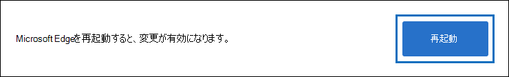

# Microsoft Edge で電子情報開示エクスポートツールを使用する

最新バージョンの Microsoft Edge に対する最近の変更の結果として、ClickOnce サポートは既定で有効になりません。 コンテンツ検索や電子情報開示の検索結果をダウンロードするために電子情報開示のエクスポートツールを引き続き使用するには、microsoft [Internet Explorer](https://support.microsoft.com/help/17621/internet-explorer-downloads)を使用するか、microsoft Edge の最新バージョンで ClickOnce サポートを有効にする必要があります。

## Microsoft Edge で ClickOnce サポートを有効にする

1. Microsoft Edge で、 **[edge://flags/#edge]** に移動します。

2. ドロップダウンリストで既存の値が**Default**または**Disabled**に設定されている場合は、[**有効**] に変更します。

   

3. ブラウザーウィンドウの一番下までスクロールし、[**再起動**] をクリックして、エッジを再起動します。

   

**注:** 組織は、グループポリシーを使用して ClickOnce サポートを無効にすることができます。 ClickOnce サポート用の組織ポリシーがあるかどうかを確認するには、 **edge://policy**に移動します。 次のスクリーンショットは、組織全体で ClickOnce が有効になっていることを示しています。 このポリシー値が**false**に設定されている場合は、組織の管理者に連絡する必要があります。

## 電子情報開示エクスポートツールをインストールして実行する

1. コンテンツ検索または電子情報開示ケースのエクスポートのポップアップページにある [**結果のダウンロード**] をクリックします。

   ![検索結果をダウンロードするには、ポップアップページの [結果のダウンロード] をクリックします。](../media/ClickOnceExport1.png)

2. ツールを起動するかどうかを確認するメッセージが表示されたら、[**開く**] をクリックします。

   ![[開く] をクリックして電子情報開示エクスポートツールを起動します。](../media/ClickOnceimage4.png)

   電子情報開示エクスポートツールがインストールされていない場合は、セキュリティの警告が表示されます。 

   ![[インストール] をクリックして電子情報開示エクスポートツールをインストールします。](../media/ClickOnceimage5.png)

3. **[インストール]** をクリックします。 インストール後、エクスポートツールが自動的に起動します。

詳細については、次のトピックをご覧ください。

- [コンテンツ検索の結果をエクスポートする](export-search-results.md)

- [Microsoft Edge で実験フラグを有効にする方法](https://microsoftedgesupport.microsoft.com/hc/articles/360034075294-How-to-enable-experiment-flags-in-Microsoft-Edge-Insider-channels)
