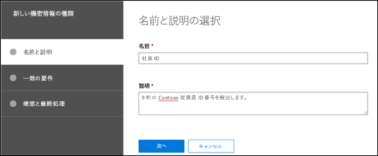

<!-- rename md file to match the display name -->
# セキュリティ/コンプライアンス センターでカスタムの機密情報の種類を作成するCreate a custom sensitive information type in the Security & Compliance Center

## 概要Summary

セキュリティ/コンプライアンス センターで[カスタムの機密情報の種類](custom-sensitive-info-types.md)を作成するために、この記事をお読みください(「[https://protection.office.com](https://protection.office.com)」)。Read this article to create a [custom sensitive information type](custom-sensitive-info-types.md) in the Security & Compliance Center ([https://protection.office.com](https://protection.office.com)). この方法を使用して作成されるカスタムの機密情報の種類は、`Microsoft.SCCManaged.CustomRulePack`という名前のルール パッケージに追加されます。The custom sensitive information types that you create by using this method are added to the rule package named `Microsoft.SCCManaged.CustomRulePack`.

PowerShell および Exact Data Match の機能を使用して、カスタムの機密情報の種類を作成することもできます。You can also create custom sensitive information types by using PowerShell and Exact Data Match capabilities. これらの方法の詳細については、次を参照してください。To learn more about those methods, see:
- [セキュリティ/コンプライアンス センター PowerShell でカスタムの機密情報の種類を作成するCreate a custom sensitive information type in Security & Compliance Center PowerShell](create-a-custom-sensitive-information-type-in-scc-powershell.md)
- [Exact Data Match (EMD) を使用して、DPL 向けのカスタムの機密情報の種類を作成するCreate a custom sensitive information type for DLP with Exact Data Match (EDM)](create-custom-sensitive-information-types-with-exact-data-match-based-classification.md)

## 開始する前にBefore you begin...

> [!NOTE]
> UI を使用してカスタムの機密情報の種類を作成、テスト、展開するには、グローバル管理者またはコンプライアンス管理者のアクセス許可が必要です。You should have Global admin or Compliance admin permissions to create, test, and deploy a custom sensitive information type through the UI. Office 365 で「[管理者ロールについて](https://docs.microsoft.com/office365/admin/add-users/about-admin-roles?view=o365-worldwide)」を参照してください。See [About admin roles](https://docs.microsoft.com/office365/admin/add-users/about-admin-roles?view=o365-worldwide) in Office 365.

- 組織には、データ損失防止 (DLP) を含む Office 365 Enterprise などのサブスクリプションが必要です。Your organization must have a subscription, such as Office 365 Enterprise, that includes Data Loss Prevention (DLP). [メッセージング ポリシーとコンプライアンス サービスの説明](https://docs.microsoft.com/office365/servicedescriptions/exchange-online-protection-service-description/messaging-policy-and-compliance-servicedesc)を参照してください。See [Messaging Policy and Compliance ServiceDescription](https://docs.microsoft.com/office365/servicedescriptions/exchange-online-protection-service-description/messaging-policy-and-compliance-servicedesc). 

- カスタムの機密情報の種類では、正規表現 (RegEx) に精通している必要があります。テキストの処理に使用される Boost.RegEx (旧称 RegEx++) エンジンの詳細については、「[Boost.Regex 5.1.3](https://www.boost.org/doc/libs/1_68_0/libs/regex/doc/html/)」を参照してください。Custom sensitive information types require familiarity with regular expressions (RegEx). For more information about the Boost.RegEx (formerly known as RegEx++) engine that's used for processing the text, see [Boost.Regex 5.1.3](https://www.boost.org/doc/libs/1_68_0/libs/regex/doc/html/).

  Microsoft カスタマー サービス/サポートでは、カスタム分類または正規表現パターンの作成をサポートしていません。Microsoft Customer Service & Support can't assist with creating custom classifications or regular expression patterns. サポート エンジニアは、たとえば、テスト目的のサンプルの正規表現パターンを提供したり、期待通りにトリガーされない既存の正規表現パターンのトラブルシューティングをサポートしたりなど、機能に対する限定的なサポートを提供しますが、カスタムのコンテンツ一致の開発でユーザーの要件を満たしたり、義務を果たしたりすることを確約するわけではありません。Support engineers can provide limited support for the feature, such as, providing sample regular expression patterns for testing purposes, or assisting with troubleshooting an existing regular expression pattern that's not triggering as expected, but can't provide assurances that any custom content-matching development will fulfill your requirements or obligations.

- DLP では、検索クローラーを使用して、SharePoint Online および OneDrive for Business のサイトの機密情報を特定して分類します。DLP uses the search crawler to identify and classify sensitive information in SharePoint Online and OneDrive for Business sites. 既存のコンテンツで新しいカスタムの機密情報の種類を特定するには、そのコンテンツを再クロールする必要があります。To identify your new custom sensitive information type in existing content, the content must be re-crawled. コンテンツは、スケジュールに基づいてクロールされますが、サイト コレクション、リスト、またはライブラリのコンテンツを手動で再クロールすることができます。Content is crawled based on a schedule, but you can manually re-crawl content for a site collection, list, or library. 詳細については、「[サイト、ライブラリ、またはリストのクロールおよび再インデックスの手動要求](https://docs.microsoft.com/sharepoint/crawl-site-content)」を参照してください。For more information, see [Manually request crawling and re-indexing of a site, a library or a list](https://docs.microsoft.com/sharepoint/crawl-site-content).

## セキュリティ/コンプライアンス センターでカスタムの機密情報の種類を作成するCreate custom sensitive information types in the Security & Compliance Center

セキュリティ/コンプライアンス センターで、**[分類]** \> **[機密情報の種類]** に移動して **[作成]** をクリックします。In the Security & Compliance Center, go to **Classifications** \> **Sensitive info types** and click **Create**.

各設定については説明するまでもありませんが、ウィザードの関連ページには説明が記載されています。The settings are fairly self-evident, and are explained on the associate page of the wizard:

- **[名前]****Name**

- **[説明]****Description**

- **[近接性]****Proximity**

- **[信頼度]****Confidence level**

- **[プライマリ パターン要素]** (キーワード、正規表現、またはディクショナリ)**Primary pattern element** (keywords, regular expression, or dictionary)

- オプションの **[補強パターン要素]** (キーワード、正規表現、またはディクショナリ) および対応する **[最小コスト]** 値。Optional **Supporting pattern elements** (keywords, regular expression, or dictionary) and a corresponding **Minimum cost** value.

この例のシナリオ: キーワードの「従業員」、「ID」および「社員証」と共に、コンテンツに含まれる 9 桁の従業員番号を検出するために、カスタムの機密情報の種類が必要になりました。このカスタムの機密情報の種類を作成するには、次の手順を実行します。Here's a scenario: You want a custom sensitive information type that detects 9-digit employee numbers in content, along with the keywords "employee" "ID" and "badge". To create this custom sensitive information type, do the following steps:

1. セキュリティ/コンプライアンス センターで、**[分類]** \> **[機密情報の種類]** に移動して **[作成]** をクリックします。In the Security & Compliance Center, go to **Classifications** \> **Sensitive info types** and click **Create**.

    ![機密情報の種類と [作成] ボタンの場所](media/scc-cust-sens-info-type-new.png)

2. **[名前と説明の選択]** ページが開いたら、次の値を入力します。In the **Choose a name and description** page that opens, enter the following values:

  - **[名前]**: 従業員 ID。**Name**: Employee ID.

  - **[説明]**: 9 桁の Contoso 従業員 ID 番号を検出します。**Description**: Detect nine-digit Contoso employee ID numbers.

    

    完了したら、**[次へ]** をクリックします。When you're finished, click **Next**.

3. **[一致の要件]** ページが開いたら、**[要素の追加]** をクリックして、次の設定を構成します。In the **Requirements for matching** page that opens, click **Add an element** configure the following settings:

    - **次を含むコンテンツを検出する**:**Detect content containing**:
 
      a. **[これらのいずれか]** をクリックして、**[正規表現]** を選択します。a. Click **Any of these** and select **Regular expression**.

      b. 正規表現ボックスに、`(\s)(\d{9})(\s)` (空白文字で囲まれた 9 桁の数字) を入力します。b. In the regular expression box, enter `(\s)(\d{9})(\s)` (nine-digit numbers surrounded by white space).
  
    - **[補強要素]**: **[補強要素の追加]** をクリックして、**[このキーワード リストを含める]** を選択します。**Supporting elements**: Click **Add supporting elements** and select **Contains this keyword list**.

    - **[このキーワード リストを含める]** 領域が表示されたら、次の設定を構成します。In the **Contains this keyword list** area that appears, configure the following settings:

      - **[キーワード リスト]**: 次の値を入力します: 従業員、ID、社員証。**Keyword list**: Enter the following value: employee,ID,badge.

      - **[最低数]**: 既定値 1 のままにします。**Minimum count**: Leave the default value 1.

    - 既定の **[信頼度]** 値 60 のままにします。Leave the default **Confidence level** value 60. 

    - 既定の **[文字の近接]** 値 300 のままにします。Leave the default **Character proximity** value 300.

    ![[一致の要件] ページ](media/scc-cust-sens-info-type-new-reqs.png)

    完了したら、**[次へ]** をクリックします。When you're finished, click **Next**.

4. **[確認と最終処理]** ページが開いたら、設定を確認して **[完了]** をクリックします。On the **Review and finalize** page that opens, review the settings and click **Finish**.

    ![[確認と最終処理] ページ](media/scc-cust-sens-info-type-new-review.png)

5. 次のページでは、[**はい**] をクリックして新しいカスタムの機密情報の種類をテストするように促されます。詳細については、「[セキュリティ/コンプライアンス センターでカスタムの機密情報の種類をテストする](#test-custom-sensitive-information-types-in-the-security--compliance-center)」を参照してください。ルールのテストを後で行うには、[**いいえ**] をクリックします。The next page encourages you to test the new custom sensitive information type by clicking **Yes**. For more information, see [Test custom sensitive information types in the Security & Compliance Center](#test-custom-sensitive-information-types-in-the-security--compliance-center). To test the rule later, click **No**.

    

### 正常な動作を確認する方法How do you know this worked?

新しい機密情報の種類が正常に作成されたことを確認するには、次に示す手順のいずれかを実行します。To verify that you've successfully created a new sensitive information type, do any of the following steps:

  - **[分類]** \> **[機密情報の種類]** に移動して、新しいカスタムの機密情報の種類が一覧に表示されていることを確認します。Go to **Classifications** \> **Sensitive info types** and verify the new custom sensitive information type is listed.

  - 新しいカスタムの機密情報の種類をテストします。詳細については、「[セキュリティ/コンプライアンス センターでカスタムの機密情報の種類をテストする](#test-custom-sensitive-information-types-in-the-security--compliance-center)」を参照してください。Test the new custom sensitive information type. For more information, see [Test custom sensitive information types in the Security & Compliance Center](#test-custom-sensitive-information-types-in-the-security--compliance-center).

## セキュリティ/コンプライアンス センターでカスタムの機密情報の種類を変更するModify custom sensitive information types in the Security & Compliance Center

**注**:**Notes**:
<!-- check to see if this note contradicts the guidance in "customize a built in sensitive information type customize-a-built-in-sensitive-information-type it sure seems like it does-->
- カスタムの機密情報の種類のみを変更できます。組み込みの機密情報の種類は変更できません。ただし、PowerShell を使用して組み込みの機密情報の種類をエクスポートし、エクスポートしたものをカスタムの機密情報の種類としてインポートすることができます。詳細については、「[組み込みの機密情報の種類をカスタマイズする](customize-a-built-in-sensitive-information-type.md)」を参照してください。You can only modify custom sensitive information types; you can't modify built-in sensitive information types. But you can use PowerShell to export built-in custom sensitive information types, customize them, and import them as custom sensitive information types. For more information, see [Customize a built-in sensitive information type](customize-a-built-in-sensitive-information-type.md).

- 変更できるのは、UI で作成したカスタムの機密情報の種類のみです。カスタムの機密情報の種類のルール パッケージをインポートするのに [PowerShell プロシージャ](create-a-custom-sensitive-information-type-in-scc-powershell.md)を使用した場合、エラーが表示されます。You can only modify custom sensitive information types that you created in the UI. If you used the [PowerShell procedure](create-a-custom-sensitive-information-type-in-scc-powershell.md) to import a custom sensitive information type rule package, you'll get an error.

セキュリティ/コンプライアンス センターで、**[分類]** \> **[機密情報の種類]** に移動して、変更するカスタムの機密情報の種類を選択し、[**編集**] をクリックします。In the Security & Compliance Center, go to **Classifications** \> **Sensitive info types**, select the custom sensitive information type that you want to modify, and then click **Edit**.

  ![機密情報の種類と [編集] ボタンの場所](media/scc-cust-sens-info-type-edit.png)

ここでは、セキュリティ/コンプライアンス センターでカスタムの機密情報の種類を作成したときと同じオプションを選択できます。詳細については、「[セキュリティ/コンプライアンス センターでカスタムの機密情報の種類を作成する](#create-custom-sensitive-information-types-in-the-security--compliance-center)」を参照してください。The same options are available here as when you created the custom sensitive information type in the Security & Compliance Center. For more information, see [Create custom sensitive information types in the Security & Compliance Center](#create-custom-sensitive-information-types-in-the-security--compliance-center).

### 正常な動作を確認する方法How do you know this worked?

機密情報の種類が正常に変更されたことを確認するには、次に示す手順のいずれかを実行します。To verify that you've successfully modified a sensitive information type, do any of the following steps:

  - **[分類]** \> **[機密情報の種類]** に移動して、変更したカスタムの機密情報の種類のプロパティを確認します。Go to **Classifications** \> **Sensitive info types** to verify the properties of the modified custom sensitive information type. 

  - 変更したカスタムの機密情報の種類をテストします。詳細については、「[セキュリティ/コンプライアンス センターでカスタムの機密情報の種類をテストする](#test-custom-sensitive-information-types-in-the-security--compliance-center)」を参照してください。Test the modified custom sensitive information type. For more information, see [Test custom sensitive information types in the Security & Compliance Center](#test-custom-sensitive-information-types-in-the-security--compliance-center).

## セキュリティ/コンプライアンス センターでカスタムの機密情報の種類を削除するRemove custom sensitive information types in the Security & Compliance Center 

**注**:**Notes**:

- カスタムの機密情報の種類のみを削除できます。組み込みの機密情報の種類は削除できません。You can only remove custom sensitive information types; you can't remove built-in sensitive information types.

- カスタムの機密情報の種類を削除する前に、その機密情報の種類を参照している DLP ポリシーまたは Exchange メール フロー ルール (別名: トランスポート ルール) がないことを確認してください。Before your remove a custom sensitive information type, verify that no DLP policies or Exchange mail flow rules (also known as transport rules) still reference the sensitive information type.

1. セキュリティ/コンプライアンス センターで、**[分類]** \> **[機密情報の種類]** に移動して、削除するカスタムの機密情報の種類を 1 つ以上選択します。In the Security & Compliance Center, go to **Classifications** \> **Sensitive info types** and select one or more custom sensitive information types that you want to remove.

2. ポップアップが開いたら、**[削除]** (複数選択した場合は **[機密情報の種類の削除]**) をクリックします。In the fly-out that opens, click **Delete** (or **Delete sensitive info types** if you selected more than one).

    ![機密情報の種類と [削除] ボタンの場所](media/scc-cust-sens-info-type-delete.png)

3. 警告メッセージが表示されたら、**[はい]** をクリックします。In the warning message that appears, click **Yes**.

### 正常な動作を確認する方法How do you know this worked?

カスタムの機密情報の種類が正常に削除されたことを確認するには、**[分類]** \> **[機密情報の種類]** に移動して、そのカスタムの機密情報の種類が一覧に表示されていないことを確認します。To verify that you've successfully removed a custom sensitive information type, go to **Classifications** \> **Sensitive info types** to verify the custom sensitive information type is no longer listed.

## セキュリティ/コンプライアンス センターでカスタムの機密情報の種類をテストするTest custom sensitive information types in the Security & Compliance Center

1. セキュリティ/コンプライアンス センターで、**[分類]** \> **[機密情報の種類]** に移動します。In the Security & Compliance Center, go to **Classifications** \> **Sensitive info types**.

2. テストするカスタムの機密情報の種類を 1 つ以上選択します。ポップアップが開いたら、**[種類のテスト]** (複数選択した場合は **[機密情報の種類のテスト]**) をクリックします。Select one or more custom sensitive information types to test. In the fly-out that opens, click **Test type** (or **Test sensitive info types** if you selected more than one).

    ![機密情報の種類と [種類のテスト] ボタンの場所](media/scc-cust-sens-info-type-test.png)

3. [**テストの対象ファイルのアップロード**] ページが開いたら、ファイルをドラッグ アンド ドロップするか、または [**参照**] をクリックしてファイルを選択し、テストの対象ドキュメントをアップロードします。On the **Upload file to test** page that opens, upload a document to test by dragging and dropping a file or by clicking **Browse** and selecting a file.

    ![[テストの対象ファイルのアップロード] ページ](media/scc-cust-sens-info-type-test-upload.png)

4. **[テスト]** ボタンをクリックして、ファイル内のパターン マッチについてドキュメントをテストします。Click the **Test** button to test the document for pattern matches in the file.

5. [**照合結果**] ページで、[**完了**] をクリックします。On the **Match results** page, click **Finish**.

    
