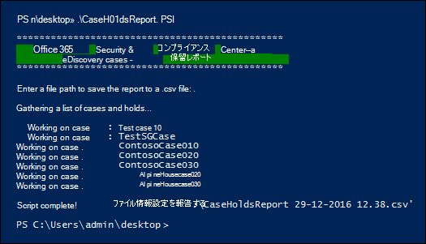

# <a name="use-a-script-to-create-a-report-on-holds-in-ediscovery-cases"></a>電子情報開示ケースで保留に関するレポートを作成するスクリプトを使用する

この記事のスクリプトを使用すると、電子情報開示管理者と電子情報開示マネージャーは、Microsoft Purview コンプライアンス ポータルの電子情報開示 (Standard) ケースと電子情報開示 (Premium) ケースに関連付けられているすべての保留に関する情報を含むレポートを生成できます。 レポートには、保留が関連付けられているケースの名前、保留に配置されるコンテンツの場所、ホールドがクエリ ベースかどうかなどの情報が含まれています。 保留がない場合は、保留のないケースの一覧を含む追加のレポートがスクリプトによって作成されます。

レポートに含まれる情報の詳細については、「 [詳細情報](#more-information) 」セクションを参照してください。

## <a name="admin-requirements-and-script-information"></a>管理要件とスクリプト情報

- 組織内のすべての電子情報開示ケースに関するレポートを生成するには、組織内の電子情報開示管理者である必要があります。 電子情報開示マネージャーの場合、レポートには、アクセスできるケースに関する情報のみが含まれます。 電子情報開示のアクセス許可の詳細については、「電子情報開示アクセス [許可の割り当て](assign-ediscovery-permissions.md)」を参照してください。

- この記事のスクリプトでは、エラー処理が最小限に抑えられています。 主な目的は、組織内の電子情報開示ケースに関連付けられている保留に関するレポートをすばやく作成することです。

- このトピックで提供されているサンプル スクリプトは、いかなる Microsoft 標準サポート プログラムまたはサービスでもサポートされていません。サンプル スクリプトは、いかなる保証もありません。これらのサンプルに対しては、Microsoft 社は商品またはその他の何らかの目的を持つものに付随すると考えられている暗黙の責任も一切認めません。これらのサンプルは、完全にユーザーの責任において使用してください。いかなる場合でも、Microsoft 社および販売店は、これらのサンプルを使用した結果発生した損害およびこれらのサンプルを使用できなかったことによる損害に対して、商業的損失、業務の中断、企業情報の喪失、およびその他の金銭的損失等を含め、何ら制限も設けることなく一切の責任を認めません。これは、たとえ Microsoft 社がそのような損害の可能性について通知を受けていた場合でも同じです。

## <a name="step-1-connect-to-security--compliance-powershell"></a>手順 1: セキュリティ/コンプライアンス PowerShell に接続する

最初の手順は、組織のセキュリティ/コンプライアンス PowerShell に接続することです。 詳細な手順については、「[セキュリティ/コンプライアンス PowerShell への接続](/powershell/exchange/connect-to-scc-powershell)」を参照してください。

## <a name="step-2-run-the-script-to-report-on-holds-associated-with-ediscovery-cases"></a>手順 2: 電子情報開示ケースに関連付けられている保留をレポートするスクリプトを実行する

Security & Compliance PowerShell に接続したら、次の手順では、組織内の電子情報開示ケースに関する情報を収集するスクリプトを作成して実行します。

1. .ps1 のファイル名サフィックスを使用して、次のテキストをWindows PowerShell スクリプト ファイルに保存します。たとえば、CaseHoldsReport.ps1。

   ```powershell
   #script begin
   " "
   write-host "***********************************************"
   write-host "   Security & Compliance Center   " -foregroundColor yellow -backgroundcolor darkgreen
   write-host "        eDiscovery cases - Holds report         " -foregroundColor yellow -backgroundcolor darkgreen
   write-host "***********************************************"
   " "
   #prompt users to specify a path to store the output files
   $time=get-date
   $Path = Read-Host 'Enter a folder path to save the report to a .csv file (filename is created automatically)'
   $outputpath=$Path+'\'+'CaseHoldsReport'+' '+$time.day+'-'+$time.month+'-'+$time.year+' '+$time.hour+'.'+$time.minute+'.csv'
   $noholdsfilepath=$Path+'\'+'CaseswithNoHolds'+' '+$time.day+'-'+$time.month+'-'+$time.year+' '+$time.hour+'.'+$time.minute+'.csv'
   #add case details to the csv file
   function add-tocasereport{
   Param([string]$casename,
   [String]$casetype,
   [String]$casestatus,
   [datetime]$casecreatedtime,
   [string]$casemembers,
   [datetime]$caseClosedDateTime,
   [string]$caseclosedby,
   [string]$holdname,
   [String]$Holdenabled,
   [string]$holdcreatedby,
   [string]$holdlastmodifiedby,
   [string]$ExchangeLocation,
   [string]$sharePointlocation,
   [string]$ContentMatchQuery,
   [datetime]$holdcreatedtime,
   [datetime]$holdchangedtime
   )
   $addRow = New-Object PSObject
   Add-Member -InputObject $addRow -MemberType NoteProperty -Name "Case name" -Value $casename
   Add-Member -InputObject $addRow -MemberType NoteProperty -Name "Case type" -Value $casetype
   Add-Member -InputObject $addRow -MemberType NoteProperty -Name "Case status" -Value $casestatus
   Add-Member -InputObject $addRow -MemberType NoteProperty -Name "Case members" -Value $casemembers
   Add-Member -InputObject $addRow -MemberType NoteProperty -Name "Case created time" -Value $casecreatedtime
   Add-Member -InputObject $addRow -MemberType NoteProperty -Name "Case closed time" -Value $caseClosedDateTime
   Add-Member -InputObject $addRow -MemberType NoteProperty -Name "Case closed by" -Value $caseclosedby
   Add-Member -InputObject $addRow -MemberType NoteProperty -Name "Hold name" -Value $holdname
   Add-Member -InputObject $addRow -MemberType NoteProperty -Name "Hold enabled" -Value $Holdenabled
   Add-Member -InputObject $addRow -MemberType NoteProperty -Name "Hold created by" -Value $holdcreatedby
   Add-Member -InputObject $addRow -MemberType NoteProperty -Name "Hold last changed by" -Value $holdlastmodifiedby
   Add-Member -InputObject $addRow -MemberType NoteProperty -Name "Exchange locations" -Value  $ExchangeLocation
   Add-Member -InputObject $addRow -MemberType NoteProperty -Name "SharePoint locations" -Value $sharePointlocation
   Add-Member -InputObject $addRow -MemberType NoteProperty -Name "Hold query" -Value $ContentMatchQuery
   Add-Member -InputObject $addRow -MemberType NoteProperty -Name "Hold created time (UTC)" -Value $holdcreatedtime
   Add-Member -InputObject $addRow -MemberType NoteProperty -Name "Hold changed time (UTC)" -Value $holdchangedtime
   $allholdreport = $addRow | Select-Object "Case name","Case type","Case status","Hold name","Hold enabled","Case members", "Case created time","Case closed time","Case closed by","Exchange locations","SharePoint locations","Hold query","Hold created by","Hold created time (UTC)","Hold last changed by","Hold changed time (UTC)"
   $allholdreport | export-csv -path $outputPath -notypeinfo -append -Encoding ascii
   }
   #get information on the cases and pass values to the case report function
   " "
   write-host "Gathering a list of eDiscovery (Standard) cases and holds..."
   " "
   $edc =Get-ComplianceCase -ErrorAction SilentlyContinue
   foreach($cc in $edc)
   {
   write-host "Working on case :" $cc.name
   if($cc.status -eq 'Closed')
   {
   $cmembers = ((Get-ComplianceCaseMember -Case $cc.name).windowsLiveID)-join ';'
   add-tocasereport -casename $cc.name -casetype $cc.casetype -casestatus $cc.Status -caseclosedby $cc.closedby -caseClosedDateTime $cc.ClosedDateTime -casemembers $cmembers
   }
   else{
   $cmembers = ((Get-ComplianceCaseMember -Case $cc.name).windowsLiveID)-join ';'
   $policies = Get-CaseHoldPolicy -Case $cc.Name | %{ Get-CaseHoldPolicy $_.Name -Case $_.CaseId -DistributionDetail}
   if ($policies -ne $NULL)
   {
   foreach ($policy in $policies)
   {
   $rule=Get-CaseHoldRule -Policy $policy.name
   add-tocasereport -casename $cc.name -casetype $cc.casetype -casemembers $cmembers -casestatus $cc.Status -casecreatedtime $cc.CreatedDateTime -holdname $policy.name -holdenabled $policy.enabled -holdcreatedby $policy.CreatedBy -holdlastmodifiedby $policy.LastModifiedBy -ExchangeLocation (($policy.exchangelocation.name)-join ';') -SharePointLocation (($policy.sharePointlocation.name)-join ';') -ContentMatchQuery $rule.ContentMatchQuery -holdcreatedtime $policy.WhenCreatedUTC -holdchangedtime $policy.WhenChangedUTC
   }
   }
   else{
   write-host "No hold policies found in case:" $cc.name -foregroundColor 'Yellow'
   " "
   [string]$cc.name | out-file -filepath $noholdsfilepath -append
   }
   }
   }
   #get information on the cases and pass values to the case report function
   " "
   write-host "Gathering a list of eDiscovery (Premium) cases and holds..."
   " "
   $edc =Get-ComplianceCase -CaseType Advanced -ErrorAction SilentlyContinue
   foreach($cc in $edc)
   {
   write-host "Working on case :" $cc.name
   if($cc.status -eq 'Closed')
   {
   $cmembers = ((Get-ComplianceCaseMember -Case $cc.name).windowsLiveID)-join ';'
   add-tocasereport -casename $cc.name -casestatus $cc.Status -casetype $cc.casetype -caseclosedby $cc.closedby -caseClosedDateTime $cc.ClosedDateTime -casemembers $cmembers
   }
   else{
   $cmembers = ((Get-ComplianceCaseMember -Case $cc.name).windowsLiveID)-join ';'
   $policies = Get-CaseHoldPolicy -Case $cc.Name | %{ Get-CaseHoldPolicy $_.Name -Case $_.CaseId -DistributionDetail}
   if ($policies -ne $NULL)
   {
   foreach ($policy in $policies)
   {
   $rule=Get-CaseHoldRule -Policy $policy.name
   add-tocasereport -casename $cc.name -casetype $cc.casetype -casemembers $cmembers -casestatus $cc.Status -casecreatedtime $cc.CreatedDateTime -holdname $policy.name -holdenabled $policy.enabled -holdcreatedby $policy.CreatedBy -holdlastmodifiedby $policy.LastModifiedBy -ExchangeLocation (($policy.exchangelocation.name)-join ';') -SharePointLocation (($policy.sharePointlocation.name)-join ';') -ContentMatchQuery $rule.ContentMatchQuery -holdcreatedtime $policy.WhenCreatedUTC -holdchangedtime $policy.WhenChangedUTC
   }
   }
   else{
   write-host "No hold policies found in case:" $cc.name -foregroundColor 'Yellow'
   " "
   [string]$cc.name | out-file -filepath $noholdsfilepath -append
   }
   }
   }

   " "
   Write-host "Script complete! Report files saved to this folder: '$Path'"
   " "
   #script end
   ```

2. 手順 1 で開いたWindows PowerShell セッションで、スクリプトを保存したフォルダーに移動します。

3. スクリプトを実行します。例えば：

   ```powershell
   .\CaseHoldsReport.ps1
   ```

   スクリプトによって、レポートを保存するターゲット フォルダーを求めるメッセージが表示されます。

4. レポートを保存するフォルダーの完全なパス名を入力し、Enter キーを押 **します**。

   > [!TIP]
   > スクリプトが配置されているのと同じフォルダーにレポートを保存するには、ターゲット フォルダーの入力を求められたらピリオド (".".") を入力します。 スクリプトがあるフォルダー内のサブフォルダーにレポートを保存するには、サブフォルダーの名前を入力するだけです。

   このスクリプトは、組織内のすべての電子情報開示ケースに関する情報の収集を開始します。 スクリプトの実行中は、レポート ファイルにアクセスしないでください。 スクリプトが完了すると、Windows PowerShell セッションに確認メッセージが表示されます。 このメッセージが表示されたら、手順 4. で指定したフォルダー内のレポートにアクセスできます。 レポートのファイル名は `CaseHoldsReport<DateTimeStamp>.csv`.

   さらに、このスクリプトでは、保留がないケースの一覧を含むレポートも作成されます。 このレポートのファイル名は `CaseswithNoHolds<DateTimeStamp>.csv`.

   CaseHoldsReport.ps1 スクリプトを実行する例を次に示します。

   

## <a name="more-information"></a>More information

この記事のスクリプトを実行するときに作成されたケースには、各保留に関する次の情報が含まれています。 前述のように、組織内のすべての保留の情報を返すには、電子情報開示管理者である必要があります。 ケースホールドの詳細については、「 [電子情報開示ケース](./get-started-core-ediscovery.md)」を参照してください。

- 保留リストの名前と、保留リストが関連付けられている電子情報開示ケースの名前。

- 保留が電子情報開示 (Standard) または電子情報開示 (Premium) ケースに関連付けられているかどうか。

- 電子情報開示ケースがアクティブかクローズか。

- 保留が有効か無効かを指定します。

- 保留リストが関連付けられている電子情報開示ケースのメンバー。 ケース メンバーは、割り当てられている電子情報開示のアクセス許可に応じて、ケースを表示または管理できます。

- ケースが作成された日時。

- ケースが閉じられている場合は、そのケースを閉じたユーザーと、そのケースが閉じられた時刻と日付です。

- 保留中の Exchange メールボックスと SharePoint サイトの場所。

- 保留がクエリ ベースの場合は、クエリ構文です。

- 保留が作成された日時と、それを作成したユーザー。

- 保留が最後に変更された日時と、それを変更したユーザー。
