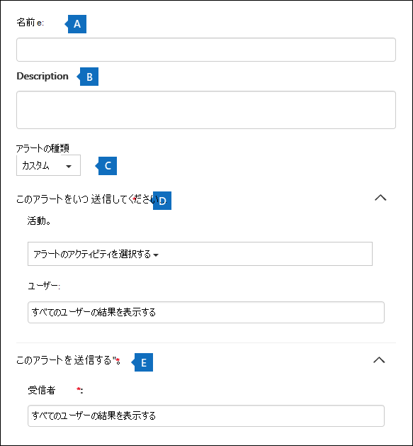
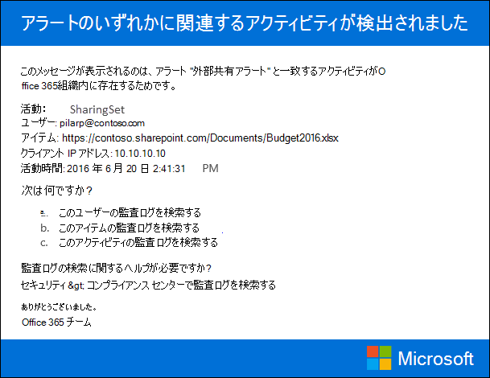

# アクティビティ アラートを作成する

[!include[Purview banner](../includes/purview-rebrand-banner.md)]

ユーザーがOffice 365で特定のアクティビティを実行したときに電子メール通知を送信するアクティビティ アラートを作成できます。 アクティビティ アラートは、監査ログ内のイベントの検索に似ていますが、アラートを作成したアクティビティのイベントが発生したときに電子メール メッセージが送信されることを除きます。

 **監査ログを検索する代わりにアクティビティ アラートを使用する理由** 実際に知りたい特定のユーザーによって実行される特定の種類のアクティビティやアクティビティがある場合があります。 これらのアクティビティの監査ログを必ず検索する代わりに、アクティビティ アラートを使用して、ユーザーがこれらのアクティビティを実行したときに電子メール メッセージを送信Microsoft 365できます。 たとえば、ユーザーがSharePoint内のファイルを削除したときに通知するアクティビティ アラートを作成したり、ユーザーがメールボックスからメッセージを完全に削除したときに通知するアラートを作成したりできます。 送信された電子メール通知には、実行されたアクティビティと、それを実行したユーザーに関する情報が含まれます。

> [!NOTE]
> アクティビティ アラートは非推奨になりました。 新しいアクティビティ アラートを作成する代わりに、セキュリティとコンプライアンス センターでアラート ポリシーの使用を開始することをお勧めします。 アラート ポリシーには、特定のアクティビティを実行したときにアラートをトリガーするアラート ポリシーを作成する機能や、セキュリティとコンプライアンス センターの [アラートの表示] ページに **アラート** を表示する機能などの追加機能が用意されています。 詳細については、「 [アラート ポリシー](alert-policies.md)」を参照してください。

## ロールを確認し、監査ログを構成する

- アクティビティ アラートを管理するには、Microsoft Purview コンプライアンス ポータルで組織構成ロールを割り当てる必要があります。 既定では、このロールはコンプライアンス管理者と組織管理の役割グループに割り当てられます。 ロール グループにメンバーを追加する方法の詳細については、「 [ユーザーに Microsoft Purview コンプライアンス ポータルへのアクセス権を付与する](../security/office-365-security/grant-access-to-the-security-and-compliance-center.md)」を参照してください。

- アクティビティ アラートの使用を開始するには、まず組織の監査ログを有効にする必要があります。 これを行うには、[**アクティビティ アラート**] ページで [**ユーザーと管理者のアクティビティの記録を開始** する] をクリックするだけです。 (このリンクが表示されない場合は、組織の監査が既に有効になっています)。コンプライアンス ポータルの [ **監査ログ検索** ] ページで監査を有効にすることもできます ( **[監査**] に移動します)。 この操作は、組織に対して 1 回だけ行う必要があります。

- 監査ログで検索できるのと同じアクティビティのアラートを作成できます。 アラートを作成できる一般的なシナリオ (および監視する特定のアクティビティ) の一覧については、「 [詳細情報](#more-information) 」セクションを参照してください。

- <a href="https://go.microsoft.com/fwlink/p/?linkid=2077149" target="_blank">コンプライアンス ポータル</a>の **[アクティビティ アラート**] ページを使用すると、組織のアドレス帳に一覧表示されているユーザーが実行したアクティビティに対してのみアラートを作成できます。 このページを使用して、アドレス帳に一覧表示されていない外部ユーザーによって実行されるアクティビティのアラートを作成することはできません。

## アクティビティ アラートを作成する

1. <a href="https://go.microsoft.com/fwlink/p/?linkid=2077149" target="_blank">コンプライアンス ポータル</a>に移動します。

2. 職場または学校のアカウントを使用してサインインします。

3. [ **アクティビティ アラート** ] ページで、[追加] アイコンをクリックします  **新規**。

   アクティビティ アラートを作成するポップアップ ページが表示されます。

    

4. 次のフィールドに入力して、アクティビティ アラートを作成します。

    1. **名前** - アラートの名前を入力します。 アラート名は組織内で一意である必要があります。

    1. **説明** (省略可能) - 追跡対象のアクティビティやユーザー、電子メール通知の送信先ユーザーなど、アラートについて説明します。 説明を使用すると、他の管理者にアラートの目的をすばやく簡単に説明できます。

    1. **アラートの種類** - **[カスタム]** オプションが選択されていることを確認します。

    1. **このアラートを送信する場合** - [ **このアラートの送信時** ] をクリックし、次の 2 つのフィールドを構成します。

       - **アクティビティ** - ドロップダウン リストをクリックすると、アラートを作成できるアクティビティが表示されます。 これは、監査ログを検索するときに表示されるのと同じアクティビティ の一覧です。 1 つ以上の特定のアクティビティを選択することも、アクティビティ グループ名をクリックしてグループ内のすべてのアクティビティを選択することもできます。 これらのアクティビティの説明については、「監査ログを検索する」の「監査されたアクティビティ」セクション [を参照してください](search-the-audit-log-in-security-and-compliance.md#audited-activities)。 ユーザーがアラートに追加したアクティビティのいずれかを実行すると、電子メール通知が送信されます。

       - **[ユーザー** ] - このボックスをクリックし、1 人以上のユーザーを選択します。 このボックスのユーザーが [ **アクティビティ** ] ボックスに追加したアクティビティを実行すると、アラートが送信されます。 組織内の任意の **ユーザー** がアラートで指定されたアクティビティを実行したときにアラートを送信するには、[ユーザー] ボックスを空白のままにします。

    1. **このアラートを送信する** - [ **このアラートの送信**] をクリックし、[ **受信者]** ボックスをクリックして名前を入力し、ユーザー ([ **ユーザー] ボックス** で指定) がアクティビティを実行したときに電子メール通知を受け取るユーザーを追加します ( **[アクティビティ** ] ボックスで指定)。 既定では、受信者の一覧に追加されることに注意してください。 この一覧から名前を削除できます。

5. [ **保存] を** クリックしてアラートを作成します。

    新しいアラートは、[ **アクティビティ** アラート] ページの一覧に表示されます。

    ![[アクティビティ アラート] ページにアラートの一覧が表示されます。](../media/02b774f2-1719-41de-bbc9-5e5b7576f335.png)

    アラートの状態は **[オン]** に設定されます。 アラートの送信時に電子メール通知を受け取る受信者も一覧表示されることに注意してください。

## アクティビティ アラートをオフにする

アクティビティ アラートをオフにして、電子メール通知が送信されないようにすることができます。 アクティビティ アラートをオフにした後も、組織のアクティビティ アラートの一覧に表示され、そのプロパティを引き続き表示できます。

1. <a href="https://go.microsoft.com/fwlink/p/?linkid=2077149" target="_blank">コンプライアンス ポータル</a>に移動します。

2. 職場または学校のアカウントを使用してサインインします。

3. 組織のアクティビティ アラートの一覧で、オフにするアラートをクリックします。

4. [ **アラートの編集]** ページで、[ **オン** ] トグル スイッチをクリックして状態を **[オフ]** に変更し、[保存] をクリック **します**。

    **[アクティビティ** アラート] ページのアラートの状態が **[オフ]** に設定されています。

アクティビティ アラートを再度有効にするには、次の手順を繰り返し、[ **オフ]** トグル スイッチをクリックして状態を **[オン]** に変更します。

## 詳細情報

- コンプライアンス ポータルの [このアラートの送信先] フィールド (および [**アクティビティ アラート**] ページの [**受信者]** の下に表示) で指定されたユーザーに送信される電子メール通知の例を次に示します。

    

- アクティビティ アラートを作成できる一般的なドキュメントアクティビティと電子メール アクティビティを次に示します。 これらのテーブルでは、アクティビティ、アラートを作成するアクティビティの名前、アクティビティが [アクティビティ **] ドロップダウン リスト** に一覧表示されているアクティビティ グループの名前について説明します。 アクティビティ アラートを作成できるアクティビティの完全な一覧については、 [監査ログの検索](search-the-audit-log-in-security-and-compliance.md#audited-activities)の「監査されたアクティビティ」セクションを参照してください。

    > [!TIP]
    > 任意のユーザーが実行するアクティビティの 1 つだけに対するアクティビティ アラートを作成できます。 または、1 人以上のユーザーが実行した複数のアクティビティを追跡するアクティビティ アラートを作成することもできます。

    次の表は、SharePointまたはOneDrive for Businessにおけるドキュメント関連の一般的なアクティビティの一覧です。

    | ユーザーがこれを行うとき... | このアクティビティのアラートを作成する | アクティビティ グループ |
    |:-----|:-----|:-----|
    |サイトにドキュメントを表示します。  |ファイルがアクセスされました  |ファイルとフォルダーのアクティビティ  |
    |ドキュメントを編集または変更します。  |ファイルの変更  |ファイルとフォルダーのアクティビティ  |
    |組織外のユーザーとドキュメントを共有します。  |ファイル、フォルダー、またはサイトを共有する    And    共有への招待の作成    詳細については、「[監査ログで共有監査を使用する](use-sharing-auditing.md)」を参照してください。  |共有アクティビティとアクセス要求アクティビティ  |
    |ドキュメントをアップロードまたはダウンロードします。  |ファイルのアップロード    や    ファイルのダウンロード  |ファイルとフォルダーのアクティビティ  |
    |サイトへのアクセス許可を変更します。  |サイト アクセス許可の変更  |サイト管理アクティビティ  |

    次の表は、Exchange Onlineでの一般的な電子メール関連のアクティビティの一覧です。

    | ユーザーがこれを行うとき... | このアクティビティのアラートを作成する | アクティビティ グループ |
    |:-----|:-----|:-----|
    |メールボックスから電子メール メッセージを完全に削除 (消去) します。  |メールボックスから削除されたメッセージ  | Exchange メールボックス アクティビティ  |
    |共有メールボックスから電子メール メッセージを送信します。  |送信者権限を使ったメッセージの送信    And    代理送信権限を使ったメッセージの送信  | Exchange メールボックス アクティビティ  |

- Security & Compliance Center PowerShell の **New-ActivityAlert** コマンドレットと **Set-ActivityAlert** コマンドレットを使用して、アクティビティ アラートを作成および編集することもできます。 これらのコマンドレットを使用してアクティビティ アラートを作成または編集する場合は、次の点に注意してください。

  - コマンドレットを使用して、[ **アクティビティ** ] ドロップダウン リストに一覧表示されていないアラートにアクティビティを追加する場合、アラートのプロパティ ページに「このアラートには、ピッカーに表示されないカスタム操作があります」というメッセージが表示されます。

  - コマンドレットを使用してアクティビティ アラートを作成または編集する正当な理由は、組織外のユーザーに電子メール通知を送信することです。 この外部ユーザーは、アラートの受信者の一覧に表示されます。 ただし、この外部ユーザーをアラートから削除した場合、[アラートの **編集]** ページを使用して、そのユーザーをアラートに再追加することはできません。 **Set-ActivityAlert** コマンドレットを使用して外部ユーザーを再追加するか、**New-ActivityAlert** コマンドレットを使用して同じ (または異なる) 外部ユーザーを新しいアラートに追加する必要があります。
