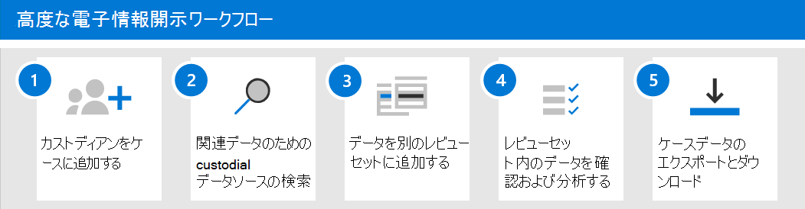

# ケースの作成と管理Advanced eDiscoveryする

サポート案件をAdvanced eDiscovery、ケースを管理する組織内の[電子](get-started-with-advanced-ediscovery.md#step-2-assign-ediscovery-permissions)情報開示管理者にアクセス許可を割り当てると、次の手順では、ケースを作成して管理します。

この記事では、ケースを使用して、法的ケースや他の種類の調査Advanced eDiscoveryワークフローを管理するための概要も示します。

## ケースを作成する

ケースを作成し、メンバーを追加するには、次の手順を実行します。 ケースを作成するユーザーは、メンバーとして自動的に追加されます。 ケースのメンバーは、ケース内のケースにアクセスし、Microsoft 365 コンプライアンス センタータスクAdvanced eDiscovery実行できます。

1. [電子情報開示<a href="https://go.microsoft.com/fwlink/p/?linkid=2077149" target="_blank">Microsoft 365 コンプライアンス センター</a>アクセス許可が割り当てられているユーザー アカウントの資格情報を使用してサインインします。 組織の管理役割グループのメンバーは、組織のケースAdvanced eDiscovery作成することもできます。

2. ウィンドウの左側のナビゲーション ウィンドウMicrosoft 365 コンプライアンス センター [すべて表示]をクリックし、[**電子** 情報開示の詳細設定] を選択し、[ケース] タブ  >  <a href="https://go.microsoft.com/fwlink/p/?linkid=2173764" target="_blank">**を選択** します</a>。

3. [**ケースを作成する**] を選択します。

4. [ **新しい電子情報開示ケース] フライ** アウト ページで、ケースに名前 (必須) を付け、オプションのケース番号と説明を入力します。 ケース名は、組織内で一意である必要があります。

5. [保存 **] を** クリックしてケースを作成します。

   新しいケースが作成され、**新設定** の [大文字と小文字] タブが表示されます。

6. [アクセス許可 **] &タブの**[アクセス許可] タイル **設定選択]** を **クリックします**。

7. [このケース **の管理] フライ** アウト ページの **[メンバーの** 管理] で、[追加] **をクリックして** ケースにメンバーを追加します。

8. ユーザーの一覧で、ケースに追加するユーザーの名前の横にあるチェック ボックスをオンにします。 前に説明したように、ケースに追加するユーザーに適切な電子情報開示アクセス許可が割り当てられている必要があります。

9. ケースのメンバーとして追加するユーザーを選択した後、[追加] を **クリックします**。

10. [**このケースを管理**] で、[**保存**] をクリックして、ケース メンバーの新しいリストを保存します。

11. [ホーム **] タブを** クリックして、ケースのホーム ページに移動します。

## ワークフローの管理

電子情報開示の使用をAdvanced eDiscovery、電子情報開示の一般的なプラクティスに合った基本的な[ワークフローを次に示します](advanced-ediscovery-edrm.md)。 これらの各手順では、探索できるいくつかの拡張Advanced eDiscovery機能も強調表示します。

1. **[保管担当者と非](add-custodians-to-case.md)[保管データ](non-custodial-data-sources.md)** ソースをケースに追加します。 ケースを作成した後の最初の手順は、保管担当者を追加します。 保管 *担当者とは* 、ケースに関連する可能性のあるドキュメントまたは電子ファイルの管理制御を持つ人物です。 さらに、特定のユーザーに関連付けられているのではなく、ケースに関連する可能性があるデータ ソースを追加できます。

   カストディアンをケースに追加するときに発生する (または実行できる) いくつかの操作を次に示します。

   - 保管担当者がメンバーである保管担当者の Exchange メールボックス、OneDrive アカウント、および Microsoft Teams または Yammer グループ内のデータは、ケース内の保管データとして "マーク" できます。
  
   - 保管担当者のデータは、(Advanced indexing と呼ばれるプロセスによって) *インデックスが再作成されます*。 これにより、次の手順で検索を最適化できます。
  
   - 保管担当者データを保留にできます。 これにより、調査中にケースに関連する可能性のあるデータが保持されます。
  
   - 他のデータ ソースを保管担当者に関連付けることができます (たとえば、SharePoint サイトまたは Microsoft 365 OneDrive グループを保管担当者に関連付けることができます)。

   - 管理者の通信ワークフロー[を使用](managing-custodian-communications.md)Advanced eDiscovery保管担当者に法的保留通知を送信できます。

2. **[データ ソースから関連するコンテンツを収集します](create-draft-collection.md)**。 保管担当者と保管されていないデータ ソースをケースに追加した後、組み込みのコレクション ツールを使用して、ケースに関連する可能性のあるコンテンツについてこれらのデータ ソースを検索します。 キーワード、プロパティ、および条件を使用して、ケースに最も関連性の高いデータを含む検索結果を返す検索クエリを作成します。 以下のことも実行できます。

   - コレクション [を絞り](collection-statistics-reports.md) 込み、結果を絞り込むのに役立つコレクションの統計情報を表示します。

   - コレクションのサンプルをプレビューして、関連するデータが見つかったかどうかを迅速に確認します。

   - クエリを修正し、コレクションを再実行します。

3. **[コレクションをレビュー セットにコミットします](commit-draft-collection.md)**。 検索で目的のデータが返されていることを構成して確認したら、次に、検索結果をレビュー セットに追加します。 レビュー セットにデータを追加すると、アイテムは元の場所から安全な場所にAzure Storageされます。 レビュー セット内のアイテムを確認および分析する際に、データのインデックスを再作成して、徹底的かつ迅速な検索を最適化します。 さらに、レビュー セット[にOffice 365データを追加できます](load-non-office-365-data-into-a-review-set.md)。

   また、会話レビュー セットと呼ばれる、データを追加できる特別な *種類のレビュー セットがあります*。 これらの種類のレビュー セットは、スレッド会話を再構築、レビュー、およびエクスポートする会話再構成機能を提供します。Microsoft Teams。 詳細については、「Review [conversations in Advanced eDiscovery」 を参照してください](conversation-review-sets.md)。

4. **レビュー セット内のデータを確認および分析します**。 データがレビュー セットに追加されたので、さまざまなツールと機能を使用してケース データを表示および分析し、調査するケースに最も関連性の高いデータ セットを削減できます。 このプロセスで使用できるツールと機能の一覧を次に示します。

   - [ドキュメントを表示します](view-documents-in-review-set.md)。 これには、レビュー セット内の各ドキュメントのメタデータの表示、ネイティブ バージョンまたはテキスト バージョンでのドキュメントの表示が含まれます。

   - [クエリとフィルターを作成します](review-set-search.md)。 さまざまな検索条件を使用して検索クエリを作成します (すべてのファイル メタデータプロパティを検索してケース データをさらに絞り込み、ケースに最も関連のあるデータに絞り込む機能を含む)。 また、レビュー セット フィルターを使用して、検索クエリの結果に他の条件をすばやく適用して、それらの結果をさらに絞り込む場合にも使用できます。 

   - [タグを作成して使用します](tagging-documents.md)。 レビュー セット内のドキュメントにタグを適用して、応答する (またはケースに対して応答しない) タグを識別し、タグ付きドキュメントを含めるか除外する検索クエリを作成するときにそれらのタグを使用できます。 タグを付け、エクスポートするドキュメントを決定できます。

   - [ドキュメントに注釈を付け、やり直します](view-documents-in-review-set.md#annotate-view)。 レビューで注釈ツールを使用して、ドキュメントに注釈を付け、ドキュメント内のコンテンツを作業製品として編集できます。 レビュー中に注釈付きまたは編集されたドキュメントの PDF バージョンを生成し、未編集のネイティブ バージョンのドキュメントをエクスポートするリスクを軽減します。

   - [ケース データを分析します](analyzing-data-in-review-set.md)。 分析機能は、Advanced eDiscovery強力です。 レビュー セット内のデータに対して分析を実行した後、ほぼ重複検出、電子メール スレッド、および確認する必要があるドキュメントの量を減らすのに役立つテーマなどの分析を実行します。 また、分析の実行結果を要約した分析レポートも生成します。 前に説明したように、分析を実行すると、 [弁護士クライアント特権検出モデルも実行されます](attorney-privilege-detection.md#use-the-attorney-client-privilege-detection-model)。

5. **ケース データをエクスポートおよびダウンロードします**。 ケース データを収集、レビュー、分析した後の最後の手順は、Advanced eDiscovery からエクスポートして外部レビューを行う場合や、調査チーム外のユーザーによるレビューを行う方法です。 データのエクスポートは 2 段階のプロセスです。 最初の手順は、レビュー セットからデータをエクスポートし、別の場所 (Microsoft が提供Azure Storage組織が管理する場所) にコピーすることです。 次に、Azure Storage Explorer[を使用して、](download-export-jobs.md)ローカル コンピューターにデータをダウンロードします。 エクスポートされたデータ ファイルに加えて、エクスポート パッケージの格納には、エクスポート レポート、概要レポート、およびエラー レポートも含まれます。

## Advanced eDiscoveryアーキテクチャ

単一地域環境と複数地域環境での Advanced eDiscovery エンド to エンド のワークフローと、電子探索参照モデルに合わせて配置されたエンドツーエンドのデータ フローを示すアーキテクチャ図を[次に示](overview-ediscovery-20.md#advanced-ediscovery-alignment-with-the-electronic-discovery-reference-model)します。

[画像として表示する](../media/solutions-architecture-center/m365-advanced-ediscovery-architecture.png)

[PDF ファイルとしてダウンロードする](https://download.microsoft.com/download/d/1/c/d1ce536d-9bcf-4d31-b75b-fcf0dc560665/m365-advanced-ediscovery-architecture.pdf)

[ファイルとしてVisioする](https://download.microsoft.com/download/d/1/c/d1ce536d-9bcf-4d31-b75b-fcf0dc560665/m365-advanced-ediscovery-architecture.vsdx)
