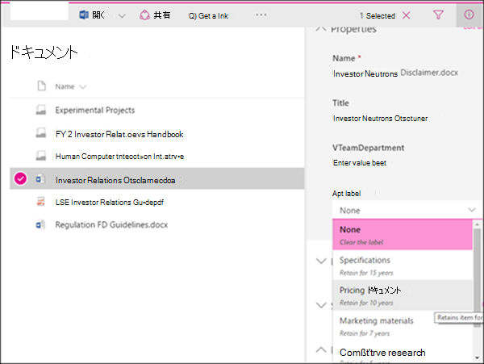

# <a name="publish-retention-labels-and-apply-them-in-apps"></a>アイテム保持ラベルを発行してアプリに適用する

>*[セキュリティとコンプライアンスのための Microsoft 365 ライセンス ガイダンス](/office365/servicedescriptions/microsoft-365-service-descriptions/microsoft-365-tenantlevel-services-licensing-guidance/microsoft-365-security-compliance-licensing-guidance)。*

> [!NOTE]
> このシナリオは、 [法的レコード](records-management.md#records)を含むすべての保持ラベル構成に対してサポートされています。

以下の情報を参考に [保持ラベル](retention.md) を発行し、ドキュメントやメールに適用します。

保持ラベルは、アイテム レベル (ドキュメントまたはメール) で必要なものを保持し、不要なものを削除するのに役立ちます。 また、Microsoft 365 データの[レコード管理](records-management.md) ソリューションの一部として、アイテムをレコードとして宣言するためにも使用されます。

組織内のユーザーが保持ラベルを使用できるようにして、コンテンツを分類できるようにするプロセスは 2 段階です。 

1. 保持ラベルを作成します。

2. 保持ラベル ポリシーを使用して保持ラベルを発行します。
  


次の手順を 2 つの管理手順に使用します。

## <a name="before-you-begin"></a>はじめに

組織のグローバル管理者には、保持ラベルとそれらのポリシーを作成および編集できる完全な権限があります。 グローバル管理者としてサインインしていない場合は、使用しているソリューションに応じて、["レコード管理"](get-started-with-records-management.md#permissions) または ["Information Governance"](get-started-with-information-governance.md#permissions-for-retention-policies-and-retention-labels) のアクセス許可情報を参照してください。

アイテムに適用する[保持ラベルが作成されていること](file-plan-manager.md#create-retention-labels)を確認します。

## <a name="how-to-publish-retention-labels"></a>保持ラベルを発行する方法

保持ラベル ポリシーを作成する前に、**アダプティブ** か **静的** にするかどうかを決定します。 詳細については、「[保持用のアダプティブ ポリシー スコープまたは静的ポリシー スコープ](retention.md#adaptive-or-static-policy-scopes-for-retention)」を参照してください。 アダプティブ ポリシーの使用を決定する場合は、保持ラベル ポリシーの作成前に 1 つ以上のアダプティブ スコープを作成し、保持ラベル ポリシーの作成プロセス中に選択する必要があります。 手順については、「[アダプティブ スコープの構成情報](retention-settings.md#configuration-information-for-adaptive-scopes)」を参照してください。

1. <a href="https://go.microsoft.com/fwlink/p/?linkid=2077149" target="_blank">Microsoft 365 コンプライアンス センター</a>で、次のいずれかの場所に移動します:
    
    - レコード管理を使用している場合:
        - [**ソリューション**] > [**レコード管理**] > [**ラベル ポリシー**] タブ > [**ラベルの発行**]
    
    - 情報ガバナンスを使用している場合:
        - [**ソリューション**] > [**情報ガバナンス**] > [**ラベル ポリシー**] タブ > [**ラベルの発行**]
    
    ナビゲーション ウィンドウにすぐに解決方法が表示されない場合 最初に [**すべて表示**] を選択します。 

2. メッセージに従って保持ラベル ポリシーを作成します。 ポリシーの保存後は変更できないため、ポリシーに選択する名前に注意してください。

3. リンクを使用して発行する保持ラベルを選択し、[**次へ**] を 選択します。

4. [**作成するアイテム保持ポリシーの種類を選択する**] ページで、[[開始する前に](#before-you-begin)] で行った選択に従って、[**アダプティブ**] または [**静的**]を選択します。 アダプティブ スコープをまだ作成していない場合は、[**アダプティブ**] を選択できますが、選択するアダプティブ スコープがないため、このオプションを使用してウィザードを終了することはできません。

5. 選択したスコープに応じて、次の項目を実行します。
    
    - [**アダプティブ**] を選択した場合: [**アダプティブ ポリシー スコープと場所の選択**] ページで、[**スコープの追加**] を選択し、作成された 1 つ以上のアダプティブ スコープを選択します。 次に、1 つ以上の場所を選択します。 選択できる場所は、追加された[スコープの種類](retention-settings.md#configuration-information-for-adaptive-scopes)によって異なります。 たとえば、[**ユーザー**] のスコープの種類のみを追加した場合は、[**Exchange メール**] を選択できますが、[**SharePoint サイト**] は選択できません。 
    
    - [**静的**] を選択した場合: [**場所の選択**] ページで、場所のオンとオフを切り替えます。 場所ごとに、既定のままにして、[ポリシーを場所全体に適用する](retention-settings.md#a-policy-that-applies-to-entire-locations)か、[包含と除外を指定する](retention-settings.md#a-policy-with-specific-inclusions-or-exclusions)ことができます。
    
    場所の選択に関する詳細については、「[場所](retention-settings.md#locations)」を参照してください。

既存の保持ラベル ポリシー (ポリシーの種類は [**公開**]) を編集するには、それを選択してから、[**編集**] オプションを選択して、[**保持ポリシーの編集**] 構成を開始します。

## <a name="when-retention-labels-become-available-to-apply"></a>保持ラベルが適用できるようになったとき

SharePoint または OneDrive に対して保持ラベルを発行する場合、これらのラベルは、通常 1 日以内にユーザーが選択できるように表示されます。 ただし、最大 7 日かかります。 

Exchange にラベルを発行する場合、ユーザーにこれら保持ラベルが表示されるまで最大 7 日かかり、少なくとも 10 MB のデータをメールボックスで格納できる必要があります。


ラベルが 7 日経っても表示されない場合は、コンプライアンス センターの **[ラベル ポリシー]** ページから選択して、ラベル ポリシーの **状態** を確認します。 **オフ (エラー)** の状態が表示され、場所の詳細に、ポリシーの展開 (SharePoint の場合) またはポリシーの再展開 (OneDrive の場合) に予想よりも時間がかかっているというメッセージが表示される場合は、[Set-RetentionCompliancePolicy](/powershell/module/exchange/set-retentioncompliancepolicy) PowerShell コマンドを実行して、ポリシーの配布を再試行してください:

1. [セキュリティ/コンプライアンス センター PowerShell に接続する](/powershell/exchange/connect-to-scc-powershell)

2. 次のコマンドを実行します:
    
    ``` PowerShell
    Set-RetentionCompliancePolicy -Identity <policy name> -RetryDistribution
   ```

### <a name="how-to-check-on-the-status-of-retention-labels-published-to-exchange"></a>Exchange に発行された保持ラベルの状態を確認する方法

Exchange Online では、7 日ごとに実行されるプロセスによってエンド ユーザーが保持ラベルを利用できるようになります。PowerShell を使用することで、このプロセスが最後に実行された日時を確認できるため、次に実行される日時を特定できます。
  
1. [Exchange Online PowerShell に接続します](/powershell/exchange/connect-to-exchange-online-powershell)。
    
2. これらのコマンドを実行します。
    
   ```powershell
   $logProps = Export-MailboxDiagnosticLogs <user> -ExtendedProperties
   ```

   ```powershell
   $xmlprops = [xml]($logProps.MailboxLog)
   ```

   ```powershell
   $xmlprops.Properties.MailboxTable.Property | ? {$_.Name -like "ELC*"}

In the results, the `ELCLastSuccessTimeStamp` (UTC) property shows when the system last processed your mailbox. If it has not happened since the time you created the policy, the labels are not going to appear. To force processing, run  `Start-ManagedFolderAssistant -Identity <user>`.
    
If labels aren't appearing in Outlook on the web and you think they should be, make sure to clear the cache in your browser (CTRL+F5).
    

## How to apply published retention labels

Use the following sections to learn how published retention labels can be applied in apps:

- [Manually apply retention labels](#manually-apply-retention-labels)

- [Applying a default retention label to all content in a SharePoint library, folder, or document set](#applying-a-default-retention-label-to-all-content-in-a-sharepoint-library-folder-or-document-set)

- [Automatically applying a retention label to email by using rules](#automatically-applying-a-retention-label-to-email-by-using-rules)

In addition, when you use [SharePoint Syntex](../contentunderstanding/index.md) and publish retention labels to SharePoint locations, you can [apply a retention label to a document understanding model](../contentunderstanding/apply-a-retention-label-to-a-model.md) so that identified documents are automatically labeled.

After content is labeled, see the following information to understand when the applied label can be removed or changed: [Only one retention label at a time](retention.md#only-one-retention-label-at-a-time).

### Manually apply retention labels 

End users, as well as administrators, can manually apply retention labels from the following locations:  

- Outlook and Outlook on the web
    
- OneDrive
    
- SharePoint
    
- Microsoft 365 groups (both the group site and group mailbox in Outlook on the web)
    
Use the following sections to understand how to apply retention labels. 

#### Applying retention labels in Outlook

To label an item in the Outlook desktop client, select the item. On the **Home** tab on the ribbon, click **Assign Policy**, and then choose the retention label. 
  

  
You can also right-click an item, click **Assign Policy** in the context menu, and then choose the retention label. When you select multiple items, you can use this method to assign the same retention label to multiple items at once.

After the retention label is applied, you can view that retention label and what action it takes at the top of the item. If an email has a retention label applied that has an associated retention period, you can see at a glance when the email expires.

##### Applying a default retention label to an Outlook folder

You can apply retention labels to Outlook folders as a default label that can be inherited by messages in that folder. Right-click the folder, select **Properties**, the **Policy** tab, and select the retention label you want to use as that folder's default retention label.

When you use a standard retention label as your default label for an Outlook folder:
  
- All unlabeled items in the folder have this retention label applied.

- The inheritance flows to any child folders and items inherit the label from their nearest folder.

- Items that are already labeled retain their retention label, unless it was applied by a different default label.

- If you change or remove the default retention label for the folder: Existing retention labels applied to items in that folder are also changed or removed only if those labels were applied by a default label.

- If you move an item with a default retention label from one folder to another folder with a different default retention label: The item gets the new default retention label.

- If you move an item with a default retention label from one folder to another folder with no default retention label: The old default retention label is removed.

When labels are applied that aren't standard retention labels but mark items as [records (or regulatory records)](records-management.md#records), these labels can only be manually changed or removed.

#### Applying retention labels in Outlook on the web

To label an item in Outlook on the web, right-click the item \> **Assign policy** \> choose the retention label. Unlike Outlook desktop, you can't use this method if you multi-select items.
  

  
After the retention label is applied, you can view that retention label and what action it takes at the top of the item. If an email is classified and has an associated retention period, you can know at a glance when the email will expire.
  

  
As with the desktop version of Outlook on the web, you can also apply retention labels to folders. Right-click the folder, select **Assign policy**, and change **Use parent folder policy** to the retention label you want to use as that folder's default retention label.

#### Applying retention labels in OneDrive and SharePoint

To label a document (including OneNote files) in OneDrive or SharePoint, select the item \> in the upper-right corner, choose **Open the details pane** \> **Apply retention label** \> choose the retention label. 
  
You can also apply a retention label to a folder or document set, and you can set a [default retention label for a document library](#applying-a-default-retention-label-to-all-content-in-a-sharepoint-library-folder-or-document-set).
  

  
After a retention label is applied to an item, you can view it in the details pane when that item's selected.
  


For SharePoint, but not OneDrive, you can create a view of the library that contains the **Labels** column or **Item is a Record** column. This view lets you see at a glance the retention labels assigned to all items and which items are records. Note, however, that you can't filter the view by the **Item is a Record** column. For instructions how to add columns, see [Show or hide columns in a list or library](https://support.microsoft.com/en-us/office/show-or-hide-columns-in-a-list-or-library-b820db0d-9e3e-4ff9-8b8b-0b2dbefa87e2).


#### Applying retention labels using Microsoft 365 groups

When you publish retention labels to the **Microsoft 365 Groups** location, the retention labels appear in the SharePoint teams site but aren't supported by any email client for group mailboxes. The experience of applying a retention label in the site is identical to that for documents in SharePoint.

### Applying a default retention label to all content in a SharePoint library, folder, or document set

This method requires retention labels to be published to a retention label policy.

In addition to letting people apply a retention label to individual documents, you can also apply a default retention label to a SharePoint library, folder, or document set. In this scenario, documents in that location can inherit your selected default retention label. Although the same label is applied, each document will be retained and deleted separately, according to the start of the retention period setting in the label. 
  
For a document library, the default label configuration is done on the **Library settings** page for a document library. When you choose the default retention label, you can also choose to apply it to existing items in the library.
  
For example, if you have a retention label for marketing materials, and you know a specific document library contains only that type of content, you can make the **Marketing Materials** retention label the default label for all documents in that library.
  


#### Label behavior when you use a default label for SharePoint

For standard retention labels that you apply as a default retention label to a library, folder, or document set:

- All new, unlabeled items in the container will have this retention label applied.

- For folders, the inheritance flows to any child folders and items inherit the label from their nearest folder.

- If you selected the option to apply the default label to existing items: Items that are already labeled retain their retention label, unless it was applied by a different default label.
    
- If you change the default retention label for the container: Existing retention labels applied to items in that container are changed only if you selected the option to apply the default label to existing items and those labels were applied by a default label.

- If you remove the default retention label for the container: Items retain their labels.
    
- If you move an item with a default retention label applied from one container to another container: The item keeps its existing default retention label, even if the new location has a different default retention label. Only if you then change the default label for this new location can the moved item inherit the default label from its current location.

When labels are applied that aren't standard retention labels but mark items as [records (or regulatory records)](records-management.md#records), these labels can only be manually changed or removed.

### Automatically applying a retention label to email by using rules

In Outlook, you can create rules to apply a retention label.
  
For example, you can create a rule that applies a specific retention label to all messages sent to or from a specific distribution group.
  
To create a rule, right-click an item \> **Rules** \> **Create Rule** \> **Advanced Options** \> **Rules Wizard** \> **apply retention policy**.
  


Although the UI refers to retention policies, it's your retention labels that display here and can be selected, not your retention policies.

## Updating retention labels and their policies

If you [edit a retention label](file-plan-manager.md#edit-retention-labels) or a retention label policy, and the retention label or policy is already applied to content, your updated settings will automatically be applied to this content in addition to content that's newly identified.

Some settings can't be changed after the label or policy is created and saved, which include:
- Names for retention labels and their policies, the scope type (adaptive or static), and the retention settings except the retention period. However, you can't change the retention period when the retention period is based on when items were labeled.
- The option to mark items as a record.

### Deleting retention labels

You can delete retention labels that aren't currently included in any retention label policies, that aren't configured for event-based retention, or mark items as regulatory records.

For retention labels that you can delete, if they have been applied to items, the deletion fails and you see a link to content explorer to identify the labeled items.

However, it can take up to two days for content explorer to show the items that are labeled. In this scenario, the retention label might be deleted without showing you the link to content explorer.

## Locking the policy to prevent changes

If you need to ensure that no one can turn off the policy, delete the policy, or make it less restrictive, see [Use Preservation Lock to restrict changes to retention policies and retention label policies](retention-preservation-lock.md).

## Next steps

To help you track the labels applied from your published retention labeling policies:

- [Monitoring retention labels](retention.md#monitoring-retention-labels)
- [Using Content Search to find all content with a specific retention label](retention.md#using-content-search-to-find-all-content-with-a-specific-retention-label)
- [Auditing retention actions](retention.md#auditing-retention-actions)

Event-based retention is another supported scenario for retention labels. For more information, see [Start retention when an event occurs](event-driven-retention.md).