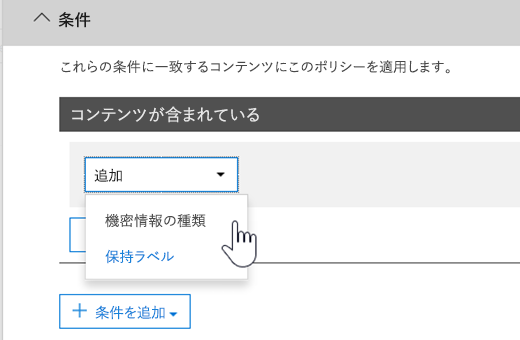

# <a name="create-custom-sensitive-information-types-with-exact-data-match-based-classification"></a>Exact Data Match に基づく分類で、カスタムの機密情報の種類を作成する

[カスタムの機密情報の種類](sensitive-information-type-learn-about.md) は機密性の高いアイテムの識別に利用され、これにより、不注意による共有や不適切な共有を防止することができます。 次に基づいてカスタム機密情報の種類 (SIT) を定義します。

- パターン
- *従業員*、*バッジ*、*ID* などのキーワード証拠
- 特定のパターンの証拠に対する文字の近接性
- 信頼度レベル

 このようなカスタムの機密情報の種類は、多くの組織のビジネス ニーズを満たします。

しかし、汎用的なパターンに基づいて一致を検出するカスタムの機密情報の種類 (SIT) ではなく、正確なデータ値を使用するカスタムの機密情報の種類が必要な場合はどうでしょう。 Exact Data Match (EDM) ベースの分類では、次の目的で設計されたカスタムの機密情報の種類を作成できます。

- 動的に、簡単に更新する
- 拡張性の高いものにする
- 結果的に誤検知の数を減らす
- 構造化された機密データを操作する
- 機密情報をより安全に処理する
- さまざまな Microsoft クラウド サービスで使用する


EDM ベースの分類を使用すると、機密情報のデータベース内の正確な値を参照する、カスタムの機密情報の種類を作成できます。 データベースは毎日更新できます。また、最大 1 億行のデータを格納できます。 そのため、従業員、患者、または顧客の出入りに合わせて記録が変更されても、カスタムの機密情報の種類は最新の状態が維持されます。 また、EDM ベースの分類は、[データ損失防止ポリシー](dlp-learn-about-dlp.md)や [Microsoft Cloud App Security ファイル ポリシー](/cloud-app-security/data-protection-policies) などのポリシーと共に使用できます。

> [!NOTE]
> Microsoft 365 Information Protection は、次のような場合に 2 バイト文字セットの言語をサポートします。
>
> - 中国語 (簡体字)
> - 中国語 (繁体字)
> - 韓国語
> - 日本語
>
> このサポートは、機密情報の種類で使用できます。 詳細については、「[2バイト文字セットのリリースノート (preview) についての情報保護サポート](mip-dbcs-relnotes.md)」を参照してください。

## <a name="required-licenses-and-permissions"></a>必要なライセンスとアクセス許可

この記事で説明されているタスクを実行するには、全体管理者、コンプライアンス管理者、または Exchange Online の管理者である必要があります。 DLP アクセス許可の詳細については、「[アクセス許可](data-loss-prevention-policies.md#permissions)」を参照してください。

これらのサブスクリプションには、EDM ベースの分類が含まれています

- Office 365 E5
- Microsoft 365 E5
- Microsoft 365 E5 Compliance 
- Microsoft E5/A5 Information Protection and Governance

## <a name="portal-links-for-your-subscription"></a>サブスクリプションのポータルリンク

|ポータル|世界中の GCC|GCC-High|DOD|
|---|---|---|---|
|Office SCC|compliance.microsoft.com|scc.office365.us|scc.protection.apps.mil|
|Microsoft 365 セキュリティ センター|security.microsoft.com|security.microsoft.us|security.apps.mil|
|Microsoft 365 コンプライアンス センター|compliance.microsoft.com|compliance.microsoft.us|compliance.apps.mil|

## <a name="the-work-flow-at-a-glance"></a>ワークフローの概要

|フェーズ|前提条件|
|---|---|
|[パート 1: EDM ベースの分類をセットアップする](#part-1-set-up-edm-based-classification)<br/><br/>(適宜)<br/>- [データベーススキーマを編集する](#editing-the-schema-for-edm-based-classification) <br/>- [スキーマを削除する](#removing-the-schema-for-edm-based-classification)|- 機密データへの読み取りアクセス<br/>- XML 形式のデータベース スキーマ (例を提供)<br/>- XML 形式のルール パッケージ (例を提供)<br/>- セキュリティ/コンプライアンス センターへの管理者権限 (PowerShell を使用)|
|[パート 2: 機密データをハッシュしアップロードする](#part-2-hash-and-upload-the-sensitive-data)<br/><br/>(適宜)<br/>[データを更新する](#refreshing-your-sensitive-information-database)|- カスタムのセキュリティ グループとユーザー アカウント<br/>- EDM アップロード エージェントを使用するコンピューターへのローカル管理者アクセス<br/>- 機密データへの読み取りアクセス<br/>- データ更新のプロセスとスケジュール|
|[パート 3: Microsoft クラウド サービスで EDM ベースの分類を使用する](#part-3-use-edm-based-classification-with-your-microsoft-cloud-services)|- DLP を使用する Microsoft 365 サブスクリプション<br/>- 有効化された EDM ベースの分類機能|

### <a name="part-1-set-up-edm-based-classification"></a>パート 1: EDM ベースの分類をセットアップする

EDM ベースの分類の設定と構成には、次のものが含まれます。

1. [機密データを .csv .tsv 形式で保存する](#save-sensitive-data-in-csv-or-tsv-format)
2. [機密情報データベース スキーマを定義する](#define-the-schema-for-your-database-of-sensitive-information)
3. [ルール パッケージを作成する](#set-up-a-rule-package)

#### <a name="save-sensitive-data-in-csv-or-tsv-format"></a>機密データを .csv .tsv 形式で保存する

1. 使用する機密情報を特定します。 データをアプリにエクスポートし、Microsoft Excelファイルに保存します。 ファイルは、.csv (コンマ区切り値)、.tsv (タブ区切り値)、またはパイプ区切り (|) 形式で保存できます。 データ値に住所などのコンマが含まれている場合は、.tsv 形式をお勧めします。
データ ファイルには、次のデータを含めることができます。
   - 最大 1 億行の機密データ
   - データ ソースごとに最大 32 列 (フィールド)
   - 検索可能としてマークされた列 (フィールド) を最大 5 列

2. EDM ベースの分類に使用されるフィールドの名前が最初の行に含まれる.csvまたは .tsv ファイル内の機密データを構造化します。 ファイルには、"ssn"、"birthdate"、"firstname"、"lastname" などのフィールド名が含まれ得ます。 列見出しの名前にスペースやアンダースコアを含めることはできません。 たとえば、この記事で使用するサンプルの .csv ファイルは *PatientRecords.csv* と呼ばれており、その列には *PatientID*、*MRN*、*LastName*、*FirstName*、*SSN* などが含まれています。

3. 機密データ フィールドの形式に注意してください。 特に、コンテンツにコンマを含む可能性があるフィールド (たとえば、値 "Seattle,WA" を含む住所) は、.csv 形式が選択されている場合に解析すると、2 つの別個のフィールドとして解析されます。 この問題を回避するには、.tsv 形式を使用するか、機密データ テーブルの値を二重引用符で囲むコンマを囲む必要があります。 コンマを含む値にスペースも含まれている場合は、対応する形式に一致するカスタム SIT を作成する必要があります。 たとえば、コンマとスペースを含む複数単語文字列を検出する SIT。

#### <a name="define-the-schema-for-your-database-of-sensitive-information"></a>機密情報のデータベースのスキーマを定義する

ビジネス上または技術的な理由で、PowerShell またはコマンド ラインを使用してスキーマと EDM の機密情報の種類のパターン (ルール パッケージ) を作成しない場合は、 [Exact Data Match スキーマと機密情報の種類ウィザード](sit-edm-wizard.md)を使って作成できます。 スキーマおよび EDM の機密情報の種類パターンの作成が完了したら、EDM ベースの機密情報の種類を使用できるようにするために必要なすべての手順を完了します。

> [!NOTE]
> 完全一致スキーマと機密情報の種類ウィザードは、World Wide クラウドと GCC クラウドでのみ使用できます。

1. 機密情報のデータベースのスキーマを XML 形式で定義します (次の例と同様)。 このスキーマ ファイルの名前を **edm.xml** にして、データベースの各列に対して構文を使用する行があるように構成します。

      `\<Field name="" searchable=""/\>`.

      - *Field name* の値に列名を使用します。
      - *searchable="true"* を使用して、最大 5 つのフィールドで検索可能にします。 少なくとも 1 つのフィールドは検索可能である必要があります。

      たとえば、次の XML ファイルは患者レコードのデータベースのスキーマを定義します。検索可能として指定された 5 つのフィールドは、*PatientID*、*MRN*、*SSN*、*Phone*、*DOB* です。

      (この例は、コピー、変更、使用することができます。)

      ```xml
      <EdmSchema xmlns="http://schemas.microsoft.com/office/2018/edm">
            <DataStore name="PatientRecords" description="Schema for patient records" version="1">
                  <Field name="PatientID" searchable="true" caseInsensitive="true" ignoredDelimiters="-,/,*,#,^" />
                  <Field name="MRN" searchable="true" />
                  <Field name="FirstName" />
                  <Field name="LastName" />
                  <Field name="SSN" searchable="true" />
                  <Field name="Phone" searchable="true" />
                  <Field name="DOB" searchable="true" />
                  <Field name="Gender" />
                  <Field name="Address" />
            </DataStore>
      </EdmSchema>
      ```

##### <a name="configurable-match-using-the-caseinsensitive-and-ignoreddelimiters-fields"></a>大文字と小文字を区別せず、区切り文字フィールドを無視する構成可能な一致

上記のXMLサンプルは、`caseInsensitive` フィールドと `ignoredDelimiters` フィールドを使用しています。

スキーマ定義に `true` の値に設定された ***caseInsensitive** _ フィールドを含めると、EDM は `PatientID` フィールドの大文字と小文字の違いに基づいてアイテムを除外しません。 したがって、EDM は、`PatientID` _ *FOO-1234** と **fOo-1234** が同一であると見なします。

サポートされている文字を含む ***ignoredDelimiters** _ フィールドを含めると、EDM は `PatientID` 内のそれらの文字を無視します。 したがって、EDM は、`PatientID` _ *FOO-1234** と `PatientID` **FOO#1234** が同一であると見なします。 `ignoredDelimiters` フラグは英数字以外の文字をサポートします。次にいくつかの例を示します。

- \.
- \-
- \/
- \_
- \*
- \^
- \#
- \!
- \?
- \[
- \]
- \{
- \}
- \\
- \~
- \;

`ignoredDelimiters`フラグは以下をサポートしていません:

- 0 から 9 の文字
- A から Z
- a から z
- \"
- \,

この例では、`caseInsensitive` と`ignoredDelimiters` の両方が使用されている場合、EDMは **FOO-1234** と **fOo#1234** を同一と見なし、アイテムを患者記録の機密情報タイプとして分類します。 

1. Connectコンプライアンス センター PowerShell &の手順を使用して、セキュリティ Connect コンプライアンス センター [PowerShell &にアクセスします](/powershell/exchange/connect-to-scc-powershell)。

2. データベース スキーマをアップロードするには、次のコマンドレットを 1 つずつ実行します。

      ```powershell
      $edmSchemaXml=Get-Content .\\edm.xml -Encoding Byte -ReadCount 0
      New-DlpEdmSchema -FileData $edmSchemaXml -Confirm:$true
      ```

      次のように、確認を求められます。

      > 確認
      >
      > この操作を実行しますか?
      >
      > データストア ' patientrecords ' の新しい EDM スキーマがインポートされます。
      >
      > \[Y\] Yes \[A\] すべて Yes \[N\] No \[L\] すべて No \[?\] ヘルプ (規定値は "Y"):

> [!TIP]
> 確認なしで変更を行う場合は、手順 5 で次のコマンドレットを代わりに使用します: New-DlpEdmSchema -FileData $edmSchemaXml

> [!NOTE]
> 追加機能を使用して EDMSchema を更新するには、10 から 60 分かかることがあります。 追加機能を使用する手順を実行する前に、更新プログラムを完了する必要があります。

#### <a name="set-up-a-rule-package"></a>ルール パッケージを設定する

1. 次の例のように、XML 形式 (Unicode エンコード) でルール パッケージを作成します。 (この例は、コピー、変更、使用することができます。)

      ルール パッケージを設定する場合は、ファイルまたは .tsv .csvファイルとファイルを正しく **edm.xmlしてください。** この例は、コピー、変更、使用が可能です。 このサンプル xml では、EDM の機密情報の種類を作成するために、次のフィールドをカスタマイズする必要があります。

      - **RulePack id & ExactMatch id**: [New-GUID](/powershell/module/microsoft.powershell.utility/new-guid) を使用して GUID を作成します。

      - **Datastore**: このフィールドは、使用する EDM ルックアップデータストアを指定します。 設定済みの EDM スキーマのデータソース名を指定します。

      - **idMatch**: このフィールドは、EDM の主要素を示します。
        - 検索結果: ルックアップで使用するフィールドを指定します。 データストアの EDM スキーマで検索可能なフィールド名を指定します。
        - 分類: このフィールドでは、EDM ルックアップをトリガーする、機密情報の種類を指定します。 既存の組み込みまたはカスタムの機密情報の種類の名前または GUID を指定できます。 指定した機密情報の種類に一致する文字列はすべてハッシュされ、機密情報テーブルのすべてのエントリと比較されることに注意してください。 パフォーマンスの問題を回避するために、EDM の分類要素としてカスタムの機密情報の種類を使用する場合は、コンテンツの大部分に一致するもの ("任意の数字" や "任意の 5 文字の単語" など) を使用しないようにします。これには、補助キーワードを追加するか、カスタムの機密情報の種類の定義でのフォーマットを含めます。

      - **Match:** このフィールドは、近接 idMatch で見つかった追加の証拠を示します。
        - Matches: データストアの EDM スキーマで検索可能なフィールド名を指定します。
      - **リソース:** このセクションでは、複数のローカルでの機密情報の種類の名前と説明を指定します。
        - idRef: ExactMatch ID の GUID を指定します。
        - 名前と説明: 必要に応じてカスタマイズします。

      ```xml
      <RulePackage xmlns="http://schemas.microsoft.com/office/2018/edm">
        <RulePack id="fd098e03-1796-41a5-8ab6-198c93c62b11">
          <Version build="0" major="2" minor="0" revision="0" />
          <Publisher id="eb553734-8306-44b4-9ad5-c388ad970528" />
          <Details defaultLangCode="en-us">
            <LocalizedDetails langcode="en-us">
              <PublisherName>IP DLP</PublisherName>
              <Name>Health Care EDM Rulepack</Name>
              <Description>This rule package contains the EDM sensitive type for health care sensitive types.</Description>
            </LocalizedDetails>
          </Details>
        </RulePack>
        <Rules>
          <ExactMatch id = "E1CC861E-3FE9-4A58-82DF-4BD259EAB371" patternsProximity = "300" dataStore ="PatientRecords" recommendedConfidence = "65" >
            <Pattern confidenceLevel="65">
              <idMatch matches = "SSN" classification = "U.S. Social Security Number (SSN)" />
            </Pattern>
            <Pattern confidenceLevel="75">
              <idMatch matches = "SSN" classification = "U.S. Social Security Number (SSN)" />
              <Any minMatches ="3" maxMatches ="6">
                <match matches="PatientID" />
                <match matches="MRN"/>
                <match matches="FirstName"/>
                <match matches="LastName"/>
                <match matches="Phone"/>
                <match matches="DOB"/>
              </Any>
            </Pattern>
          </ExactMatch>
          <LocalizedStrings>
            <Resource idRef="E1CC861E-3FE9-4A58-82DF-4BD259EAB371">
              <Name default="true" langcode="en-us">Patient SSN Exact Match.</Name>
              <Description default="true" langcode="en-us">EDM Sensitive type for detecting Patient SSN.</Description>
            </Resource>
          </LocalizedStrings>
        </Rules>
      </RulePackage>
      ```

2. 次の PowerShell コマンドレットを 1 つずつ実行して、ルール パッケージをアップロードします。

      ```powershell
      $rulepack=Get-Content .\\rulepack.xml -Encoding Byte -ReadCount 0
      New-DlpSensitiveInformationTypeRulePackage -FileData $rulepack
      ```

この時点で、EDM ベースの分類がセットアップされています。 次の手順では、機密データをハッシュして、インデックス用のハッシュをアップロードします。

前の手順から PatientRecords スキーマが 5 つのフィールドを検索可能として定義していることに注意してください: *PatientID*、*MRN*、*SSN*、*Phone*、*DOB*。 例のルール パッケージにはこれらのフィールドが含まれ、検索可能なフィールドごとに 1 つの *ExactMatch* アイテムを含むデータベース スキーマ ファイル (**edm.xml**) を参照します。 次の ExactMatch アイテムをご検討ください。

```xml
<ExactMatch id = "E1CC861E-3FE9-4A58-82DF-4BD259EAB371" patternsProximity = "300" dataStore ="PatientRecords" recommendedConfidence = "65" >
      <Pattern confidenceLevel="65">
        <idMatch matches = "SSN" classification = "U.S. Social Security Number (SSN)" />
      </Pattern>
      <Pattern confidenceLevel="75">
        <idMatch matches = "SSN" classification = "U.S. Social Security Number (SSN)" />
        <Any minMatches ="3" maxMatches ="100">
          <match matches="PatientID" />
          <match matches="MRN"/>
          <match matches="FirstName"/>
          <match matches="LastName"/>
          <match matches="Phone"/>
          <match matches="DOB"/>
        </Any>
      </Pattern>
    </ExactMatch>
```

このサンプルでは、次の点にご注意ください。

- dataStore 名は、以前に作成した .csv ファイルを参照します (**dataStore = "PatientRecords"**)。

- idMatch 値は、データベース スキーマ ファイルに一覧表示されている検索可能なフィールドを参照しています (**idMatch matches = "SSN"**)。

- 分類の値は、既存またはカスタムの機密情報の種類を参照します (**分類 = "米国社会保障番号 (SSN)"**)。 (この場合は、既存の機密情報の種類の米国社会保障番号を使用します。)

> [!NOTE]
> 追加機能を使用して EDMSchema を更新するには、10 から 60 分かかることがあります。 追加機能を使用する手順を実行する前に、更新プログラムを完了する必要があります。

EDM 機密情報タイプを使用してルール パッケージをインポートし、機密データテーブルをインポートした後、コンプライアンス センターの EDM ウィザードのテスト機能を使用して、新しく作成したタイプを **テスト** することができます。 この機能の使用方法については、「[完全一致スキーマと機密情報の種類ウィザードを使用する](sit-edm-wizard.md)」を参照してください。

#### <a name="editing-the-schema-for-edm-based-classification"></a>EDM ベースの分類のスキーマを編集する

EDM ベースの分類に使用するフィールドの変更など、**edm.xml** ファイルを変更する場合は、次の手順に従います:

> [!TIP]
> EDM スキーマとデータ ファイルを変更して、**構成可能な一致** を利用できます。 構成されている場合、EDM はアイテムを評価するときに、大文字と小文字の違いと一部の区切り文字を無視します。 これにより、xml スキーマと機密データ ファイルの定義が容易になります。 詳細については、「[構成可能な一致を使用するために完全一致スキーマを変更する](sit-modify-edm-schema-configurable-match.md)」を参照してください。

1. **edm.xml** ファイルを編集します (これは、この記事の「[スキーマを定義する](#define-the-schema-for-your-database-of-sensitive-information)」セクションで説明したファイルです)。

2. [セキュリティ/コンプライアンス センター PowerShellに接続する](/powershell/exchange/connect-to-scc-powershell)の手順を使用して、セキュリティ/コンプライアンス センターに接続します。

3. データベース スキーマを更新するには、次のコマンドレットを 1 つずつ実行します。

      ```powershell
      $edmSchemaXml=Get-Content .\\edm.xml -Encoding Byte -ReadCount 0
      Set-DlpEdmSchema -FileData $edmSchemaXml -Confirm:$true
      ```

      次のように、確認を求められます。

      > 確認
      >
      > この操作を実行しますか?
      >
      > データストア ' patientrecords ' の EDM スキーマが更新されます。
      >
      > \[Y\] Yes \[A\] すべて Yes \[N\] No \[L\] すべて No \[?\] ヘルプ (規定値は "Y"):

      > [!TIP]
      > 確認なしで変更を行う場合は、手順 3 で次のコマンドレットを代わりに使用します: Set-DlpEdmSchema -FileData $edmSchemaXml

      > [!NOTE]
      > 追加機能を使用して EDMSchema を更新するには、10 から 60 分かかることがあります。 追加機能を使用する手順を実行する前に、更新プログラムを完了する必要があります。

#### <a name="removing-the-schema-for-edm-based-classification"></a>EDM ベースの分類のスキーマを削除する

(必要に応じて) EDM ベースの分類に使用しているスキーマを削除するには、次の手順に従います:

1. [セキュリティ/コンプライアンス センター PowerShellに接続する](/powershell/exchange/connect-to-scc-powershell)の手順を使用して、セキュリティ/コンプライアンス センターに接続します。

2. 次の PowerShell コマンドレットを実行して、"patient records" のデータ ストア名を削除するものに置き換えます。

      ```powershell
      Remove-DlpEdmSchema -Identity patientrecords
      ```

      次のように確認を求められます。

      > 確認
      >
      > この操作を実行しますか?
      >
      > データストア ' patientrecords ' の EDM スキーマが削除されます。
      >
      > \[Y\] Yes \[A\] すべて Yes \[N\] No \[L\] すべて No \[?\] ヘルプ (規定値は "Y"):

      > [!TIP]
      >  確認なしで変更を行う場合は、手順 2 で次のコマンドレットを代わりに使用します: Remove-DlpEdmSchema -Identity patientrecords -Confirm:$false

### <a name="part-2-hash-and-upload-the-sensitive-data"></a>パート 2: 機密データをハッシュ化してアップロードする

このフェーズでは、カスタムのセキュリティ グループとユーザー アカウントをセットアップし、EDM アップロード エージェント ツールをセットアップします。 次に、このツールを使用して機密データにソルト値を付与してハッシュ化し、データをアップロードします。

ハッシュ化とアップロードは 1 台のコンピューターで行うこともできますし、ハッシュ化のステップとアップロードのステップを分離してセキュリティを高めることもできます。

1 台のコンピューターでハッシュ化とアップロードを行う場合は、ご利用の Microsoft 365 テナントに直接接続可能なコンピューターから行う必要があります。 そのためには、ハッシュ化のためにクリア テキストの機密データ ファイルがそのコンピューター上にある必要があります。

クリア テキストの機密データ ファイルを公開したくない場合は、安全な場所にあるコンピューターでハッシュ化し、ハッシュ ファイルとソルト ファイルをご利用の Microsoft 365 テナントに直接接続可能なコンピューターにコピーしてアップロードすることができます。このシナリオでは、両方のコンピューターにEDMUploadAgentが必要になります。

> [!IMPORTANT]
> 完全一致スキーマと機密情報の種類ウィザードを使用してスキーマ ファイルおよびパターン ファイルの作成する場合、この手順のスキーマをダウンロードする ***必要があります***。

> [!NOTE]
> 組織がテナント レベルで[](customer-key-overview.md)顧客キーをMicrosoft 365場合、完全なデータ一致は暗号化機能を自動的に利用します。 この機能を利用できるのは、商用クラウド内の E5 ライセンスが割り当てられたテナントのみです。

#### <a name="prerequisites"></a>前提条件

- **EDM\_DataUploaders** セキュリティ グループに追加される Microsoft 365 の職場または学校のアカウント
- EDMUploadAgent を実行するための .NET バージョン 4.6.2 が搭載された Windows 10 または Windows Server 2016 マシン
- 以下のためのアップロード マシン上のディレクトリ。
  - EDMUploadAgent
  - この例では、.csv .tsv 形式の機密アイテム **PatientRecords.csv** ファイル
  - 出力ハッシュファイルとソルト ファイル
  - **edm.xml** ファイルのデータストア名 (このサンプルでは `PatientRecords`)
- [完全一致スキーマと機密情報の種類ウィザード](sit-edm-wizard.md)を使用している場合は、それをダウンロードする ***必要が あります***

#### <a name="set-up-the-security-group-and-user-account"></a>セキュリティ グループとユーザー アカウントをセットアップする

1. 全体管理者として、[サブスクリプションの適切なリンク](#portal-links-for-your-subscription) を使用して管理センターにアクセスし、**EDM\_DataUploaders** という [セキュリティ グループを作成します](/office365/admin/email/create-edit-or-delete-a-security-group)。

2. **EDM\_DataUploaders** セキュリティ グループに、1 人以上のユーザーを追加します。 (これらのユーザーは機密情報のデータベースを管理します)。

#### <a name="hash-and-upload-from-one-computer"></a>1 台のコンピューターからハッシュ化とアップロードを行う

このコンピュータは、ご利用の Microsoft 365 テナントに直接アクセスできる必要があります。

> [!NOTE]
>
> この手順を開始する前に、自分が **EDM\_DataUploaders** セキュリティ グループのメンバーであることを確認します。
>
> 必要に応じて、次を実行してアップロードする前に、.csvファイルまたは .tsv ファイルに対して検証を実行できます。
>
> `EdmUploadAgent.exe /ValidateData /DataFile [data file] /Schema [schema file]`
>
> すべての EdmUploadAgent.exe > サポートされているパラメータの詳細情報については
>
> `EdmUploadAgent.exe /?`

#### <a name="links-to-edm-upload-agent-by-subscription-type"></a>サブスクリプションの種類別の EDM アップロードエージェントへのリンク

- [商用 + GCC](https://go.microsoft.com/fwlink/?linkid=2088639) - ほとんどの商用のお客様はこれを使用する必要があります
- [GCC-High](https://go.microsoft.com/fwlink/?linkid=2137521) - これは特に高セキュリティの政府機関向けクラウド加入者を対象にしています
- [DoD](https://go.microsoft.com/fwlink/?linkid=2137807) - これは特に米国国防総省のクラウド顧客対象にしています

1. EDMUploadAgent の作業ディレクトリを作成します。 たとえば、**C:\EDM\Data** です。 そこに **PatientRecords.csv** ファイルを配置します。

2. 手順 1 で作成したディレクトリに、サブスクリプションに適した [EDM アップロードエージェント](#links-to-edm-upload-agent-by-subscription-type) をダウンロードしてインストールします。

   > [!NOTE]
   > 上記リンクにある EDMUploadAgent は、ハッシュ化されたデータに自動的にソルト値を追加するように更新されています。 または、独自のソルト値を提供することもできます。 このバージョンを使用すると、以前のバージョンの EDMUploadAgent は使用できなくなります。
   >
   > EDMUploadAgent を使用して特定のデータ ストアにデータをアップロードできるのは、1 日に 2 回だけです。

   > [!TIP]
   > サポートされているコマンド パラメーターから一覧を取得するには、エージェントの引数を実行します。たとえば、'EdmUploadAgent.exe' などです。

3. EDM アップロード エージェントを承認し、管理者としてコマンド プロンプト ウィンドウを開き、**C:\EDM\Data** ディレクトリに切り替え、次のコマンドを実行します。

   `EdmUploadAgent.exe /Authorize`

4. EDM_DataUploaders セキュリティ グループに追加された、Microsoft 365 の職場または学校のアカウントでサインインします。 ユーザー アカウントからご利用のテナント情報を抽出し、接続を行います。

   オプション: 完全一致スキーマと機密情報の種類ウィザードを使ってスキーマ ファイルおよびパターン ファイルを作成した場合は、コマンド プロンプト ウィンドウで次のコマンドを実行します。

   ```dos
   EdmUploadAgent.exe /SaveSchema /DataStoreName <schema name> /OutputDir <path to output folder>
   ```

5. 機密データをハッシュ化してアップロートするには、コマンド プロンプト ウィンドウで次のコマンドを実行します。

   ```dos
   EdmUploadAgent.exe /UploadData /DataStoreName [DS Name] /DataFile [data file] /HashLocation [hash file location] /Schema [Schema file] /ColumnSeparator ["{Tab}"|"|"]
   ```

   例: **EdmUploadAgent.exe /UploadData /DataStoreName PatientRecords /DataFile C:\Edm\Hash\PatientRecords.csv /HashLocation C:\Edm\Hash /Schema edm.xml**

   機密データ ファイルの既定の形式はコンマ区切りの値です。 タブ区切りファイルを指定するには、/ColumnSeparator パラメーターで "{Tab}" オプションを指定するか、"|" オプションを指定してパイプ区切りファイルを指定します。
   このコマンドは、ランダムに生成されたソルト値をハッシュに自動的に追加し、セキュリティを強化します。 オプションで独自のソルト値を使用する場合は、コマンドに **/Salt<saltvalue>** を追加します。 この値は 64 文字の長さにする必要があり、a-z 文字と 0-9 文字のみを使用することができます。

6. 次のコマンドを実行してアップロードの状態を確認します。

   ```dos
   EdmUploadAgent.exe /GetSession /DataStoreName \<DataStoreName\>
   ```

   例: **EdmUploadAgent.exe /GetSession /DataStoreName PatientRecords**

   **ProcessingInProgress** にある状態を確認します。 状態が **完了** に変わるまで、数分ごとにご確認ください。 状態が完了になれば、EDM データはいつでも使用することができます。

#### <a name="separate-hash-and-upload"></a>ハッシュ化とアップロードを分離する

安全な環境にあるコンピューター上でハッシュ化を実行します。

オプション: 完全一致スキーマと機密情報の種類ウィザードを使ってスキーマ ファイルおよびパターン ファイルを作成した場合は、コマンド プロンプト ウィンドウで次のコマンドを実行します。

```dos
EdmUploadAgent.exe /SaveSchema /DataStoreName <schema name> /OutputDir <path to output folder>
````

1. コマンド プロンプト ウィンドウで、次のコマンドを実行します。

   ```dos
   EdmUploadAgent.exe /CreateHash /DataFile [data file] /HashLocation [hash file location] /Schema [Schema file]
   ```

   例:

   ```dos
   EdmUploadAgent.exe /CreateHash /DataFile C:\Edm\Data\PatientRecords.csv /HashLocation C:\Edm\Hash /Schema edm.xml
   ```

   **/Salt<saltvalue>** オプションを指定しなかった場合、このコマンドは次の拡張子を持つハッシュ化されたファイルとソルト ファイルを出力します。

   - .EdmHash
   - .EdmSalt

2. これらのファイルを安全な方法でコンピューターにコピーして、機密アイテム .csv または .tsv ファイル (PatientRecords) をテナントにアップロードします。

   ハッシュされたデータをアップロードするには、Windows コマンド プロンプトで次のコマンドを実行します。

   ```dos
   EdmUploadAgent.exe /UploadHash /DataStoreName \<DataStoreName\> /HashFile \<HashedSourceFilePath\>
   ```

   例:

   ```dos
   EdmUploadAgent.exe /UploadHash /DataStoreName PatientRecords /HashFile C:\\Edm\\Hash\\PatientRecords.EdmHash**
   ```

   機密データがアップロードされたことを確認するには、コマンド プロンプト ウィンドウで次のコマンドを実行します。

   ```dos
   EdmUploadAgent.exe /GetDataStore
   ```

   データ ストアのリストと、それらが最後に更新された日時が表示されます。

   特定のストアへのデータのアップロードをすべて表示する場合は、Windows コマンドプロンプトで次のコマンドを実行します。

   ```dos
   EdmUploadAgent.exe /GetSession /DataStoreName <DataStoreName>
   ```

   [機密情報データベースを更新する](#refreshing-your-sensitive-information-database) ためのプロセスとスケジュールのセットアップを進めます。

この時点で、Microsoft クラウド サービスで EDM ベースの分類を使用する準備が整いました。 たとえば、[EDM ベースの分類を使用して DLP ポリシーを設定](#to-create-a-dlp-policy-with-edm)できます。

#### <a name="refreshing-your-sensitive-information-database"></a>機密情報データベースを更新する

機密情報データベースは毎日更新できます。また、EDM アップロード ツールを使用して機密データのインデックスを再作成し、インデックス付きデータを再アップロードできます。

1. 機密情報のデータベースを更新するためのプロセスと頻度 (毎日または毎週) を決定します。

2. 機密データをアプリ (Microsoft Excel など) に再エクスポートし、ファイルを .csv .tsv 形式で保存します。 「[機密データをハッシュしアップロードする](#part-2-hash-and-upload-the-sensitive-data)」で説明した手順の実行時に使用したものと同じファイル名と場所を使用してください。

      > [!NOTE]
      > .csv または .tsv ファイルの構造 (フィールド名) に変更がない場合は、データを更新するときにデータベース スキーマ ファイルを変更する必要はありません。 ただし、変更が必要な場合は、必要に応じてデータベース スキーマとルール パッケージを編集してください。

3. 「[機密データをハッシュしアップロードする](#part-2-hash-and-upload-the-sensitive-data)」の手順の、手順 2 と 3 を自動化するには、[タスク スケジューラ](/windows/desktop/TaskSchd/task-scheduler-start-page) を使用します。 タスクのスケジュールを設定するにはいくつかの方法があります。

   |メソッド|操作|
   |---|---|
   |Windows PowerShell|[ScheduledTasks](/powershell/module/scheduledtasks/) のドキュメントと、この記事の [PowerShell スクリプトの例](#example-powershell-script-for-task-scheduler)を参照してください。|
   |タスク スケジューラ API|[Task Scheduler](/windows/desktop/TaskSchd/using-the-task-scheduler) のドキュメントを参照してください。|
   |Windows のユーザー インターフェイス|Windows の場合、**[スタート]** をクリックし、「タスク スケジューラ」と入力します。 次に、結果のリストで **[タスク スケジューラ]** を右クリックし、**[管理者として実行]** を選択します。|

#### <a name="example-powershell-script-for-task-scheduler"></a>タスク スケジューラの PowerShell スクリプトの例

このセクションには、データをハッシュしたり、ハッシュされたデータをアップロードするタスクのスケジュールに使用できる PowerShell スクリプトの例が含まれています。

##### <a name="to-schedule-hashing-and-upload-in-a-combined-step"></a>ハッシュのスケジュールを設定して、結合されたステップでアップロードするには

```powershell
param(\[string\]$dataStoreName,\[string\]$fileLocation)
\# Assuming current user is also the user context to run the task
$user = "$env:USERDOMAIN\\$env:USERNAME"
$edminstallpath = 'C:\\Program Files\\Microsoft\\EdmUploadAgent\\'
$edmuploader = $edminstallpath + 'EdmUploadAgent.exe'
$csvext = '.csv'
$schemaext = '.xml'
\# Assuming file name is same as data store name and file is in .csv format
$dataFile = "$fileLocation\\$dataStoreName$csvext"
\# Assuming location to store hash file is same as the location of csv file
$hashLocation = $fileLocation
\# Assuming Schema file name is same as data store name
$schemaFile = "$fileLocation\\$dataStoreName$schemaext"
$uploadDataArgs = '/UploadData /DataStoreName ' + $dataStoreName + ' /DataFile ' + $dataFile + ' /HashLocation' + $hashLocation + ' /Schema ' + $schemaFile
\# Set up actions associated with the task
$actions = @()
$actions += New-ScheduledTaskAction -Execute $edmuploader -Argument $uploadDataArgs -WorkingDirectory $edminstallpath
\# Set up trigger for the task
$trigger = New-ScheduledTaskTrigger -Weekly -DaysOfWeek Sunday -At 2am
\# Set up task settings
$principal = New-ScheduledTaskPrincipal -UserId $user -LogonType S4U -RunLevel Highest
$settings = New-ScheduledTaskSettingsSet -RunOnlyIfNetworkAvailable -StartWhenAvailable -WakeToRun
\# Create the scheduled task
$scheduledTask = New-ScheduledTask -Action $actions -Principal $principal -Trigger $trigger -Settings $settings
\# Get credentials to run the task
$creds = Get-Credential -UserName $user -Message "Enter credentials to run the task"
$password=\[Runtime.InteropServices.Marshal\]::PtrToStringAuto(\[Runtime.InteropServices.Marshal\]::SecureStringToBSTR($creds.Password))
\# Register the scheduled task
$taskName = 'EDMUpload\_' + $dataStoreName
Register-ScheduledTask -TaskName $taskName -InputObject $scheduledTask -User $user -Password $password
```

#### <a name="to-schedule-hashing-and-upload-as-separate-steps"></a>ハッシュのスケジュールを設定して、結合されたステップでアップロードするには

```powershell
param(\[string\]$dataStoreName,\[string\]$fileLocation)
\# Assuming current user is also the user context to run the task
$user = "$env:USERDOMAIN\\$env:USERNAME"
$edminstallpath = 'C:\\Program Files\\Microsoft\\EdmUploadAgent\\'
$edmuploader = $edminstallpath + 'EdmUploadAgent.exe'
$csvext = '.csv'
$edmext = '.EdmHash'
$schemaext = '.xml'
\# Assuming file name is same as data store name and file is in .csv format
$dataFile = "$fileLocation\\$dataStoreName$csvext"
$hashFile = "$fileLocation\\$dataStoreName$edmext"
\# Assuming Schema file name is same as data store name
$schemaFile = "$fileLocation\\$dataStoreName$schemaext "

\# Assuming location to store hash file is same as the location of csv file
$hashLocation = $fileLocation
$createHashArgs = '/CreateHash' + ' /DataFile ' + $dataFile + ' /HashLocation ' + $hashLocation + ' /Schema ' + $schemaFile
$uploadHashArgs = '/UploadHash /DataStoreName ' + $dataStoreName + ' /HashFile ' + $hashFile
\# Set up actions associated with the task
$actions = @()
$actions += New-ScheduledTaskAction -Execute $edmuploader -Argument $createHashArgs -WorkingDirectory $edminstallpath
$actions += New-ScheduledTaskAction -Execute $edmuploader -Argument $uploadHashArgs -WorkingDirectory $edminstallpath
\# Set up trigger for the task
$trigger = New-ScheduledTaskTrigger -Weekly -DaysOfWeek Sunday -At 2am
\# Set up task settings
$principal = New-ScheduledTaskPrincipal -UserId $user -LogonType S4U -RunLevel Highest
$settings = New-ScheduledTaskSettingsSet -RunOnlyIfNetworkAvailable -StartWhenAvailable -WakeToRun
\# Create the scheduled task
$scheduledTask = New-ScheduledTask -Action $actions -Principal $principal -Trigger $trigger -Settings $settings
\# Get credentials to run the task
$creds = Get-Credential -UserName $user -Message "Enter credentials to run the task"
$password=\[Runtime.InteropServices.Marshal\]::PtrToStringAuto(\[Runtime.InteropServices.Marshal\]::SecureStringToBSTR($creds.Password))
\# Register the scheduled task
$taskName = 'EDMUpload\_' + $dataStoreName
Register-ScheduledTask -TaskName $taskName -InputObject $scheduledTask -User $user -Password $password
```

### <a name="part-3-use-edm-based-classification-with-your-microsoft-cloud-services"></a>パート 3: Microsoft クラウド サービスで EDM ベースの分類を使用する

これらの場所が、EDM の機密情報の種類をサポートしています:

- DLP for Exchange Online (メール)
- OneDrive for Business (ファイル)
- Microsoft Teams (会話)
- DLP for SharePoint (ファイル)
- Microsoft Cloud App Security DLP ポリシー
- サーバー側の自動ラベル付けポリシー - 商用クラウドのお客様および政府機関向けクラウドのお客様向け
<!-- - Client side auto-labeling policies - available for government cloud customers -->  

#### <a name="to-create-a-dlp-policy-with-edm"></a>EDM を使用して DLP ポリシーを作成する

1. [サブスクリプションに適切なリンク](#portal-links-for-your-subscription)を使用して、セキュリティ/コンプライアンス センターに移動します。

2. **[データ損失防止]** \> **[ポリシー]** を選択します。

3. **[ポリシーの作成]** \> **[カスタム]** \> **[次へ]** を選択します。

4. **[ポリシーの名前を設定]** タブで名前と説明を指定し、**[次へ]** を選択します。

5. **[場所の選択]** タブで **[特定の場所を選択]** を選択し、**[次へ]** を選択します。

6. **[状態]** 列で、**Exchange メール、OneDrive アカウント、Teams チャット、チャネル メッセージ** を選択し、**[次へ]** を選択します。

7. **[ポリシーの設定]** タブで **[詳細な設定を使用]** を選択し、**[次へ]** を選択します。

8. **[+ 新しいルール]** を選択します。

9. **[名前]** セクションで、ルールの名前と説明を指定します。

10. **[条件]** セクションの **[+ 条件の追加]** リストで、**[コンテンツに機密情報の種類を含む]** を選択します。

      

11. ルール パッケージのセットアップ時に作成した機密情報の種類を検索し、**[+ 追加]** を選択します。
    次に、**[完了]** を選択します。

12. ルールのオプション (**[ユーザー通知]**、**[ユーザーによる上書き]**、**[インシデント レポート]** など) の選択を終了し、**[保存]** を選択します。

13. **[ポリシーの設定]** タブでルールを確認し、**[次へ]** を選択します。

14. ポリシーをすぐに有効にするか、テストするか、無効にするかを指定します。 **[次へ]** を選択します。

15. **[設定を確認]** タブで、ポリシーを確認します。 必要な変更を行います。 準備ができたら **[作成]** を選択します。

> [!NOTE]
> 新しい DLP ポリシーがデータ センターを通過するまでに、約 1 時間かかります。

## <a name="related-articles"></a>関連記事

- [機密情報の種類のエンティティ定義](sensitive-information-type-entity-definitions.md)
- [機密情報の種類に関する詳細情報](sensitive-information-type-learn-about.md)
- [データ損失防止について](dlp-learn-about-dlp.md)
- [Microsoft Cloud App Security](/cloud-app-security)
- [New-DlpEdmSchema](/powershell/module/exchange/new-dlpedmschema)
- [構成可能な一致を使用するために完全一致スキーマを変更する](sit-modify-edm-schema-configurable-match.md)
