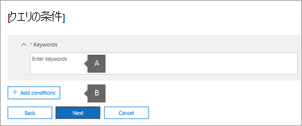

# <a name="create-an-ediscovery-hold"></a>電子情報開示保留リストを作成する

コア電子情報開示ケースを使用して保留リストを作成し、ケースに関連する可能性のあるコンテンツを保持できます。 ケースで調査しているユーザーの Exchange メールボックスと OneDrive for Business アカウントを保留にできます。 Microsoft Teams、Office 365 グループ、およびグループに関連付けられているメールボックスとサイトYammerすることもできます。 コンテンツの場所を保留にした場合、コンテンツの場所から保留を削除するか、保留を削除するまで、コンテンツは保持されます。

電子情報開示の保留リストを作成した後、保留が有効にな最大 24 時間かかる場合があります。 

保留リストを作成する場合、次のオプションを使用して、指定したコンテンツの場所に保持されているコンテンツの範囲を指定できます。
  
- 指定した場所のすべてのコンテンツを保持する無限ホールドを作成します。 または、検索クエリに一致する指定した場所のコンテンツのみを保持するクエリ ベースの保留リストを作成することもできます。

- 日付範囲を指定して、その日付範囲内で送信、受信、または作成されたコンテンツのみを保持できます。 または、送信、受信、または作成された時間に関係なく、指定した場所のすべてのコンテンツを保持できます。
  
## <a name="how-to-create-an-ediscovery-hold"></a>電子情報開示保留リストを作成する方法

コア電子情報開示ケースに関連付けられている電子情報開示ホールドを作成するには、次の方法を実行します。
  
1. 適切な [https://compliance.microsoft.com](https://compliance.microsoft.com) 電子情報開示のアクセス許可が割り当てられているユーザー アカウントの資格情報を使用して、アクセスしてサインインします。

2. Microsoft 365 コンプライアンス センターの左側のナビゲーション ウィンドウで、[すべて表示] をクリックし、[電子情報開示とコア>**します**。

3. [ **コア電子情報開示** ] ページで、保留リストを作成するケースを選択し、[ケースを開く] **をクリックします**。

4. ケースの **ホーム** ページで、[保留] タブ **をクリック** します。
  
5. [保留 **リスト] ページで、[** 作成] を **クリックします**。

6. [保留 **リストに名前を付け** ウィザード] ページで、保留リストに名前を付け、オプションの説明を追加し、[次へ] をクリック **します**。 ホールドの名前は組織内で一意である必要があります。

7. [ **コンテンツの場所] ページ** で、保留するコンテンツの場所を選択します。 メールボックス、サイト、パブリック フォルダーを保留にできます。

    
  
   1. **メールボックスの場所**- **[ユーザー** 、グループ、またはチームの選択] をクリックし、[ユーザー、グループ、またはチームの選択] を再度クリックして、保持するメールボックスを指定します。 検索ボックスを使用して、ユーザーのメールボックスと配布グループを検索し (グループ メンバーのメールボックスを保留にします)、保留にします。 Microsoft Team、Office 365 Group、または Yammer Group の関連メールボックスを保留にできます。 ユーザー、グループ、チームのチェック ボックスをオンにして、[選択 **]** をクリックし、[完了] をクリック **します**。

   1. **サイトの場所**- **[サイト** の選択] をクリックし、もう一度 [サイトの選択] をクリックして、保留にする SharePoint アカウントと OneDrive アカウントを指定します。 保留する各サイトの URL を入力します。 Microsoft Team、Office 365 グループ、または sharePoint グループの SharePoint サイトの URL Yammerすることもできます。 [選択 **] を** クリックし、[完了] を **クリックします**。
  
   1. **Exchange パブリック フォルダー。** トグル スイッチトグル コントロールを [すべて] の位置に移動して、Exchange Online 組織内のすべてのパブリック フォルダー  を保留にします。  特定のパブリック フォルダーを選択して保留にすることはできません。 パブリック フォルダーを保留にしない場合は、トグル スイッチを **[** なし] のままにします。

   > [!NOTE]
   > 少なくとも 1 つのコンテンツの場所を保留リストに追加する必要があります。 それ以外の場合、電子情報開示保留の静的なアイテムは保持されていないと表示されます。

8. 保留リストにコンテンツの場所を追加し終わったら、[**次へ**] をクリックします。

9. 条件を含むクエリ ベースの保留リストを作成するには、次の手順を実行します。 それ以外の場合は、指定したコンテンツの場所のすべてのコンテンツを保持するには、[次へ] をクリック **します**。

    
  
    1. [キーワード] **ボックスに** 検索クエリを入力し、検索条件を満たすコンテンツのみを保持します。 キーワード、電子メール メッセージのプロパティ、またはファイル名などのドキュメント プロパティを指定できます。 **AND、OR、NOT** などのブール演算子を使用する、より複雑なクエリを使用 **できます**。

    1. [ **条件の追加]** をクリックして 1 つ以上の条件を追加し、保留リストの検索クエリを絞り込む。 各条件は、保留リストの作成時に作成および実行される KQL 検索クエリに句を追加します。 たとえば、日付範囲を指定して、指定した日付内に作成された電子メールまたはサイト ドキュメントを保留にできます。 条件は **、AND** 演算子によってキーワード クエリ ([キーワード] ボックスで指定) に論理的に接続されます。 つまり、アイテムはキーワード クエリと条件の両方を満たす必要があります。

    検索クエリの作成と条件の使用の詳細については、「[コンテンツ検索のキーワード クエリと検索条件](keyword-queries-and-search-conditions.md)」を参照してください。

10. クエリ ベースの保留リストを構成した後、[**次へ**] をクリックします。

11. 設定を確認し (必要に応じて編集)、[この保留リスト **の作成] をクリックします**。

## <a name="query-based-holds-placed-on-site-documents"></a>サイト ドキュメントに対するクエリ ベースの保留

SharePoint サイトにあるドキュメントにクエリ ベースの電子情報開示ホールドを設定する場合は、次の点に注意してください。

- クエリベースの保留は、最初は削除された後、サイト内のすべてのドキュメントを短時間保持します。 つまり、ドキュメントが削除された場合、クエリ ベースの保留の条件と一致しない場合でも、ドキュメントはアイテム保持ライブラリに移動されます。 ただし、クエリ ベースの保留と一致しない削除済みドキュメントは、アイテム保持ライブラリを処理するタイマー ジョブによって削除されます。 タイマー ジョブは定期的に実行され、アイテム保管ライブラリ内のすべてのドキュメントをクエリ ベースの電子情報開示保留リスト (および他の種類の保留リストおよびアイテム保持ポリシー) と比較します。 タイマー ジョブは、クエリ ベースの保留リストに一致しないドキュメントを削除し、実行するドキュメントを保持します。

- クエリ ベースの保留は、特定のフォルダーまたはサイト内のドキュメントを保持したり、他の場所に基づく保持条件を使用したりして、ターゲット保持を実行するために使用することはできません。 そうすると、意図しない結果が発生する可能性があります。 サイト ドキュメントを保持するには、キーワード、日付範囲、その他のドキュメント プロパティなどの場所に基づく保持条件を使用することをお勧めします。

## <a name="ediscovery-hold-statistics"></a>電子情報開示保留の統計情報

電子情報開示の保留リストを作成すると、選択した保留リストのフライアウト ページに新しい保留リストに関する情報が表示されます。 この情報には、保留にされたメールボックスとサイトの数、保留にされたコンテンツに関する統計情報 (保留にされたアイテムの総数とサイズ、保留の統計情報が最後に計算された時刻など) が含まれます。 これらの保留の統計情報は、ケースに関連するコンテンツが保持されている量を特定するのに役立ちます。
  

  
電子情報開示保留の統計情報については、次のことを念頭に置いておきます。
  
- 保留にされているアイテムの合計数は、すべてのコンテンツ ソースのうち、保留にされているアイテム数を示します。クエリベースの保留リストを作成した場合、この統計情報は、クエリに一致するアイテム数を示します。

- 保持されているアイテムの数には、コンテンツの場所で見つかったインデックスのないアイテムも含まれます。 クエリ ベースの保留リストを作成すると、コンテンツの場所内のすべてのインデックスのないアイテムが保持されます。 これには、クエリ ベースの保留リストの検索条件と一致しないインデックスのないアイテムと、日付範囲の条件の外に入る可能性があるインデックスのないアイテムが含まれます。 これは、検索クエリに一致しない、または日付範囲条件によって除外されたインデックスのないアイテムが検索結果に含まれていない検索を実行する場合とは異なります。 インデックスのないアイテムの詳細については、「部分的にインデックスが作成されたアイテム [」を参照してください](partially-indexed-items-in-content-search.md)。

- 最新の保留リストの統計情報を取得するには、[統計情報の更新] をクリックして、保留リストの現在のアイテム数を計算する検索見積もりを再実行します。

- 通常、メールボックスまたはサイトが保持されているユーザーは、新しい電子メール メッセージを送受信し、SharePoint と OneDrive で新しいドキュメントを作成する場合が多いので、保持されているアイテムの数は時間の長い間増加します。

- Exchange メールボックス、SharePoint サイト、または OneDrive アカウントが複数地域環境内の別の地域に移動された場合、そのサイトの統計情報は保留の統計情報に含まれません。 ただし、これらの場所のコンテンツは引き続き保持されます。 また、メールボックスまたはサイトが別の地域に移動された場合、ホールドに表示される SMTP アドレスまたは URL は自動的には更新されません。 保留リストを編集して URL または SMTP アドレスを更新し、コンテンツの場所が保留リストの統計情報にもう一度含まれる必要があります。

## <a name="search-locations-on-ediscovery-hold"></a>電子情報開示保留の検索場所

コア電子 [情報開示](search-for-content-in-core-ediscovery.md) ケースでコンテンツを検索する場合、ケースに関連付けられた保留にされているコンテンツの場所のみを検索する検索をすばやく構成できます。


保留に **されているコンテンツの場所** を検索するには、[保留の場所] オプションを選択します。 ケースに複数の電子情報開示ホールドが含まれている場合、このオプションを選択すると、すべての保留リストのコンテンツの場所が検索されます。 さらに、コンテンツの場所がクエリ ベースの保留リストに設定されている場合、検索を実行すると、保留クエリに一致するアイテムだけが検索されます。 つまり、保持条件と検索条件の両方に一致するコンテンツだけが検索結果と共に返されます。 たとえば、特定の日付より前に送信または作成されたアイテムを保持するクエリ ベースのケース保持をユーザーが実行した場合、それらのアイテムだけが検索されます。 これを行うには、ケース保持クエリと検索クエリを AND 演算子で **接続** します。

電子情報開示保留の場所を検索する際に注意する必要があるその他の情報を次に示します。

- コンテンツの場所が同じケース内の複数の保留の一部である場合、すべてのケースのコンテンツ オプションを使用してそのコンテンツの場所を検索すると、保留クエリが **OR** 演算子によって結合されます。 同様に、コンテンツの場所が 2 つの異なる保留リストの一部であり、一方がクエリ ベースで、もう一方が無限保留 (すべてのコンテンツが保持されている) の場合、すべてのコンテンツは無限保持のために検索されます。

- 検索が保留の場所を検索するように構成されている場合、ケースで電子情報開示の保留を変更すると (場所を追加または削除したり、保留クエリを変更したりすることによって)、検索構成がそれらの変更で更新されます。 ただし、検索結果を更新するには、保留が変更された後で検索を再実行する必要があります。

- 電子情報開示ケース内の 1 つの場所に複数の電子情報開示ホールドが設定され、保留の場所を検索する場合、その検索クエリのキーワードの最大数は 500 です。 これは、検索が OR 演算子を使用してすべてのクエリ ベースの保留を組み合わせた **ため** です。 結合された保留クエリと検索クエリに 500 を超えるキーワードがある場合は、クエリ ベースのケースに一致するコンテンツではなく、メールボックス内のすべてのコンテンツが検索されます。

- 電子情報開示の保留リストの状態が **[オン**] になっている場合でも、保留が有効になっている間は、保持されている場所を検索できます。

## <a name="preserve-content-in-microsoft-teams"></a>Microsoft Teams のコンテンツを保持する

Microsoft Teams チャネルの一部である会話は、Microsoft チームに関連付けられているメールボックスに保存されます。 同様に、メンバーがチャネルで共有するファイルは、チームの SharePoint サイトに保存されます。 そのため、チャネル内の会話とファイルを保持するには、チーム メールボックスと SharePoint サイトを電子情報開示ホールドに配置する必要があります。

または、Teams のチャット リストの一部である会話 *(1 対 1* のチャットまたは *1:N* のグループ チャットと呼ばれる) は、チャットに参加するユーザーのメールボックスに保存されます。 また、ユーザーがチャットの会話で共有するファイルは、ファイルを共有するユーザーの OneDrive アカウントに保存されます。 そのため、チャット リスト内の会話とファイルを保持するには、個々のユーザー メールボックスと OneDrive アカウントを電子情報開示ホールドに追加する必要があります。 チーム のメールボックスとサイトを保持に加えて、Microsoft Team のメンバーのメールボックスを保留に設定すると良い方法です。

2020 年 2 月から、プライベート チャネルのコンテンツを保持する機能を有効にしました。 プライベート チャネル チャットはチャット参加者のメールボックスに保存されます。電子情報開示の保留リストにユーザー メールボックスを配置すると、プライベート チャネル チャットが保持されます。 また、ユーザーのメールボックスが 2020 年 2 月より前に電子情報開示の保留にされた場合、そのメールボックスに保存されているプライベート チャネル メッセージにホールドが自動的に適用されます。 プライベート チャネルで共有されているファイルの保持もサポートされています。

Teams コンテンツの保持の詳細については [、「Microsoft Teams](https://docs.microsoft.com/MicrosoftTeams/legal-hold)ユーザーまたはチームを法的情報保留にする」を参照してください。
    
> [!IMPORTANT]
> クラウドベースの組織では、Teams のチャット リストの一部である会話に参加するユーザーは、メールボックスが電子情報開示保留にされているときにチャットの会話を保持するために Exchange Online メールボックスを持っている必要があります。 これは、チャット リストの一部である会話が、チャット参加者のクラウドベースのメールボックスに格納されるためです。 チャット参加者が Exchange Online メールボックスを持たなかった場合、それらのチャットの会話を保持することはできません。 たとえば、Exchange ハイブリッド展開では、オンプレミスのメールボックスを持つユーザーは、Teams のチャット リストの一部である会話に参加できる場合があります。 ただし、この場合、これらの会話のコンテンツは保持できません。これらのユーザーは、保留にできるクラウドベースのメールボックスを持たないのでです。
  
すべてのチームまたはチーム チャネルには、メモとコラボレーション用の Wiki も含まれている。 Wiki コンテンツは、.mht 形式のファイルに自動的に保存されます。 このファイルは、チームの SharePoint サイトの Teams Wiki データ ドキュメント ライブラリに保存されます。 チームの SharePoint サイトを電子情報開示保留リストに追加することで、Wiki コンテンツを保持できます。

> [!NOTE]
> チームまたはチーム チャネルの Wiki コンテンツを保持する機能 (チームの SharePoint サイトを保留にした場合) は、2017 年 6 月 22 日にリリースされました。 チーム サイトが保留の場合、Wiki コンテンツは、その日付から保持されます。 ただし、チーム サイトが保留状態で、2017 年 6 月 22 日より前に Wiki コンテンツが削除された場合、Wiki コンテンツは保持されません。

### <a name="office-365-groups"></a>Office 365 グループ

Teams は、365 グループOffice基に構築されています。 したがって、電子情報開示Office 365 グループを保留に設定するのと同様に、Teams のコンテンツを保留にできます。

Teams と 365 グループの両方を電子情報開示の保留Office次の点に注意してください。

- 前に説明したように、Teams および Office 365 グループにあるコンテンツを保持するには、グループまたはチームに関連付けられているメールボックスと SharePoint サイトを指定する必要があります。

- [Exchange Online PowerShell](https://docs.microsoft.com/powershell/exchange/connect-to-exchange-online-powershell) **で Get-UnifiedGroup** コマンドレットを実行して、Teams および Office 365 グループのプロパティを表示します。 これは、チームまたは 365 グループに関連付けられているサイトの URL を取得Office方法です。 たとえば、次のコマンドは、上級管理職チームという名前の Office 365 グループの選択されたプロパティを表示します。

    ```text
    Get-UnifiedGroup "Senior Leadership Team" | FL DisplayName,Alias,PrimarySmtpAddress,SharePointSiteUrl

    DisplayName            : Senior Leadership Team
    Alias                  : seniorleadershipteam
    PrimarySmtpAddress     : seniorleadershipteam@contoso.onmicrosoft.com
    SharePointSiteUrl      : https://contoso.sharepoint.com/sites/seniorleadershipteam
    ```

    > [!NOTE]
    > **Get-UnifiedGroup** コマンドレットを実行するには、Exchange Online で View-Only Recipients という役割が割り当てられているか、View-Only Recipients という役割が割り当てられている役割グループに属している必要があります。 
  
- ユーザーのメールボックスが検索された場合、ユーザーがメンバー Officeチームまたはグループ 365 グループは検索されません。 同様に、チームまたは Office 365 グループを電子情報開示保留にした場合、グループ メールボックスとグループ サイトだけが保留にされます。 電子情報開示の保留リストに明示的に追加しない限り、グループ メンバーのメールボックスと OneDrive for Business サイトは保持されません。 そのため、法的な理由でチームまたは Office 365 グループを保持する必要がある場合は、チームまたはグループ メンバーのメールボックスと OneDrive アカウントを同じ保留リストに追加する必要があります。

- チームまたは Office 365 グループのメンバーの一覧を取得するには、Microsoft 365 管理センターの [グループ] ページでプロパティを表示できます。 または、Exchange Online PowerShell で次のコマンドを実行できます。

    ```powershell
    Get-UnifiedGroupLinks <group or team name> -LinkType Members | FL DisplayName,PrimarySmtpAddress
    ```

    > [!NOTE]
    > **Get-UnifiedGroupLinks** コマンドレットを実行するには、Exchange Online で View-Only Recipients という役割が割り当てられているか、View-Only Recipients という役割が割り当てられている役割グループに属している必要があります。

## <a name="onedrive-accounts"></a>OneDrive アカウント

組織内の OneDrive for Business サイトの URL の一覧を収集して、電子情報開示ケースに関連付けられている保留リストまたは検索に追加するには、「組織内のすべての [OneDrive](https://docs.microsoft.com/onedrive/list-onedrive-urls)の場所の一覧を作成する」を参照してください。 この記事のスクリプトは、組織内のすべての OneDrive サイトのリストを含むテキスト ファイルを作成します。 このスクリプトを実行するには、SharePoint Online 管理シェルをインストールして使用する必要があります。 検索する各 OneDrive サイトに組織の個人用サイト ドメインの URL を必ず追加してください。 これは、すべての OneDrive を含むドメインです。例: `https://contoso-my.sharepoint.com` ユーザーの OneDrive サイトの URL の例は次のとおりです。`https://contoso-my.sharepoint.com/personal/sarad_contoso_onmicrosoft.com`

> [!IMPORTANT]
> ユーザーの OneDrive アカウントの URL には、ユーザー プリンシパル名 (UPN) (たとえば) が含まれます `https://alpinehouse-my.sharepoint.com/personal/sarad_alpinehouse_onmicrosoft_com` 。 まれに、ユーザーの UPN が変更された場合、その OneDrive URL も新しい UPN を組み込む方法に変更されます。 ユーザーの OneDrive アカウントが電子情報開示ホールドの一部であり、古いアカウントの UPN が変更されている場合は、保留を更新する必要があります。保留リストを更新して、ユーザーの新しい OneDrive URL を追加し、古い OneDrive URL を削除する必要があります。 詳細については、「[UPN の変更による OneDrive URL への影響](https://docs.microsoft.com/onedrive/upn-changes)」をご覧ください。

## <a name="removing-content-locations-from-an-ediscovery-hold"></a>電子情報開示の保留リストからコンテンツの場所を削除する

メールボックス、SharePoint サイト、または OneDrive アカウントを電子情報開示の保留リストから削除すると、遅延 *ホールドが* 適用されます。 つまり、コンテンツの場所からデータが完全に削除 (パージ) されるのを防ぐため、保留の実際の削除は 30 日間延期されます。 これにより、管理者は電子情報開示の保留リストが削除された後に削除されるコンテンツを検索または復元できます。 メールボックスとサイトの遅延ホールドのしくみの詳細は異なります。

- **メールボックス:** 次に管理フォルダー アシスタントがメールボックスを処理し、電子情報開示ホールドが削除されたと検出すると、メールボックスに遅延ホールドが設定されます。 具体的には、管理フォルダー アシスタントが次のいずれかのメールボックス プロパティを True に設定すると、メールボックスに遅延ホールドが適用 **されます**。

   - **DelayHoldApplied:** このプロパティは、ユーザーのメールボックスに保存されているメール関連のコンテンツ (Outlook と Outlook on the web を使用しているユーザーによって生成される) に適用されます。

   - **DelayReleaseHoldApplied:** このプロパティは、ユーザーのメールボックスに保存されているクラウドベースのコンテンツ (Microsoft Teams、Microsoft Forms、Microsoft Yammer など、Outlook 以外のアプリによって生成される) に適用されます。 Microsoft アプリによって生成されるクラウド データは、通常、ユーザーのメールボックスの隠しフォルダーに格納されます。

   メールボックスに遅延ホールドが設定されている場合 (前のプロパティのどちらかが **True** に設定されている場合)、メールボックスは、メールボックスが訴訟ホールドの対象である場合と同様に、保持期間が無制限であると見なされます。 30 日が経過すると、遅延ホールドの有効期限が切れ、Microsoft 365 は自動的に (DelayHoldApplied または DelayReleaseHoldApplied プロパティを **False** に設定して) 保留を削除し、保留が削除されます。 これらのプロパティのいずれかを **False** に設定すると、削除のマークが付いている対応するアイテムは、管理フォルダー アシスタントによって次回メールボックスが処理される時に削除されます。

   詳しくは、[メールボックスの管理についての詳細](identify-a-hold-on-an-exchange-online-mailbox.md#managing-mailboxes-on-delay-hold) をご覧ください。。

- **SharePoint サイトと OneDrive サイト:** アイテム保持ライブラリに保持されている SharePoint または OneDrive コンテンツは、サイトが電子情報開示の保留から削除された後、30 日間の遅延保持期間中に削除されません。 これは、サイトがアイテム保持ポリシーから解放された場合と同様です。 また、30 日間の遅延保持期間中は、アイテム保持ライブラリ内のこのコンテンツを手動で削除することはできません。 

   詳細については、「保持のための [ポリシーの解放」を参照してください](retention.md#releasing-a-policy-for-retention)。

コア電子情報開示ケースを閉じると、ケースが閉じると保留がオフになるので、コア電子情報開示ケースを閉じると、保留のコンテンツの場所にも遅延ホールドが適用されます。 ケースを閉じる方法の詳細については、「コア電子情報開示ケースを閉じる、再度開く、削除する [」を参照してください](close-reopen-delete-core-ediscovery-cases.md)。

## <a name="ediscovery-hold-limits"></a>電子情報開示の保留の制限

次の表に、電子情報開示ケースとケース保持の制限を示します。

  | 制限の説明 | 極限 |
  |:-----|:-----|
  |組織のケースの最大数  <br/> |制限なし  <br/> |
  |組織の電子情報開示保留リストの最大数  <br/> |10,000  <br/> |
  |1 つの電子情報開示ホールド内のメールボックスの最大数  <br/> |1,000  <br/> |
  |1 つの電子情報開示ホールド内の SharePoint サイトと OneDrive for Business サイトの最大数  <br/> |100  <br/> |
  |電子情報開示ホーム ページに表示されるケースの最大数と、ケース内の [保留リスト]、[検索]、および [エクスポート] タブに表示されるアイテムの最大数。 <sup>1</sup> |1,000|
  |||

   > [!NOTE]
   > <sup>1</sup> 1,000 件を超えるケース、保留、検索、またはエクスポートの一覧を表示するには、対応する Office 365 Security & Compliance PowerShell コマンドレットを使用できます。
   >
   > - [Get-ComplianceCase](https://docs.microsoft.com/powershell/module/exchange/get-compliancecase)
   > - [Get-CaseHoldPolicy](https://docs.microsoft.com/powershell/module/exchange/get-caseholdpolicy)
   > - [Get-ComplianceSearch](https://docs.microsoft.com/powershell/module/exchange/get-compliancesearch)
   > - [Get-ComplianceSearchAction](https://docs.microsoft.com/powershell/module/exchange/get-compliancesearchaction)
