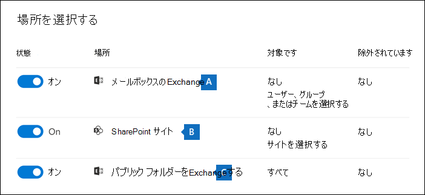

# <a name="create-an-ediscovery-hold"></a>電子情報開示保留リストを作成する

コア電子情報開示ケースを使用してホールドを作成し、ケースに関連する可能性のあるコンテンツを保持できます。 ケースで調査しているユーザー ExchangeアカウントOneDrive for Businessを保留にできます。 また、グループ、グループ、およびグループに関連付けられているメールボックスMicrosoft TeamsサイトOffice 365保持Yammerできます。 コンテンツの場所を保留に設定すると、保留リストからコンテンツの場所を削除するか、保留を削除するまで、コンテンツは保持されます。

電子情報開示の保持を作成した後、保留が有効になって最大 24 時間かかる場合があります。

保留リストを作成する場合は、指定したコンテンツの場所に保持されているコンテンツの範囲を指定する次のオプションがあります。
  
- 指定した場所のすべてのコンテンツが保留状態に置かれる無限保持を作成します。 または、検索クエリに一致する指定した場所のコンテンツだけが保留にされるクエリ ベースの保留リストを作成することもできます。

- 日付範囲を指定して、その日付範囲内で送信、受信、または作成されたコンテンツのみを保持します。 または、送信、受信、または作成の時間に関係なく、指定した場所ですべてのコンテンツを保持できます。
  
## <a name="how-to-create-an-ediscovery-hold"></a>電子情報開示ホールドを作成する方法

コア電子情報開示ケースに関連付けられた電子情報開示ホールドを作成するには、次の方法を実行します。
  
1. [電子<a href="https://go.microsoft.com/fwlink/p/?linkid=2077149" target="_blank">情報開示Microsoft 365 コンプライアンス センター</a>に移動し、適切な電子情報開示アクセス許可が割り当てられているユーザー アカウントの資格情報を使用してサインインします。

2. 左側のナビゲーション ウィンドウで、[すべて表示] **を** クリックし、[電子情報開示] > **クリックします**。

3. [コア **電子情報開示]** ページで、保留リストを作成するケースの名前をクリックします。

4. ケースの [**ホーム**] ページで、[**保留**] タブをクリックします。
  
5. [保持] **ページで** 、[作成] を **クリックします**。

6. [保持 **ウィザードに名前を付** け] ページで、保留リストに名前を付け、オプションの説明を追加し、[次へ] をクリック **します**。 ホールドの名前は組織内で一意である必要があります。

7. [場所 **の選択] ウィザード** ページで、保留にするコンテンツの場所を選択します。 メールボックス、サイト、およびパブリック フォルダーを保留にすることができます。

    
  
   1. **Exchange メールボックス**: トグルを **On** に設定し、[**ユーザー、グループ、またはチーム** の選択] をクリックして、ホールドするメールボックスを指定します。 検索ボックスを使用して、ユーザーのメールボックス、および配布グループ (グループ メンバーのメールボックスにホールドを適用するため) を検索し、ホールドを適用します。 また、Microsoft チーム、グループ、およびグループの関連付けられたメールボックスOffice 365保持Yammerできます。 メールボックスを保留にするときに保持されるアプリケーション データの詳細については、「電子情報開示用メールボックスに格納されているコンテンツ [」を参照してください](what-is-stored-in-exo-mailbox.md)。

   2. **SharePoint サイト**: トグルを **On** に設定し、[**サイトの選択]** をクリックして、ホールドする SharePoint サイトと OneDrive アカウントを指定します。 ホールドを適用する各サイトの URL を入力します。 Microsoft Team、SharePointグループ、またはグループのサイトの URL をOffice 365することもできますYammerできます。
  
   3. **Exchange パブリック フォルダー**: [**オン**] に切り替えて、Exchange Online 組織のすべてのパブリック フォルダーをホールドにします。ただし、ホールドにする特定のパブリック フォルダーを選ぶことはできません。パブリック フォルダーを保留にしない場合は、切り替えスイッチをオフのままにしておきます。

   > [!IMPORTANT]
   > メールボックスまたはExchangeサイトSharePointを保留リストに追加する場合は、少なくとも 1 つのコンテンツの場所を明示的に保留リストに追加する必要があります。 つまり、メールボックスまたはサイトのトグルを **[オン** ] に設定した場合は、保留リストに追加する特定のメールボックスまたはサイトを選択する必要があります。 それ以外の場合、電子情報開示ホールドは作成されますが、メールボックスやサイトは保留リストに追加されません。また、コンテンツの場所やアイテムが保持されていないという統計情報が表示されます。

8. 保留リストへの場所の追加が完了したら、[次へ] を **クリックします**。

9. キーワードまたは条件を使用してクエリ ベースの保持を作成するには、次の手順を実行します。 指定したコンテンツの場所のすべてのコンテンツを保持するには、[次へ] を **クリックします**。

    
  
    1. [キーワード] の **下のボックス** に、クエリ条件に一致するコンテンツのみを保持するクエリを入力します。 キーワード、電子メール メッセージのプロパティ、またはファイル名などのサイト のプロパティを指定できます。 AND、OR、NOT などのブール演算子を使用する、より複雑な **クエリを** 使用 **できます**。

    2. [ **条件の追加]** をクリックして 1 つ以上の条件を追加し、保留のクエリを絞り込む。 各条件は、保留リストの作成時に作成および実行される KQL 検索クエリに句を追加します。 たとえば、日付範囲を指定して、指定した日付範囲内に作成された電子メールまたはサイト ドキュメントが保持されます。 条件は、キーワード クエリ ([キーワード] ボックスで指定) に論理的に接続され、AND 演算子によってその他の条件 **に接続** されます。 つまり、アイテムはキーワード クエリと保持する条件の両方を満たす必要があります。

    検索クエリの作成と条件の使用の詳細については、「電子情報開示のキーワード クエリと [検索条件」を参照してください](keyword-queries-and-search-conditions.md)。

10. クエリ ベースの保留リストを構成した後、[**次へ**] をクリックします。

11. 設定を確認し (必要に応じて編集)、[送信] をクリック **します**。

## <a name="query-based-holds-placed-on-sites"></a>サイトに配置されたクエリ ベースの保持

クエリ ベースの電子情報開示ホールドをサイト内にあるドキュメントに保持する場合は、次のSharePointしてください。

- クエリ ベースの保留リストは、最初はサイト内のすべてのドキュメントを削除後、短時間保持します。 つまり、ドキュメントが削除された場合、クエリ ベースの保持の条件と一致しない場合でも、保持ライブラリに移動されます。 ただし、クエリ ベースの保留と一致しない削除されたドキュメントは、保持ライブラリを処理するタイマー ジョブによって削除されます。 タイマー ジョブは定期的に実行され、保持ライブラリ内のすべてのドキュメントとクエリ ベースの電子情報開示ホールド (および他の種類の保留と保持ポリシー) を比較します。 タイマー ジョブは、クエリ ベースの保留と一致しないドキュメントを削除し、実行するドキュメントを保持します。

- クエリ ベースの保持は、特定のフォルダーまたはサイト内のドキュメントの保存や、他の場所に基づく保持条件の使用など、対象の保存を実行するために使用する必要があります。 これにより、意図しない結果が発生する可能性があります。 サイト ドキュメントを保持するには、キーワード、日付範囲、その他のドキュメント プロパティなどの場所ベース以外の保持条件を使用することをお勧めします。

## <a name="ediscovery-hold-statistics"></a>電子情報開示ホールドの統計情報

電子情報開示ホールドを作成すると、選択した保留リストのフライアウト ページに新しいホールドに関する情報が表示されます。 この情報には、保持中のメールボックスとサイトの数、保留にされたコンテンツに関する統計 (保留にされたアイテムの総数とサイズ、最後に保留統計が計算された時間など) が含まれます。 これらの保留統計は、ケースに関連するコンテンツが保持されている量を識別するのに役立ちます。
  

  
電子情報開示ホールドの統計情報については、次のことを念頭に置いておきます。
  
- 保留にされているアイテムの合計数は、すべてのコンテンツ ソースのうち、保留にされているアイテム数を示します。クエリベースの保留リストを作成した場合、この統計情報は、クエリに一致するアイテム数を示します。

- 保持されているアイテムの数には、コンテンツの場所で見つかったインデックスのないアイテムも含まれます。 クエリ ベースの保留リストを作成すると、コンテンツの場所のすべてのインデックスのないアイテムが保留されます。 これには、クエリ ベースのホールドの検索条件と一致しないインデックスのないアイテムや、日付範囲の条件を外れる可能性があるインデックスのないアイテムが含まれます。 これは、検索クエリと一致しない、または日付範囲条件によって除外されるインデックスのないアイテムが検索結果に含まれていない検索を実行するときに発生する処理とは異なります。 インデックスが作成されていないアイテムの詳細については、「部分的にインデックス付 [きアイテム」を参照してください](partially-indexed-items-in-content-search.md)。

- [統計の更新] をクリックして、現在の保留項目数を計算する検索見積もりを再実行することで、最新の保留統計を取得できます。

- 通常、メールボックスまたはサイトが保留状態のユーザーは新しい電子メール メッセージを送受信し、SharePoint と OneDrive で新しいドキュメントを作成します。

- Exchange メールボックス、SharePoint サイト、または OneDrive アカウントが複数地域環境内の別の地域に移動された場合、そのサイトの統計情報は保持統計に含まれません。 ただし、これらの場所のコンテンツは引き続き保持されます。 また、メールボックスまたはサイトを別の地域に移動しても、保留リストに表示される SMTP アドレスまたは URL は自動的には更新されません。 保留リストを編集して URL または SMTP アドレスを更新して、コンテンツの場所が保留の統計情報に再び含まれる

## <a name="search-locations-on-ediscovery-hold"></a>電子情報開示ホールドの検索場所

コア電子 [情報開示ケース](search-for-content-in-core-ediscovery.md) でコンテンツを検索する場合、ケースに関連付けられた保留に置かれたコンテンツの場所のみを検索する検索をすばやく構成できます。

保留に **設定されているコンテンツの** 場所を検索するには、[保留の場所] オプションを選択します。 ケースに複数の電子情報開示ホールドが含まれている場合、このオプションを選択すると、すべての保留リストのコンテンツの場所が検索されます。 さらに、コンテンツの場所がクエリ ベースの保留リストに配置された場合は、検索の実行時に保留クエリに一致するアイテムだけが検索されます。 つまり、保持条件と検索条件の両方に一致するコンテンツだけが検索結果と共に返されます。 たとえば、特定の日付より前に送信または作成されたアイテムを保持するクエリ ベースのケース ホールドにユーザーが配置された場合、それらのアイテムだけが検索されます。 これは、ケースホールド クエリと検索クエリを AND 演算子で接続することで **実現** されます。

電子情報開示ホールドで場所を検索する際に注意する必要があるその他の情報を次に示します。

- コンテンツの場所が同じケース内の複数のホールドの一部である場合、すべてのケース コンテンツ オプションを使用してコンテンツの場所を検索すると、保留クエリは **OR** 演算子によって結合されます。 同様に、コンテンツの場所が 2 つの異なるホールドの一部であり、1 つはクエリ ベースで、もう 1 つは無限ホールド (すべてのコンテンツが保留されている場合) の場合、無限保持のためにすべてのコンテンツが検索されます。

- 検索が保留の場所を検索するように構成されている場合、ケース内の電子情報開示保留リストを変更します (場所の追加または削除、または保留クエリの変更によって)、検索構成はそれらの変更で更新されます。 ただし、検索結果を更新するには、保留が変更された後で検索を再実行する必要があります。

- 電子情報開示ケース内の 1 つの場所に複数の電子情報開示ホールドが配置され、保持されている場所を検索する場合、その検索クエリのキーワードの最大数は 500 です。 これは、OR 演算子を使用してすべてのクエリ ベースの保持を結合する **検索のため** です。 結合されたホールド クエリと検索クエリに 500 を超えるキーワードがある場合、クエリ ベースのケースに一致するコンテンツが保持されるのではなく、メールボックス内のすべてのコンテンツが検索されます。

- 電子情報開示ホールドの状態が **On (Pending)** の場合でも、保留が有効になっている間は、保留中の場所を検索できます。

## <a name="preserve-content-in-microsoft-teams"></a>コンテンツを保持Microsoft Teams

チャネルに含Microsoft Teams会話は、Microsoft チームに関連付けられているメールボックスに格納されます。 同様に、メンバーがチャネルで共有するファイルは、チームの SharePoint サイトに保存されます。 したがって、チャネル内の会話とファイルを保持するには、チーム メールボックスSharePointサイトを電子情報開示ホールドに配置する必要があります。

または、Teams のチャット リストの一部である会話 (*1:1* チャットまたは *1:N* グループ チャットと呼ばれる) は、チャットに参加するユーザーのメールボックスに格納されます。 また、ユーザーがチャット会話で共有するファイルは、OneDrive共有するユーザーのアカウントに保存されます。 したがって、チャット リスト内の会話とファイルを保持するには、個々のユーザー メールボックスOneDriveアカウントを電子情報開示ホールドに追加する必要があります。 チーム メールボックスとサイトを保留にしただけでなく、Microsoft チームのメンバーのメールボックスを保留に設定すると良い考えです。

> [!NOTE]
> 組織に Exchange ハイブリッド展開がある場合 (または組織が Office 365 とオンプレミスの Exchange 組織を同期している) Microsoft Teams を有効にしている場合、オンプレミスユーザーは Teams チャット アプリケーションを使用し、1:1 チャットと 1:N グループ チャットに参加できます。 これらの会話は、オンプレミスユーザーに関連付けられたクラウドベースのストレージに格納されます。 オンプレミスのユーザーが電子情報開示ホールドに置かれた場合、Teamsのチャット コンテンツは保持されます。 詳細については、「[PowerShell を使用してオンプレミス ユーザーの Teams チャット データを検索する](search-cloud-based-mailboxes-for-on-premises-users.md)」を参照してください。

コンテンツの保持の詳細については、「Teamsユーザーまたはチームを法的に保持Microsoft Teams[を配置する」を参照してください](/MicrosoftTeams/legal-hold)。

### <a name="preserve-card-content"></a>カードのコンテンツを保持する

同様に、Teams チャネル、1:1 チャット、および 1:N グループ チャットのアプリによって生成されたカード コンテンツはメールボックスに格納され、メールボックスが電子情報開示ホールドに置かれると保持されます。 *カード* とは、短いコンテンツを対象とした UI コンテナです。 カードには複数のプロパティと添付ファイルを含め、カードアクションをトリガーするボタンを含めることができます。 詳細については、「カード」を [参照してください](/microsoftteams/platform/task-modules-and-cards/what-are-cards)。 他の Teams のコンテンツと同様に、カードのコンテンツが保存されている場所は、カードが使用された場所に基づいています。 Teams チャネルで使用したカードのコンテンツは、Teams グループのメールボックスに保存されます。 1:1 チャットおよび 1xN チャットのカード コンテンツは、チャット参加者のメールボックスに保存されます。

### <a name="preserve-meeting-and-call-information"></a>会議と通話の情報を保持する

会議チャネル内の会議と通話Teamsの概要情報は、会議または通話にダイヤルしたユーザーのメールボックスにも格納されます。 このコンテンツは、電子情報開示の保持がユーザー のメールボックスに配置されている場合にも保持されます。

### <a name="preserve-content-in-private-channels"></a>プライベート チャネルでコンテンツを保持する

2020 年 2 月から、プライベート チャネルでコンテンツを保持する機能も有効にしました。 プライベート チャネル チャットはチャット参加者のメールボックスに格納されるので、電子情報開示ホールドにユーザー メールボックスを配置すると、プライベート チャネル チャットが保持されます。 また、2020 年 2 月より前にユーザー メールボックスが電子情報開示ホールドに置かれた場合、そのメールボックスに保存されているプライベート チャネル メッセージに自動的に保留が適用されます。 プライベート チャネルで共有されるファイルの保持もサポートされています。

### <a name="preserve-wiki-content"></a>Wiki コンテンツを保持する

すべてのチームまたはチーム チャネルには、メモを取り込み、共同作業を行う Wiki も含まれている。 Wiki コンテンツは、.mht 形式のファイルに自動的に保存されます。 このファイルは、チームの SharePoint サイトの Teams Wiki データ ドキュメント ライブラリに保存されます。 チームのサイトを電子情報開示ホールドに追加することで、wiki SharePointを保持できます。

> [!NOTE]
> チームまたはチーム チャネルの Wiki コンテンツを保持する機能 (チームの SharePoint サイトを保留にした場合) は、2017 年 6 月 22 日にリリースされました。 チーム サイトが保留の場合、Wiki コンテンツは、その日付から保持されます。 ただし、チーム サイトが保留状態で、Wiki コンテンツが 2017 年 6 月 22 日より前に削除された場合、Wiki コンテンツは保持されません。

### <a name="office-365-groups"></a>Office 365 グループ

Teamsグループに基Office 365されます。 したがって、電子情報開示Office 365にグループを配置する方法は、コンテンツを保留Teams配置するのと似ています。

電子情報開示の保持にグループとグループの両方Teams Office 365に注意してください。

- 前に説明したように、Teams および Office 365 グループにあるコンテンツを保留にするには、グループまたはチームに関連付けられているメールボックスと SharePoint サイトを指定する必要があります。

- **PowerShell で Get-UnifiedGroup** コマンドレットを実行しExchange Online [グループ](/powershell/exchange/connect-to-exchange-online-powershell)のプロパティTeams表示Office 365します。 これは、チームまたはグループに関連付けられているサイトの URL を取得するOffice 365です。 たとえば、次のコマンドは、上級管理職チームという名前の Office 365 グループの選択されたプロパティを表示します。

    ```text
    Get-UnifiedGroup "Senior Leadership Team" | FL DisplayName,Alias,PrimarySmtpAddress,SharePointSiteUrl

    DisplayName            : Senior Leadership Team
    Alias                  : seniorleadershipteam
    PrimarySmtpAddress     : seniorleadershipteam@contoso.onmicrosoft.com
    SharePointSiteUrl      : https://contoso.sharepoint.com/sites/seniorleadershipteam
    ```

    > [!NOTE]
    > **Get-UnifiedGroup** コマンドレットを実行するには、Exchange Online で View-Only Recipients という役割が割り当てられているか、View-Only Recipients という役割が割り当てられている役割グループに属している必要があります。 
  
- ユーザーのメールボックスが検索された場合、ユーザーがOffice 365しているチームまたはグループは検索されません。 同様に、電子情報開示の保持にチーム または Office 365グループを配置すると、グループ メールボックスとグループ サイトだけが保留にされます。 グループ メンバーのメールボックスOneDrive for Businessサイトは、電子情報開示ホールドに明示的に追加しない限り、保持されません。 そのため、法的な理由でチームまたは Office 365 グループを保留にする必要がある場合は、チームまたはグループ メンバーのメールボックスと OneDrive アカウントを同じ保留に追加する必要があります。

- チームまたはグループのメンバーのリストを取得するには、Office 365の [グループ] ページでプロパティを表示Microsoft 365 管理センター。<a href="https://go.microsoft.com/fwlink/p/?linkid=2052855" target="_blank"></a> または、Exchange Online PowerShell で次のコマンドを実行できます。

    ```powershell
    Get-UnifiedGroupLinks <group or team name> -LinkType Members | FL DisplayName,PrimarySmtpAddress
    ```

    > [!NOTE]
    > **Get-UnifiedGroupLinks** コマンドレットを実行するには、Exchange Online で View-Only Recipients という役割が割り当てられているか、View-Only Recipients という役割が割り当てられている役割グループに属している必要があります。

## <a name="preserve-content-in-onedrive-accounts"></a>アカウントのコンテンツをOneDriveする

組織内の OneDrive for Business サイトの URL の一覧を収集して、電子情報開示ケースに関連付けられた保留リストまたは検索に追加するには、「組織内のすべての [OneDrive](/onedrive/list-onedrive-urls) 場所のリストを作成する」を参照してください。 この記事のスクリプトでは、組織内のすべてのサイトの一覧をOneDriveテキスト ファイルを作成します。 このスクリプトを実行するには、SharePoint Online 管理シェルをインストールして使用する必要があります。 検索する各 OneDrive サイトに組織の個人用サイト ドメインの URL を必ず追加してください。 これは、すべての OneDrive を含むドメインです。例: `https://contoso-my.sharepoint.com` ユーザーの OneDrive サイトの URL の例は次のとおりです。`https://contoso-my.sharepoint.com/personal/sarad_contoso_onmicrosoft.com`

> [!IMPORTANT]
> ユーザーのアカウントの URL には、OneDrive プリンシパル名 (UPN) (たとえば) が含まれます`https://alpinehouse-my.sharepoint.com/personal/sarad_alpinehouse_onmicrosoft_com`。 まれに、ユーザーの UPN が変更される場合は、新しい UPN を組み込むOneDrive URL も変更されます。 ユーザーの OneDrive アカウントが電子情報開示保留リストの一部であり、古いユーザーの UPN が変更されている場合は、保留リストを更新し、保持を更新し、ユーザーの新しい OneDrive URL を追加し、古いアカウントを削除する必要があります。 詳細については、「[UPN の変更による OneDrive URL への影響](/onedrive/upn-changes)」をご覧ください。

## <a name="removing-content-locations-from-an-ediscovery-hold"></a>電子情報開示ホールドからコンテンツの場所を削除する

メールボックス、SharePoint、OneDriveアカウントが電子情報開示ホールドから削除されると、遅延 *ホールドが* 適用されます。 つまり、コンテンツの場所からデータが完全に削除 (削除) されるのを防ぐために、保持の実際の削除が 30 日間遅れることを意味します。 これにより、管理者は電子情報開示ホールドが削除された後に削除されるコンテンツを検索または回復できます。 メールボックスとサイトの遅延ホールドのしくみの詳細は異なります。

- **メールボックス:** Managed Folder Assistant が次にメールボックスを処理し、電子情報開示ホールドが削除されたと検出すると、遅延ホールドがメールボックスに配置されます。 具体的には、Managed Folder Assistant が次のいずれかのメールボックス プロパティを True に設定すると、メールボックスに遅延ホールドが適用 **されます**。

   - **DelayHoldApplied:** このプロパティは、ユーザーのメールボックスに格納されているメール関連のコンテンツ (Outlook および Outlook on the web を使用して生成される) に適用されます。

   - **DelayReleaseHoldApplied:** このプロパティは、ユーザーのメールボックスに格納されているクラウドベースのコンテンツ (Microsoft Teams、Microsoft Forms、Microsoft Yammer などの Outlook 以外のアプリによって生成される) に適用されます。 Microsoft アプリによって生成されるクラウド データは、通常、ユーザーのメールボックス内の非表示のフォルダーに格納されます。

   メールボックスに遅延ホールドが設定されている場合 (前のプロパティのどちらかが **True** に設定されている場合)、メールボックスが訴訟ホールドの場合と同様に、メールボックスは保持期間が無制限であると見なされます。 30 日が経過すると、遅延ホールドの有効期限が切れ、Microsoft 365 は自動的に遅延ホールドの削除を試行します (DelayHoldApplied プロパティまたは DelayReleaseHoldApplied プロパティを **False** に設定して)、保留が削除されます。 これらのプロパティのいずれかを **False** に設定すると、削除のマークが付いた対応するアイテムは、次に管理フォルダー アシスタントによってメールボックスが処理された場合に削除されます。

   詳しくは、[メールボックスの管理についての詳細](identify-a-hold-on-an-exchange-online-mailbox.md#managing-mailboxes-on-delay-hold) をご覧ください。。

- **SharePoint** サイトと OneDrive サイト: 保持ライブラリに保持されている SharePoint または OneDrive コンテンツは、サイトが電子情報開示ホールドから削除された後の 30 日間の遅延ホールド期間中は削除されません。 これは、サイトがアイテム保持ポリシーから解放された場合と似ています。 さらに、30 日間の遅延ホールド期間中は、保持ライブラリでこのコンテンツを手動で削除することはできません。 

   詳細については、「保持のための [ポリシーの解放」を参照してください](retention.md#releasing-a-policy-for-retention)。

サポート案件を閉じると保留がオフになるので、Core 電子情報開示ケースを閉じると、保留状態のコンテンツの場所にも遅延ホールドが適用されます。 ケースを閉じる方法の詳細については、「Core 電子情報開示ケースを閉じる、再度開く、 [削除する」を参照してください](close-reopen-delete-core-ediscovery-cases.md)。

## <a name="ediscovery-hold-limits"></a>電子情報開示ホールドの制限

次の表に、電子情報開示ケースとケースホールドの制限を示します。

  | 制限の説明 | 極限 |
  |:-----|:-----|
  |組織のケースの最大数。  <br/> |制限なし  <br/> |
  |組織の電子情報開示ホールド ポリシーの最大数。 この制限には、コア電子情報開示とサポート案件のホールド ポリシーの合計Advanced eDiscovery含まれます。  <br/> |10,000<sup>1</sup>  <br/> |
  |1 つの電子情報開示ホールド内のメールボックスの最大数。 この制限には、ユーザー メールボックスの合計と、グループ、グループ、およびグループに関連Microsoft 365メールボックスMicrosoft TeamsがYammerされます。  <br/> |1,000 人  <br/> |
  |1 つの電子情報開示ホールド内のサイトの最大数。 この制限には、OneDrive for Business サイト、SharePoint サイト、および Microsoft 365 グループ、Microsoft Teams、および Yammer グループに関連付けられたサイトの合計が含まれます。  <br/> |100  <br/> |
  |電子情報開示ホーム ページに表示されるケースの最大数と、ケース内の [保持] タブ、[検索] タブ、および [エクスポート] タブに表示されるアイテムの最大数。  |1,0002<sup></sup>|
  |||

   > [!NOTE]
   > <sup>1</sup> 1 回の保留ポリシーで 1,000 以上のメールボックスまたは 100 サイトを保留にした場合、システムは必要に応じて自動的に保留を拡大/縮小します。 つまり、システムはデータの場所を 1 つの保持ポリシーに追加するのではなく、複数の保留ポリシーに自動的に追加します。 ただし、組織ごとに 10,000 件のケース保持ポリシーの制限が適用されます。
   >
   > <sup>2</sup> 1,000 を超えるケース、ホールド、検索、またはエクスポートのリストを表示するには、対応するセキュリティ & コンプライアンス PowerShell コマンドレットを使用できます。
   >
   > - [Get-ComplianceCase](/powershell/module/exchange/get-compliancecase)
   > - [Get-CaseHoldPolicy](/powershell/module/exchange/get-caseholdpolicy)
   > - [Get-ComplianceSearch](/powershell/module/exchange/get-compliancesearch)
   > - [Get-ComplianceSearchAction](/powershell/module/exchange/get-compliancesearchaction)
