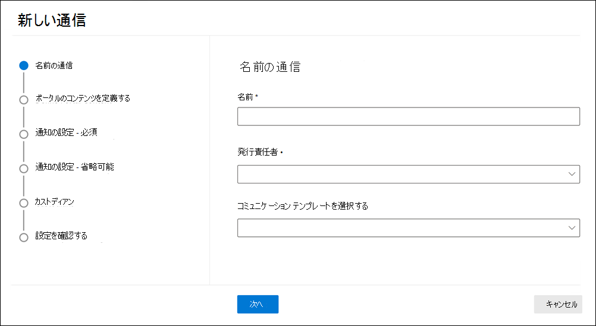

# 法的情報保留通知を作成するCreate a legal hold notice

Advanced eDiscovery 保管担当者 communications を使用すると、組織は保管担当者との通信に関するワークフローを管理できます。Using Advanced eDiscovery custodian communications, organizations can manage their workflow around communicating with custodians. 法務部門は、コミュニケーションツールを使用して、法的情報保留通知の送信、収集、追跡を系統的に行うことができます。Through the Communications tool, legal teams can systematically send, collect, and track legal hold notifications. また、柔軟な作成プロセスでは、チームは、保留通知ワークフローと、保管担当者に送信される通知の内容をカスタマイズすることもできます。The flexible creation process also allows teams to customize the hold notification workflow and the content in the notices sent to custodians. 

この記事では、保留通知ワークフローの手順の概要を説明します。The article outlines the steps in the hold notification workflow.

## 手順 1: 通信の詳細を指定するStep 1: Specify communication details

最初の手順として、法的情報保留通知またはその他の保管担当者通信に関する適切な詳細を指定します。The first step is to specify the appropriate details for legal hold notices or other custodian communications.

1. [セキュリティ & コンプライアンスセンター] で、 **[電子情報開示 > Advanced ediscovery** ] に移動して、組織内のケースの一覧を表示します。In the Security & Compliance Center, go to **eDiscovery > Advanced eDiscovery** to display the list of cases in your organization.

2. ケースを選択し、[**通信**] タブをクリックして、[**新しい通信**] をクリックします。Select a case, click the **Communications** tab, and then click **New communication**.

3. [**名前の通信**] ページで、次の (必須) 通信の詳細を指定します。On the **Name communication** page, specify the following (required) communication details.

    - **Name**: これは通信の名前です。**Name**: This is the name for the communication.

    - **発行責任**者: ドロップダウンリストには、ケースメンバーの一覧が表示されます。**Issuing officer**: The dropdown list displays a list of case members. 保管担当者に送信される各通知は、指定された発行責任者の代理として送信されます。Each notice sent to custodians will be sent on behalf of the specified issuing officer.

4. **[次へ]** をクリックします。Click **Next**.

## 手順 2: ポータルコンテンツを定義するStep 2: Define the portal content

次に、保留通知のコンテンツを作成して追加することができます。Next, you can create and add the content of the hold notice. [**通信の作成**] ウィザードの [**ポータルコンテンツの定義**] ページで、保留通知の内容を指定します。On the **Define portal content** page in the **Create communication** wizard, specify the contents of the hold notice. このコンテンツは、発行、再発行、アラーム、エスカレーション通知に自動的に追加されます。This content will be automatically appended to the Issuance, Re-Issue, Reminder, and Escalation notices. さらに、このコンテンツは保管担当者のコンプライアンスポータルに表示されます。Additionally, this content will appear in the custodian's Compliance Portal. 

ポータルコンテンツを作成するには、次のようにします。To create the portal content:

1. ポータルコンテンツのテキストボックスに、保留通知を入力します (または、別のドキュメントに切り取り、貼り付けを行います)。Type (or cut and paste from another document) your hold notice in the textbox for the portal content. 

2. 通知に差し込み変数を挿入して、通知をカスタマイズし、保管担当者コンプライアンスポータルを共有します。Insert merge variables into your notice to customize the notice and share the Custodian Compliance Portal.

3. **[次へ]** をクリックします。Click **Next**.

  >[!Tip]
  >ポータルコンテンツのコンテンツと形式をカスタマイズする方法の詳細については、「 [Use The Communications Editor](using-communications-editor.md)」を参照してください。To learn more about how to can customize the content and format of the portal content, see [Use the Communications Editor](using-communications-editor.md).

## 手順 3: 必要な通知を設定するStep 3: Set the required notifications

保留通知の内容を定義した後、通知プロセスを送信および管理するためのワークフローを設定できます。After you've defined the contents of the hold notice, you can set up the workflows around sending and managing the notification process. 通知は、通知に送信される電子メールメッセージで、保管担当者を使用してフォローアップされます。Notifications are email messages that are sent to notify and follow up with custodians. 通信に追加されたすべての保管担当者は同じ通知を受け取ります。Every custodian added to the communication will receive the same notification. 

保留通知を設定して送信するには、発行、再発行、およびリリース通知を含める必要があります。To set up and send a hold notice, you must include Issuance, Re-Issuance, and Release notifications.

### 発行通知Issuance notification 

通信が作成されると、指定された発行責任者によって**発行通知**が開始されます。After the communication is created, the **Issuance Notification** is initiated by the specified Issuing Officer. 発行通知は、保管担当者に送信される最初の通信で、保持義務について通知します。The Issuance notification is the first communication sent to the custodian to inform them about their preservation obligations. 

発行通知を作成するには:To create an issuance notification:

1. [**発行**] タイルで、[**編集**] をクリックします。In the **Issuance** tile, click **Edit**.

2. 必要に応じて、[ **Cc** ] フィールドと [ **Bcc** ] フィールドにケースメンバーまたはスタッフを追加します。If necessary, add additional case members or staff to the **Cc** and **Bcc** fields. これらのフィールドに複数のユーザーを追加するには、電子メールアドレスをセミコロンで区切ります。To add multiple users to these fields, separate email addresses with a semi-colon.

3. 通知の**件名**を指定します (必須)。Specify the **Subject** for the notice (required).

4. 保管担当者に提供するコンテンツまたは追加の手順を指定します (必須)。Specify the contents or additional instructions that you would like to provide to the custodian (required). 手順2で定義したポータルコンテンツが、発行通知の最後に追加されます。The portal content you defined in Step 2 is added to the end of the issuance notice. 

5. [**保存**] をクリックします。Click **Save**.

### 再発行の通知Re-Issuance notification

ケースが進行するにつれて、保管担当者は、以前に指示されていたのとは別のデータを保持する必要がある場合があります。As the case progresses, custodians may be required to preserve additional or less data than was previously instructed. ポータルコンテンツを更新すると、再発行の通知が送信され、保持義務に関する変更について保管担当者に通知されます。After you update the portal content, the re-issuance notification is sent and alerts custodians about any changes to their preservation obligations.

再発行の通知を作成するには、次のようにします。To create a re-issuance notification:

1. [**再発行**] タイルで、[**編集**] をクリックします。In the **Reissue** tile, click **Edit**.

2. 必要に応じて、[ **Cc** ] フィールドと [ **Bcc** ] フィールドにケースメンバーまたはスタッフを追加します。If necessary, add additional case members or staff to the **Cc** and **Bcc** fields. これらのフィールドに複数のユーザーを追加するには、電子メールアドレスをセミコロンで区切ります。To add multiple users to these fields, separate email addresses with a semi-colon.

3. 通知の**件名**を指定します (必須)。Specify the **Subject** for the notice (required).

4. 保管担当者に提供するコンテンツまたは追加の手順を指定します (必須)。Specify the contents or additional instructions that you would like to provide to the custodian (required). 手順2で定義したポータルコンテンツが再発行通知の最後に追加されます。The portal content you defined in Step 2 is added to the end of the re-issuance notice.

5. [**保存**] をクリックします。Click **Save**.

> [!NOTE]
> ポータルコンテンツが変更された場合 (**通信の編集**ウィザードの [**ポータルコンテンツの定義**] ページで)、再発行の通知は、通知に割り当てられたすべての保管担当者に自動的に送信されます。If the portal content is modified (on the **Define Portal Content** page in the **Edit communication** wizard), the re-issuance notification will be automatically sent to all custodians assigned to the notice. 通知が送信されると、保管担当者は保留通知を再認識するように求められます。After the notification is sent, custodians will be asked to re-acknowledge their hold notice. 通知またはエスカレーションワークフローを設定している場合は、それらも再起動されます。If you have set up any reminder or escalation workflows, these will also re-start. その他のケース管理イベントが通信を開始する場合の詳細については、「[通知を](#events-that-trigger-notifications)発生させるイベント」を参照してください。For more information about what other case management events trigger communications, see [Events that trigger notifications](#events-that-trigger-notifications).

### リリース通知Release notification

問題が解決した場合や、保管担当者がコンテンツを保持する必要がなくなった場合は、ケースから保管担当者をリリースできます。After a matter is resolved or if a custodian is no longer subject to preserve content, you can release the custodian from a case. 保管担当者に以前に保留通知が発行されていた場合は、リリース通知を使用して、その義務から解放されたことを保管担当者に通知できます。If the custodian was previously issued a hold notice, the release notification can be used to alert custodians that they have been released from their obligation.

リリース通知を作成するには:To create a release notification: 

1. [**リリース**タイル] で、[**編集**] をクリックします。In the **Release** tile, click **Edit**.

2. 必要に応じて、[ **Cc** ] フィールドと [ **Bcc** ] フィールドにケースメンバーまたはスタッフを追加します。If necessary, add additional case members or staff to the **Cc** and **Bcc** fields. これらのフィールドに複数のユーザーを追加するには、電子メールアドレスをセミコロンで区切ります。To add multiple users to these fields, separate email addresses with a semi-colon.

3. 通知の**件名**を指定します (必須)。Specify the **Subject** for the notice (required).

4. 保管担当者に提供するコンテンツまたは追加の手順を指定します (必須)。Specify the contents or additional instructions that you would like to provide to the custodian (required).

5. [**保存**] をクリックして、次の手順に進みます。Click **Save** and go to the next step.

## オプション手順 4: オプションの通知を設定する(Optional) Step 4: Set the optional notifications

必要に応じて、自動化された通知およびエスカレーション通知を作成およびスケジュールすることによって、応答のない保管担当者をフォローアップするワークフローを簡略化できます。Optionally, you can simplify the workflow for following up with unresponsive custodians by creating and scheduling automated reminder and escalation notifications.

### リマインダーReminders

保留通知を送信した後は、アラームのワークフローを定義することによって、応答のない保管担当者でフォローアップできます。After you have sent a hold notification, you can follow up with unresponsive custodians by defining a reminder workflow.

アラームをスケジュールするにはTo schedule reminders:

1. [**通知**] タイルで、[**編集**] をクリックします。In the **Reminder** tile, click **Edit**.

2. **ステータス**切り替え (必須) をオンにして、**アラーム**ワークフローを有効にします。Enable the **Reminder** workflow by turning on the **Status** toggle (required).

3. 通知の**間隔 (日数)** を指定します (必須)。Specify the **Reminder interval (in days)** (required). これは、最初のアラーム通知とフォローアップリマインダー通知を送信するまでの日数です。This is the number of days to wait before sending the first and follow-up reminder notifications. たとえば、通知の間隔を7日に設定した場合、最初の通知は、保留通知が最初に発行されてから7日後に送信されます。For example, if you set the reminder interval to seven days, then the first reminder would be sent seven days after the hold notification was initially issued. 以降のすべてのアラームも7日ごとに送信されます。All subsequent reminders would also be sent every seven days.

4. **アラームの数**を指定します (必須)。Specify the **Number of reminders** (required). このフィールドは、応答しない保管担当者に送信するアラームの数を指定します。This field specifies how many reminders to send to unresponsive custodians. たとえば、アラームの数を3に設定すると、保管担当者は最大で3件のアラームを受信することになります。For example, if you set the number of reminders to 3, then a custodian would receive a maximum of three reminders. 保管担当者が保留通知を確認すると、そのユーザーに通知が送信されなくなります。After a custodian acknowledges the hold notification, reminders will no longer be sent to that user.

5. 通知の**件名**を指定します (必須)。Specify the **Subject** for the notice (required). 

6. 保管担当者に提供するコンテンツまたは追加の手順を指定します (必須)。Specify the contents or additional instructions that you would like to provide to the custodian (required). 手順2で定義したポータルコンテンツが、アラーム通知の最後に追加されます。The portal content you defined in Step 2 is added to the end of the reminder notice.

7. [**保存**] をクリックして、次の手順に進みます。Click **Save** and go the next step.

### 報告Escalations

状況によっては、応答のない保管担当者については、さらに別の方法が必要になることがあります。In some situations, you may need additional ways to follow up with unresponsive custodians. 保管担当者が、指定された数のアラームを受信した後に保留通知を承認しない場合、法務チームは保管担当者とその上司にエスカレーション通知を自動的に送信するワークフローを指定できます。If a custodian doesn't acknowledge a hold notification after receiving the specified number of reminders, the legal team can specify a workflow to automatically send an escalation notice to the custodian and their manager.

エスカレーションをスケジュールするにはTo schedule escalations:

1. **エスカレーション**タイルで、[**編集**] をクリックします。In the **Escalation** tile, click **Edit**.

2. **状態**の切り替えをオンにして、**エスカレーション**ワークフローを有効にします。Enable the **Escalation** workflow by turning on the **Status** toggle.

3. エスカレーションの**間隔 (日数)** を指定します (必須)。Specify the **Escalation interval (in days)** (required).

4. **エスカレーションの数**を指定します (必須)。Specify the **Number of escalations** (required). このフィールドは、応答しない保管担当者に送信するエスカレーションの数を指定します。This field specifies how many escalations to send to unresponsive custodians. たとえば、エスカレーション数を3に設定すると、エスカレーション通知が保管担当者に送信され、その上司は最大で3回送信されます。For example, if you set the number of escalations to 3, then an escalation notice would be sent to the custodian and their manager a maximum of three times. 保管担当者が保留通知を確認すると、エスカレーションは送信されなくなります。After a custodian acknowledges the hold notification, escalations will no longer be sent.

5. 通知の**件名**を指定します (必須)。Specify the **Subject** for the notice (required). 

6. 保管担当者に提供するコンテンツまたは追加の手順を指定します (必須)。Specify the contents or additional instructions that you would like to provide to the custodian (required). 手順2で定義したポータルコンテンツがエスカレーション通知の最後に追加されます。The portal content you defined in Step 2 is added to the end of the escalation notice.

7. [**保存**] をクリックして、次の手順に進みます。Click **Save** and go the next step.

## 手順 5: 通知を受信するように保管担当者を割り当てるStep 5: Assign custodians to receive notifications

通知の内容を完了したら、通知を送信する保管担当者を選択します。After you have finalized the content for notifications, select the custodians that you would like to send notifications to. 

保管担当者を追加するにはTo add custodians:

1. 名前の横にあるチェックボックスをオンにして、保管担当者を通信に割り当てます。Assign custodians to the communication by clicking the checkbox next to their name.

    通信が作成されると、選択した保管担当者に通知ワークフローが自動的に適用されます。After the communication is created, the notification workflow will automatically apply to the selected custodians.

2. [**次**へ] をクリックして、通信設定と詳細を確認します。Click **Next** to review the communication settings and details.

>[!NOTE]
>保管担当者は、ケースに追加されていて、ケース内で別の通知が送信されていない場合にのみ追加できます。You can only add custodians who have been added to the case and haven't been sent another notification within the case.

## 手順 6: 設定を確認するStep 6: Review settings

設定を確認し、[**送信**] をクリックして通信を完了すると、システムは、発行通知を送信することによって、自動的に通信ワークフローを開始します。After you review the settings and click **Send** to complete the communication, the system will automatically start the communication workflow by sending the issuance notice.

## 通知を発生させるイベントEvents that trigger notifications

次の表では、さまざまな種類の通知が保管担当者に送信されたときにトリガーされる、ケース管理プロセスのイベントについて説明します。The following table describes events in the case management process that trigger when the different types of notifications are sent to custodians.

|通信の種類Type of communication|TriggerTrigger |
|:---------|:---------|
|発行通知Issuance notices|最初に通知を作成します。The initial creation of the notification. 保留通知を手動で再送信することもできます。You can also manually resend a hold notification. |
|再発行の通知Re-issuance notices|**通信の編集**ウィザードの [**ポータルコンテンツの定義**] ページでポータルコンテンツを更新します。Updating the portal content on the **Define Portal Content** page in the **Edit communication** wizard.|
|リリース通知Release notices|保管担当者がケースからリリースされます。The custodian is released from the case.|
|リマインダーReminders|アラームに対して構成された通知の間隔と数。The interval and number of reminders configured for the reminder.|
|報告Escalations|エスカレーションに対して構成された通知の間隔と数。The interval and number of reminders configured for the escalation.|
|||
