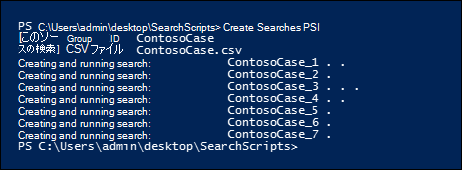
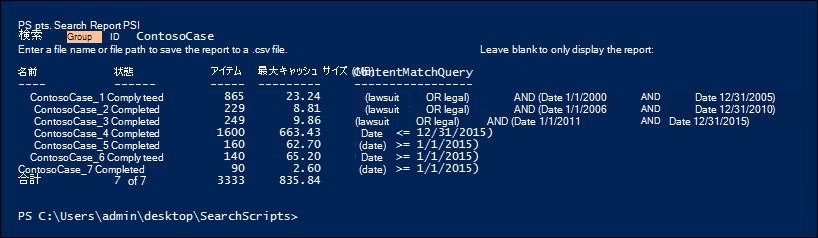
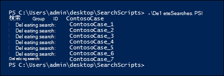

# <a name="create-report-on-and-delete-multiple-content-searches"></a>複数のコンテンツ検索の作成、報告、削除

[!include[Purview banner](../includes/purview-rebrand-banner.md)]

 探索検索を迅速に作成およびレポートすることは、多くの場合、基になるデータと検索の豊富さと品質について学習しようとしている場合に、電子情報開示と調査の重要なステップです。 これを支援するために、Security & Compliance Center PowerShell には、時間のかかるコンテンツ検索タスクを自動化するための一連のコマンドレットが用意されています。 これらのスクリプトを使用すると、多数の検索を迅速かつ簡単に作成し、推定検索結果のレポートを実行して、問題のデータの量を判断するのに役立ちます。 スクリプトを使用して、異なるバージョンの検索を作成して、それぞれが生成する結果を比較することもできます。 これらのスクリプトは、データを迅速かつ効率的に識別してカリングするのに役立ちます。

## <a name="before-you-create-a-content-search"></a>コンテンツ検索を作成する前に

- このトピックで説明するスクリプトを実行するには、Microsoft Purview コンプライアンス ポータルで電子情報開示マネージャーの役割グループのメンバーである必要があります。

- 手順 1 で CSV ファイルに追加できる組織内のOneDrive for Business サイトの URL の一覧を収集するには、「組織内[のすべてのOneDriveの場所の一覧を作成](/onedrive/list-onedrive-urls)する」を参照してください。

- このトピックで作成するすべてのファイルは、必ず同じフォルダーに保存してください。 そうすることで、スクリプトを簡単に実行できるようになります。

- スクリプトには、最小限のエラー処理が含まれます。 主な目的は、複数のコンテンツ検索をすばやく作成、レポート、削除することです。

- このトピックで提供されているサンプル スクリプトは、いかなる Microsoft 標準サポート プログラムまたはサービスでもサポートされていません。サンプル スクリプトは、いかなる保証もありません。これらのサンプルに対しては、Microsoft 社は商品またはその他の何らかの目的を持つものに付随すると考えられている暗黙の責任も一切認めません。これらのサンプルは、完全にユーザーの責任において使用してください。いかなる場合でも、Microsoft 社および販売店は、これらのサンプルを使用した結果発生した損害およびこれらのサンプルを使用できなかったことによる損害に対して、商業的損失、業務の中断、企業情報の喪失、およびその他の金銭的損失等を含め、何ら制限も設けることなく一切の責任を認めません。これは、たとえ Microsoft 社がそのような損害の可能性について通知を受けていた場合でも同じです。

## <a name="step-1-create-a-csv-file-that-contains-information-about-the-searches-you-want-to-run"></a>手順 1: 実行する検索に関する情報を含む CSV ファイルを作成する

この手順で作成するコンマ区切り値 (CSV) ファイルには、検索する各ユーザーの行が含まれています。 ユーザーのExchange Online メールボックス (アーカイブ メールボックスが有効な場合はアーカイブ メールボックスを含む) とそのOneDrive for Business サイトを検索できます。 または、メールボックスまたはOneDrive for Business サイトのみを検索することもできます。 SharePoint Online 組織内の任意のサイトを検索することもできます。 手順 3 で実行するスクリプトでは、CSV ファイル内の各行に対して個別の検索が作成されます。

1. NotePad を使用して、次のテキストをコピーして.txt ファイルに貼り付けます。 このファイルをローカル コンピューター上のフォルダーに保存します。 他のスクリプトもこのフォルダーに保存します。

   ```text
   ExchangeLocation,SharePointLocation,ContentMatchQuery,StartDate,EndDate
   sarad@contoso.onmicrosoft.com,https://contoso-my.sharepoint.com/personal/sarad_contoso_onmicrosoft_com,(lawsuit OR legal),1/1/2000,12/31/2005
   sarad@contoso.onmicrosoft.com,https://contoso-my.sharepoint.com/personal/sarad_contoso_onmicrosoft_com,(lawsuit OR legal),1/1/2006,12/31/2010
   sarad@contoso.onmicrosoft.com,https://contoso-my.sharepoint.com/personal/sarad_contoso_onmicrosoft_com,(lawsuit OR legal),1/1/2011,3/21/2016
   ,https://contoso.sharepoint.com/sites/contoso,,,3/21/2016
   ,https://contoso-my.sharepoint.com/personal/davidl_contoso_onmicrosoft_com,,1/1/2015,
   ,https://contoso-my.sharepoint.com/personal/janets_contoso_onmicrosoft_com,,1/1/2015,
   ```

   ファイルの最初の行 (ヘッダー行) には、 **New-ComplianceSearch** コマンドレットによって (手順 3 のスクリプトで) 新しいコンテンツ検索を作成するために使用されるパラメーターが一覧表示されます。 各パラメーター名はコンマで区切られています。 ヘッダー行にスペースがないことを確認します。 ヘッダー行の下の各行は、各検索のパラメーター値を表します。 CSV ファイル内のプレースホルダー データを実際のデータに置き換えてください。

2. Excelで.txt ファイルを開き、次の表の情報を使用して、検索ごとに情報を含むファイルを編集します。

   ****

   |パラメーター|説明|
   |---|---|
   |`ExchangeLocation`|ユーザーのメールボックスの SMTP アドレス。|
   |`SharePointLocation`|ユーザーのOneDrive for Business サイトの URL、または組織内の任意のサイトの URL。 OneDrive for Business サイトの URL には、次の形式を使用します` https://<your organization>-my.sharepoint.com/personal/<user alias>_<your organization>_onmicrosoft_com `。 例: `https://contoso-my.sharepoint.com/personal/sarad_contoso_onmicrosoft_com`。|
   |`ContentMatchQuery`|検索の検索クエリ。 検索クエリの作成の詳細については、「コンテンツ検索 [のキーワード クエリと検索条件」を参照](keyword-queries-and-search-conditions.md)してください。|
   |`StartDate`|電子メールの場合、メッセージが受信者によって受信されたか、送信者によって送信された日付または後の日付。 SharePoint サイトまたはOneDrive for Business サイトのドキュメントの場合、ドキュメントが最後に変更された日付または後の日付。|
   |`EndDate`|電子メールの場合は、ユーザーが送信したメッセージの送信日または送信前の日付。 SharePoint サイトまたはOneDrive for Business サイトのドキュメントの場合、ドキュメントが最後に変更された日付または前の日付。|
   |

3. Excel ファイルを CSV ファイルとしてローカル コンピューター上のフォルダーに保存します。 手順 3 で作成したスクリプトでは、この CSV ファイルの情報を使用して検索を作成します。

## <a name="step-2-connect-to-security--compliance-center-powershell"></a>手順 2: セキュリティ/コンプライアンス センターの PowerShell に接続する

次に、組織のセキュリティ/コンプライアンス センターの PowerShell に接続します。 詳細な手順については、「[セキュリティ/コンプライアンス センターの PowerShell への接続](/powershell/exchange/connect-to-scc-powershell)」を参照してください。

## <a name="step-3-run-the-script-to-create-and-start-the-searches"></a>手順 3: スクリプトを実行して検索を作成して開始する

この手順のスクリプトでは、手順 1 で作成した CSV ファイル内の行ごとに個別のコンテンツ検索を作成します。 このスクリプトを実行すると、次の 2 つの値を入力するように求められます。

- **検索グループ ID** - この名前は、CSV ファイルから作成された検索を簡単に整理する方法を提供します。 作成された各検索には、検索グループ ID で名前が付けられ、検索名に番号が追加されます。 たとえば、検索グループ ID に **ContosoCase** と入力した場合、検索には **ContosoCase_1**、 **ContosoCase_2**、 **ContosoCase_3** などの名前が付けられます。 入力する名前は大文字と小文字が区別されることに注意してください。 手順 4 と手順 5 で検索グループ ID を使用する場合は、作成時と同じケースを使用する必要があります。

- **CSV ファイル** - 手順 1 で作成した CSV ファイルの名前。 完全なファイル名を使用し、.csv ファイル拡張子を含めます。たとえば、. `ContosoCase.csv`

このスクリプトを実行するには、以下の手順を実行します。

1. 次のテキストをWindows PowerShell スクリプト ファイルに保存するには、.ps1 のファイル名サフィックスを使用します。たとえば、 `CreateSearches.ps1`. 他のファイルを保存したのと同じフォルダーにファイルを保存します。

   ```Powershell
   # Get the Search Group ID and the location of the CSV input file
   $searchGroup = Read-Host 'Search Group ID'
   $csvFile = Read-Host 'Source CSV file'

   # Do a quick check to make sure our group name will not collide with other searches
   $searchCounter = 1
   import-csv $csvFile |
     ForEach-Object{

    $searchName = $searchGroup +'_' + $searchCounter
    $search = Get-ComplianceSearch $searchName -EA SilentlyContinue
    if ($search)
    {
       Write-Error "The Search Group ID conflicts with existing searches.  Please choose a search group name and restart the script."
       return
    }
    $searchCounter++
   }

   $searchCounter = 1
   import-csv $csvFile |
     ForEach-Object{

    # Create the query
    $query = $_.ContentMatchQuery
    if(($_.StartDate -or $_.EndDate))
    {
          # Add the appropriate date restrictions.  NOTE: Using the Date condition property here because it works across Exchange, SharePoint, and OneDrive for Business.
          # For Exchange, the Date condition property maps to the Sent and Received dates; for SharePoint and OneDrive for Business, it maps to Created and Modified dates.
          if($query)
          {
              $query += " AND"
          }
          $query += " ("
          if($_.StartDate)
          {
              $query += "Date >= " + $_.StartDate
          }
          if($_.EndDate)
          {
              if($_.StartDate)
              {
                  $query += " AND "
              }
              $query += "Date <= " + $_.EndDate
          }
          $query += ")"
    }

     # -ExchangeLocation can't be set to an empty string, set to null if there's no location.
     $exchangeLocation = $null
     if ( $_.ExchangeLocation)
     {
           $exchangeLocation = $_.ExchangeLocation
     }

    # Create and run the search
    $searchName = $searchGroup +'_' + $searchCounter
    Write-Host "Creating and running search: " $searchName -NoNewline
    $search = New-ComplianceSearch -Name $searchName -ExchangeLocation $exchangeLocation -SharePointLocation $_.SharePointLocation -ContentMatchQuery $query

    # Start and wait for each search to complete
    Start-ComplianceSearch $search.Name
    while ((Get-ComplianceSearch $search.Name).Status -ne "Completed")
    {
       Write-Host " ." -NoNewline
       Start-Sleep -s 3
    }
    Write-Host ""

    $searchCounter++
   }
   ```

2. Windows PowerShellで、前の手順でスクリプトを保存したフォルダーに移動し、次のようにスクリプトを実行します。

   ```Powershell
   .\CreateSearches.ps1
   ```

3. **検索グループ ID** プロンプトで、検索グループ名を入力し、**Enter** キーを押します。たとえば、. `ContosoCase` この名前では大文字と小文字が区別されるので、以降の手順でも同じように入力する必要があります。

4. **[ソース CSV ファイル]** プロンプトで、CSV ファイルの名前 (.csv ファイル拡張子を含む) を入力します。たとえば、. `ContosoCase.csv`

5. **Enter キー** を押してスクリプトの実行を続行します。

   スクリプトには、検索の作成と実行の進行状況が表示されます。 スクリプトが完了すると、プロンプトに戻ります。

   

## <a name="step-4-run-the-script-to-report-the-search-estimates"></a>手順 4: スクリプトを実行して検索の見積もりを報告する

検索を作成した後、次の手順では、手順 3. で作成した各検索の検索ヒット数の簡単なレポートを表示するスクリプトを実行します。 レポートには、各検索の結果のサイズと、すべての検索の合計ヒット数と合計サイズも含まれます。 レポート スクリプトを実行すると、レポートを CSV ファイルに保存する場合は、検索グループ ID と CSV ファイル名の入力を求めるメッセージが表示されます。

1. 次のテキストをWindows PowerShell スクリプト ファイルに保存するには、.ps1 のファイル名サフィックスを使用します。たとえば、 `SearchReport.ps1`. 他のファイルを保存したのと同じフォルダーにファイルを保存します。

   ```Powershell
   $searchGroup = Read-Host 'Search Group ID'
   $outputFile = Read-Host 'Enter a file name or file path to save the report to a .csv file. Leave blank to only display the report'
   $searches = Get-ComplianceSearch | ?{$_.Name -clike $searchGroup + "_*"}
   $allSearchStats = @()
   foreach ($partialObj in $searches)
   {
      $search = Get-ComplianceSearch $partialObj.Name
      $sizeMB = [System.Math]::Round($search.Size / 1MB, 2)
      $searchStatus = $search.Status
      if($search.Errors)
      {
          $searchStatus = "Failed"
      }elseif($search.NumFailedSources -gt 0)
      {
          $searchStatus = "Failed Sources"
      }
      $searchStats = New-Object PSObject
      Add-Member -InputObject $searchStats -MemberType NoteProperty -Name Name -Value $search.Name
      Add-Member -InputObject $searchStats -MemberType NoteProperty -Name ContentMatchQuery -Value $search.ContentMatchQuery
      Add-Member -InputObject $searchStats -MemberType NoteProperty -Name Status -Value $searchStatus
      Add-Member -InputObject $searchStats -MemberType NoteProperty -Name Items -Value $search.Items
      Add-Member -InputObject $searchStats -MemberType NoteProperty -Name "Size" -Value $search.Size
      Add-Member -InputObject $searchStats -MemberType NoteProperty -Name "Size(MB)" -Value $sizeMB
      $allSearchStats += $searchStats
   }
   # Calculate the totals
   $allItems = ($allSearchStats | Measure-Object Items -Sum).Sum
   # Convert the total size to MB and round to the nearst 100th
   $allSize = ($allSearchStats | Measure-Object 'Size' -Sum).Sum
   $allSizeMB = [System.Math]::Round($allSize  / 1MB, 2)
   # Get the total successful searches and total of all searches
   $allSuccessCount = ($allSearchStats |?{$_.Status -eq "Completed"}).Count
   $allCount = $allSearchStats.Count
   $allStatus = [string]$allSuccessCount + " of " + [string]$allCount
   # Totals Row
   $totalSearchStats = New-Object PSObject
   Add-Member -InputObject $totalSearchStats -MemberType NoteProperty -Name Name -Value "Total"
   Add-Member -InputObject $totalSearchStats -MemberType NoteProperty -Name Status -Value $allStatus
   Add-Member -InputObject $totalSearchStats -MemberType NoteProperty -Name Items -Value $allItems
   Add-Member -InputObject $totalSearchStats -MemberType NoteProperty -Name "Size(MB)" -Value $allSizeMB
   $allSearchStats += $totalSearchStats
   # Just get the columns we're interested in showing
   $allSearchStatsPrime = $allSearchStats | Select-Object Name, Status, Items, "Size(MB)", ContentMatchQuery
   # Print the results to the screen
   $allSearchStatsPrime |ft -AutoSize -Wrap
   # Save the results to a CSV file
   if ($outputFile)
   {
      $allSearchStatsPrime | Export-Csv -Path $outputFile -NoTypeInformation
   }
   ```

2. Windows PowerShellで、前の手順でスクリプトを保存したフォルダーに移動し、次のようにスクリプトを実行します。

   ```Powershell
   .\SearchReport.ps1
   ```

3. **検索グループ ID** プロンプトで、検索グループ名を入力し、**Enter** キーを押します。たとえば.`ContosoCase` この名前は大文字と小文字が区別されるので、手順 3 でスクリプトを実行したときと同じように入力する必要があります。

4. **レポートを CSV ファイルに保存するファイル パス (レポートを表示する場合は空白のままにします)** プロンプトで、レポートを CSV ファイルに保存する場合は、完全なファイル名パス (.csv ファイル拡張子を含む) のファイル名を入力します。 CSV ファイルの名前 (.csv ファイル拡張子を含む)。 たとえば、入力  `ContosoCaseReport.csv` して現在のディレクトリに保存することも、別のフォルダーに保存するように入力  `C:\Users\admin\OneDrive for Business\ContosoCase\ContosoCaseReport.csv` することもできます。 プロンプトを空白のままにしてレポートを表示することもできますが、ファイルに保存することはできません。

5. **[Enter]** キーを押します。

   スクリプトには、検索の作成と実行の進行状況が表示されます。 スクリプトが完了すると、レポートが表示されます。

   

> [!NOTE]
> 同じメールボックスまたはサイトが検索グループ内の複数の検索でコンテンツの場所として指定されている場合、レポートの合計結果の見積もり (アイテムの数と合計サイズの両方) に、同じアイテムの結果が含まれる場合があります。 これは、同じメール メッセージまたはドキュメントが検索グループ内の異なる検索のクエリと一致する場合に複数回カウントされるためです。

## <a name="step-5-run-the-script-to-delete-the-searches"></a>手順 5: スクリプトを実行して検索を削除する

多くの検索を作成している可能性があるため、この最後のスクリプトを使用すると、手順 3 で作成した検索をすばやく簡単に削除できます。 他のスクリプトと同様に、検索グループ ID の入力も求められます。 このスクリプトを実行すると、検索名に検索グループ ID を含むすべての検索が削除されます。

1. 次のテキストをWindows PowerShell スクリプト ファイルに保存するには、.ps1 のファイル名サフィックスを使用します。たとえば、 `DeleteSearches.ps1`. 他のファイルを保存したのと同じフォルダーにファイルを保存します。

   ```Powershell
   # Delete all searches in a search group
   $searchGroup = Read-Host 'Search Group ID'
   Get-ComplianceSearch |
      ForEach-Object{
      # If the name matches the search group name pattern (case sensitive), delete the search
      if ($_.Name -cmatch $searchGroup + "_\d+")
      {
          Write-Host "Deleting search: " $_.Name
          Remove-ComplianceSearch $_.Name -Confirm:$false
      }
   }
   ```

2. Windows PowerShellで、前の手順でスクリプトを保存したフォルダーに移動し、次のようにスクリプトを実行します。

   ```Powershell
   .\DeleteSearches.ps1
   ```

3. **検索グループ ID** プロンプトで、削除する検索の検索グループ名を入力し、**Enter** キーを押します。たとえば、. `ContosoCase` この名前は大文字と小文字が区別されるので、手順 3 でスクリプトを実行したときと同じように入力する必要があります。

   スクリプトには、削除された各検索の名前が表示されます。

   
