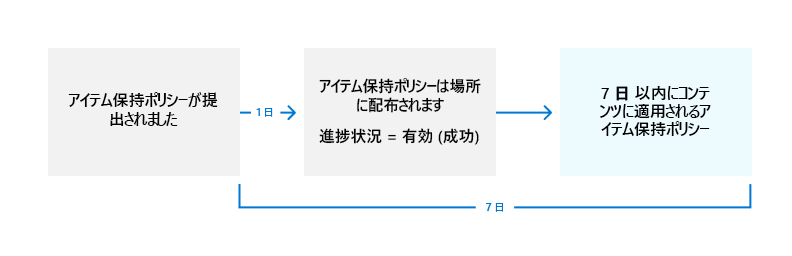

# <a name="create-and-configure-retention-policies"></a>アイテム保持ポリシーを作成して構成する

>*[セキュリティとコンプライアンスのための Microsoft 365 ライセンス ガイダンス](/office365/servicedescriptions/microsoft-365-service-descriptions/microsoft-365-tenantlevel-services-licensing-guidance/microsoft-365-security-compliance-licensing-guidance)。*

アイテム保持ポリシーを使用して、コンテンツを保持するか、削除するか、あるいは保持した後に削除するかを事前に決定することにより、組織のデータを管理します。

アイテム保持ポリシーを使用すると、コンテナー レベルで同じ保持設定を割り当てて、そのコンテナー内のコンテンツに自動的に継承することで、この作業を非常に効率的に行うことができます。 たとえば、SharePoint サイトのすべてのアイテム、ユーザーの Exchange メールボックスのすべてのメール メッセージ、Microsoft Teams で使用するチームのすべてのチャネル メッセージなどが挙げられます。 アイテム保持ポリシーをコンテナー レベルで使用するべきか、保持ラベルをアイテム レベルで使用するべきかが分からない場合は、「[アイテム保持ポリシーと保持ラベル](retention.md#retention-policies-and-retention-labels)」をご覧ください。

アイテム保持ポリシーと Microsoft 365 内のデータ保持の仕組みに関する詳細情報については、「[アイテム保持ポリシーおよび保持ラベルの詳細](retention.md)」をご覧ください。

> [!NOTE]
> このページの情報はコンプライアンス管理者向けです。 お客様が管理者ではなく、使用するアプリに対してアイテム保持ポリシーがどのように構成されているのか理解したい場合は、ヘルプ デスク、IT 部門、または管理者にお問い合わせください。 Teams チャットとチャネル メッセージでアイテム保持ポリシーに関するメッセージが表示される場合は、「[アイテム保持ポリシーに関する Teams のメッセージ](https://support.microsoft.com/office/teams-messages-about-retention-policies-c151fa2f-1558-4cf9-8e51-854e925b483b)」から役立つ情報が得られる場合があります。

## <a name="before-you-begin"></a>はじめに

組織のグローバル管理者には、アイテム保持ポリシーを作成および編集できる完全な権限があります。 グローバル管理者としてサインインしていない場合は、「[Information Governance のアクセス許可情報](get-started-with-information-governance.md#permissions-for-retention-policies-and-retention-labels)」を参照してください。

保持ラベル ポリシーを作成する前に、**アダプティブ** にするか、**静的** にするかどうかを決定します。 詳細については、「[保持用のアダプティブ ポリシー スコープまたは静的ポリシー スコープ](retention.md#adaptive-or-static-policy-scopes-for-retention)」を参照してください。 アダプティブ ポリシーの使用を決定する場合は、保持ポリシーの作成前に 1 つ以上のアダプティブ スコープを作成し、保持ラベル ポリシーの作成プロセス中に選択します。 手順については、「[アダプティブ スコープの構成情報](retention-settings.md#configuration-information-for-adaptive-scopes)」を参照してください。

## <a name="create-and-configure-a-retention-policy"></a>アイテム保持ポリシーを作成して構成する

アイテム保持ポリシーは、アイテム保持ポリシー内において"場所"として識別された複数のサービスをサポートすることができますが、サポートされているすべての場所を含む単一のアイテム保持ポリシーを作成することはできません。

- Exchange メール
- SharePoint サイト
- OneDrive アカウント
- Microsoft 365 グループ
- Skype for Business
- Exchange パブリック フォルダー
- チームのチャネル メッセージ
- Teams のチャット
- Teams の非公開チャネル メッセージ
- Yammer コミュニティのメッセージ
- Yammer ユーザーのメッセージ

アイテム保持ポリシーを作成するときに Teams か Yammer の場所を選択する場合、他の場所は自動的に除外されます。 したがって、従うべき手順は、Teams か Yammer の場所を含める必要があるかどうかによって異なります。

- [Teams の場所のアイテム保持ポリシーの説明](#retention-policy-for-teams-locations)
- [Yammer の場所のアイテム保持ポリシーの説明](#retention-policy-for-yammer-locations)
- [Teams や Yammer 以外の場所のアイテム保持ポリシーの説明](#retention-policy-for-locations-other-than-teams-and-yammer)

> [!NOTE]
> 静的ポリシーの代わりにアダプティブ ポリシーを使用する場合は、Teams と Yammer の両方の場所を含める単一のアイテム保持ポリシーを構成できます。 この点は静的ポリシーでは異なり、Teams と Yammer の場所で独自のアイテム保持ポリシーが必要です。

複数のアイテム保持ポリシーがあり、保持ラベルも使用する場合は、「[保持の原則、すなわち優先順位について](retention.md#the-principles-of-retention-or-what-takes-precedence)」を参照して、複数の保持設定が同じコンテンツに適用された場合の結果を理解してください。

### <a name="retention-policy-for-teams-locations"></a>Teams の場所のアイテム保持ポリシー

> [!NOTE]
> アイテム保持ポリシーは、現在プレビュー段階の [共有チャネル](/MicrosoftTeams/shared-channels)をサポートするようになりました。**Teams チャネル メッセージ** の場所に対するデータ保持設定を構成すると、チームに共有チャネルがある場合、それらはデータ保持設定を親チームから継承します。

1. [Microsoft 365 コンプライアンス センター](https://compliance.microsoft.com/)から、**[情報ガバナンス]** > **[保持ポリシー]** を選択します。

2. [**新しいアイテム保持ポリシー**] を選択して、**アイテム保持ポリシー** 構成の作成を開始し、新しいアイテム保持ポリシーに名前を付けます。

3. **[作成するアイテム保持ポリシーの種類を選択する]** ページで、「[作業開始の前に](#before-you-begin)」の手順での選択に応じて、**[アダプティブ]** または [**[静的]** のいずれかを選択します。 アダプティブ スコープをまだ作成していない場合は、**[アダプティブ]** を選択できますが、選択するアダプティブ スコープがないため、このオプションを使用してウィザードを終了することはできません。

4. 選択したスコープに応じて、次の項目を実行します。
    
    - [**アダプティブ**] を選択した場合: [**アダプティブ ポリシー スコープと場所の選択**] ページで、[**スコープの追加**] を選択し、作成された 1 つ以上のアダプティブ スコープを選択します。 次に、1 つ以上の場所を選択します。 選択できる場所は、追加された[スコープの種類](retention-settings.md#configuration-information-for-adaptive-scopes)によって異なります。 たとえば、**"User"** のスコープの種類のみを追加した場合、**[Teams チャット]** を選択できますが、**[Teams チャネル メッセージ]** は選択できません。 
    
    - **"Static"** を選択した場合: **[ポリシーを適用する場所を選択しますの選択]** ページで、Teams の 1 つ以上の場所を選択します。
        - **Teams チャネル メッセージ**: 標準、共有チャネル チャット、および標準、共有チャネル会議からのメッセージであり、独自のポリシーの場所を持つ [プライベート チャネル](/microsoftteams/private-channels)からのメッセージではありません。
        - **Teams チャット**: プライベート 1:1 チャット、グループ チャット、および会議チャットからのメッセージ。
        - **Teams プライベート チャネル メッセージ**: プライベート チャネル チャットおよびプライベート チャネル 会議からのメッセージ。
        
       既定では、[すべてのチームとすべてのユーザーが選択されています](retention-settings.md#a-policy-that-applies-to-entire-locations)が、[**[選択]** と **[除外]** オプション](retention-settings.md#a-policy-with-specific-inclusions-or-exclusions)を選択することでこれを調整できます。

5. [**コンテンツを保持するか、削除するか、またはその両方を行うかを決定する**] ページで、コンテンツを保持および削除するための構成オプションを指定します。

   削除せずにコンテンツを保持するだけのアイテム保持ポリシーを作成し、指定した期間が経過した後に保持してから削除するか、指定した期間が経過した後にコンテンツを削除するだけです。詳細については、「[コンテンツを保持および削除するための設定](retention-settings.md#settings-for-retaining-and-deleting-content)」を参照してください。

6. 構成を完了して、設定を保存します。

Teams のアイテム保持ポリシーを使用するタイミングと、エンド ユーザー エクスペリエンスを理解するためのガイダンスについては、Teams のドキュメントから「[Microsoft Teams のアイテム保持ポリシーを管理する](/microsoftteams/retention-policies)」を参照してください。

アイテム保持ポリシーに対してサポートされているメッセージの要素や、タイミング情報の例を説明した手引きを含む、アイテム保持ポリシーの Teams に対する機能の技術的な詳細については、「[Microsoft Teams の保持に関する情報](retention-policies-teams.md)」を参照してください。

#### <a name="known-configuration-issues"></a>既知の構成の問題

- アイテムが最後に変更されたときに保持期間を開始するオプションを選択できますが、**アイテムが作成されたとき** の値が常に使用されます。 編集されたメッセージの場合、元のメッセージのコピーが元のタイムスタンプとともに保存され、この事前編集されたメッセージがいつ作成されたかを識別し、後編集されたメッセージのタイムスタンプが新しくなります。

- [Teams のチャット] の場所にある **[編集]** を選択した場合、ゲストや、メールボックスのユーザーではないユーザーが表示される場合があります。 アイテム保持ポリシーはこれらのユーザー向けに設計されていないため、選択しないでください。


#### <a name="additional-retention-policy-needed-to-support-teams"></a>Teams をサポートするのに必要な追加のアイテム保持ポリシー

Teams は、単なるチャットやチャネルメッセージを送るだけのツールではありません。 Microsoft 365 グループ (以前の Office 365 グループ) から作成されたチームがある場合は、**Microsoft 365 グループ** の場所を使用して、その Microsoft 365 グループを含むアイテム保持ポリシーを追加で構成する必要があります。 このアイテム保持ポリシーは、グループのメールボックス、サイト、およびドキュメントのコンテンツに適用されます。

チーム サイトが Microsoft 365 グループに接続されていない場合に、Teams 内のファイルを保持および削除するためには、**SharePoint サイト** または **OneDrive アカウント** の場所を含むアイテム保持ポリシーが必要です。

- チャット内で共有されるファイルは、ファイルを共有したユーザーの OneDrive アカウントに保存されます。

- チャネルにアップロードされたファイルは、チームの SharePoint 内に保存されます。

> [!TIP]
> チームの SharePoint サイトおよびチーム内のユーザーの OneDrive アカウントを選択すると、Microsoft 365 グループに接続されていない特定のチームのみのファイルにアイテム保持ポリシーを適用出来ます。

Microsoft 365 グループ、SharePoint サイトや OneDrive アカウントに適用されているアイテム保持ポリシーにより、Teams のチャットやチャネル メッセージで参照されているファイルが、それらのメッセージが削除されるよりも先に削除される場合があります。 このような場合、そのファイルは Teams のメッセージに引き続き表示されますが、ユーザーがファイルをクリックすると、"ファイルが見つかりません" というエラーが表示されます。 この動作はアイテム保持ポリシーに固有のものではなく、ユーザーが SharePoint または OneDrive から手動でファイルを削除した場合にも発生する可能性があります。

### <a name="retention-policy-for-yammer-locations"></a>Yammer の場所のアイテム保持ポリシー

> [!NOTE]
> Yammer のアイテム保持ポリシーは、現在、アイテム保持ポリシーの結果としてメッセージが削除されたときはユーザーに通知されません。
>
> この機能を使用するには、ご利用の Yammer ネットワークがハイブリッド モードではなく、[ネイティブ モード](/yammer/configure-your-yammer-network/overview-native-mode)になっている必要があります。

1. [Microsoft 365 コンプライアンス センター](https://compliance.microsoft.com/)から、**[情報ガバナンス]** > **[保持ポリシー]** を選択します。

2. 新しいアイテム保持ポリシーを作成するには、[**新しいアイテム保持ポリシー**] を選択します。

3. **[作成するアイテム保持ポリシーの種類を選択する]** ページで、「[作業開始の前に](#before-you-begin)」の手順での選択に応じて、**[アダプティブ]** または [**[静的]** のいずれかを選択します。 アダプティブ スコープをまだ作成していない場合は、**[アダプティブ]** を選択できますが、選択するアダプティブ スコープがないため、このオプションを使用してウィザードを終了することはできません。

4. 選択したスコープに応じて、次の項目を実行します。
    
    - [**アダプティブ**] を選択した場合: [**アダプティブ ポリシー スコープと場所の選択**] ページで、[**スコープの追加**] を選択し、作成された 1 つ以上のアダプティブ スコープを選択します。 次に、1 つ以上の場所を選択します。 選択できる場所は、追加された[スコープの種類](retention-settings.md#configuration-information-for-adaptive-scopes)によって異なります。 たとえば、**"ユーザー"** のスコープの種類のみを追加した場合、**[Yammer ユーザー メッセージ]** を選択できますが、**[Yammer コミュニティ メッセージ]** は選択できません。 
    
    - **[静的]** を選択した場合: **[ポリシーを適用する場所の選択]** ページで、Yammer の場所の 1 つまたは両方をオンに切り替えます: **[Yammer コミュニティのメッセージ]** と **[Yammer ユーザーのメッセージ]**。
        
        既定では、すべてのコミュニティとユーザーが選択されていますが、コミュニティやユーザーを含めるか、除外するかを指定して、設定し直すことができます。
        
        Yammer ユーザーのメッセージ: 
        - 既定値をそのまま **[すべてのユーザー]** のままにすると、Azure B2B ゲスト ユーザーは含まれません。 
        - **[すべてのユーザー]** の **[編集]** を選択した場合、アカウントがわかっている場合は、アイテム保持ポリシーを外部ユーザーに適用できます。

5. [**コンテンツを保持するか、削除するか、またはその両方を行うかを決定する**] ページで、コンテンツを保持および削除するための構成オプションを指定します。 
    
    削除せずにコンテンツを保持するだけのアイテム保持ポリシーを作成し、指定した期間が経過した後に保持してから削除するか、指定した期間が経過した後にコンテンツを削除するだけです。詳細については、「[コンテンツを保持および削除するための設定](retention-settings.md#settings-for-retaining-and-deleting-content)」を参照してください。

6. 構成を完了して、設定を保存します。

Yammer 向けに機能する保持ポリシーの仕組みに関する詳細情報については、「[Yammer の保持の詳細](retention-policies-yammer.md)」を参照してください。

#### <a name="additional-retention-policies-needed-to-support-yammer"></a>Yammer をサポートするのに必要な追加のアイテム保持ポリシー

Yammer に備わっているのは、コミュニティのメッセージや個人用メッセージだけではありません。Yammer ネットワークのメール メッセージを保持したり削除したりするには、**Microsoft 365 グループ** の場所を使用して、Yammer で使用されている任意の Microsoft 365 グループを含む追加のアイテム保持ポリシーを構成します。 

Yammer に保存されているファイルを保持したり削除したりするためには、**Microsoft 365 グループ** や **OneDrive アカウント** の場所を含むアイテム保持ポリシーが必要です。

- 個人用メッセージ内で共有されるファイルは、ファイルを共有したユーザーの OneDrive アカウントに保存されます。 

- コミュニティにアップロードされたファイルは、Yammer コミュニティのグループ接続された SharePoint サイト内に保存されます。

SharePoint サイトや OneDrive アカウントに適用されているアイテム保持ポリシーにより、Yammer メッセージで参照されているファイルが、それらのメッセージが削除されるよりも先に削除される場合があります。 このような場合、そのファイルは Yammer のメッセージに引き続き表示されますが、ユーザーがファイルをクリックすると、"ファイルが見つかりません" というエラーが表示されます。 この動作はアイテム保持ポリシーに固有のものではなく、ユーザーが SharePoint または OneDrive から手動でファイルを削除した場合にも発生する可能性があります。

### <a name="retention-policy-for-locations-other-than-teams-and-yammer"></a>Teams や Yammer 以外の場所のアイテム保持ポリシー

これらのサービスのいずれかに適用されるアイテム保持ポリシーについては、次の手順をご利用ください。

- Exchange: メールとパブリック フォルダー
- SharePoint: サイト
- OneDrive: アカウント
- Microsoft 365 グループ
- Skype for Business

1. [Microsoft 365 コンプライアンス センター](https://compliance.microsoft.com/)から、**[情報ガバナンス]** > **[保持ポリシー]** を選択します。

2. [**新しいアイテム保持ポリシー**] を選択して、**アイテム保持ポリシー** 構成の作成を開始し、新しいアイテム保持ポリシーに名前を付けます。

3. **[作成するアイテム保持ポリシーの種類を選択する]** ページで、「[作業開始の前に](#before-you-begin)」の手順での選択に応じて、**[アダプティブ]** または [**[静的]** のいずれかを選択します。 アダプティブ スコープをまだ作成していない場合は、**[アダプティブ]** を選択できますが、選択するアダプティブ スコープがないため、このオプションを使用してウィザードを終了することはできません。 アダプティブ ポリシーでは、Exchange パブリック フォルダーまたは Skype for Business の場所はサポートされていません。

4. 選択したスコープに応じて、次の項目を実行します。
    
    - [**アダプティブ**] を選択した場合: [**アダプティブ ポリシー スコープと場所の選択**] ページで、[**スコープの追加**] を選択し、作成された 1 つ以上のアダプティブ スコープを選択します。 次に、1 つ以上の場所を選択します。 選択できる場所は、追加された[スコープの種類](retention-settings.md#configuration-information-for-adaptive-scopes)によって異なります。 たとえば、**"ユーザー"** のスコープの種類のみを追加した場合は、**[Exchange メール]** を選択できますが、**[SharePoint サイト]** は選択できません。 
    
    - **[静的]** を選択した場合: **[場所の選択]** ページで、Teams と Yammer の場所以外の場所をオンまたはオフにします。 場所ごとに、既定のままにして、[ポリシーを場所全体に適用する](retention-settings.md#a-policy-that-applies-to-entire-locations)か、[包含と除外を指定](retention-settings.md#a-policy-with-specific-inclusions-or-exclusions)することができます。
    
    場所固有の情報:
    - [Exchange メールと Exchange パブリック フォルダー](retention-settings.md#configuration-information-for-exchange-email-and-exchange-public-folders)
    - [SharePoint サイトと OneDrive アカウント](retention-settings.md#configuration-information-for-sharepoint-sites-and-onedrive-accounts)
    - [Microsoft 365 グループ](retention-settings.md#configuration-information-for-microsoft-365-groups)
    - [Skype for Business](retention-settings.md#configuration-information-for-skype-for-business)

5. [**コンテンツを保持するか、削除するか、またはその両方を行うかを決定する**] ページで、コンテンツを保持および削除するための構成オプションを指定します。
    
    削除せずにコンテンツを保持するだけのアイテム保持ポリシーを作成し、指定した期間が経過した後に保持してから削除するか、指定した期間が経過した後にコンテンツを削除するだけです。詳細については、このページの「[コンテンツを保持および削除するための設定](retention-settings.md#settings-for-retaining-and-deleting-content)」を参照してください。

6. 構成を完了して、設定を保存します。

## <a name="how-long-it-takes-for-retention-policies-to-take-effect"></a>アイテム保持ポリシーが有効になるまでの所要時間

アイテム保持ポリシーを作成して送信すると、アイテム保持ポリシーが適用されるまでに最大 7 日かかる場合があります。
  


まず、アイテム保持ポリシーを選択した場所に配布し、コンテンツに適用する必要があります。 保持ポリシーの配布状態は、コンプライアンス センターの **Retention ポリシー** ページから選択することでいつでも確認できます。 ポップアウト ウィンドウで、状態に **(エラー)** が表示され、場所の詳細に、ポリシーの展開またはポリシーの再展開に予想よりも時間がかかっているというメッセージが表示される場合は、[Set-AppRetentionCompliancePolicy](/powershell/module/exchange/set-appretentioncompliancepolicy) または [Set-RetentionCompliancePolicy](/powershell/module/exchange/set-retentioncompliancepolicy) PowerShell コマンドを実行して、ポリシーの配布を再試行してください。

1. [セキュリティ/コンプライアンス センターの PowerShell に接続する](/powershell/exchange/connect-to-scc-powershell)。

2. 次のいずれかのコマンドを実行します：
    
    - ポリシーの場所 **Teams の非公開チャネル メッセージ**、**Yammer ユーザーのメッセージ**、**Yammer コミュニティのメッセージ** の場合:
    
        ```PowerShell
        Set-AppRetentionCompliancePolicy -Identity <policy name> -RetryDistribution
        ```
    
    - 他のすべてのポリシーの場所 (**Exchange メール**、**SharePoint サイト**、**Teams のチャネル メッセージ** など) の場合:
    
        ```PowerShell
        Set-RetentionCompliancePolicy -Identity <policy name> -RetryDistribution
        ```

## <a name="updating-retention-policies"></a>アイテム保持ポリシーの更新

アイテム保持ポリシーの設定がコンテンツに既に適用されている場合、ポリシーに対する構成の変更は、新しく識別されたコンテンツに加えて、このコンテンツに自動的に適用されます。

ポリシーを作成して保存した後は、一部の設定を変更できません。これには、アイテム保持ポリシーの名前、スコープの種類 (アダプティブまたは静的)、保持期間を除く保持設定が含まれます。

## <a name="next-steps"></a>次の手順

Exchange、SharePoint、OneDrive、またはMicrosoft 365 グループの一部のアイテムで、構成したアイテム保持ポリシー設定とは異なる保持設定が必要な場合は、[これらの例外の保持ラベルを作成](create-retention-labels-information-governance.md)します。

ただし、ビジネス、法的、または規制上の記録保持要件の高価値アイテムのライフサイクル管理を探している場合は、[保持ラベルの作成と管理にファイル計画を使用](file-plan-manager.md)します。
