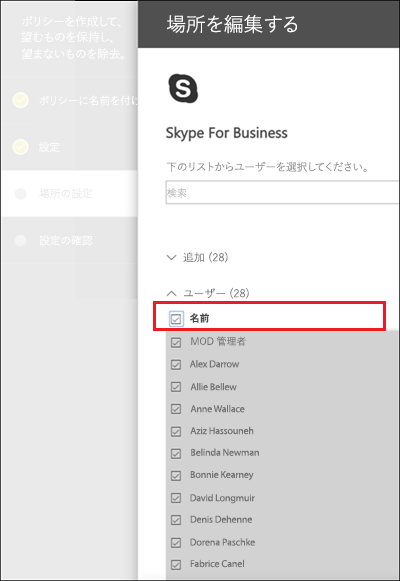

# <a name="create-and-configure-retention-policies"></a>アイテム保持ポリシーを作成して構成する

>*[セキュリティとコンプライアンスのための Microsoft 365 ライセンス ガイダンス](https://aka.ms/ComplianceSD)。*

アイテム保持ポリシーを使用して、コンテンツを保持するか、コンテンツを削除するか、またはその両方を行う (コンテンツを保持した後に削除する) かを事前に決定すします。 

アイテム保持ポリシーを使用すると、サイトまたはメールボックス レベルで、場所ごとに同じ保持設定をコンテンツに割り当てることで、これを非常に効率的に行うことができます。 アイテム保持ポリシーと保持ラベルのどちらを使用するかわからない場合は、「[アイテム保持ポリシーと保持ラベル](retention.md#retention-policies-and-retention-labels)」をご覧ください。

アイテム保持ポリシーと仕組みに関する詳細情報は、「[保持の詳細](retention.md)」をご覧ください。

## <a name="before-you-begin"></a>はじめに

組織のグローバル管理者には、アイテム保持ポリシーを作成および編集できる完全な権限があります。 グローバル管理者としてサインインしていない場合は、「[アイテム保持ポリシーと保持ラベルを作成して管理するために必要なアクセス許可](get-started-with-retention.md#permissions-required-to-create-and-manage-retention-policies-and-retention-labels)」を参照してください。

## <a name="create-and-configure-a-retention-policy"></a>アイテム保持ポリシーを作成して構成する

アイテム保持ポリシーは複数の場所をサポートできますが、サポートされているすべての場所を含む単一のアイテム保持ポリシーを作成することはできません。
- Exchange メール
- SharePoint サイト
- OneDrive アカウント
- Microsoft 365 グループ
- Skype for Business
- Exchange パブリック フォルダー
- チームのチャネル メッセージ
- Teams のチャット

アイテム保持ポリシーを作成するときに Teams の場所のいずれかを選択すると、他の場所は自動的に除外されます。 したがって、従うべき手順は、Teams の場所を含める必要があるかどうかによって異なります。

- [Teams の場所のアイテム保持ポリシーの説明](#retention-policy-for-teams-locations)
- [Teams 以外の場所のアイテム保持ポリシーの説明](#retention-policy-for-locations-other-than-teams)

複数のアイテム保持ポリシーがあり、保持ラベルも使用する場合は、「[保持の原則、すなわち優先順位について](retention.md#the-principles-of-retention-or-what-takes-precedence)」を参照して、複数の保持設定が同じコンテンツに適用された場合の結果を理解してください。

### <a name="retention-policy-for-teams-locations"></a>Teams の場所のアイテム保持ポリシー

1. [Microsoft 365 コンプライアンス センター](https://compliance.microsoft.com/)から、[**ポリシー**] > [**保持**] の順に選択します。

2. 新しいアイテム保持ポリシーを作成するには、[**新しいアイテム保持ポリシー**] を選択します。

3. ウィザードの [**コンテンツを保持するか、削除するか、またはその両方を行うかを決定する**] ページで、コンテンツを保持および削除するための構成オプションを指定します。 
    
    削除せずにコンテンツを保持するだけのアイテム保持ポリシーを作成し、指定した期間が経過した後に保持してから削除するか、指定した期間が経過した後にコンテンツを削除するだけです。 詳細については、このページの「[コンテンツを保持および削除するための設定](#settings-for-retaining-and-deleting-content)」を参照してください。
    
    このオプションは Teams の場所ではサポートされていないため、[**保存期間の詳細設定を使用する**] を選択しないでください。 

4. [**場所の選択**] ページで、[**特定の場所を選択**] を選択します。 次に、Teams の場所の 1 つまたは両方を切り替えます: **Teams のチャネル メッセージ**および **Teams のチャット**。
     
    **Teams のチャネル メッセージ**の場合、標準チャネルからのメッセージが含まれますが、[プライベート チャネル](https://docs.microsoft.com/microsoftteams/private-channels)は含まれません。 現在、プライベートチャネルはアイテム保持ポリシーでサポートされていません。
    
    既定では、すべてのチームが選択されていますが、含めるチームまたは除外するチームを指定することで、これを調整できます。

5. ウィザードを完了して、設定を保存します。

Teams のアイテム保持ポリシーの詳細については、「[Microsoft Teams のアイテム保持ポリシー](https://docs.microsoft.com/microsoftteams/retention-policies)」を参照してください。

#### <a name="additional-retention-policy-needed-to-support-teams"></a>Teams をサポートするのに必要な追加のアイテム保持ポリシー

Teams は、単なるチャットやチャネルメッセージを送るだけのツールではありません。 Microsoft 365 グループ (以前の Office 365 グループ) から作成されたチームがある場合は、**Office 365 グループ**の場所を使用して、その Microsoft 365 グループを含むアイテム保持ポリシーを追加で構成する必要があります。 このアイテム保持ポリシーは、グループのメールボックス、サイト、およびドキュメントのコンテンツに適用されます。

チーム サイトが Microsoft 365 グループに接続されていない場合に、Teams 内のファイルを保持および削除するためには、**SharePoint サイト**または **OneDrive アカウント**の場所を含むアイテム保持ポリシーが必要です。

- チャット内で共有されるファイルは、ファイルを共有したユーザーの OneDrive アカウントに保存されます。 

- チャネルにアップロードされたファイルは、チームの SharePoint 内に保存されます。

> [!TIP]
> チームの SharePoint サイトおよびチーム内のユーザーの OneDrive アカウントを選択すると、Microsoft 365 グループに接続されていない特定のチームのみのファイルにアイテム保持ポリシーを適用出来ます。

Microsoft 365 グループ、SharePoint サイトや OneDrive アカウントに適用されているアイテム保持ポリシーにより、Teams のチャットやチャネル メッセージで参照されているファイルが、それらのメッセージが削除されるよりも先に削除される場合があります。 このような場合、そのファイルは Teams のメッセージに引き続き表示されますが、ユーザーがファイルをクリックすると、"ファイルが見つかりません" というエラーが表示されます。 この動作はアイテム保持ポリシーに固有のものではなく、ユーザーが SharePoint または OneDrive から手動でファイルを削除した場合にも発生する可能性があります。


### <a name="retention-policy-for-locations-other-than-teams"></a>Teams 以外の場所のアイテム保持ポリシー

1. [Microsoft 365 コンプライアンス センター](https://compliance.microsoft.com/)から、[**ポリシー**] > [**保持**] の順に選択します。

2. 新しいアイテム保持ポリシーを作成するには、[**新しいアイテム保持ポリシー**] を選択します。

3. ウィザードの [**コンテンツを保持するか、削除するか、またはその両方を行うかを決定する**] ページで、コンテンツを保持および削除するための構成オプションを指定します。 
    
    削除せずにコンテンツを保持するだけのアイテム保持ポリシーを作成し、指定した期間が経過した後に保持してから削除するか、指定した期間が経過した後にコンテンツを削除するだけです。 詳細については、このページの「[コンテンツを保持および削除するための設定](#settings-for-retaining-and-deleting-content)」を参照してください。
    
    次に、アイテム保持ポリシーをすべてのコンテンツに適用するか、特定の条件を満たすコンテンツに適用するかを決定します。 これらの高度な保持設定の詳細については、このページの「[特定の条件を満たすコンテンツを特定するための詳細設定](#advanced-settings-to-identify-content-that-meets-specific-conditions)」をご覧ください。 

4. [**場所の選択**] ページで、アイテム保持ポリシーを組織全体でサポートされているすべての場所に適用するか、場所を指定するかを選択します。 特定の場所を選択した場合は、対象と除外を指定することもできます。 
    
    組織または特定の場所のアイテム保持ポリシーを選択する方法の詳細については、このページの「[アイテム保持ポリシーを組織全体または特定の場所に適用する](#applying-a-retention-policy-to-an-entire-organization-or-specific-locations)」を参照してください。
    
    場所固有の情報:
    - [Exchange メールと Exchange パブリック フォルダー](#configuration-information-for-exchange-email-and-exchange-public-folders)
    - [SharePoint サイトと OneDrive アカウント](#configuration-information-for-sharepoint-sites-and-onedrive-accounts)
    - [Office 365 グループ](#configuration-information-for-microsoft-365-groups)
    - [Skype for Business](#configuration-information-for-skype-for-business)

5. ウィザードを完了して、設定を保存します。


#### <a name="configuration-information-for-exchange-email-and-exchange-public-folders"></a>Exchange メールと Exchange パブリック フォルダーの構成情報

**Exchange メール**の場所は、メールボックスのレベルで保持設定を適用することにより、ユーザーのメール、予定表、およびその他のメールボックス アイテムの保持をサポートします。

次のメール アイテムが含まれます: メール メッセージ (下書きを含む) 、添付ファイル、タスク、予定表アイテム、終了日、メモ。 連絡先、および終了日が設定されていないタスクおよび予定表アイテムは含まれません。 Skype や Teams の保存済みメッセージなど、メールボックスに保存されているその他のアイテムは、この場所には含まれません。 これらのアイテムには、独自の保存場所があります。

Microsoft 365 グループには Exchange メールボックスがありますが、**Exchange メール**の場所全体が含まれるアイテム保持ポリシーには、Microsoft 365 グループのメールボックスのコンテンツは含まれません。 これらのメールボックスのコンテンツを保持するには、**Office 365 グループ**の場所を選択します。

**Exchange パブリック フォルダー**の場所は保持設定をすべてのパブリック フォルダーに適用し、フォルダーまたはメールボックス レベルでは適用できません。

#### <a name="configuration-information-for-sharepoint-sites-and-onedrive-accounts"></a>SharePoint サイトと OneDrive アカウントの構成情報

[**SharePoint サイト**] の場所を選択すると、アイテム保持ポリシーでは、SharePoint​​ コミュニケーション サイト、Office 365 グループによって接続されていないチーム サイト、クラシック サイトのドキュメントを保持および削除することができます。 Office 365 グループによって接続されているチーム サイトは、このオプションでサポートされていないため、代わりにグループのメールボックス、サイト、ファイル内のコンテンツに適用されている [**Office 365 グループ**] の場所を使用します。

アイテム保持ポリシーはサイト レベルで適用されますが、保持設定が適用されるのはドキュメントのみです。 保持設定は、サイト内のライブラリ、リスト、およびフォルダーを含む組織構造には適用されません。 

SharePoint サイトまたは OneDrive アカウントの場所を指定する場合、サイトにアクセスするためのアクセス許可は必要ありません。また、**[場所の編集]** ページで URL を指定するときに、検証は行われません。 ただし、SharePoint サイトはインデックス付けされている必要があり、ウィザードの最後に指定したサイトが存在しているか確認されます。

この確認が失敗した場合は、入力した URL の検証が失敗したことを示すメッセージが表示され、検証が成功するまで、ウィザードはアイテム保持ポリシーを作成しません。 このメッセージが表示されたら、ウィザードに戻って URL を変更するか、アイテム保持ポリシーからサイトを削除します。

含めるまたは除外する個々の OneDrive アカウントを指定できる URL の形式は次のとおりです: `https://<tenant name>-my.sharepoint.com/personal/<user_name>_<tenant name>_com`

たとえば、「rsimone」のユーザー名を持つ contoso テナント内のユーザーの場合: `https://contoso-my.sharepoint.com/personal/rsimone_contoso_onmicrosoft_com`

テナントの構文を確認し、ユーザーの URL を特定するには、「[組織内のすべてのユーザーの OneDrive URL のリストを取得する](https://docs.microsoft.com/onedrive/list-onedrive-urls)」を参照してください。

### <a name="configuration-information-for-microsoft-365-groups"></a>Microsoft 365 グループの構成情報

Microsoft 365 グループ (以前の Office 365 グループ) のコンテンツを保持または削除するには、**Office 365 グループ**の場所を使用する必要があります。 Microsoft 365 グループには Exchange メールボックスがありますが、**Exchange メール**の場所全体が含まれるアイテム保持ポリシーには、Microsoft 365 グループのメールボックスのコンテンツは含まれません。 また、最初は **Exchange メール**の場所でグループ メールボックスを含めるか除外するかを指定できますが、アイテム保持ポリシーを保存しようとすると、Exchange の場所では「RemoteGroupMailbox」を選択できないことを示すエラーを受け取ります。

もし、teamsサイトがグループ作成時に選択されたか、後でグループに追加された場合は、Microsoft 365グループに適用される保持ポリシーにはグループメールボックスとteamsのサイトも含まれます。 teamsサイトに保存されているファイルは、この場所に含まれますが、独自のアイテム保持ポリシーの場所を持つTeamsのチャットまたはTeamsチャネルメッセージは含まれません。

### <a name="configuration-information-for-skype-for-business"></a>Skype for Business の構成情報

Exchange メールとは異なり Skype の場所の状態をオンに切り替えてすべてのユーザーを含めることはできませんが、そのロケーションをオンにしてから、会話を保持するユーザーを手動で選択できます。


  
[**ユーザーの選択**] を選択すると、列ヘッダーの [**名前**] ボックスを選択して、すべてのユーザーをすばやく含めることができます。 ただし、各ユーザーはポリシーの特定のインクルージョンとしてカウントされることを理解することが重要です。 したがって、1,000 人を超えるユーザーを含める場合は、前のセクションで述べた制限が適用されます。 ここですべての Skype ユーザーを選択することは、組織全体のポリシーに規定ですべての Skype ユーザーを含めることができた場合と同じではありません。 
  

  
Outlook のフォルダー **[会話履歴]** は、Skype のアーカイブには作用しない機能です。**[会話履歴]** はエンド ユーザーが無効にできますが、Skype のアーカイブの場合はユーザーがアクセスできない (電子情報開示には使用できる) 非表示フォルダーに Skype の会話のコピーが保存されます。


## <a name="settings-for-retaining-and-deleting-content"></a>コンテンツを保持および削除するための設定

アイテム保持ポリシーでコンテンツを保持および削除するための設定を選択すると、アイテム保持ポリシーは、指定された期間、次のいずれかの構成になります。

- 保持のみ
- 保持してから削除
- 削除のみ

### <a name="retaining-content-for-a-specific-period-of-time"></a>コンテンツを特定の期間保持する

アイテム保持ポリシーを構成するときは、コンテンツを無期限に、または特定の日数、月数、または年数の間保持することを選択します。 コンテンツが保持される期間は、アイテム保持ポリシーが適用された時点からではなくコンテンツの経過時間から計算されます。 経過時間は、コンテンツが作成された日時に基づく場合と、(OneDrive および SharePoint の場合) コンテンツが最後に変更された日時に基づく場合から選択できます。

例:
  
- SharePoint: サイト コレクションのコンテンツを最後に変更してから 7 年間保持する場合に、そのサイト コレクションのドキュメントが 6 年変更されていないと、そのドキュメントが変更されなければあと 1 年間しか保持されません。 そのドキュメントがもう一度編集された場合、ドキュメントの古さは最後に変更された日付から計算され、その後 7 年間保留にされます。
  
- Exchange: メールボックスのコンテンツを 7 年間保持する場合、あるメッセージが 6 年前に送信されているときは、あと 1 年間のみ保持されます。 Exchange コンテンツの場合、経過時間は受信メールの受信日または送信メールの送信日に基づいています。 最終更新日に基づいてコンテンツを保持するポリシーは、OneDrive および SharePoint のコンテンツ サイトにのみ適用されます。
  
保持期間の終了時にコンテンツを完全に削除するかどうかを選択します。
  
![[アイテム保持設定] ページ](../media/b05f84e5-fc71-4717-8f7b-d06a29dc4f29.png)
  
### <a name="deleting-content-thats-older-than-a-specific-age"></a>特定の経過時間を超えた古いコンテンツを削除する

アイテム保持ポリシーは、コンテンツを保持してから削除することも、古いコンテンツを保持せずに削除することもできます。
  
アイテム保持ポリシーによってコンテンツを削除する場合、アイテム保持ポリシーに指定した期間は、ポリシーが割り当てられた時点からではなく、コンテンツが作成または変更された時点から計算されることを理解しておくことが重要です。
  
![[削除の設定]](../media/042f9571-96f4-458f-8f38-fad3ed68ed31.png)
  
たとえば、保持して 3 年間を過ぎたコンテンツを削除するアイテム保持ポリシーを作成し、それをすべての OneDrive アカウントに割り当てるとします。アカウントには、4 から 5 年前に作成されたコンテンツが数多く含まれています。 このような場合、最初にアイテム保持ポリシーが割り当てられてすぐに、コンテンツの多くが削除されます。 このような理由から、コンテンツを削除するアイテム保持ポリシーは、コンテンツにかなりの影響を与える可能性があることを理解することが重要です。 
  
そのため、サイト コレクションに初めてポリシーを割り当てるときには、その前に、既存のコンテンツの経過時間と、そのコンテンツにポリシーが及ぼす影響について考慮する必要があります。また、新しいポリシーを割り当てる前に、サイト所有者に連絡して、発生する可能性のある影響について評価するための時間を与えるようにしてください。アイテム保持ポリシーの作成前に設定を確認すると、この警告が表示されます。
  

  
## <a name="advanced-settings-to-identify-content-that-meets-specific-conditions"></a>特定の条件を満たすコンテンツを特定するための詳細設定

アイテム保持ポリシーは、その場所に含まれるすべてのコンテンツに適用することも、特定のキーワードや[特定の種類の機密情報](what-the-sensitive-information-types-look-for.md)を含むコンテンツにのみ適用するように選択することもできます。
  

  
### <a name="identify-content-that-contains-specific-keywords"></a>特定のキーワードを含むコンテンツを特定する

特定の条件を満たすコンテンツにのみアイテム保持ポリシーを適用し、そのコンテンツだけを保持することができます。 利用できる条件で、特定の単語または語句を含むコンテンツにアイテム保持ポリシーを適用するようになります。 AND、OR、NOT などの検索演算子を使用して、クエリを絞り込むことができます。 このような演算子の詳細については、「[コンテンツ検索のキーワード クエリと検索条件](keyword-queries-and-search-conditions.md)」を参照してください。

クエリベースの保持では、検索インデックスを使用してコンテンツを識別します。
  

  
### <a name="identify-content-that-contains-sensitive-information"></a>機密情報が含まれているコンテンツを特定する

[特定の種類の機密情報](what-the-sensitive-information-types-look-for.md)を含むコンテンツにのみ、アイテム保持ポリシーを適用させることができます。 たとえば、納税者番号、社会保障番号、パスポート番号などの個人情報を含むコンテンツにのみ、固有の保持要件を適用するように選択できます。
  

  
注:
  
- 機密情報に対応する高度な保持は、Exchange のパブリック フォルダーや Skype for Business には適用されません (これらの場所が機密情報の種類をサポートしていないため)。
    
- Exchange Online はメール フロー ルール (トランスポート ルールとも呼ばれます) を使用して機密情報を特定するため、既にメールボックスに保存されているすべてのアイテムにではなく、送受信するメッセージにのみ有効です。 つまり、Exchange Online の場合、アイテム保持ポリシーは、ポリシーがメールボックスに適用された**後**に受信したメッセージに対してのみ機密情報を特定して、保持することができます  前のセクションで説明したクエリ ベースの保持では、コンテンツを特定する際に検索インデックスが使用されるため、このような制限がありません。 
    
## <a name="applying-a-retention-policy-to-an-entire-organization-or-specific-locations"></a>アイテム保持ポリシーを組織全体または特定の場所に適用する

アイテム保持ポリシーは、組織全体、場所全体、または特定の場所やユーザーのみに簡単に適用できます。
  
### <a name="org-wide-policy"></a>組織全体のポリシー

アイテム保持ポリシーの強力な機能の 1 つとして、Microsoft 365 全体の場所に適用されます。これには、次の場所が含まれます。
  
- Exchange メール
    
- SharePoint サイト コレクション
    
- OneDrive アカウント
    
- Microsoft 365 グループ
    
- Exchange パブリック フォルダー
    


その他の組織全体のアイテム保持ポリシーに関する重要な機能は、次のとおりです。
  
- ポリシーに含めることができるメールボックスまたはサイトの数に制限はありません。
    
- Exchange の場合、ポリシーの適用後に作成された新しいメールボックスには、そのポリシーが自動的に継承されます。
  
### <a name="a-policy-that-applies-to-entire-locations"></a>場所全体に適用されるポリシー

場所を選択すると、Exchange メールや OneDrive アカウントなど、場所全体を簡単に含めたり除外したりできます。 これを行うには、その場所の [**状態**] をオンまたはオフに切り替えます。 
  
組織全体のポリシーと同様に、場所全体の任意の組み合わせにポリシーが適用される場合、ポリシーに含めることができるメールボックスまたはサイトの数に制限はありません。 

たとえば、ポリシーにすべての Exchange メールとすべての SharePoint サイトが含まれている場合、数に関係なくすべてのサイトとメールボックスが含められます。 また、Exchange の場合、ポリシーの適用後に作成された新しいメールボックスには、そのポリシーが自動的に継承されます。

### <a name="a-policy-with-specific-inclusions-or-exclusions"></a>特定の追加または除外を含むポリシー

特定のユーザー、特定の Microsoft 365 グループ、または特定のサイトにアイテム保持ポリシーを適用することもできます。 そのためには、目的の場所の [**状態**] をオンに切り替えた上で、リンクを使用して特定のユーザー、Microsoft 365 グループ、またはサイトを含めたり除外したりします。 
  
ただし、この設定を使用すると、保持ポリシーに 1,000 を超える特定の場所が含まれている場合、または除外される場合、いくつかの制限があります。
  
- アイテム保持ポリシーの最大数:
    - 1,000 個のメールボックス
    - 1,000 個の Microsoft 365 グループ
    - Teams のプライベート チャットのユーザー 1,000 人
    - 100 個のサイト (OneDrive または SharePoint)

テナントでサポートされるポリシーの最大数は 10,000 です。 これらのアイテムには、アイテム保持ポリシー、保持ラベル ポリシー、および自動適用アイテム保持ポリシーが含まれます。

アイテム保持ポリシーがこれらの制限の影響を受ける可能性がある場合は、場所全体に適用される構成オプションを選択するか、組織全体のポリシーを使用します。

> [!WARNING]
> 含まれる内容を構成してから最後のものを削除すると、その場所の構成は **All** に戻ります。  ポリシーを保存する前に、これが意図した構成であることをご確認ください。
> 
> たとえば、データを削除するように設定されているアイテム保持ポリシーに含める SharePoint サイトを 1 つ指定していて、そのサイトを削除した場合、既定では、すべての SharePoint サイトがデータを完全に削除するアイテム保持ポリシーの対象となります。 Exchange 受信者、OneDrive アカウント、Teams チャット ユーザーなどに含まれる内容にも同様に適用されます。
> 
> このシナリオでは、その場所の **All** 設定をアイテム保持ポリシーの対象にしたくない場合、場所をオフに切り替えます。 あるいは、ポリシーの適用から除外されるように指定することもできます。

## <a name="updating-retention-policies"></a>アイテム保持ポリシーの更新

アイテム保持ポリシーを編集し、コンテンツが既にアイテム保持ポリシーの元の設定の対象となっている場合、更新された設定は、新しく特定されたコンテンツに加えて、このコンテンツに自動的に適用されます。

通常、この更新はかなり迅速ですが、数日かかる場合があります。 Microsoft 365 の場所間でのポリシーの複製が完了すると、Microsoft 365 コンプライアンス センターの保持ポリシーの状態が [**On (保留中)**] から [**オン (成功)**] に変わります。

## <a name="lock-a-retention-policy-by-using-powershell"></a>PowerShell を使用してアイテム保持ポリシーをロックする

規制要件に準拠するために [[保持ロック](retention.md#use-preservation-lock-to-comply-with-regulatory-requirements)] を使用する必要がある場合は、PowerShell を使用する必要があります。 管理者は、保持ロックが適用された後にアイテム保持ポリシーを無効にしたり、削除したりすることができないので、この機能の有効化は、偶発的な構成を予防するものとして UI で使用することはできません。

保持ロックのいかなる構成にも対応するすべてのアイテム保持ポリシー。 ただし、次のような PowerShell コマンドを使用すると、**作業負荷** パラメーターはポリシーで構成される実際の作業負荷を反映するのではなく、常に **Exchange、SharePoint、OneDriveForBusines、Skype、ModernGroup** などが表示されることがわかります。 これは表示のみの問題です。

1. [セキュリティ/コンプライアンス センター PowerShell に接続します](https://docs.microsoft.com/powershell/exchange/office-365-scc/connect-to-scc-powershell/connect-to-scc-powershell?view=exchange-ps)。

2. アイテム保持ポリシーを一覧表示し、[Get-RetentionCompliancePolicy](https://powershell/module/exchange/get-retentioncompliancepolicy) を実行してロックするポリシーの名前を検索します。 以下に例を示します。
    
   
    
3. アイテム保持ポリシーに保持ロックを設定するには、アイテム保持ポリシーの名前を指定して [Set-RetentionCompliancePolicy]( ) コマンドレットを実行し、 *RestrictiveRetention* パラメーターを「true」に設定します。
    
    ```powershell
    Set-RetentionCompliancePolicy -Identity "<Name of Policy>" –RestrictiveRetention $true
    ```
    
    例:
    
    
    
     メッセージが表示されたら、この構成に含まれる制限事項を読んで確認し、**Y**を選びます。
    
   

アイテム保持ポリシーに保持ロックが設定されました。 確認するには、`Get-RetentionCompliancePolicy` をもう一度実行しますが、アイテム保持ポリシーの名前を指定してポリシー パラメーターを表示します。

```powershell
Get-RetentionCompliancePolicy -Identity "<Name of Policy>" |Fl
```

**RestrictiveRetention** が **True** に設定されていることを確認する必要があります。 例:


  

