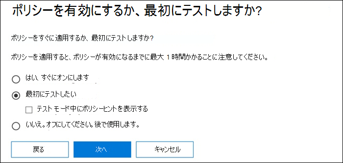
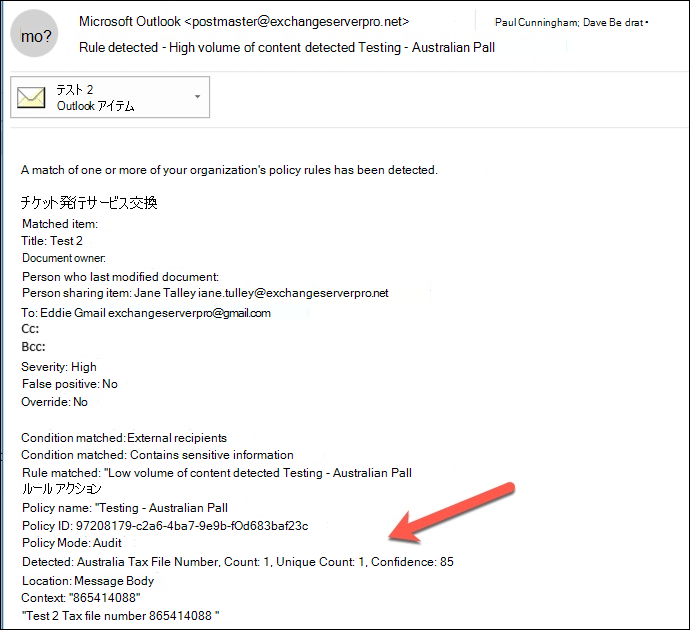
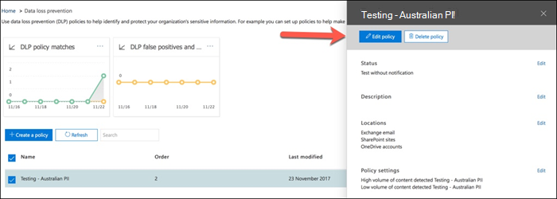
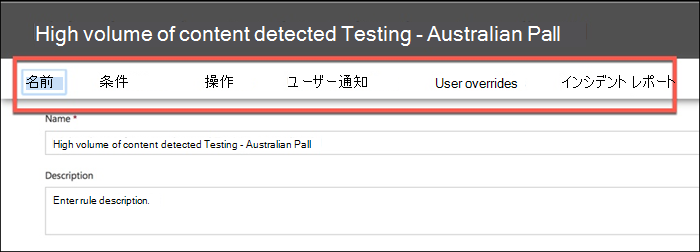
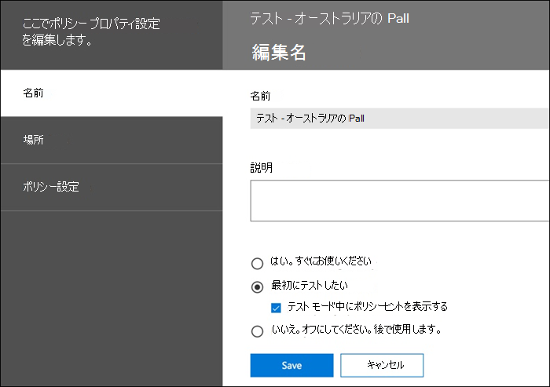
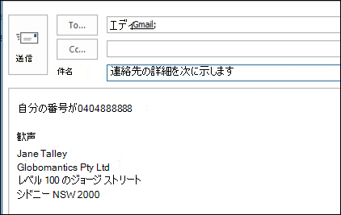
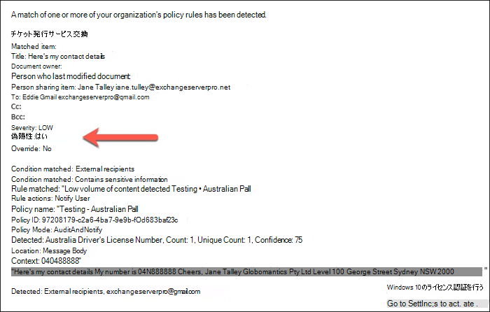

# <a name="create-test-and-tune-a-dlp-policy"></a>DLP ポリシーの作成、テスト、調整

Microsoft Purview データ損失防止 (DLP) は、機密情報の意図しないまたは偶発的な共有を防ぐのに役立ちます。

DLP は、クレジット カード番号などの機密情報について電子メール メッセージとファイルを調べます。 DLP を使用することで機密情報を検出し、次のようなアクションを実行できます。

- 監査目的でイベントを記録する
- 電子メールを送信またはファイルを共有しているエンド ユーザーに警告を表示する
- メールまたはファイルの共有の実行を積極的にブロックする

## <a name="permissions"></a>アクセス許可

DLP ポリシーを作成するコンプライアンス チームのメンバーは、コンプライアンス センターへのアクセス許可を持っている必要があります。 既定では、テナント管理者は、コンプライアンス担当者や他のユーザーにアクセス権を付与できます。 次の手順を実行します。
  
1. Microsoft 365 でグループを作成して、コンプライアンス責任者を追加します。
    
2. Microsoft Purview コンプライアンス ポータルの **[アクセス許可]** ページで役割グループを作成します。 

3. 役割グループを作成するときに、[ロールの **選択** ] セクションを使用して、役割グループに次のロールを追加します。 **DLP コンプライアンス管理**。
    
4. **メンバーの選択** セクションを使用して、以前に作成した Microsoft 365 グループを役割グループに追加します。

**表示専用 DLP コンプライアンス管理** ロールを使用して、DLP ポリシーと DLP レポートに対する表示専用特権を持つロール グループを作成します。

詳細については、「[Give users access to the Office 365 Security & Compliance Center (Office 365 セキュリティ/コンプライアンス センターへのアクセス権をユーザーに付与する)](../security/office-365-security/grant-access-to-the-security-and-compliance-center.md)」を参照してください。
  
これらのアクセス許可は、ポリシーを適用しないように DLP ポリシーを作成して適用するために必要です。

### <a name="roles-and-role-groups-in-preview"></a>プレビュー段階の [役割と役割グループ]

プレビューには、アクセス制御を微調整するためにテストできる役割と役割グループがあります。

プレビュー段階の該当する役割の一覧を次に示します。 詳細については、「[セキュリティとコンプライアンス センターの役割](../security/office-365-security/permissions-in-the-security-and-compliance-center.md#roles-in-the-security--compliance-center)」を参照してください。

- Information Protection 管理者
- Information Protection アナリスト
- Information Protection 調査員
- Information Protection 閲覧者

プレビュー段階の該当する役割グループの一覧を次に示します。 詳細については、「[セキュリティとコンプライアンス センターの役割グループ](../security/office-365-security/permissions-in-the-security-and-compliance-center.md#role-groups-in-the-security--compliance-center)」を参照してください。

- 情報保護
- Information Protection レベル
- Information Protection アナリスト
- Information Protection 調査担当者
- Information Protection 閲覧者

## <a name="how-sensitive-information-is-detected-by-dlp"></a>DLP による機密情報の検出方法

DLP は、正規表現 (RegEx) パターン マッチングによって機密情報を検索します。これは、特定のキーワードと照合パターンの近接性などの他のインジケーターと組み合わせて使用されます。 たとえば、VISA クレジット カード番号には 16 桁の数字があります。 ただし、これらの数字は、1111-1111-1111-1111、1111 1111 1111 1111 1111、1111111111111111など、さまざまな方法で記述できます。

16 桁の文字列は必ずしもクレジット カード番号ではなく、ヘルプ デスク システムのチケット番号か、ハードウェアのシリアル番号である可能性があります。 クレジット カード番号と無害な 16 桁の数字列の違いを判断するために計算が実行され (チェックサム)、番号がさまざまなクレジット カード ブランドの既知のパターンに一致することを確認します。

DLP で"VISA" や "AMEX" などのキーワード (クレジット カードの有効期限の可能性がある近い日付の値) が見つかると、DLP はそのデータを使用して、文字列がクレジット カード番号であるかどうかを判断するのに役立ちます。

言い換えると、DLP は電子メール内のこれら 2 つのテキスト文字列の違いを認識するのに十分スマートです。

- "新しいノート PC を注文してください。 私のVISA 番号 1111-1111-1111-1111、有効期限 11/22 を使用し、お持ちの場合は見積もり配送日を送信してください。
- "ノート PC のシリアル番号は 2222-2222-2222 で、2010 年 11 月に購入されました。 ところで、旅行用のビザはまだ承認されていますか?

各 [情報の種類](sensitive-information-type-entity-definitions.md) の検出方法を説明する機密情報の種類エンティティ定義を参照してください。

## <a name="where-to-start-with-data-loss-prevention"></a>データ損失防止を開始する場所

データ漏洩のリスクが完全に明らかではない場合、DLP の実装をどこから始めるべきかを正確に判断することは困難です。 さいわい、DLP ポリシーは "テスト モード" で実行できるため、有効にする前に、その有効性と正確性を測定できます。

Exchange Online の DLP ポリシーは、Exchange 管理センターを介して管理できます。 ただし、Microsoft Purview コンプライアンス ポータルを通じてすべてのワークロードの DLP ポリシーを構成できるので、この記事のデモンストレーションに使用します。 Microsoft Purview コンプライアンス ポータルでは、**データ損失防止** > ポリシーの下に DLP **ポリシー** があります。 [開始 **するポリシーの作成** ] を選択します。

Microsoft 365 には、ポリシーの作成に使用できる [さまざまな DLP ポリシー テンプレート](what-the-dlp-policy-templates-include.md) が用意されています。 例えば、ここがオーストラリアの企業だとしましょう。 オーストラリアのテンプレートをフィルター処理し、財務、医療、健康、プライバシーを選択できます。


このデモンストレーションでは、オーストラリアの個人を特定できる情報 (PII) データを選択します。これには、オーストラリアのタックス ファイル ナンバー (TFN) および運転免許証番号の情報の種類が含まれます。


新しい DLP ポリシーに名前を付けます。 規定の名前は DLP ポリシー テンプレートと一致しますが、同じテンプレートから複数のポリシーを作成できるため、よりわかりやすい独自の名前を選択する必要があります。


ポリシーを適用する場所を選択します。 DLP ポリシーは Exchange Online、SharePoint Online、および OneDrive for Business に適用できます。 すべての場所に適用するようにこのポリシーを構成したままにする予定です。


最初の **ポリシー設定** 手順では、今のところ既定値をそのまま使用します。 DLP ポリシーはカスタマイズできますが、既定値は開始するのに最適な場所です。


[次へ]、[** ] をクリックすると、その他のカスタマイズ オプションを含む[ **ポリシー設定]** ページが表示されます。 テストしているポリシーの場合、ここから調整を開始できます。

- 現時点ではポリシー ヒントをオフにしています。これは、テストを行っているだけであってまだユーザーに何も表示したくない場合に行う合理的な手順です。 ポリシー ヒントは、ユーザーに対して DLP ポリシーに違反しようとしているという警告を表示します。 たとえば Outlook ユーザーには添付したファイルにクレジット カード番号が含まれているという警告が表示され、メールが拒否されます。 ポリシーヒントの目標は、準拠していない動作が発生する前に停止することです。
- また、インスタンスの数を 10 から 1 に減らすことで、このポリシーがデータの一括共有だけでなくオーストラリアの PII データの共有を検出できるようにしました。
- また、インシデント レポートのメールに別の受信者を追加しました。


最後に、最初はテスト モードで実行するようにこのポリシーを構成しました。 ここには、テスト モード中にポリシー ヒントを無効にするオプションもあります。 これにより、ポリシー内でポリシー ヒントを有効にする柔軟性が得られますが、それらを表示するか非表示にするかをテスト中に決定します。



最後のレビュー画面で、[ **作成** ] をクリックしてポリシーの作成を完了します。

## <a name="test-a-dlp-policy"></a>DLP ポリシーをテストする

通常のユーザー アクティビティによってポリシーがトリガーされるのを待ったり、自分でトリガーしたりすることもできます。 以前は [、機密情報の種類のエンティティ定義](sensitive-information-type-entity-definitions.md)にリンクしました。これにより、DLP 一致をトリガーする方法に関する情報が提供されます。

例として、この記事のために作成した DLP ポリシーはオーストラリアのタックス ファイル ナンバー (TFN) を検出します。 ドキュメントによると、一致は以下の基準に基づいています。


 
TFN 検出をかなりぶっきらぼうな方法で示すために、"Tax file number" という単語と近接する 9 桁の文字列を含む電子メールが問題なく通過します。 DLP ポリシーをトリガーしない理由は、9 桁の文字列が有効な TFN であり、無害な数値の文字列であることを示すチェックサムを渡す必要があるからです。


これに対して、"Tax file number" という単語とチェックサムを渡す有効な TFN を含む電子メールがポリシーをトリガーします。 実際には、私が使用している TFN は有効ではあるものの本物ではない TFN を生成する Web サイトから取得したものです。 このようなサイトは、DLP ポリシーをテストするときの最も一般的な間違いの 1 つは、無効でチェックサムを渡さない偽の番号を使用しているためです (したがって、ポリシーがトリガーされないため)。


インシデント レポートのメールには、検出された機密情報の種類、検出されたインスタンスの数、および検出の信頼レベルが含まれています。



DLP ポリシーをテスト モードのままにし、インシデント レポートの電子メールを分析すると、DLP ポリシーの正確性と、それが適用されたときの効果を感じ取ることができます。 インシデント レポートに加えて、[DLP レポートを使用](view-the-dlp-reports.md)してテナント全体でのポリシーの一致の集計ビューを表示できます。

## <a name="tune-a-dlp-policy"></a>DLP ポリシーを調整する

ポリシー ヒットを分析する際に、ポリシーの動作を調整する必要がある場合があります。 簡単な例として、電子メール内の 1 つの TFN が問題でないと判断する場合があります (デモのためにはまだ問題があると思いますが、2 つ以上のインスタンスは問題です)。 複数のインスタンスは、従業員が HR データベースから外部パーティ (外部会計サービスなど) に CSV エクスポートをメールで送信するなどの危険性を持ったシナリオである可能性があります。 間違いなく、検出してブロックしたいはずです。

コンプライアンス センターでは、既存のポリシーを編集して動作を調整できます。


 
ポリシーが特定のワークロードまたは特定のサイトおよびアカウントにのみ適用されるように、場所の設定を調整できます。


また、ポリシー設定を調整し、ニーズに合わせてルールを編集することもできます。


DLP ポリシー内でルールを編集する場合は、次のように変更できます。

- ルールをトリガーする機密データのインスタンスの種類および数を含む条件。
- コンテンツへのアクセス制限などの、実行されるアクション。
- ユーザー通知。メール クライアントまたは Web ブラウザーでユーザーに表示されるポリシー ヒントです。
- ユーザーオーバーライドは、ユーザーが電子メールまたはファイル共有を続行できるかどうかを決定します。
- 管理者に通知するためのインシデント レポート。



このデモンストレーションでは、ポリシーにユーザー通知を追加し (適切なユーザー認識トレーニングなしで行う場合には注意してください)、ユーザーがビジネス上の理由または誤検知としてフラグを立てることでポリシーを上書きすることを許可しました。 組織のポリシーに関する追加情報を含める場合や、質問がある場合はサポートに問い合わせるようユーザーに求める場合は、電子メールとポリシーヒントのテキストをカスタマイズすることもできます。


このポリシーには高ボリュームおよび低ボリュームの処理に関する 2 つのルールが含まれているため、必要なアクションでは必ず両方を編集してください。 これは、その特性に応じてケースを異なる方法で処理する機会となっています。 たとえば、低ボリューム違反への上書きは許可しても、高ボリューム違反への上書きは許可しない場合などです。


また、ポリシーに違反しているコンテンツへのアクセスを実際にブロックまたは制限したい場合には、そうするようにルールでアクションを構成する必要があります。


ポリシー設定へのこれらの変更を保存した後、ポリシーのメイン設定ページに戻り、ポリシーがテスト モードのときにユーザーにポリシー ヒントを表示するオプションを有効にする必要もあります。 これは、エンド ユーザーに DLP ポリシーを紹介し、生産性に影響を与える多数の誤検知のリスクを負うことなくユーザーの意識向上トレーニングを行う効果的な方法です。



サーバー側 (または必要に応じてクラウド側) では、さまざまな処理間隔により、変更がすぐに有効にならない場合があります。 ユーザーに新しいポリシー ヒントを表示する DLP ポリシーの変更を行っている場合、Outlook クライアントは 24 時間ごとにポリシーの変更をチェックするのでユーザーには変更がすぐに反映されない場合があります。 テストのためにスピードを上げたい場合には、このレジストリ修正を使用して [PolicyNudges キーから最終ダウンロードのタイムスタンプをクリア](https://support.microsoft.com/en-au/help/2823261/changes-to-a-data-loss-prevention-policy-don-t-take-effect-in-outlook?__hstc=18650278.46377037dc0a82baa8a30f0ef07a7b2f.1538687978676.1538693509953.1540315763430.3&__hssc=18650278.1.1540315763430&__hsfp=3446956451)できます。 Outlook は次回再起動してメール メッセージの作成を開始する際に、最新のポリシー情報をダウンロードします。

ポリシー ヒントを有効にしている場合、ユーザーは Outlook でヒントの表示を開始し、誤検知が発生した場合に報告することができます。


## <a name="investigate-false-positives"></a>誤検知を調査する

DLP ポリシー テンプレートは、すぐには完成しません。 自身の環境で誤検出が発生する可能性は高いため、DLP 展開への道を容易にし、適切なポリシーのテストおよび調整に時間をかけることが非常に重要です。

これが誤検知の例です。 このメールは無害です。 ユーザーは自分の携帯電話番号を誰かに提供し、メールに署名を含めています。


 
しかしユーザーには、メールに機密情報、具体的にはオーストラリアの運転免許証番号が含まれていることを警告するポリシー ヒントが表示されます。


ユーザーは誤検知を報告でき、管理者はそれが発生した理由を調べることができます。 インシデント レポートのメールには、誤検知のフラグが設定されています。



この運転免許証のケースは、掘り下げるにはちょうど良い例です。 この誤検知が発生した理由は、"Australian Driver's License" 型は、キーワード "Sydney nsw" に近い 300 文字以内の 9 桁の文字列 (10 桁の文字列の一部であっても) によってトリガーされるためです (大文字と小文字は区別されません)。 そのため、ユーザーがたまたまシドニーにいるという理由だけで、電話番号とメール署名によってトリガーされます。


1 つのオプションは、オーストラリアの運転免許証の情報の種類をポリシーから削除することです。 DLP ポリシー テンプレートの一部なのでそこに含まれていますが、強制的に使用する必要はありません。 運転免許証ではなくタックス ファイル ナンバーのみに関心がある場合には、削除して構いません。 たとえば、ポリシーの低ボリューム ルールからそれを削除しながらも、複数の運転免許証のリストがまだ検出されるように高ボリューム ルールにはそのままそれを残しておくことができます。
 
もう 1 つのオプションは、インスタンス数を増やして、複数のインスタンスがある場合にのみ、少量のドライバー ライセンスが検出されるようにすることです。


インスタンス数の変更に加えて、一致の精度 (または信頼レベル) を調整することもできます。 機密情報の種類に複数のパターンがある場合、ルールが特定のパターンのみに一致するように、ルールの一致の精度を調整できます。 たとえば、誤検出を減らすためにルールの一致の精度を設定して、最も高い信頼レベルを持つパターンのみと一致するようにできます。 信頼レベルの詳細については、「信頼レベル [を使用してルールを調整する方法」を参照してください](data-loss-prevention-policies.md#match-accuracy)。

最後に、もう少し高度な情報を取得する場合は、任意の機密情報の種類をカスタマイズできます。たとえば、 [オーストラリアのドライバー ライセンス番号](sit-defn-australia-drivers-license-number.md)のキーワードの一覧から "シドニー NSW" を削除して、上記でトリガーされた誤検知を排除できます。 XML と PowerShell を使用してこれを行う方法については、 [組み込みの機密情報の種類のカスタマイズ](customize-a-built-in-sensitive-information-type.md)に関するページを参照してください。

## <a name="turn-on-a-dlp-policy"></a>DLP ポリシーを有効にする

DLP ポリシーが機密情報の種類を正確かつ効果的に検出し、エンド ユーザーが設定されたポリシーに対処する準備ができていることに満足したら、ポリシーを有効にできます。


 
ポリシーがいつ有効になるかを確認する場合は、 [セキュリティ & コンプライアンス PowerShell に接続](/powershell/exchange/connect-to-scc-powershell) し、 [Get-DlpCompliancePolicy コマンドレット](/powershell/module/exchange/get-dlpcompliancepolicy) を実行して DistributionStatus を表示します。

 ```powershell
 Get-DlpCompliancePolicy "Testing -Australia PII" -DistributionDetail | Select distributionstatus
 ```
DLP ポリシーをオンにした後、独自の最終テストをいくつか実行し、予想されるポリシー アクションが発生していることを確認する必要があります。 クレジット カード データなどをテストしようとしている場合、チェックサムを通過しポリシーをトリガーするサンプルのクレジット カードやその他の個人情報を生成する方法についての情報を掲載した Web サイトがオンラインにあります。

ユーザーによる上書きを許可するポリシーは、ポリシー ヒントの一部としてユーザーにそのオプションを提示します。


コンテンツを制限するポリシーは、ポリシー ヒントの一部としてユーザーに警告を表示しユーザーがメールを送信できないようにします。


## <a name="summary"></a>概要

データ損失防止ポリシーは、あらゆるタイプの組織に役立ちます。 一部の DLP ポリシーのテストは、ポリシーのヒント、エンドユーザーのオーバーライド、インシデント レポートなどの制御により、リスクの低い演習です。 一部の DLP ポリシーを静かにテストし、組織で既に発生している違反の種類を確認し、誤検知率の低いポリシーを作成し、許可されているものと許可されていないものについてユーザーを教育し、DLP ポリシーを組織へとロールアウトします。
