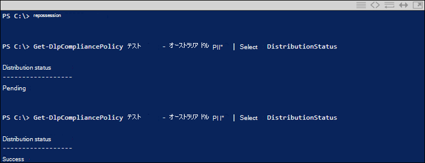

# DLP ポリシーの作成、テスト、調整

データ損失防止 (DLP) は、機密情報の意図しない共有や偶発的な共有を防ぐのに役立ちます。

DLP は、電子メール メッセージとファイルを調べて、クレジット カード番号などの機密情報を調べる。 DLP を使用することで機密情報を検出し、次のようなアクションを実行できます。

- 監査目的でイベントを記録する
- 電子メールを送信またはファイルを共有しているエンド ユーザーに警告を表示する
- メールまたはファイルの共有の実行を積極的にブロックする

## アクセス許可

DLP ポリシーを作成するコンプライアンス チームのメンバーは、コンプライアンス センターへのアクセス許可を持っている必要があります。 既定では、テナント管理者はコンプライアンス担当者や他のユーザーにアクセス権を付与できます。 次の手順を実行します。
  
1. Microsoft 365 でグループを作成して、コンプライアンス責任者をグループに追加します。
    
2. セキュリティ &amp; コンプライアンス センターの [**アクセス許可**] ページで役割グループを作成します。 

3. 役割グループの作成中に、[役割の選択] セクションを使用して、役割グループに次の役割を追加 **します**。
    
4. **メンバーの選択** セクションを使用して、以前に作成した Microsoft 365 グループを役割グループに追加します。

[表示のみ **] DLP コンプライアンス管理** 役割を使用して、DLP ポリシーおよび DLP レポートに対する表示専用の権限を持つ役割グループを作成します。

詳細については、「[Give users access to the Office 365 Security & Compliance Center (Office 365 セキュリティ/コンプライアンス センターへのアクセス権をユーザーに付与する)](../security/office-365-security/grant-access-to-the-security-and-compliance-center.md)」を参照してください。
  
ポリシーを適用しない DLP ポリシーを作成して適用するには、これらのアクセス許可が必要です。

## DLP による機密情報の検出方法

DLP は、正規表現 (RegEx) パターンマッチングによって、特定のキーワードと一致するパターンとの近接性などの他のインジケーターと組み合わせて機密情報を検索します。 たとえば、VISA クレジット カード番号の桁数は 16 桁です。 ただし、これらの数字は、1111-1111-1111-1111、1111 1111 1111 1111、1111111111111111 など、さまざまな方法で記述できます。

16 桁の文字列は、必ずしもクレジット カード番号ではなく、ヘルプ デスク システムからのチケット番号、またはハードウェアのシリアル番号である可能性があります。 クレジット カード番号と無害な 16 桁の数字列の違いを判断するために計算が実行され (チェックサム)、番号がさまざまなクレジット カード ブランドの既知のパターンに一致することを確認します。

DLP が"VISA" や "AMEX" などのキーワード (クレジット カードの有効期限になる可能性のある近日の値) を検出した場合、DLP は、そのデータを使用して、文字列がクレジット カード番号であるかどうかを判断します。

つまり、DLP は、電子メール内の次の 2 つの文字列の違いを認識するのに十分スマートです。

- 「新しいノート PC を注文できます。 自分の VISA 番号 1111-1111-1111-1111、有効期限 11/22 を使用し、お持ちになったときに推定配信日を送信してください。
- 「ノート PC のシリアル番号は 2222-2222-2222-2222 で、2010 年 11 月 11 日に購入されました。 ところで、私の旅行ビザはまだ承認されていますか?

各 [情報の種類が検出される方法](sensitive-information-type-entity-definitions.md) については、「機密情報の種類エンティティ定義」を参照してください。

## データ損失防止を開始する場所

データ漏洩のリスクが完全に明らかではない場合、DLP の実装をどこから始めるべきかを正確に判断することは困難です。 幸い、DLP ポリシーは "テスト モード" で実行でき、有効にする前に効果と精度を測定できます。

Exchange Online の DLP ポリシーは、Exchange 管理センターを介して管理できます。 ただし、セキュリティ/コンプライアンス センターを介してすべてのワークロードの DLP ポリシーを構成できるため、この記事のデモではこれを使用します。 セキュリティ セキュリティ & コンプライアンス センターには、[データ損失防止ポリシー] の下に DLP **ポリシーがあります**  >  。 [開始 **するポリシーの作成** ] を選択します。

Microsoft 365ポリシーの作成に使用できる[さまざまな DLP](what-the-dlp-policy-templates-include.md)ポリシー テンプレートが提供されます。 例えば、ここがオーストラリアの企業だとしましょう。 オーストラリアのテンプレートをフィルター処理し、[財務]、[医療と健康]、および [プライバシー] を選択できます。

このデモンストレーションでは、オーストラリアの個人を特定できる情報 (PII) データを選択します。これには、オーストラリアのタックス ファイル ナンバー (TFN) および運転免許証番号の情報の種類が含まれます。

新しい DLP ポリシーに名前を付けます。 規定の名前は DLP ポリシー テンプレートと一致しますが、同じテンプレートから複数のポリシーを作成できるため、よりわかりやすい独自の名前を選択する必要があります。

ポリシーを適用する場所を選択します。 DLP ポリシーは Exchange Online、SharePoint Online、および OneDrive for Business に適用できます。 このポリシーは、すべての場所に適用されるように構成したまま残します。

最初の [**ポリシー] 設定、** 今のところ既定値を受け入れる必要があります。 DLP ポリシーをカスタマイズできますが、既定の設定は開始する場合に便利です。

[次へ] をクリックすると、[ポリシー] ページが表示され **設定カスタマイズ** オプションが表示されます。 テストしているポリシーの場合、ここから調整を開始できます。

- 現時点ではポリシー ヒントをオフにしています。これは、テストを行っているだけであってまだユーザーに何も表示したくない場合に行う合理的な手順です。 ポリシー ヒントは、ユーザーに対して DLP ポリシーに違反しようとしているという警告を表示します。 たとえば Outlook ユーザーには添付したファイルにクレジット カード番号が含まれているという警告が表示され、メールが拒否されます。 ポリシー ヒントの目的は、非準拠の動作が発生する前に停止します。
- また、インスタンスの数を 10 から 1 に減らすことで、このポリシーがデータの一括共有だけでなくオーストラリアの PII データの共有を検出できるようにしました。
- また、インシデント レポートのメールに別の受信者を追加しました。

最後に、最初はテスト モードで実行するようにこのポリシーを構成しました。 ここには、テスト モード中にポリシー ヒントを無効にするオプションもあります。 これにより、ポリシー内でポリシー ヒントを有効にする柔軟性が得られますが、それらを表示するか非表示にするかをテスト中に決定します。

最後のレビュー画面で、[作成] **をクリックして** ポリシーの作成を完了します。

## DLP ポリシーをテストする

通常のユーザー アクティビティによってポリシーがトリガーされるのを待つか、自分でトリガーを試みてください。 以前は、DLP 一致 [をトリガーする](sensitive-information-type-entity-definitions.md)方法に関する情報を提供する機密情報の種類エンティティ定義にリンクしました。

例として、この記事のために作成した DLP ポリシーはオーストラリアのタックス ファイル ナンバー (TFN) を検出します。 ドキュメントによると、一致は以下の基準に基づいています。

 
TFN 検出をかなり鈍い方法で示す場合、"Tax file number" という単語と近接する 9 桁の文字列を含む電子メールは問題なく送信されます。 DLP ポリシーをトリガーしない理由は、9 桁の文字列が有効な TFN であり、数字の無害な文字列ではなく、有効な TFN を示すチェックサムを渡す必要があるからです。

一方、"Tax file number" という単語と、チェックサムを渡す有効な TFN を含むメールがポリシーをトリガーします。 実際には、私が使用している TFN は有効ではあるものの本物ではない TFN を生成する Web サイトから取得したものです。 このようなサイトは、DLP ポリシーをテストする際に最も一般的な間違いの 1 つが、無効でチェックサムを渡す偽の番号を使用している (したがって、ポリシーをトリガーしない) ため便利です。

インシデント レポートのメールには、検出された機密情報の種類、検出されたインスタンスの数、および検出の信頼レベルが含まれています。

DLP ポリシーをテスト モードのままにしてインシデント レポートのメールを分析すると、DLP ポリシーの正確性およびそれが適用されたときの効果について感触をつかむことができます。 インシデント レポートに加えて、[DLP レポートを使用](view-the-dlp-reports.md)してテナント全体でのポリシーの一致の集計ビューを表示できます。

## DLP ポリシーを調整する

ポリシーヒットを分析する場合は、ポリシーの動作を調整する必要があります。 簡単な例として、電子メール内の 1 つの TFN が問題ではないと判断する場合があります (これはまだだと思いますが、デモンストレーションのためにそれを使用します)、2 つ以上のインスタンスが問題です。 複数のインスタンスは、従業員が HR データベースから外部パーティ (外部会計サービスなど) に CSV エクスポートをメールで送信するなどの危険性を持ったシナリオである可能性があります。 間違いなく、検出してブロックしたいはずです。

コンプライアンス センターでは、既存のポリシーを編集して動作を調整できます。

 
ポリシーが特定のワークロードまたは特定のサイトおよびアカウントにのみ適用されるように、場所の設定を調整できます。

また、ポリシー設定を調整し、ニーズに合わせてルールを編集することもできます。

DLP ポリシー内でルールを編集する場合は、次の変更を行います。

- ルールをトリガーする機密データのインスタンスの種類および数を含む条件。
- コンテンツへのアクセス制限などの、実行されるアクション。
- ユーザー通知。メール クライアントまたは Web ブラウザーでユーザーに表示されるポリシー ヒントです。
- ユーザーの上書きは、ユーザーが電子メールまたはファイル共有の続行を選択できるかどうかを決定します。
- 管理者に通知するためのインシデント レポート。

このデモンストレーションでは、ポリシーにユーザー通知を追加し (適切なユーザー認識トレーニングなしで行う場合には注意してください)、ユーザーがビジネス上の理由または誤検知としてフラグを立てることでポリシーを上書きすることを許可しました。 組織のポリシーに関する追加情報を含める場合や、ユーザーに質問がある場合はサポートへの連絡を求める場合は、電子メールとポリシーヒントのテキストをカスタマイズすることもできます。

このポリシーには高ボリュームおよび低ボリュームの処理に関する 2 つのルールが含まれているため、必要なアクションでは必ず両方を編集してください。 これは、その特性に応じてケースを異なる方法で処理する機会となっています。 たとえば、低ボリューム違反への上書きは許可しても、高ボリューム違反への上書きは許可しない場合などです。

また、ポリシーに違反しているコンテンツへのアクセスを実際にブロックまたは制限したい場合には、そうするようにルールでアクションを構成する必要があります。

ポリシー設定へのこれらの変更を保存した後、ポリシーのメイン設定ページに戻り、ポリシーがテスト モードのときにユーザーにポリシー ヒントを表示するオプションを有効にする必要もあります。 これは、エンド ユーザーに DLP ポリシーを紹介し、生産性に影響を与える多数の誤検知のリスクを負うことなくユーザーの意識向上トレーニングを行う効果的な方法です。

サーバー側 (または必要に応じてクラウド側) では、さまざまな処理間隔により、変更がすぐに有効にならない場合があります。 ユーザーに新しいポリシー ヒントを表示する DLP ポリシーの変更を行っている場合、Outlook クライアントは 24 時間ごとにポリシーの変更をチェックするのでユーザーには変更がすぐに反映されない場合があります。 テストのためにスピードを上げたい場合には、このレジストリ修正を使用して [PolicyNudges キーから最終ダウンロードのタイムスタンプをクリア](https://support.microsoft.com/en-au/help/2823261/changes-to-a-data-loss-prevention-policy-don-t-take-effect-in-outlook?__hstc=18650278.46377037dc0a82baa8a30f0ef07a7b2f.1538687978676.1538693509953.1540315763430.3&__hssc=18650278.1.1540315763430&__hsfp=3446956451)できます。 Outlook は次回再起動してメール メッセージの作成を開始する際に、最新のポリシー情報をダウンロードします。

ポリシー ヒントを有効にしている場合、ユーザーは Outlook でヒントの表示を開始し、誤検知が発生した場合に報告することができます。

## 誤検知を調査する

DLP ポリシー テンプレートは、そのままでは完璧ではありません。 自身の環境で誤検出が発生する可能性は高いため、DLP 展開への道を容易にし、適切なポリシーのテストおよび調整に時間をかけることが非常に重要です。

これが誤検知の例です。 このメールは、まったくの無害です。 ユーザーは自分の携帯電話番号を誰かに提供し、メールに署名を含めています。

 
しかしユーザーには、メールに機密情報、具体的にはオーストラリアの運転免許証番号が含まれていることを警告するポリシー ヒントが表示されます。

ユーザーは誤検知を報告でき、管理者はそれが発生した理由を調べることができます。 インシデント レポートのメールには、誤検知のフラグが設定されています。

この運転免許証のケースは、掘り下げるにはちょうど良い例です。 この誤検知が発生した理由は、"Sydney nsw" (大文字と小文字を区別しない) キーワードに 300 文字以内の任意の 9 桁の文字列 (10 桁の文字列の一部であるものも含む) によって "オーストラリアの運転免許証" 型がトリガーされるからです。 そのため、ユーザーがたまたまシドニーにいるという理由だけで、電話番号とメール署名によってトリガーされます。

1 つのオプションは、オーストラリアの運転免許証の情報の種類をポリシーから削除することです。 DLP ポリシー テンプレートの一部なのでそこに含まれていますが、強制的に使用する必要はありません。 運転免許証ではなくタックス ファイル ナンバーのみに関心がある場合には、削除して構いません。 たとえば、ポリシーの低ボリューム ルールからそれを削除しながらも、複数の運転免許証のリストがまだ検出されるように高ボリューム ルールにはそのままそれを残しておくことができます。
 
もう 1 つのオプションは、インスタンス数を増やして、少ないボリュームのドライバーのライセンスが複数のインスタンスがある場合にのみ検出される方法です。

インスタンス数の変更に加えて、一致の精度 (または信頼レベル) を調整することもできます。 機密情報の種類に複数のパターンがある場合、ルールが特定のパターンのみに一致するように、ルールの一致の精度を調整できます。 たとえば、誤検出を減らすためにルールの一致の精度を設定して、最も高い信頼レベルを持つパターンのみと一致するようにできます。 信頼度の詳細については、「信頼度を使用してルールを調整する方法 [」を参照してください](data-loss-prevention-policies.md#match-accuracy)。

最後に、もう少し高度な情報を取得する場合は、機密情報の種類をカスタマイズできます 。たとえば、オーストラリアの運転免許証番号のキーワードのリストから "Sydney NSW" を削除して、上記でトリガーされた誤検知を排除できます。  XML と PowerShell を使用してこれを行う方法については、「組み込みの機密情報の種類をカスタマイズする [」を参照してください](customize-a-built-in-sensitive-information-type.md)。

## DLP ポリシーを有効にする

DLP ポリシーが機密情報の種類を正確かつ効果的に検出し、エンド ユーザーが設定されたポリシーに対処する準備ができていることに満足したら、ポリシーを有効にできます。

 
ポリシーを有効にする時期を待っている場合には、[セキュリティ/コンプライアンス センターの PowerShell に接続し](/powershell/exchange/connect-to-scc-powershell)、[Get-DlpCompliancePolicy コマンドレット](/powershell/module/exchange/get-dlpcompliancepolicy)を実行して DistributionStatus を確認します。

DLP ポリシーをオンにした後、独自の最終テストをいくつか実行し、予想されるポリシー アクションが発生していることを確認する必要があります。 クレジット カード データなどをテストしようとしている場合、チェックサムを通過しポリシーをトリガーするサンプルのクレジット カードやその他の個人情報を生成する方法についての情報を掲載した Web サイトがオンラインにあります。

ユーザーによる上書きを許可するポリシーは、ポリシー ヒントの一部としてユーザーにそのオプションを提示します。

コンテンツを制限するポリシーは、ポリシー ヒントの一部としてユーザーに警告を表示しユーザーがメールを送信できないようにします。

## 概要

データ損失防止ポリシーは、あらゆるタイプの組織に役立ちます。 一部の DLP ポリシーのテストは、ポリシー ヒント、エンド ユーザーの上書き、インシデント レポートなど、コントロールが原因でリスクが低い演習です。 一部の DLP ポリシーを静かにテストし、組織で既に発生している違反の種類を確認し、誤検知率の低いポリシーを作成し、許可されているものと許可されていないものについてユーザーを教育し、DLP ポリシーを組織へとロールアウトします。
