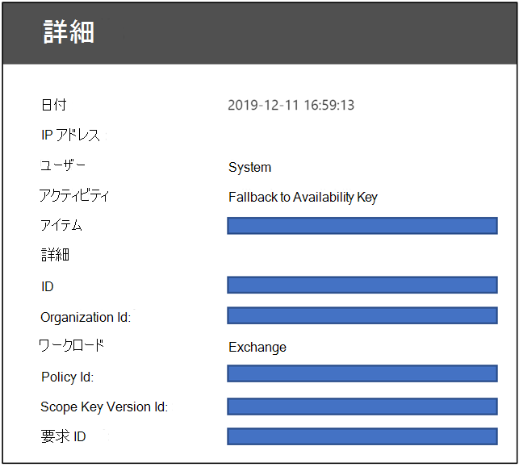

# カスタマー キーの可用性キーの詳細

可用性キーは、データ暗号化ポリシーを作成するときに自動的に生成およびプロビジョニングされるルート キーです。 Microsoft 365を保存し、保護します。 可用性キーは、カスタマー キーを使用してサービスの暗号化を行う 2 つのルート キーと機能的に似た機能を持つ。 可用性キーは、キー階層の下位 1 層のキーをラップします。 Azure Key Vault で提供および管理するキーとは異なり、可用性キーに直接アクセスすることはできません。 Microsoft 365サービスは、可用性キーをプログラムで管理します。 これらのサービスは、可用性キーへの直接アクセスを伴う自動操作を開始します。

可用性キーの主な目的は、管理するルート キーの不当な損失からの回復機能を提供します。 損失は、不正な処理や悪意のあるアクションの結果である可能性があります。 ルート キーの制御が失われる場合は、Microsoft サポートに問い合わせ、可用性キーを使用した回復プロセスを支援します。 可用性キーを使用して、プロビジョニングする新しいルート キーを使用して新しいデータ暗号化ポリシーに移行します。

Storageの管理と管理は、次の 3 つの理由で Azure Key Vault キーとは意図的に異なります。

- 可用性キーは、両方の Azure Key Vault キーの制御が失われた場合に、回復機能 "break-glass" 機能を提供します。
- 論理コントロールとセキュリティで保護された記憶域の場所を分離すると、詳細な防御が提供され、1 回の攻撃または障害点からすべてのキーとデータが失われるのを防います。
- 可用性キーは、一時的なエラーが原因Microsoft 365 Azure Key Vault でホストされているキーにアクセスできない場合に、高可用性機能を提供します。 このルールは、サービスの暗号化Exchange OnlineおよびSkype for Businessにのみ適用されます。 SharePointオンライン、OneDrive for Business、Teamsファイルは、回復プロセスを開始するように明示的に Microsoft に指示しない限り、可用性キーを使用しない。

キー管理にさまざまな保護とプロセスを使用して、データを保護する責任を共有することで、最終的に、すべてのキー (したがってデータ) が完全に失われたり破棄されるリスクが軽減されます。 Microsoft は、サービスを離れる際に可用性キーの無効化または破棄に関する唯一の権限を提供します。 設計上、Microsoft の誰も可用性キーにアクセスできないようになっています。Microsoft 365 のサービス コードからアクセスする必要があります。

キーを [セキュリティで保護する方法の詳細については、「Microsoft](https://www.microsoft.com/trustcenter/Privacy/govt-requests-for-data) Trust Center」を参照してください。
  
## 可用性キーの使用

可用性キーは、外部の男性要素または悪意のあるインサイダーがキー コンテナーの制御を盗むシナリオ、または誤った管理によってルート キーが失われるシナリオの回復機能を提供します。 この回復機能は、顧客キーと互換性Microsoft 365すべてのサービスに適用されます。 個々のサービスでは、可用性キーの使い方が異なります。 Microsoft 365は、以下の方法でのみ可用性キーを使用します。

### Exchange OnlineとSkype for Business使用

回復機能に加えて、Exchange Online および Skype for Business は可用性キーを使用して、ルート キーにアクセスするサービスに関連する一時的な、または断続的な運用上の問題の間にデータが利用可能な状態を確保します。 一時的なエラーにより、サービスが Azure Key Vault のカスタマー キーに到達できない場合、サービスは可用性キーを自動的に使用します。 サービスは可用性キーに直接行く必要があります。

Exchange Online および Skype for Business の自動化されたシステムは、一時的なエラー時に可用性キーを使用して、ウイルス対策、電子検出、データ損失防止、メールボックスの移動、データ インデックス作成などの自動化されたバック エンド サービスをサポートすることがあります。

### SharePointオンライン、OneDrive for Business、およびTeams使用

SharePoint Online、OneDrive for Business、および Teams ファイルの場合、可用性キーは回復機能の外部では使用されません。回復シナリオ中に可用性キーの使用を開始するように明示的に Microsoft に指示する必要があります。 自動サービス操作は、Azure Key Vault のカスタマー キーのみに依存します。 これらのサービスのキー階層のしくみの詳細については[、「How SharePoint Online、OneDrive for Business、](#how-sharepoint-online-onedrive-for-business-and-teams-files-use-the-availability-key)および Teams ファイルが可用性キーを使用する方法」を参照してください。

## 可用性キーのセキュリティ

Microsoft は、可用性キーをインスタンス化し、それを保護するための広範な措置を講じ、データ保護の責任をユーザーと共有します。 Microsoft は、可用性キーの直接制御を顧客に公開しない。 たとえば、Azure Key Vault で所有しているキーのみをロール (回転) できます。 詳細については、「顧客キーまたは可用性 [キーのロールまたはローテーション」を参照してください](customer-key-availability-key-roll.md)。

### 可用性キーシークレット ストア

Microsoft は、アクセス制御された内部シークレット ストア (顧客向け Azure Key Vault など) の可用性キーを保護します。 Microsoft 管理者が内に含まれるシークレットに直接アクセスするのを防ぐため、アクセス制御を実装しています。 キーのローテーションや削除を含むシークレット ストア操作は、可用性キーへの直接アクセスを必要としない自動コマンドを使用して実行されます。 シークレット ストア管理操作は特定のエンジニアに限定され、内部ツール Lockbox を介して特権エスカレーションが必要です。 特権のエスカレーションには、付与される前に管理者の承認と正当化が必要です。 Lockbox は、時間の有効期限が切れ、またはエンジニアがログアウトすると、アクセスが自動アクセス失効によって時間にバインドされます。

**Exchange OnlineおよびSkype for Business** 可用性キーは、Active Directory シークレット ストアExchange Online格納されます。 可用性キーは、Active Directory ドメイン コントローラー内のテナント固有のコンテナー内に安全に格納されます。 このセキュリティで保護されたストレージの場所は、SharePoint ファイル シークレット ストアSharePoint、OneDrive for Business、Teams分離されます。

**SharePointオンライン、OneDrive for Business、Teams** ファイルの可用性キーは、サービス チームによって管理される内部シークレット ストアに格納されます。 このセキュリティで保護されたシークレット ストレージ サービスには、アプリケーション エンドポイントを持つフロントエンド サーバーと、SQL Databaseが含まれます。 可用性キーは SQL Database に格納され、AES-256 と HMAC の組み合わせを使用して保存時の可用性キーを暗号化するシークレット ストア暗号化キーによってラップ (暗号化) されます。 シークレット ストアの暗号化キーは、同じ SQL Database の論理的に分離されたコンポーネントに格納され、Microsoft 証明機関 (CA) によって管理される証明書に含まれる RSA-2048 キーでさらに暗号化されます。 これらの証明書は、データベースに対して操作を実行するシークレット ストア フロントエンド サーバーに格納されます。

### 詳細な防御

Microsoft は、悪意のあるアクターが Microsoft Cloud に保存されている顧客データの機密性、整合性、または可用性に影響を与えるのを防ぐため、詳細な防御戦略を採用しています。 包括的なセキュリティ戦略の一環として、シークレット ストアと可用性キーを保護するために、特定の予防および検出コントロールが実装されています。

Microsoft 365は、可用性キーの誤用を防ぐために構築されています。 アプリケーション層は、可用性キーを含むキーを使用してデータの暗号化と解読を行う唯一の方法です。 暗号化Microsoft 365復号化アクティビティのキー階層を解釈および走査できるのは、サービス コードのみです。 論理的な分離は、顧客キー、可用性キー、その他の階層キー、および顧客データの保存場所の間に存在します。 この分離により、1 つ以上の場所が侵害された場合にデータが漏洩するリスクが軽減されます。 階層内の各レイヤーには、格納されているデータとシークレットを保護するために 24 時間 365 日の侵入検出機能が組み込まれています。

アクセス制御は、可用性キー シークレット ストアを含む内部システムへの不正アクセスを防止するために実装されています。 Microsoft のエンジニアは、可用性キー シークレット ストアに直接アクセスできます。 アクセス制御の詳細については、「管理アクセス制御」を参照[Microsoft 365。](/compliance/assurance/assurance-administrative-access-controls-overview)

技術的な制御により、Microsoft の担当者は特権の高いサービス アカウントにログインすることを防止します。この場合、攻撃者がユーザーを偽装するために使用Microsoft サービス。 たとえば、これらのコントロールは対話型ログオンを防止します。

セキュリティ ログおよび監視制御は、セキュリティログとデータに対するリスクを軽減する、Microsoft サービス詳細な保護策です。 Microsoft サービス チームは、アラートと監査ログを生成するアクティブな監視ソリューションを展開しました。 すべてのサービス チームは、ログを集約して処理する中央リポジトリにログをアップロードします。 内部ツールはレコードを自動的に調べて、サービスが最適で回復力があり、安全な状態で機能しているのを確認します。 異常なアクティビティには、さらに確認のフラグが設定されています。

Microsoft セキュリティ ポリシーに違反する可能性を示すログ イベントは、直ちに Microsoft セキュリティ チームの注目を集めています。 Microsoft 365は、可用性キー シークレット ストアへのアクセス試行を検出するようにアラートを構成しました。 また、Microsoft の担当者がサービス アカウントへの対話型ログオンを試みる場合もアラートが生成されます。これは、アクセス制御によって禁止および保護されています。 Microsoft 365セキュリティは、通常のベースライン操作からのサービスのMicrosoft 365検出および通知も行います。 ユーザーサービスを悪用しようとするMicrosoft 365、Microsoft クラウド環境からの犯罪者の立ち退きを引き起こすアラートが発生します。

## 可用性キーを使用してキー損失から回復する

顧客キーの制御を失った場合、可用性キーを使用すると、データを回復して再暗号化できます。

### データの復元とExchange OnlineのSkype for Business

顧客キーの制御を失った場合、可用性キーを使用すると、データを回復し、影響を受けるリソースをオンラインMicrosoft 365戻す機能が提供されます。 可用性キーは、回復中も引き続きデータを保護します。大きなレベルでは、キー損失から完全に回復するには、新しい DEP を作成し、影響を受け取ったリソースを新しいポリシーに移動する必要があります。

新しい顧客キーを使用してデータを暗号化するには、Azure Key Vault で新しいキーを作成し、新しい顧客キーを使用して新しい DEP を作成し、キーが失われたり侵害された以前の DEP で現在暗号化されているメールボックスに新しい DEP を割り当てる必要があります。

この再暗号化プロセスには最大 72 時間かかる場合があります。 これは、DEP を変更する場合の標準の期間です。
  
### オンライン、SharePoint、およびOneDrive for BusinessファイルのTeams手順

オンライン SharePoint、OneDrive for Business、Teamsの場合、可用性キーは回復機能の外部では使用されません。 回復シナリオ中に可用性キーの使用を開始するように Microsoft に明示的に指示する必要があります。 回復プロセスを開始するには、Microsoft に問い合わせ、可用性キーをアクティブ化します。 アクティブ化されると、可用性キーが自動的に使用され、新しい顧客キーに関連付けられた新しく作成された DEP を使用してデータを暗号化できます。  

この操作は、組織内のサイトの数に比例します。 可用性キーを使用するために Microsoft に電話すると、約 4 時間以内に完全にオンラインになる必要があります。

## 可用性Exchange OnlineとSkype for Businessの使用方法

顧客キーを使用して DEP を作成すると、Microsoft 365に関連付けられたデータ暗号化ポリシー キー (DEP キー) が生成されます。 このサービスは、DEP キーを 3 回暗号化します。各顧客キーで 1 回、可用性キーを使用して 1 回暗号化します。 暗号化されたバージョンの DEP キーだけが格納され、DEP キーは顧客キーまたは可用性キーでのみ復号化できます。 次に、DEP キーを使用してメールボックス キーを暗号化し、個々のメールボックスを暗号化します。
  
Microsoft 365このプロセスに従って、顧客がサービスを使用している場合にデータを復号化して提供します。
  
1. 顧客キーを使用して DEP キーを復号化します。

2. 復号化された DEP キーを使用してメールボックス キーを復号化します。

3. 復号化されたメールボックス キーを使用してメールボックス自体を復号化し、メールボックス内のデータにアクセスできます。

## オンラインSharePoint、OneDrive for Business、Teams可用性キーの使用方法

カスタマー SharePointおよび可用性OneDrive for Businessのオンラインおよび実装のアーキテクチャと実装は、Exchange OnlineとSkype for Business。
  
組織が顧客管理キーに移動すると、Microsoft 365固有の中間キー (TIK) が作成されます。 Microsoft 365 TIK を 1 回、顧客キーごとに 2 回暗号化し、TIK の 2 つの暗号化されたバージョンを格納します。 暗号化されたバージョンの TIK だけが格納され、TIK は顧客キーでのみ暗号化解除できます。 次に、TIK を使用してサイト キーを暗号化し、BLOB キー (ファイル チャンク キーとも呼ばれる) を暗号化するために使用されます。 ファイル サイズに応じて、サービスはファイルを一意のキーで複数のファイル チャンクに分割する場合があります。 BLOB (ファイル チャンク) 自体は BLOB キーで暗号化され、BLOB ストレージ サービスMicrosoft Azure格納されます。
  
Microsoft 365このプロセスに従って、顧客がサービスを使用している場合に顧客ファイルを復号化して提供します。

1. 顧客キーを使用して TIK を復号化します。

2. 復号化された TIK を使用してサイト キーを復号化します。

3. 暗号化解除されたサイト キーを使用して、BLOB キーを復号化します。

4. 復号化された BLOB キーを使用して、BLOB を復号化します。

Microsoft 365オフセットを使用して Azure Key Vault に 2 つの復号化要求を発行して TIK を復号化します。 最初に終了すると、結果が表示されます。もう一方の要求はキャンセルされます。
  
顧客キーへのアクセスが失われる場合、Microsoft 365 は可用性キーを使用して TIK を暗号化し、これを各顧客キーで暗号化された TIK と共に格納します。 可用性キーで暗号化された TIK は、悪意のある、または誤ってキーへのアクセスを失った場合に、回復パスを登録するために Microsoft に電話した場合にのみ使用されます。
  
可用性とスケール上の理由から、復号化された TIK は時間制限付きメモリ キャッシュにキャッシュされます。 TIK キャッシュの有効期限が設定される 2 時間前に、Microsoft 365 TIK の暗号化解除を試みます。 TIK を復号化すると、キャッシュの有効期間が延長されます。 TIK 復号化が大量の時間失敗した場合、Microsoft 365前にエンジニアリングに通知するアラートが生成されます。 お客様が Microsoft を呼び出した場合にのみ、Microsoft 365 が回復操作を開始します。この操作では、Microsoft のシークレット ストアに保存されている可用性キーを使用して TIK を復号化し、復号化された TIK キーと顧客提供の Azure Key Vault キーの新しいセットを使用してテナントを再びオンボーディングします。
  
現在、カスタマー キーは、Azure BLOB ストアに格納されている SharePoint Online ファイル データの暗号化と復号化チェーンに関与していますが、SharePoint Online リスト アイテムや SQL Database に格納されているメタデータには関係しません。 Microsoft 365上記のケース以外の Exchange Online、Skype for Business、SharePoint Online、OneDrive for Business、Teams ファイルの可用性キーは使用されません。これはお客様が開始します。 顧客データへの人間のアクセスは、Customer Lockbox によって保護されます。

## 可用性キートリガー

Microsoft 365特定の状況でのみ可用性キーがトリガーされます。 これらの状況はサービスによって異なります。

### ユーザーとユーザーのExchange Onlineトリガー Skype for Business
  
1. Microsoft 365メールボックスが割り当てられている DEP を読み取り、Azure Key Vault の 2 つの顧客キーの場所を特定します。

2. Microsoft 365 DEP から 2 つの顧客キーのいずれかをランダムに選択し、顧客キーを使用して DEP キーのラップを解除する要求を Azure Key Vault に送信します。

3. 顧客キーを使用して DEP キーのラップを解除する要求が失敗した場合、Microsoft 365 は 2 番目の要求を Azure Key Vault に送信します。この場合は、代替 (2 番目) の顧客キーを使用するように指示します。

4. 顧客キーを使用して DEP キーをアンラップする 2 番目の要求が失敗した場合、Microsoft 365の結果を確認します。

    - システムエラーを返す要求が失敗したと判断された場合は、次の処理を行います。

       - Microsoft 365は、DEP キーを復号化するために可用性キーをトリガーします。

       - Microsoft 365 DEP キーを使用してメールボックス キーを復号化し、ユーザー要求を完了します。 

       - この場合、一時的なエラーが原因で Azure Key Vault が応答できないか、到達不能になります。

    - 要求が ACCESS DENIED の戻り値に失敗したと判断した場合は、次の処理を行います。

       - つまり、意図的、不注意、または悪意のあるアクションが実行され、顧客キーが使用不能になります (たとえば、サービスを離れる一部としてデータの削除プロセス中)。

       - この場合、可用性キーはシステムアクションにのみ使用され、ユーザーアクションには使用されません。ユーザー要求は失敗し、ユーザーはエラー メッセージを受け取ります。

> [!IMPORTANT]
> Microsoft 365サービス コードには、顧客データを理由として、価値を追加するクラウド サービスを提供する有効なログイン トークンが常に含まれます。 したがって、可用性キーが削除されるまでは、検索インデックスの作成やメールボックスの移動など、Exchange Online および Skype for Business によって開始される、または内部で開始されるアクションのフォールバックとして使用できます。 これは、Azure Key Vault に対する一時的な ERRORS 要求と ACCESS DENIED 要求の両方に適用されます。

### オンライン、SharePoint、およびOneDrive for BusinessファイルのTeamsトリガー

SharePoint Online、OneDrive for Business、および Teams ファイルの場合、可用性キーは回復機能の外部では使用されません。回復シナリオ中に可用性キーの使用を開始するように明示的に Microsoft に指示する必要があります。

## 監査ログと可用性キー

Microsoft 365自動システムは、システムを流れるすべてのデータを処理して、ウイルス対策、電子検出、データ損失防止、データ インデックス作成など、クラウド サービスを提供します。 Microsoft 365アクティビティの顧客に表示されるログは生成されません。 さらに、Microsoft の担当者は、これらの通常のシステム操作の一部としてデータにアクセスしない。

### Exchange OnlineおよびSkype for Business可用性キーログ

サービスExchange OnlineおよびSkype for Businessアクセスしてサービスを提供する場合、Microsoft 365セキュリティ とコンプライアンス センターからアクセス可能な顧客に表示されるログを発行します。 可用性キー操作の監査ログ レコードは、サービスが可用性キーを使用する度に生成されます。 アクティビティの種類が "フォールバック to 可用性キー" の "Customer Key Service Encryption"と呼ばれる新しいレコードの種類を使用すると、管理者は統合監査ログ検索結果をフィルター処理して可用性キー レコードを表示できます。

ログ レコードには、日付、時刻、アクティビティ、組織 ID、データ暗号化ポリシー ID などの属性が含まれます。 このレコードは統合監査ログの一部として使用できます。[コンプライアンス センター監査ログの検索] タブの [セキュリティ &からアクセスできます。

Exchange OnlineおよびSkype for Business可用性キー レコードは、Office 365 管理アクティビティ共通スキーマを使用し、カスタム パラメーター (ポリシー ID、スコープ キーバージョン ID、要求 ID) を追加します。

### SharePointオンライン、OneDrive for Business、およびTeamsファイル可用性キーログ

可用性キーのログは、これらのサービスでまだ利用できません。 オンラインSharePoint、OneDrive for Business、Teams ファイルの場合、可用性キーは回復の目的で Microsoft から指示された場合にのみアクティブ化されます。 その結果、これらのサービスで可用性キーが使用されるすべてのイベントが既にわかっています。

## 顧客キー階層の可用性キー
  
Microsoft 365可用性キーを使用して、顧客キー サービスの暗号化用に確立されたキー階層の下位のキー層をラップします。 サービス間には異なるキー階層が存在します。 また、キー アルゴリズムは、利用可能なキーと、該当する各サービスの階層内の他のキーによっても異なります。 さまざまなサービスで使用される可用性キー アルゴリズムは次のとおりです。

- 可用性Exchange OnlineおよびSkype for Businessは、AES-256 を使用します。

- オンラインSharePoint、OneDrive for Business、Teamsファイル可用性キーは RSA-2048 を使用します。

### 暗号化と暗号化のキーを暗号化するためにExchange Online暗号化Skype for Business

### オンラインと暗号化のキーを暗号化するためにSharePoint暗号化OneDrive for Business

## 関連記事

- [カスタマー キーによるサービスの暗号化](customer-key-overview.md)

- [顧客キーの設定](customer-key-set-up.md)

- [顧客キーの管理](customer-key-manage.md)

- [カスタマー キーまたは可用性キーをローリングまたはローテーションする](customer-key-availability-key-roll.md)