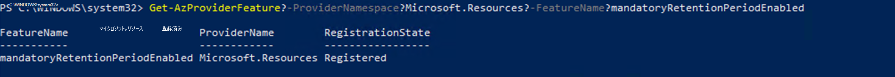

# <a name="set-up-customer-key"></a>カスタマー キーを設定する

[!include[Purview banner](../includes/purview-rebrand-banner.md)]

Customer Key を使用すると、組織の暗号化キーを制御し、それらを使用して Microsoft のデータ センターで保存データを暗号化するようにMicrosoft 365を構成します。 つまり、カスタマー キーを使用すると、顧客は自分のキーを使用して、自分に属する暗号化レイヤーを追加できます。

カスタマー キーを使用する前に Azure を設定します。 この記事では、必要な Azure リソースを作成して構成するために従う必要がある手順について説明し、カスタマー キーを設定する手順について説明します。 Azure を設定した後、組織内のさまざまなMicrosoft 365ワークロード間でデータを暗号化するために割り当てるポリシーとそのキーを決定します。 カスタマー キーの詳細については、または一般的な概要については、「[カスタマー キーを使用したサービスの暗号化Microsoft Purview](customer-key-overview.md)参照してください。
  
> [!IMPORTANT]
> この記事のベスト プラクティスに従うことを強くお勧めします。 これらは **TIP** と **IMPORTANT** と呼ばれます。 Customer Key を使用すると、組織全体と同じ範囲のルート暗号化キーを制御できます。 つまり、これらのキーを使用したミスは広範な影響を及ぼし、サービスの中断やデータの取り消し不可能な損失につながる可能性があります。
  
## <a name="before-you-set-up-customer-key"></a>カスタマー キーを設定する前に

開始する前に、組織に適した Azure サブスクリプションと M365/O365 ライセンスがあることを確認します。 有料の Azure サブスクリプションを使用する必要があります。 無料、試用版、スポンサーシップ、MSDN サブスクリプション、およびレガシ サポートのサブスクリプションを通じて取得したサブスクリプションは対象外です。

> [!IMPORTANT]
> M365 Customer Key を提供する有効な M365/O365 ライセンスは次のとおりです。
>
> - Office 365 E5
> - Microsoft 365 E5
> - Microsoft 365 E5 Compliance 
> - Microsoft 365 E5 Information Protection & ガバナンス SKU
> - FLW のセキュリティとコンプライアンスのMicrosoft 365

既存のOffice 365 Advanced Compliance ライセンスは引き続きサポートされます。

この記事の概念と手順については、[Azure Key Vault](/azure/key-vault/)のドキュメントを参照してください。 また、Azure [AD テナント](/previous-versions/azure/azure-services/jj573650(v=azure.100)#what-is-an-azure-ad-tenant)など、Azure で使用される用語についても理解してください。
  
ドキュメント以外のサポートが必要な場合は、Microsoft Consulting Services (MCS)、Premier Field Engineering (PFE)、または Microsoft パートナーにお問い合わせください。 ドキュメントを含む Customer Key に関するフィードバックを提供するには、アイデア、提案、およびパースペクティブを customerkeyfeedback@microsoft.com に送信します。
  
## <a name="overview-of-steps-to-set-up-customer-key"></a>カスタマー キーを設定する手順の概要

カスタマー キーを設定するには、一覧表示されている順序でこれらのタスクを実行します。 この記事の残りの部分では、各タスクの詳細な手順を説明するか、プロセスの各手順の詳細にリンクします。
  
**Azure とMicrosoft FastTrackの場合:**
  
これらのタスクのほとんどは、リモートでAzure PowerShellに接続することで完了します。 最適な結果を得るには、バージョン 4.4.0 以降のAzure PowerShellを使用します。
  
- [2 つの新しい Azure サブスクリプションを作成する](#create-two-new-azure-subscriptions)

- [Office 365のカスタマー キーをアクティブ化する要求を送信する](#submit-a-request-to-activate-customer-key-for-office-365)

- [必須の保有期間を使用するように Azure サブスクリプションを登録する](#register-azure-subscriptions-to-use-a-mandatory-retention-period)

  この登録プロセスが完了するまでに 5 営業日かかります。
- [対応する Microsoft エイリアスに問い合わせてプロセスを続行する](#contact-the-corresponding-microsoft-alias-to-proceed-with-the-process)

- [各サブスクリプションで Premium Azure Key Vaultを作成する](#create-a-premium-azure-key-vault-in-each-subscription)

- [各キー コンテナーにアクセス許可を割り当てる](#assign-permissions-to-each-key-vault)

- [キー コンテナーで論理的な削除が有効になっていることを確認する](#make-sure-soft-delete-is-enabled-on-your-key-vaults)

- [キーを作成またはインポートして、各キー コンテナーにキーを追加する](#add-a-key-to-each-key-vault-either-by-creating-or-importing-a-key)

- [キーの有効期限を確認する](#verify-expiration-date-of-your-keys)

- [キーの回復レベルを確認する](#check-the-recovery-level-of-your-keys)

- [Azure Key Vaultのバックアップ](#back-up-azure-key-vault)

- [各 Azure Key Vault キーの URI を取得する](#obtain-the-uri-for-each-azure-key-vault-key)
  
## <a name="complete-tasks-in-azure-key-vault-and-microsoft-fasttrack-for-customer-key"></a>顧客キーの Azure Key VaultとMicrosoft FastTrackでタスクを完了する

Azure Key Vaultでこれらのタスクを完了します。 Customer Key で使用するすべての DEP について、これらの手順を完了する必要があります。
  
### <a name="create-two-new-azure-subscriptions"></a>2 つの新しい Azure サブスクリプションを作成する

カスタマー キーには、2 つの Azure サブスクリプションが必要です。 ベスト プラクティスとして、カスタマー キーで使用する新しい Azure サブスクリプションを作成することをお勧めします。 Azure Key Vault キーは、同じAzure Active Directory (Microsoft Azure Active Directory) テナント内のアプリケーションに対してのみ承認できます。DEP が割り当てられる組織で使用されるのと同じ Azure AD テナントを使用して新しいサブスクリプションを作成する必要があります。 たとえば、組織内のグローバル管理者特権を持つ職場または学校アカウントを使用します。 詳細な手順については、「 [組織として Azure にサインアップする」を](/azure/active-directory/fundamentals/sign-up-organization)参照してください。
  
> [!IMPORTANT]
> Customer Key には、データ暗号化ポリシー (DEP) ごとに 2 つのキーが必要です。 これを実現するには、2 つの Azure サブスクリプションを作成する必要があります。 ベスト プラクティスとして、組織の個別のメンバーが各サブスクリプションで 1 つのキーを構成することをお勧めします。 これらの Azure サブスクリプションは、Office 365の暗号化キーを管理するためにのみ使用する必要があります。 これにより、オペレーターの 1 人が誤って、意図的に、または悪意を持って削除したり、責任を負うキーを誤って管理したりする場合に、組織を保護します。

組織に対して作成できる Azure サブスクリプションの数に実質的な制限はありません。 これらのベスト プラクティスに従うと、ヒューマン エラーの影響を最小限に抑える一方で、Customer Key で使用されるリソースの管理に役立ちます。
  
### <a name="submit-a-request-to-activate-customer-key-for-office-365"></a>Office 365のカスタマー キーをアクティブ化する要求を送信する

2 つの新しい Azure サブスクリプションを作成したら、[Microsoft FastTrack ポータル](https://fasttrack.microsoft.com/)で適切な Customer Key オファー要求を送信する必要があります。 組織内の承認された指定に関するオファーフォームで行う選択は重要であり、顧客キーの登録を完了するために必要です。 組織内で選択したロールの担当者は、Customer Key データ暗号化ポリシーで使用されるすべてのキーを取り消して破棄する要求の信頼性を確保します。 この手順は、組織で使用する顧客キー DEP の種類ごとに 1 回行う必要があります。

**FastTrack チームは、カスタマー キーのサポートを提供しません。Office 365は、FastTrack ポータルを使用してフォームを送信し、顧客キーの関連するオファーを追跡するのに役立ちます。FastTrack要求を送信したら、対応する Customer Key オンボード チームに連絡して、オンボード プロセスを開始します。**
  
顧客キーをアクティブ化するオファーを送信するには、次の手順を実行します。
  
1. 組織内のグローバル管理者アクセス許可を持つ職場または学校アカウントを使用して、[Microsoft FastTrack ポータル](https://fasttrack.microsoft.com/)にサインインします。

2. ログインしたら、適切なドメインを選択します。

3. 選択したドメインで、上部のナビゲーション バーから [ **サービスの要求** ] を選択し、使用可能なオファーの一覧を確認します。

4. 該当するオファーの情報カードを選択します。

   - **複数のMicrosoft 365 ワークロード:** **Microsoft 365 オファーの暗号化キーの要求ヘルプを** 選択します。

   - **Exchange OnlineとSkype for Business:** Exchange オファー **の暗号化キーの要求ヘルプを** 選択します。

   - **オンライン ファイル、OneDrive ファイル、Teams ファイルのSharePoint:** **SharePointとOneDrive for Businessオファーの暗号化キーの要求のヘルプを** 選択します。

5. オファーの詳細を確認したら、 **手順 2. に進みます**。

6. 該当するすべての詳細と要求された情報をオファー フォームに入力します。 暗号化キーとデータの永続的かつ不可逆的な破棄を承認することを承認する組織の役員の選択に特に注意してください。 フォームを完了したら、[送信] を選択 **します**。

### <a name="register-azure-subscriptions-to-use-a-mandatory-retention-period"></a>必須の保有期間を使用するように Azure サブスクリプションを登録する

ルート暗号化キーの一時的または永続的な損失は、サービス操作に破壊的または致命的な可能性があり、データが失われる可能性があります。 このため、Customer Key で使用されるリソースには強力な保護が必要です。 Customer Key で使用されるすべての Azure リソースは、既定の構成を超える保護メカニズムを提供します。 *必須の保持期間* に対して Azure サブスクリプションにタグ付けまたは登録できます。 必須の保持期間を指定すると、Azure サブスクリプションの即時かつ取り消し不可能な取り消しが防止されます。 必須の保持期間に Azure サブスクリプションを登録するために必要な手順では、Microsoft 365 チームとのコラボレーションが必要です。 このプロセスの完了には 5 営業日かかります。 以前は、必須の保持期間が "キャンセル不可" と呼ばれていました。
  
> [!IMPORTANT]
> Microsoft 365 チームに連絡する前に、Customer Key で使用する **Azure サブスクリプションごとに** 次の手順を実行する必要があります。 開始する前に[、Azure PowerShell Az](/powershell/azure/new-azureps-module-az) モジュールがインストールされていることを確認します。

1. Azure PowerShellでサインインします。 手順については、「[Azure PowerShellでサインイン](/powershell/azure/authenticate-azureps)する」を参照してください。

2. Register-AzProviderFeature コマンドレットを実行して、必須の保有期間を使用するようにサブスクリプションを登録します。 サブスクリプションごとにこのアクションを実行します。

   ```powershell
   Set-AzContext -SubscriptionId <SubscriptionId>
   Register-AzProviderFeature -FeatureName mandatoryRetentionPeriodEnabled -ProviderNamespace Microsoft.Resources
   ```

### <a name="contact-the-corresponding-microsoft-alias-to-proceed-with-the-process"></a>対応する Microsoft エイリアスに問い合わせてプロセスを続行する

>[!NOTE]
> 対応する Microsoft エイリアスに連絡する前に、M365 Customer Key のFastTrack要求が完了していることを確認します。

- 個々のExchange Online メールボックスに DEP を割り当てるカスタマー キーを有効にするには、[exock@microsoft.com](mailto:exock@microsoft.com) にお問い合わせください。

- すべてのテナント ユーザーに対して DEP を割り当てて SharePoint Online コンテンツとOneDrive for Businessコンテンツ (Teams ファイルを含む) を割り当てる場合は、[spock@microsoft.com](mailto:spock@microsoft.com) にお問い合わせください。

- すべてのテナント ユーザーに対して複数のMicrosoft 365ワークロード (Exchange Online、Teams、Microsoft Purview 情報保護) 間でコンテンツを暗号化するために DEP を割り当てるカスタマー キーを有効にするには、[m365-ck@service.microsoft.com](mailto:m365-ck@service.microsoft.com) にお問い合わせください。

- メールに次の情報を含めます。

     **件名**: Customer Key for for \<*Your tenant's fully qualified domain name*\>

     **本文**: オンボード先の顧客キー サービス **ごとに**、FastTrack要求 ID とサブスクリプション ID を含めます。 これらのサブスクリプション ID は、各サブスクリプションの必須保有期間とGet-AzProviderFeatureの出力を完了する必要があるサブスクリプション ID です。

このプロセスを完了するためのサービス レベル アグリーメント (SLA) は、必須の保有期間を使用するようにサブスクリプションを登録したことを Microsoft に通知 (および確認) した後、5 営業日です。

### <a name="verify-the-status-of-each-your-azure-subscriptions"></a>各 Azure サブスクリプションの状態を確認する

登録が完了したことを Microsoft から通知を受け取ったら、次のようにGet-AzProviderFeature コマンドを実行して、登録の状態を確認します。 検証された場合、Get-AzProviderFeature コマンドは **、登録状態** プロパティの **Registered** の値を返します。 **サブスクリプションごとに** この手順を完了します。

   ```powershell
   Set-AzContext -SubscriptionId <SubscriptionId>
   Get-AzProviderFeature -ProviderNamespace Microsoft.Resources -FeatureName mandatoryRetentionPeriodEnabled
   ```

プロセスを完了するには、Register-AzResourceProvider コマンドを実行します。 **サブスクリプションごとに** この手順を完了します。

   ```powershell
   Set-AzContext -SubscriptionId <SubscriptionId>
   ```

   ```powershell
   Register-AzResourceProvider -ProviderNamespace Microsoft.KeyVault
   ```

> [!TIP]
> 次に進む前に、次の図のように 'RegistrationState' が [登録済み] に設定されていることを確認します。
>
> 

### <a name="create-a-premium-azure-key-vault-in-each-subscription"></a>各サブスクリプションで Premium Azure Key Vaultを作成する

キー コンテナーを作成する手順については、[Azure Key Vaultを使用したはじめに](/azure/key-vault/general/overview)に記載されています。この手順では、Azure PowerShellのインストールと起動、Azure サブスクリプションへの接続、リソース グループの作成、そのリソース グループ内のキー コンテナーの作成について説明します。
  
キー コンテナーを作成するときは、SKU (Standard または プレミアム) を選択する必要があります。 Standard SKU を使用すると、Azure Key Vault キーをソフトウェアで保護できます。ハードウェア セキュリティ モジュール (HSM) キー保護はありません。また、プレミアム SKU では、KEY VAULT キーの保護に HSM を使用できます。 カスタマー キーは、どちらかの SKU を使用するキー コンテナーを受け入れますが、プレミアム SKU のみを使用することを強くお勧めします。 どちらの種類のキーを使用する操作のコストも同じであるため、コストの唯一の違いは、HSM で保護されたキーごとに 1 か月あたりのコストです。 詳細については[、Key Vault価格に関する](https://azure.microsoft.com/pricing/details/key-vault/)ページを参照してください。
  
> [!IMPORTANT]
> 運用データには、プレミアム SKU キー コンテナーと HSM で保護されたキーを使用し、テストと検証の目的で Standard SKU キー コンテナーとキーのみを使用します。
  
Customer Key を使用するMicrosoft 365 サービスごとに、作成した 2 つの Azure サブスクリプションのそれぞれにキー コンテナーを作成します。 たとえば、カスタマー キーで Exchange Online、SharePoint Online、およびマルチワークロードのシナリオで DEP を使用できるようにするには、キー コンテナーのペアを 3 つ作成します。
  
コンテナーを関連付ける DEP の使用目的を反映するキー コンテナーの名前付け規則を使用します。 名前付け規則の推奨事項については、以下のベスト プラクティスのセクションを参照してください。
  
データ暗号化ポリシーごとに、個別のペアのコンテナー セットを作成します。 Exchange Onlineでは、メールボックスにポリシーを割り当てるときに、データ暗号化ポリシーのスコープが選択されます。 メールボックスには 1 つのポリシーのみを割り当てることができ、最大 50 個のポリシーを作成できます。 SharePoint Online ポリシーのスコープには、地理的な場所または *地理的* な組織内のすべてのデータが含まれます。 マルチワークロード ポリシーのスコープには、すべてのユーザーに対してサポートされているワークロード全体のすべてのデータが含まれます。

キー コンテナーの作成には Azure リソース グループの作成も必要です。キー コンテナーにはストレージ容量 (小さいものの) が必要であり、ログ記録が有効な場合はKey Vaultログも生成されるため、格納されたデータも生成されます。 ベスト プラクティスとして、Microsoft では、個別の管理者を使用して各リソース グループを管理し、関連するすべての顧客キー リソースを管理する一連の管理者に合わせて管理することをお勧めします。
  
### <a name="assign-permissions-to-each-key-vault"></a>各キー コンテナーにアクセス許可を割り当てる

実装に応じて、キー コンテナーごとに 3 つの個別のアクセス許可セットを定義する必要があります。 たとえば、次の各アクセス許可のセットを定義する必要があります。
  
- 組織 **のキー コンテナー** の日常的な管理を行うキー コンテナー管理者。 これらのタスクには、バックアップ、作成、取得、インポート、一覧表示、復元が含まれます。

  > [!IMPORTANT]
  > キー コンテナー管理者に割り当てられている一連のアクセス許可には、キーを削除するアクセス許可は含まれません。 これは意図的であり、重要なプラクティスです。 暗号化キーの削除は通常行われません。これは、データを完全に破棄するためです。 ベスト プラクティスとして、既定ではキー コンテナー管理者にこのアクセス許可を付与しないでください。 代わりに、キー コンテナーの共同作成者に対してこれを予約し、その結果を明確に理解できたら、短期的には管理者に割り当てます。
  
  組織内のユーザーにこれらのアクセス許可を割り当てるには、Azure PowerShellを使用して Azure サブスクリプションにサインインします。 手順については、「[Azure PowerShellでサインイン](/powershell/azure/authenticate-azureps)する」を参照してください。

  - Set-AzKeyVaultAccessPolicy コマンドレットを実行して、必要なアクセス許可を割り当てます。

   ```powershell
   Set-AzKeyVaultAccessPolicy -VaultName <vault name> -UserPrincipalName <UPN of user> -PermissionsToKeys create,import,list,get,backup,restore
   ```

   次に例を示します。

   ```powershell
   Set-AzKeyVaultAccessPolicy -VaultName Contoso-CK-EX-NA-VaultA1 -UserPrincipalName alice@contoso.com -PermissionsToKeys create,import,list,get,backup,restore
   ```

- Azure Key Vault自体に対するアクセス許可を変更できる **Key Vault 共同作成者**。 従業員がチームを離れるか、チームに参加するときに、これらのアクセス許可を変更する必要があります。 キー コンテナー管理者が正当にキーを削除または復元するためのアクセス許可を必要とすることはまれですが、アクセス許可を変更する必要もあります。 このキー コンテナー共同作成者のセットには、キー コンテナーの **共同作成者** ロールが付与されている必要があります。 このロールは、Azure Resource Manager を使用して割り当てることができます。 詳細な手順については、「[Role-Based Access Controlを使用して Azure サブスクリプション リソースへのアクセスを管理する](/azure/active-directory/role-based-access-control-configure)」を参照してください。 サブスクリプションを作成する管理者は、このアクセス権を暗黙的に持ち、他の管理者を共同作成者ロールに割り当てることができます。

- Customer Key に使用するすべてのキー コンテナーに対して **アプリケーションをMicrosoft 365するアクセス許可** は、wrapKey、unwrapKey、および対応するMicrosoft 365 サービス プリンシパルに対するアクセス許可を付与する必要があります。

  サービス プリンシパルMicrosoft 365アクセス許可を付与するには、次の構文を使用して **Set-AzKeyVaultAccessPolicy** コマンドレットを実行します。

   ```powershell
   Set-AzKeyVaultAccessPolicy -VaultName <vault name> -PermissionsToKeys wrapKey,unwrapKey,get -ServicePrincipalName <Office 365 appID>
   ```

   ここで、
   - *コンテナー名* は、作成したキー コンテナーの名前です。
   - Exchange OnlineとSkype for Businessの場合は、*Office 365 appID を*`00000002-0000-0ff1-ce00-000000000000`
   - SharePoint Online、OneDrive for Business、Teams ファイルの場合は、*Office 365 appID* を`00000003-0000-0ff1-ce00-000000000000`
   - すべてのテナント ユーザーに適用されるマルチワークロード ポリシー (Exchange、Teams、Microsoft Purview 情報保護) の場合は、*Office 365 appID* を`c066d759-24ae-40e7-a56f-027002b5d3e4`

  例: Exchange OnlineとSkype for Businessのアクセス許可を設定します。

   ```powershell
   Set-AzKeyVaultAccessPolicy -VaultName Contoso-CK-EX-NA-VaultA1 -PermissionsToKeys wrapKey,unwrapKey,get -ServicePrincipalName 00000002-0000-0ff1-ce00-000000000000
   ```

  例: SharePoint Online、OneDrive for Business、Teams ファイルのアクセス許可を設定します。

   ```powershell
   Set-AzKeyVaultAccessPolicy -VaultName Contoso-CK-SP-NA-VaultA1 -PermissionsToKeys wrapKey,unwrapKey,get -ServicePrincipalName 00000003-0000-0ff1-ce00-000000000000
   ```

  *Get-AzKeyVault* コマンドレットを実行して *、Get、wrapKey、unwrapKey* が **各** キー コンテナーに付与されていることを確認します。

   ```powershell
   Get-AzKeyVault -VaultName <vault name> | fl
   ```  

> [!Tip]
> 先に進む前に、キー コンテナーに対してアクセス許可が正しく構成されていることを確認します。 *キーへのアクセス許可* は **wrapKey、unwrapKey、get** を返します。
> オンボーディングする適切なサービスに対するアクセス許可を修正してください。 各サービスの *表示名* を次に示します。  
  >
  > - Exchange OnlineとSkype for Business: *Office 365 Exchange Online*
  > - SharePoint Online、OneDrive、Teams ファイル: *Office 365 SharePoint Online*
  > - 複数のMicrosoft 365 ワークロード: *M365DataAtRestEncryption*
  >  
  > たとえば、次のスニペットは、アクセス許可が M365DataAtRestEncryption 用に構成されていることを確認する例です。 *mmcexchangevault* という名前のコンテナーを持つ次のコマンドレットには、次のフィールドが表示されます。
  >
  > ```powershell
  >   Get-AzKeyVault -VaultName mmcexchangevault | fl
  >   ```  
  >
  >
  > 

### <a name="make-sure-soft-delete-is-enabled-on-your-key-vaults"></a>キー コンテナーで論理的な削除が有効になっていることを確認する

キーをすばやく回復できる場合、キーが誤ってまたは悪意を持って削除されたために、サービスの延長停止が発生する可能性が低くなります。 カスタマー キーでキーを使用する前に、論理的な削除と呼ばれるこの構成を有効にします。 論理的な削除を有効にすると、バックアップから復元することなく、削除から 90 日以内にキーまたはコンテナーを回復できます。
  
キー コンテナーで論理的な削除を有効にするには、次の手順を実行します。
  
1. Windows PowerShellを使用して Azure サブスクリプションにサインインします。 手順については、「[Azure PowerShellでサインイン](/powershell/azure/authenticate-azureps)する」を参照してください。

2. [Get-AzKeyVault](/powershell/module/az.keyvault/get-azkeyvault) コマンドレットを実行します。 この例では、 *コンテナー名* は、論理的な削除を有効にするキー コンテナーの名前です。

   ```powershell
   $v = Get-AzKeyVault -VaultName <vault name>
   $r = Get-AzResource -ResourceId $v.ResourceId
   $r.Properties | Add-Member -MemberType NoteProperty -Name enableSoftDelete -Value 'True'
   Set-AzResource -ResourceId $r.ResourceId -Properties $r.Properties
   ```

3. **Get-AzKeyVault** コマンドレットを実行して、キー コンテナーの論理的な削除が構成されていることを確認します。 キー コンテナーに対して論理的な削除が正しく構成されている場合、 *論理的な削除が有効な* プロパティは **True** の値を返します。

   ```powershell
   Get-AzKeyVault -VaultName <vault name> | fl
   ```

> [!TIP]
> 次に進む前に、'論理的な削除が有効になっていますか? は、次の図のように 'True' に設定されています。
>
> 

### <a name="add-a-key-to-each-key-vault-either-by-creating-or-importing-a-key"></a>キーを作成またはインポートして、各キー コンテナーにキーを追加する

Azure Key Vaultにキーを追加する方法は 2 つあります。Key Vaultでキーを直接作成するか、キーをインポートすることができます。 Key Vaultでキーを直接作成することはあまり複雑ではありませんが、キーをインポートすると、キーの生成方法を完全に制御できます。 RSA キーを使用します。 Azure Key Vaultでは、楕円曲線キーでの折り返しとラップ解除はサポートされていません。

各コンテナーにキーを追加する手順については、「 [Add-AzKeyVaultKey](/powershell/module/az.keyvault/add-azkeyvaultkey)」を参照してください。

 オンプレミスでキーを作成し、それをキー コンテナーにインポートする詳細な手順については、「[Azure Key Vault用の HSM で保護されたキーを生成して転送する方法](/azure/key-vault/keys/hsm-protected-keys)」を参照してください。 Azure の手順に従って、各キー コンテナーにキーを作成します。

### <a name="verify-expiration-date-of-your-keys"></a>キーの有効期限を確認する

キーの有効期限が設定されていないことを確認するには、次のように [Get-AzKeyVaultKey](/powershell/module/az.keyvault/get-azkeyvault) コマンドレットを実行します。
  
```powershell
Get-AzKeyVaultKey -VaultName <vault name>
```

カスタマー キーでは、有効期限が切れたキーを使用できません。 有効期限が切れたキーで試行された操作は失敗し、サービスが停止する可能性があります。 カスタマー キーで使用されるキーに有効期限がないことを強くお勧めします。 一度設定した有効期限は削除できませんが、別の日付に変更できます。 有効期限が設定されているキーを使用する必要がある場合は、有効期限の値を 12/31/9999 に変更します。 有効期限が 12/31/9999 以外の日付に設定されているキーは、検証Microsoft 365渡されません。
  
12/31/9999 以外の値に設定されている有効期限を変更するには、 [次のように Update-AzKeyVaultKey](/powershell/module/az.keyvault/update-azkeyvaultkey) コマンドレットを実行します。
  
```powershell
Update-AzKeyVaultKey -VaultName <vault name> -Name <key name> -Expires (Get-Date -Date "12/31/9999")
```

> [!CAUTION]
> カスタマー キーで使用する暗号化キーに有効期限を設定しないでください。  

### <a name="check-the-recovery-level-of-your-keys"></a>キーの回復レベルを確認する

Microsoft 365では、Azure Key Vault サブスクリプションが [キャンセル不可] に設定されていることと、Customer Key で使用されるキーの論理的な削除が有効になっている必要があります。 サブスクリプションの設定を確認するには、キーの回復レベルを確認します。
  
キーの回復レベルを確認するには、Azure PowerShellで、次のようにGet-AzKeyVaultKeyコマンドレットを実行します。
  
```powershell
(Get-AzKeyVaultKey -VaultName <vault name> -Name <key name>).Attributes
```

> [!Tip]
> 先に進む前に、 *Recovery Level* プロパティが **Recoverable + ProtectedSubscription** の値以外のものを返す場合は、サブスクリプションに *MandatoryRetentionPeriodEnabled* 機能が登録されていること、および各キー コンテナーで論理的な削除が有効になっていることを確認します。
>
>    

### <a name="back-up-azure-key-vault"></a>Azure Key Vaultのバックアップ

作成またはキーの変更の直後に、バックアップを実行し、オンラインとオフラインの両方でバックアップのコピーを保存します。
Azure Key Vault キーのバックアップを作成するには、[Backup-AzKeyVaultKey コマンドレットを](/powershell/module/az.keyvault/backup-azkeyvaultkey)実行します。

### <a name="obtain-the-uri-for-each-azure-key-vault-key"></a>各 Azure Key Vault キーの URI を取得する

キー コンテナーを設定してキーを追加したら、次のコマンドを実行して、各キー コンテナー内のキーの URI を取得します。 これらの URI は、後で各 DEP を作成して割り当てるときに使用するので、この情報を安全な場所に保存します。 このコマンドは、キー コンテナーごとに 1 回実行します。
  
Azure PowerShell:
  
```powershell
(Get-AzKeyVaultKey -VaultName <vault name>).Id
```

## <a name="next-steps"></a>次の手順

この記事の手順を完了したら、DEP を作成して割り当てる準備が整いました。 手順については、「 [カスタマー キーの管理](customer-key-manage.md)」を参照してください。

## <a name="related-articles"></a>関連記事

- [カスタマー キーによるサービスの暗号化](customer-key-overview.md)

- [カスタマー キーを管理する](customer-key-manage.md)

- [カスタマー キーまたは可用性キーをローリングまたはローテーションする](customer-key-availability-key-roll.md)

- [可用性キーの詳細](customer-key-availability-key-understand.md)

- [サービス暗号化](office-365-service-encryption.md)
