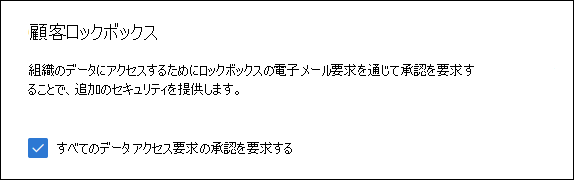

# <a name="microsoft-purview-customer-lockbox"></a>Microsoft Purview カスタマー ロックボックス

[!include[Purview banner](../includes/purview-rebrand-banner.md)]

この記事では、Customer Lockbox のデプロイと構成に関するガイダンスを提供します。 Customer Lockbox では、Exchange Online、SharePoint Online、OneDrive for Business、Teamsのデータにアクセスするための要求がサポートされています。 他のサービスのサポートを推奨するには、 [フィードバック ポータル](https://feedbackportal.microsoft.com)で要求を送信します。

Microsoft Purview オファリングの恩恵を受けるためにユーザーにライセンスを付与するオプションについては、[セキュリティ&コンプライアンスに関するMicrosoft 365ライセンスガイダンス](/office365/servicedescriptions/microsoft-365-service-descriptions/microsoft-365-tenantlevel-services-licensing-guidance/microsoft-365-security-compliance-licensing-guidance)を参照してください。

カスタマー ロックボックスを使用すると、Microsoft が明示的な承認なしにサービス操作を行うためにコンテンツにアクセスできなくなります。 Customer Lockbox は、承認された要求のみがコンテンツへのアクセスを許可するように Microsoft が使用する承認ワークフロー プロセスに移行します。 Microsoft のワークフロー プロセスの詳細については、 [特権アクセス管理](privileged-access-management-solution-overview.md)に関するページを参照してください。

場合によっては、Microsoft エンジニアは、サービスで発生する問題のトラブルシューティングと修正を支援します。 通常、エンジニアは、Microsoft がサービス用に用意している広範なテレメトリとデバッグ ツールを使用して問題を修正します。 ただし、根本原因を特定して問題を解決するために、Microsoft エンジニアがコンテンツにアクセスする必要がある場合があります。 Customer Lockbox では、承認ワークフローの最後の手順として、エンジニアからアクセスを要求する必要があります。 これにより、組織の要求を承認または拒否し、コンテンツへの直接アクセス制御を提供できます。

## <a name="customer-lockbox-overview-video"></a>Customer Lockbox の概要ビデオ

> [!VIDEO https://www.microsoft.com/videoplayer/embed/8fecf10b-1f03-4849-8b67-76d3d2a43f26?autoplay=false]

## <a name="customer-lockbox-workflow"></a>カスタマー ロックボックスのワークフロー

次の手順では、Microsoft エンジニアがカスタマー ロックボックス要求を開始するときの一般的なワークフローの概要を示します。

1. 組織の誰かが Microsoft 365メールボックスで問題を経験しています。

2. 問題のトラブルシューティングを行った後、問題を修正できない場合は、Microsoft サポートにサポート リクエストを開きます。

3. Microsoft サポート エンジニアがサービス要求を確認し、問題を修復するために組織のテナントにアクセスする必要を判断します。

4. Microsoft サポートのエンジニアは、カスタマー ロックボックス要求ツールにログインして、組織のテナント名、サービス要求番号、およびエンジニアがデータにアクセスする予想時間を含むデータ アクセス要求を行います。

5. Microsoft サポート マネージャーが要求を承認した後、カスタマー ロックボックスは、Microsoft からの保留中のアクセス要求に関する電子メール通知を組織内の指定された承認者に送信します。

    

   [Microsoft 365 管理センターで Customer Lockbox アクセス承認者](/office365/admin/add-users/about-admin-roles)管理者ロールを割り当てられているすべてのユーザーは、カスタマー ロックボックス要求を承認できます。

6. 承認者はMicrosoft 365 管理センターにサインインし、要求を承認します。 この手順では、監査ログの検索によって使用可能な監査レコードの作成が開始されます。 詳細については、「 [顧客ロックボックス要求の監査](#auditing-customer-lockbox-requests)」を参照してください。

   顧客が要求を拒否した場合、または 12 時間以内に要求を承認しなかった場合、要求は期限切れになり、Microsoft エンジニアにアクセス権は付与されません。

   > [!IMPORTANT]
   > Microsoft には、ユーザーがOffice 365にサインインすることを求めるカスタマー ロックボックスの電子メール通知にリンクは含まれません。

7. 組織の承認者が要求を承認すると、Microsoft エンジニアは承認メッセージを受け取り、テナントにログインし、顧客の問題を修正します。 Microsoft のエンジニアには問題を修正する要求期間があり、その後、アクセスは自動的に取り消されます。

> [!NOTE]
> Microsoft のエンジニアによって実行されるすべての操作は、監査ログに記録されます。 これらの監査レコードを検索して確認することができます。

## <a name="turn-customer-lockbox-requests-on-or-off"></a>Customer Lockbox 要求のオン/オフを切り替える

Microsoft 365 管理センターで、カスタマー ロックボックス コントロールを有効にできます。 Customer Lockbox を有効にすると、テナントのコンテンツにアクセスする前に組織の承認を取得する必要があります。

1. グローバル管理者または **カスタマー ロックボックス アクセス承認者** ロールが割り当てられている職場または学校アカウントを使用して、アクセス [https://admin.microsoft.com](https://admin.microsoft.com) してサインインします。

2. **[設定** > **Org 設定** > **Security & Privacy**] を選択します。

3. [ **セキュリティ&プライバシー**] を選択し、左側の列で **[Customer Lockbox** ] を選択します。 **[すべてのデータ アクセス要求の承認が必要**] チェック ボックスをオンにし、変更を保存して機能を有効にします。

    

## <a name="approve-or-deny-a-customer-lockbox-request"></a>カスタマー ロックボックス要求を承認または拒否する

1. グローバル管理者または **カスタマー ロックボックス アクセス承認者** ロールが割り当てられている職場または学校アカウントを使用して、アクセス [https://admin.microsoft.com](https://admin.microsoft.com) してサインインします。

2. [ **サポート>カスタマー ロックボックス要求**] を選択します。

    ![[サポート] をクリックし、[カスタマー ロックボックス要求] をクリックします。](../media/CustomerLockbox5.png)

    カスタマー ロックボックス要求の一覧が表示されます。

    

3. Customer Lockbox 要求を選択し、 **承認** または **拒否** を選択します。

    

    Customer Lockbox 要求の承認に関する確認メッセージが表示されます。

    

> [!NOTE]
> Set-AccessToCustomerDataRequest コマンドレットを使用して、Microsoft サポート エンジニアによるデータへのアクセスを制御する Microsoft Purview Customer Lockbox 要求を承認、拒否、または取り消します。 詳細については、「 [Set-AccessToCustomerDataRequest](/powershell/module/exchange/set-accesstocustomerdatarequest)」を参照してください。

## <a name="auditing-customer-lockbox-requests"></a>カスタマー ロックボックス要求を監査する

Customer Lockbox 要求に対応する監査レコードは、Microsoft 365監査ログに記録されます。 これらのログには、Microsoft Purview コンプライアンス ポータルの [監査ログ検索ツール](search-the-audit-log-in-security-and-compliance.md) を使用してアクセスできます。 カスタマー ロックボックス要求の受け入れまたは拒否に関連するアクションと、Microsoft エンジニアが実行したアクション (アクセス要求が承認されたとき) も監査ログに記録されます。 これらの監査レコードを検索して確認することができます。

### <a name="search-the-audit-log-for-activity-related-to-customer-lockbox-requests"></a>カスタマー ロックボックス要求に関連するアクティビティの監査ログを検索する

監査ログを使用して Customer Lockbox の要求を追跡する前に、監査ログを検索するためのアクセス許可の割り当てなど、監査ログを設定するために必要な手順がいくつかあります。 詳細については、「 [Microsoft Purview 監査のセットアップ (Standard)](set-up-basic-audit.md)」を参照してください。 セットアップが完了したら、次の手順を使用して監査ログ検索クエリを作成し、Customer Lockbox に関連する監査レコードを返します。

1. <https://compliance.microsoft.com>に移動します。
  
2. 監査ログを検索するための適切なアクセス許可が割り当てられているアカウントを使用してサインインします。

3. コンプライアンス センターの左側のウィンドウで、[監査] を選択 **します**。

    [**監査**] ページの [**検索**] タブが表示されます。

    
  
4. 次の検索条件を設定します。

   1. **開始日** と **終了日**。 日付と時間の範囲を選択し、その期間内に発生したイベントを表示します。  

   2. **アクティビティ**。 検索によってすべてのアクティビティの監査レコードが返されるように、このフィールドは空白のままにします。 これは、カスタマー ロックボックス要求に関連するすべての監査レコードと、Microsoft エンジニアが実行した対応するアクティビティを返すために必要です。

   3. **ユーザー**。 このフィードは空白のままにしておきます。

   4. **ファイル、フォルダー、またはサイト**。 このフィードは空白のままにしておきます。

5. [**検索**] をクリックして、設定した検索条件で検索を実行します。

    検索結果はしばらくすると表示されます。 検索が完了するまで、その他の検索結果がページに追加されます。

6. **[アクティビティ**] 列の値に基づいて結果をアルファベット順に並べ替えるには、[**アクティビティ**] 列のヘッダーをクリックします。

7. 下にスクロールし、 **Set-AccessToCustomerDataRequest** のアクティビティを使用して監査レコードを探します。 このアクティビティを含むレコードは、組織内の承認者が Customer Lockbox 要求を承認または拒否することに関連しています。

8. または、[ **ユーザー** ] 列のヘッダーをクリックして、[ **ユーザー** ] 列の値を使用して結果をアルファベット順に並べ替えます。 **Microsoft Operator** の値を探します。これは、承認された顧客ロックボックス要求に応答して Microsoft エンジニアが実行したアクティビティを示します。 **[アクティビティ]** 列には、エンジニアが実行したアクションが表示されます。

      

9. 結果の一覧で、監査レコードをクリックして表示します。

### <a name="export-the-audit-log-search-results"></a>監査ログの検索結果をエクスポートする

監査ログの検索結果を CSV ファイルにエクスポートし、Excelでファイルを開いてフィルター処理機能と並べ替え機能を使用して、Customer Lockbox アクセス要求に関連する監査レコードを簡単に見つけて表示することもできます。

監査レコードをエクスポートするには、前の手順を使用して監査ログを検索します。 検索が完了したら、検索結果ページの上部にある **[エクスポート>すべての結果をダウンロード** する] を選択します。 エクスポート プロセスが完了したら、CSV ファイルをローカル コンピューターにダウンロードできます。 詳細な手順については、「 [監査ログ レコードのエクスポート、構成、および表示](export-view-audit-log-records.md)」を参照してください。

ファイルをダウンロードした後、Excelで開き、[**操作**] 列でフィルター処理して **、Set-AccessToCustomerDataRequest** アクティビティの監査レコードを表示できます。 **UserIds** 列 (**値 Microsoft オペレーター** を使用) でフィルター処理して、Microsoft エンジニアによって実行されたアクティビティの監査レコードを表示することもできます。

> [!NOTE]
> CSV ファイルで監査レコードを表示する場合は、 **AuditData** 列に追加情報が含まれます。 この列の情報は JSON オブジェクトに含まれています。これには、プロパティとして構成された複数のプロパティが含まれています *。値* のペアはコンマで区切られます。 ExcelのPower Query エディターの JSON 変換機能を使用して **、AuditData** 列の JSON オブジェクト内の各プロパティを複数の列に分割して、各プロパティに独自の列を含めることができます。 これにより、この情報を解釈しやすくなります。 詳細な手順については、「[Power Query エディターを使用してエクスポートされた監査ログを書式設定する」を参照](export-view-audit-log-records.md#step-2-format-the-exported-audit-log-using-the-power-query-editor)してください。

### <a name="use-powershell-to-search-and-export-audit-records"></a>PowerShell を使用して監査レコードを検索およびエクスポートする

Microsoft Purview コンプライアンス ポータルで監査検索ツールを使用する代わりに、PowerShell で [Search-UnifiedAuditLog](/powershell/module/exchange/search-unifiedauditlog) コマンドレットExchange Online実行します。 PowerShell を使用する利点の 1 つは、顧客ロックボックス要求に関連する Microsoft エンジニアによって実行される **Set-AccessToCustomerDataRequest** アクティビティまたはアクティビティを具体的に検索できることです。

[Exchange Online PowerShell に接続](/powershell/exchange/connect-to-exchange-online-powershell)したら、次のいずれかのコマンドを実行します。 プレースホルダーを特定の日付範囲に置き換えます。

アクティビティを検索する`Set-AccessToCustomerDataRequest`

```powershell
Search-UnifiedAuditLog -StartDate xx/xx/xxxx -EndDate xx/xx/xxxx -Operations Set-AccessToCustomerDataRequest
```

Microsoft エンジニアが実行するアクティビティを検索する

```powershell
Search-UnifiedAuditLog -StartDate xx/xx/xxxx -EndDate xx/xx/xxxx -UserIds "Microsoft Operator"
```

詳細と例については、「 [PowerShell を使用して監査ログ レコードを検索およびエクスポートする](export-view-audit-log-records.md#use-powershell-to-search-and-export-audit-log-records)」を参照してください。

また、監査ログを検索し、結果を CSV ファイルにエクスポートするために使用できる PowerShell スクリプトも用意されています。 詳細については、「 [PowerShell スクリプトを使用して監査ログを検索する」を参照してください](audit-log-search-script.md)。

### <a name="audit-record-for-a-customer-lockbox-request"></a>Customer Lockbox 要求の監査レコード

組織内のユーザーがカスタマー ロックボックス要求を承認または拒否すると、監査レコードは監査ログに記録され、次の情報が含まれます。

| 監査レコードのプロパティ| 説明|
|:---------- |:----------|
| 日付       | カスタマー ロックボックス要求が承認または拒否された日付と時刻。
| IP アドレス | 要求を承認または拒否するために使用された承認者のコンピューターの IP アドレス。 |
| ユーザー       | サービス アカウントBOXServiceAccount@\[customerforest.prod.outlook.com\]。            |
| アクティビティ   | Set-AccessToCustomerDataRequest: これは、カスタマー ロックボックス要求を承認または拒否したときにログに記録される監査アクティビティです。                                |
| アイテム       | Customer Lockbox 要求の Guid                             |

次のスクリーンショットは、承認された顧客ロックボックス要求に対応する監査レコードの例を示しています。 Customer Lockbox 要求が拒否された場合、パラメーターの `ApprovalDecision` 値は `Deny`.


### <a name="audit-record-for-an-action-performed-by-a-microsoft-engineer"></a>Microsoft のエンジニアによって実行されたアクションの監査レコード

カスタマー ロックボックス要求が承認された後、Microsoft のエンジニアが実行するアクション (顧客コンテンツへのアクセスにつながる可能性があります) は、監査ログに記録されます。これらのレコードには、次の情報が含まれます。

| 監査レコードのプロパティ| 説明|
|:---------- |:----------|
| 日付       | アクションが実行された日付時刻。 このアクションが実行された時間は、Customer Lockbox 要求が承認されてから 4 時間以内です。              |
| IP アドレス | Microsoft のエンジニア使用したコンピューターの IP アドレス。 |
| ユーザー       | Microsoft オペレーター;この値は、レコードが Customer Lockbox 要求に関連していることを示します。                                  |
| アクティビティ   | Microsoft のエンジニアが実行したアクティビティの名前。|
| 項目       | \<empty\>                                             |

## <a name="frequently-asked-questions"></a>よく寄せられる質問

### <a name="which-microsoft-365-services-does-customer-lockbox-apply-to"></a>Customer Lockbox はどのMicrosoft 365サービスに適用されますか?

Customer Lockbox は現在、Exchange Online、SharePoint Online、OneDrive for Business、Teamsでサポートされています。

### <a name="is-customer-lockbox-available-to-all-customers"></a>Customer Lockbox は、すべてのお客様が利用できますか?

Customer Lockbox は、Microsoft 365 サブスクリプションまたはOffice 365 E5 サブスクリプションに含まれており、Information Protectionとコンプライアンス、または Advanced Compliance アドオン サブスクリプションを使用して他のプランに追加できます。 詳細については、「 [プランと価格](https://products.office.com/business/office-365-enterprise-e5-business-software) 」を参照してください。

### <a name="what-is-customer-content"></a>顧客コンテンツとは何ですか?

顧客コンテンツは、Microsoft 365 サービスとアプリケーションのユーザーによって作成されたデータです。 顧客コンテンツの例は次のとおりです。

- 電子メール本文またはメールの添付ファイル

- SharePoint サイトのコンテンツ

- SharePoint ファイルの本文に含まれる情報

- プレゼンテーション ファイル本文Skype for Business

- インスタント メッセージ (IM) または音声会話

- Teams チャットとTeams チャネルに入力されたテキスト (たとえば、1 対 1 のチャット、グループ チャット、共有チャネル、プライベート チャネル、会議チャットなど)

- Teams チャット スレッドに貼り付けられたその他のデータ (コード スニペット、画像、オーディオ メッセージ、ビデオ メッセージ、リンクなど)

- Teams チャットとTeams チャネルのアプリとボットのデータ

- Teams アクティビティ フィード

- 会議の記録とトランスクリプトをTeamsする

- ボイスメール

- Teams チャットやTeams チャネルに投稿されたファイル

- 顧客が生成した blob または構造化ストレージ データ (SQL コンテナーなど)

- 顧客が所有するセキュリティ情報 (証明書、暗号化キー、パスワードなど)

- 顧客のコンテンツが残っている場合は、推論とその後のすべての推論

Office 365の顧客コンテンツの詳細については、[Office 365 セキュリティ センター](https://products.office.com/business/office-365-trust-center-privacy/)を参照してください。

### <a name="who-is-notified-when-there-is-a-request-to-access-my-content"></a>コンテンツにアクセスする要求があると、Whoに通知されますか?

グローバル管理者と、Customer Lockbox アクセス承認者管理者ロールが割り当てられているすべてのユーザーに通知されます。 これらは、カスタマー ロックボックス要求に対して承認できるユーザーと同じです。

### <a name="who-can-approve-or-reject-these-requests-in-my-organization"></a>Who組織内でこれらの要求を承認または拒否できますか?

グローバル管理者と、Customer Lockbox アクセス承認者管理者ロールが割り当てられているすべてのユーザーは、カスタマー ロックボックス要求を承認できます。 顧客は、組織でこれらのロールの割り当てを制御します。

### <a name="how-do-i-opt-in-to-customer-lockbox"></a>カスタマー ロックボックスにオプトイン操作方法?

グローバル管理者は、Microsoft 365 管理センターで Customer Lockbox を有効にして構成できます。

### <a name="if-i-approve-a-customer-lockbox-request-what-can-the-engineer-do-and-how-will-i-know-what-the-microsoft-engineer-did"></a>カスタマー ロックボックス要求を承認した場合、エンジニアは何を行い、Microsoft エンジニアが何をしたかを知る方法を教えてください。

カスタマー ロックボックス要求を承認した後、Microsoft エンジニアは、事前に承認されたコマンドレットを使用して顧客コンテンツにアクセスするために必要な特権を付与しました。 カスタマー ロックボックス要求に応答して Microsoft エンジニアが実行したアクションは、セキュリティ & コンプライアンス センターの監査ログに記録され、アクセスできます。

### <a name="how-do-i-know-that-microsoft-follows-the-approval-process"></a>Microsoft が承認プロセスに従っていることを操作方法知っていますか?

組織内の管理者と承認者に送信された電子メール承認通知を、[Microsoft 365 管理センター](https://go.microsoft.com/fwlink/p/?linkid=2024339)の Customer Lockbox 要求履歴と相互参照できます。

Customer Lockbox は、最新の [SOC 1 SSAE 16 監査レポートに](https://servicetrust.microsoft.com/ViewPage/MSComplianceGuide?command=Download&downloadType=Document&downloadId=91592749-e86a-43ac-801e-121382614681&docTab=4ce99610-c9c0-11e7-8c2c-f908a777fa4d_SOC%20%2F%20SSAE%2016%20Reports)含まれています。 詳細については、 [Microsoft Service Trust Portal](https://servicetrust.microsoft.com/ViewPage/MSComplianceGuide?command=Download&downloadType=Document&downloadId=91592749-e86a-43ac-801e-121382614681&docTab=4ce99610-c9c0-11e7-8c2c-f908a777fa4d_SOC%20%2F%20SSAE%2016%20Reports) で最新のレポートを参照してください。

### <a name="can-microsoft-modify-the-list-of-approvers-for-my-tenant-if-not-how-is-it-prevented"></a>Microsoft では、テナントの承認者の一覧を変更できますか? そうでない場合は、どのように防止されますか?

組織のグローバル管理者のみが、カスタマー ロックボックス要求を承認できるユーザーを指定できます。 つまり、要求を承認できるユーザーを指定できるのは、Azure Active Directoryのグローバル管理者 グループのメンバーだけです。 Azure Active Directoryのグローバル管理者 グループのメンバーシップは、組織によってのみ管理されます。

### <a name="what-if-i-need-more-information-about-a-content-access-request-to-approve-it"></a>コンテンツ アクセス要求の承認に関する詳細情報が必要な場合はどうすればよいですか?

各 Customer Lockbox 要求には、Microsoft 365サービス要求番号が含まれています。 Microsoft サポートに問い合わせ、このサービス番号を参照して、要求の詳細を確認できます。

### <a name="when-a-customer-lockbox-request-is-approved-how-long-are-the-permissions-valid"></a>Customer Lockbox 要求が承認されると、アクセス許可が有効な期間はどれくらいですか?

現在、Microsoft のエンジニアに付与されるアクセス許可の最長期間は 4 時間です。Microsoft のエンジニアは、より短い期間を要求することもできます。

### <a name="how-can-i-get-a-history-of-all-customer-lockbox-requests"></a>すべての Customer Lockbox 要求の履歴を取得するにはどうすればよいですか?

すべての Customer Lockbox 要求は[、Microsoft 365 管理センター](https://go.microsoft.com/fwlink/p/?linkid=2024339)に表示されます。

### <a name="how-do-i-correlate-the-content-access-requests-with-the-related-audit-logs"></a>コンテンツ アクセス要求を関連する監査ログと関連付ける操作方法ですか?

コンプライアンス センター アクティビティ フィードには、Customer Lockbox のログ アクティビティが含まれています。 顧客は、受信した電子メール要求に対してアクティビティ フィードから Customer Lockbox ログ アクティビティを相互参照できます。

### <a name="what-happens-when-a-customer-doesnt-respond-to-a-customer-lockbox-request"></a>顧客が Customer Lockbox 要求に応答しなかった場合はどうなりますか?

カスタマー ロックボックス要求の既定の期間は 12 時間です。 12 時間以内に要求に応答しない場合、要求は期限切れになります。

### <a name="what-does-microsoft-do-when-a-customer-rejects-a-customer-lockbox-request"></a>顧客がカスタマー ロックボックス要求を拒否した場合、Microsoft は何をしますか?

顧客が Customer Lockbox 要求を拒否した場合、顧客コンテンツへのアクセスは行われません。 組織内のユーザーが、問題を解決するために Microsoft が顧客コンテンツにアクセスすることを要求するサービスの問題が引き続き発生する場合、サービスの問題は解決されず、Microsoft はこれについてユーザーに通知します。

### <a name="how-do-i-set-up-alerts-whenever-a-request-has-been-approved"></a>要求が承認されるたびにアラートを設定操作方法?

管理者に警告する組み込みのオプションはありません。 ただし、管理者は[Microsoft Defender for Cloud Apps](/cloud-app-security/getting-started-with-cloud-app-security#to-create-policies)を使用してアラートを設定できます。

### <a name="does-customer-lockbox-protect-against-data-requests-from-law-enforcement-agencies-or-other-third-parties"></a>Customer Lockbox は、法執行機関またはその他の第三者からのデータ要求から保護されますか?

いいえ。 Microsoft では、第三者による顧客データの要求に慎重に対応しています。 クラウド サービス プロバイダーとして、Microsoft は常に顧客データのプライバシーを主張しています。 召喚状を受け取った場合、Microsoft は常にサード パーティを顧客にリダイレクトして情報を取得しようとします。 (Brad Smith のブログ「[政府機関による監視から顧客データを保護する](https://blogs.microsoft.com/blog/2013/12/04/protecting-customer-data-from-government-snooping/)」を参照してください)。 Microsoft は、Microsoft が受け取る法執行機関の要求に関する [詳細情報](https://www.microsoft.com/corporate-responsibility/lerr) を定期的に公開します。

詳細については、サード パーティのデータ要求に関する [Microsoft Trust Center](https://www.microsoft.com/trustcenter/default.aspx) と [、Online Services 利用規約](https://www.microsoft.com/Licensing/product-licensing/products.aspx) の「顧客データの開示」セクションを参照してください。

### <a name="how-does-microsoft-ensure-that-a-member-of-its-staff-doesnt-have-standing-access-to-customer-content-in-office-365-applications"></a>Microsoft では、そのスタッフのメンバーが、Office 365 アプリケーション内の顧客コンテンツに永続的にアクセスできないようにするにはどうすればよいですか?

Microsoft では、アクセス制御システムを通じた広範な予防措置と、これらのアクセス制御システムを回避しようとする試みを特定して対処するための探偵対策を実装しています。 Microsoft 365は、最小限の特権と Just-In-Time アクセスの原則で動作します。 そのため、継続的に顧客コンテンツにアクセスするアクセス許可を持つ Microsoft 担当者はいません。 アクセス許可が付与されている場合は、制限付きの期間です。

Microsoft 365では、*Lockbox* という名前のアクセス制御システムを使用して、サービス内で運用および管理機能を実行する権限を付与するアクセス許可の要求を処理します。 オペレーターは Lockbox を使用して顧客コンテンツへのアクセスを要求する必要があります。これにより、アクセスが許可される前に、2 人目のユーザーが要求に対してアクションを実行する必要があります (たとえば、承認)。 その 2 番目のユーザーは要求元になることができず、顧客コンテンツへのアクセスを承認するように指定する必要があります。 要求が承認された場合にのみ、オペレーターは顧客コンテンツへの一時的なアクセスを取得します。 昇格期間が経過すると、ロックボックスはアクセスを取り消します。

Microsoft の一般的なセキュリティプラクティスの詳細については、 [Online Services の使用条件](https://www.microsoft.com/licensing/product-licensing/products) を参照してください。

### <a name="under-what-circumstances-do-microsoft-engineers-need-access-to-my-content"></a>Microsoft エンジニアは、どのような状況で自分のコンテンツにアクセスする必要がありますか?

Microsoft エンジニアが顧客コンテンツにアクセスする必要がある最も一般的なシナリオは、お客様がトラブルシューティングにアクセスする必要があるサポート要求を行うときです。 Microsoft 365の基本原則は、Microsoft がお客様のコンテンツにアクセスしなくてもサービスが動作することです。 Microsoft によって実行されるほぼすべてのサービス操作は完全に自動化され、人間の関与は高度に制御され、顧客コンテンツから抽象化されます。 Microsoft 365の目標は、お客様が Microsoft アクセスに対する特定の要求を承認するまで、サービスをサポートするために顧客コンテンツにアクセスする必要はありません。

### <a name="i-already-thought-my-data-was-secure-with-the-microsoft-cloud-so-why-do-i-need-customer-lockbox"></a>データは Microsoft クラウドでセキュリティで保護されていると既に考えています。そのため、カスタマー ロックボックスが必要な理由は何ですか?

Customer Lockbox は、サービス操作に対して明示的なアクセス承認を付与する機能を顧客に提供することで、制御の追加レイヤーを提供します。 明示的なデータ アクセス承認のために手順が実施されていることを示すことで、Customer Lockbox は、HIPAA や FEDRAMP などの特定のコンプライアンス義務を満たすのにも役立ちます。
