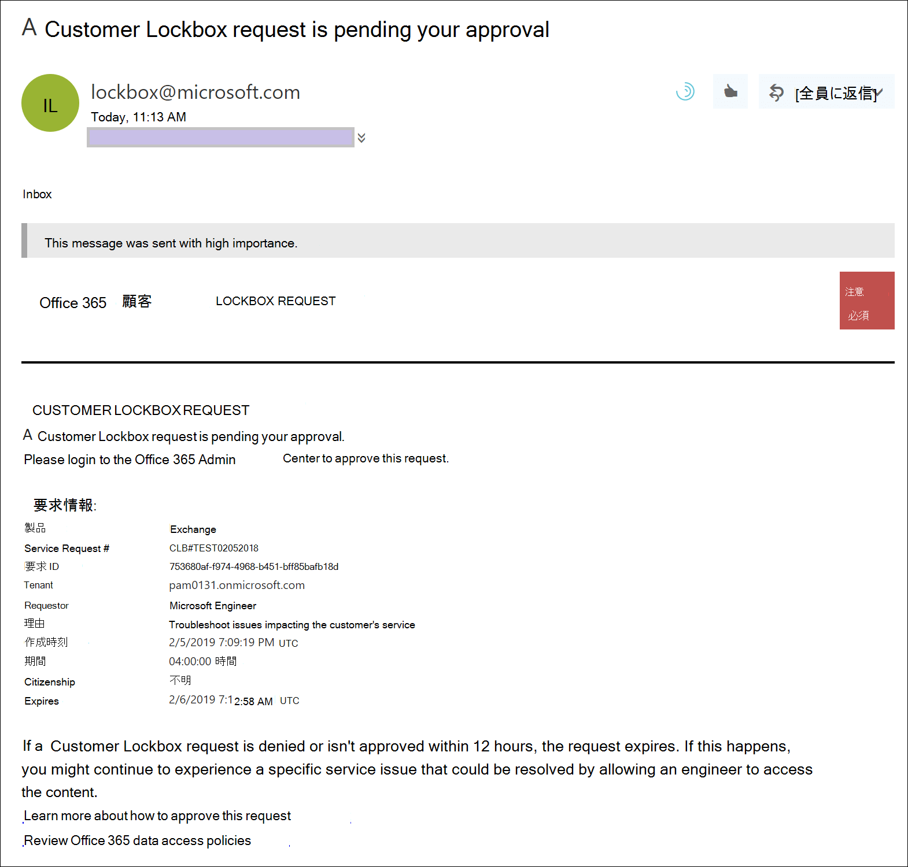
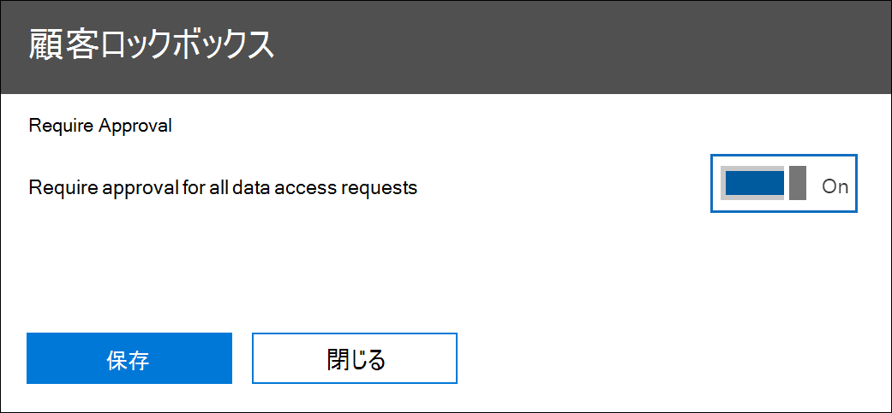
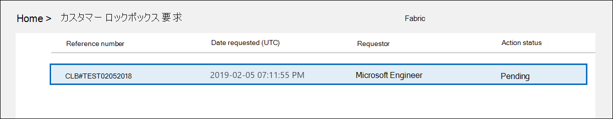
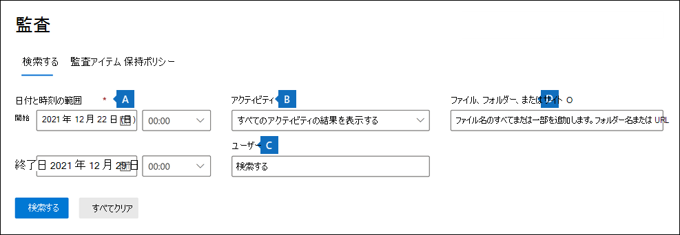
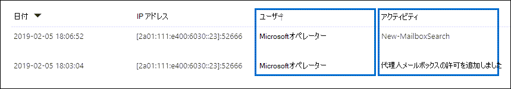
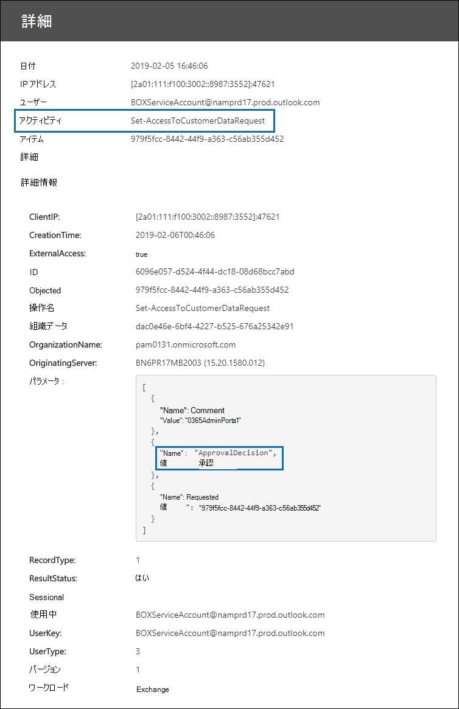

# 顧客ロックボックス (Office 365

この記事では、Customer Lockbox の展開と構成のガイダンスを提供します。 カスタマー ロックボックスは、Exchange Online、SharePoint Online、OneDrive for Business のデータにアクセスするための要求をサポートします。 他のサービスのサポートをお勧めするには[、UserVoice](https://office365.uservoice.com/)のOffice 365送信してください。

ユーザーにコンプライアンスサービスのメリットを提供するMicrosoft 365については、「セキュリティとコンプライアンスMicrosoft 365の&[参照してください](/office365/servicedescriptions/microsoft-365-service-descriptions/microsoft-365-tenantlevel-services-licensing-guidance/microsoft-365-security-compliance-licensing-guidance)。

Customer Lockbox を使用すると、明示的な承認なしに Microsoft がコンテンツにアクセスしてサービス操作を実行できます。 Customer Lockbox を使用すると、承認された要求のみがコンテンツへのアクセスを許可するために Microsoft が使用する承認ワークフロー プロセスが表示されます。 Microsoft のワークフロー プロセスの詳細については[、「Privileged access management in Microsoft 365」 を参照してください](privileged-access-management-solution-overview.md)。

Microsoft のエンジニアが、サービスで発生する問題のトラブルシューティングと修正に役立つ場合があります。 通常、エンジニアは、Microsoft がサービスのために用意している広範な利用統計情報とデバッグ ツールを使用して問題を修正します。 ただし、根本原因を特定して問題を解決するために、Microsoft のエンジニアがコンテンツにアクセスする必要がある場合があります。 顧客ロックボックスでは、承認ワークフローの最終ステップとして、エンジニアがユーザーからのアクセスを要求する必要があります。 これにより、組織の要求を承認または拒否し、コンテンツに直接アクセス制御を提供できます。

### カスタマー ロックボックスの概要ビデオ

> [!VIDEO https://www.microsoft.com/videoplayer/embed/8fecf10b-1f03-4849-8b67-76d3d2a43f26?autoplay=false]

## カスタマー ロックボックスのワークフロー

次の手順では、Microsoft エンジニアが Customer Lockbox 要求を開始する際の一般的なワークフローの概要を示します。

1. 組織の誰かが Microsoft 365メールボックスで問題を経験しています。

2. 問題のトラブルシューティングを行った後、問題を修正できない場合は、Microsoft サポートにサポート リクエストを開きます。

3. Microsoft サポートのエンジニアがサービス要求を確認し、Exchange Online の問題を修復するために組織のテナントにアクセスする必要があるかどうかを判断します。

4. Microsoft サポートのエンジニアは、カスタマー ロックボックス要求ツールにログインして、組織のテナント名、サービス要求番号、およびエンジニアがデータにアクセスする予想時間を含むデータ アクセス要求を行います。

5. Microsoft サポート マネージャーが要求を承認した後、カスタマー ロックボックスは、Microsoft からの保留中のアクセス要求に関する電子メール通知を組織内の指定された承認者に送信します。

    

   顧客ロックボックス アクセス[承認者](/office365/admin/add-users/about-admin-roles)の管理者ロールが割り当てられているユーザーは、Microsoft 365 管理センターを承認できます。

6. 承認者は、ユーザーにサインインMicrosoft 365 管理センター要求を承認します。 この手順では、監査ログの検索によって使用可能な監査レコードの作成が開始されます。 詳細については [、「Auditing Customer Lockbox requests」を参照してください](#auditing-customer-lockbox-requests)。

   顧客が要求を拒否した場合、または 12 時間以内に要求を承認しない場合、要求の有効期限が切れ、Microsoft エンジニアにアクセス権は付与されません。

   > [!IMPORTANT]
   > Microsoft は、ユーザーがユーザーにサインインする必要があるカスタマー ロックボックスの電子メール通知にリンクを含Office 365。

7. 組織からの承認者が要求を承認した後、Microsoft エンジニアは承認メッセージを受信し、Exchange Online のテナントにログインして、お客様の問題を修正します。 Microsoft のエンジニアには問題を修正する要求期間があり、その後、アクセスは自動的に取り消されます。

> [!NOTE]
> Microsoft のエンジニアによって実行されるすべての操作は、監査ログに記録されます。 これらの監査レコードを検索して確認することができます。

## 顧客ロックボックス要求をオンまたはオフにする

Microsoft 365 管理センターで、カスタマー ロックボックス コントロールを有効にできます。 Customer Lockbox を有効にした場合、Microsoft はテナントのコンテンツにアクセスする前に組織の承認を得る必要があります。

1. グローバル管理者または Customer **Lockbox** アクセス承認者の役割が割り当てられている仕事または学校のアカウントを使用して、アクセスして [https://admin.microsoft.com](https://admin.microsoft.com) サインインします。

2. [**組織設定**  >  **セキュリティ設定**  >  <a href="https://go.microsoft.com/fwlink/p/?linkid=2072756" target="_blank">**プライバシー&選択します**</a>。

3. [**顧客ロックボックスの** 編集] を選択し、トグルを [オン] または [オフ] に移動して、機能のオンと  >  オフを切り替えます。  

    

## カスタマー ロックボックス要求を承認または拒否する

1. グローバル管理者または Customer **Lockbox** アクセス承認者の役割が割り当てられている仕事または学校のアカウントを使用して、アクセスして [https://admin.microsoft.com](https://admin.microsoft.com) サインインします。

2. [ **カスタマー ロックボックス>サポート] を選択します**。

    ![[サポート] をクリックし、[カスタマー ロックボックス要求] をクリックします。](../media/CustomerLockbox5.png)

    顧客ロックボックス要求の一覧が表示されます。

    

3. 顧客ロックボックス要求を選択し、[承認] または [**拒否] を****選択します**。

    

    顧客ロックボックス要求の承認に関する確認メッセージが表示されます。

    

> [!NOTE]
> Set-AccessToCustomerDataRequest コマンドレットを使用して、Microsoft のサポート エンジニアがデータへのアクセスを制限する Microsoft 365 カスタマー ロックボックス要求を承認、拒否、キャンセルします。 詳細については [、「Set-AccessToCustomerDataRequest」を参照してください](/powershell/module/exchange/set-accesstocustomerdatarequest)。

## カスタマー ロックボックス要求を監査する

顧客ロックボックス要求に対応する監査レコードが監査ログに記録されます。 これらのログにアクセスするには、コンプライアンスセンターの [セキュリティ] ウィンドウの監査&使用します。 顧客ロックボックス要求の受け入れまたは拒否に関連するアクションと、Microsoft エンジニアが実行するアクション (アクセス要求が承認された場合) も監査ログに記録されます。 これらの監査レコードを検索して確認することができます。

### 顧客ロックボックス要求に関連するアクティビティの監査ログを検索する

監査ログを使用してカスタマー ロックボックスの要求を追跡できるようにするには、監査ログを設定するためにいくつかの手順が必要になります。 詳細については、「セキュリティ コンプライアンス センターで監査ログを検索 [&する」を参照してください](/office365/securitycompliance/search-the-audit-log-in-security-and-compliance#before-you-begin)。 セットアップが完了したら、次の手順を使用して監査ログ検索クエリを作成し、Customer Lockbox に関連する監査レコードを返します。

1. [セキュリティ と [コンプライアンス&に移動します](https://protection.office.com)。
  
2. 職場または学校のアカウントを使用してサインインします。

3. セキュリティ コンプライアンス センターの左側のウィンドウ&、[調査監査ログの&**検索**  >  **] を選択します**。

    [ **監査ログの検索] ページ** が表示されます。

    
  
4. 次の検索条件を設定します。

    1. **[アクティビティ** ] - 検索がすべてのアクティビティの監査レコードを返す場合は、このフィールドを空白のままにします。 これは、Microsoft のエンジニアが実行するカスタマー ロックボックス要求および対応するアクティビティに関連する監査レコードを返す場合に必要です。

    1. **開始日と****終了日**- 日付と時刻の範囲を選択して、その期間に発生したイベントを表示します。

    1. **ユーザー** - このフィールドは空白のままにします。

    1. **ファイル、フォルダー、またはサイト** - このフィールドは空白のままにします。

5. [**検索**] をクリックして、設定した検索条件で検索を実行します。

    検索結果が読み込まれ、しばらくすると、[監査ログ検索] ページの [結果 **] に表示** されます。

6. [ **検索結果] ページの** [結果のフィルター] をクリックし、次のいずれかの操作を行います。

   - 組織の承認者に関連する監査レコードを表示するには、[アクティビティ] 列の下のボックスに **「Set-AccessToCustomerDataRequest」** と入力します。 

   - 承認済みの顧客ロックボックス要求に応じてアクションを実行する Microsoft エンジニアに関連する監査レコードを表示するには、[ユーザー]列の下のボックスに **「Microsoft Operator」と入力します**。 [ **アクティビティ]** 列には、エンジニアが実行したアクションが表示されます。

      

7. 結果の一覧で、監査レコードをクリックして表示します。

### カスタマー ロックボックス アクセス要求の監査レコード

組織内のユーザーが Customer Lockbox 要求を承認または拒否すると、監査レコードが監査ログに記録されます。 このレコードには、次の情報が含まれています。

| 監査レコードのプロパティ| 説明|
|:---------- |:----------|
| 日付       | カスタマー ロックボックス要求が承認または拒否された日付と時刻。
| IP アドレス | 要求を承認または拒否するために使用された承認者のコンピューターの IP アドレス。 |
| ユーザー       | \[customerforest .BOXServiceAccount@ のサービス アカウント \] prod.outlook.com。            |
| アクティビティ   | Set-AccessToCustomerDataRequest: これは、カスタマー ロックボックス要求を承認または拒否したときにログに記録される監査アクティビティです。                                |
| Item       | 顧客ロックボックス要求の Guid                             |

次のスクリーンショットは、承認済みの顧客ロックボックス要求に対応する監査ログ レコードの例を示しています。 Customer Lockbox 要求が拒否された場合 **、ApprovalDecision** パラメーターの値は Deny **になります**。

> [!TIP]
> 監査レコードに詳細情報を表示するには、[詳細情報] **をクリックします**。

### Microsoft のエンジニアによって実行されたアクションの監査レコード

カスタマー ロックボックス要求が承認された後、Microsoft のエンジニアが実行するアクション (顧客コンテンツへのアクセスにつながる可能性があります) は、監査ログに記録されます。これらのレコードには、次の情報が含まれます。

| 監査レコードのプロパティ| 説明|
|:---------- |:----------|
| 日付       | アクションが実行された日時。 このアクションが実行された時刻は、カスタマー ロックボックス要求が承認されてから 4 時間以内であることに注意してください。              |
| IP アドレス | Microsoft のエンジニア使用したコンピューターの IP アドレス。 |
| ユーザー       | Microsoft のオペレーター。この値は、このレコードがカスタマー ロックボックス要求に関連付けられていることを示します。                                  |
| アクティビティ   | Microsoft のエンジニアが実行したアクティビティの名前。|
| 項目       | \<empty\>                                             |

## よく寄せられる質問

#### カスタマー Microsoft 365どのサービスに適用されますか?

カスタマー ロックボックスは現在、オンライン、Exchange Online、SharePointでサポートOneDrive for Business。

#### 顧客ロックボックスは、すべての顧客が利用できますか?

顧客ロックボックスは Microsoft 365 または Office 365 E5 サブスクリプションに含まれており、情報保護とコンプライアンス、または高度なコンプライアンス アドオン サブスクリプションを使用して他のプランに追加できます。 詳細については [、「プランと価格」](https://products.office.com/business/office-365-enterprise-e5-business-software) を参照してください。

#### 顧客コンテンツとは

顧客コンテンツは、サービスおよびアプリケーションのユーザー Microsoft 365データです。 顧客コンテンツの例は次のとおりです。

- 電子メール本文またはメールの添付ファイル

- SharePoint サイトのコンテンツ

- SharePoint ファイルの本文に含まれる情報

- Skype for Businessファイル本文

- インスタント メッセージ (IM) または音声会話

- 顧客が生成した blob または構造化ストレージ データ (SQL コンテナーなど)

- 顧客が所有するセキュリティ情報 (証明書、暗号化キー、パスワードなど)

- 顧客コンテンツが残っている場合の推論とそれ以降のすべての推論

顧客コンテンツの詳細については、「Office 365 センター [」をOffice 365してください](https://products.office.com/business/office-365-trust-center-privacy/)。

#### Whoにアクセスする要求がある場合は、通知を受け取る必要がありますか?

グローバル管理者と、Customer Lockbox アクセス承認者管理者の役割が割り当てられているすべてのユーザーに通知されます。 これらは、顧客ロックボックス要求に対して承認できるユーザーと同じです。

#### Whoでこれらの要求を承認または拒否できますか?

グローバル管理者と、Customer Lockbox アクセス承認者管理者の役割が割り当てられているユーザーは、顧客ロックボックス要求を承認できます。 お客様は、組織でこれらの役割の割り当てを制御します。

#### カスタマー ロックボックスにオプトインする方法

グローバル管理者は、管理者または管理者で顧客ロックボックスを有効Microsoft 365構成<a href="https://go.microsoft.com/fwlink/p/?linkid=2024339" target="_blank">Microsoft 365 管理センター。</a>

#### Customer Lockbox 要求を承認した場合、エンジニアは何を行い、Microsoft エンジニアが何を行ったのかをどのように知るのですか?

Customer Lockbox 要求を承認すると、Microsoft エンジニアは事前承認されたコマンドレットを使用して顧客コンテンツにアクセスするために必要なこれらの特権を付与しました。 Microsoft のエンジニアがカスタマー ロックボックス要求に応答して実行したアクションは、セキュリティ コンプライアンス センターの監査ログに記録され&アクセスできます。

#### Microsoft が承認プロセスに従っているのを知る方法

組織内の管理者および承認者に送信される電子メール承認通知を、顧客ロックボックス要求履歴と相互参照[Microsoft 365 管理センター。](https://go.microsoft.com/fwlink/p/?linkid=2024339)

顧客ロックボックスは、最新の [SOC 1 SSAE 16 監査レポートに含まれています](https://servicetrust.microsoft.com/ViewPage/MSComplianceGuide?command=Download&downloadType=Document&downloadId=91592749-e86a-43ac-801e-121382614681&docTab=4ce99610-c9c0-11e7-8c2c-f908a777fa4d_SOC%20%2F%20SSAE%2016%20Reports)。 詳細については、Microsoft Service Trust Portal で最新のレポート [を確認できます](https://servicetrust.microsoft.com/ViewPage/MSComplianceGuide?command=Download&downloadType=Document&downloadId=91592749-e86a-43ac-801e-121382614681&docTab=4ce99610-c9c0-11e7-8c2c-f908a777fa4d_SOC%20%2F%20SSAE%2016%20Reports)。

#### Microsoft はテナントの承認者の一覧を変更できますか? それではない場合、どのように防止されますか?

組織内のグローバル管理者だけが、顧客ロックボックス要求を承認できるユーザーを指定できます。 つまり、要求を承認できるユーザーを指定できるのは、Azure Active Directoryのグローバル管理者グループのメンバーのみです。 グループ内のグローバル管理者グループのAzure Active Directoryは、組織によってのみ管理されます。

#### コンテンツ アクセス要求を承認するために詳細な情報が必要な場合は、どうしますか?

各 Customer Lockbox 要求には、サービス要求Microsoft 365番号が含まれる。 要求の詳細については、Microsoft サポートに問い合わせ、このサービス番号を参照してください。

#### Customer Lockbox 要求が承認されると、アクセス許可はどのくらい有効ですか?

現在、Microsoft のエンジニアに付与されるアクセス許可の最長期間は 4 時間です。Microsoft のエンジニアは、より短い期間を要求することもできます。

#### すべての Customer Lockbox 要求の履歴を取得する方法

すべての顧客ロックボックス要求は、次の[Microsoft 365 管理センター。](https://go.microsoft.com/fwlink/p/?linkid=2024339)

#### コンテンツ アクセス要求と関連する監査ログを関連付ける方法

コンプライアンス センターアクティビティ フィードには、Customer Lockbox のログ アクティビティが含まれます。 顧客は、アクティビティ フィードから Customer Lockbox ログ アクティビティを受信した電子メール要求と相互参照できます。

#### 顧客が Customer Lockbox 要求に応答しない場合は、どうなるでしょうか。

カスタマー ロックボックス要求の既定の期間は 12 時間です。 12 時間以内に要求に応答しない場合、要求の有効期限が切れます。

#### 顧客が顧客ロックボックス要求を拒否した場合、Microsoft は何をしますか?

顧客が Customer Lockbox 要求を拒否した場合、顧客コンテンツへのアクセスは行われません。 組織内のユーザーが引き続きサービスの問題が発生し、Microsoft が問題を解決するために顧客コンテンツにアクセスする必要がある場合、サービスの問題が解決しない可能性があります。Microsoft は、この問題についてユーザーに通知します。

#### 顧客ロックボックスは、法執行機関や他の第三者からのデータ要求から保護しますか?

その必要はありません。 Microsoft は、顧客データに対するサードパーティの要求を真剣に受け止める。 クラウド サービス プロバイダーとして、Microsoft は常に顧客データのプライバシーを主張しています。 Subpoena が取得された場合、Microsoft は常に第三者を顧客にリダイレクトして情報を取得します。 (Brad Smith のブログを読む: 政府のスヌーピングから顧客データ [を保護する](https://blogs.microsoft.com/blog/2013/12/04/protecting-customer-data-from-government-snooping/))。 Microsoft が受け [取る法執行](https://www.microsoft.com/corporate-responsibility/lerr) 機関の要求に関する詳細情報を定期的に公開します。

詳細については [、サードパーティ](https://www.microsoft.com/trustcenter/default.aspx) のデータ要求に関する Microsoft Trust Center と [、Online Services](https://www.microsoft.com/Licensing/product-licensing/products.aspx) の利用規約の「顧客データの開示」セクションを参照してください。

#### Microsoft は、そのスタッフのメンバーが、ユーザー アプリケーション内の顧客コンテンツに永続的にアクセスOffice 365しますか?

Microsoft は、アクセス制御システムを通じて広範な予防措置を実施し、これらのアクセス制御システムを回避しようとする試みを特定して対処するための探偵対策を実施しています。 Microsoft 365は、最小特権と Just-in-time アクセスの原則を使用して動作します。 したがって、Microsoft の担当者は、継続的に顧客コンテンツにアクセスする権限を持てない。 アクセス許可が付与されている場合は、期間が制限されます。 

Microsoft 365は *、Lockbox* と呼ばれるアクセス制御システムを使用して、サービス内で操作機能および管理機能を実行する権限の要求を処理します。 オペレーターは、Lockbox を使用して顧客コンテンツへのアクセスを要求する必要があります。その後、アクセスが許可される前に、2 人目が要求に対してアクションを実行する (承認するなど) 必要があります。 その 2 人目は要求者になけり、顧客コンテンツへのアクセスを承認するように指定する必要があります。 要求が承認された場合にのみ、オペレーターは顧客コンテンツへの一時的なアクセスを取得します。 昇格期間が経過すると、Lockbox はアクセスを取り消します。

Microsoft の一般的な [セキュリティプラクティスの](https://www.microsoft.com/licensing/product-licensing/products) 詳細については、「Online Services Terms」を参照してください。

#### Microsoft のエンジニアは、どのような状況で自分のコンテンツにアクセスする必要がありますか?

Microsoft エンジニアが顧客コンテンツにアクセスする必要がある最も一般的なシナリオは、お客様がトラブルシューティングにアクセスする必要があるサポート要求を行う場合です。 サービスの基本原則Microsoft 365、サービスは Microsoft が顧客コンテンツにアクセスせずに動作します。 Microsoft によって実行されるサービス操作のほぼすべては完全に自動化され、人間の関与は高度に制御され、顧客コンテンツから抽象化されます。 このサービスのMicrosoft 365は、顧客が Microsoft アクセスの特定の要求を承認するまでは、サービスをサポートするために顧客コンテンツにアクセスする必要がなされません。

#### Microsoft クラウドでデータが安全だと既に思っていたので、なぜカスタマー ロックボックスが必要なのでしょうか?

顧客ロックボックスは、サービス操作に対して明示的なアクセス許可を与える機能を顧客に提供することで、追加の制御層を提供します。 顧客ロックボックスは、明示的なデータ アクセス承認のための手順が実施されているという実証によって、HIPAA や FEDRAMP などの特定のコンプライアンス義務を満たすのにも役立ちます。