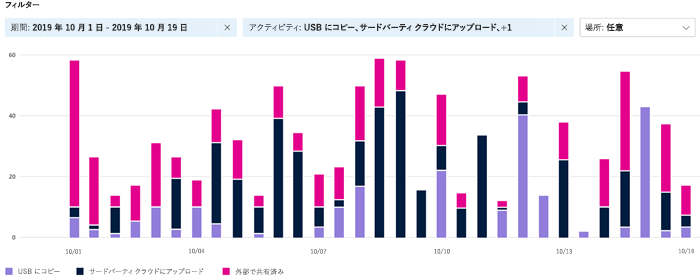

# アクティビティ エクスプローラーの使用を開始する

データ[分類の概要と](data-classification-overview.md)[コンテンツ エクスプローラーの](data-classification-content-explorer.md)タブを使用すると、どのコンテンツが検出され、ラベル付けされ、そのコンテンツがどこに表示されるのかを確認できます。 アクティビティ エクスプローラーでは、ラベル付きコンテンツに対して実行される内容を監視できるようにすることで、こうした一連の機能性を完全なものにします。 アクティビティ エクスプローラーは、ラベル付きコンテンツのアクティビティの履歴ビューを提供します。 アクティビティ情報は、統合監査Microsoft 365ログから収集され、変換され、アクティビティ エクスプローラー UI で使用できます。 アクティビティ エクスプローラーは、最大 30 日分のデータについて報告します。

使用可能なフィルターは 30 種類以上あり、以下がその一例です。

- 日付の範囲
- アクティビティの種類
- 場所
- ユーザー
- 機密ラベル
- 保持ラベル
- ファイル パス
- DLP ポリシー

## 前提条件

データ分類にアクセスして使用するすべてのアカウントには、これらのいずれかのサブスクリプションのライセンスが割り当てられている必要があります。

- Microsoft 365 (E5)
- Office 365 (E5)
- 高度なコンプライアンス (E5) アドオン
- 高度な脅威インテリジェンス (E5) アドオン
- Microsoft 365 E5/A5 情報保護およびガバナンス
- Microsoft 365 E5/A5 コンプライアンス

### アクセス許可

アカウントには、これらの役割グループのいずれかのメンバーシップを明示的に割り当てるか、役割を明示的に付与する必要があります。

### プレビューでの役割と役割グループ

プレビューには、アクセス制御を微調整するためにテストアウトできる役割と役割グループがあります。

プレビューに含Microsoft Information Protection (MIP) ロールの一覧を次に示します。 詳細については、「セキュリティ コンプライアンス センターの役割 [」を&してください。](../security/office-365-security/permissions-in-the-security-and-compliance-center.md#roles-in-the-security--compliance-center)

- 情報保護管理者
- 情報保護アナリスト
- 情報保護調査員
- 情報保護リーダー

プレビュー中の MIP 役割グループの一覧を次に示します。 詳細については、「セキュリティ コンプライアンス センター」の「役割 [グループ&参照してください。](../security/office-365-security/permissions-in-the-security-and-compliance-center.md#role-groups-in-the-security--compliance-center)

- 情報保護
- 情報保護管理者
- 情報保護アナリスト
- 情報保護調査員
- 情報保護リーダー

<!--
> [!IMPORTANT]
> Access to Activity explorer via the Security reader or Device Management role groups or other has been removed-->

**Microsoft 365 の役割グループ**

- 全体管理者
- コンプライアンス管理者
- セキュリティ管理者
- コンプライアンス データ管理者

**Microsoft 365ロール**

- コンプライアンス管理者
- セキュリティ管理者
- セキュリティ閲覧者

## アクティビティの種類

アクティビティ エクスプローラーは、複数のアクティビティ ソースの監査ログからアクティビティ情報を収集します。 どのラベル付けアクティビティがアクティビティ エクスプローラーに表示されるかの詳細については、「アクティビティ エクスプローラーで利用可能なイベントのラベル付け [」を参照してください](data-classification-activity-explorer-available-events.md)。

 Office ネイティブ アプリケーション、Azure Information Protection アドイン、SharePoint Online、Exchange Online (感度ラベルのみ)、および OneDrive からの感度ラベル アクティビティと保持ラベル付けアクティビティ。 次に例を示します。

- ラベルの適用
- ラベルの変更 (アップグレード、ダウングレード、または削除)
- 自動ラベル付けのシミュレーション
- ファイルの読み取り 

**Azure Information Protection (AIP) スキャナーと AIP クライアント**

- 適用される保護
- 保護の変更
- 保護が削除されました
- 検出されたファイル 

アクティビティ エクスプローラーは、Exchange Online、SharePoint Online、OneDrive、Teams チャットとチャネル (プレビュー)、オンプレミスの SharePoint フォルダーとライブラリ、オンプレミスのファイル共有、および Windows 10 **デバイスからのイベントを収集します。エンドポイント データ損失防止 (DLP)**。 デバイスからのイベントの例Windows 10ファイルです。

- 削除
- creations
- クリップボードにコピー
- 更新日時
- read
- 印刷済み
- 名前の変更
- ネットワーク共有にコピーされる
- 許可されていないアプリによってアクセスされる 

機密性の高いラベル付きコンテンツで実行されるアクションを理解すると、データ損失防止ポリシーなどのコントロールが有効か、有効ではないかを確認できます。 そうでない場合、つまり、多数の `highly confidential` でラベル付けされたアイテムおよび `general` にダウングレードされたアイテムなどの予想しない何かが検出された場合は、各種ポリシーを管理して、望ましくない動作を制限するための新しい操作を行うことができます。

> [!NOTE]
> アクティビティ エクスプローラーは現在、Exchange Online の保持アクティビティを監視していません。

## 関連項目

- [秘密度ラベルの詳細](sensitivity-labels.md)
- [アイテム保持ポリシーと保持ラベルの詳細](retention.md)
- [機密情報の種類に関する詳細情報](sensitive-information-type-learn-about.md)
- [データ分類の説明](data-classification-overview.md)
