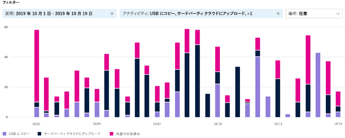
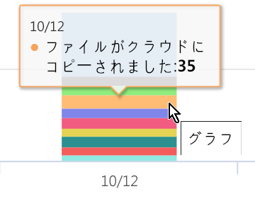

# ラベル付きコンテンツのアクティビティを表示する (プレビュー)

データ分類の概要およびコンテンツ エクスプローラーのタブにより、どのコンテンツが検出されてラベルが付けられているか、およびそのコンテンツのある場所に対する可視性が与えられます。 アクティビティ エクスプローラーでは、ラベル付きコンテンツに対して実行される内容を監視できるようにすることで、こうした一連の機能性を完全なものにします。 アクティビティ エクスプローラーでは、履歴ビューを提供します。

次を使用し、データをフィルター処理します。

- 日付の範囲
- アクティビティの種類
- 場所
- ユーザー
- 機密ラベル
- 保持ラベル

リストまたは棒グラフとしてデータを表示することができます。

## アクティビティの種類

Microsoft 365 では、SharePoint Online、OneDrive およびエンドポイントを横断して 12 種類のアクティビティを監視したり、レポートしたりします。 エンドポイントとは、Windows 10 を実行しているユーザー デバイスです。

- ファイルが作成されました
- ファイルが変更されました
- ファイルの名前が変更されました
- ファイルがクラウドにコピーされました
- ファイルが許可されていないアプリによってアクセスされました
- ファイルが印刷されました
- ファイルがリムーバブル メディアにコピーされました
- ファイルがネットワーク共有にコピーされました
- ファイルの読み取り
- ファイルがクリップボードにコピーされました
- ラベルが適用されました
- ラベルが変更されました (アップグレード、ダウングレード、または削除されました)

機密ラベル付きのコンテンツに対してどんな操作が行われたかを理解する価値は、[データ損失防止ポリシー](data-loss-prevention-policies.md) が有効かどうかなど、既定の環境の制限を確認できることです。 そうでない場合、つまり、多数の `highly confidential` でラベル付けされたアイテムおよび `general` にダウングレードされたアイテムなどの予想しない何かが検出された場合は、各種ポリシーを管理して、望ましくない動作を制限するための新しい操作を行うことができます。

フィルターを設定すると、次のことが実行できます。

- 横棒グラフのセグメントにマウス ポインターを置き、そのカテゴリに分類されたアイテムの数を確認できます 
- データをエクスポートする
- リストから任意のアイテムを選択して、フライ アウトに操作の詳細を表示します。

## 関連項目
- [機密ラベル](sensitivity-labels.md)
- [保持ラベル](labels.md)
- [機密情報の種類の検索基準](what-the-sensitive-information-types-look-for.md)
- [アイテム保持ポリシーの概要](retention-policies.md)