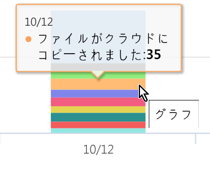

# アクティビティ エクスプローラーの使用を開始する (プレビュー)Get started with activity explorer (preview)

データ分類の概要およびコンテンツ エクスプローラーのタブにより、どのコンテンツが検出されてラベルが付けられているか、およびそのコンテンツのある場所に対する可視性が与えられます。The data classification overview and content explorer tabs give you visibility into what content has been discovered and labeled, and where that content is. アクティビティ エクスプローラーでは、ラベル付きコンテンツに対して実行される内容を監視できるようにすることで、こうした一連の機能性を完全なものにします。Activity explorer rounds out this suite of functionality by allowing you to monitor what's being done with your labeled content. アクティビティ エクスプローラーでは、履歴ビューを提供します。Activity explorer provides a historical view.

次を使用し、データをフィルター処理します。You can filter the data by:

- 日付の範囲date range
- アクティビティの種類activity type
- 場所location
- ユーザーuser
- 機密ラベルsensitivity label
- 保持ラベルretention label

リストまたは棒グラフとしてデータを表示することができます。You can view the data either as a list or a bar graph.

## 前提条件Prerequisites

アクティビティ エクスプローラーにアクセスして使用するすべてのアカウントには、これらのいずれかのサブスクリプションのライセンスが割り当てられている必要があります。Every account that accesses and uses activity explorer must have a license assigned to it from one of these subscriptions:

- Microsoft 365 (E5)Microsoft 365 (E5)
- Office 365 (E5)Office 365 (E5)
- 高度なコンプライアンス (E5) アドオンAdvanced Compliance (E5) add-on
- 高度な脅威インテリジェンス (E5) アドオンAdvanced Threat Intelligence (E5) add-on

## アクティビティの種類Activity type

Microsoft 365 では、SharePoint Online、OneDrive およびエンドポイントを横断して 12 種類のアクティビティを監視したり、レポートしたりします。Microsoft 365 monitors and reports on 12 types of activities across SharePoint Online, OneDrive and endpoints. エンドポイントとは、Windows 10 を実行しているユーザー デバイスです。Endpoints are user devices running Windows 10.

- ファイルが作成されましたFile created
- ファイルが変更されましたFile modified
- ファイルの名前が変更されましたFile renamed
- ファイルがクラウドにコピーされましたFile copied to cloud
- ファイルが許可されていないアプリによってアクセスされましたFile accessed by unallowed app
- ファイルが印刷されましたFile printed
- ファイルがリムーバブル メディアにコピーされましたFile copied to removable media
- ファイルがネットワーク共有にコピーされましたFile copied to network share
- ファイルの読み取りFile read
- ファイルがクリップボードにコピーされましたfile copied to clipboard
- ラベルが適用されましたLabel applied
- ラベルが変更されました (アップグレード、ダウングレード、または削除されました)Label changed (upgraded, downgraded, or removed)

機密ラベル付きのコンテンツに対してどんな操作が行われたかを理解する価値は、[データ損失防止ポリシー](data-loss-prevention-policies.md) が有効かどうかなど、既定の環境の制限を確認できることです。The value of understanding what actions are being taken with your sensitive labeled content is that you can see if the controls that you have already put into place, such as [data loss prevention policies](data-loss-prevention-policies.md) are effective or not. そうでない場合、つまり、多数の `highly confidential` でラベル付けされたアイテムおよび `general` にダウングレードされたアイテムなどの予想しない何かが検出された場合は、各種ポリシーを管理して、望ましくない動作を制限するための新しい操作を行うことができます。If not, or if you discover something unexpected, such as a large number of items that are labeled `highly confidential` and are downgraded `general`, you can manage your various policies and take new actions to restrict the undesired behavior.

フィルターを設定すると、次のことが実行できます。Once your filters are set, you can:

- 横棒グラフのセグメントにマウス ポインターを置き、そのカテゴリに分類されたアイテムの数を確認できます hover over a segment of the bar chart to see the number of items that fall into that category 
- データをエクスポートするexport the data
- リストから任意のアイテムを選択して、フライ アウトに操作の詳細を表示します。select any given item from the list and view the details of the action in the fly-out

## 関連項目See also
- [機密ラベルSensitivity labels](sensitivity-labels.md)
- [保持ラベルRetention labels](labels.md)
- [機密情報の種類の検索基準What the sensitive information types look for](what-the-sensitive-information-types-look-for.md)
- [アイテム保持ポリシーの概要Overview of retention policies](retention-policies.md)
