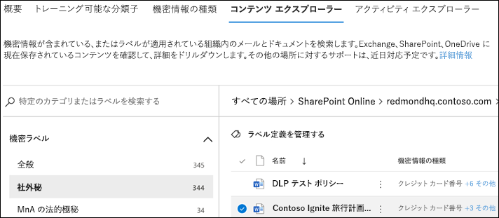

# コンテンツ エクスプローラーの使用を開始する

データ分類コンテンツ エクスプローラーにより、概要ページで要約されたアイテムをネイティブに表示することができます。

## 前提条件

データ分類にアクセスして使用するすべてのアカウントには、これらのいずれかのサブスクリプションのライセンスが割り当てられている必要があります。

- Microsoft 365 (E5)
- Office 365 (E5)
- 高度なコンプライアンス (E5) アドオン
- 高度な脅威インテリジェンス (E5) アドオン
- Microsoft 365 E5/A5 情報保護およびガバナンス
- Microsoft 365 E5/A5 コンプライアンス

### アクセス許可

[コンテンツ エクスプローラー] タブにアクセスするには、アカウントはこれらの役割または役割グループに割り当てられたメンバーシップであることが必要です。 

**Microsoft 365 の役割グループ**

- 全体管理者
- コンプライアンス管理者
- セキュリティ管理者
- コンプライアンス データ管理者

> [!IMPORTANT]
> これらの役割グループのメンバーシップでは、コンテンツ エクスプローラーでアイテムの一覧を表示したり、コンテンツ エクスプローラーでアイテムの内容を表示したりすることができません。

> [!IMPORTANT]
> グローバル管理者のみが、コンプライアンス センターで他のユーザーに対してアクセス許可を管理または割り当てることができます。 詳細については、｢[セキュリティ/コンプライアンス センターへのアクセス権をユーザーに付与する](../security/office-365-security/grant-access-to-the-security-and-compliance-center.md)」を参照してください。
> 
### コンテンツ エクスプローラーでアイテムにアクセスするために必要なアクセス許可

コンテンツ エクスプローラーへのアクセスは、スキャンしたファイルのコンテンツを読み取ることができるため、厳しく制限されています。

> [!IMPORTANT]
> これらのアクセス許可は、アイテムにローカルに割り当てられるアクセス許可の代わりに、コンテンツの表示を許可します。 

コンテンツ エクスプローラーへのアクセスを許可する 2 つの役割があり、[コンプライアンス センター](https://compliance.microsoft.com/permissions)を使用して許可されます。

- **コンテンツ エクスプローラーのリスト ビューアー**: この役割のグループのメンバーシップにより、ユーザーは各アイテムおよびその場所をリスト ビューで確認することができます。 この役割グループには、`data classification list viewer` 役割が事前に割り当てられています。

- **コンテンツ エクスプローラーのコンテンツ ビューアー**: この役割のグループのメンバーシップにより、ユーザーはリスト内の各アイテムのコンテンツを表示することができます。 この役割グループには、`data classification content viewer` 役割が事前に割り当てられています。

コンテンツ エクスプローラーにアクセスするために使用するアカウントには、1 つまたは両方の役割のグループがある必要があります。 独立した役割のグループがあり、累積ではありません。 たとえば、アイテムおよびそれらの場所のみ表示する機能をアカウントに付与する場合は、コンテンツ エクスプローラーのリスト ビューアーの権利を付与します。 その同じアカウントでリスト内のアイテムのコンテンツも表示できるようにするには、コンテンツ エクスプローラーのコンテンツ ビューアーの権利も付与します。

また、役割の一方または両方をカスタム役割グループに割り当てて、コンテンツ エクスプローラーへのアクセスをカスタマイズすることもできます。

グローバル管理者は、必要なコンテンツ エクスプローラーのリスト ビューアーとコンテンツ エクスプローラーのコンテンツ ビューアーの役割グループ メンバーシップを割り当てることができます。

## コンテンツ エクスプローラー

コンテンツ エクスプローラーは、機密ラベル、保持ラベルまたは組織で機密情報の種類として分類されているアイテムの現在のスナップショットです。

### 機密情報の種類

[DLP ポリシー](dlp-learn-about-dlp.md)は、**機密情報の種類** として定義されている機密情報を保護するのに役立ちます。 Microsoft 365 には、さまざまな地域にわたる[多くの一般的な機密情報の種類に対する定義](sensitive-information-type-entity-definitions.md)が含まれていて、すぐに使用できる状態になっています。 たとえば、クレジットカード番号、銀行口座番号、国民識別番号、Windows Live ID サービス番号などです。

> [!NOTE]
> 現在、コンテンツ エクスプローラーは、Exchange Online の機密情報の種類をスキャンしません。

### 秘密度ラベル

[機密ラベル](sensitivity-labels.md)は、組織に対するアイテムの価値を示すタグです。 手動で、または自動的に適用することができます。 適用すると、ドキュメントに埋め込まれ、ドキュメントがどこへ移動されても機密ラベルは保持されます。 機密ラベルによって、必須のウォーターマークや暗号化など、さまざまな保護機能が有効化されます。

SharePoint および OneDrive にあるファイルに対応するデータがデータ分類ページに表示されるようにするには、機密度ラベルを有効にする必要があります。 詳細については、「[SharePoint および OneDrive で Office ファイルの機密度ラベルを有効にする](sensitivity-labels-sharepoint-onedrive-files.md)」を参照してください。

### 保持ラベル

[保持ラベル](retention.md)を使用すると、ラベル付けされたアイテムの保持期間、およびアイテムを削除する前に行う手順を定義できます。 手動で、またはポリシーを使用して自動的に適用することができます。 組織が法的要件および規制要件を遵守するのに役立ちます。

### コンテンツ エクスプローラーの使用方法

1. **Microsoft 365 コンプライアンス センター**  > **[データ分類]** > **[コンテンツ エクスプローラー]** の順に開きます。
2. ラベルの名前または機密情報の種類が分かる場合は、それをフィルター ボックスに入力することができます。
3. 交互に、ラベルの種類を展開してリストからラベルを選択し、アイテムを参照することができます。
4. [**すべての場所**] の下で場所を選択して、アイテムのフォルダー構造をドリルダウンします。
5. ダブルクリックして、コンテンツ エクスプローラーでネイティブにアイテムを開きます。

### エクスポート
**エクスポート** コントロールは、**[すべての場所]** ウィンドウで表示される内容の一覧を含む .csv ファイルを作成します。

### 検索

Exchange フォルダー、SharePoint、OneDrive サイトなどの場所をドリルダウンするとき、**検索** ツールが表示されます。

検索ツールの範囲は、**[すべての場所 ]** ウィンドウに表示される内容です。また、検索できる対象は、選択した場所によって異なります。 

**Exchange** が選択された場所である場合、メールボックスの完全なメール アドレスを検索できます (`user@domainname.com` など)。

**SharePoint** または **OneDrive** が選択された場所である場合、サイト名、フォルダー、ファイルをドリルダウンすると、検索ツールが表示されます。 

> [!NOTE]
> **OneDrive** プレビュープログラム中に、OneDrive との統合に関する貴重なフィードバックをいただきました。 このフィードバックに基づき、すべての修正プログラムが適用されるまで、OneDrive の機能はプレビュー版のままになります。 テナントによっては、一部のお客様に OneDrive が場所として表示されない場合があります。 この件に関する継続的なサポートに感謝いたします。

以下を検索できます。

|値|例  |
|---------|---------|
|完全なサイト名    |`https://contoso.onmicrosoft.com/sites/sitename`    |
|ルート フォルダー名 - すべてのサブフォルダーを取得する    | `/sites`        |
|ファイル名    |    `RES_Resume_1234.txt`     |
|ファイル名の最初のテキスト| `RES`|
|ファイル名の下線文字 (_) 以降のテキスト|`Resume` または `1234`| 
|ファイル拡張子|`txt`|

## 関連項目

- [秘密度ラベルの詳細](sensitivity-labels.md)
- [アイテム保持ポリシーと保持ラベルの詳細](retention.md)
- [機密情報の種類のエンティティ定義.md](sensitive-information-type-entity-definitions.md)
- [データ損失防止について](dlp-learn-about-dlp.md)
