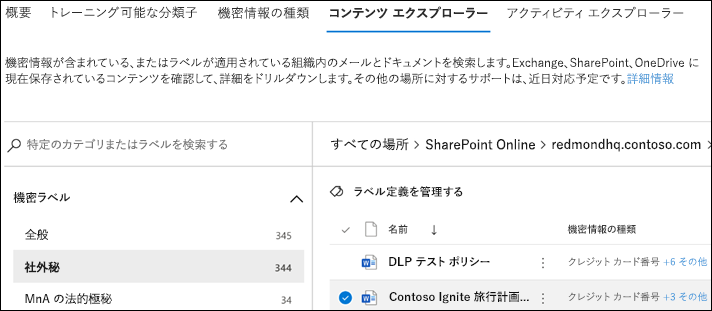

# データ分類コンテンツ エクスプローラー (プレビュー)

データ分類コンテンツ エクスプローラーにより、概要ページで要約されたアイテムをネイティブに表示することができます。

## コンテンツ エクスプローラー

コンテンツ エクスプローラーは、機密ラベル、保持ラベルまたは組織で機密情報の種類として分類されているアイテムの現在のスナップショットです。

### アクセス許可

コンテンツ エクスプローラーにアクセス権を付与するロールは 2 つあります。

- **コンテンツ エクスプローラーのリスト ビューアー**: このロールのメンバーシップにより、ユーザーは各アイテムおよびその場所を確認することができます。

- **コンテンツ エクスプローラーのコンテンツ ビューアー**: このロールのメンバーシップにより、ユーザーはリスト内の各アイテムのコンテンツを表示することができます。

コンテンツ エクスプローラーにアクセスするために使用するアカウントには、1 つまたは両方のロールがある必要があります。 独立した役割があり、累積ではありません。 たとえば、アイテムおよびそれらの場所のみ表示する機能をアカウントに付与する場合は、コンテンツ エクスプローラーのリスト ビューアーの権利を付与します。 その同じアカウントでリスト内のアイテムのコンテンツも表示できるようにするには、コンテンツ エクスプローラーのコンテンツ ビューアーの権利も付与します。

### コンテンツ エクスプローラーの使用方法

1. **Microsoft 365 コンプライアンス センター**  > **[データ分類]** > **[コンテンツ エクスプローラー]** の順に開きます。
2. ラベルの名前または機密情報の種類が分かる場合は、それを検索ボックスに入力することができます。
3. 交互に、ラベルの種類を展開してリストからラベルを選択し、アイテムを参照することができます。以下にリストの保持ラベルの部分を示します。
4. [**すべての場所**] の下で場所を選択して、アイテムのフォルダー構造をドリルダウンします。
5. ダブルクリックして、コンテンツ エクスプローラーでネイティブにアイテムを開きます。

## 関連項目

- [機密ラベル](sensitivity-labels.md)
- [保持ラベル](labels.md)
- [機密情報の種類の検索基準](what-the-sensitive-information-types-look-for.md)
- [アイテム保持ポリシーの概要](retention-policies.md)
