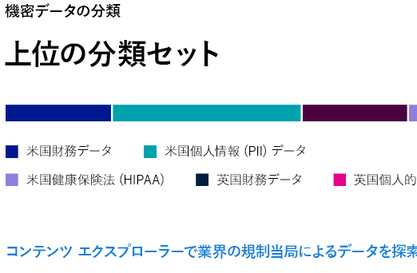
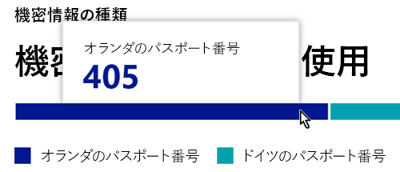
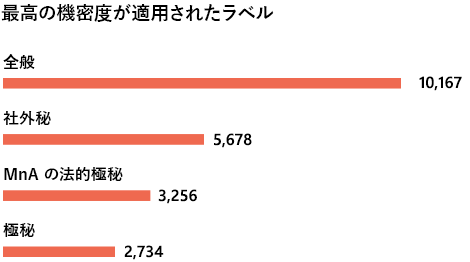

# データ分類について

Microsoft 365 の管理者またはコンプライアンス管理者は、組織内のコンテンツを評価してタグ付けすることにより、コンテンツの保存場所を制御し、保存場所に関わらずコンテンツを保護でき、また、組織のニーズに合わせてコンテンツを保持および削除できるようになります。 これらは、[秘密ラベル](sensitivity-labels.md)、[保持ラベル](retention.md#retention-labels)、および機密情報の種類の分類を適用することにより行います。 検出、評価、タグ付けを行うにはさまざまな方法がありますが、最終的には、これらのラベルの一方または両方を使用してタグ付けおよび分類された大量のドキュメントとメールが生み出される可能性があります。 保持ラベルと機密ラベルを適用した後は、テナント全体でラベルがどのように使用されているか、これらのアイテムを使用してどのような操作が行われているかを確認する必要があります。 こうした内容は、データ分類のページで確認できます。具体的には次の内容を確認できます。

- 機密情報の種類として分類されたアイテムの数およびこれらの分類の種類
- Microsoft 365 および Azure Information Protection の両方で最も多く適用されている機密ラベル
- 最も多く適用されている保持ラベル
- 機密コンテンツに対してユーザーが行っているアクティビティの概要
- 機密データおよび保持されたデータの保存場所

これらの機能は、データ分類のページでも管理することができます。

- [トレーニング可能な分類子](classifier-learn-about.md)
- [機密情報の種類](sensitive-information-type-learn-about.md)
- [完全に一致するデータ](create-custom-sensitive-information-types-with-exact-data-match-based-classification.md)
- [コンテンツ エクスプローラー](data-classification-content-explorer.md)
- [アクティビティ エクスプローラー](data-classification-activity-explorer.md)

データ分類は、**Microsoft 365 コンプライアンス センター** または **Microsoft 365 セキュリティ センター**  >  [**分類**]  >  [**データ分類**] で確認することができます。

データ分類機能についてのビデオ ツアーを開始します。

> [!VIDEO https://www.microsoft.com/videoplayer/embed/RE4vx8x]

データ分類は、ポリシーを作成する前に、機密コンテンツとラベル付きコンテンツをスキャンします。 これは **ゼロ変更管理** と呼ばれます。 これにより、すべての保持ラベルおよび機密ラベルが環境に与える影響を確認でき、保護ポリシーおよびガバナンス ポリシーのニーズの評価を開始できます。

## 前提条件

さまざまなサブスクリプションがエンドポイント DLP をサポートしています。 エンドポイント DLP のライセンス オプションについては、「[情報保護ライセンスのガイダンス](/office365/servicedescriptions/microsoft-365-service-descriptions/microsoft-365-tenantlevel-services-licensing-guidance/microsoft-365-security-compliance-licensing-guidance#information-protection)」を参照してください。 

### アクセス許可

 データ分類のページにアクセスするには、アカウントはこれらの役割または役割グループに割り当てられたメンバーシップであることが必要です。

**Microsoft 365 の役割グループ**

- 全体管理者
- コンプライアンス管理者
- セキュリティ管理者
- コンプライアンス データ管理者

> [!NOTE]
> ベスト プラクティスとして、Microsoft 365 データ分類へのアクセスを許可するには、常に最小特権の役割を使用します。

## コンテンツで最も多く使用されている機密情報の種類

Microsoft 365 では、社会保障番号を含むアイテムやクレジットカード番号を含むアイテムなど、機密情報の種類の定義が多数提供されています。 機密情報の種類の詳細については、「[機密情報の種類のエンティティ定義](sensitive-information-type-entity-definitions.md)」を参照してください。

機密情報の種類カードには、組織全体で検出されたラベル付けされている機密情報の種類のうち上位のものが示されます。

特定の分類カテゴリに含まれるアイテムの数を確認するには、そのカテゴリのバーをポイントします。

> [!NOTE]
> "No data found with sensitive information" (機密情報が含まれるデータが見つかりませんでした) というメッセージがカードに表示される場合、 機密情報の種類として分類されているアイテムが組織に存在しないか、クロールされたアイテムが存在しないことを意味します。 ラベルの使用を開始するには、次を参照してください。
>- [秘密度ラベルの使用を開始する](get-started-with-sensitivity-labels.md)
>- [保持ポリシーおよび保持ラベルの使用を開始する](get-started-with-retention.md)
>- [機密情報の種類のエンティティ定義](sensitive-information-type-entity-definitions.md)

## コンテンツに適用されている上位の機密ラベル

Microsoft 365 または Azure Information Protection (AIP) のいずれかでアイテムに機密ラベルを適用すると、次の 2 つのことが起こります。

- 組織にとってのアイテムの価値を示すタグがドキュメントに埋め込まれ、そのタグはドキュメントとともにどこにでも移動します。
- タグが含まれることで、必須のウォーターマークや暗号化など、さまざまな保護機能が有効化されます。 エンド ポイントの保護を有効にすると、アイテムを組織の制御から離れさせないようにもできます。

機密ラベルの詳細については、「[Learn about sensitivity labels (機密ラベルの詳細)](sensitivity-labels.md)」を参照してください。

SharePoint および OneDrive にあるファイルに対応するデータがデータ分類ページに表示されるようにするには、機密度ラベルを有効にする必要があります。 詳細については、「[SharePoint および OneDrive で Office ファイルの機密度ラベルを有効にする](sensitivity-labels-sharepoint-onedrive-files.md)」を参照してください。

機密ラベル カードには、機密レベルごとのアイテム (メールやドキュメント) の数が表示されます。

> [!NOTE]
> 機密ラベルをまだ作成または発行していない場合、または、いずれのコンテンツにも機密ラベルが適用されていない場合、"No sensitivity labels detected" (機密ラベルが検出されませんでした) というメッセージがこのカードに表示されます。機密ラベルの使用を開始するには、以下を参照してください。
>- [機密ラベルの使用を開始する](get-started-with-sensitivity-labels.md) または、AIP については [Azure Information Protection ポリシーを構成する](/azure/information-protection/configure-policy)

## コンテンツに適用されている上位の保持ラベル

保持ラベルは、組織内のコンテンツの保持と廃棄を管理するために使用されます。 適用された保持ラベルは、アイテムが削除されるまでどのように保持するか、削除前に確認を必要とするかどうか、保持期間の有効期限、記録としてマークするかどうかを制御するために使用されます。 詳細については、「[アイテム保持ポリシーと保持ラベルの詳細](retention.md)」を参照してください。

最も多く適用されている保持ラベルのカードには、特定の保持ラベルが付けられているアイテムの数が表示されます。

> [!NOTE]
> "No retention labels detected" (保持ラベルが検出されませんでした) というメッセージがカードに表示される場合、保持ラベルが作成または発行されていないか、いずれのコンテンツにも保持ラベルが適用されていないことを意味します。保持ラベルの使用を開始するには、以下を参照してください。
>- [アイテム保持ポリシーおよび保持ラベルの使用を開始する](get-started-with-retention.md)

## 検出された上位アクティビティ

このカードでは、機密ラベルが付けられたアイテムに対してユーザーが行う最も一般的な操作の概要が示されます。 [アクティビティ エクスプローラー](data-classification-activity-explorer.md)を使用すると、ラベル付きコンテンツおよび Windows 10 のエンドポイントにあるコンテンツでの、Microsoft 365 により追跡されるいくつかのアクティビティの詳細を確認できます。

> [!NOTE]
> "No activity detected" (アクティビティが検出されませんでした) というメッセージがこのカードに表示される場合、ファイルに対して行われたアクティビティがなかったか、ユーザーまたは管理者による監査が有効化されていないことを意味します。監査ログをオンにするには、以下を参照してください。
>- [セキュリティ/コンプライアンス センターで監査ログを検索する](search-the-audit-log-in-security-and-compliance.md)

## 場所別の機密ラベルおよび保持ラベル付きデータ

データ分類の報告の目的は、どのラベルが付いているアイテムがどこにいくつあるかを確認できるようにすることにあります。 これらのカードでは、Exchange、SharePoint、OneDrive などにあるラベル付きのアイテムの数が表示されます。

> [!NOTE]
> "No locations detected" (場所が検出されませんでした) というメッセージがこのカードに表示される場合、機密ラベルが作成または発行されていないか、いずれのコンテンツにも保持ラベルが適用されていないことを意味します。機密ラベルの使用を開始するには、以下を参照してください。
>- [機密ラベル](sensitivity-labels.md)

## 関連項目

- [ラベル アクティビティの表示](data-classification-activity-explorer.md)
- [ラベル付きコンテンツの表示](data-classification-content-explorer.md)
- [秘密度ラベルの詳細](sensitivity-labels.md)
- [アイテム保持ポリシーと保持ラベルの詳細](retention.md)
- [機密情報の種類に関する詳細情報](sensitive-information-type-learn-about.md)
- [機密情報の種類のエンティティ定義](sensitive-information-type-entity-definitions.md)
- [トレーニング可能な分類子の詳細 (プレビュー)](classifier-learn-about.md)

データ分類を使用してデータ プライバシー規制に準拠する方法については、「[Microsoft 365 における、データ プライバシー規制のための情報の展開保護](../solutions/information-protection-deploy.md)」(aka.ms/m365dataprivacy) を参照してください。