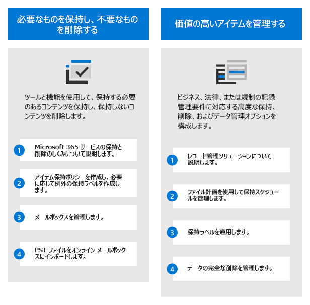
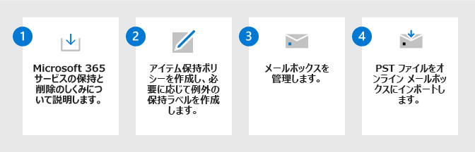

# Microsoft Purview を使用してデータ ガバナンス ソリューションをデプロイする

>*[セキュリティとコンプライアンスのための Microsoft 365 ライセンス ガイダンス](/office365/servicedescriptions/microsoft-365-service-descriptions/microsoft-365-tenantlevel-services-licensing-guidance/microsoft-365-security-compliance-licensing-guidance)。*

**Microsoft Purview データ ライフサイクル管理** (以前の Microsoft Information Governance) と **Microsoft Purview レコード管理** を使用し、コンプライアンスや規制要件に対応して Microsoft 365 データを統制します。

マルチクラウド、サービスとしてのソフトウェア (SaaS) など、データ資産全体のデータをマップおよび管理するデータ ガバナンスの場合は、[Microsoft Purview Data Map、Microsoft Purview Data Catalog、Microsoft Purview Data Estate Insights](/azure/purview/overview) を使用します。

データ保護ソリューションについては、「[Microsoft Purview を使用して情報保護ソリューションをデプロイする](information-protection-solution.md)」を参照してください。

## ライセンス

ライセンス要件とオプションを理解するには、セキュリティとコンプライアンスに関する Microsoft 365 ガイダンスの情報を参照してください。機能レベルのライセンス要件については、[Microsoft Purview データ ライフサイクル管理および Microsoft Purview レコード管理](/office365/servicedescriptions/microsoft-365-service-descriptions/microsoft-365-tenantlevel-services-licensing-guidance/microsoft-365-security-compliance-licensing-guidance#microsoft-purview-data-lifecycle-management--microsoft-purview-records-management)のセクションを参照してください。

## 必要なものを保持し、不要なものを削除する

**Microsoft Purview データ ライフサイクル管理** (旧称 Microsoft Information Governance) を使用して、必要なものを保持し、不要なものを削除します。

|手順|説明|詳細情報|
|:---|:----------|:---------------|
|1| Microsoft 365 サービスの保持と削除のしくみについて説明します。    アイテム保持ポリシーと保持ラベルを使用する方法を理解したら、アイテム保持ポリシーが必要なワークロードと、例外の保持ラベルを作成する必要があるかどうかを特定します。 | [アイテム保持ポリシーと保持ラベルの詳細](retention.md)|
|2| アイテム保持ポリシーを作成し、必要に応じて例外の保持ラベルを作成します。    最も一般的に使用されるアイテム保持ポリシーは、Exchange、SharePoint、Teams、Microsoft 365 グループ、および Yammer 用です。 ドキュメントとメールの例外を構成できます。 | [アイテム保持ポリシーの作成](create-retention-policies.md) 
 [例外の保持ラベルを作成して適用する](create-retention-labels-information-governance.md)|
|3| メールボックスを管理します。    アーカイブと自動拡張アーカイブのためにメールボックスを有効にし、メールをアーカイブ メールボックスに移動するタイミングをカスタマイズし、ユーザーが組織を離れたときにメールボックスを非アクティブにする必要があるかどうかを検討します。| [アーカイブ メールボックスの有効化](enable-archive-mailboxes.md) 
 [自動拡張アーカイブを有効にする](enable-autoexpanding-archiving.md) 
 [非アクティブなメールボックスを作成および管理する](create-and-manage-inactive-mailboxes.md)|
|4| PST ファイルをオンライン メールボックスにインポートします。     統制するデータを含む PST ファイルがある場合、ネットワーク アップロードまたはドライブの発送を使用してインポートできます。| [ネットワーク アップロードを使用して、組織の PST ファイルをインポートする](use-network-upload-to-import-pst-files.md) 
 [ドライブの発送を使用して組織の PST ファイルをインポートする](use-drive-shipping-to-import-pst-files-to-office-365.md)|

このソリューションの機能の詳細については、「[データ ライフサイクル管理の詳細](information-governance.md)」を参照してください。

## 価値の高いアイテムを管理する

**Microsoft Purview レコード管理** を使用して、ビジネス、法律、規制のレコード管理要件に対応する組織の高価値のアイテムを管理します。

|手順|説明|詳細情報|
|:---|:----------|:---------------|
|1| レコード管理ソリューションについて説明します。    より柔軟な構成オプションで保持ラベルを使用し、必要に応じてアイテムをレコードとして宣言します。 | [レコード管理の詳細](records-management.md)|
|2| ファイル計画を使用して保持スケジュールを管理します。    ファイル計画を使用して、保持ラベルを対話的に作成したり、一括インポートしたり、分析用にエクスポートしたりできます。 計画を使用して作成するラベルは、ビジネス要件や規制要件を特定して追跡するのに役立つ、追加の管理情報をサポートしています。 | [ファイル計画を使用して保持ラベルを作成および管理する](file-plan-manager.md)|
|3| 保持ラベルを適用します。    保持ラベルは、アプリ内で手動または自動で発行および適用したり、機密情報、キーワード、または検索可能なプロパティ、トレーニング可能な分類子、クラウドの添付ファイルに基づいて自動適用したりできます。 |[アイテム保持ラベルを発行してアプリに適用する](create-apply-retention-labels.md) 
 [保持ラベルをコンテンツに自動的に適用する](apply-retention-labels-automatically.md)|
|4| データの完全な削除を管理します。    データの処理と呼ばれる場合は、完全に削除される前にコンテンツを手動で確認し、レコードの処理の証明を提示できます。 |[コンテンツの処理を管理する](disposition.md)|

> [!TIP]
> レコード管理でサポートされている追加の構成については、[一般的なシナリオ](get-started-with-records-management.md#common-scenarios)の一覧を確認してください。

このソリューションの機能の詳細については、「[レコード管理の詳細](records-management.md)」を参照してください。

## トレーニング リソース

コンサルタントと管理者向けの学習モジュール:

- [Microsoft Purview での情報保護とデータ ライフサイクル管理の概要](/learn/modules/m365-compliance-information-governance)
- [Microsoft Purview でデータ ライフサイクルを管理する](/learn/modules/m365-compliance-information-govern-information/)
- [Microsoft Purview でレコードを管理する](/learn/modules/m365-compliance-information-manage-records/)

これらのソリューションのデプロイ時にユーザーをサポートするためのドキュメントについては、[データ ライフサイクル管理](get-started-with-information-governance.md#end-user-documentation)と[レコード管理](get-started-with-records-management.md#end-user-documentation)のエンド ユーザー ドキュメントセクションを参照してください。