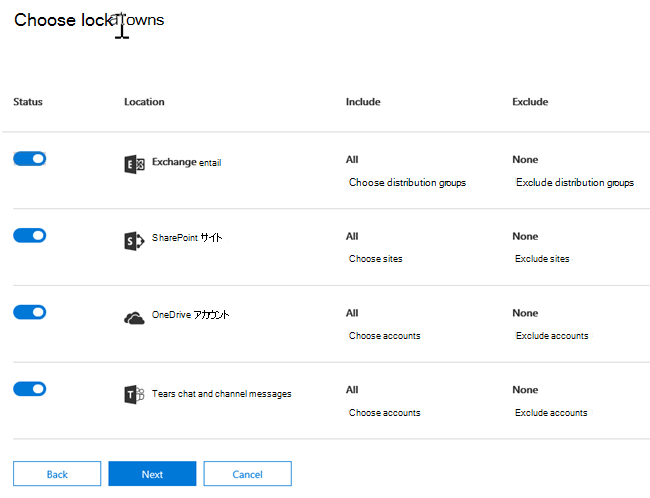

# データ損失防止の概要Overview of data loss prevention
<!-- this topic needs to be split into smaller, more coherent ones. It is confusing as it is. -->
<!-- move this note to a more appropriate place, no topic should start with a note -->
> [!NOTE]
> 最近、Office 365 Advanced Compliance のライセンスを取得しているユーザー向けに、データ損失防止機能が Microsoft Teams のチャットとチャネルのメッセージに追加されました。これはスタンドアロンのオプションとして提供されており、Office 365 E5 および Microsoft 365 E5 コンプライアンスに含まれています。Data loss prevention capabilities were recently added to Microsoft Teams chat and channel messages for users licensed for Office 365 Advanced Compliance, which is available as a standalone option and is included in Office 365 E5 and Microsoft 365 E5 Compliance. ライセンス要件の詳細については、「[Microsoft 365 テナントレベル サービスのライセンスに関するガイダンス](https://docs.microsoft.com/office365/servicedescriptions/microsoft-365-service-descriptions/microsoft-365-tenantlevel-services-licensing-guidance)」を参照してください。To learn more about licensing requirements, see [Microsoft 365 Tenant-Level Services Licensing Guidance](https://docs.microsoft.com/office365/servicedescriptions/microsoft-365-service-descriptions/microsoft-365-tenantlevel-services-licensing-guidance).

ビジネスの標準や業界の規制に準拠するために、組織は機密情報を保護し、不注意による情報漏えいを防ぐ必要があります。To comply with business standards and industry regulations, organizations must protect sensitive information and prevent its inadvertent disclosure. 機密情報には、財務データや個人情報 (PII) (クレジット カード番号、社会保障番号、健康記録など) があります。Sensitive information can include financial data or personally identifiable information (PII) such as credit card numbers, social security numbers, or health records. Office 365 セキュリティ &amp; コンプライアンス センターのデータ損失防止 (DLP) ポリシーでは、Office 365 全体の機密情報を識別、監視、または自動的に保護できます。With a data loss prevention (DLP) policy in the Office 365 Security &amp; Compliance Center, you can identify, monitor, and automatically protect sensitive information across Office 365.
  
DLP ポリシーでは次のことが可能です。With a DLP policy, you can:
  
- **Exchange Online、SharePoint Online、OneDrive for Business、Microsoft Teams などの複数の保管場所での機密情報の識別。****Identify sensitive information across many locations, such as Exchange Online, SharePoint Online, OneDrive for Business, and Microsoft Teams.**
    
    たとえば、OneDrive for Business サイトに保存されているクレジット カード番号を含む文書を特定したり、特定のユーザーの OneDrive サイトだけを監視したりできます。For example, you can identify any document containing a credit card number that's stored in any OneDrive for Business site, or you can monitor just the OneDrive sites of specific people.
    
- **機密情報が誤って共有されるのを保護。****Prevent the accidental sharing of sensitive information**. 
    
    たとえば、組織外のユーザーと共有されている健康記録を含むドキュメントやメールを識別し、そのドキュメントへのアクセスやメールが送信されるのを自動的にブロックできます。For example, you can identify any document or email containing a health record that's shared with people outside your organization, and then automatically block access to that document or block the email from being sent.
    
- **デスクトップ バージョンの Excel、PowerPoint、Word 内の機密情報の監視と保護。****Monitor and protect sensitive information in the desktop versions of Excel, PowerPoint, and Word.**
    
    Exchange Online、SharePoint Online、OneDrive for Business 同様、これらの Office デスクトップ プログラムにも機密情報を識別し、DLP ポリシーを適用する同じ機能が組み込まれています。Just like in Exchange Online, SharePoint Online, and OneDrive for Business, these Office desktop programs include the same capabilities to identify sensitive information and apply DLP policies. 他のユーザーとこうした Office プログラムのコンテンツを共有すると、DLP によって継続的な監視が行われます。DLP provides continuous monitoring when people share content in these Office programs.
    
- **ワークフローを中断することなく準拠を維持する方法についてのユーザーに対する説明。****Help users learn how to stay compliant without interrupting their workflow.**
    
    DLP ポリシーについてユーザーを教育し、作業を妨げることなく準拠を維持できるようにします。You can educate your users about DLP policies and help them remain compliant without blocking their work. たとえば、ユーザーが機密情報を含むドキュメントを共有しようとした場合、DLP ポリシーは、メール通知をユーザーに送信すると共に、業務上の妥当性がある場合にはポリシーを無効にできるドキュメント ライブラリのコンテキストでポリシー ヒントを表示できます。For example, if a user tries to share a document containing sensitive information, a DLP policy can both send them an email notification and show them a policy tip in the context of the document library that allows them to override the policy if they have a business justification. Outlook on the web、Outlook、Excel、PowerPoint、Word でも同じポリシー ヒントが表示されます。The same policy tips also appear in Outlook on the web, Outlook, Excel, PowerPoint, and Word.
    
- **組織の DLP ポリシーと一致するコンテンツを示す DLP レポートの表示。****View DLP reports showing content that matches your organization's DLP policies.**
    
    DLP ポリシーへの組織の準拠状態を評価するには、各ポリシーやルールへの一致数の時間経過による変化を見ることができます。To assess how your organization is complying with a DLP policy, you can see how many matches each policy and rule has over time. DLP ポリシーでポリシー ヒントの上書きおよび誤検知の報告がユーザーに許可されている場合は、ユーザーが報告した内容を確認することもできます。If a DLP policy allows users to override a policy tip and report a false positive, you can also view what users have reported.
    
Office 365 セキュリティ &amp; コンプライアンス センターの [データ損失防止] ページで、 DLP ポリシーを作成して管理します。You create and manage DLP policies on the Data loss prevention page in the Office 365 Security &amp; Compliance Center.
  
![Office 365 セキュリティ &amp; コンプライアンス センターの [データ損失防止] ページ](../media/943fd01c-d7aa-43a9-846d-0561321a405e.png)
  
## DLP ポリシーの内容What a DLP policy contains

DLP ポリシーにはいくつかの基本的な内容が含まれます。A DLP policy contains a few basic things:
  
- コンテンツを保護する場所: Exchange Online、SharePoint Online、OneDrive for Business のサイトの他、Microsoft Teams のチャットおよびチャネル メッセージなどの**保管場所**。Where to protect the content: **locations** such as Exchange Online, SharePoint Online, and OneDrive for Business sites, as well as Microsoft Teams chat and channel messages. 
    
- **ルール**を適用することによってコンテンツを保護する場合と方法は、次のもので構成されます。When and how to protect the content by enforcing **rules** comprised of: 
    
  - ルールを適用する前にコンテンツが一致する必要がある**条件**。**Conditions** the content must match before the rule is enforced. たとえば、ルールは組織外のユーザーと共有されている社会保障番号を含むコンテンツのみを探すよう構成されていることがあります。For example, a rule might be configured to look only for content containing Social Security numbers that's been shared with people outside your organization. 
    
  - 条件に一致するコンテンツが見つかったときにルールが自動的に実行する**アクション**。**Actions** that you want the rule to take automatically when content matching the conditions is found. たとえば、ドキュメントへのアクセスをブロックし、ユーザーおよびコンプライアンス責任者の双方にメール通知を送信するようにルールが構成されていることがあります。For example, a rule might be configured to block access to a document and send both the user and compliance officer an email notification. 
    
ルールを使用して特定の保護要件を満たし、DLP ポリシーを使用して一般的な保護要件をグループ化できます (たとえば、特定の規制に準拠する必要のあるすべてのルール)。You can use a rule to meet a specific protection requirement, and then use a DLP policy to group together common protection requirements, such as all of the rules needed to comply with a specific regulation.
  
たとえば、Health Insurance Portability and Accountability Act (HIPAA) の対象となる情報の存在を検出する際に役立つ DLP ポリシーがあるとします。For example, you might have a DLP policy that helps you detect the presence of information subject to the Health Insurance Portability and Accountability Act (HIPAA). この DLP ポリシーは、HIPAA データ (対象) をすべての SharePoint Online サイトと OneDrive for Business サイト (場所) で保護するために、組織外の人物と共有するこの機密情報が含まれるドキュメント (条件) を検出し、そのドキュメントに対するアクセスをブロックして通知を送信 (アクション) できます。This DLP policy could help protect HIPAA data (the what) across all SharePoint Online sites and all OneDrive for Business sites (the where) by finding any document containing this sensitive information that's shared with people outside your organization (the conditions) and then blocking access to the document and sending a notification (the actions). これらの要件は、個別のルールとして保存され、簡単に管理およびレポートする DLP ポリシーとしてまとめてグループ化されます。These requirements are stored as individual rules and grouped together as a DLP policy to simplify management and reporting.
  

  
### 場所Locations

DLP ポリシーは、Office 365 全体で機密情報を検出して保護できます。情報が Exchange Online、SharePoint Online、OneDrive for Business、Microsoft Teams のいずれかに保存されていてもかまいません。A DLP policy can find and protect sensitive information across Office 365, whether that information is located in Exchange Online, SharePoint Online, OneDrive for Business, or Microsoft Teams. Exchange メール、Microsoft Teams のチャットとチャネル メッセージ、およびすべての SharePoint または OneDrive ライブラリ内のコンテンツを保護するか、ポリシーの特定の場所を選択できます。You can choose to protect content in Exchange email, Microsoft Teams chats and channel messages, and all SharePoint or OneDrive libraries, or select specific locations for a policy.
  

 Exchange に特定の配布グループを含めるように選択した場合、DLP ポリシーはそのグループのメンバーにのみ適用されます。If you choose to include specific distribution groups in Exchange, the DLP policy will be scoped only to the members of that group. 同様に、配布グループを除外すると、その配布グループのすべてのメンバーがポリシー評価から除外されます。Similarly excluding a distribution group will exclude all the members of that distribution group from policy evaluation. ポリシーを配布リストのメンバー、動的配布グループ、セキュリティ グループの範囲にすることができます。You can choose to scope a policy to the members of distribution lists, dynamic distribution groups, and security groups. DLP ポリシーには、このような追加および除外を 50 個まで含めることができます。A DLP policy can contain no more than 50 such inclusions and exclusions.

特定の SharePoint サイトまたは OneDrive アカウントを含めるか、除外するかを選択した場合、DLP ポリシーに含めることができるのは、100 を超えることはできません。If you choose to include or exclude specific SharePoint sites or OneDrive accounts, a DLP policy can contain no more than 100 such inclusions and exclusions. こうした制限はありますが、組織全体のポリシーまたは場所全体に適用されるポリシーを適用することで、この制限を超えることができます。Although this limit exists, you can exceed this limit by applying either an org-wide policy or a policy that applies to entire locations.
  
### ルールRules

ルールとは、組織のコンテンツにビジネス要件を適用するものです。Rules are what enforce your business requirements on your organization's content. ポリシーには 1 つ以上のルールが含まれ、各ルールには、条件とアクションが含まれます。A policy contains one or more rules, and each rule consists of conditions and actions. ルールごとに、条件を満たすとアクションが自動的に実行されます。For each rule, when the conditions are met, the actions are taken automatically. ルールは、各ポリシー内の最も高位のルールから順に実行されます。Rules are executed sequentially, starting with the highest-priority rule in each policy.
  
また、ルールには、コンテンツがルールに一致していることを (ポリシー ヒントとメール通知を持つ) ユーザーと (メール インシデント レポートを持つ) 管理者に通知するオプションも用意されています。A rule also provides options to notify users (with policy tips and email notifications) and admins (with email incident reports) that content has matched the rule.
  
ここでは、ルールの構成要素をそれぞれ詳しく説明します。Here are the components of a rule, each explained below.
  

  
#### 条件Conditions

条件は、探す情報の種類および操作をいつ実行するかを決定するため重要です。Conditions are important because they determine what types of information you're looking for, and when to take an action. たとえば、パスポート番号を含むコンテンツは、コンテンツに含まれる番号が 10 個より多く組織外のユーザーと共有されている場合以外は無視する、といった条件を作成できます。For example, you might choose to ignore content containing passport numbers unless the content contains more than 10 such numbers and is shared with people outside your organization.
  
条件は、探す機密情報の種類などの**コンテンツ**と、ドキュメントが共有されているユーザーなどの**コンテキスト**に注目します。Conditions focus on the **content**, such as what types of sensitive information you're looking for, and also on the **context**, such as who the document is shared with. 条件を使用して、さまざまな操作をリスクレベル別に割り当てることができます。You can use conditions to assign different actions to different risk levels. たとえば、組織内で共有されている機密コンテンツは、組織外のユーザーと共有されている機密コンテンツよりリスク レベルが低く、必要なアクションを少なくする、といったことができます。For example, sensitive content shared internally might be lower risk and require fewer actions than sensitive content shared with people outside the organization. 
  

  
現在使用可能な条件では、以下のことを判定できます。The conditions now available can determine if:
  
- コンテンツに機密情報が含まれている。Content contains a type of sensitive information.
    
- コンテンツにラベルが含まれている。Content contains a label. 詳細については、以下の「[DLP ポリシーでラベルを条件として使用する](#using-a-label-as-a-condition-in-a-dlp-policy)」セクションを参照してください。For more information, see the below section [Using a label as a condition in a DLP policy](#using-a-label-as-a-condition-in-a-dlp-policy).
    
- コンテンツが組織の内または外のユーザーと共有されている。Content is shared with people outside or inside your organization.

> [!NOTE]
> ホストの組織の Active Directory または Azure Active Directory のテナントにゲスト以外のアカウントを持っているユーザーは、組織内のユーザーと見なされます。Users who have non-guest accounts in a host organization's Active Directory or Azure Active Directory tenant are considered as people inside the organization.
    
#### 機密情報の種類Types of sensitive information

DLP ポリシーは、**機密情報の種類**として定義されている機密情報を保護するのに役立ちます。A DLP policy can help protect sensitive information, which is defined as a **sensitive information type**. Office 365 には、クレジット カード番号、銀行口座番号、国内 ID 番号、パスポート番号など、さまざまな分野の一般的な機密情報の種類の定義が数多く含まれていて、すぐに使用できます。Office 365 includes definitions for many common sensitive information types across many different regions that are ready for you to use, such as a credit card number, bank account numbers, national ID numbers, and passport numbers. 
  

  
DLP ポリシーによってクレジット カード番号などの機密情報の種類を検索する場合、単に 16 桁の数字を検索するわけではありません。When a DLP policy looks for a sensitive information type such as a credit card number, it doesn't simply look for a 16-digit number. 機密情報のそれぞれの種類が定義され、以下の組み合わせを使用して検出されます。Each sensitive information type is defined and detected by using a combination of:
  
- キーワードKeywords
    
- チェックサムや構成を検証するための内部関数Internal functions to validate checksums or composition
    
- パターンの一致を検出するための正規表現の評価Evaluation of regular expressions to find pattern matches
    
- その他のコンテンツの検査Other content examination
    
これにより、DLP 検出処理において、作業の中断原因となる誤検知の数を減らし、正確性を高めることができます。This helps DLP detection achieve a high degree of accuracy while reducing the number of false positives that can interrupt peoples' work.
  
#### 操作Actions

コンテンツがルールの条件と一致したら、操作を適用してコンテンツを自動的に保護できます。When content matches a condition in a rule, you can apply actions to automatically protect the content.
  

  
現在は次のような操作を使用できます。With the actions now available, you can:
  
- **コンテンツへのアクセスを制限する** サイトのコンテンツの場合、これは、プライマリ サイト コレクション管理者、ドキュメントの所有者、ドキュメントを最後に変更したユーザーを除くすべてのユーザーについて、ドキュメントへのアクセス許可が制限されることを意味します。**Restrict access to the content** For site content, this means that permissions for the document are restricted for everyone except the primary site collection administrator, document owner, and person who last modified the document. これらのユーザーは、ドキュメントの機密情報の削除や、他の修正操作を実行できます。These people can remove the sensitive information from the document or take other remedial action. ドキュメントがコンプライアンスを遵守した状態になった場合、元のアクセス許可が自動的に復元されます。When the document is in compliance, the original permissions are automatically restored. ドキュメントへのアクセスがブロックされているときは、サイトのライブラリでドキュメントに特別なポリシー ヒントのアイコンが表示されます。When access to a document is blocked, the document appears with a special policy tip icon in the library on the site. 
    
    
  
    メール コンテンツの場合は、この操作によりメッセージの送信がブロックされます。For email content, this action blocks the message from being sent. DLP ルールの構成方法によっては、NDR または (ルールで通知が使用されている場合) ポリシー ヒントやメール通知が送信者に表示されます。Depending on how the DLP rule is configured, the sender sees an NDR or (if the rule uses a notification) a policy tip and/or email notification.
    
    
  
#### ユーザー通知とユーザーによる上書きUser notifications and user overrides

通知と上書きを使用して、DLP ポリシーについてユーザーを教育し、作業を妨げることなく準拠を維持できるようにします。You can use notifications and overrides to educate your users about DLP policies and help them remain compliant without blocking their work. たとえば、ユーザーが機密情報を含むドキュメントを共有しようとした場合、DLP ポリシーは、メール通知をユーザーに送信すると共に、業務上の妥当性がある場合にはポリシーを無効にできるドキュメント ライブラリのコンテキストでポリシー ヒントを表示できます。For example, if a user tries to share a document containing sensitive information, a DLP policy can both send them an email notification and show them a policy tip in the context of the document library that allows them to override the policy if they have a business justification.
  

  
コンテンツを送信したユーザー、コンテンツを共有しているユーザー、または最後にコンテンツを変更したユーザーにメールで通知でき、サイト コンテンツについては、主要なサイト コレクション管理者とドキュメントの所有者に通知できます。The email can notify the person who sent, shared, or last modified the content and, for site content, the primary site collection administrator and document owner. さらに、メール通知から選択したユーザーを追加または削除することができます。In addition, you can add or remove whomever you choose from the email notification.
  
メール通知の送信に加えて、ユーザー通知にはポリシー ヒントも表示されます。In addition to sending an email notification, a user notification displays a policy tip:
  
- Outlook および Outlook on the web の場合。In Outlook and Outlook on the web.
    
- SharePoint Online または OneDrive for Business サイトにあるドキュメントの場合。For the document on a SharePoint Online or OneDrive for Business site.
    
- DLP ポリシーに含まれるサイトにドキュメントが格納されている場合に、Excel、PowerPoint、Word。In Excel, PowerPoint, and Word, when the document is stored on a site included in a DLP policy.
    
メール通知およびポリシー ヒントでは、コンテンツが DLP ポリシーに違反している理由が説明されています。The email notification and policy tip explain why content conflicts with a DLP policy. 洗濯した場合、ユーザーが誤検知を報告するか業務上の妥当性を示すことによってルールを上書きすることを、メール通知およびポリシー ヒントで許可できます。If you choose, the email notification and policy tip can allow users to override a rule by reporting a false positive or providing a business justification. これは、DLP ポリシーについてユーザーを教育し、ユーザーの仕事を妨げることなく DLP ポリシーを適用するのに役立ちます。This can help you educate users about your DLP policies and enforce them without preventing people from doing their work. 上書きおよび誤検知に関する情報は、レポート用に記録され (後の DLP レポートの詳細を参照)、インシデント レポート (次のセクションを参照) にも含まれるため、コンプライアンス責任者は定期的にこの情報を確認できます。Information about overrides and false positives is also logged for reporting (see below about the DLP reports) and included in the incident reports (next section), so that the compliance officer can regularly review this information.
  
OneDrive for Business アカウントにおけるポリシー ヒントの表示内容を示します。Here's what a policy tip looks like in a OneDrive for Business account.
  

 DLP ポリシーのユーザー通知とポリシー ヒントの詳細については、「[通知とポリシー ヒントを使用する](use-notifications-and-policy-tips.md)」を参照してください。To learn more about user notifications and policy tips in DLP policies, see [Use notifications and policy tips](use-notifications-and-policy-tips.md).

#### インシデント レポートIncident reports

ルールが一致する場合は、イベントの詳細を含むインシデント レポートをコンプライアンス担当者 (または選択したユーザー) に送信できます。When a rule is matched, you can send an incident report to your compliance officer (or any people you choose) with details of the event. このレポートには、一致したアイテム、ルールに一致した実際のコンテンツ、コンテンツの最終変更者の名前が含まれます。This report includes information about the item that was matched, the actual content that matched the rule, and the name of the person who last modified the content. メール メッセージの場合、レポートには添付ファイルとして、DLP ポリシーに適合する元のメッセージも含まれます。For email messages, the report also includes as an attachment the original message that matches a DLP policy.
  

  
## グループ化と論理演算子Grouping and logical operators

多くの場合、DLP ポリシーには、米国の社会保障番号が含まれているすべてのコンテンツを特定することなど、単純な要件が含まれています。Often your DLP policy has a straightforward requirement, such as to identify all content that contains a U.S. Social Security Number. ただし、DLP ポリシーによって、より大まかに定義されたデータを特定する必要が生じる場合があります。However, in other scenarios, your DLP policy might need to identify more loosely defined data.
  
たとえば、米国の健康保険法 (HIPAA) の適用対象のコンテンツを特定するには、次を検索する必要があります。For example, to identify content subject to the U.S. Health Insurance Act (HIPAA), you need to look for:
  
- 特定の種類の機密情報 (社会保障番号や麻薬取締局 (DEA) 番号など) を含んでいるコンテンツ。Content that contains specific types of sensitive information, such as a U.S. Social Security Number or Drug Enforcement Agency (DEA) Number.
    
    ANDAND
    
- 特定がより難しいコンテンツ (患者の治療に関する通信記録や提供された医療サービスの説明など)。Content that's more difficult to identify, such as communications about a patient's care or descriptions of medical services provided. コンテンツを特定するには、国際疾病分類 (ICD-9-CM または ICD-10-CM) などの膨大なキーワード リストからキーワードを一致させる必要があります。Identifying this content requires matching keywords from very large keyword lists, such as the International Classification of Diseases (ICD-9-CM or ICD-10-CM).
    
このような大まかに定義されたデータを簡単に特定するには、グループ化と論理演算子 (AND、OR) を使用できます。You can easily identify such loosely defined data by using grouping and logical operators (AND, OR). DLP ポリシーを作成するときに、次のことができます。When you create a DLP policy, you can:
  
- 機密情報の種類をグループ化する。Group sensitive information types.
    
- グループ内の機密情報の種類の間、およびグループ自体の間で使用する論理演算子を選択する。Choose the logical operator between the sensitive information types within a group and between the groups themselves.
    
### グループ内の演算子を選択するChoosing the operator within a group

グループ内では、コンテンツがルールに一致するためにそのグループが満たす必要のある条件が、そのグループ内のいずれかの条件なのか、すべての条件なのかを選択できます。Within a group, you can choose whether any or all of the conditions in that group must be satisfied for the content to match the rule.
  

  
### グループを追加するAdding a group

独自の条件とグループ内で演算子を持つことができるグループをすばやく追加できます。You can quickly add a group, which can have its own conditions and operator within that group.
  
![[グループの追加] ボタン](../media/5f72f292-d1f3-4f11-a911-a9f71e10abf6.png)
  
### グループ間の演算子を選択するChoosing the operator between groups

グループ間では、コンテンツがルールに一致するためにそのグループが満たす必要のある条件が、1 つのグループの条件のみなのか、すべてのグループの条件なのかを選択できます。Between groups, you can choose whether the conditions in just one group or all of the groups must be satisfied for the content to match the rule.
  
たとえば、**米国 HIPAA** の組み込みポリシーには、次を含むコンテンツを特定するために、グループ間で **AND** 演算子を使用するルールがあります。For example, the built-in **U.S. HIPAA** policy has a rule that uses an **AND** operator between the groups so that it identifies content that contains: 
  
- **PII 識別子** グループ (少なくとも 1 つの SSN 番号**または** DEA 番号)from the group **PII Identifiers** (at least one SSN number **OR** DEA number) 
    
    **AND****AND**
    
- **医学用語**グループ (少なくとも 1 つの ICD-9-CM キーワード**または** ICD-10-CM キーワード)from the group **Medical Terms** (at least one ICD-9-CM keyword **OR** ICD-10-CM keyword) 
    

  
## 処理するルールの優先度The priority by which rules are processed

ポリシーでルールを作成すると、作成した順の優先度が各ルールに割り当てられます。つまり、最初に作成したルールの優先度が最も高くなり、2 番目に作成したルールの優先度は 2 番目になります。When you create rules in a policy, each rule is assigned a priority in the order in which it's created — meaning, the rule created first has first priority, the rule created second has second priority, and so on. 
  

  
DLP ポリシーを 1 つ以上設定したら、1 つまたは複数のポリシーの優先順位を変更できます。After you have set up more than one DLP policy, you can change the priority of one or more policies. 変更を行うには、ポリシーを選択し、**[ポリシーの編集]** を選び、**[優先度]** の一覧で優先度を指定します。To do that, select a policy, choose **Edit policy**, and use the **Priority** list to specify its priority.

コンテンツがルールに対して評価されると、ルールは優先度順に処理されます。When content is evaluated against rules, the rules are processed in priority order. コンテンツが複数のルールに一致する場合、ルールは優先度順に処理され、最も制限が厳しい操作が適用されます。If content matches multiple rules, the rules are processed in priority order and the most restrictive action is enforced. たとえば、コンテンツが以下のすべてのルールに一致する場合、最も優先度が高く、制限が厳しいルール 3 が適用されます。For example, if content matches all of the following rules, Rule 3 is enforced because it's the highest priority, most restrictive rule:
  
- ルール 1: ユーザーに通知のみを行うRule 1: only notifies users
    
- ルール 2: ユーザーに通知する、アクセスを制限する、ユーザーによる上書きを許可するRule 2: notifies users, restricts access, and allows user overrides
    
- ルール 3: ユーザーに通知する、アクセスを制限する、ユーザーによる上書きを許可しないRule 3: notifies users, restricts access, and does not allow user overrides
    
- ルール 4: ユーザーに通知のみを行うRule 4: only notifies users
    
- ルール 5: アクセスを制限するRule 5: restricts access
    
- ルール 6: ユーザーに通知する、アクセスを制限する、ユーザーによる上書きを許可しないRule 6: notifies users, restricts access, and does not allow user overrides
    
この例では、最も制限が厳しいルールのみが適用された場合でも、すべてのルールに一致するものは監査ログに記録され、DLP レポートに表示されます。In this example, note that matches for all of the rules are recorded in the audit logs and shown in the DLP reports, even though only the most restrictive rule is enforced.
  
ポリシー ヒントについては、次の点に注意してください。Regarding policy tips, note that:
  
- 最も優先度が高く、制限が厳しいルールのポリシー ヒントのみが表示されます。Only the policy tip from the highest priority, most restrictive rule will be shown. たとえば、単に通知を送信するルールのポリシー ヒントよりも、コンテンツへのアクセスを禁止するルールのポリシー ヒントの方が優先して表示されます。For example, a policy tip from a rule that blocks access to content will be shown over a policy tip from a rule that simply sends a notification. これにより、ポリシー ヒントがカスケード表示されるのを防止します。This prevents people from seeing a cascade of policy tips.
    
- 	最も制限の厳しいルールでユーザーにルールを上書きすることを許可している場合は、このルールを上書きすることで、コンテンツに一致した他のルールもすべて上書きされます。If the policy tips in the most restrictive rule allow people to override the rule, then overriding this rule also overrides any other rules that the content matched.
    
## 一致の難易度を上下するためにルールを調整するTuning rules to make them easier or harder to match

DLP ポリシーを作成して有効にすると、次の問題が発生する可能性があります。After people create and turn on their DLP policies, they sometimes run into these issues:
  
- 機密情報**ではない**大量のコンテンツがルールと一致します。つまり、多数の誤検知が発生します。Too much content that **is not** sensitive information matches the rules — in other words, too many false positives. 
    
- 機密情報**である**コンテンツが小さすぎると、ルールと一致します。Too little content that **is** sensitive information matches the rules. 言い換えると、保護操作は機密情報に対して実行されません。In other words, the protective actions aren't being enforced on the sensitive information. 
    
このような問題に対処するには、インスタンス数と一致精度を変更してコンテンツがルールに一致する難易度を上下させて、ルールを調整します。To address these issues, you can tune your rules by adjusting the instance count and match accuracy to make it harder or easier for content to match the rules. ルールに使用される各機密情報の種類には、インスタンス数と一致精度の両方があります。Each sensitive information type used in a rule has both an instance count and match accuracy.
  
### インスタンス数Instance count

インスタンス数とは、コンテンツがルールに一致すると評価される各機密情報の種類の出現回数です。Instance count means simply how many occurrences of a specific type of sensitive information must be present for content to match the rule. たとえば、1 から 9 の固有の米国または英国の間のコンテンツは、次のルールに一致します。For example, content matches the rule shown below if between 1 and 9 unique U.S. or U.K. パスポート番号が識別されます。passport numbers are identified.
  
インスタンス数では、機密情報の種類とキーワードの**一意**の一致のみがカウントされます。Note that the instance count includes only **unique** matches for sensitive information types and keywords. たとえば、メールの中に同じクレジット カード番号が 10 回出現する場合、その 10 回の出現は、クレジット カード番号の 1 つのインスタンスとしてカウントされます。For example, if an email contains 10 occurrences of the same credit card number, those 10 occurrences count as a single instance of a credit card number. 
  
インスタンス数を使用してルールを調整する方法は簡単です。To use instance count to tune rules, the guidance is straightforward:
  
- ルールに一致させやすくするには、[**最小**] 数を減らし、[**最大**] 数を増やします。To make the rule easier to match, decrease the **min** count and/or increase the **max** count. また、[**最大**] の数値を削除して [**すべて**] に設定することもできます。You can also set **max** to **any** by deleting the numerical value. 
    
- ルールに一致させにくくするには、[**最小**] 数を増やします。To make the rule harder to match, increase the **min** count. 
    
通常、ユーザー通知の送信など、制限の緩い操作は、少ないインスタンス数 (たとえば 1 から 9) のルールで使用します。Typically, you use less restrictive actions, such as sending user notifications, in a rule with a lower instance count (for example, 1-9). また、ユーザーによる上書きを許可せずにコンテンツへのアクセスを制限するなど制限の厳しい操作は、高いインスタンス数 (たとえば 10 からすべて) のルールで使用します。And you use more restrictive actions, such as restricting access to content without allowing user overrides, in a rule with a higher instance count (for example, 10-any).
  

  
### 一致精度Match accuracy

前述のように、機密情報の種類の定義と検出には、さまざまな種類の証拠を組み合わせて使用します。As described above, a sensitive information type is defined and detected by using a combination of different types of evidence. 一般的に、機密情報の種類はそのような複数の組み合わせ (パターンと呼ばれます) で定義されます。Commonly, a sensitive information type is defined by multiple such combinations, called patterns. 必要な証拠が少ないパターンは一致精度 (信頼度) が低く、必要な証拠が多いパターンは一致精度 (信頼度) が高くなります。A pattern that requires less evidence has a lower match accuracy (or confidence level), while a pattern that requires more evidence has a higher match accuracy (or confidence level). 各機密情報の種類に使用される実際のパターンと信頼度の詳細については、「[機密情報の種類で検索される情報](what-the-sensitive-information-types-look-for.md)」を参照してください。To learn more about the actual patterns and confidence levels used by every sensitive information type, see [What the sensitive information types look for](what-the-sensitive-information-types-look-for.md).
  
たとえば、クレジット カード番号という機密情報の種類は次の 2 つのパターンで定義されます。For example, the sensitive information type named Credit Card Number is defined by two patterns:
  
- 必要な信頼度が 65% のパターン:A pattern with 65% confidence that requires:
    
  - クレジット カード番号の形式の番号。A number in the format of a credit card number.
    
  - チェックサムに合格する番号。A number that passes the checksum.
    
- 必要な信頼度が 85% のパターン:A pattern with 85% confidence that requires:
    
  - クレジット カード番号の形式の番号。A number in the format of a credit card number.
    
  - チェックサムに合格する番号。A number that passes the checksum.
    
  - 適切な形式のキーワードまたは有効期限。A keyword or an expiration date in the right format.
    
ルールにはこれらの信頼度 (または一致精度) を使用できます。You can use these confidence levels (or match accuracy) in your rules. 通常、ユーザー通知の送信など、制限の緩いアクションは、低い一致精度のルールで使用します。Typically, you use less restrictive actions, such as sending user notifications, in a rule with lower match accuracy. また、ユーザーによる上書きを許可せずにコンテンツへのアクセスを制限するなど制限の厳しい操作は、高い一致制度のルールで使用します。And you use more restrictive actions, such as restricting access to content without allowing user overrides, in a rule with higher match accuracy.
  
クレジット カード番号など、内容に含まれる各機密情報の種類が識別された場合、1 つの信頼度のみが返されることを理解する必要があります。It's important to understand that when a specific type of sensitive information, such as a credit card number, is identified in content, only a single confidence level is returned:
  
- すべての一致が 1 つのパターンの場合、そのパターンの信頼度が返されます。If all of the matches are for a single pattern, the confidence level for that pattern is returned.
    
- 複数のパターンについて一致がある場合 (つまり、2 つの信頼度の一致がある場合)、他のパターンよりも高い信頼度のみが返されます。If there are matches for more than one pattern (that is, there are matches with two different confidence levels), a confidence level higher than any of the single patterns alone is returned. この点には注意する必要があります。This is the tricky part. たとえばクレジット カードの場合、65% のパターンと 85% のパターンの両方に一致する場合、証拠が多いほど信頼度が高くなるので、その機密情報の種類について返される信頼度は 90% を超えます。For example, for a credit card, if both the 65% and 85% patterns are matched, the confidence level returned for that sensitive information type is greater than 90% because more evidence means more confidence.
    
そのため、クレジット カードについて相互排他的な 2 つのルールを作成し、65% の一致精度のルールと 85% の一致精度のルールである場合、一致精度の範囲は次のようになります。So if you want to create two mutually exclusive rules for credit cards, one for the 65% match accuracy and one for the 85% match accuracy, the ranges for match accuracy would look like this. 最初のルールでは、65% のパターンの一致のみが選択されます。The first rule picks up only matches of the 65% pattern. 2 つ目のルールでは、**少なくとも 1 つの** 85% のパターンの一致が選択され、他の低い信頼度の一致が**選択される可能性**があります。The second rule picks up matches with **at least one** 85% match and **can potentially have** other lower-confidence matches. 
  

  
以上の理由から、一致精度が異なる複数のルールを作成する方法について説明します。For these reasons, the guidance for creating rules with different match accuracies is:
  
- 通常、最も低い信頼度では、[**最小**] と [**最大**] に (範囲ではなく) 同じ値を使用します。The lowest confidence level typically uses the same value for **min** and **max** (not a range). 
    
- 通常、最も高い信頼度は、下位の信頼度のすぐ上の値から 100 の範囲です。The highest confidence level is typically a range from just above the lower confidence level to 100.
    
- 通常、範囲の信頼度を設定する場合、下位の信頼度のすぐ上の値から、上位の信頼度のすぐ下の値までの範囲にします。Any in-between confidence levels typically range from just above the lower confidence level to just below the higher confidence level.
    
## DLP ポリシーでラベルを条件として使用するUsing a label as a condition in a DLP policy

ラベルを作成すると、次のことを実行できます。You can create a label and then:
<!-- what kind of label? -->
  
- エンド ユーザーがラベルを確認したりコンテンツに手動で適用したりできるように、ラベルを**発行**します。**Publish** it, so that end users can see and manually apply the label to content. 
    
- 選択した条件に一致するコンテンツにラベルを**自動適用**します。**Auto-apply** it to content that matches the conditions that you choose. 
    
保持ラベルの詳細については、「[保持ラベルの概要](labels.md)」を参照してください。For more information about labels, see [Overview of retention labels](labels.md).
  
ラベルを作成した後は、DLP ポリシーでそのラベルを条件として使用できます。After you create a label, you can then use that label as a condition in your DLP policies. 

たとえば、次のような場合があります。For example, you might want to do this because:
  
- **社外秘**というラベルを発行して、組織内のユーザーが社外秘のメールとドキュメントにラベルを手動で適用できるようにした。You published a label named **Confidential**, so that people in your organization can manually apply the label to confidential email and documents. DLP ポリシーでこのラベルを条件として使用して、**社外秘**というラベルが付いたコンテンツを組織外のユーザーと共有できないように制限できます。By using this label as a condition in your DLP policy, you can restrict content labeled **Confidential** from being shared with people outside your organization. 
    
- **Alpine House** というラベルをその名前のプロジェクト用に作成して、キーワード "Alpine House" を含むコンテンツにそのラベルを自動的に適用した。You created a label named **Alpine House** for a project of that name, and then applied that label automatically to content containing the keywords "Alpine House". DLP ポリシーでこのラベルを条件として使用して、エンド ユーザーが組織外のユーザーとこのコンテンツを共有しようとしたときにポリシーのヒントを表示できます。By using this label as a condition in your DLP policy, you can show a policy tip to end users when they're about to share this content with someone outside your organization. 
    
- **納税記録**というラベルを発行して、納税記録に分類する必要があるコンテンツに納税記録管理者がそのラベルを手動で適用できるようにした。You published a label named **Tax record**, so that your records manager can manually apply the label to content that needs to be classified as a record. DLP ポリシーでこのラベルを条件として使用して、ITIN や SSN といった他の種類の機密性の高い情報と共にこのラベルの付いたコンテンツを検索したり、**納税記録**というラベルが付いたコンテンツに保護アクションを適用したり、DLP レポートと監査ログ データから DLP ポリシーに関する詳細なアクティビティ レポートを取得したりできます。By using this label as a condition in your DLP policy, you can look for content with this label along with other types of sensitive information such as ITINs or SSNs; apply protection actions to content labeled **Tax record**; and get detailed activity reports about the DLP policy from the DLP reports and audit log data. 
    
- **役員リーダー - 機密**というラベルを役員グループの Exchange メールボックスと OneDrive アカウントに発行した。You published a label named **Executive Leadership Team - Sensitive** to the Exchange mailboxes and OneDrive accounts of a group of executives. DLP ポリシーでこのラベルを条件として使用して、コンテンツとユーザーの同じサブセットに保持操作と保護操作の両方を適用できます。By using this label as a condition in your DLP policy, you can enforce both retention and protection actions on the same subset of content and users. 
    
DLP ルールでラベルを条件として使用して、特定のコンテンツ、場所、ユーザーに保護操作を適用できます。By using labels as a condition in your DLP rules, can you selectively enforce protection actions on a specific set of content, locations, or users. 

> [!NOTE]
> 保持ラベルを DLP ポリシーの条件として指定し、Exchange および/または Teams を場所として含めると、次のエラーが表示されます。「メールおよびチーム メッセージのラベル付きコンテンツの保護はサポートされていません。If you specify a retention label as a condition in a DLP policy and you also include Exchange and/or Teams as a location, you will receive the following error: "Protecting labeled content in email and teams messages isn't supported. 下のラベルを削除するか、Exchange と Teams の場所指定をオフにしてください。」Either remove the label below or turn off Exchange and Teams as a location." これは、Exchange トランスポートがメッセージの送信や配信中にラベルのメタデータを評価しないためです。This is because Exchange transport does not evaluate the label metadata during message submission and delivery. 

### 機密ラベルのサポートを受けるSupport for sensitivity labels is coming

現在は、[機密ラベル](sensitivity-labels.md)でなく、保持ラベルのみを条件として使用できます。You can currently use only a retention label as a condition, not a [sensitivity label](sensitivity-labels.md). 現在、この条件において機密ラベルの使用をサポートしています。We're currently working on support for using a sensitivity label in this condition.
  
### この機能と他の機能の関係How this feature relates to other features

機密情報を含むコンテンツには複数の機能を適用できます。Several features can be applied to content containing sensitive information:
  
- [保持ラベル](labels.md#applying-a-retention-label-automatically-based-on-conditions)と[保持ポリシー](retention-policies.md)は、このコンテンツに**保持**操作を適用できます。A [retention label](labels.md#applying-a-retention-label-automatically-based-on-conditions) and a [retention policy](retention-policies.md) can both enforce **retention** actions on this content. 
    
- DLP ポリシーは、このコンテンツに**保護**操作を適用できます。A DLP policy can enforce **protection** actions on this content. ただし、これらの操作を適用する前に、DLP ポリシーにはラベルを含むコンテンツ以外にも一致する他の条件が必要です。And before enforcing these actions, a DLP policy can require other conditions to be met in addition to the content containing a label. 
    

  
DLP ポリシーには、機密情報に適用されるラベルや保持ポリシーよりも機能性の高い検出機能があることに注意してください。Note that a DLP policy has a richer detection capability than a label or retention policy applied to sensitive information. DLP ポリシーは、機密情報を含むコンテンツに保護アクションを適用できます。コンテンツから機密情報を削除すると、次回コンテンツがスキャンされたときにそれらの保護操作は取り消されます。A DLP policy can enforce protective actions on content containing sensitive information, and if the sensitive information is removed from the content, those protective actions are undone the next time the content's scanned. ただし、機密情報を含むコンテンツに保持ポリシーまたはラベルが適用されている場合は、機密情報が削除された場合でも取り消されない 1 回限りの操作になります。But if a retention policy or label is applied to content containing sensitive information, that's a one-time action that won't be undone even if the sensitive information is removed.
  
DLP ポリシーでラベルを条件として使用すると、そのラベルのコンテンツに保持操作と保護操作の両方を適用できます。By using a label as a condition in a DLP policy, you can enforce both retention and protection actions on content with that label. ラベルを含むコンテンツは機密情報を含むコンテンツとまったく同じように考えることができます。ラベルと機密情報の種類は両方とも、コンテンツの分類に使用されるプロパティです。このため、そのコンテンツに操作を適用できます。You can think of content containing a label exactly like content containing sensitive information - both a label and a sensitive information type are properties used to classify content, so that you can enforce actions on that content.
  

  
## 簡易設定と詳細設定Simple settings vs. advanced settings

DLP ポリシーを作成するときは、次の簡易設定または詳細設定のどちらかを選択します。When you create a DLP policy, you'll choose between simple or advanced settings:
  
- **簡易設定**: ルール エディターを使ってルールを作成または変更することなく、最も一般的な種類の DLP ポリシーを簡単に作成できます。**Simple settings** make it easy to create the most common type of DLP policy without using the rule editor to create or modify rules. 
    
- **詳細設定**: ルール エディターを使って DLP ポリシーのすべての設定を完全に制御できます。**Advanced settings** use the rule editor to give you complete control over every setting for your DLP policy. 
    
見た目ではわかりませんが、条件とアクションで構成されるルールを適用することで、簡易設定と詳細設定はまったく同じように機能するのでご安心ください。簡易設定を使用する場合のみ、ルール エディターが表示されません。Don't worry, under the covers, simple settings and advanced settings work exactly the same, by enforcing rules comprised of conditions and actions -- only with simple settings, you don't see the rule editor. これにより、DLP ポリシーを簡単に作成できます。It's a quick way to create a DLP policy.
  
### 簡易設定Simple settings

最も一般的な DLP のシナリオでは、ポリシーを作成して機密情報を含むコンテンツが組織外のユーザーと共有されるのを防ぎ、コンテンツにアクセス可能なユーザーを制限するなどの自動修復アクションを実行し、エンドユーザーや管理者に通知を送信し、後の調査のためにイベントを監査しています。By far, the most common DLP scenario is creating a policy to help protect content containing sensitive information from being shared with people outside your organization, and taking an automatic remediating action such as restricting who can access the content, sending end-user or admin notifications, and auditing the event for later investigation. ユーザーは、不注意による機密情報の漏洩を防ぐために DLP を使用します。People use DLP to help prevent the inadvertent disclosure of sensitive information.
  
この目標を容易に達成するために、DLP ポリシーの作成時に [**簡易設定を使用**] を選択することができます。To simplify achieving this goal, when you create a DLP policy, you can choose **Use simple settings**. 簡易設定では、ルール エディターに移動することなく、最も一般的な DLP ポリシーを実装するのに必要なすべてのものが提供されます。These settings provide everything you need to implement the most common DLP policy, without having to go into the rule editor.
  

  
### 詳細設定Advanced settings

よりカスタマイズされた DLP ポリシーを作成する必要がある場合は、[**詳細設定を使用**] を選択できます。If you need to create more customized DLP policies, you can choose **Use advanced settings**.
  
詳細設定では、ルール エディターが表示され、そこで各ルールのインスタンス数や一致精度 (信頼度) を含む、利用可能なオプションすべてを完全に制御できます。The advanced settings present you with the rule editor, where you have full control over every possible option, including the instance count and match accuracy (confidence level) for each rule.
  
セクションにすばやく移動するには、ルール エディターの上部のナビゲーションの項目をクリックして、下のセクションに移動します。To jump to a section quickly, click an item in the top navigation of the rule editor to go to that section below.
  

  
## DLP ポリシー テンプレートDLP policy templates

DLP ポリシーの作成における最初のステップは、保護する情報を選択することです。The first step in creating a DLP policy is choosing what information to protect. DLP テンプレートを使用すると、新しい一連のルールを初めから作成し、既定で含める必要がある情報の種類を判別するという労力を省くことができます。By starting with a DLP template, you save the work of building a new set of rules from scratch, and figuring out which types of information should be included by default. その後、そうした要件を追加したり変更したりして、組織の特定の要件を満たすようにルールを調整できます。You can then add to or modify these requirements to fine tune the rule to meet your organization's specific requirements.
  
構成済みの DLP ポリシー テンプレートを使用すると、HIPAA データ、PCI DSS データ、グラム リーチ ブライリー法データ、またはロケール固有の個人情報 (P.I.) などの機密情報の特定の種類を検出するのに役立ちます。A preconfigured DLP policy template can help you detect specific types of sensitive information, such as HIPAA data, PCI-DSS data, Gramm-Leach-Bliley Act data, or even locale-specific personally identifiable information (P.I.). 一般的な種類の機密情報を簡単に検出して保護できるように、Office 365 に含まれるポリシー テンプレートには、使用開始時に必要な最も一般的な機密情報の種類が既に含まれています。To make it easy for you to find and protect common types of sensitive information, the policy templates included in Office 365 already contain the most common sensitive information types necessary for you to get started.
  

  
組織には固有の要件がある場合もあるため、その場合は、[**カスタム ポリシー**] オプションを選択して、最初から DLP ポリシーを作成できます。Your organization may also have its own specific requirements, in which case you can create a DLP policy from scratch by choosing the **Custom policy** option. カスタム ポリシーは空であり、既定のルールは含まれていません。A custom policy is empty and contains no premade rules. 
  
## DLP ポリシーをテスト モードで段階的にロールアウトするRoll out DLP policies gradually with test mode

DLP ポリシーを作成するときは、完全に適用する前に、影響を評価し、有効性をテストしながら、段階的に展開することを検討する必要があります。When you create your DLP policies, you should consider rolling them out gradually to assess their impact and test their effectiveness before fully enforcing them. たとえば、ユーザーが業務を行うのに必要な大量のドキュメントへのアクセスを、新しい DLP ポリシーにより意図せずブロックされることがあります。For example, you don't want a new DLP policy to unintentionally block access to thousands of documents that people require access to in order to get their work done.
  
大きな影響を与える可能性が高い DLP ポリシーを作成している場合は、次の順序に従うことをお勧めします。If you're creating DLP policies with a large potential impact, we recommend following this sequence:
  
1. **ポリシー ヒントなしのテスト モードで開始**し、DLP レポートとインシデント レポートを使用して、影響を評価します。**Start in test mode without Policy Tips** and then use the DLP reports and any incident reports to assess the impact. DLP レポートを使用すると、ポリシー一致の回数、場所、種類、および重要度を把握できます。You can use DLP reports to view the number, location, type, and severity of policy matches. その結果に基づいて、必要に応じてルールを細かく調整できます。Based on the results, you can fine tune the rules as needed. テスト モードでは、DLP ポリシーは組織で業務に取り組んでいるユーザーの生産性に影響を与えることはありません。In test mode, DLP policies will not impact the productivity of people working in your organization. 
    
2. **通知とポリシー ヒントを利用するテスト モードに移行**して、コンプライアンス ポリシーについてユーザーを教育し、適用されるルールに対して準備できるようにします。この段階で、ルールをさらに精緻化できるように、ユーザーに誤検知を報告するよう依頼することもできます。**Move to Test mode with notifications and Policy Tips** so that you can begin to teach users about your compliance policies and prepare them for the rules that are going to be applied. At this stage, you can also ask users to report false positives so that you can further refine the rules. 
    
3. **ポリシーの完全な適用を開始**し、ルールのアクションが適用され、コンテンツが保護されるようにします。**Start full enforcement on the policies** so that the actions in the rules are applied and the content's protected. DLP レポートやインシデント レポート、通知を引き続き監視して、結果が計画どおりであることを確認します。Continue to monitor the DLP reports and any incident reports or notifications to make sure that the results are what you intend. 
    

  
いつでも DLP ポリシーを無効にできます。ポリシーのすべてのルールに反映されます。You can turn off a DLP policy at any time, which affects all rules in the policy. ただし、ルール エディターで状態を切り替えることで、各ルールを個別に無効にできます。However, each rule can also be turned off individually by toggling its status in the rule editor.
  

ポリシー内の複数のルールの優先順位を変更することもできます。You can also change the priority of multiple rules in a policy. 変更するには、編集のためのポリシーを開きます。To do that, open a policy for editing. ルールの行では、省略記号 (**...**) を選択し、[**下へ移動**] または [**最後へ移動**] などのオプションを選択します。In a row for a rule, choose the ellipses (**...**), and then choose an option, such as **Move down** or **Bring to last**.

  
## DLP レポートDLP reports

DLP ポリシーを作成して有効にしたら、意図したとおりに動作し、コンプライアンスの遵守に役立っていることを確認します。After you create and turn on your DLP policies, you'll want to verify that they're working as you intended and helping you stay compliant. DLP レポートを使用すると、DLP ポリシーとルールの一致の数の時間経過による変化や、誤検知と無効化の回数を、すぐに見ることができます。With DLP reports, you can quickly view the number of DLP policy and rule matches over time, and the number of false positives and overrides. レポートごとに、場所や期間でこれらの一致をフィルター処理したり、さらには特定のポリシー、ルール、アクションで絞り込んだりできます。For each report, you can filter those matches by location, time frame, and even narrow it down to a specific policy, rule, or action.
  
DLP レポートを利用すると、ビジネスに関する洞察を得ると共に、以下のことが可能です。With the DLP reports, you can get business insights and:
  
- 特定の期間に絞り込み、スパイクや傾向の理由を理解します。Focus on specific time periods and understand the reasons for spikes and trends.
    
- 組織のコンプライアンス ポリシーに違反するビジネス プロセスを検出します。Discover business processes that violate your organization's compliance policies.
    
- DLP ポリシーのビジネスに及ぼす影響を理解します。Understand any business impact of the DLP policies.
    
さらに、DLP レポートを使用すると、DLP ポリシーの実行時にそれらのポリシーを調整できます。In addition, you can use the DLP reports to fine tune your DLP policies as you run them.
  

  
## DLP ポリシーのしくみHow DLP policies work

DLP は、(単純なテキスト スキャンだけでなく) 詳細なコンテンツ分析を使用して、機密情報を検出します。この詳細なコンテンツ分析は、キーワード一致、辞書一致、正規表現の評価、内部関数などの方式を使用して、DLP ポリシーに一致するコンテンツを検出します。使用しているデータのうち、ごくわずかな割合のデータのみが機密性が高いと見なされる可能性があります。DLP ポリシーは、他のコンテンツを使用した作業を妨害したり影響を与えたりすることなく、対象データのみを識別、監視し、自動的に保護できます。DLP detects sensitive information by using deep content analysis (not just a simple text scan). This deep content analysis uses keyword matches, dictionary matches, the evaluation of regular expressions, internal functions, and other methods to detect content that matches your DLP policies. Potentially only a small percentage of your data is considered sensitive. A DLP policy can identify, monitor, and automatically protect just that data, without impeding or affecting people who work with the rest of your content.
  
### ポリシーの同期Policies are synced

セキュリティ &amp; コンプライアンス センターで DLP ポリシーを作成すると、集中管理ポリシー ストアに格納され、以下を含む各種コンテンツ ソースと同期されます。After you create a DLP policy in the Security &amp; Compliance Center, it's stored in a central policy store, and then synced to the various content sources, including:
  
- Exchange Online、そこから Outlook on the web、OutlookExchange Online, and from there to Outlook on the web and Outlook
    
- OneDrive for Business サイトOneDrive for Business sites
    
- SharePoint Online サイトSharePoint Online sites
    
- Office デスクトップ プログラム (Excel、PowerPoint、Word)Office desktop programs (Excel, PowerPoint, and Word)

- Microsoft Teams チャネルおよびチャット メッセージMicrosoft Teams channels and chat messages
    
ポリシーが適切な場所に同期されると、コンテンツの評価とアクションの適用が開始されます。After the policy's synced to the right locations, it starts to evaluate content and enforce actions.
<!-- what is the time delay for first deployment of a policy and what is the sync schedule? -->
  
### OneDrive for Business サイトと SharePoint Online サイトのポリシー評価Policy evaluation in OneDrive for Business and SharePoint Online sites

すべての SharePoint Online サイトと OneDrive for Business サイトで、ドキュメントは常に変化し、作成、編集、共有などが継続的に行われています。Across all of your SharePoint Online sites and OneDrive for Business sites, documents are constantly changing — they're continually being created, edited, shared, and so on. つまり、ドキュメントはいつでも競合したり、DLP ポリシーに準拠するようになる可能性があります。This means documents can conflict or become compliant with a DLP policy at any time. たとえば、あるユーザーがチーム サイトに機密情報を含まないドキュメントをアップロードし、後で別のユーザーが同じドキュメントを編集して機密情報を追加する、といったことが発生します。For example, a person can upload a document that contains no sensitive information to their team site, but later, a different person can edit the same document and add sensitive information to it.
  
このため、DLP ポリシーはバックグラウンドで頻繁にポリシーとの一致がドキュメントにあるかどうかを調べています。For this reason, DLP policies check documents for policy matches frequently in the background. これは非同期的なポリシーの評価と考えることができます。You can think of this as asynchronous policy evaluation.
<!-- what is the frequency? looks like it is tied to the search crawl schedule -->
  
#### メカニズムHow it works
 
ユーザーがサイトにドキュメントを追加したりドキュメントを変更したりすると、検索エンジンによってコンテンツがスキャンされるため、ユーザーが後で検索できるようになります。As people add or change documents in their sites, the search engine scans the content, so that you can search for it later. これと併せて、コンテンツは機密情報に関してスキャンされ、共有されているかどうかが確認されます。While this is happening, the content's also scanned for sensitive information and to check if it's shared. 見つかった機密情報は、コンプライアンス チームだけがアクセスでき、一般ユーザーはアクセスできないように、検索インデックスに安全に保存されます。Any sensitive information that's found is stored securely in the search index, so that only the compliance team can access it, but not typical users. 有効にした DLP ポリシーはそれぞれバックグラウンドで (非同期に) 実行されるため、ポリシーと一致するコンテンツが頻繁に検索され、不注意によって漏えいされないようにアクションが適用されます。Each DLP policy that you've turned on runs in the background (asynchronously), checking search frequently for any content that matches a policy, and applying actions to protect it from inadvertent leaks.
  

  
<!-- conflict with a DLP policy is bad wording --> 最後に、ドキュメントが DLP ポリシーに矛盾し、その後 DLP ポリシーに準拠するようになることがあります。たとえば、ユーザーがドキュメントにクレジット カード番号を追加する場合、DLP ポリシーによってドキュメントへのアクセスが自動的にブロックされる可能性があります。しかしユーザーが後で機密情報を削除すると、次にドキュメントが対象ポリシーに対して再び評価されるときに、アクション (この例ではブロック) が自動的に取り消されます。 Finally, documents can conflict with a DLP policy, but they can also become compliant with a DLP policy. For example, if a person adds credit card numbers to a document, it might cause a DLP policy to block access to the document automatically. But if the person later removes the sensitive information, the action (in this case, blocking) is automatically undone the next time the document is evaluated against the policy.
  
DLP は、インデックスを作成できるすべてのコンテンツを評価します。DLP evaluates any content that can be indexed. 既定でクロールされるファイルの種類の詳細については、「[SharePoint Server での既定のクロール対象ファイルのファイル名拡張子および解析対象ファイルの種類](https://docs.microsoft.com/SharePoint/technical-reference/default-crawled-file-name-extensions-and-parsed-file-types)」を参照してください。For more information on what file types are crawled by default, see [Default crawled file name extensions and parsed file types in SharePoint Server](https://docs.microsoft.com/SharePoint/technical-reference/default-crawled-file-name-extensions-and-parsed-file-types).
  
### Exchange Online、Outlook、Outlook on the web でのポリシーの評価Policy evaluation in Exchange Online, Outlook, and Outlook on the web

Exchange online を場所として含む DLP ポリシーを作成すると、このポリシーは Office 365 セキュリティ &amp; コンプライアンス センターから Exchange Online に同期され、その後、Exchange Online から Outlook on the web と Outlook に同期されます。When you create a DLP policy that includes Exchange Online as a location, the policy's synced from the Office 365 Security &amp; Compliance Center to Exchange Online, and then from Exchange Online to Outlook on the web and Outlook.
  
メッセージが Outlook で作成される場合、作成中のコンテンツは DLP ポリシーに対して評価されるため、ユーザーはポリシー ヒントを確認できます。When a message is being composed in Outlook, the user can see policy tips as the content being created is evaluated against DLP policies. さらに、メッセージは、送信された後、通常のメール フローの一部として DLP ポリシーに対して評価されるほか、Exchange 管理センターで作成された (トランスポート ルールとしても知られる) Exchange メール フロー ルールや DLP ポリシーに対しても評価されます。And after a message is sent, it's evaluated against DLP policies as a normal part of mail flow, along with Exchange mail flow rules (also known as transport rules) and DLP policies created in the Exchange admin center. DLP ポリシーは、メッセージと添付ファイルの両方をスキャンします。DLP policies scan both the message and any attachments.
  
### Office デスクトップ プログラムにおけるポリシー評価Policy evaluation in the Office desktop programs

<!-- same capability to identify sensitive information line conflates sensitive information types and such -->
Excel、PowerPoint、Word には、機密情報を識別して DLP ポリシーを適用するための、SharePoint Online と OneDrive for Business と同じ機能が含まれています。Excel, PowerPoint, and Word include the same capability to identify sensitive information and apply DLP policies as SharePoint Online and OneDrive for Business. これらの Office プログラムは、集中管理ポリシー ストアから直接 DLP ポリシーを同期し、DLP ポリシーに含まれるサイトから開かれたドキュメントをユーザーが扱うときに、DLP ポリシーに対してコンテンツを継続的に評価します。These Office programs sync their DLP policies directly from the central policy store, and then continuously evaluate the content against the DLP policies when people work with documents opened from a site that's included in a DLP policy.
  
Office における DLP ポリシーの評価は、プログラムのパフォーマンス、またはコンテンツを扱っているユーザーの生産性に影響を与えることがないように設計されています。DLP policy evaluation in Office is designed not to affect the performance of the programs or the productivity of people working on content. 大規模なドキュメントを扱う場合、またはユーザーのコンピューターがビジー状態にある場合、ポリシー ヒントが表示されるまでに数秒かかることがあります。If they're working on a large document, or the user's computer is busy, it might take a few seconds for a policy tip to appear.

### Microsoft Teams でのポリシーの評価Policy evaluation in Microsoft Teams
 <!--what do you mean that it's synched to user accounts?  I thought DLP policies were applied to locations not users like sensitivity labels are  -->

Microsoft teams を場所として含む DLP ポリシーを作成すると、Office 365 セキュリティ &amp; コンプライアンス センターからユーザー アカウントと Microsoft Teams のチャネルおよびチャット メッセージにポリシーが同期されます。When you create a DLP policy that includes Microsoft Teams as a location, the policy's synced from the Office 365 Security &amp; Compliance Center to user accounts and Microsoft Teams channels and chat messages. DLP ポリシーの構成方法によっては、ユーザーが Microsoft Teams のチャットやチャネル メッセージで機密情報を共有しようとしたときに、そのメッセージをブロックまたは取り消すことができます。Depending on how DLP policies are configured, when someone attempts to share sensitive information in a Microsoft Teams chat or channel message, the message can be blocked or revoked. また、機密情報が含まれていて、ゲスト (外部ユーザー) と共有されているドキュメントは、このユーザー対しては開きません。And, documents that contain sensitive information and that are shared with guests (external users) won't open for those users. 詳細については、「[データ損失防止と Microsoft Teams](dlp-microsoft-teams.md)」を参照してください。To learn more, see [Data loss prevention and Microsoft Teams](dlp-microsoft-teams.md).
 
## アクセス許可Permissions

DLP ポリシーを作成するコンプライアンス チームのメンバーは、セキュリティ &amp; コンプライアンス センターへのアクセス許可を持っている必要があります。Members of your compliance team who will create DLP policies need permissions to the Security &amp; Compliance Center. 既定では、テナント管理者はこの場所へのアクセス許可を持ち、コンプライアンス責任者や他のユーザーに対し、テナント管理者のすべてのアクセス許可を付与せずに、セキュリティ &amp; コンプライアンス センターへのアクセスを許可できます。これを行うには、次の操作を行うことをお勧めします。By default, your tenant admin will have access to this location and can give compliance officers and other people access to the Security &amp; Compliance Center, without giving them all of the permissions of a tenant admin. To do this, we recommend that you:
  
1. Office 365 でグループを作成して、コンプライアンス責任者をグループに追加します。Create a group in Office 365 and add compliance officers to it.
    
2. セキュリティ &amp; コンプライアンス センターの [**アクセス許可**] ページで役割グループを作成します。Create a role group on the **Permissions** page of the Security &amp; Compliance Center. 
    
3. Office 365 のグループを役割グループに追加します。Add the Office 365 group to the role group.
    
詳細については、「[Give users access to the Office 365 Security & Compliance Center (Office 365 セキュリティ/コンプライアンス センターへのアクセス権をユーザーに付与する)](../security/office-365-security/grant-access-to-the-security-and-compliance-center.md)」を参照してください。For more information, see [Give users access to the Office 365 Compliance Center](../security/office-365-security/grant-access-to-the-security-and-compliance-center.md).
  
これらのアクセス許可は、DLP ポリシーを作成して適用するためにのみ必要です。These permissions are required only to create and apply a DLP policy. ポリシーの適用には、コンテンツへのアクセスは不要です。Policy enforcement does not require access to the content.
  
## DLP コマンドレットを検索するFind the DLP cmdlets

セキュリティ &amp; コンプライアンス センターのほとんどのコマンドレットを使用するには、次のようにする必要があります。To use most of the cmdlets for the Security &amp; Compliance Center, you need to:
  
1. [リモート PowerShell を使用して Office 365 セキュリティ &amp; コンプライアンス センターに接続するConnect to the Office 365 Security &amp; Compliance Center using remote PowerShell](https://docs.microsoft.com/powershell/exchange/office-365-scc/connect-to-scc-powershell/connect-to-scc-powershell?view=exchange-ps)
    
2. これらの[ポリシーおよびコンプライアンスの dlp コマンドレット](https://docs.microsoft.com/powershell/module/exchange/policy-and-compliance-dlp/export-dlppolicycollection?view=exchange-ps)のいずれかを使用するUse any of these [policy-and-compliance-dlp cmdlets](https://docs.microsoft.com/powershell/module/exchange/policy-and-compliance-dlp/export-dlppolicycollection?view=exchange-ps)
    
ただし、DLP レポートは、Exchange Online を含む Office 365 全体からデータを取り込む必要があります。However, DLP reports need pull data from across Office 365, including Exchange Online. このため、**DLP レポート用のコマンドレットは、セキュリティ &amp; コンプライアンス センター Powershell ではなく Exchange Online Powershell で使用できます**。For this reason, **the cmdlets for the DLP reports are available in Exchange Online Powershell -- not in Security &amp; Compliance Center Powershell**. したがって、DLP レポートのコマンドレットを使用するには、次の操作を行う必要があります。Therefore, to use the cmdlets for the DLP reports, you need to:
  
1. [リモート PowerShell で Exchange Online に接続するConnect to Exchange Online using remote PowerShell](https://docs.microsoft.com/powershell/exchange/exchange-online/connect-to-exchange-online-powershell/connect-to-exchange-online-powershell?view=exchange-ps)
    
2. DLP レポート用のいずれかのコマンドレットを使用します。Use any of these cmdlets for the DLP reports:
    
  - [Get-DlpDetectionsReportGet-DlpDetectionsReport](https://docs.microsoft.com/powershell/module/exchange/policy-and-compliance-dlp/Get-DlpDetectionsReport?view=exchange-ps)
    
  - [Get-DlpDetailReportGet-DlpDetailReport](https://docs.microsoft.com/powershell/module/exchange/policy-and-compliance-dlp/Get-DlpDetailReport?view=exchange-ps)
    
## 詳細情報More information

- [テンプレートからの DLP ポリシーの作成Create a DLP policy from a template](create-a-dlp-policy-from-a-template.md)
    
- [通知を送信して、DLP ポリシーのポリシーのヒントを表示するSend notifications and show policy tips for DLP policies](use-notifications-and-policy-tips.md)
    
- [FCI または他のプロパティを含むドキュメントを保護するために DLP ポリシーを作成するCreate a DLP policy to protect documents with FCI or other properties](protect-documents-that-have-fci-or-other-properties.md)
    
- [DLP ポリシー テンプレートに含まれるものWhat the DLP policy templates include](what-the-dlp-policy-templates-include.md)
    
- [機密情報の種類で検索される情報What the sensitive information types look for](what-the-sensitive-information-types-look-for.md)
    
- [DLP 関数の検索対象What the DLP functions look for](what-the-dlp-functions-look-for.md)
    
- [カスタムの機密情報の種類を作成するCreate a custom sensitive information type](create-a-custom-sensitive-information-type.md)
    

