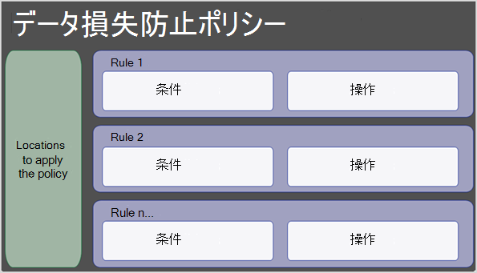
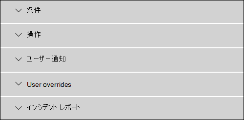
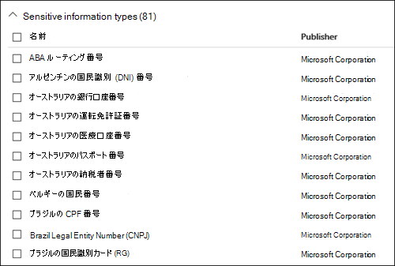
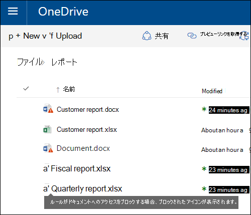
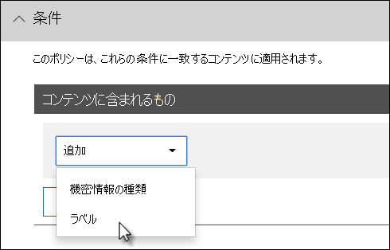
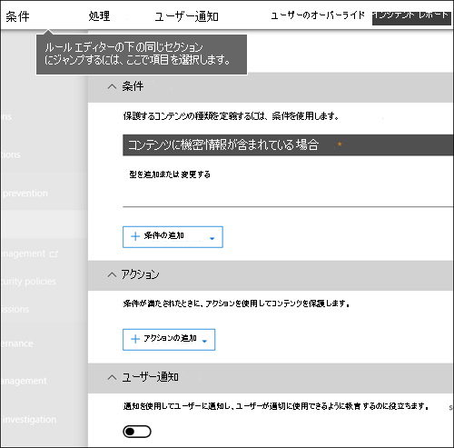
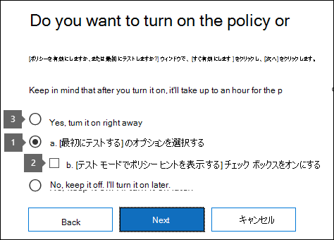
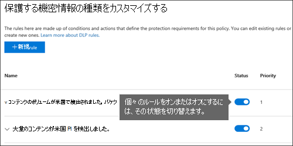
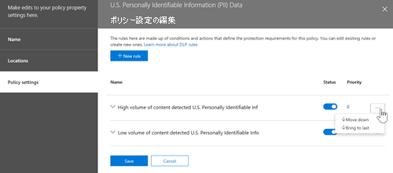
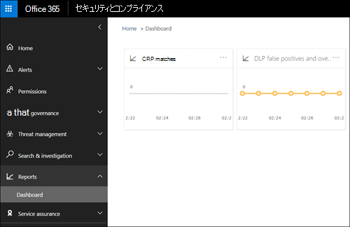

# データ損失防止リファレンス

> [!IMPORTANT]
> これは、データ損失防止 (DLP) 情報のMicrosoft 365参照トピックではなくなりました。 DLP コンテンツ セットが更新され、再構築されています。 この記事で説明するトピックは、新しい更新された記事に移動します。 DLP の詳細については、「データ損失 [防止について」を参照してください](dlp-learn-about-dlp.md)。

<!-- this topic needs to be split into smaller, more coherent ones. It is confusing as it is. -->
<!-- move this note to a more appropriate place, no topic should start with a note -->
> [!NOTE]
> 最近、Office 365 Advanced Compliance のライセンスを取得しているユーザー向けに、データ損失防止機能が Microsoft Teams のチャットとチャネルのメッセージに追加されました。これはスタンドアロンのオプションとして提供されており、Office 365 E5 および Microsoft 365 E5 コンプライアンスに含まれています。 ライセンス要件の詳細については、「[Microsoft 365 テナントレベル サービスのライセンスに関するガイダンス](/office365/servicedescriptions/microsoft-365-service-descriptions/microsoft-365-tenantlevel-services-licensing-guidance)」を参照してください。

<!-- MOVED TO LEARN ABOUT To comply with business standards and industry regulations, organizations must protect sensitive information and prevent its inadvertent disclosure. Sensitive information can include financial data or personally identifiable information (PII) such as credit card numbers, social security numbers, or health records. With a data loss prevention (DLP) policy in the Office 365 Security &amp; Compliance Center, you can identify, monitor, and automatically protect sensitive information across Office 365.

With a DLP policy, you can:

- **Identify sensitive information across many locations, such as Exchange Online, SharePoint Online, OneDrive for Business, and Microsoft Teams.**

    For example, you can identify any document containing a credit card number that's stored in any OneDrive for Business site, or you can monitor just the OneDrive sites of specific people.

- **Prevent the accidental sharing of sensitive information**.

    For example, you can identify any document or email containing a health record that's shared with people outside your organization, and then automatically block access to that document or block the email from being sent.

- **Monitor and protect sensitive information in the desktop versions of Excel, PowerPoint, and Word.**

    Just like in Exchange Online, SharePoint Online, and OneDrive for Business, these Office desktop programs include the same capabilities to identify sensitive information and apply DLP policies. DLP provides continuous monitoring when people share content in these Office programs.

- **Help users learn how to stay compliant without interrupting their workflow.**

    You can educate your users about DLP policies and help them remain compliant without blocking their work. For example, if a user tries to share a document containing sensitive information, a DLP policy can both send them an email notification and show them a policy tip in the context of the document library that allows them to override the policy if they have a business justification. The same policy tips also appear in Outlook on the web, Outlook, Excel, PowerPoint, and Word.

- **View DLP alerts and reports showing content that matches your organization’s DLP policies.**

    To view alerts and metadata related to your DLP policies you can use the [DLP Alerts Management Dashboard](dlp-configure-view-alerts-policies.md). You can also view policy match reports to assess how your organization is complying with a DLP policy. If a DLP policy allows users to override a policy tip and report a false positive, you can also view what users have reported

-->
## DLP ポリシーの作成と管理

Microsoft 365 セキュリティ コンプライアンス センターの [データ損失防止] ページで、DLP ポリシーを作成して管理します。

<!-- MOVED TO LEARN ABOUT ## What a DLP policy contains

A DLP policy contains a few basic things:

- Where to protect the content: **locations** such as Exchange Online, SharePoint Online, and OneDrive for Business sites, as well as Microsoft Teams chat and channel messages.

- When and how to protect the content by enforcing **rules** comprised of:

  - **Conditions** the content must match before the rule is enforced. For example, a rule might be configured to look only for content containing Social Security numbers that's been shared with people outside your organization.

  - **Actions** that you want the rule to take automatically when content matching the conditions is found. For example, a rule might be configured to block access to a document and send both the user and compliance officer an email notification.

You can use a rule to meet a specific protection requirement, and then use a DLP policy to group together common protection requirements, such as all of the rules needed to comply with a specific regulation.

For example, you might have a DLP policy that helps you detect the presence of information subject to the Health Insurance Portability and Accountability Act (HIPAA). This DLP policy could help protect HIPAA data (the what) across all SharePoint Online sites and all OneDrive for Business sites (the where) by finding any document containing this sensitive information that's shared with people outside your organization (the conditions) and then blocking access to the document and sending a notification (the actions). These requirements are stored as individual rules and grouped together as a DLP policy to simplify management and reporting.

 -->

<!-- MOVED TO LEARN ABOUT ### Locations

DLP policies are applied to sensitive items across Microsoft 365 locations and can be further scoped as detailed in this table.

|Location | Include/exclude by|
|---------|---------|
|Exchange email| distribution groups|
|SharePoint sites |sites |
|OneDrive accounts |accounts |
|Teams chat and channel messages |accounts |
|Windows 10 devices |user or group |
|Microsoft Cloud App Security |instance |
 -->

<!-- moved to dlp-policy-reference.md
If you choose to include specific distribution groups in Exchange, the DLP policy will be scoped only to the members of that group. Similarly excluding a distribution group will exclude all the members of that distribution group from policy evaluation. You can choose to scope a policy to the members of distribution lists, dynamic distribution groups, and security groups. A DLP policy can contain no more than 50 such inclusions and exclusions.

If you choose to include or exclude specific SharePoint sites, a DLP policy can contain no more than 100 such inclusions and exclusions. Although this limit exists, you can exceed this limit by applying either an org-wide policy or a policy that applies to entire locations.

If you choose to include or exclude specific OneDrive accounts or groups, a DLP policy can contain no more than 100 user accounts or 50 groups as inclusion or exclusion.

### Rules

> [!NOTE]
> The default behavior of a DLP policy, when there is no alert configured, is not to alert or trigger. This applies only to default information types. For custom information types, the system will alert even if there is no action defined in the policy.

Rules are what enforce your business requirements on your organization's content. A policy contains one or more rules, and each rule consists of conditions and actions. For each rule, when the conditions are met, the actions are taken automatically. Rules are executed sequentially, starting with the highest-priority rule in each policy.

A rule also provides options to notify users (with policy tips and email notifications) and admins (with email incident reports) that content has matched the rule.

Here are the components of a rule, each explained below.

#### Conditions

Conditions are important because they determine what types of information you're looking for, and when to take an action. For example, you might choose to ignore content containing passport numbers unless the content contains more than 10 such numbers and is shared with people outside your organization.

Conditions focus on the **content**, such as what types of sensitive information you're looking for, and also on the **context**, such as who the document is shared with. You can use conditions to assign different actions to different risk levels. For example, sensitive content shared internally might be lower risk and require fewer actions than sensitive content shared with people outside the organization.

The conditions now available can determine if:

- Content contains a type of sensitive information.

- Content contains a label. For more information, see the below section [Using a retention label as a condition in a DLP policy](#using-a-retention-label-as-a-condition-in-a-dlp-policy).

- Content is shared with people outside or inside your organization.

  > [!NOTE]
  > Users who have non-guest accounts in a host organization's Active Directory or Azure Active Directory tenant are considered as people inside the organization.

#### Types of sensitive information

A DLP policy can help protect sensitive information, which is defined as a **sensitive information type**. Microsoft 365 includes definitions for many common sensitive information types across many different regions that are ready for you to use, such as a credit card number, bank account numbers, national ID numbers, and passport numbers.

When a DLP policy looks for a sensitive information type such as a credit card number, it doesn't simply look for a 16-digit number. Each sensitive information type is defined and detected by using a combination of:

- Keywords.

- Internal functions to validate checksums or composition.

- Evaluation of regular expressions to find pattern matches.

- Other content examination.

This helps DLP detection achieve a high degree of accuracy while reducing the number of false positives that can interrupt peoples' work.

#### Actions

When content matches a condition in a rule, you can apply actions to automatically protect the content.

With the actions now available, you can:

- **Restrict access to the content** Depending on your need, you can restrict access to content in three ways:

  1. Restrict access to content for everyone.
  2. Restrict access to content for people outside the organization.
  3. Restrict access to "Anyone with the link."

  For site content, this means that permissions for the document are restricted for everyone except the primary site collection administrator, document owner, and person who last modified the document. These people can remove the sensitive information from the document or take other remedial action. When the document is in compliance, the original permissions are automatically restored. When access to a document is blocked, the document appears with a special policy tip icon in the library on the site.

  

  For email content, this action blocks the message from being sent. Depending on how the DLP rule is configured, the sender sees an NDR or (if the rule uses a notification) a policy tip and/or email notification.

  

#### User notifications and user overrides

You can use notifications and overrides to educate your users about DLP policies and help them remain compliant without blocking their work. For example, if a user tries to share a document containing sensitive information, a DLP policy can both send them an email notification and show them a policy tip in the context of the document library that allows them to override the policy if they have a business justification.

The email can notify the person who sent, shared, or last modified the content and, for site content, the primary site collection administrator and document owner. In addition, you can add or remove whomever you choose from the email notification.

In addition to sending an email notification, a user notification displays a policy tip:

- In Outlook and Outlook on the web.

- For the document on a SharePoint Online or OneDrive for Business site.

- In Excel, PowerPoint, and Word, when the document is stored on a site included in a DLP policy.

The email notification and policy tip explain why content conflicts with a DLP policy. If you choose, the email notification and policy tip can allow users to override a rule by reporting a false positive or providing a business justification. This can help you educate users about your DLP policies and enforce them without preventing people from doing their work. Information about overrides and false positives is also logged for reporting (see below about the DLP reports) and included in the incident reports (next section), so that the compliance officer can regularly review this information.

Here's what a policy tip looks like in a OneDrive for Business account.

 To learn more about user notifications and policy tips in DLP policies, see [Use notifications and policy tips](use-notifications-and-policy-tips.md).

#### Alerts and Incident reports

When a rule is matched, you can send an alert email to your compliance officer (or any person(s) you choose) with details of the alert. This alert email will carry a link of the [DLP Alerts Management Dashboard](dlp-configure-view-alerts-policies.md) which the compliance officer can go to view the details of alert and events. The dashboard contains details of the event that triggered the alert along with details of the DLP policy matched and the sensitive content detected.

In addition, you can also send an incident report with details of the event. This report includes information about the item that was matched, the actual content that matched the rule, and the name of the person who last modified the content. For email messages, the report also includes as an attachment the original message that matches a DLP policy.

> [!div class="mx-imgBorder"]
> 

DLP scans email differently from items in SharePoint Online or OneDrive for Business. In SharePoint Online and OneDrive for Business, DLP scans existing items as well as new ones and generates an alert and incident report whenever a match is found. In Exchange Online, DLP only scans new email messages and generates a report if there is a policy match. DLP ***does not*** scan or match previously existing email items that are stored in a mailbox or archive.

## Grouping and logical operators

Often your DLP policy has a straightforward requirement, such as to identify all content that contains a U.S. Social Security Number. However, in other scenarios, your DLP policy might need to identify more loosely defined data.

For example, to identify content subject to the U.S. Health Insurance Act (HIPAA), you need to look for:

- Content that contains specific types of sensitive information, such as a U.S. Social Security Number or Drug Enforcement Agency (DEA) Number.

    AND

- Content that's more difficult to identify, such as communications about a patient's care or descriptions of medical services provided. Identifying this content requires matching keywords from very large keyword lists, such as the International Classification of Diseases (ICD-9-CM or ICD-10-CM).

You can easily identify such loosely defined data by using grouping and logical operators (AND, OR). When you create a DLP policy, you can:

- Group sensitive information types.

- Choose the logical operator between the sensitive information types within a group and between the groups themselves.

### Choosing the operator within a group

Within a group, you can choose whether any or all of the conditions in that group must be satisfied for the content to match the rule.

### Adding a group

You can quickly add a group, which can have its own conditions and operator within that group.

### Choosing the operator between groups

Between groups, you can choose whether the conditions in just one group or all of the groups must be satisfied for the content to match the rule.

For example, the built-in **U.S. HIPAA** policy has a rule that uses an **AND** operator between the groups so that it identifies content that contains:

- from the group **PII Identifiers** (at least one SSN number **OR** DEA number)

    **AND**

- from the group **Medical Terms** (at least one ICD-9-CM keyword **OR** ICD-10-CM keyword)

## The priority by which rules are processed

When you create rules in a policy, each rule is assigned a priority in the order in which it's created — meaning, the rule created first has first priority, the rule created second has second priority, and so on.

> [!div class="mx-imgBorder"]
> 

After you have set up more than one DLP policy, you can change the priority of one or more policies. To do that, select a policy, choose **Edit policy**, and use the **Priority** list to specify its priority.

> [!div class="mx-imgBorder"]
> 

When content is evaluated against rules, the rules are processed in priority order. If content matches multiple rules, the rules are processed in priority order and the most restrictive action is enforced. For example, if content matches all of the following rules, Rule 3 is enforced because it's the highest priority, most restrictive rule:

- Rule 1: only notifies users

- Rule 2: notifies users, restricts access, and allows user overrides

- Rule 3: notifies users, restricts access, and does not allow user overrides

- Rule 4: only notifies users

- Rule 5: restricts access

- Rule 6: notifies users, restricts access, and does not allow user overrides

In this example, note that matches for all of the rules are recorded in the audit logs and shown in the DLP reports, even though only the most restrictive rule is enforced.

Regarding policy tips, note that:

- Only the policy tip from the highest priority, most restrictive rule will be shown. For example, a policy tip from a rule that blocks access to content will be shown over a policy tip from a rule that simply sends a notification. This prevents people from seeing a cascade of policy tips.

- If the policy tips in the most restrictive rule allow people to override the rule, then overriding this rule also overrides any other rules that the content matched.

-->

## 一致の難易度を上下するためにルールを調整する

DLP ポリシーを作成して有効にすると、次の問題が発生する可能性があります。

- 機密情報 **ではない** 大量のコンテンツがルールと一致します。つまり、多数の誤検知が発生します。

- 機密情報 **である** コンテンツが小さすぎると、ルールと一致します。 言い換えると、保護操作は機密情報に対して実行されません。

このような問題に対処するには、インスタンス数と一致精度を変更してコンテンツがルールに一致する難易度を上下させて、ルールを調整します。 ルールに使用される各機密情報の種類には、インスタンス数と一致精度の両方があります。

### インスタンス数

インスタンス数とは、コンテンツがルールに一致すると評価される各機密情報の種類の出現回数です。 たとえば、1 から 9 の固有の米国または英国の間のコンテンツは、次のルールに一致します。 パスポート番号が識別されます。

> [!NOTE]
> インスタンス数では、機密情報の種類とキーワードの **一意** の一致のみがカウントされます。 たとえば、メールの中に同じクレジット カード番号が 10 回出現する場合、その 10 回の出現は、クレジット カード番号の 1 つのインスタンスとしてカウントされます。

インスタンス数を使用してルールを調整する方法は簡単です。

- ルールに一致させやすくするには、[**最小**] 数を減らし、[**最大**] 数を増やします。 また、[**最大**] の数値を削除して [**すべて**] に設定することもできます。

- ルールに一致させにくくするには、[**最小**] 数を増やします。

通常、ユーザー通知の送信など、制限の緩い操作は、少ないインスタンス数 (たとえば 1 から 9) のルールで使用します。 また、ユーザーによる上書きを許可せずにコンテンツへのアクセスを制限するなど制限の厳しい操作は、高いインスタンス数 (たとえば 10 からすべて) のルールで使用します。

### 一致精度

前述のように、機密情報の種類の定義と検出には、さまざまな種類の証拠を組み合わせて使用します。 一般的に、機密情報の種類はそのような複数の組み合わせ (パターンと呼ばれます) で定義されます。 必要な証拠が少ないパターンは一致精度 (信頼度) が低く、必要な証拠が多いパターンは一致精度 (信頼度) が高くなります。 すべての機密情報の種類に使用される実際のパターンと信頼度の詳細については、「[機密情報の種類のエンティティ定義](sensitive-information-type-entity-definitions.md)」を参照してください。

たとえば、クレジット カード番号という機密情報の種類は次の 2 つのパターンで定義されます。

- 必要な信頼度が 65% のパターン:

  - クレジット カード番号の形式の番号。

  - チェックサムに合格する番号。

- 必要な信頼度が 85% のパターン:

  - クレジット カード番号の形式の番号。

  - チェックサムに合格する番号。

  - 適切な形式のキーワードまたは有効期限。

ルールにはこれらの信頼度 (または一致精度) を使用できます。 通常、ユーザー通知の送信など、制限の緩いアクションは、低い一致精度のルールで使用します。 また、ユーザーによる上書きを許可せずにコンテンツへのアクセスを制限するなど制限の厳しい操作は、高い一致制度のルールで使用します。

クレジット カード番号など、内容に含まれる各機密情報の種類が識別された場合、1 つの信頼度のみが返されることを理解する必要があります。

- すべての一致が 1 つのパターンの場合、そのパターンの信頼度が返されます。

- 複数のパターンについて一致がある場合 (つまり、2 つの信頼度の一致がある場合)、他のパターンよりも高い信頼度のみが返されます。 この点には注意する必要があります。 たとえばクレジット カードの場合、65% のパターンと 85% のパターンの両方に一致する場合、証拠が多いほど信頼度が高くなるので、その機密情報の種類について返される信頼度は 90% を超えます。

そのため、クレジット カードについて相互排他的な 2 つのルールを作成し、65% の一致精度のルールと 85% の一致精度のルールである場合、一致精度の範囲は次のようになります。 最初のルールでは、65% のパターンの一致のみが選択されます。 2 つ目のルールでは、**少なくとも 1 つの** 85% のパターンの一致が選択され、他の低い信頼度の一致が **選択される可能性** があります。

以上の理由から、一致精度が異なる複数のルールを作成する方法について説明します。

- 通常、最も低い信頼度では、[**最小**] と [**最大**] に (範囲ではなく) 同じ値を使用します。

- 通常、最も高い信頼度は、下位の信頼度のすぐ上の値から 100 の範囲です。

- 通常、範囲の信頼度を設定する場合、下位の信頼度のすぐ上の値から、上位の信頼度のすぐ下の値までの範囲にします。

## DLP ポリシーでの条件としての保持ラベルの使用

事前に作成および発行された[保持ラベル](retention.md#retention-labels)を DLP ポリシーでの条件として使用する場合、注意すべき点がいくつかあります。

- DLP ポリシーでの条件として保持ラベルを使用するには、保持ラベルを事前に作成して発行しておく必要があります。
- 発行済みの保持ラベルを同期するには、1 から 7 日かかる場合があります。アイテム保持ポリシーで発行される保持ラベルの詳細については、「[保持ラベルが適用できるようになったとき](create-apply-retention-labels.md#when-retention-labels-become-available-to-apply)」を参照してください。自動的に発行されたアイテム保持ラベルの詳細については、「[保持ラベルが有効になるまでの所要時間](apply-retention-labels-automatically.md#how-long-it-takes-for-retention-labels-to-take-effect)」を参照してください。
- ポリシーでの保持ラベルの使用** は、SharePoint および OneDrive のアイテムに対してのみサポートされています***。

  

  保持と廃棄の対象になっているアイテムがあり、そのアイテムに他のコントロールを適用する場合は、DLP ポリシーで保持ラベルを使用できます。例: 

  - **課税年度 2018** という名前の保持ラベルを発行し、SharePoint に格納されている 2018 年の税務書類に適用すると、10 年間保持され、その後破棄されます。 また、DLP ポリシーを使用して、これらのアイテムが組織外に共有されないようにすることもできます。

  > [!IMPORTANT]
  > 保持ラベルを DLP ポリシーの条件として指定し、Exchange および/または Teams を場所として含めると、次のエラーが表示されます: 「**メールおよびチーム メッセージのラベル付きコンテンツの保護はサポートされていません。下のラベルを削除するか、Exchange と Teams の場所指定をオフにしてください。**」 これは、Exchange トランスポートがメッセージの送信や配信中にラベルのメタデータを評価しないためです。

### DLP ポリシーで秘密度ラベルを条件として使用する

[DLP ポリシーの](./dlp-sensitivity-label-as-condition.md) 条件として Sensitivity ラベルを使用する方法について説明します。

### この機能と他の機能の関係

機密情報を含むコンテンツには複数の機能を適用できます。

- [保持ラベルとアイテム保持ポリシー](retention.md)はどちらも、このコンテンツに **保持** アクションを適用できます。

- DLP ポリシーは、このコンテンツに **保護** 操作を適用できます。 ただし、これらの操作を適用する前に、DLP ポリシーにはラベルを含むコンテンツ以外にも一致する他の条件が必要です。

DLP ポリシーには、機密情報に適用されるラベルや保持ポリシーよりも機能性の高い検出機能があることに注意してください。 DLP ポリシーは、機密情報を含むコンテンツに保護アクションを適用できます。コンテンツから機密情報を削除すると、次回コンテンツがスキャンされたときにそれらの保護操作は取り消されます。 ただし、機密情報を含むコンテンツに保持ポリシーまたはラベルが適用されている場合は、機密情報が削除された場合でも取り消されない 1 回限りの操作になります。

DLP ポリシーでラベルを条件として使用すると、そのラベルのコンテンツに保持操作と保護操作の両方を適用できます。 ラベルを含むコンテンツは機密情報を含むコンテンツとまったく同じように考えることができます。ラベルと機密情報の種類は両方とも、コンテンツの分類に使用されるプロパティです。このため、そのコンテンツに操作を適用できます。

## 簡易設定と詳細設定

DLP ポリシーを作成するときは、次の簡易設定または詳細設定のどちらかを選択します。

- **簡易設定**: ルール エディターを使ってルールを作成または変更することなく、最も一般的な種類の DLP ポリシーを簡単に作成できます。

- **詳細設定**: ルール エディターを使って DLP ポリシーのすべての設定を完全に制御できます。

見た目ではわかりませんが、条件とアクションで構成されるルールを適用することで、簡易設定と詳細設定はまったく同じように機能するのでご安心ください。簡易設定を使用する場合のみ、ルール エディターが表示されません。 これにより、DLP ポリシーを簡単に作成できます。

### 簡易設定

最も一般的な DLP のシナリオでは、ポリシーを作成して機密情報を含むコンテンツが組織外のユーザーと共有されるのを防ぎ、コンテンツにアクセス可能なユーザーを制限するなどの自動修復アクションを実行し、エンドユーザーや管理者に通知を送信し、後の調査のためにイベントを監査しています。 ユーザーは、不注意による機密情報の漏洩を防ぐために DLP を使用します。

この目標を容易に達成するために、DLP ポリシーの作成時に [**簡易設定を使用**] を選択することができます。 簡易設定では、ルール エディターに移動することなく、最も一般的な DLP ポリシーを実装するのに必要なすべてのものが提供されます。

### 詳細設定

よりカスタマイズされた DLP ポリシーを作成する必要がある場合は、[**詳細設定を使用**] を選択できます。

詳細設定では、ルール エディターが表示され、そこで各ルールのインスタンス数や一致精度 (信頼度) を含む、利用可能なオプションすべてを完全に制御できます。

セクションにすばやく移動するには、ルール エディターの上部のナビゲーションの項目をクリックして、下のセクションに移動します。

## DLP ポリシー テンプレート

DLP ポリシーの作成における最初のステップは、保護する情報を選択することです。 DLP テンプレートを使用すると、新しい一連のルールを初めから作成し、既定で含める必要がある情報の種類を判別するという労力を省くことができます。 その後、そうした要件を追加したり変更したりして、組織の特定の要件を満たすようにルールを調整できます。

構成済みの DLP ポリシー テンプレートを使用すると、HIPAA データ、PCI DSS データ、グラム リーチ ブライリー法データ、またはロケール固有の個人情報 (P.I.) などの機密情報の特定の種類を検出するのに役立ちます。 一般的な種類の機密情報を簡単に検出して保護できるように、Microsoft 365 に含まれるポリシー テンプレートには、使用開始時に必要な最も一般的な機密情報の種類が既に含まれています。

組織には固有の要件がある場合もあるため、その場合は、[**カスタム ポリシー**] オプションを選択して、最初から DLP ポリシーを作成できます。 カスタム ポリシーは空であり、既定のルールは含まれていません。

<!-- ## Roll out DLP policies gradually with test mode

rehomed to Plan for DLP

When you create your DLP policies, you should consider rolling them out gradually to assess their impact and test their effectiveness before fully enforcing them. For example, you don't want a new DLP policy to unintentionally block access to thousands of documents that people require access to in order to get their work done.

If you're creating DLP policies with a large potential impact, we recommend following this sequence:

1. **Start in test mode without Policy Tips** and then use the DLP reports and any incident reports to assess the impact. You can use DLP reports to view the number, location, type, and severity of policy matches. Based on the results, you can fine tune the rules as needed. In test mode, DLP policies will not impact the productivity of people working in your organization.

2. **Move to Test mode with notifications and Policy Tips** so that you can begin to teach users about your compliance policies and prepare them for the rules that are going to be applied. At this stage, you can also ask users to report false positives so that you can further refine the rules.

3. **Start full enforcement on the policies** so that the actions in the rules are applied and the content's protected. Continue to monitor the DLP reports and any incident reports or notifications to make sure that the results are what you intend.

    

    You can turn off a DLP policy at any time, which affects all rules in the policy. However, each rule can also be turned off individually by toggling its status in the rule editor.

    

    You can also change the priority of multiple rules in a policy. To do that, open a policy for editing. In a row for a rule, choose the ellipses (**...**), and then choose an option, such as **Move down** or **Bring to last**.

    > [!div class="mx-imgBorder"]
    > -->

## DLP レポート

DLP ポリシーを作成して有効にしたら、意図したとおりに動作し、コンプライアンスの遵守に役立っていることを確認します。 DLP レポートを使用すると、DLP ポリシーとルールの一致の数の時間経過による変化や、誤検知と無効化の回数を、すぐに見ることができます。 レポートごとに、場所や期間でこれらの一致をフィルター処理したり、さらには特定のポリシー、ルール、アクションで絞り込んだりできます。

DLP レポートを利用すると、ビジネスに関する洞察を得ると共に、以下のことが可能です。

- 特定の期間に絞り込み、スパイクや傾向の理由を理解します。

- 組織のコンプライアンス ポリシーに違反するビジネス プロセスを検出します。

- DLP ポリシーのビジネスに及ぼす影響を理解します。

さらに、DLP レポートを使用すると、DLP ポリシーの実行時にそれらのポリシーを調整できます。

## DLP ポリシーのしくみ

DLP は、(単純なテキスト スキャンだけでなく) 詳細なコンテンツ分析を使用して、機密情報を検出します。この詳細なコンテンツ分析は、キーワード一致、辞書一致、正規表現の評価、内部関数などの方式を使用して、DLP ポリシーに一致するコンテンツを検出します。使用しているデータのうち、ごくわずかな割合のデータのみが機密性が高いと見なされる可能性があります。DLP ポリシーは、他のコンテンツを使用した作業を妨害したり影響を与えたりすることなく、対象データのみを識別、監視し、自動的に保護できます。

### ポリシーの同期

セキュリティ &amp; コンプライアンス センターで DLP ポリシーを作成すると、集中管理ポリシー ストアに格納され、以下を含む各種コンテンツ ソースと同期されます。

- Exchange Online、そこから Outlook on the web、Outlook。

- OneDrive for Business サイト。

- SharePoint Online サイト。

- Office デスクトップ プログラム (Excel、PowerPoint、Word)。

- Microsoft Teams チャネルおよびチャット メッセージ。

ポリシーが適切な場所に同期されると、コンテンツの評価とアクションの適用が開始されます。
<!-- what is the time delay for first deployment of a policy and what is the sync schedule? -->

### OneDrive for Business サイトと SharePoint Online サイトのポリシー評価

すべての SharePoint Online サイトと OneDrive for Business サイトで、ドキュメントは常に変化し、作成、編集、共有などが継続的に行われています。 つまり、ドキュメントはいつでも競合したり、DLP ポリシーに準拠するようになる可能性があります。 たとえば、あるユーザーがチーム サイトに機密情報を含まないドキュメントをアップロードし、後で別のユーザーが同じドキュメントを編集して機密情報を追加する、といったことが発生します。

このため、DLP ポリシーは、バックグラウンドでポリシーに一致しているかどうか頻繁にドキュメントを確認します。これを、非同期のポリシー評価と考えることができます。<!-- what is the frequency? looks like it is tied to the search crawl schedule -->

#### メカニズム

ユーザーがサイトにドキュメントを追加したりドキュメントを変更したりすると、検索エンジンによってコンテンツがスキャンされるため、ユーザーが後で検索できるようになります。 これと併せて、コンテンツは機密情報に関してスキャンされ、共有されているかどうかが確認されます。 見つかった機密情報は、コンプライアンス チームだけがアクセスでき、一般ユーザーはアクセスできないように、検索インデックスに安全に保存されます。 有効にした DLP ポリシーはそれぞれバックグラウンドで (非同期に) 実行されるため、ポリシーと一致するコンテンツが頻繁に検索され、不注意によって漏えいされないようにアクションが適用されます。

<!-- conflict with a DLP policy is bad wording --> 最後に、ドキュメントが DLP ポリシーに矛盾し、その後 DLP ポリシーに準拠するようになることがあります。たとえば、ユーザーがドキュメントにクレジット カード番号を追加する場合、DLP ポリシーによってドキュメントへのアクセスが自動的にブロックされる可能性があります。しかしユーザーが後で機密情報を削除すると、次にドキュメントが対象ポリシーに対して再び評価されるときに、アクション (この例ではブロック) が自動的に取り消されます。

DLP は、インデックスを作成できるすべてのコンテンツを評価します。 既定でクロールされるファイルの種類の詳細については、「[SharePoint Server での既定のクロール対象ファイルのファイル名拡張子および解析対象ファイルの種類](/SharePoint/technical-reference/default-crawled-file-name-extensions-and-parsed-file-types)」を参照してください。

> [!NOTE]
> DLP ポリシーでドキュメントを分析する前にドキュメントが共有されるのを防ぐため、SharePoint の新しいファイルの共有は、そのコンテンツがインデックス化されるまでブロックできます。 詳細については、「[新しいファイルを既定で機密としてマークする](/sharepoint/sensitive-by-default)」をご覧ください。

### Exchange Online、Outlook、Outlook on the web でのポリシーの評価

Exchange online を場所として含む DLP ポリシーを作成すると、このポリシーは Office 365 セキュリティ &amp; コンプライアンス センターから Exchange Online に同期され、その後、Exchange Online から Outlook on the web と Outlook に同期されます。

メッセージが Outlook で作成される場合、作成中のコンテンツは DLP ポリシーに対して評価されるため、ユーザーはポリシー ヒントを確認できます。 メッセージが送信されると、メール フローの通常の部分として DLP ポリシーに対して評価され、Exchange 管理センターで作成された Exchange メール フロー ルール (トランスポート ルールとも呼ばれる) と DLP ポリシーが評価されます。 DLP ポリシーは、メッセージと添付ファイルの両方をスキャンします。

### Office デスクトップ プログラムにおけるポリシー評価

<!-- same capability to identify sensitive information line conflates sensitive information types and such -->
Excel、PowerPoint、Word には、機密情報を識別して DLP ポリシーを適用するための、SharePoint Online と OneDrive for Business と同じ機能が含まれています。 これらの Office プログラムは、集中管理ポリシー ストアから直接 DLP ポリシーを同期し、DLP ポリシーに含まれるサイトから開かれたドキュメントをユーザーが扱うときに、DLP ポリシーに対してコンテンツを継続的に評価します。

Office における DLP ポリシーの評価は、プログラムのパフォーマンス、またはコンテンツを扱っているユーザーの生産性に影響を与えることがないように設計されています。 大規模なドキュメントを扱う場合、またはユーザーのコンピューターがビジー状態にある場合、ポリシー ヒントが表示されるまでに数秒かかることがあります。

### Microsoft Teams でのポリシーの評価
 <!--what do you mean that it's synched to user accounts?  I thought DLP policies were applied to locations not users like sensitivity labels are  -->

Microsoft teams を場所として含む DLP ポリシーを作成すると、Office 365 セキュリティ &amp; コンプライアンス センターからユーザー アカウントと Microsoft Teams のチャネルおよびチャット メッセージにポリシーが同期されます。 DLP ポリシーの構成方法によっては、ユーザーが Microsoft Teams のチャットやチャネル メッセージで機密情報を共有しようとしたときに、そのメッセージをブロックまたは取り消すことができます。 また、機密情報が含まれていて、ゲスト (外部ユーザー) と共有されているドキュメントは、このユーザー対しては開きません。 詳細については、「[データ損失防止と Microsoft Teams](dlp-microsoft-teams.md)」を参照してください。

## アクセス許可

既定では、グローバル管理者、セキュリティ管理者、コンプライアンス管理者は DLP ポリシーを作成して適用できます。 DLP ポリシーを作成するコンプライアンス チームの他のメンバーには、セキュリティ コンプライアンス センターへのアクセス許可が &amp; 必要です。 既定では、テナント &amp; 管理者は、この場所にアクセスし、コンプライアンス担当者や他のユーザーに、テナント管理者のすべてのアクセス許可を与えることなく、セキュリティ コンプライアンス センターへのアクセス権を付与できます。これを行うには、次の手順を実行することをお勧めします。

1. Microsoft 365 でグループを作成して、コンプライアンス責任者をグループに追加します。

2. セキュリティ &amp; コンプライアンス センターの [**アクセス許可**] ページで役割グループを作成します。

3. 役割グループを作成している間に、**役割の選択** セクションを使用して、次の役割を役割グループに追加します: **DLP コンプライアンス管理**。

4. **メンバーの選択** セクションを使用して、以前に作成した Microsoft 365 グループを役割グループに追加します。

また、**表示のみ DLP コンプライアンス管理** の役割を付与することで、DLP ポリシーと DLP レポートに表示のみの権限を持った役割グループを作成することもできます。

詳細については、「[Give users access to the Office 365 Security & Compliance Center (Office 365 セキュリティ/コンプライアンス センターへのアクセス権をユーザーに付与する)](../security/office-365-security/grant-access-to-the-security-and-compliance-center.md)」を参照してください。

これらのアクセス許可は、DLP ポリシーを作成して適用する場合にのみ必要です。ポリシーの適用に、コンテンツへのアクセスは必要ありません。

## DLP コマンドレットを検索する

セキュリティ &amp; コンプライアンス センターのほとんどのコマンドレットを使用するには、次のようにする必要があります。

1. [リモート PowerShell を使用して Office 365 セキュリティ &amp; コンプライアンス センターに接続する](/powershell/exchange/connect-to-scc-powershell)。

2. これらの[ポリシーおよびコンプライアンスの dlp コマンドレット](/powershell/module/exchange/export-dlppolicycollection)のいずれかを使用する。

ただし、DLP レポートは、Exchange Online を含む Microsoft 365 全体からデータを取り込む必要があります。 このため、**DLP レポート用のコマンドレットは、セキュリティ &amp; コンプライアンス センター Powershell ではなく Exchange Online Powershell で使用できます**。 したがって、DLP レポートのコマンドレットを使用するには、次の操作を行う必要があります。

1. [リモート PowerShell で Exchange Online に接続する](/powershell/exchange/connect-to-exchange-online-powershell)。

2. DLP レポート用のいずれかのコマンドレットを使用します。

    - [Get-DlpDetectionsReport](/powershell/module/exchange/Get-DlpDetectionsReport)

    - [Get-DlpDetailReport](/powershell/module/exchange/Get-DlpDetailReport)

## 詳細情報

- [テンプレートからの DLP ポリシーの作成](create-a-dlp-policy-from-a-template.md)

- [通知を送信して、DLP ポリシーのポリシーのヒントを表示する](use-notifications-and-policy-tips.md)

- [FCI または他のプロパティを含むドキュメントを保護するために DLP ポリシーを作成する](protect-documents-that-have-fci-or-other-properties.md)

- [DLP ポリシー テンプレートに含まれるもの](what-the-dlp-policy-templates-include.md)

- [機密情報の種類のエンティティ定義](sensitive-information-type-entity-definitions.md)

- [機密情報の種類関数](sit-functions.md)

- [カスタムの機密情報の種類を作成する](create-a-custom-sensitive-information-type.md)
