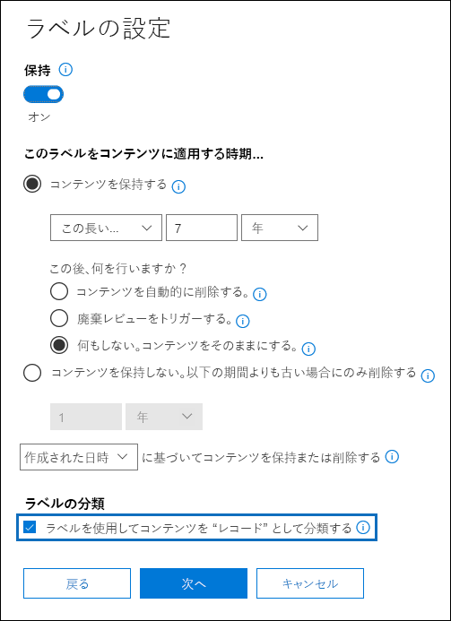

# <a name="declare-records-by-using-retention-labels"></a>保持ラベルを使用してレコードを宣言する

>*[セキュリティとコンプライアンスのための Microsoft 365 ライセンス ガイダンス](https://aka.ms/ComplianceSD)。*

ドキュメントとメールを [レコード](records-management.md#records)として宣言するには、コンテンツを **レコード** または **規制レコード** としてマークする [保持ラベル](retention.md#retention-labels)を使用します。

レコードと規制レコードのどちらを使用すればよいかわからない場合は、「[許可またはブロックされているアクションの制限を比較する](records-management.md#compare-restrictions-for-what-actions-are-allowed-or-blocked)」を参照してください。 規制レコードを使用する必要がある場合は、次のセクションで説明するように、まず PowerShell コマンドを実行する必要があります。

その後、ユーザーや管理者がラベルをコンテンツに適用できるように保持ラベル ポリシーでラベルを公開するか、アイテムをレコード (規制レコードではない) としてマークするラベルの場合は、レコードとして宣言するコンテンツにラベルを自動適用することができます。

## <a name="how-to-display-the-option-to-mark-content-as-a-regulatory-record"></a>規制レコードとしてコンテンツをマークするオプションを表示する方法

>[!NOTE] 
> 次の手順は、監査ログの [[アイテム保持ポリシーと保持ラベルのアクティビティ](search-the-audit-log-in-security-and-compliance.md#retention-policy-and-retention-label-activities)] セクションの [**保持ラベルの規制レコード オプションを有効にする**] をログに記録する監査可能なアクションです。

既定では、コンテンツを規制レコードとしてマークするための保持ラベル オプションは、保持ラベル ウィザードには表示されません。 このオプションを表示するには、まず PowerShell コマンドを実行する必要があります。

1. [Office 365 セキュリティ センターとコンプライアンス センターの PowerShell への接続](https://docs.microsoft.com/powershell/exchange/office-365-scc/connect-to-scc-powershell/connect-to-scc-powershell)。

2. 次のコマンドレットを実行します。
    
    ```powershell
    Set-RegulatoryComplianceUI -Enabled $true
    ````
    確認のためのメッセージが表示されることはなく、設定はすぐに有効になります。

保持ラベル ウィザードでのこのオプションの表示に関して気が変わった場合には、同じコマンドレットを **False** 値で実行することで、このオプションを再び非表示にすることができます: `Set-RegulatoryComplianceUI -Enabled $false`  

## <a name="configuring-retention-labels-to-declare-records"></a>保持ラベルを構成してレコードを宣言する

Microsoft 365 コンプライアンス センターの **レコード管理** ソリューションから保持ラベルを作成または編集する場合、アイテムをレコードとしてマークするオプションがあります。 前のセクションで実行した PowerShell コマンドを実行した場合、代わりに規制レコードとしてアイテムをマークすることができます。

例:



この保持ラベルを使用することで、ラベルを必要に応じて SharePoint や OneDrive のドキュメントまたは Exchange のメールに適用できるようになりました。 

詳細な手順については、以下を参照してください。

- [アイテム保持ラベルを作成してアプリに適用する](create-apply-retention-labels.md)

- [保持ラベルをコンテンツに自動的に適用する](apply-retention-labels-automatically.md) (規制レコードはサポート対象外です)


## <a name="applying-the-configured-retention-label-to-content"></a>コンテンツに構成した保持ラベルを適用する

アイテムをレコードや規制レコードとしてマークする保持ラベルをユーザーがアプリ内で適用できるようにする場合:

- Exchange の場合、メールボックスへの書き込みアクセス権を持つすべてのユーザーは、これらのラベルを適用できます。 
- SharePoint および OneDrive の場合、既定のメンバー グループ (投稿アクセス許可レベル) のすべてのユーザーがこれらのラベルを適用できます。

保持ラベルを使用してレコードとしてマークされたドキュメントの例は、以下のとおりです。


## <a name="next-steps"></a>次の手順

レコード管理でサポートされているシナリオの一覧については、「[レコード管理の一般的なシナリオ](get-started-with-records-management.md#common-scenarios-for-records-management)」を参照してください。
