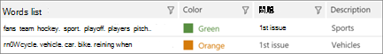

# 高度な電子情報開示で強調表示されたキーワードと詳細オプションを定義する (クラシック)Define highlighted keywords and advanced options in Advanced eDiscovery (classic)

> [!NOTE]
> Advanced eDiscovery requires an Office 365 E3 with the Advanced Compliance add-on or an E5 subscription for your organization.Advanced eDiscovery requires an Office 365 E3 with the Advanced Compliance add-on or an E5 subscription for your organization. If you don't have that plan and want to try Advanced eDiscovery, you can [sign up for a trial of Office 365 Enterprise E5](https://go.microsoft.com/fwlink/p/?LinkID=698279).If you don't have that plan and want to try Advanced eDiscovery, you can [sign up for a trial of Office 365 Enterprise E5](https://go.microsoft.com/fwlink/p/?LinkID=698279). 
  
詳細な電子情報開示では、ユーザー定義のキーワードを関連性に追加して、タグ付けの際に関連ファイルを識別するのに役立てることができます。In Advanced eDiscovery, it's possible to add user-defined keywords to Relevance in order to help you identify relevant files while tagging. キーワードは、**関連性 \> タグ**の指定した色で表示されます。Keywords will be displayed in the specified colors in **Relevance \> Tag**. 
  
以下に示すように、キーワードリストを追加したり、キーワードリストに割り当てられている色や関連する問題を追加したりできます。As described below, keyword lists can be added, and colors assigned to the Keywords list and the related issues. ヒントには、キーワードの説明 (存在する場合) が、二重下線で示されます。A tooltip displays the keyword's description, if one exists, as indicated by a double underline.
  
> [!IMPORTANT]
> 関連性のタグ付け時にドキュメント内の関連性の強調表示とキーワードヒット結果の表示は、日本語、中国語、韓国語の2バイト文字セットでは機能しません。Hit highlighting in Relevance and viewing keyword hit results within documents during Relevance tagging does not work for the Japanese, Chinese, and Korean double-byte character sets. 
  
## 強調表示されたキーワードの追加Adding highlighted keywords

1. [**関連性の \> 関連性の設定**] タブで、[**強調表示**されたキーワード] を選択します。In the **Relevance \> Relevance setup** tab, select **Highlighted keywords**.
    
2. アイコンをクリックして **+** キーワードを追加します。Click the **+** icon to add keywords. [**新しいキーワードの追加**] ダイアログが表示されます。The **Add new keywords** dialog is displayed. 
    
3. [**キーワード**] にキーワードリストを入力します。キーワードはコンマで区切ります。In **Keywords**, type the keywords list, separating keywords with commas. 
    
4. [**色**] ボックスの一覧で色を選択し、[入力したキーワード] ボックスの一覧を強調表示にします。In the **Color** list, select the color to highlight the entered keywords list. 
    
5. **[問題の選択**] リストで、[キーワード] リストを [すべての問題] に適用するか、選択した案件に適用するかを選択します。In the **Select issue** list, select whether to apply the keywords list to "All issues" or to selected issues. 
    
6. [**説明**] に、キーワードリスト (省略可能) を入力します。In **Description**, type the keywords list (optional).
    
    
  
7. 完了したら、[ **OK]** をクリックします。Click **OK** when done. 作成したリストがキーワードリストテーブルに追加され、編集または削除できるようになります。The created list is added to the keywords list table and can be edited or deleted. 
    
    
  
ユーザー定義のキーワードが、[関連性] タグの指定した色で表示され \> ます。The user-defined keywords will be displayed, in the specified colors in Relevance \> Tag. 
  
## 関連性セットアップの詳細設定の指定Specifying Relevance setup advanced settings

これらの設定は、関連性のあるトラックと判断グラフに影響します。These settings affect the Track and Decide graphs in Relevance.
  
1. [**関連性の \> 関連性の設定**] タブで、[**詳細設定**] を選択します。In the **Relevance \> Relevance setup** tab, select **Advanced settings**.
    
2. [**コストパラメーター** ] ダイアログで、次のように選択します。In the **Cost parameters** dialog, make the following selections: 
    
1. 1**時間あたりのコストレビュー ($)** の一覧で、[金額] を選択するか、既定値をそのまま使用します。In the **Cost review per hour ($)** list, select the amount in dollars or accept the default. 
    
2. [**時間で確認されたファイルの数**] ボックスの一覧で、金額を選択するか、既定値をそのまま使用します。In the **Number of files reviewed by hour** list, select the amount or accept the default. 
    
    
  
3. [**保存**] をクリックします。Click **Save**. 選択した設定が保存されます。The selected settings are saved.
    
## 関連項目See also

[Advanced eDiscovery (クラシック)Advanced eDiscovery (classic)](office-365-advanced-ediscovery.md)
  
[問題の定義とユーザーの割り当てDefining issues and assigning users](define-issues-and-assign-users.md)
  
[インポートしたファイルを追加するためのロードの設定Setting up loads to add imported files](set-up-loads-to-add-imported-files.md)

