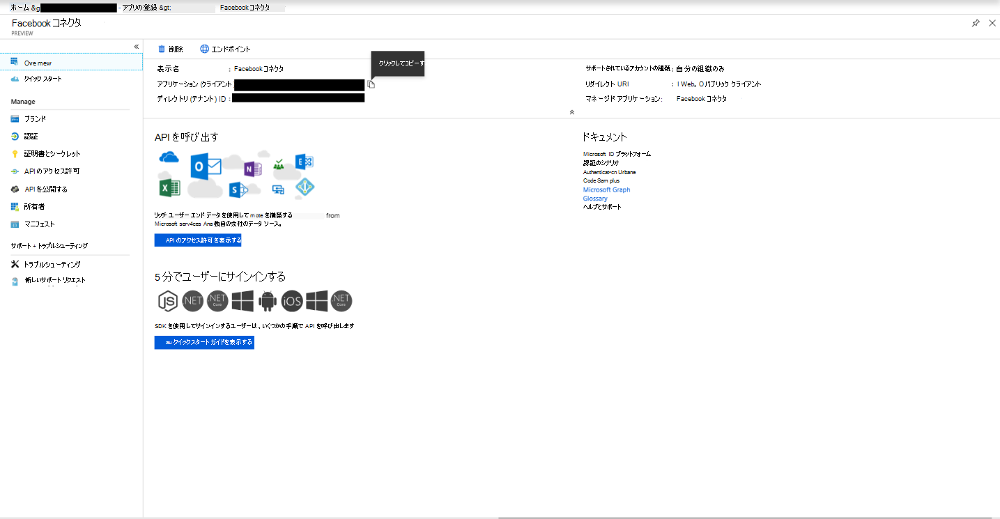
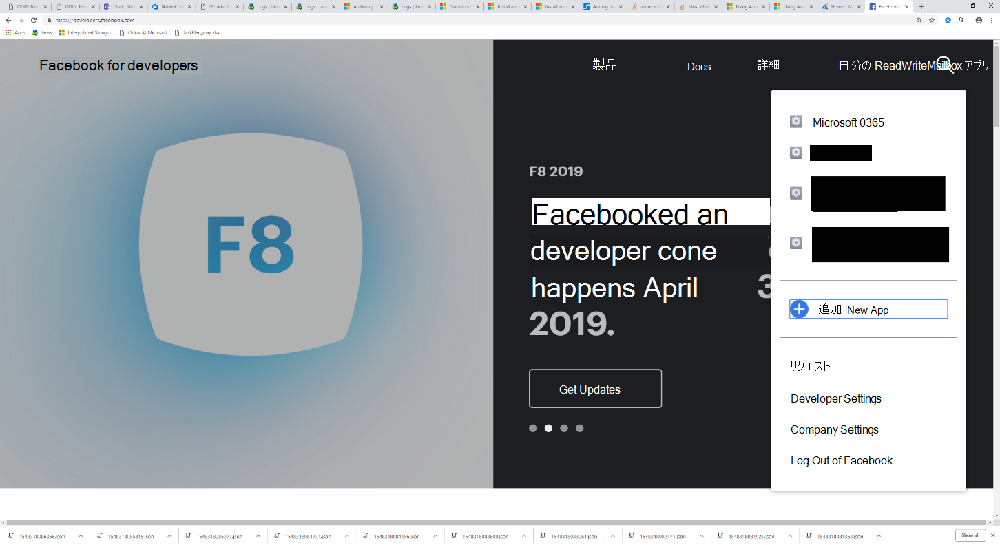
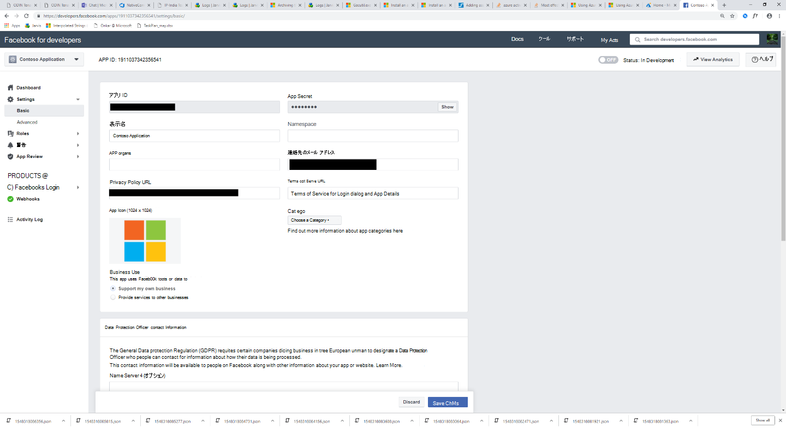

# コネクタを展開して Facebook Business ページのデータをアーカイブする

この記事では、Office 365 Import サービスを使用して Facebook Business ページからデータをインポートするコネクタを展開する手順Microsoft 365。 このプロセスの概要と、Facebook コネクタの展開に必要な前提条件の一覧については、「コネクタをセットアップして Facebook データをアーカイブする」 [を参照してください](archive-facebook-data-with-sample-connector.md)。

## 手順 1: アプリをアプリで作成Azure Active Directory

1. グローバル管理者 <https://portal.azure.com> アカウントの資格情報を使用して、アクセスしてサインインします。

    

2. 左側のナビゲーション ウィンドウで **[Azure Active Directory]** をクリックします。

    ![[Azure Active Directory] をクリックします。](../media/FBCimage2.png)

3. 左側のナビゲーション ウィンドウで、[アプリの登録 ] **(プレビュー) をクリックし** 、[新しい登録] **をクリックします**。

    ![[**アプリの登録 (プレビュー)**] をクリックし、[**新しい登録**] をクリックします。](../media/FBCimage3.png)

4. アプリケーションを登録します。 [リダイレクト URI] で、[アプリケーションの種類] ドロップダウン リストで [Web] を選択し <https://portal.azure.com> 、URI のボックスに入力します。

   

5. アプリケーション **(クライアント) ID とディレクトリ** **(テナント) ID** をコピーし、テキスト ファイルまたは他の安全な場所に保存します。 これらの ID は、後の手順で使用します。

   

6. 新しい **アプリの&に移動します。**

   

7. [新 **しいクライアント シークレット] をクリックします。**

   ![[新しいクライアント シークレット] をクリックします。](../media/FBCimage7.png)

8. 新しいシークレットを作成します。 [説明] ボックスにシークレットを入力し、有効期限を選択します。

    

9. シークレットの値をコピーし、テキスト ファイルまたは他の保存場所に保存します。 これは、後の手順で使用する AAD アプリケーション シークレットです。

   

## 手順 2: コネクタ Web サービスを Azure アカウントGitHubから展開する

1. このサイトに [移動しGitHub Azure](https://github.com/microsoft/m365-sample-connector-csharp-aspnet) **に展開をクリックします**。

    ![[Azure に展開] をクリックします。](../media/FBCGithubApp.png)

2. [Azure に **展開] をクリック** すると、カスタム テンプレート ページを使用して Azure ポータルにリダイレクトされます。 [基本] と **[詳細****設定入力** し、[購入] を **クリックします**。

   - **サブスクリプション:** Facebook Business ページ コネクタ Web サービスを展開する Azure サブスクリプションを選択します。

   - **リソース グループ:** 新しいリソース グループを選択または作成します。 リソース グループは、Azure ソリューションの関連リソースを保持するコンテナーです。

   - **場所:** 場所を選択します。

   - **Web アプリ名:** コネクタ Web アプリの一意の名前を指定します。 名前の長さは 3 ~ 18 文字です。 この名前は、Azure アプリ サービスの URL を作成するために使用されます。たとえば **、fbconnector** の Web アプリ名を指定すると、Azure アプリ サービスの URL が **fbconnector.azurewebsites.net。**

   - **tenantId:** 手順 1 で Facebook コネクタ Microsoft 365作成した後にコピーした組織のテナント ID Azure Active Directory ID です。

   - **APISecretKey:** 任意の値をシークレットとして入力できます。 これは、手順 5 でコネクタ Web アプリにアクセスするために使用されます。

     ![[リソースの作成] をクリックし、ストレージ アカウントを入力します。](../media/FBCimage12.png)

3. 展開が成功すると、ページは次のスクリーンショットのようになります。

   ![[アカウントStorage] をクリックし、[アカウントのStorageクリックします。](../media/FBCimage13.png)

## 手順 3: Facebook アプリを登録する

1. に移動し、組織の Facebook Business ページのアカウントの資格情報を使用してログインし、[新しいアプリの追加 <https://developers.facebook.com> ] **をクリックします**。

   

2. 新しいアプリ ID を作成します。

   

3. 左側のナビゲーション ウィンドウで、[製品の追加] **を** クリックし、[Facebook **ログイン** ] タイルの [セットアップ] **をクリック** します。

   ![[製品の追加] をクリックします。](../media/FBCimage27.png)

4. [Facebook ログインの統合] ページで、[Web] を **クリックします**。

   ![[Facebook ログインの統合] ページで [Web] をクリックします。](../media/FBCimage28.png)

5. Azure アプリ サービスの URL を追加します。たとえば `https://fbconnector.azurewebsites.net` .

   

6. Facebook ログインのセットアップの [クイック スタート] セクションを完了します。

   ![[クイック スタート] セクションを完了します。](../media/FBCimage30.png)

7. [Facebook ログイン]の下の左側のナビゲーション ウィンドウで、[設定]**をクリック** し、[有効な OAuth リダイレクト URI] ボックスに OAuth リダイレクト **URI を追加** します。 **\<connectorserviceuri> /Views/FacebookOAuth** という形式を使用します。connectorserviceuri の値は組織の Azure アプリ サービス URL です。たとえば `https://fbconnector.azurewebsites.net` 、 。

   ![[有効な OAuth リダイレクト URI] ボックスに OAuth リダイレクト URI を追加します。](../media/FBCimage31.png)

8. 左側のナビゲーション ウィンドウで、[製品の追加]**をクリックし****、[Webhooks] をクリックします。** [ページ **] プルダウン メニュー** で、[ページ] を **クリックします**。

   ![[製品の追加] をクリックし、[**Webhooks] をクリックします。](../media/FBCimage32.png)

9. Webhooks コールバック URL を追加し、確認トークンを追加します。 コールバック URL の形式は、connectorserviceuri の値が組織の Azure アプリ サービス URL である形式を `<connectorserviceuri>/api/FbPageWebhook` 使用します。たとえば `https://fbconnector.azurewebsites.net` 。

   確認トークンは強力なパスワードと似ている必要があります。 確認トークンをテキスト ファイルまたは他の保存場所にコピーします。

   

10. フィードのエンドポイントをテストしてサブスクライブします。

    

11. プライバシー URL、アプリ アイコン、およびビジネス使用を追加します。 また、アプリ ID とアプリ シークレットをテキスト ファイルまたは他の保存場所にコピーします。

    

12. アプリを公開します。

    

13. 管理者またはテスターの役割にユーザーを追加します。

    

14. [ページパブリック **コンテンツ アクセス] アクセス許可を追加** します。

    

15. [ページの管理] アクセス許可を追加します。

    ![[ページの管理] アクセス許可を追加します。](../media/FBCimage39.png)

16. Facebook によってレビューされたアプリケーションを取得します。

    

## 手順 4: コネクタ Web アプリを構成する

1. に移動 `https://<AzureAppResourceName>.azurewebsites.net` します (AzureAppResourceName は、手順 4 で指定した Azure アプリ リソースの名前です)。 たとえば、名前が **fbconnector** の場合は、 に移動します `https://fbconnector.azurewebsites.net` 。 アプリのホーム ページは、次のスクリーンショットのようになります。

   

2. [構成 **] を** クリックしてサインイン ページを表示します。

   ![[構成] をクリックしてサインイン ページを表示します。](../media/FBCimage42.png)

3. [テナント ID] ボックスに、テナント ID (手順 2 で取得した) を入力または貼り付けます。 パスワード ボックスに、APISecretKey (手順 2 で取得した) を入力または貼り付け、[構成の設定] 設定 をクリックして構成の詳細ページを表示します。

    

4. 次の構成設定を入力します。

   - **Facebook アプリケーション ID:** 手順 3 で取得した Facebook アプリケーションのアプリ ID。

   - **Facebook アプリケーション シークレット:** 手順 3 で取得した Facebook アプリケーションのアプリ シークレット。

   - **Facebook Webhooks はトークンを確認します。** 手順 3 で作成した検証トークン。

   - **AAD アプリケーション ID:** 手順 1 で作成Azure Active Directoryアプリのアプリケーション ID。

   - **AAD アプリケーション シークレット:** 手順 1 で作成した APISecretKey シークレットの値。

5. [保存 **] を** クリックしてコネクタ設定を保存します。

## 手順 5: アプリケーションで Facebook コネクタをセットアップMicrosoft 365 コンプライアンス センター

1. に移動 [https://compliance.microsoft.com](https://compliance.microsoft.com) し、左側の **ナビゲーションで [** データ コネクタ] をクリックします。

2. [データ コネクタ **] ページの [Facebook** Business ページ] で **、[** 表示] を **クリックします**。

3. [Facebook のビジネス **ページ] ページで** 、[コネクタの追加] **をクリックします**。

4. [サービス条件 **] ページで、[** 同意する] を **クリックします**。

5. [コネクタ **アプリの資格情報の追加]** ページで、次の情報を入力し、[接続の検証] **をクリックします**。

   

   - [名前 **] ボックス** に、Facebook ニュース ページなどのコネクタの **名前を入力します**。

   - [接続 **URL] ボックス** に、Azure アプリ サービスの URL を入力または貼り付けます。たとえば `https://fbconnector.azurewebsites.net` .

   - [パスワード **] ボックス** に、手順 2 で追加した APISecretKey の値を入力または貼り付けます。

   - [Azure **App ID]** ボックスに、手順 1 で作成した AAD アプリケーション ID とも呼ばれるアプリケーション (クライアント) ID の値を入力または貼り付けます。

6. 接続が正常に検証された後、[次へ] を **クリックします**。

7. [データの **インポートMicrosoft 365承認する**] ページで、APISecretKey を再度入力または貼り付け、[Web アプリのログイン]**をクリックします**。

8. [Facebook **コネクタ アプリの構成** ] ページで **、[Facebook** でログイン] をクリックし、組織の Facebook Business ページのアカウントの資格情報を使用してログインします。 ログインした Facebook アカウントに、組織の Facebook Business ページの管理者ロールが割り当てられているか確認します。

   

9. ログインした Facebook アカウントによって管理されているビジネス ページの一覧が表示されます。 アーカイブするページを選択し、[次へ] を **クリックします**。

   

10. [ **続行] を** クリックして、コネクタ サービス アプリのセットアップを終了します。

11. [フィルター **の設定] ページ** で、フィルターを適用して、特定の年齢のアイテムを最初にインポートできます。 年齢を選択し、[次へ] を **クリックします**。

12. [保存 **場所の選択**] ページで、Facebook アイテムのインポート先Microsoft 365メールボックスの電子メール アドレスを入力し、[次へ] を **クリックします**。

13. [ **次へ]** をクリックしてコネクタの設定を確認し、[完了] を **クリックして** コネクタのセットアップを完了します。

14. コンプライアンス センターで、[データ コネクタ] ページに **移動** し、[コネクタ] タブをクリックしてインポート プロセスの進行状況を確認します。
