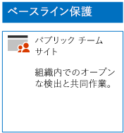
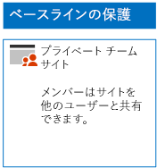
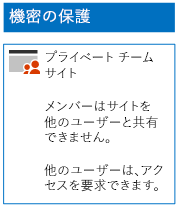

# 3 層の保護用に SharePoint Online サイトを展開する

ベースライン、機密、および非常に機密性の高い社外秘の SharePoint Online チーム サイトを設計および展開するには、この記事の手順を実行してください。 これらの 3 層の保護の詳細については、「[Secure SharePoint Online sites and files](../security/office-365-security/secure-sharepoint-online-sites-and-files.md)」(SharePoint Online サイトとファイルのセキュリティ保護) を参照してください。
  
## ベースラインの SharePoint Online チーム サイト

ベースラインの保護には、パブリックおよびプライベートのチーム サイトが含まれます。 パブリック チーム サイトは、組織内の全ユーザーが検出し、アクセスすることができます。 プライベート サイトは、チーム サイトに関連付けられている Office 365 グループのメンバーのみが検出し、アクセスすることができます。 いずれの種類のチーム サイトも、メンバーがサイトを他のユーザーと共有することを許可しています。
  
### パブリック

パブリック アクセスとアクセス許可を使用するベースライン SharePoint Online チーム サイトを作成するには、[次の指示](https://support.office.com/article/create-a-team-site-in-sharepoint-ef10c1e7-15f3-42a3-98aa-b5972711777d)に従います。

最終的な構成をここに示します。
  

  
### プライベート

プライベート アクセスとアクセス許可を使用するベースライン SharePoint Online チーム サイトを作成するには、[次の指示](https://support.office.com/article/create-a-team-site-in-sharepoint-ef10c1e7-15f3-42a3-98aa-b5972711777d)に従います。
  
最終的な構成をここに示します。
  

  
## 機密 SharePoint Online チーム サイト

機密 SharePoint Online チーム サイトは、プライベート チーム サイトとして開始します。
  
最初に、[次の指示](https://support.office.com/article/create-a-team-site-in-sharepoint-ef10c1e7-15f3-42a3-98aa-b5972711777d)でプライベート SharePoint Online チーム サイトを作成します。

次に、新しい SharePoint Online チーム サイトから、これらの手順で追加のアクセス許可の設定を構成します。

1.  SharePoint チーム サイトのツール バーで、設定アイコンをクリックしてから、[**サイトの権限**] をクリックします。
2.  [**サイトの権限**] ウィンドウで、[**共有の設定**] の [**共有設定を変更します**] をクリックします。
3.  **[共有アクセス許可]** で、**[サイト所有者のみが、ファイル、フォルダー、およびサイトを共有できます]** を選択して、**[保存]** をクリックします。

これらのアクセス権の設定の結果は次のとおりです。

- メンバーが他のメンバーと共有する機能は無効にされています。
- メンバー以外がアクセスを要求する機能は有効にされています。

最終的な構成をここに示します。
  

  
サイトのメンバーは、いずれかのアクセス グループのグループ メンバーシップを使用して、サイトのリソースについて安全に共同作業できるようになりました。
  
## 非常に機密性の高い社外秘 SharePoint Online チーム サイト

機密 SharePoint Online チーム サイトは、追加のアクセス許可の設定を使用するプライベート チーム サイトです。

最初に、[次の指示](https://support.office.com/article/create-a-team-site-in-sharepoint-ef10c1e7-15f3-42a3-98aa-b5972711777d)でプライベート SharePoint Online チーム サイトを作成します。

次に、新しい SharePoint Online チーム サイトから、これらの手順で追加のアクセス許可の設定を構成します。

1.  SharePoint チーム サイトのツール バーで、設定アイコンをクリックしてから、[**サイトの権限**] をクリックします。
2.  [**サイトの権限**] ウィンドウで、[**共有の設定**] の [**共有設定を変更します**] をクリックします。
3.  [**共有アクセス許可**] で、[**ファイル、フォルダー、およびサイトを共有できるのはサイトの所有者だけです**] を選択します。
4. [**アクセス要求の許可**] をオフにし、[**保存**] をクリックします。

これらのアクセス権の設定の結果は次のとおりです。

- メンバーが他のメンバーと共有する機能は無効にされています。
- メンバー以外がアクセスを要求する機能は無効にされています。

最終的な構成をここに示します。
  

  
サイトのメンバーは、いずれかのアクセス グループのグループ メンバーシップを使用して、サイトのリソースについて安全に共同作業できるようになりました。
  
## 次の手順

[Office 365 ラベルと DLP による SharePoint ファイルの保護](protect-sharepoint-online-files-with-office-365-labels-and-dlp.md)

## 関連項目

[選挙運動、非営利組織、およびその他のアジャイル組織のための Microsoft Security ガイダンス](../security/office-365-security/microsoft-security-guidance-for-political-campaigns-nonprofits-and-other-agile-o.md)
  
[クラウド導入およびハイブリッド ソリューション](https://docs.microsoft.com/office365/enterprise/cloud-adoption-and-hybrid-solutions)
