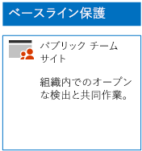
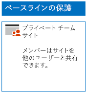
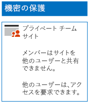
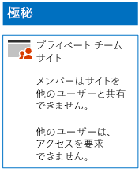

# 3 層の保護用に SharePoint Online サイトを展開するDeploy SharePoint Online sites for three tiers of protection

ベースライン、機密、および非常に機密性の高い社外秘の SharePoint Online チーム サイトを設計および展開するには、この記事の手順を実行してください。 これらの 3 層の保護の詳細については、「[Secure SharePoint Online sites and files](../security/office-365-security/secure-sharepoint-online-sites-and-files.md)」(SharePoint Online サイトとファイルのセキュリティ保護) を参照してください。Use the steps in this article to design and deploy baseline, sensitive, and highly confidential SharePoint Online team sites. For more information about these three tiers of protection, see [Secure SharePoint Online sites and files](../security/office-365-security/secure-sharepoint-online-sites-and-files.md).
  
## ベースラインの SharePoint Online チーム サイトBaseline SharePoint Online team sites

ベースラインの保護には、パブリックおよびプライベートのチーム サイトが含まれます。 パブリック チーム サイトは、組織内の全ユーザーが検出し、アクセスすることができます。 プライベート サイトは、チーム サイトに関連付けられている Office 365 グループのメンバーのみが検出し、アクセスすることができます。 いずれの種類のチーム サイトも、メンバーがサイトを他のユーザーと共有することを許可しています。Baseline protection includes both public and private team sites. Public team sites can be discovered and accessed by anybody in the organization. Private sites can only be discovered and accessed by members of the Office 365 group associated with the team site. Both of these types of team sites allow members to share the site with others.
  
### パブリックPublic

パブリック アクセスとアクセス許可を使用するベースライン SharePoint Online チーム サイトを作成するには、[次の指示](https://support.office.com/article/create-a-team-site-in-sharepoint-ef10c1e7-15f3-42a3-98aa-b5972711777d)に従います。To create a baseline SharePoint Online team site with public access and permissions, follow [these instructions](https://support.office.com/article/create-a-team-site-in-sharepoint-ef10c1e7-15f3-42a3-98aa-b5972711777d).

最終的な構成をここに示します。Here is your resulting configuration.
  

  
### プライベートPrivate

プライベート アクセスとアクセス許可を使用するベースライン SharePoint Online チーム サイトを作成するには、[次の指示](https://support.office.com/article/create-a-team-site-in-sharepoint-ef10c1e7-15f3-42a3-98aa-b5972711777d)に従います。To create a baseline SharePoint Online team site with private access and permissions, follow [these instructions](https://support.office.com/article/create-a-team-site-in-sharepoint-ef10c1e7-15f3-42a3-98aa-b5972711777d).
  
最終的な構成をここに示します。Here is your resulting configuration.
  

  
## 機密 SharePoint Online チーム サイトSensitive SharePoint Online team sites

機密 SharePoint Online チーム サイトは、プライベート チーム サイトとして開始します。A sensitive SharePoint Online team site starts as a private team site.
  
最初に、[次の指示](https://support.office.com/article/create-a-team-site-in-sharepoint-ef10c1e7-15f3-42a3-98aa-b5972711777d)でプライベート SharePoint Online チーム サイトを作成します。First, create the private SharePoint Online team site with [these instructions](https://support.office.com/article/create-a-team-site-in-sharepoint-ef10c1e7-15f3-42a3-98aa-b5972711777d).

次に、新しい SharePoint Online チーム サイトから、これらの手順で追加のアクセス許可の設定を構成します。Next, from the new SharePoint Online team site, configure additional permission settings with these steps.

1.  SharePoint チーム サイトのツール バーで、設定アイコンをクリックしてから、[**サイトの権限**] をクリックします。In the tool bar of the SharePoint team site, click the settings icon, and then click **Site permissions**.
2.  [**サイトの権限**] ウィンドウで、[**共有の設定**] の [**共有設定を変更します**] をクリックします。In the **Site permissions** pane, under **Sharing Settings**, click **Change sharing settings**.
3.  **[共有アクセス許可]** で、**[サイト所有者のみが、ファイル、フォルダー、およびサイトを共有できます]** を選択して、**[保存]** をクリックします。Under **Sharing permissions**, choose **Only site owners can share files, folders, and the site**, and then click **Save**.

これらのアクセス権の設定の結果は次のとおりです。The results of these permission settings are:

- メンバーが他のメンバーと共有する機能は無効にされています。The ability for members to share with other members is disabled.
- メンバー以外がアクセスを要求する機能は有効にされています。The ability for non-members to request access is enabled.

最終的な構成をここに示します。Here is your resulting configuration.
  

  
サイトのメンバーは、いずれかのアクセス グループのグループ メンバーシップを使用して、サイトのリソースについて安全に共同作業できるようになりました。The members of the site, through group membership in one of the access groups, can now securely collaborate on the resources of the site.
  
## 非常に機密性の高い社外秘 SharePoint Online チーム サイトHighly confidential SharePoint Online team sites

機密 SharePoint Online チーム サイトは、追加のアクセス許可の設定を使用するプライベート チーム サイトです。A highly confidential SharePoint Online team site is a private team site with additional permissions settings.

最初に、[次の指示](https://support.office.com/article/create-a-team-site-in-sharepoint-ef10c1e7-15f3-42a3-98aa-b5972711777d)でプライベート SharePoint Online チーム サイトを作成します。First, create the private SharePoint Online team site with [these instructions](https://support.office.com/article/create-a-team-site-in-sharepoint-ef10c1e7-15f3-42a3-98aa-b5972711777d).

次に、新しい SharePoint Online チーム サイトから、これらの手順で追加のアクセス許可の設定を構成します。Next, from the new SharePoint Online team site, configure additional permission settings with these steps.

1.  SharePoint チーム サイトのツール バーで、設定アイコンをクリックしてから、[**サイトの権限**] をクリックします。In the tool bar of the SharePoint team site, click the settings icon, and then click **Site permissions**.
2.  [**サイトの権限**] ウィンドウで、[**共有の設定**] の [**共有設定を変更します**] をクリックします。In the **Site permissions** pane, under **Sharing Settings**, click **Change sharing settings**.
3.  [**共有アクセス許可**] で、[**ファイル、フォルダー、およびサイトを共有できるのはサイトの所有者だけです**] を選択します。Under **Sharing permissions**, choose **Only site owners can share files, folders, and the site**.
4. [**アクセス要求の許可**] をオフにし、[**保存**] をクリックします。Turn off **Allow access requests**, and then click **Save**.

これらのアクセス権の設定の結果は次のとおりです。The results of these permission settings are:

- メンバーが他のメンバーと共有する機能は無効にされています。The ability for members to share with other members is disabled.
- メンバー以外がアクセスを要求する機能は無効にされています。The ability for non-members to request access is disabled.

最終的な構成をここに示します。Here is your resulting configuration.
  

  
サイトのメンバーは、いずれかのアクセス グループのグループ メンバーシップを使用して、サイトのリソースについて安全に共同作業できるようになりました。The members of the site, through group membership in one of the access groups, can now securely collaborate on the resources of the site.
  
## 次の手順Next step

[Office 365 ラベルと DLP による SharePoint ファイルの保護Protect SharePoint Online files with Office 365 labels and DLP](protect-sharepoint-online-files-with-office-365-labels-and-dlp.md)

## 関連項目See also

[選挙運動、非営利組織、およびその他のアジャイル組織のための Microsoft Security ガイダンスMicrosoft Security Guidance for Political Campaigns, Nonprofits, and Other Agile Organizations](../security/office-365-security/microsoft-security-guidance-for-political-campaigns-nonprofits-and-other-agile-o.md)
  
[クラウド導入およびハイブリッド ソリューションCloud adoption and hybrid solutions](https://docs.microsoft.com/office365/enterprise/cloud-adoption-and-hybrid-solutions)
