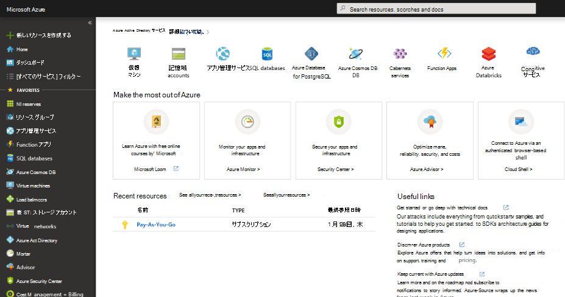
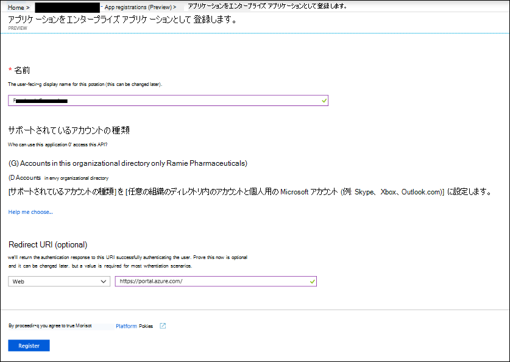
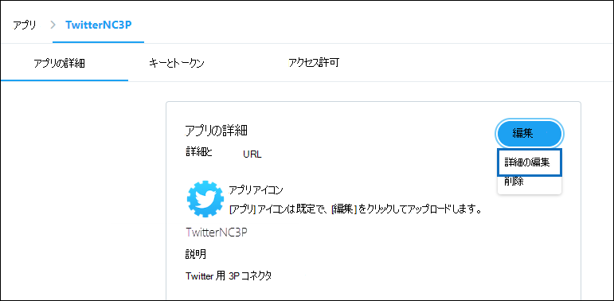

# コネクタを展開して Twitter データをアーカイブする

この記事では、Office 365 Import サービスを使用して組織の Twitter アカウントから Microsoft 365 にデータをインポートするコネクタを展開する手順について説明します。 このプロセスの概要と、Twitter コネクタの展開に必要な前提条件の一覧については、「コネクタをセットアップして Twitter データをアーカイブする」 [を参照してください ](archive-twitter-data-with-sample-connector.md)。

## 手順 1: アプリをアプリで作成Azure Active Directory

1. グローバル管理者 <https://portal.azure.com> アカウントの資格情報を使用して、アクセスしてサインインします。

   

2. 左側のナビゲーション ウィンドウで **[Azure Active Directory]** をクリックします。

   ![[次へ] Azure Active Directory。](../media/TCimage02.png)

3. 左側のナビゲーション ウィンドウで、[アプリの登録 ] **(プレビュー) をクリックし** 、[新しい登録] **をクリックします**。

   

4. アプリケーションを登録します。 [ **リダイレクト URI (省略可能)]** で、[アプリケーションの種類] ドロップダウン リストで **[Web]** を選択し `https://portal.azure.com` 、URI のボックスに入力します。

   

5. アプリケーション **(クライアント) ID とディレクトリ** **(テナント) ID** をコピーし、テキスト ファイルまたは他の安全な場所に保存します。 これらの ID は、後の手順で使用します。

    

6. [新しい **アプリの証明書&シークレット** ] に移動し、[クライアント シークレット] の下の [新 **しいクライアント** シークレット] **をクリックします**。

   

7. 新しいシークレットを作成します。 [説明] ボックスにシークレットを入力し、有効期限を選択します。

   ![シークレットを入力し、[有効期限] を選択します。](../media/TCimage08.png)

8. シークレットの値をコピーし、テキスト ファイルまたは他の保存場所に保存します。 これは、後AADで使用するアプリケーション シークレットの一部です。

   

## 手順 2: コネクタ Web サービスを Azure アカウントGitHubから展開する

1. このサイトに [移動しGitHub Azure](https://github.com/microsoft/m365-sample-twitter-connector-csharp-aspnet) **に展開をクリックします**。

    

2. [Azure に **展開] をクリック** すると、カスタム テンプレート ページを使用して Azure ポータルにリダイレクトされます。 [基本] と **[詳細****設定入力** し、[購入] を **クリックします**。

   ![[リソースの作成] をクリックし、ストレージ アカウントを入力します。](../media/FBCimage12.png)

    - **サブスクリプション:** Twitter コネクタ Web サービスを展開する Azure サブスクリプションを選択します。

    - **リソース グループ:** 新しいリソース グループを選択または作成します。 リソース グループは、Azure ソリューションの関連リソースを保持するコンテナーです。

    - **場所:** 場所を選択します。

    - **Web アプリ名:** コネクタ Web アプリの一意の名前を指定します。 名前の長さは 3 ~ 18 文字です。 この名前は、Azure アプリ サービスの URL を作成するために使用されます。たとえば **、twitterconnector** の Web アプリ名を指定すると、Azure アプリ サービスの URL が **twitterconnector.azurewebsites.net。**

    - **tenantId:** 手順 1 で Azure Active Directory で Facebook コネクタ Microsoft 365作成した後にコピーした組織のテナント ID。

   - **APISecretKey:** 任意の値をシークレットとして入力できます。 これは、手順 5 でコネクタ Web アプリにアクセスするために使用されます。

3. 展開が成功すると、ページは次のスクリーンショットのようになります。

    ![[アカウントStorage] をクリックし、[アカウントのStorageクリックします。](../media/FBCimage13.png)

## 手順 3: Twitter アプリを作成する

1. に移動し、組織の開発者アカウントの資格情報を使用してログインし、[アプリ https://developer.twitter.com ] を **クリックします**。

   
2. [アプリ **の作成] をクリックします**。

   ![[アプリ] ページに移動してアプリを作成します。](../media/TCimage26.png)

3. [ **アプリの詳細]** で、アプリケーションに関する情報を追加します。

   

4. Twitter 開発者ダッシュボードで、作成したアプリを選択し、[詳細] を **クリックします**。

   

5. [キー **とトークン]** タブの [コンシューマー API キー] で **、API** キーと API シークレット キーの両方をコピーし、テキスト ファイルまたは他の保存場所に保存します。 次に、[ **作成]** をクリックしてアクセス トークンとアクセス トークン シークレットを生成し、これらをテキスト ファイルまたは他の保存場所にコピーします。

   

   次に、[ **作成]** をクリックしてアクセス トークンとアクセス トークン シークレットを生成し、これらをテキスト ファイルまたは他の保存場所にコピーします。

6. [アクセス許可 **] タブを** クリックし、次のスクリーンショットに示すようにアクセス許可を構成します。

   

7. アクセス許可設定を保存したら、[アプリの詳細] タブをクリックし、[詳細の編集] >**をクリックします**。

   

8. 次のタスクを実行します。

   - コネクタ アプリが Twitter にサインインするには、このチェック ボックスをオンにします。

   - 次の形式を使用して OAuth リダイレクト Uri を追加します。 **\<connectorserviceuri> /Views/TwitterOAuth** *、connectorserviceuri* の値は、組織の Azure アプリ サービス URL です。たとえば https://twitterconnector.azurewebsites.net/Views/TwitterOAuth 。

    

これで、Twitter 開発者アプリを使用する準備ができました。

## 手順 4: コネクタ Web アプリを構成する

1. [https:// \<AzureAppResourceName> .azurewebsites.net に移動します **(AzureAppResourceName** は、手順 4 で指定した Azure アプリ リソースの名前です)。 たとえば、名前が **twitterconnector の場合は**、 に移動します https://twitterconnector.azurewebsites.net 。 アプリのホーム ページは、次のスクリーンショットのようになります。

   ![[Azure アプリ リソース] ページに移動します。](../media/FBCimage41.png)

2. [構成 **] を** クリックしてサインイン ページを表示します。

   ![[構成] をクリックしてサインイン ページを表示します。](../media/FBCimage42.png)

3. [テナント ID] ボックスに、テナント ID (手順 2 で取得した) を入力または貼り付けます。 パスワード ボックスに、APISecretKey (手順 2 で取得した) を入力または貼り付け、[構成の設定] 設定 をクリックして構成の詳細ページを表示します。

   

4. 次の構成設定を入力します。

   - **Twitter Api キー:** 手順 3 で作成した Twitter アプリケーションの API キー。

   - **Twitter Api シークレット キー:** 手順 3 で作成した Twitter アプリケーションの API シークレット キー。

   - **Twitter アクセス トークン:** 手順 3 で作成したアクセス トークン。

   - **Twitter Access トークン シークレット:** 手順 3 で作成したアクセス トークン シークレット。

   - **AADアプリケーション ID:** 手順 1 で作成Azure Active Directoryアプリのアプリケーション ID

   - **AAD アプリケーション シークレット:** 手順 1 で作成した APISecretKey シークレットの値。

5. [保存 **] を** クリックしてコネクタ設定を保存します。

## 手順 5: アプリケーションで Twitter コネクタをセットアップMicrosoft 365 コンプライアンス センター

1. [データ コネクタ] Microsoft 365 コンプライアンス センターに移動し、[データ コネクタ] ページの [<<a href="https://go.microsoft.com/fwlink/p/?linkid=2173865" target="_blank">  /a] を選択します。

2. [Twitter]**の [データ コネクタ] ページ****で、[表示**] を **クリックします**。

3. Twitter ページで **、[コネクタの** 追加] **をクリックします**。

4. [サービス条件 **] ページで、[** 同意する] を **クリックします**。

5. [コネクタ **アプリの資格情報の追加]** ページで、次の情報を入力し、[接続の検証] **をクリックします**。

   

    - [名前 **] ボックス** に、Twitter ヘルプ ハンドルなどのコネクタの **名前を入力します**。

    - [コネクタ **の URL] ボックス** に、Azure アプリ サービスの URL を入力または貼り付けます。たとえば `https://twitterconnector.azurewebsites.net` .

    - [パスワード **] ボックス** に、手順 2 で作成した APISecretKey の値を入力または貼り付けます。

    - [Azure **App ID]** ボックスに、手順 1 で取得した Azure Application App ID (クライアント *ID* とも呼ばれる) の値を入力または貼り付けます。

6. 接続が正常に検証された後、[次へ] を **クリックします**。

7. [データの **インポートMicrosoft 365承認する**] ページで、APISecretKey を再度入力または貼り付け、[Web アプリのログイン]**をクリックします**。

8. [Twitter **でログイン] をクリックします**。

9. [Twitter サインイン] ページで、組織の Twitter アカウントの資格情報を使用してサインインします。

   

   サインインすると、Twitter ページに「Twitter Connector Job 正常にセットアップされました」というメッセージが表示されます。

10. [続行 **] を** クリックして、Twitter コネクタのセットアップを完了します。

11. [フィルター **の設定] ページ** で、フィルターを適用して、特定の年齢のアイテムを最初にインポートできます。 年齢を選択し、[次へ] を **クリックします**。

12. [保存 **場所の選択**] ページで、Twitter アイテムMicrosoft 365するメールボックスの電子メール アドレスを入力し、[次へ] を **クリックします**。

13. [ **次へ]** をクリックしてコネクタの設定を確認し、[完了] を **クリックして** コネクタのセットアップを完了します。

14. コンプライアンス センターで、[データ コネクタ] ページに **移動** し、[コネクタ] タブをクリックしてインポート プロセスの進行状況を確認します。
