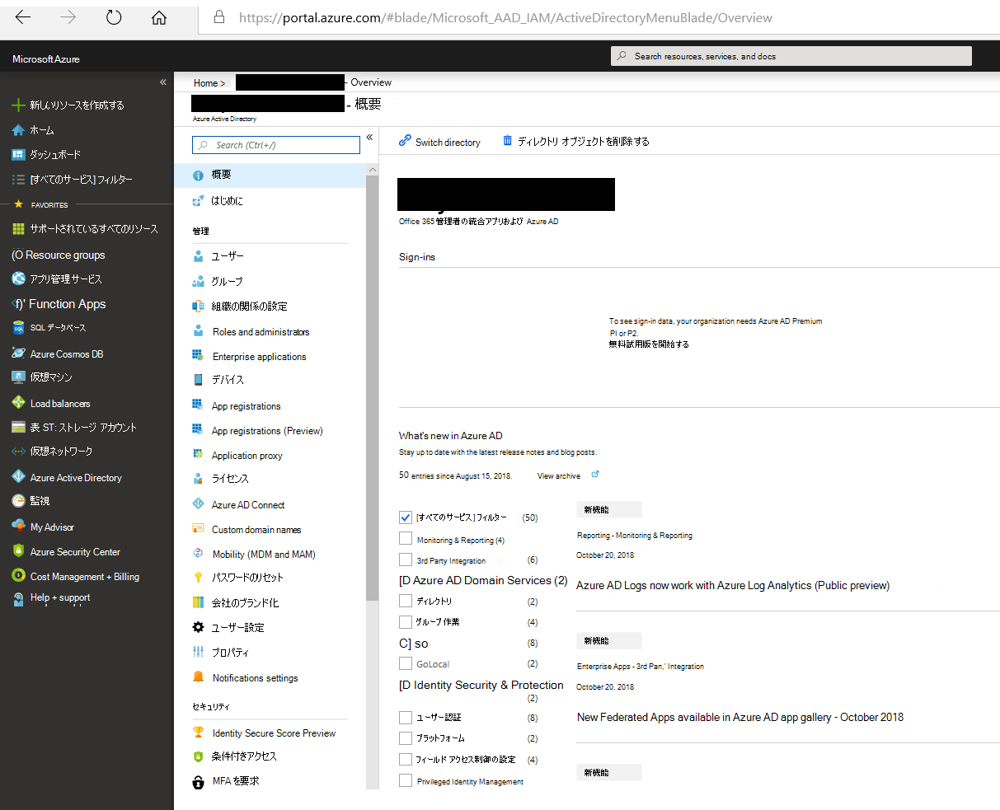

# Twitter データをアーカイブするためのコネクタのデプロイ

[!include[Purview banner](../includes/purview-rebrand-banner.md)]

この記事には、Office 365 Import サービスを使用して組織の Twitter アカウントからMicrosoft 365にデータをインポートするコネクタをデプロイするためのステップ バイ ステップ プロセスが含まれています。 このプロセスの概要と、Twitter コネクタをデプロイするために必要な前提条件の一覧については、「Twitter [データをアーカイブするためのコネクタの設定 ](archive-twitter-data-with-sample-connector.md)」を参照してください。

## 手順 1: Azure Active Directoryでアプリを作成する

1. <https://portal.azure.com>グローバル管理者アカウントの資格情報を使用して、アクセスしてサインインします。

   

2. 左側のナビゲーション ウィンドウで **[Azure Active Directory]** をクリックします。

   

3. 左側のナビゲーション ウィンドウで、[**アプリの登録 (プレビュー)]** をクリックし、[**新しい登録**] をクリックします。

   

4. アプリケーションを登録します。 [ **リダイレクト URI (省略可能)]** で、アプリケーションの種類ドロップダウン リストで **[Web** ] を選択し、URI のボックスに入力 `https://portal.azure.com` します。

   

5. **アプリケーション (クライアント) ID** と **ディレクトリ (テナント) ID を** コピーし、テキスト ファイルまたはその他の安全な場所に保存します。 これらの ID は、後の手順で使用します。

    

6. **新しいアプリの証明書&シークレットに** 移動し、[**クライアント シークレット**] の [**新しいクライアント シークレット**] をクリックします。

   

7. 新しいシークレットを作成します。 説明ボックスにシークレットを入力し、有効期限を選択します。

   

8. シークレットの値をコピーし、テキスト ファイルまたはその他の保存場所に保存します。 これは、後の手順で使用するAADアプリケーション シークレットです。

   

## 手順 2: GitHubから Azure アカウントにコネクタ Web サービスをデプロイする

1. [このGitHub サイト](https://github.com/microsoft/m365-sample-twitter-connector-csharp-aspnet)に移動し、[**Azure へのデプロイ**] をクリックします。

    

2. **[Azure へのデプロイ**] をクリックすると、カスタム テンプレート ページを含むAzure portalにリダイレクトされます。 **基本** と **設定** の詳細を入力し、[**購入**] をクリックします。

   ![[リソースの作成] をクリックし、ストレージ アカウントを入力します。](../media/FBCimage12.png)

    - **サブスクリプション：** Twitter コネクタ Web サービスをデプロイする Azure サブスクリプションを選択します。

    - **リソース グループ:** 新しいリソース グループを選択または作成します。 リソース グループは、Azure ソリューションの関連リソースを保持するコンテナーです。

    - **場所：** 場所を選択します。

    - **Web アプリ名:** コネクタ Web アプリの一意の名前を指定します。 名前の長さは 3 文字から 18 文字にする必要があります。 この名前は、Azure アプリ サービスの URL を作成するために使用されます。たとえば、 **twitterconnector** の Web アプリ名を指定すると、Azure アプリ サービスの URL **が twitterconnector.azurewebsites.net** されます。

    - **tenantId:** 手順 1. で Azure Active Directory で Facebook コネクタ アプリを作成した後にコピーした、Microsoft 365組織のテナント ID。

   - **APISecretKey:** 任意の値をシークレットとして入力できます。 これは、手順 5. のコネクタ Web アプリにアクセスするために使用されます。

3. デプロイが成功すると、ページは次のスクリーンショットのようになります。

    ![[Storage] をクリックし、[Storage アカウント] をクリックします。](../media/FBCimage13.png)

## 手順 3: Twitter アプリを作成する

1. に移動し https://developer.twitter.com、組織の開発者アカウントの資格情報を使用してログインし、[ **アプリ**] をクリックします。

   
2. [ **アプリの作成**] をクリックします。

   ![[アプリ] ページに移動してアプリを作成します。](../media/TCimage26.png)

3. [ **アプリの詳細**] で、アプリケーションに関する情報を追加します。

   

4. Twitter 開発者ダッシュボードで、先ほど作成したアプリを選択し、[ **詳細**] をクリックします。

   

5. [ **キーとトークン** ] タブの [ **コンシューマー API キー** ] で、API キーと API シークレット キーの両方をコピーし、テキスト ファイルまたはその他の保存場所に保存します。 次に、[ **作成** ] をクリックしてアクセス トークンとアクセス トークン シークレットを生成し、テキスト ファイルまたはその他の保存場所にコピーします。

   

   次に、[ **作成** ] をクリックしてアクセス トークンとアクセス トークン シークレットを生成し、テキスト ファイルまたはその他の保存場所にコピーします。

6. [ **アクセス許可** ] タブをクリックし、次のスクリーンショットに示すようにアクセス許可を構成します。

   

7. アクセス許可の設定を保存したら、[ **アプリの詳細** ] タブをクリックし、[ **詳細の編集] >** クリックします。

   

8. 次のタスクを実行します。

   - コネクタ アプリが Twitter にサインインできるようにするには、このチェック ボックスをオンにします。

   - 次の形式を使用して OAuth リダイレクト Uri を追加します **\<connectorserviceuri>。 /Views/TwitterOAuth**。*connectorserviceuri* の値は組織の Azure アプリ サービス URL です。たとえば、 https://twitterconnector.azurewebsites.net/Views/TwitterOAuth

    

これで、Twitter 開発者アプリを使用する準備が整いました。

## 手順 4: コネクタ Web アプリを構成する

1. https://\<AzureAppResourceName>.azurewebsites.net に移動します ( **ここで、AzureAppResourceName** は、手順 4. で指定した Azure アプリ リソースの名前です)。 たとえば、名前が **twitterconnector** の場合は、 https://twitterconnector.azurewebsites.net. アプリのホーム ページは、次のスクリーンショットのようになります。

   

2. [ **構成] を** クリックしてサインイン ページを表示します。

   ![[構成] をクリックしてサインイン ページを表示します。](../media/FBCimage42.png)

3. [テナント ID] ボックスに、テナント ID (手順 2 で取得した) を入力または貼り付けます。 パスワード ボックスに、APISecretKey (手順 2 で取得した) を入力または貼り付け、**構成設定の設定** をクリックして構成の詳細ページを表示します。

   

4. 次の構成設定を入力します

   - **Twitter Api キー:** 手順 3. で作成した Twitter アプリケーションの API キー。

   - **Twitter Api シークレット キー:** 手順 3. で作成した Twitter アプリケーションの API シークレット キー。

   - **Twitter アクセス トークン:** 手順 3. で作成したアクセス トークン。

   - **Twitter アクセス トークン シークレット:** 手順 3. で作成したアクセス トークン シークレット。

   - **AAD アプリケーション ID:** 手順 1 で作成したAzure Active Directory アプリのアプリケーション ID

   - **AAD アプリケーション シークレット:** 手順 1 で作成した APISecretKey シークレットの値。

5. [ **保存] を** クリックしてコネクタの設定を保存します。

## 手順 5: コンプライアンス ポータルで Twitter コネクタを設定する

1. Microsoft Purview コンプライアンス ポータルに移動し、[**データ コネクタ**] ページ</a を選択します<a href="https://go.microsoft.com/fwlink/p/?linkid=2173865" target="_blank">。

2. **Twitter** の [**データ コネクタ**] ページで、[**表示**] をクリックします。

3. **Twitter** ページで、[コネクタの **追加**] をクリックします。

4. [利用規約] ページ **で** 、[ **同意** する] をクリックします。

5. [ **コネクタ アプリの資格情報の追加]** ページで、次の情報を入力し、[ **接続の検証**] をクリックします。

   

    - [ **名前]** ボックスに、 **Twitter ヘルプ ハンドル** などのコネクタの名前を入力します。

    - [**コネクタ URL**] ボックスに、Azure アプリ サービス URL を入力するか貼り付けます。たとえば.`https://twitterconnector.azurewebsites.net`

    - [ **パスワード** ] ボックスに、手順 2. で作成した APISecretKey の値を入力するか貼り付けます。

    - **[Azure アプリ ID**] ボックスに、手順 1 で取得したAzure アプリケーションアプリ ID (*クライアント ID* とも呼ばれます) の値を入力または貼り付けます。

6. 接続が正常に検証されたら、[ **次へ**] をクリックします。

7. [**データをインポートするための承認Microsoft 365**] ページで、APISecretKey をもう一度入力または貼り付けてから、[**ログイン Web アプリ**] をクリックします。

8. [ **Twitter でログイン]** をクリックします。

9. Twitter サインイン ページで、組織の Twitter アカウントの資格情報を使用してサインインします。

   

   サインインすると、Twitter ページに次のメッセージ "Twitter コネクタ ジョブが正常に設定されました" と表示されます。

10. [ **続行]** をクリックして、Twitter コネクタの設定を完了します。

11. [ **フィルターの設定** ] ページで、フィルターを適用して、特定の年齢のアイテムを最初にインポートできます。 年齢を選択し、[ **次へ**] をクリックします。

12. [**ストレージの場所の選択]** ページで、Twitter アイテムのインポート先となるメールボックスMicrosoft 365メール アドレスを入力し、[**次へ**] をクリックします。

13. [ **次へ** ] をクリックしてコネクタの設定を確認し、[ **完了]** をクリックしてコネクタの設定を完了します。

14. コンプライアンス センターの [ **データ コネクタ** ] ページに移動し、[ **コネクタ** ] タブをクリックしてインポート プロセスの進行状況を確認します。
