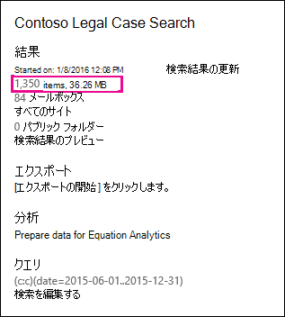

# 推定電子情報開示検索結果と実際の電子情報開示検索結果の相違点

このトピックは、次の Microsoft 365 電子情報開示ツールのいずれかを使用して実行できる検索に適用されます。 

- コンテンツ検索
- コア電子情報開示 
   
電子情報開示検索を実行すると、使用しているツールは検索条件に一致するアイテム数 (および合計サイズ) の推定値を返します。 たとえば、Microsoft 365 コンプライアンス センターで検索を実行すると、選択した検索のフライアウト ページに推定検索結果が表示されます。
  

  
これは、結果をローカル コンピューターにエクスポートする場合と、検索結果と一緒にダウンロードされるエクスポートの概要レポートに結果をエクスポートするときに、電子情報開示エクスポート ツールに表示されるアイテムの合計サイズと数と同じ推定値です。
  
**電子情報開示エクスポート ツールの推定結果**

  
**エクスポートの概要レポートの推定結果**

  
ただし、エクスポートの概要レポートの前のスクリーンショットに示すように、ダウンロードされる実際の検索結果のサイズと数は、予想される検索結果のサイズと数とは異なります。
  

  
以下に、これらの違いを示す理由を示します。
  
- **結果の推定方法**。 検索結果の推定値は、検索クエリ条件を満たすアイテムの推定値 (実際の数ではなく) です。 Exchange アイテムの見積もりをコンパイルするには、検索条件を満たすメッセージの一覧が、使用している電子情報開示ツールによって Exchange データベースから要求されます。 ただし、検索結果をエクスポートすると、検索が再実行され、実際のメッセージが Exchange データベースから取得されます。 したがって、これらの違いは、推定アイテム数と実際のアイテム数がどのように決定されるのかによって生じ得る可能性があります。

- **検索結果の推定とエクスポートの間に発生する変更**。 検索結果をエクスポートすると、検索が再開され、検索条件に一致する検索インデックス内の最新のアイテムが収集されます。 予想される検索結果が収集され、検索結果がエクスポートされた時間の間に、検索条件を満たす追加のアイテムが作成、送信、または受信される可能性があります。 検索結果の推定時に検索インデックスに含められたアイテムは、検索結果がエクスポートされる前にコンテンツの場所から削除されたため、存在しなくなる可能性もあります。 この問題を軽減する 1 つの方法は、電子情報開示検索の日付範囲を指定する方法です。 もう 1 つの方法は、コンテンツの場所を保留にし、アイテムが保持され、削除できない方法です。 

   まれですが、保留が適用されている場合でも、組み込みの予定表アイテムのメンテナンス (ユーザーは編集できませんが、多くの検索結果に含まれます) は、ときおり削除される可能性があります。 予定表アイテムを定期的に削除すると、エクスポートされるアイテムの数が少なになります。

- **インデックスのないアイテム**。 検索にインデックスが設定されていないアイテムは、推定検索結果と実際の検索結果の間で違いを引き起こす可能性があります。 検索結果をエクスポートするときに、インデックスのないアイテムを含めることができます。 検索結果をエクスポートするときにインデックスのないアイテムを含める場合は、エクスポートされるアイテムが多い可能性があります。 これにより、推定検索結果とエクスポートされた検索結果が異なる可能性があります。

    コンテンツ検索ツールを使用する場合、インデックスのないアイテムを検索の推定に含めるオプションがあります。 検索によって返されるインデックスのないアイテムの数は、他の推定検索結果と共に、フライアウト ページに一覧表示されます。 インデックスのないアイテムは、予想される検索結果の合計サイズにも含まれます。 検索結果をエクスポートする場合、インデックスのないアイテムを含めるか含めないかのオプションがあります。 これらのオプションの構成方法により、ダウンロードされる推定検索結果と実際の検索結果が異なる可能性があります。

- **すべてのコンテンツの場所を含むコンテンツ検索の結果をエクスポートします**。 結果をエクスポートする検索が組織内のすべてのコンテンツの場所の検索だった場合は、検索条件に一致するアイテムを含むコンテンツの場所からインデックスのないアイテムだけがエクスポートされます。 In other words, if no search results are found in a mailbox or site, then any unindexed items in that mailbox or site won't be exported. ただし、すべてのコンテンツの場所のインデックスのないアイテム (検索クエリに一致するアイテムが含まれていないものも含む) は、予想される検索結果に含まれます。

    または、特定のコンテンツの場所から結果をエクスポートする検索の場合、検索で指定されたコンテンツの場所からインデックスのないアイテム (検索条件で除外されないアイテム) がエクスポートされます。 この場合、インデックスのないアイテムの推定数とエクスポートされるインデックスのないアイテムの数は同じである必要があります。

    組織内のすべての場所からインデックスのないアイテムをエクスポートしない理由は、エクスポート エラーの可能性が高く、検索結果のエクスポートとダウンロードにかかる時間が長引く可能性があるためです。

- **生のファイル形式とエクスポートされたファイル形式**。 Exchange アイテムの場合、検索結果の推定サイズは、未加工の Exchange メッセージ サイズを使用して計算されます。 ただし、電子メール メッセージは、PST ファイルまたは個々のメッセージ (EML ファイルとして書式設定されている) としてエクスポートされます。 どちらのエクスポート オプションも、生の Exchange メッセージとは異なるファイル形式を使用します。その結果、エクスポートされたファイルの合計サイズは、予想されるファイル サイズとは異なります。

- **ドキュメントのバージョン**。 SharePoint ドキュメントの場合、ドキュメントの複数のバージョンは見積もり検索結果に含まれません。 ただし、検索結果をエクスポートするときにすべてのドキュメント バージョンを含めるオプションがあります。このオプションを使用すると、エクスポートされたドキュメントの実際の数 (および合計サイズ) が増加します。 

- **重複を排除します**。 Exchange アイテムの場合、重複除外はエクスポートされるアイテムの数を減らします。 エクスポート時に検索結果を重複を削除するオプションがあります。 Exchange メッセージの場合、メッセージが複数のメールボックスにある場合でも、メッセージの 1 つのインスタンスだけがエクスポートされます。 推定される検索結果には、メッセージのすべてのインスタンスが含まれます。 したがって、検索結果をエクスポートするときに重複除外オプションを選択した場合、エクスポートされる実際のアイテム数は、推定アイテム数よりもかなり少ない可能性があります。

    重複除外オプションを選択する場合、別の点として、すべての Exchange アイテムが 1 つの PST ファイルにエクスポートされ、ソース メールボックスのフォルダー構造が保持されません。 エクスポートされた PST ファイルには、メール アイテムが含まれています。 ただし、検索結果レポートには、メッセージが保存されているソース メールボックスを識別するエクスポートされた各メッセージのエントリが含まれる。 これにより、重複するメッセージを含むすべてのメールボックスを特定できます。 重複除外を有効にしない場合は、検索に含まれる各メールボックスの別の PST ファイルがエクスポートされます。 
 
> [!NOTE]
> 検索結果をエクスポートしたりレポートをダウンロードしたりするときに、暗号化されているアイテムや認識できない形式のアイテムを含めるオプションを選択しない場合、インデックス エラー レポートはダウンロードされますが、エントリはありません。 これは、インデックス作成エラーが発生しないという意味ではない。 単に、インデックスのないアイテムがエクスポートに含まれていないという意味です。 
