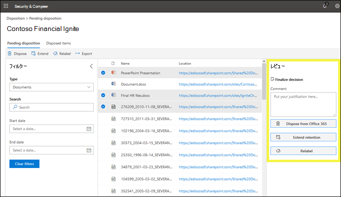
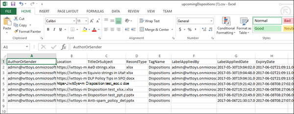

# 廃棄レビューの概要

>*[セキュリティ & コンプライアンスのための Microsoft 365 ライセンスガイダンス](https://aka.ms/ComplianceSD)。*

コンテンツが保存期間の最後に達すると、いくつかの理由から、そのコンテンツを確認して、安全に削除できるかどうかを判断する必要があります (「廃棄済み」)。 たとえば、次のことを行う必要があります。
  
- 訴訟や監査の際に、関連するコンテンツの削除 ("廃棄") を中断します。
    
- コンテンツにリサーチまたは履歴の値がある場合は、廃棄リストからコンテンツを削除してアーカイブに保存します。
    
- 元のポリシーが一時的または暫定ソリューションだった場合は、コンテンツに異なる保存期間を割り当てます。
    
- クライアントにコンテンツを返すか、または別の組織に転送します。
    
Microsoft 365 コンプライアンスセンター、Microsoft 365 セキュリティセンター、または Office 365 セキュリティ & コンプライアンスセンターで保持ラベルを作成する場合、保持期間の終了時に廃棄レビューを開始することを選択できます。 廃棄レビューの場合:
  
- 選択したユーザーには、閲覧するコンテンツがあることを示す電子メール通知が送信されます。 通知は週単位で送信されることに注意してください。
    
- レビュー担当者は、 **Disposition**セキュリティ&amp;コンプライアンスセンターの [廃棄] ページに移動して、コンテンツを確認します。 レビュー担当者は、廃棄を待機している各保持ラベルのアイテム数を確認し、そのラベルを持つすべてのコンテンツを表示する保持ラベルを選択することができます。
    
- レビュー担当者は、ドキュメントまたは電子メールごとに次のことを行えます。
    
  - 別の保持ラベルを適用します。
    
  - その保持期間を延長します。
    
  - 完全に削除します。
    
- レビュー担当者は、保留中または完了した処理のいずれかを表示し、その一覧を .csv ファイルとしてエクスポートできます。

廃棄レビューには、Exchange メールボックス、SharePoint サイト、OneDrive アカウント、および Office 365 グループのコンテンツを含めることができます。 これらの場所の廃棄レビューを待機しているコンテンツは、レビュー担当者がコンテンツを完全に削除することを選択した場合にのみ削除されます。
  
![セキュリティ/コンプライアンスセンターの [配置] ページ](../media/Retention-Dispositions-v2-page.png)

## 保持ラベルを作成して廃棄レビューを設定する

これは、廃棄レビューを設定するための基本的なワークフローです。 このフローには、公開されている保持ラベルと、ユーザーによって手動で適用されるものが示されることに注意してください。または、廃棄レビューをトリガーする保持ラベルをコンテンツに自動適用することもできます。
  

  
廃棄のレビューは、Office 365 で保持ラベルを作成する場合のオプションです。 このオプションは、アイテム保持ポリシーでは使用できませんが、コンテンツを保持するように構成された保持ラベルでのみ使用できます。
  
保持ラベルの詳細については、「[保持ラベルの概要](labels.md)」を参照してください。
  

 
> [!NOTE]
> [レビューの準備が**できたアイテムがあるときに、これらのユーザーに通知**する] オプションを指定する場合は、ユーザーを指定します。 このオプションでは、Office 365 グループはサポートされていません。

## コンテンツを破棄する

コンテンツがレビューできる状態であることをレビュー担当者に電子メールで通知する場合**Disposition**は、セキュリティ&amp;コンプライアンスセンターの [廃棄] ページに移動できます。 レビュー担当者は、廃棄を待機している各保持ラベルのアイテム数を確認し、そのラベルを持つすべてのコンテンツを表示する保持ラベルを選択することができます。

保持ラベルを選択すると、次のページにそのラベルの保留中のすべての実行が表示されます。

レビュー担当者は次のことができます。 
  
- 別の保持ラベルを適用します。
    
- 保持期間を延長します。
    
- アイテムを完全に削除します。

レビューアーは複数のアイテムを選択し、それらを同時に破棄することに注意してください。
    
レビュー担当者は、このリンクを使用して、その場所へのアクセス許可がある場合に、元の場所にドキュメントを表示することもできます。 廃棄レビュー中は、コンテンツは元の場所から移動されません。また、レビュー担当者がそのように選択しない限り、削除されることはありません。
  
電子メール通知は、1週間ごとにレビュー担当者に自動的に送信されることに注意してください。 そのため、コンテンツが保持期間の最後に達すると、コンテンツが廃棄を待機しているというメール通知をレビューアーが受け取るまでに最大7日かかる可能性があります。
  
また、すべての廃棄アクションが監査されることにも注意してください。 このことを確認するには、最初の廃棄アクションの前に少なくとも1日前に監査を有効にする必要があります。詳細については、「 [Office 365 セキュリティ&amp;コンプライアンスセンターでの監査ログの検索](search-the-audit-log-in-security-and-compliance.md)」を参照してください。 
  
## 廃棄のアクセス許可

[**廃棄**] ページにアクセスするには、[**廃棄管理**] 役割と [**表示のみ] の監査ログ**の役割がレビュー担当者に割り当てられている必要があります。 役割の割り当ての[手順を表示](../security/office-365-security/grant-access-to-the-security-and-compliance-center.md)します。

**表示のみの監査ログ**の役割に固有です。

- 監査ログの検索に使用される基礎となるコマンドレットは Exchange Online コマンドレットなので、セキュリティ & コンプライアンスセンターの [**アクセス許可**] ページではなく、exchange [online の exchange 管理センター](https://docs.microsoft.com/Exchange/exchange-admin-center)を使用してユーザーを割り当てる必要があります。 手順については、「 [Manage role groups In Exchange Online](https://docs.microsoft.com/Exchange/permissions-exo/role-groups)」を参照してください。

- Office 365 グループはこの役割ではサポートされていません。 代わりに、ユーザーメールボックスまたはメールユーザーを割り当てます。
  
## 破棄されたコンテンツが完全に削除されるまでの時間

廃棄レビューを待機しているコンテンツは、レビュー担当者がコンテンツを完全に削除することを選択した場合にのみ削除されます。 レビュー担当者がこのオプションを選択すると、SharePoint サイトまたは OneDrive アカウントのコンテンツは、このセクションで説明されている標準的なクリーンアッププロセスの対象となります。[アイテム保持ポリシーがコンテンツをインプレースでどのように動作するか](retention-policies.md#how-a-retention-policy-works-with-content-in-place)を指定します。
  
これは、次のことを意味します。
  
- ドキュメントライブラリ内のコンテンツは、廃棄の**7 日以内**に第1段階のごみ箱に移動され、その後は**93 日**後に完全に削除されます。 ごみ箱には検索によってインデックスが作成されないため、電子情報開示ホールドでそのコンテンツを使用できません。

- 保持保持ライブラリのコンテンツは、廃棄から**7 日以内**に完全に削除されます。

- Exchange メールボックス内のアイテムは、廃棄から**14 日以内**に完全に削除されます。 (既定の設定は14日であることに注意してくださいが、最大30日間構成できます)。
    
## 保留中の廃棄と破棄されたアイテムを表示する

[**保留中の廃棄**] ページでは、特定の保持ラベルについて、保留中および完了済みの両方の処理を表示できます。 
  
- **保留中の廃棄**は、保持期間の最後に達し、廃棄レビューを必要とするアイテムを示します。 各項目を確認した後、別の保持ラベルを適用するか、その保持期間を延長するか、または完全に削除するかを決定します。 複数のアイテムを選択できます。
    
- [**破棄**されたアイテム] タブには、廃棄レビューで既に実行されている完全に削除されたアイテムが表示されます。 この記事では、上記のセクションで説明したように、永続的な削除処理に数日かかる場合があるため、ここで説明します。 別の保持ラベルが適用されているアイテム、またはレビューの一部として保持期間を延長したアイテムは、ここには表示されません。

    
### 廃棄ビューをフィルター処理する

これらのビューは、保持ラベルまたは時間範囲によってフィルター処理できます。 保留中の処理の場合、時間の範囲は有効期限に基づきます。 破棄されたアイテムの場合、時間範囲は、削除日に基づいています。
  

### 廃棄アイテムをエクスポートする

また、いずれかのビューのアイテムを .csv ファイルとしてエクスポートして、Excel で開くことができます。
  

  

