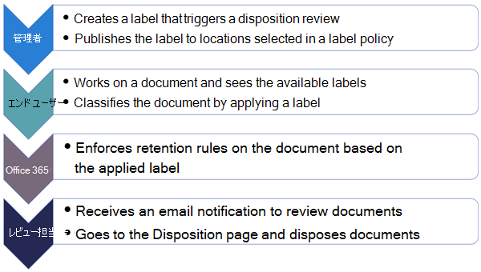
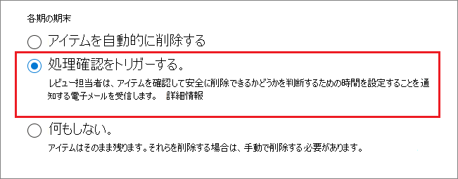
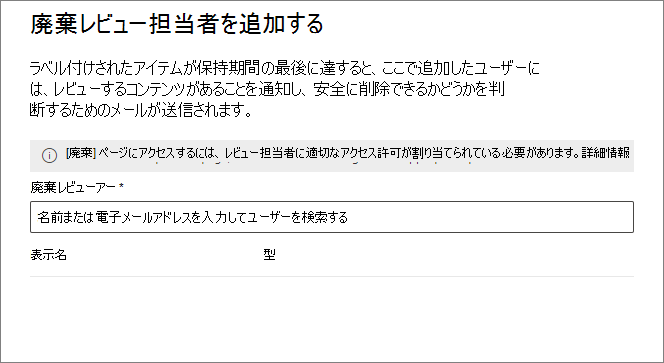
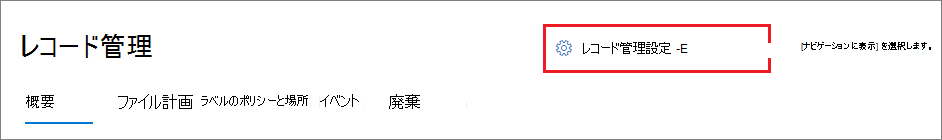
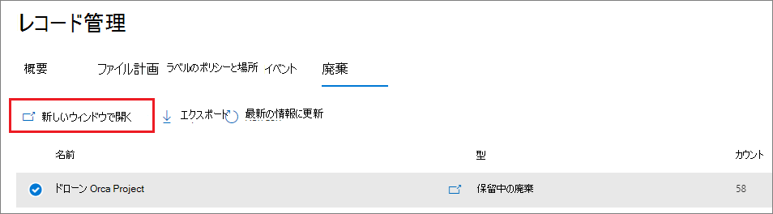
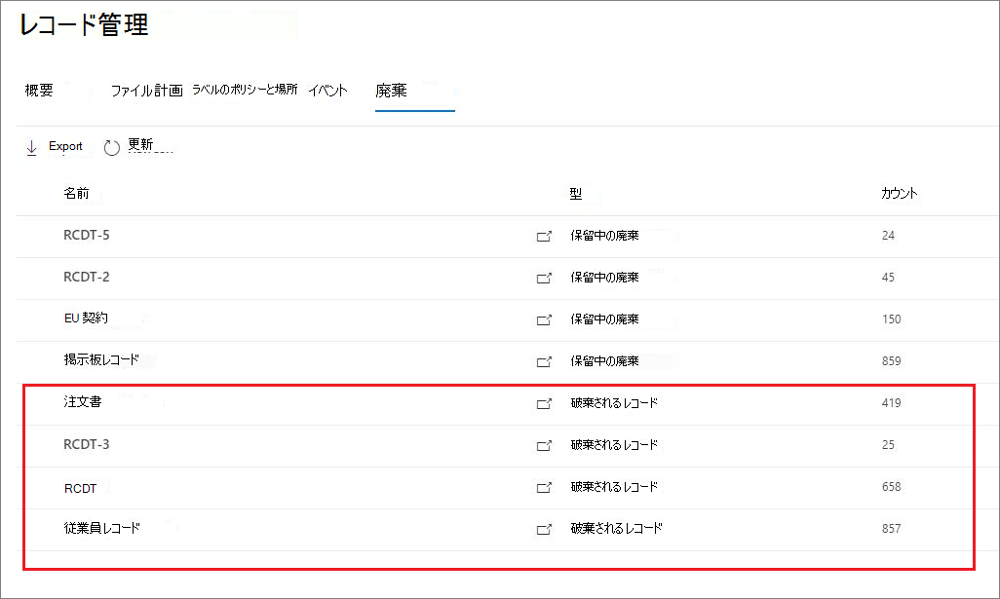

# <a name="disposition-of-content"></a>コンテンツの処理

>*[セキュリティとコンプライアンスのための Microsoft 365 ライセンス ガイダンス](/office365/servicedescriptions/microsoft-365-service-descriptions/microsoft-365-tenantlevel-services-licensing-guidance/microsoft-365-security-compliance-licensing-guidance)。*

Microsoft 365 コンプライアンス センターの **レコード管理** の [**処理**] タブを使用して、処理確認を管理し、保持期間の終了時に自動的に削除された [レコード](records-management.md#records)のメタデータを表示します。

> [!NOTE]
> プレビューで: **マルチステージの処理確認**
> 
> 管理者は保持ラベルに最大 5 つの連続する処理確認ステージを追加し、確認担当者は他のユーザーを処理確認ステージに追加できます。 メールの通知とアラームをカスタマイズすることもできます。 次のセクションでは、このプレビューでの変更点を詳しく説明します。
>
> リリースのお知らせは、ブログ記事「[Microsoft レコード管理でのマルチステージ処理のお知らせ](https://techcommunity.microsoft.com/t5/security-compliance-and-identity/announcing-multi-stage-disposition-in-microsoft-records/ba-p/2361849)」をご覧ください。

## <a name="prerequisites-for-viewing-content-dispositions"></a>コンテンツの処理を表示するための前提条件

処理確認を管理し、レコードが削除されたことを確認するには、十分なアクセス許可があり、監査が有効になっている必要があります。 また、処理の[制限](retention-limits.md#maximum-number-of-items-for-disposition)にも注意してください。

### <a name="permissions-for-disposition"></a>処理のアクセス許可

Microsoft 365 コンプライアンス センターの [**処理**] タブに正常にアクセスするには、ユーザーは **処理管理** の役割を持っている必要があります。 2020 年 12 月より、この役割は、**レコード管理** の既定の管理者の役割グループに含まれるようになりました。

> [!NOTE]
> 既定で、グローバル管理者には **処理管理** の役割は付与されません。 

ユーザーに、保持およびレコード管理用の他の機能を表示および構成するためのアクセス許可を付与せずに、処理確認に必要なアクセス許可のみを付与するには、カスタムの役割グループ (たとえば、"処理確認" という名前) を作成して、このグループに **処理管理** の役割を付与します。

ユーザーを既定の役割に追加する手順、または独自の役割グループを作成する手順については、「[Microsoft 365 コンプライアンス センターのアクセス許可](microsoft-365-compliance-center-permissions.md)」を参照してください。

さらに:

- さらに、処理プロセス中にアイテムの内容を表示するには、**コンテンツ エクスプローラーのコンテンツ閲覧者** の役割グループにユーザーを追加します。 ユーザーがこれらの役割グループのアクセス許可を持っていない場合でも、処理確認操作を選択して処理確認を完了することができますが、コンプライアンス センターのプレビュー ウィンドウからアイテムのコンテンツを表示することはできません。

- プレビューの場合: 既定では、[**処理]** ページにアクセス する人は、自分に確認が割り当てられているアイテムだけが表示されます。 すべてのユーザーに割り当てられているすべてのアイテムを表示し、処理確認で構成されているすべての保持ラベルを表示できるレコード管理者の場合: **レコード管理設定** > **一般** > **レコード マネージャー向けセキュリティ グループ** に移動し、管理者アカウントを含むメールが有効になっているセキュリティ グループを選択して有効にします。
    
    メールが有効になっていない Microsoft 365 グループとセキュリティ グループは、この機能をサポートしていないので、選択対象のリストには表示されません。 メールが有効な新しいセキュリティ グループを作成する必要がある場合は、<a href="https://go.microsoft.com/fwlink/p/?linkid=2024339" target="_blank">Microsoft 365 管理センター</a>へのリンクを使用して新しいグループを作成します。 
    
    > [!IMPORTANT]
    > グループの有効化後は、コンプライアンス センターでは変更できません。 PowerShell を使用して別のグループを有効にする方法については、次のセクションを参照してください。

- プレビューの場合: [**レコード管理の設定**] オプションは、レコード管理管理者にのみ表示されます。 

#### <a name="enabling-another-security-group-for-disposition"></a>別のセキュリティ グループの処理を可能にする

Microsoft 365 コンプライアンス センターの **[レコード管理の設定]** で処理用のセキュリティ グループを有効にした後は、そのグループのこのアクセス許可を無効にしたり、コンプライアンス センターで選択したグループを置き換えたりすることはできません。 ただし、別のメールが有効なセキュリティ グループを有効にするには、 [Enable-ComplianceTagStorage](/powershell/module/exchange/enable-compliancetagstorage) コマンドレット を使います。

次に例を示します。 

```PowerShell
Enable-ComplianceTagStorage -RecordsManagementSecurityGroupEmail dispositionreviewers@contosoi.com
````

### <a name="enable-auditing"></a>監査を有効にする

最初の処理操作の少なくとも 1 日前に、監査が有効になっていることを確認してください。 詳細については、「[Office 365 セキュリティ&amp;コンプライアンス センターで監査ログを検索する](search-the-audit-log-in-security-and-compliance.md)」を参照してください。 

## <a name="disposition-reviews"></a>処理確認

コンテンツがその保存期間の終了に近づいたとき、そのコンテンツを確認して、完全に削除 (「破棄」) できるかどうかを確認する理由はいくつかあります。たとえば、コンテンツを削除する代わりに、次のことを行う必要がある場合があります。
  
- 訴訟や監査に備え、関連コンテンツの削除を保留にします。

- 元の保持設定が一時的または暫定的な解決策であったためか、コンテンツに異なる保持期間を割り当てます。

- たとえば、コンテンツに研究的価値や歴史的価値がある場合は、コンテンツを既存の場所からアーカイブの場所に移動します。

保持期間の終了時に処理確認がトリガーされた場合:
  
- 選択したユーザーの元に、確認するコンテンツを知らせるメールが届きます。 これらの確認担当者は個々のユーザーか、メールが有効なセキュリティ グループです。 プレビューの新機能
   - 確認担当者が受け取るメールは、別の言語の手順も含めてカスタマイズできます。 複数言語のサポートを利用するには、翻訳を自分で指定する必要があります。このカスタム テキストは、ロケールに関係なく、すべての確認担当者に表示されます。
   - ユーザーは、アイテムの保持期間の最後に、ラベルごとに最初のメール通知を受け取ります。ラベルごとのリマインダーは、自分に割り当てられているすべての処理確認について、週に 1 回行われます。 通知メールとリマインダー メール内のリンクをクリックして、Microsoft 365 コンプライアンス センターの [**処理**] ページに移動し、コンテンツを確認して対処します。 あるいは、確認担当者はコンプライアンス センターの [**処理**] ページに直接アクセスできます。
   - 確認担当者には、自分に割り当てられている処理確認だけが表示されます。一方、選択したレコード マネージャー向けのセキュリティ グループに追加された管理者には、すべての処理確認が表示されます。
   - 確認担当者は、同じ処理確認に新しいユーザーを追加できます。 現時点では、この操作により、追加されたユーザーにユーザーに、[必要なアクセス許可](#permissions-for-disposition) が自動的に付与されます。
   - 処理確認プロセスでは、各項目のミニ確認ウィンドウに、確認者が表示するアクセス許可のあるコンテンツが表示されます。 アクセス許可を持っていない場合は、コンテンツ リンクを選択し、アクセス許可を要求できます。 このミニ確認ウィンドウには、コンテンツに関する追加情報のタブがあります。
       - インデックス付きプロパティ、場所、作成者、作成日時、最終変更日時を表示する **詳細**。
       - 処理確認操作の現在までを示す履歴と、可能な場合は確認者のコメントを含む **履歴**。

処理確認には、Exchange メールボックス、SharePoint サイト、OneDrive アカウントを含めることができます。 以上の場所で処理確認を待っているコンテンツは、処理確認の最終ステージで確認担当者がコンテンツの恒久的な削除を選択しない限り削除されません。

> [!NOTE]
> 処理確認をサポートするには、メールボックスに少なくとも 10 MB のデータが必要です。

管理者は、[**概要**] タブですべての保留中の処理を表示できます。確認担当者には、処理保留中の項目だけが表示されます。 次に例を示します。


[**すべての保留中の処理を表示**] を選択すると、[**処理**] ページが表示されます。 以下に例を示します。

![Microsoft 365 コンプライアンス センターの [処理] ページ。](../media/disposition-tab.png)


### <a name="workflow-for-a-disposition-review"></a>処理確認の流れ

次の図は、保持ラベルが公開され、ユーザーが手動で適用した場合の処理確認の基本的な流れを示しています。 または、処理確認用に構成された保持ラベルをコンテンツに自動適用することもできます。
  


### <a name="how-to-configure-a-retention-label-for-disposition-review"></a>処理レビュー用に保持ラベルを構成する方法

保持期間の終了時に処理確認をトリガーすることは、保持ラベルでのみ使用可能な構成オプションです。 このオプションは保持ポリシーでは使用できません。 これら 2 つの保持ソリューションの詳細については、「[保持ポリシーと保持ラベルの詳細](retention.md)」を参照してください。

保持ラベルの [**保持設定の定義**] ページから:


 
この [**処理確認を開始する**] オプションを選択した後、ウィザードの次のページで、必要な連続する処理ステージ数と、各ステージの処理確認担当者を指定します。

 

[**ステージの追加**] を選択し、識別用にステージに名前を付けます。 次に、そのステージのレビュー担当者を指定します。

確認担当者には、ユーザーまたはメール対応のセキュリティ グループを指定します。 Microsoft 365 グループ ([以前の Office 365 グループ](https://techcommunity.microsoft.com/t5/microsoft-365-blog/office-365-groups-will-become-microsoft-365-groups/ba-p/1303601)) は、このオプションではサポートされていません。

保持期間の最後に複数のユーザーがアイテムを確認する必要がある場合は、[**ステージの追加**] を再び選択し、必要なステージ数 (最大 5 ステージ) を構成するプロセスを繰り返します。 

個々の処理ステージで、そのステージに指定されたされたユーザーは、保持期間の終わりにアイテムに対して次の操作を行う権限を持っています。これらのユーザーは、処理確認ステージに他のユーザーを追加することもできます。

> [!NOTE]
> 処理確認用に構成された既存の保持ラベルは、ラベルを構成することで、複数ステージの処理確認を使用するようにアップグレードできます。 ラベル ウィザードで、[**ラベルの追加**] を選んで既存の確認担当者を編集するか、新しい確認担当者を追加します。

構成フェーズで指定した各ステージについて、名前の変更、並べ替え、削除を行うことができます。その場合は、[ステージアクション] オプション (**...**) を選択します。 


ただし、保持ラベルを作成した後で、ステージの並べ替えや削除を行することはできません。

確認担当者を指定したら、**処理管理** 役のアクセス許可を確認担当者に付与することを忘れないでください。 詳細については、このページのセクション「[処理のアクセス許可](#permissions-for-disposition)」を参照してください。

### <a name="how-to-customize-email-messages-for-disposition-review"></a>処理確認のためにメール メッセージをカスタマイズする方法

確認担当者に送られる既定のメール通知の例。


また、プレビューで、最初の通知とその後のリマインダーのために処理確認者に送るメールをカスタマイズすることができます。

コンプライアンス センターの[処理]ページから、[**レコード管理の設定**] を選びます。  



次に、[**処理通知**] タブを選択し、既定のメール メッセージを使用するか、既定のメッセージに独自のテキストを追加するかどうかを指定します。 ユーザー設定のテキストは、メールの指示の、保持ラベルに関する情報の後、および次の手順の指示の前に追加されます。

すべての言語のテキストを追加できますが、書式設定と画像は現在サポートされていません。 URL とメール アドレスはテキストとして入力できます。また、メール クライアントによっては、カスタマイズしたメールにハイパーリンクまたは書式が設定されていないテキストとして表示されます。

追加するテキストの例。

```console
If you need additional information, visit the helpdesk website (https://support.contoso.com) or send them an email (helpdesk@contoso.com).
```

[**保存**] を選んで変更内容を保存します。

### <a name="viewing-and-disposing-of-content"></a>コンテンツの表示と処理

確認担当者は、コンテンツを確認する準備ができたことをメールで通知されると、メールのリンクをクリックして、Microsoft365 コンプライアンス センターの **レコード管理** から [**処理**] に直接アクセスすることができます。 そこで、確認担当者は、**Type** で **保留中の処理** を表示して、保持ラベルごとに処理待ちのアイテムの数を表示することができます。 そこで、保持ラベルを選択し、[**新しいウィンドウで開く**] を選んで、そのラベルのコンテンツをすべて表示します。



[**保留中の処理**] を選ぶと、そのラベルに関して保留中の処理がすべて表示されます。 1 つ以上のアイテムを選択すると、ミニ プレビュー ウィンドウおよび [**ソース**]、 [**詳細**]、および [**履歴**] タブを使用して、操作を実行する前にコンテンツを検査できます。


水平スクロール バーを使用するか、ミニ レビュー ウィンドウを閉じると、有効期限と処理確認ステージの名前を含む列が他に表示されます。

下記の例からわかるように、サポートされている操作は次のとおりです。 
  
- **処理の承認**:
    - 処理確認の中間ステージ (複数のステージを構成した場合) に対してこの操作が選択されている場合: その項目は次の処理ステージに移動します。
    - 処理確認の最終ステージにこの操作が選択された場合、または処理のステージが 1 つだけの場合: そのアイテムは完全削除の対象としてマークされます。 削除の正確なタイミングは、ワークロードによって異なります。 詳細情報は、「[保持設定が所定の場所にあるコンテンツに作用するしくみ](retention.md#how-retention-settings-work-with-content-in-place)」をご覧ください。
- **ラベルの変更**:
    - この操作を選択すると、アイテムは元のラベルの処理確認プロセスを終了します。 そして、そのアイテムは、新しく選択した保持ラベルの保持設定の対象となります。
- **拡張**
    - この操作を選択すると、処理確認は延長期間が終了するまで実質的に中断され、その後、第 1 ステージから処理確認が再度開始されます。
- **確認者の追加**
    - この操作を選択すると、他のユーザーを指定して追加するように求めるメッセージが表示されます。
    
    > [!NOTE]
    > この操作により、追加されたユーザーにユーザーに、[必要なアクセス許可](#permissions-for-disposition) が自動的に付与されるわけではありません。 これらのアクセス許可を持っていない場合、処理確認には参加できません。

実行されたすべての操作は保存され格納されます。ただし、監査ログでの検索はまだできません。

処理確認中、コンテンツは元の場所から移動されません。また、最終ステージまたは、処理ステージのみに対して確認者がこの操作を選択するまでは、完全削除のマークは付けられません。

## <a name="disposition-of-records"></a>レコードの処理

[**レコード管理**] ページの [**処理**] タブを使用して、以下を特定します。

- 処理確認の結果として、削除された項目。
- 保持期間の終了時に自動的に削除された、レコードまたは規制レコードとしてマークされたアイテム。

これらのアイテムは、**種類** 列に **処分されたレコード** を表示します。 以下に例を示します。



> [!NOTE]
> この機能は、[統合監査ログ](search-the-audit-log-in-security-and-compliance.md)からの情報を使用して、対応するイベントがキャプチャされるように、監査を[有効にして検索可能](turn-audit-log-search-on-or-off.md)にする必要があります。

レコードまたは規制レコードとしてマークされている削除されたアイテムの監査については、**ファイルとページのアクティビティ** カテゴリで「**レコードとしてマークされたファイルの削除**」を検索してください。 この監査イベントは、ドキュメントとメールに適用されます。

## <a name="filter-and-export-the-views"></a>表示をフィルター処理してエクスポートする

[**処理**] ページから保持ラベルを選択すると、[**保留中の処理**] タブ (該当する場合) と [**処理されたアイテム**] タブを使用して、表示をフィルター処理できます。より簡単にアイテムを見つけることができます。

保留中の処理の場合、期間は有効期限に基づいています。 処理されたアイテムの場合、時間範囲は削除日に基づいています。
  
どちらの表示のアイテムに関する情報も .csv ファイルとしてエクスポートでき、Excel を使用して並べ替えや管理ができます。
